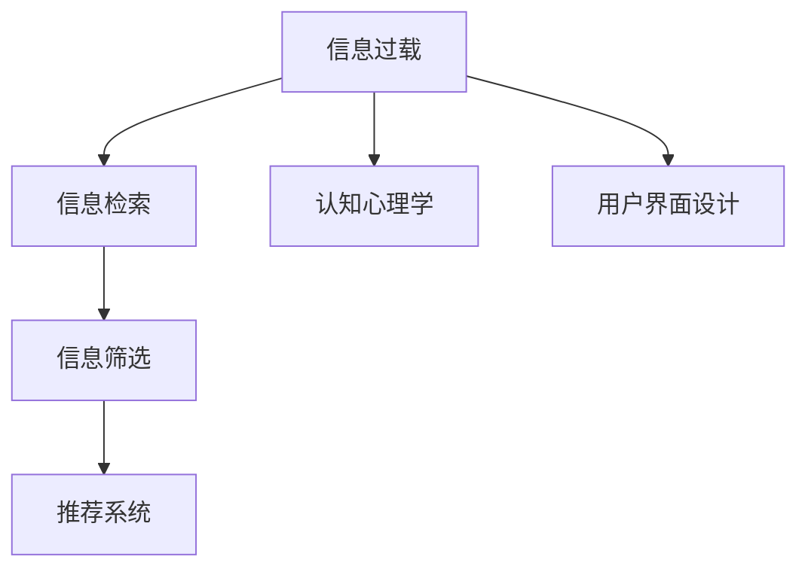

                 

## 1. 背景介绍

### 1.1 问题由来
在当今信息时代，信息洪流已成常态。无论是新闻、博客、视频，还是社交媒体和电子邮件，每天有无数的信息涌入我们的生活。这既带来了便利和新的知识，也带来了选择困难和信息过载的问题。在这海量的信息中，如何快速、有效地找到有价值的内容，已成为信息时代人们面临的重要挑战。

### 1.2 问题核心关键点
信息过载的问题核心在于我们如何在大量的信息中筛选出对我们有价值的、相关的内容。这不仅是一个技术问题，也是一个心理学和社会学的问题。有效筛选信息的能力，涉及到信息检索、认知心理学、人机交互等多个领域，是当今信息化社会的一项重要技能。

### 1.3 问题研究意义
掌握有效的信息筛选技能，对于个人效率提升、决策辅助和知识积累具有重要意义。它能够帮助我们快速获得所需信息，节省时间，提升工作和生活质量。同时，它也是信息时代数字素养的重要组成部分，是现代公民的基本技能。

## 2. 核心概念与联系

### 2.1 核心概念概述

为更好地理解如何在信息洪流中找到有价值的信息，本节将介绍几个关键概念：

- 信息过载(Information Overload)：指人们每天接收到的信息超出了其处理能力，导致无法有效地对信息进行筛选和利用。

- 信息检索(Information Retrieval)：通过计算机自动或半自动地检索、提取、组织和呈现相关信息的过程。

- 信息筛选(Information Filtering)：从大量的信息中，根据用户需求或预设规则，筛选出最有价值的信息。

- 推荐系统(Recommender Systems)：利用用户历史行为、兴趣偏好等数据，自动推荐相关内容的系统。

- 认知心理学(Cognitive Psychology)：研究人类感知、注意力、记忆等认知过程的科学，帮助我们理解如何更好地处理和利用信息。

- 用户界面(UI)设计：通过直观、易用的界面设计，提升信息筛选的效率和效果。

这些概念之间相互联系，共同构成了信息筛选的理论基础和技术框架。掌握这些概念，可以更好地理解信息筛选的本质和实践方法。

### 2.2 核心概念原理和架构的 Mermaid 流程图



这个流程图展示了信息过载、信息检索、信息筛选、推荐系统、认知心理学和用户界面设计之间的联系和作用。通过这些概念，我们可以构建一个完整的信息筛选框架。

## 3. 核心算法原理 & 具体操作步骤

### 3.1 算法原理概述

基于上述概念，信息筛选的算法原理可以概括为：

1. **信息检索**：通过自动化的技术手段，从海量信息中快速获取相关内容。

2. **信息筛选**：结合用户需求和兴趣，对检索到的内容进行筛选和排序，消除噪音，突出价值。

3. **推荐系统**：利用用户的历史行为和兴趣，推荐可能感兴趣的未被筛选出的内容，进一步丰富信息源。

4. **认知心理学**：理解用户的信息处理能力和心理特征，设计更符合用户需求的界面和算法。

5. **用户界面设计**：通过直观易用的界面，提升用户的操作体验，简化信息筛选流程。

### 3.2 算法步骤详解

以下是对信息筛选核心算法的详细步骤详解：

**Step 1: 信息检索**

1. **文本预处理**：对原始文本进行分词、去除停用词等处理，转换为机器可理解的形式。

2. **建立索引**：为处理后的文本建立索引，支持快速检索。

3. **检索算法**：使用倒排索引、向量空间模型等算法，根据查询词检索相关内容。

4. **结果排序**：根据相关性排序，如使用TF-IDF、BM25等方法。

**Step 2: 信息筛选**

1. **用户建模**：根据用户的历史行为、兴趣等信息，构建用户模型。

2. **筛选算法**：使用协同过滤、内容过滤等算法，从检索结果中筛选出符合用户需求的内容。

3. **展示界面**：设计直观易用的展示界面，如展示结果列表、关键词云图等。

4. **交互优化**：提供交互机制，如排序、过滤、搜索等，提升用户筛选效率。

**Step 3: 推荐系统**

1. **用户行为记录**：记录用户浏览、点击、评分等行为，作为推荐依据。

2. **模型训练**：使用机器学习模型，如协同过滤、内容基推荐、混合推荐等，训练推荐模型。

3. **推荐算法**：使用矩阵分解、邻域扩散等算法，生成推荐结果。

4. **展示界面**：将推荐结果与检索结果相结合，提供给用户。

### 3.3 算法优缺点

基于上述算法，信息筛选技术有以下优点：

1. **效率高**：通过自动化的信息检索和筛选，节省了大量手动操作的时间。

2. **覆盖广**：可以处理大规模的信息，并提供丰富的推荐内容。

3. **个性化强**：能够根据用户行为和兴趣，提供高度个性化的信息服务。

4. **动态适应**：能够实时更新用户模型和推荐结果，保持信息的及时性和相关性。

同时，该算法也存在一些局限性：

1. **数据依赖**：算法的准确性和效果依赖于数据的质量和完整性，数据不足或偏差会影响结果。

2. **过拟合风险**：个性化推荐容易导致“信息茧房”，用户可能陷入单一的信息视野中。

3. **算法复杂度**：复杂的算法需要高性能计算资源，可能会增加系统复杂性和维护成本。

4. **隐私风险**：收集和处理用户数据可能带来隐私泄露的风险。

5. **泛化能力**：算法在特定领域或场景下的泛化能力可能有限，难以处理未知或变化的数据。

### 3.4 算法应用领域

基于信息筛选的核心算法，其在多个领域有广泛的应用：

- **电子商务**：推荐商品、个性化广告、购物行为分析等。
- **内容平台**：推荐文章、视频、音乐等，提升用户体验。
- **新闻和信息服务**：推荐新闻、头条、专题等，提高信息获取效率。
- **社交媒体**：推荐好友、兴趣群组、帖子等，丰富社交网络内容。
- **教育培训**：推荐课程、教材、学习资源，提升学习效果。
- **健康医疗**：推荐诊疗方案、健康资讯，提升医疗服务质量。

这些应用领域展示了信息筛选技术在各个行业的重要性和影响力。

## 4. 数学模型和公式 & 详细讲解 & 举例说明

### 4.1 数学模型构建

信息筛选的数学模型可以分为多个子模型，包括信息检索模型、信息筛选模型和推荐模型。以下分别介绍这些模型的构建方法。

### 4.2 公式推导过程

**信息检索模型**：

假设我们有一个文本集 $D=\{d_1, d_2, ..., d_m\}$，其中 $d_i$ 表示一篇文档。我们的目标是找到与查询词 $q$ 相关的文档。通常使用向量空间模型(VSM)来表示文档和查询词，文档 $d_i$ 可以表示为一个向量 $v_{d_i} = (t_{d_i,1}, t_{d_i,2}, ..., t_{d_i,n})$，其中 $t_{d_i,j}$ 表示文档 $d_i$ 中第 $j$ 个词语的权重。查询词 $q$ 可以表示为向量 $v_q = (t_{q,1}, t_{q,2}, ..., t_{q,n})$。向量空间模型中，文档与查询词之间的相似度可以通过余弦相似度公式计算：

$$
\text{Similarity}(d_i, q) = \frac{v_{d_i} \cdot v_q}{\|v_{d_i}\| \cdot \|v_q\|}
$$

**信息筛选模型**：

信息筛选模型通常使用协同过滤和内容过滤两种方法。协同过滤方法基于用户的历史行为数据，通过计算用户之间的相似度来推荐内容。假设用户 $u_i$ 对 $n$ 个项目进行了评分 $r_{ui} = (r_{ui,1}, r_{ui,2}, ..., r_{ui,n})$，用户 $u_i$ 与用户 $u_j$ 之间的相似度可以表示为：

$$
\text{Similarity}_{ij} = \frac{\sum_{k=1}^{n} r_{uk} \cdot r_{jk}}{\sqrt{\sum_{k=1}^{n} r_{uk}^2} \cdot \sqrt{\sum_{k=1}^{n} r_{jk}^2}}
$$

基于用户 $u_i$ 和用户 $u_j$ 的相似度，我们可以推荐用户 $u_i$ 可能感兴趣的项目。

**推荐模型**：

推荐模型通常使用矩阵分解方法，如奇异值分解(SVD)，将用户与项目的评分矩阵 $R$ 分解为用户矩阵 $U$ 和项目矩阵 $V$ 的乘积，即 $R \approx U \cdot V$。推荐系统可以通过预测新用户对新项目的评分，来推荐新内容。假设我们有一个用户 $u_i$，对 $n$ 个项目 $p_j$ 的评分 $R_{ij}$，可以通过矩阵分解预测用户 $u_i$ 对新项目 $p_k$ 的评分 $R'_{ik}$，其中：

$$
R_{ij} \approx \sum_{r=1}^{r} U_{ir} \cdot V_{rj}
$$

通过计算 $R'_{ik} = \sum_{r=1}^{r} U_{ir} \cdot V_{rk}$，我们可以得到用户 $u_i$ 对新项目 $p_k$ 的评分预测。

### 4.3 案例分析与讲解

以下通过一个简单的信息筛选案例，来说明这些模型的实际应用。

假设我们有一个电商网站，用户 $u_i$ 对 $n$ 个商品进行了评分 $r_{ui} = (r_{ui,1}, r_{ui,2}, ..., r_{ui,n})$，网站希望推荐用户可能感兴趣的新商品。

1. **信息检索**：当用户 $u_i$ 搜索商品 $p_j$ 时，使用向量空间模型检索出相关的商品。

2. **信息筛选**：基于用户 $u_i$ 的历史评分和相似度，协同过滤模型推荐用户可能感兴趣的未被检索出的商品。

3. **推荐系统**：矩阵分解模型预测用户对新商品 $p_k$ 的评分，并将其推荐给用户。

通过这些模型的协同工作，电商平台能够高效地推荐商品，提升用户体验。

## 5. 项目实践：代码实例和详细解释说明

### 5.1 开发环境搭建

在进行信息筛选项目开发前，我们需要准备好开发环境。以下是使用Python进行开发的环境配置流程：

1. 安装Anaconda：从官网下载并安装Anaconda，用于创建独立的Python环境。

2. 创建并激活虚拟环境：
```bash
conda create -n info-filter-env python=3.8 
conda activate info-filter-env
```

3. 安装必要的库：
```bash
conda install numpy pandas scikit-learn scipy
```

4. 安装机器学习框架：
```bash
pip install scikit-learn tensorflow pytorch
```

5. 安装数据处理工具：
```bash
pip install seaborn matplotlib
```

完成上述步骤后，即可在`info-filter-env`环境中开始信息筛选项目的开发。

### 5.2 源代码详细实现

我们以下载的数据集为例，实现一个简单的信息检索和筛选系统。首先，我们下载Yahoo! News数据集，并对其中的新闻文章进行预处理和索引：

```python
import pandas as pd
from sklearn.feature_extraction.text import TfidfVectorizer

# 加载数据集
data = pd.read_csv('yahoonews.csv', sep=',', header=None)

# 预处理文本数据
def preprocess(text):
    return text.lower().replace('.', '').replace(',', '')

data['text'] = data[1].apply(preprocess)

# 构建TF-IDF索引
vectorizer = TfidfVectorizer()
X = vectorizer.fit_transform(data['text'])
```

然后，我们定义查询词，并使用TF-IDF模型检索相关的新闻：

```python
# 定义查询词
query = 'US politics'

# 计算查询词与文本的相似度
similarity = X.dot(vectorizer.transform([query]))
```

最后，我们使用协同过滤模型推荐相关的新闻：

```python
# 用户评分数据，假设我们已经获得用户对新闻的评分数据
user_ratings = pd.read_csv('user_ratings.csv', sep=',', header=None)

# 构建用户模型
def build_user_model(ratings):
    return ratings.values

user_model = build_user_model(user_ratings)

# 计算相似度
user_similarity = np.dot(user_model, user_model.T)

# 推荐新闻
def recommend_news(similarity, X):
    # 计算用户与新闻的相似度
    user_news_similarity = np.dot(similarity, X)
    
    # 计算新闻的平均用户相似度
    average_news_similarity = np.mean(user_news_similarity, axis=0)
    
    # 计算排序后的新闻列表
    news_list = np.argsort(average_news_similarity)[::-1]
    
    return news_list
```

通过上述代码，我们可以实现一个简单的信息检索和筛选系统。可以看到，信息筛选的核心在于数据预处理、相似度计算和用户模型构建。

### 5.3 代码解读与分析

让我们再详细解读一下关键代码的实现细节：

**preprocess函数**：
- 函数的主要作用是对文本进行预处理，包括转换为小写、去除标点符号等操作。

**TfidfVectorizer类**：
- 用于构建TF-IDF索引，将文本转换为向量表示，支持快速检索。

**查询词处理**：
- 将查询词转换为文本，并计算其与所有文本的相似度。

**用户评分数据**：
- 用户对新闻的评分数据，作为协同过滤模型的输入。

**build_user_model函数**：
- 将用户评分数据转换为模型表示，供协同过滤算法使用。

**user_similarity矩阵**：
- 计算用户之间的相似度，作为协同过滤的依据。

**recommend_news函数**：
- 根据用户与新闻的相似度，推荐可能感兴趣的新闻。

**代码展示界面**：
- 设计直观易用的展示界面，如列表、图表等，提升用户的操作体验。

## 6. 实际应用场景

### 6.1 智能推荐系统

信息筛选技术在智能推荐系统中得到了广泛应用。电商网站、视频平台、音乐平台等都利用信息检索和筛选技术，为用户提供个性化的推荐服务。例如，亚马逊通过分析用户的购买历史和评分数据，为用户推荐可能感兴趣的商品，提升用户的购物体验。

### 6.2 个性化阅读推荐

在新闻和信息服务中，信息筛选技术用于推荐用户感兴趣的新闻文章。例如，谷歌新闻、雅虎新闻等平台，根据用户的浏览历史和兴趣标签，推荐相关的新闻文章，提高信息获取效率。

### 6.3 社交网络内容推荐

在社交媒体中，信息筛选技术用于推荐用户可能感兴趣的内容。例如，Twitter、Facebook等社交平台，根据用户的互动数据（如点赞、转发、评论），推荐可能感兴趣的内容，提升用户体验。

### 6.4 在线广告推荐

在线广告平台利用信息筛选技术，为用户推荐相关的广告内容。例如，谷歌广告、Facebook广告等，根据用户的搜索历史和行为数据，推荐可能感兴趣的广告，提高广告点击率和转化率。

## 7. 工具和资源推荐

### 7.1 学习资源推荐

为了帮助开发者系统掌握信息筛选的理论基础和实践技巧，这里推荐一些优质的学习资源：

1. 《Python数据科学手册》：详细介绍Python在数据科学中的应用，涵盖信息检索和筛选的基本原理和实现方法。

2. 《推荐系统实战》：介绍推荐系统的理论和实践，涵盖协同过滤、内容基推荐、混合推荐等技术。

3. 《信息检索导论》：由著名信息检索专家撰写的教材，系统介绍信息检索的基本理论和算法。

4. 《深度学习与推荐系统》：介绍深度学习在推荐系统中的应用，涵盖神经网络、深度学习、推荐系统等前沿技术。

5. 《认知心理学与信息处理》：介绍认知心理学在信息处理中的应用，帮助理解用户的信息处理能力和心理特征。

6. 《自然语言处理综论》：介绍自然语言处理的基本原理和应用，涵盖信息检索和筛选的实例。

通过对这些资源的学习实践，相信你一定能够快速掌握信息筛选的精髓，并用于解决实际的NLP问题。

### 7.2 开发工具推荐

高效的开发离不开优秀的工具支持。以下是几款用于信息筛选开发的常用工具：

1. Python：基于动态语言的强大开发能力，支持快速迭代研究。

2. TensorFlow：Google开源的深度学习框架，支持高效的矩阵运算和模型训练。

3. PyTorch：Facebook开源的深度学习框架，支持灵活的动态计算图，适合科研和生产应用。

4. Scikit-learn：Python机器学习库，提供丰富的算法和工具，支持快速原型开发。

5. Elasticsearch：高效的分布式搜索引擎，支持大规模文本数据的高效索引和检索。

6. Apache Mahout：开源的机器学习库，提供协同过滤、推荐算法等工具。

合理利用这些工具，可以显著提升信息筛选任务的开发效率，加快创新迭代的步伐。

### 7.3 相关论文推荐

信息筛选技术的发展源于学界的持续研究。以下是几篇奠基性的相关论文，推荐阅读：

1. The Factorization Method for Matrix Data（矩阵分解方法）：提出奇异值分解(SVD)算法，用于推荐系统的矩阵分解。

2. Collaborative Filtering for Implicit Feedback Datasets（协同过滤）：提出协同过滤算法，利用用户的历史行为数据进行推荐。

3. A Survey on Recommendation System（推荐系统综述）：系统介绍推荐系统的理论基础和应用实例。

4. Information Retrieval Theory（信息检索理论）：由著名信息检索专家撰写的教材，系统介绍信息检索的基本理论和算法。

5. A Random Projection Algorithm for Near-Approximate Matrix Multiplication（随机投影算法）：提出随机投影算法，用于近似矩阵乘法，提高推荐系统的计算效率。

6. Multi-objective recommendation systems：介绍多目标推荐系统，结合用户多方面的需求进行推荐。

这些论文代表了大语言模型微调技术的发展脉络。通过学习这些前沿成果，可以帮助研究者把握学科前进方向，激发更多的创新灵感。

## 8. 总结：未来发展趋势与挑战

### 8.1 总结

本文对信息筛选方法进行了全面系统的介绍。首先阐述了信息过载的问题背景和研究意义，明确了信息检索、信息筛选、推荐系统、认知心理学和用户界面设计之间的联系和作用。其次，从原理到实践，详细讲解了信息筛选的数学模型和关键步骤，给出了信息筛选任务开发的完整代码实例。同时，本文还广泛探讨了信息筛选方法在电子商务、内容平台、新闻信息服务、社交媒体和在线广告等多个行业领域的应用前景，展示了信息筛选技术的巨大潜力。最后，本文精选了信息筛选技术的各类学习资源，力求为读者提供全方位的技术指引。

通过本文的系统梳理，可以看到，信息筛选技术在解决信息过载问题上发挥了重要作用，能够快速、有效地找到有价值的信息。未来，随着技术的发展和应用场景的拓展，信息筛选将带来更多创新和价值，成为信息时代不可或缺的重要工具。

### 8.2 未来发展趋势

展望未来，信息筛选技术将呈现以下几个发展趋势：

1. **自动化程度提高**：随着人工智能技术的发展，信息筛选将越来越依赖自动化的算法和模型，提升筛选效率和准确性。

2. **个性化推荐增强**：利用用户行为数据和机器学习算法，提供更加个性化、精准的推荐服务。

3. **多模态数据融合**：融合视觉、听觉、文本等多种模态的数据，提升信息筛选的全面性和准确性。

4. **交互界面优化**：设计更加直观易用的用户界面，提升用户的操作体验和满意度。

5. **隐私保护加强**：在推荐和检索过程中，加强用户数据的保护，避免隐私泄露和滥用。

6. **跨领域应用扩展**：将信息筛选技术应用于更多领域，如医疗、金融、教育等，带来更多的应用场景和价值。

### 8.3 面临的挑战

尽管信息筛选技术已经取得了显著进展，但在迈向更加智能化、普适化应用的过程中，它仍面临着诸多挑战：

1. **数据质量和多样性**：高质量、多样化的数据是信息筛选的基础，但获取和处理大规模高质量数据仍然具有挑战。

2. **算法复杂性和效率**：复杂的算法需要高性能计算资源，且在大规模数据上的效率仍有待提高。

3. **用户隐私和安全**：用户数据的隐私保护和安全性是一个重要的课题，如何在提升推荐效果的同时，保护用户隐私，避免数据滥用。

4. **模型泛化能力**：信息筛选模型在不同领域和场景下的泛化能力有限，难以处理未知或变化的数据。

5. **系统可解释性和透明性**：信息筛选系统的决策过程缺乏可解释性，难以对其推理逻辑进行分析和调试。

### 8.4 研究展望

面对信息筛选面临的这些挑战，未来的研究需要在以下几个方面寻求新的突破：

1. **数据获取和处理**：开发自动化的数据获取和处理工具，提升数据质量和多样性。

2. **算法优化**：优化推荐和检索算法，提高计算效率和效果。

3. **隐私保护技术**：开发隐私保护技术，保障用户数据的隐私和安全。

4. **跨领域应用**：将信息筛选技术应用于更多领域，提升各领域的智能化水平。

5. **可解释性增强**：研究可解释性算法和工具，提升信息筛选系统的透明性和可理解性。

这些研究方向的探索，必将引领信息筛选技术迈向更高的台阶，为信息时代带来更多的创新和价值。面向未来，信息筛选技术还需要与其他人工智能技术进行更深入的融合，如知识表示、因果推理、强化学习等，共同推动信息处理系统的进步。

## 9. 附录：常见问题与解答

**Q1：信息筛选技术是否适用于所有领域？**

A: 信息筛选技术在大多数领域都能得到应用，但不同领域的信息需求和数据特点各异，需要针对性地进行设计和优化。例如，在金融领域，需要考虑实时性和风险控制；在医疗领域，需要考虑数据隐私和专业性。

**Q2：信息筛选算法的准确性如何保证？**

A: 信息筛选算法的准确性依赖于数据的质量和多样性。需要确保数据集的多样性和代表性，避免算法过拟合。同时，通过A/B测试、用户反馈等方式，不断优化算法，提升筛选效果。

**Q3：信息筛选系统如何应对数据噪声？**

A: 信息筛选系统通过数据预处理和特征选择，去除数据中的噪声。例如，使用TF-IDF、词频统计等方法，过滤掉高频低价值的词语。同时，引入过滤机制，去除无关的推荐内容。

**Q4：如何设计用户界面，提升信息筛选体验？**

A: 设计直观易用的用户界面是提升信息筛选体验的关键。可以通过交互式设计、可视化展示、推荐结果的多样化展示等方式，提升用户的操作体验。

**Q5：如何平衡信息筛选的个性化和通用性？**

A: 在信息筛选过程中，需要平衡个性化和通用性。可以通过动态调整推荐算法和模型参数，根据用户的行为和兴趣进行个性化推荐，同时保持对通用性的关注，避免“信息茧房”。

这些问题的解答，可以帮助我们更好地理解信息筛选技术的实际应用和优化方法，提升信息处理和利用的效率和效果。总之，信息筛选技术需要在技术、算法、用户界面等多个维度进行全面优化，才能真正解决信息过载问题，为用户带来更好的体验和价值。

