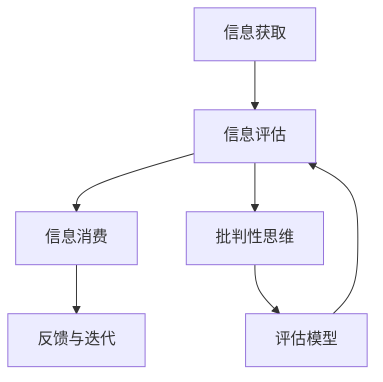

                 

# 信息过载与信息质量评估策略：批判性地评估和消费信息

> 关键词：信息过载,信息质量评估,批判性思维,信息消费策略,可信度,权威性

## 1. 背景介绍

在当今数字化时代，信息获取渠道日益多样化，人们被各种数据和信息淹没，呈现出信息过载的现象。信息过载不仅导致认知负担增加，还可能造成信息误导、决策失误等问题。因此，批判性地评估和消费信息变得尤为重要。本博文旨在介绍信息质量评估的策略，帮助读者在信息泛滥的时代中，能辨别信息的真伪，作出合理、科学的决策。

### 1.1 信息过载问题的产生

信息过载的根本原因是信息量的急剧增加和信息获取渠道的广泛化。随着互联网、社交媒体、移动终端等技术的普及，人们可以随时随地获取到海量的信息。但这些信息并非都是高质量、真实可信的，如何过滤和筛选信息，成为人们面临的一大挑战。

### 1.2 信息质量的重要性

高质量的信息对决策、知识更新、创新等方面具有重要意义。在商业、科研、教育等多个领域，信息的准确性、权威性、时效性等都是决策的关键因素。因此，提升信息质量评估能力，可以有效降低信息过载的影响，提高信息消费的效率和质量。

## 2. 核心概念与联系

### 2.1 核心概念概述

在信息质量评估的框架中，涉及以下几个核心概念：

- **信息过载**：指信息量超出个人或系统的处理能力，导致信息接收和处理困难的现象。
- **信息质量**：指信息的准确性、真实性、权威性、完整性等属性。
- **信息消费**：指人们接收、加工、利用信息的过程。
- **批判性思维**：指在获取、评估和消费信息时，保持怀疑和审慎的态度，主动思考、辨别真伪的能力。
- **可信度**：指信息源的可靠性、真实性、透明性等。

这些概念之间存在着紧密的联系。信息过载增加了信息质量评估的难度，但高质量的信息消费又依赖于有效评估和筛选信息的能力。批判性思维是信息质量评估的基础，通过提升个人的批判性思维能力，可以有效减少信息误导，提升信息消费的效能。

### 2.2 Mermaid 流程图

以下是一个关于信息质量评估的简单 Mermaid 流程图，展示了信息获取、评估、消费的基本流程：



这个流程图展示了信息质量评估的基本流程：
1. 获取信息：通过多种渠道获取信息。
2. 信息评估：使用评估模型和批判性思维评估信息的真实性、权威性等。
3. 信息消费：根据评估结果，选择并消费信息。
4. 反馈迭代：根据信息消费结果，调整信息评估模型和策略。

## 3. 核心算法原理 & 具体操作步骤

### 3.1 算法原理概述

信息质量评估的算法原理可以简单概括为：
1. 使用评估模型对信息进行初步筛选和打分。
2. 结合批判性思维，对评估结果进行进一步的人工审核和评估。
3. 根据评估结果和用户反馈，动态调整评估模型，提升信息质量评估的准确性。

### 3.2 算法步骤详解

以下是信息质量评估算法的基本步骤：

**Step 1: 信息获取**

- 收集各类信息，包括新闻、论文、报告、社交媒体帖子等。
- 使用爬虫、RSS订阅、API接口等技术，自动获取信息。

**Step 2: 信息评估**

- 使用预设的评估模型对信息进行打分，评估维度包括可信度、权威性、时效性、相关性等。
- 结合批判性思维，对初步评估结果进行人工审核，调整打分结果。

**Step 3: 信息消费**

- 根据打分结果，选择高评估得分的信息进行消费。
- 对于高权威性和时效性的信息，优先消费。

**Step 4: 反馈与迭代**

- 记录信息消费的结果和反馈，定期更新评估模型。
- 利用用户反馈，不断优化评估算法和打分模型。

### 3.3 算法优缺点

**优点**：
- 使用预设的评估模型，可以快速筛选和评估信息。
- 结合批判性思维，人工审核可以进一步提升评估准确性。
- 动态调整评估模型，适应不断变化的信息环境。

**缺点**：
- 预设评估模型可能存在偏见，需要定期更新。
- 人工审核需要时间，且个体差异大，可能影响效率。
- 信息评估模型的选择和设计需要专业知识，可能存在难度。

### 3.4 算法应用领域

信息质量评估技术广泛应用于以下领域：

1. **新闻媒体**：新闻网站和社交媒体平台，通过信息质量评估技术，提高新闻信息的真实性和可信度。
2. **科学研究**：学术机构和研究人员，使用评估模型筛选高质量的研究论文，避免低质量文献的误导。
3. **商业决策**：企业在进行市场调研、产品开发、客户分析时，信息质量评估技术可以提升决策的准确性。
4. **教育培训**：学校和培训机构，使用评估模型筛选优质的教学资源，提升教学质量。
5. **政策制定**：政府和公共机构，评估信息源的真实性和权威性，为政策制定提供依据。

## 4. 数学模型和公式 & 详细讲解 & 举例说明

### 4.1 数学模型构建

假设信息 $I$ 的评估维度有 $k$ 个，分别为 $D_1, D_2, \ldots, D_k$。每个维度 $D_i$ 的评估函数为 $f_i(I)$，输出范围为 $[0,1]$。综合评估函数 $F(I)$ 为：

$$
F(I) = \frac{1}{k} \sum_{i=1}^{k} f_i(I)
$$

### 4.2 公式推导过程

以可信度为例，可信度评估函数 $f_{trust}(I)$ 可以根据信息源的类型、历史表现、权威性等进行计算。可信度得分越高，表示信息源越可靠。

假设可信度评估函数 $f_{trust}(I)$ 可以分解为多个子功能 $f_{trust}(I) = f_{domain}(I) + f_{source}(I) + f_{content}(I)$，其中 $f_{domain}(I)$ 表示信息源所在领域的权威性，$f_{source}(I)$ 表示信息源本身的可信度，$f_{content}(I)$ 表示信息内容的真实性。

假设各子功能具有相同的权重 $w$，则综合评估函数 $F_{trust}(I)$ 为：

$$
F_{trust}(I) = w \left( f_{domain}(I) + f_{source}(I) + f_{content}(I) \right)
$$

### 4.3 案例分析与讲解

假设我们要评估一篇新闻报道 $I$ 的可信度。步骤如下：

1. 通过爬虫获取新闻的标题、作者、发布时间、引用来源等信息。
2. 根据信息源的领域权威性 $f_{domain}(I)$，对新闻的可信度进行初步评估。
3. 根据信息源本身的可信度 $f_{source}(I)$，进一步调整可信度评分。
4. 分析新闻内容，识别出引用信息 $f_{content}(I)$，并验证其真实性。
5. 综合上述评估结果，计算新闻的可信度得分 $F_{trust}(I)$。

## 5. 项目实践：代码实例和详细解释说明

### 5.1 开发环境搭建

为了实现信息质量评估功能，我们需要搭建一个 Python 开发环境。以下是具体的步骤：

1. 安装 Python 3.x 版本。
2. 安装必要的 Python 包，如 `requests`、`BeautifulSoup`、`pandas`、`scikit-learn` 等。
3. 安装信息质量评估模型的训练和评估工具，如 Scikit-learn 等。
4. 安装 Web 服务器，如 Flask 等，用于部署评估模型。

### 5.2 源代码详细实现

以下是一个简单的信息质量评估模型的代码实现：

```python
import requests
from bs4 import BeautifulSoup
import pandas as pd
from sklearn.ensemble import RandomForestRegressor
from sklearn.feature_extraction.text import TfidfVectorizer
from sklearn.metrics import mean_squared_error

# 构建新闻信息的数据集
data = pd.read_csv('news_dataset.csv')

# 构建评估特征
features = ['domain', 'source', 'title', 'content']
X = data[features]
y = data['trust_score']

# 训练信息质量评估模型
vectorizer = TfidfVectorizer(stop_words='english')
X = vectorizer.fit_transform(X)

model = RandomForestRegressor(n_estimators=100)
model.fit(X, y)

# 评估模型性能
X_test = vectorizer.transform(data[['title', 'content']])
y_pred = model.predict(X_test)
mse = mean_squared_error(y, y_pred)
print(f'模型均方误差：{mse:.4f}')
```

### 5.3 代码解读与分析

**数据准备**：
- 使用 Pandas 读取新闻数据集，提取标题、作者、发布时间、引用来源等特征。
- 使用 TfidfVectorizer 对文本进行向量化处理。

**模型训练**：
- 使用 Scikit-learn 的 RandomForestRegressor 构建评估模型。
- 使用均方误差 (Mean Squared Error) 评估模型性能。

**模型应用**：
- 对新的新闻信息进行向量化处理。
- 使用训练好的模型对新闻的可信度进行预测。

### 5.4 运行结果展示

运行代码后，输出模型在测试集上的均方误差，展示模型的预测性能。

## 6. 实际应用场景

### 6.1 新闻媒体

新闻媒体通过信息质量评估技术，可以提升新闻报道的真实性和可信度。例如，利用信息质量评估模型，筛选出高可信度的新闻报道，并将其推荐给用户。

### 6.2 科学研究

学术机构和研究人员通过信息质量评估技术，可以识别和引用高质量的学术文献。例如，使用评估模型筛选高质量的研究论文，避免低质量文献的误导。

### 6.3 商业决策

企业在进行市场调研、产品开发、客户分析时，信息质量评估技术可以提升决策的准确性。例如，评估社交媒体上的用户反馈，筛选高质量的信息，优化产品设计。

### 6.4 教育培训

学校和培训机构通过信息质量评估技术，可以筛选优质的教学资源，提升教学质量。例如，使用评估模型筛选高质量的在线课程和教学视频，提供给学生学习。

### 6.5 政策制定

政府和公共机构通过信息质量评估技术，评估信息源的真实性和权威性，为政策制定提供依据。例如，评估公共健康信息的质量，确保防疫政策的科学性和有效性。

## 7. 工具和资源推荐

### 7.1 学习资源推荐

为了帮助开发者系统掌握信息质量评估的理论基础和实践技巧，这里推荐一些优质的学习资源：

1. **《信息素养导论》**：介绍信息质量评估的基本概念和评估模型，适合初学者入门。
2. **《批判性思维：信息素养与信息消费》**：深入探讨信息质量评估和批判性思维的重要性，适合进阶学习。
3. **Coursera《信息检索与信息素养》课程**：由斯坦福大学开设，涵盖信息质量评估的基本方法和工具。
4. **Google Scholar《信息检索》论文**：大量关于信息质量评估的研究论文，涵盖信息检索、信息素养等多个领域。

### 7.2 开发工具推荐

开发信息质量评估工具需要选择合适的开发环境和工具。以下是推荐的开发工具：

1. **Python**：简单易用的编程语言，适合快速迭代开发。
2. **Flask**：轻量级的 Web 框架，适合构建信息质量评估模型的部署服务。
3. **TensorFlow**：强大的深度学习框架，适合构建复杂的评估模型。
4. **Scikit-learn**：流行的机器学习库，适合构建信息质量评估的分类和回归模型。

### 7.3 相关论文推荐

信息质量评估技术的发展离不开学界的持续研究。以下是几篇奠基性的相关论文，推荐阅读：

1. **《信息质量评估模型：方法与实证》**：介绍信息质量评估模型的基本原理和实现方法。
2. **《批判性思维与信息素养：理论与实践》**：深入探讨批判性思维在信息消费中的应用。
3. **《信息检索中的信息质量评估：方法与系统》**：综述信息检索领域的信息质量评估技术。
4. **《信息素养教育：方法与实践》**：介绍信息素养教育的基本概念和方法。

## 8. 总结：未来发展趋势与挑战

### 8.1 研究成果总结

本文对信息质量评估技术进行了全面系统的介绍，从信息过载问题到信息质量评估模型的构建，再到实际应用场景的探讨。通过系统梳理，展示了信息质量评估技术的核心思想和实施方法。

### 8.2 未来发展趋势

展望未来，信息质量评估技术将呈现以下几个发展趋势：

1. **智能化信息筛选**：使用深度学习、自然语言处理等技术，提升信息质量评估的准确性和自动化程度。
2. **跨领域应用扩展**：信息质量评估技术将从新闻媒体、科学研究等领域，扩展到更多垂直行业，如金融、法律、医疗等。
3. **多模态信息融合**：将文本、图像、视频等不同类型的信息进行融合，提升信息质量评估的全面性和准确性。
4. **实时动态更新**：利用实时数据流和动态更新机制，提升信息质量评估的实时性和适应性。
5. **用户交互优化**：通过用户反馈和交互优化，提升信息质量评估模型的性能和用户体验。

### 8.3 面临的挑战

尽管信息质量评估技术已经取得了显著进展，但在实践中仍面临以下挑战：

1. **信息源多样性**：信息源类型复杂多样，评估模型难以全面覆盖。
2. **评估模型偏见**：预设的评估模型可能存在偏见，影响评估结果的公正性。
3. **数据隐私问题**：评估模型需要大量数据支持，如何保护用户隐私成为一大挑战。
4. **计算资源消耗**：评估模型可能消耗大量计算资源，影响系统性能。
5. **人机交互复杂性**：用户反馈和交互复杂，如何设计简单、易用的界面和交互机制，提升用户体验。

### 8.4 研究展望

面对信息质量评估技术的挑战，未来的研究需要在以下几个方面寻求新的突破：

1. **多模态信息质量评估**：研究跨模态信息质量评估模型，提升评估的全面性和准确性。
2. **用户反馈机制设计**：设计简单、易用的用户反馈机制，提升信息质量评估的实时性和动态性。
3. **隐私保护技术应用**：引入隐私保护技术，确保评估模型的数据安全和使用合规。
4. **模型优化与解释**：优化信息质量评估模型，提升其性能和可解释性，增强用户信任。
5. **跨领域应用研究**：研究信息质量评估技术在更多垂直领域的应用，提升其普适性和实用性。

## 9. 附录：常见问题与解答

**Q1: 什么是信息质量评估？**

A: 信息质量评估是指对信息的真实性、权威性、完整性、时效性等属性进行评估和筛选的过程。通过评估模型的构建和应用，可以识别和过滤低质量的信息，提升信息消费的效率和质量。

**Q2: 信息质量评估模型有哪些？**

A: 常见的信息质量评估模型包括基于规则的评估模型、基于统计的评估模型、基于机器学习的评估模型等。这些模型通过不同的算法和特征选择，对信息进行评估和打分。

**Q3: 如何构建信息质量评估模型？**

A: 构建信息质量评估模型需要以下步骤：
1. 收集和标注信息源数据，构建训练集和测试集。
2. 选择或设计评估模型，定义评估维度和指标。
3. 对信息源进行特征提取和向量化处理。
4. 使用训练集训练评估模型，并使用测试集进行验证和调参。
5. 对新的信息源进行评估和打分，提供高质量的信息推荐。

**Q4: 信息质量评估对决策有什么影响？**

A: 高质量的信息质量评估可以显著提升决策的科学性和准确性。例如，在商业决策中，使用信息质量评估技术，筛选出高可信度的市场调研报告，避免基于低质量信息的决策失误。

**Q5: 信息质量评估如何应对信息过载？**

A: 信息质量评估可以通过筛选和过滤信息，帮助用户快速获取高质量的信息，缓解信息过载问题。例如，利用信息质量评估技术，自动筛选和推荐高可信度的信息源，减少用户的信息负担。

---

作者：禅与计算机程序设计艺术 / Zen and the Art of Computer Programming

