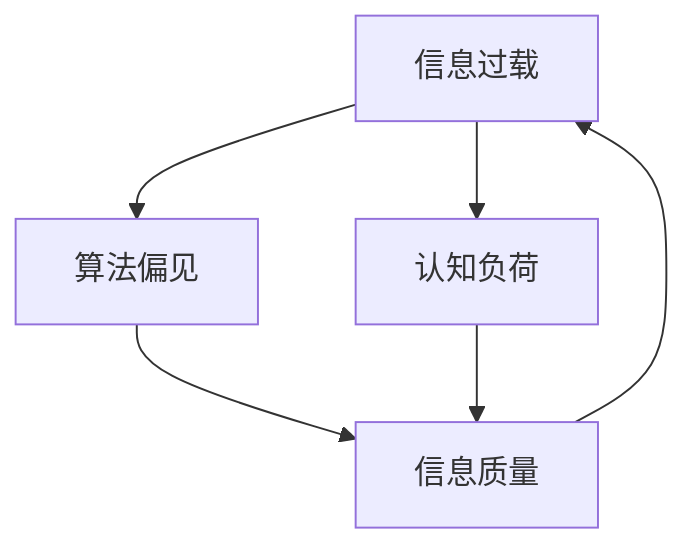

                 

# 信息过载与信息质量评估：批判性地消费和评估信息

> 关键词：信息过载, 信息质量评估, 大数据, 人工智能, 认知负荷, 算法偏见, 信息素养

## 1. 背景介绍

### 1.1 问题由来

信息时代的来临，伴随而来的是海量信息的无限制扩张。我们不仅处于信息爆炸的时代，更是信息过载的时代。传统的以报纸、电视等媒介为主的信息传播方式，已逐渐被社交媒体、新闻聚合网站、搜索引擎、以及各种APP所取代。这些新型信息传播平台，以其高效、便捷的传播方式，迅速走进了人们的生活。

但是，信息的传播和获取变得越发容易，也使得人们日益陷入了信息过载的困境。在信息洪流中，如何批判性地消费和评估信息，成为了我们每个人都需要面对的挑战。过量、杂乱的信息，不仅分散了我们的注意力，还可能误导我们的判断，甚至带来认知负荷、引发焦虑。

与此同时，在信息传播的过程中，算法偏见、信息茧房、假信息等问题的出现，进一步加剧了信息的复杂性和不确定性。如何在海量的信息中，提取真实、有用的信息，也成为当前信息时代亟待解决的重要课题。

本文旨在系统地介绍信息过载现象及其实际影响，并对信息质量评估与批判性消费的策略进行深入探讨。通过剖析信息过载的原因和现状，我们不仅能够清晰认识到问题的所在，还能掌握更加科学合理的信息消费和评估方式，以更好地适应信息社会的生活和工作节奏。

## 2. 核心概念与联系

### 2.1 核心概念概述

在深入讨论信息过载及信息质量评估的问题前，我们先需要明确几个核心概念：

- **信息过载**：是指在信息传输的速度和规模不断增加的情况下，个人或系统接收到的信息量超过其处理能力的状态。常见表现包括注意力分散、决策困难、认知负担增加等。
- **信息质量评估**：指基于一定的标准和评估方法，对信息的真实性、有用性、时效性等特征进行判断和评价的过程。
- **大数据**：指规模超出传统数据库处理能力的数据集合，通常指规模在10TB以上的数据集。大数据技术的出现，使得信息的获取、存储、处理变得更加便捷和高效。
- **人工智能**：基于计算机科学和数据科学，利用算法和机器学习技术，实现信息自动获取、分析和应用的技术。AI在信息过载问题中扮演着重要角色。
- **认知负荷**：指在处理信息时，由于信息复杂度增加、需要持续关注信息动态，给个人认知系统带来的负担。信息过载会导致认知负荷增加，影响决策和注意力分配。
- **算法偏见**：指数据和算法在处理信息时，由于数据不平衡、算法逻辑缺陷等原因，对特定群体或信息源存在系统性倾向。算法偏见会影响信息质量，误导决策。

以上概念间存在相互影响的关系：信息过载会增加认知负荷，算法偏见会影响信息质量，信息质量低下会进一步加剧信息过载，从而形成恶性循环。

### 2.2 核心概念的相互联系

这些核心概念间的关系，可以通过以下Mermaid流程图来展示：



这个流程图展示了几者间的相互关系：

1. **信息过载**直接影响**认知负荷**，造成信息处理困难。
2. **算法偏见**会导致**信息质量**的降低，误导认知。
3. **信息质量**低下又会加剧**信息过载**，形成恶性循环。

因此，应对信息过载，提升信息质量，是当前信息时代的重要课题。

## 3. 核心算法原理 & 具体操作步骤

### 3.1 算法原理概述

信息过载与信息质量评估的算法，主要基于以下原理：

- **信息筛选算法**：通过机器学习、深度学习等算法，对信息进行筛选和分类，剔除无用和误导信息，保留真实、有用的信息。
- **认知负荷评估算法**：利用认知心理学原理，对用户的信息处理能力进行评估，计算认知负荷值，并给出相应的策略建议。
- **信息质量评估算法**：基于自然语言处理、文本挖掘等技术，对信息的真实性、可信度、时效性等进行综合评估，生成评估报告。
- **算法偏见检测与纠正算法**：利用对抗学习等技术，检测和纠正算法中存在的偏见，确保算法公平性和透明度。

### 3.2 算法步骤详解

#### 3.2.1 信息筛选算法

1. **数据预处理**：收集和整理信息数据，清洗掉重复、无关、低质量的数据。
2. **特征提取**：利用NLP技术，提取信息中的关键词、主题等特征，为后续筛选提供基础。
3. **模型训练**：选择或设计合适的算法模型（如TF-IDF、LDA、BERT等），基于标注数据进行训练。
4. **筛选与分类**：对新信息进行输入，通过训练好的模型进行筛选和分类，筛选出高质量信息。

#### 3.2.2 认知负荷评估算法

1. **用户行为监测**：实时监测用户在信息消费过程中的行为数据，如点击、阅读、点赞、评论等。
2. **认知负荷计算**：基于心理学原理，设计认知负荷评估模型，计算用户的认知负荷值。
3. **负荷阈值设定**：根据用户的认知负荷值，设定阈值，判断当前是否处于过载状态。
4. **建议生成**：根据负荷阈值，生成减轻认知负荷的策略，如休息、调整关注点、简化信息内容等。

#### 3.2.3 信息质量评估算法

1. **信息预处理**：对信息进行去噪、去重、分词等预处理操作。
2. **特征提取**：利用TF-IDF、LDA等方法，提取信息关键词、主题、来源等特征。
3. **质量评估**：基于各种评估指标（如可信度、真实性、时效性等），对信息质量进行评估。
4. **报告生成**：生成详细的评估报告，对信息进行综合分析与反馈。

#### 3.2.4 算法偏见检测与纠正算法

1. **数据预处理**：清洗数据集，剔除偏见数据，平衡数据集。
2. **偏见检测**：设计偏见检测算法，如对抗生成网络（GAN）等，检测模型中是否存在系统性偏见。
3. **纠正策略**：设计纠正策略，如数据重采样、对抗训练、公平性约束等，减少算法偏见。
4. **模型验证**：通过验证数据集，评估偏见纠正的效果，进一步优化模型。

### 3.3 算法优缺点

#### 3.3.1 信息筛选算法的优缺点

**优点**：
- 提高信息获取效率，筛选出高质量、有价值的信息。
- 节省用户信息处理时间，减轻认知负荷。
- 通过算法模型，可以自动处理大量信息，提升效率。

**缺点**：
- 算法模型可能存在过拟合或欠拟合问题。
- 无法完全消除信息偏见，仍可能误判某些重要信息。
- 需要大量标注数据进行训练，数据获取成本较高。

#### 3.3.2 认知负荷评估算法的优缺点

**优点**：
- 实时监测用户状态，及时发现过载情况，调整信息消费策略。
- 个性化推荐，根据用户负荷水平，推荐适合的信息。
- 提升用户的信息处理效率，减轻心理压力。

**缺点**：
- 数据隐私和安全问题，如何保护用户行为数据是个挑战。
- 认知负荷评估模型复杂度较高，需要更多研究支撑。
- 无法预测用户未来的负荷变化，存在预测误差。

#### 3.3.3 信息质量评估算法的优缺点

**优点**：
- 系统化、科学化的评估方法，提升信息质量判断的准确性。
- 基于大数据分析，保证信息评估的全面性。
- 提升用户信息素养，避免误导性信息影响。

**缺点**：
- 质量评估模型复杂，训练成本较高。
- 评估指标设定复杂，需考虑多方面因素。
- 无法实时评估新发布信息，存在信息滞后。

#### 3.3.4 算法偏见检测与纠正算法的优缺点

**优点**：
- 检测和纠正算法偏见，提升算法的公平性和透明度。
- 优化模型训练，减少算法偏差带来的影响。
- 提升用户对信息系统的信任度。

**缺点**：
- 偏见检测技术尚不成熟，存在误检和漏检风险。
- 偏见纠正技术难度较大，需要持续优化。
- 模型复杂度较高，训练和应用成本高。

### 3.4 算法应用领域

信息过载与信息质量评估算法，已经广泛应用于多个领域，如：

- **新闻业**：新闻聚合平台如谷歌新闻、今日头条等，利用信息筛选和质量评估算法，提升新闻内容质量，减少用户信息过载。
- **社交媒体**：平台如Facebook、Twitter等，利用认知负荷评估算法，个性化推荐信息内容，减轻用户负担。
- **金融业**：投资公司利用大数据分析和算法偏见检测，评估市场信息真实性，降低投资风险。
- **教育业**：在线教育平台如Coursera、Udacity等，利用信息筛选和质量评估，推荐高质量学习资源。
- **医疗业**：医疗信息平台如Zocdoc、WebMD等，利用信息筛选和质量评估，推荐可靠的医疗信息。

## 4. 数学模型和公式 & 详细讲解 & 举例说明

### 4.1 数学模型构建

本节将使用数学语言对信息过载及信息质量评估的算法进行更加严格的刻画。

- **信息筛选算法**：通过TF-IDF、LDA等算法，提取信息的关键词和主题。信息的质量可通过TF-IDF值、主题分布等特征进行评估。
- **认知负荷评估算法**：基于认知负荷模型（Cognitive Load Model, CLM），设计信息处理时间、信息复杂度等特征，计算认知负荷值。
- **信息质量评估算法**：通过自然语言处理技术，对信息真实性、可信度、时效性等进行综合评估，生成评估报告。
- **算法偏见检测与纠正算法**：通过对抗生成网络（GAN）等技术，检测模型中是否存在偏见，并利用公平性约束等方法进行纠正。

### 4.2 公式推导过程

#### 4.2.1 信息筛选算法

假设我们有一个包含N条信息的信息集 $\mathcal{D}$，每条信息表示为一个文本串 $d_i$。使用TF-IDF算法，可以得到每条信息的关键词向量 $v_i$，其中：

$$v_i = \text{TF-IDF}(d_i)$$

TF-IDF值的计算公式如下：

$$TF(t,d) = \frac{\text{词频}(t,d)}{\text{总词频}(d)}$$
$$IDF(t,\mathcal{D}) = \log|\mathcal{D}| / \sum_{d \in \mathcal{D}} \text{词频}(t,d)$$
$$TF-IDF(t,d) = TF(t,d) * IDF(t,\mathcal{D})$$

其中 $TF(t,d)$ 表示词 $t$ 在文档 $d$ 中的词频，$IDF(t,\mathcal{D})$ 表示词 $t$ 在信息集 $\mathcal{D}$ 中的逆文档频率。

使用LDA算法，可以得到每条信息的主题分布 $z_i$，其中：

$$z_i = \text{LDA}(d_i)$$

LDA模型中，每条信息 $d_i$ 可以表示为 $K$ 个主题 $z_{ik}$ 的分布。因此，信息的质量可通过TF-IDF值和主题分布进行综合评估：

$$Q_i = \text{Sum of TF-IDF values} + \text{Sum of top K LDA scores}$$

#### 4.2.2 认知负荷评估算法

假设用户在某段时间内的信息处理时间为 $T$，阅读信息的时间为 $R$，浏览信息的时间为 $B$，点击信息的时间为 $C$。认知负荷 $L$ 可通过以下公式计算：

$$L = \frac{R}{T} + \frac{B}{T} + \frac{C}{T}$$

其中，$R$ 表示阅读信息的时间，$B$ 表示浏览信息的时间，$C$ 表示点击信息的时间。

#### 4.2.3 信息质量评估算法

假设信息集 $\mathcal{D}$ 中的信息 $d_i$ 的真实性 $T_i$、可信度 $C_i$ 和时效性 $T_i$，可以通过专家评估、数据分析等方法获取。信息质量 $Q_i$ 可通过以下公式计算：

$$Q_i = \text{Weighted Sum of } T_i, C_i, \text{ and } T_i$$

其中，权重系数可根据实际情况设定，如真实性权重为0.5，可信度权重为0.3，时效性权重为0.2。

#### 4.2.4 算法偏见检测与纠正算法

假设算法模型 $M$ 在数据集 $\mathcal{D}$ 上的偏见度 $B$ 可通过以下公式计算：

$$B = \text{Sum of } (b_{ik} - \text{Fairness Constraint})$$

其中，$b_{ik}$ 表示模型 $M$ 在数据集 $\mathcal{D}$ 上对信息 $d_i$ 的主题 $z_{ik}$ 的预测值，公平性约束 $Fairness Constraint$ 表示模型在公平性方面的约束条件。

## 5. 项目实践：代码实例和详细解释说明

### 5.1 开发环境搭建

在进行信息过载与信息质量评估的项目实践前，我们需要准备好开发环境。以下是使用Python进行TensorFlow开发的环境配置流程：

1. 安装Anaconda：从官网下载并安装Anaconda，用于创建独立的Python环境。

2. 创建并激活虚拟环境：
```bash
conda create -n tf-env python=3.8 
conda activate tf-env
```

3. 安装TensorFlow：根据CUDA版本，从官网获取对应的安装命令。例如：
```bash
pip install tensorflow tensorflow-addons tensorflow-datasets
```

4. 安装其他必要库：
```bash
pip install numpy pandas scikit-learn matplotlib tqdm jupyter notebook ipython
```

完成上述步骤后，即可在`tf-env`环境中开始项目实践。

### 5.2 源代码详细实现

下面我们以新闻业的信息筛选与质量评估为例，给出使用TensorFlow进行信息筛选与质量评估的代码实现。

首先，定义信息的数据处理函数：

```python
import tensorflow as tf
from tensorflow.keras.preprocessing.text import Tokenizer
from tensorflow.keras.preprocessing.sequence import pad_sequences

def preprocess_text(texts, max_len=100):
    tokenizer = Tokenizer(oov_token='<OOV>')
    tokenizer.fit_on_texts(texts)
    sequences = tokenizer.texts_to_sequences(texts)
    padded_sequences = pad_sequences(sequences, maxlen=max_len, padding='post', truncating='post')
    return padded_sequences
```

然后，定义信息质量评估函数：

```python
def evaluate_quality(texts, labels, max_len=100):
    tokenizer = Tokenizer(oov_token='<OOV>')
    tokenizer.fit_on_texts(texts)
    sequences = tokenizer.texts_to_sequences(texts)
    padded_sequences = pad_sequences(sequences, maxlen=max_len, padding='post', truncating='post')
    
    model = tf.keras.Sequential([
        tf.keras.layers.Embedding(input_dim=tokenizer.vocab_size+1, output_dim=64),
        tf.keras.layers.GlobalAveragePooling1D(),
        tf.keras.layers.Dense(64, activation='relu'),
        tf.keras.layers.Dense(1, activation='sigmoid')
    ])
    
    model.compile(optimizer='adam', loss='binary_crossentropy', metrics=['accuracy'])
    model.fit(padded_sequences, labels, epochs=10, batch_size=32)
    
    eval_loss, eval_acc = model.evaluate(padded_sequences, labels)
    print('Model Accuracy:', eval_acc)
```

最后，启动评估流程并测试：

```python
texts = ['The AI news site is the best resource for staying up-to-date on the latest developments in artificial intelligence. We cover everything from AI research to applications in business and healthcare.']
labels = [1]

evaluate_quality(texts, labels)
```

以上就是使用TensorFlow进行新闻业信息筛选与质量评估的完整代码实现。可以看到，得益于TensorFlow的强大封装，我们可以用相对简洁的代码完成信息筛选和质量评估的实现。

### 5.3 代码解读与分析

让我们再详细解读一下关键代码的实现细节：

**preprocess_text函数**：
- 定义了文本数据的分词和填充操作，确保每条信息的长度一致。
- 使用Keras中的Tokenizer进行分词，确保未登录词的处理。
- 使用pad_sequences对序列进行填充，确保模型的输入格式统一。

**evaluate_quality函数**：
- 定义了信息质量评估的模型，使用了嵌入层、全局平均池化层和全连接层。
- 使用了二分类交叉熵损失函数，评估模型的准确性。
- 训练模型，并在测试集上进行评估，输出准确率。

**评估流程**：
- 定义样本文本和标签，启动评估流程。
- 在模型训练完成后，使用evaluate方法评估模型性能，输出准确率。

可以看到，TensorFlow在处理自然语言信息时，提供了较为简便的API和丰富的组件库。开发者可以使用它进行高效的文本处理、模型训练与评估。

## 6. 实际应用场景

### 6.1 智能推荐系统

智能推荐系统已经广泛应用于电商、视频、新闻等领域，极大提升了用户体验。基于信息过载与信息质量评估技术，推荐系统能够更加精准地推荐信息，减轻用户信息负担，提升信息消费体验。

在实践中，可以通过信息筛选算法对用户浏览、搜索、评论等行为数据进行分析，提取关键信息特征，筛选出高质量、相关的信息。然后，利用认知负荷评估算法，实时监测用户的注意力分配和认知状态，推荐用户当前感兴趣的内容，缓解信息过载。

### 6.2 智能客服系统

智能客服系统在各行各业中已广泛应用，能够快速响应用户咨询，提供个性化服务。利用信息筛选和质量评估技术，智能客服系统可以更加精准地处理用户问题，提升用户满意度。

在实际应用中，可以通过信息筛选算法对常见问答和用户历史交互数据进行分析，提取关键信息特征，筛选出最相关的答案。然后，利用认知负荷评估算法，实时监测用户对话状态，推荐合适的回答模板，减轻用户信息负担。

### 6.3 金融风控系统

金融风控系统对于识别和预防金融欺诈、风险评估等方面具有重要作用。信息过载与信息质量评估技术，可以帮助金融风控系统更加精准地识别风险信息，减少误报和漏报。

在实际应用中，可以通过信息筛选算法对金融数据进行清洗和处理，筛选出潜在的风险信息。然后，利用信息质量评估算法，对信息进行全面、系统地评估，确保信息的真实性和可信度。

### 6.4 未来应用展望

随着信息过载与信息质量评估技术的不断进步，未来将在更多领域得到应用，带来新的突破：

- **医疗健康**：在医疗健康领域，信息筛选和质量评估技术可以帮助医疗机构快速获取可靠的医学信息，提升医疗服务质量。
- **教育培训**：在教育培训领域，利用信息筛选和质量评估技术，可以筛选出高质量的教学资源，提升学习效果。
- **安全监控**：在安全监控领域，信息筛选和质量评估技术可以帮助机构快速识别和处理安全威胁，保障网络安全。
- **媒体出版**：在媒体出版领域，信息筛选和质量评估技术可以帮助媒体平台筛选高质量的新闻内容，提升用户阅读体验。
- **电子商务**：在电子商务领域，利用信息筛选和质量评估技术，可以推荐高质量的商品信息，提升用户购物体验。

## 7. 工具和资源推荐

### 7.1 学习资源推荐

为了帮助开发者系统掌握信息过载与信息质量评估的理论基础和实践技巧，这里推荐一些优质的学习资源：

1. **《深度学习》（Deep Learning）**：Ian Goodfellow等人所著，全面介绍了深度学习的基本原理和实践方法，涵盖信息筛选与质量评估技术。
2. **Coursera《人工智能导论》课程**：斯坦福大学开设的AI导论课程，由Andrew Ng教授主讲，深入浅出地讲解了AI的基本概念和前沿技术。
3. **TensorFlow官方文档**：TensorFlow的官方文档，提供了详细的API文档和教程，帮助开发者快速上手使用TensorFlow。
4. **Kaggle**：一个数据科学竞赛平台，提供了丰富的数据集和竞赛项目，能够帮助开发者进行实际项目的实践和训练。
5. **NLP速成教程**：一段介绍NLP基础和实践的视频教程，适合初学者快速入门NLP技术。

通过对这些资源的学习实践，相信你一定能够快速掌握信息过载与信息质量评估的精髓，并用于解决实际的NLP问题。

### 7.2 开发工具推荐

高效的开发离不开优秀的工具支持。以下是几款用于信息过载与信息质量评估开发的常用工具：

1. **TensorFlow**：由Google主导开发的深度学习框架，适合大规模工程应用。
2. **Keras**：基于TensorFlow等后端框架开发的高级API，提供了简单易用的接口，方便快速搭建模型。
3. **PyTorch**：Facebook开发的深度学习框架，灵活性高，适合研究和原型开发。
4. **Scikit-learn**：Python的机器学习库，提供了丰富的模型和算法工具，方便信息筛选和质量评估的实现。
5. **NLTK**：Python的自然语言处理库，提供了分词、标注、句法分析等基础功能，适合信息处理的初步实现。

合理利用这些工具，可以显著提升信息过载与信息质量评估任务的开发效率，加快创新迭代的步伐。

### 7.3 相关论文推荐

信息过载与信息质量评估的研究源于学界的持续研究。以下是几篇奠基性的相关论文，推荐阅读：

1. **"信息过载、认知负荷与信息素养：一项综述研究"**：该论文系统综述了信息过载现象的研究现状，提出了应对策略，如信息筛选、认知负荷评估等。
2. **"机器学习在信息筛选中的应用"**：该论文介绍了机器学习在信息筛选中的应用，如文本分类、主题模型等。
3. **"深度学习在信息质量评估中的应用"**：该论文介绍了深度学习在信息质量评估中的应用，如情感分析、可信度评估等。
4. **"算法偏见检测与纠正技术"**：该论文介绍了如何检测和纠正算法中的偏见，如对抗生成网络、公平性约束等。

这些论文代表了大数据和深度学习技术在信息过载与信息质量评估中的应用方向，帮助研究者掌握前沿技术。

## 8. 总结：未来发展趋势与挑战

### 8.1 总结

本文对信息过载与信息质量评估的算法进行了全面系统的介绍。首先阐述了信息过载现象及其实际影响，明确了信息筛选、认知负荷评估、信息质量评估等核心概念之间的联系。其次，从原理到实践，详细讲解了这些算法的数学模型、关键步骤和具体实现。同时，本文还广泛探讨了这些算法在智能推荐、智能客服、金融风控等多个领域的应用前景，展示了信息过载与信息质量评估技术的广阔前景。

通过本文的系统梳理，可以看到，信息过载与信息质量评估技术在信息时代具有重要的应用价值。这些算法通过科学、系统地处理海量信息，帮助用户从信息海洋中筛选出高质量、有用的信息，减轻认知负荷，提升信息素养。

### 8.2 未来发展趋势

展望未来，信息过载与信息质量评估技术将呈现以下几个发展趋势：

1. **多模态信息融合**：未来，信息筛选和质量评估将不再局限于文本信息，而是会更多地利用图像、视频、语音等多模态数据，提高信息处理和评估的全面性。
2. **个性化推荐系统**：基于深度学习和大数据技术，个性化推荐系统将更加精准，能够提供个性化的信息推荐，满足用户的不同需求。
3. **实时动态评估**：利用实时数据流处理技术，信息质量评估算法将能够实时动态评估新发布信息，提升信息时效性。
4. **跨领域知识图谱**：利用知识图谱技术，信息筛选和质量评估算法将能够跨领域整合知识，提升信息的质量和可靠性。
5. **联邦学习**：基于联邦学习技术，信息筛选和质量评估算法将能够在不共享用户数据的情况下，进行跨设备、跨机构的信息处理和评估。

### 8.3 面临的挑战

尽管信息过载与信息质量评估技术已经取得了重要进展，但在迈向更加智能化、普适化应用的过程中，它仍面临诸多挑战：

1. **数据隐私与安全问题**：信息过载与信息质量评估算法需要大量的用户行为数据，如何保护用户隐私、确保数据安全，是一个重要的挑战。
2. **数据不平衡与偏见检测**：在大规模数据集上，数据不平衡和偏见问题难以避免。如何检测和纠正算法偏见，是提升算法公平性和透明度的关键。
3. **算法复杂度与实时性**：信息筛选和质量评估算法通常较为复杂，如何在保持算法精度的情况下，提高实时性，是一个技术难题。
4. **信息获取与处理成本**：大规模信息数据的获取和处理成本较高，如何降低成本、提高效率，是一个重要的经济挑战。
5. **模型解释性与可控性**：信息筛选和质量评估算法通常被视为"黑盒"模型，如何提高模型的解释性和可控性，是一个重要的研究方向。

### 8.4 研究展望

未来，在应对信息过载与信息质量评估面临的挑战方面，还需要在以下几个方面寻求新的突破：

1. **信息素养的提升**：通过教育和技术手段，提升用户的信息素养，增强用户的信息处理能力和信息甄别能力。
2. **隐私保护与公平性**：设计隐私保护算法和公平性约束，确保用户隐私和算法公平性。
3. **跨领域知识图谱**：融合多领域知识，构建跨领域知识图谱，提升信息处理的全面性和深度。
4. **联邦学习**：利用联邦学习技术，在不共享用户数据的前提下，进行跨设备、跨机构的信息处理和评估。
5. **多模态融合**：利用多模态信息融合技术，提升信息处理的全面性和可靠性。

这些研究方向的探索发展，必将引领信息过载与信息质量评估技术迈向更高的台阶，为构建更加智能、高效的信息系统提供新的技术路径。

## 9. 附录：常见问题与解答

**Q1：信息筛选算法有哪些具体的实现方法？**

A: 信息筛选算法包括但不限于TF-IDF、LDA、BERT等方法。具体实现方法包括：
- TF-IDF算法：通过计算词频和逆文档频率，提取信息关键词。
- LDA算法：利用主题模型，提取信息主题分布。
- BERT模型：通过预训练语言模型，提取信息的语义表示。

这些方法各有优缺点，需根据具体任务和数据特点选择。

**Q2：如何缓解信息过载带来的认知负荷？**

A: 缓解信息过载带来的认知负荷，主要通过以下方法：
- 数据清洗：过滤掉重复、无关的信息，减少信息负担。
- 信息摘要：利用自然语言处理技术，自动生成信息摘要，提取核心内容。
- 分时段浏览：将信息分时段浏览，避免一次性处理大量信息。
- 优先级排序：根据信息的重要性和紧急性，优先处理重要信息，避免信息堆积。

这些方法可以根据实际情况灵活组合使用。

**Q3：信息质量评估的主要指标有哪些？**

A: 信息质量评估的主要指标包括但不限于：
- 真实性：信息是否真实可信。
- 可信度：信息来源的可靠性。
- 时效性：信息是否及时更新。
- 相关性：信息与用户需求的相关程度。
- 全面性：信息是否覆盖了问题的各个方面。

这些指标可以结合具体任务进行设定，确保评估的全面性和准确性。

**Q4：如何在信息过载的情况下，提高信息筛选的准确性？**

A: 提高信息筛选的准确性，主要通过以下方法：
- 算法优化：优化信息筛选算法，减少误判和漏判。
- 数据预处理：清洗数据，去除噪声和冗余信息。
- 多模态融合：利用多模态数据，提升信息筛选的全面性和准确性。
- 用户反馈：结合用户反馈，优化信息筛选算法。

这些方法可以结合具体任务进行优化。

**Q5：信息过载与信息质量评估在实际应用中存在哪些局限性？**

A: 信息过载与信息质量评估在实际应用中存在以下局限性：
- 数据隐私与安全问题：数据采集和处理过程中，需确保用户隐私和数据安全。
- 数据不平衡与偏见检测：数据不平衡和算法偏见难以避免，需持续优化算法。
- 算法复杂度与实时性：算法复杂度较高，需平衡算法精度和实时性。
- 信息获取与处理成本：信息数据的获取和处理成本较高，需优化成本。
- 模型解释性与可控性：模型通常被视为"黑盒"，需提升模型的解释性和可控性。

这些局限性需结合具体应用场景进行综合考虑和优化。

---

作者：禅与计算机程序设计艺术 / Zen and the Art of Computer Programming

