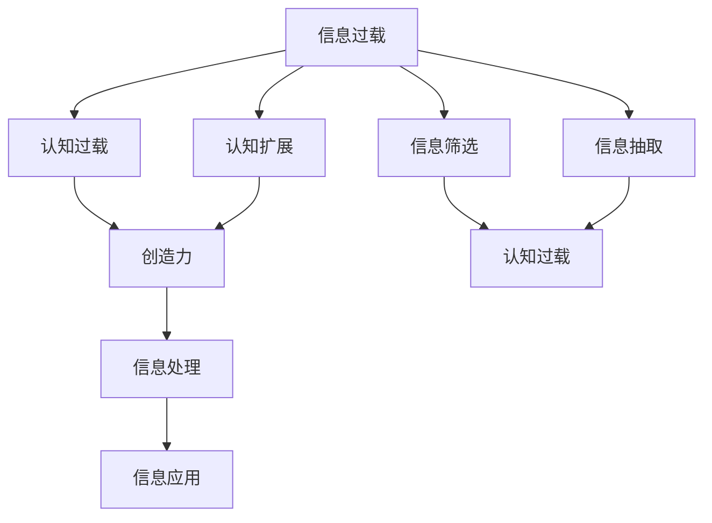

                 

# 信息过载与创造力：如何在混乱中找到灵感

> 关键词：信息过载,创造力,混乱,灵感,技术方法

## 1. 背景介绍

### 1.1 问题由来

在数字化时代，信息的爆炸性增长和持续更新使得人们面临前所未有的信息过载(Information Overload)问题。根据《2020年数字趋势报告》（Digital Trends Report 2020）的数据，每天有3.5亿条推文被发布，全球互联网用户每天上传超过2亿分钟的视频，共计产生了9000TB以上的数据。这些庞大的数据不仅占用大量存储空间，更成为人们认知负担的巨大包袱。

尽管信息过载带来了海量知识的累积和信息的获取便捷性，但由于人脑的认知容量和处理速度有限，这又成为一种"认知过载"(Cognitive Overload)。一方面，人在处理过多信息时容易出现注意力分散、效率降低、记忆力减退等问题。另一方面，信息过载还带来了知识筛选困难、决策成本增加、创新能力受限等新挑战。信息过载和认知过载的双重压力，使得很多人陷入"知识焦虑"(Knowledge Anxiety)之中。

如何在信息过载的时代，克服认知负担，保持清晰的思维和高效的创新能力，成为当前信息化社会亟需解决的难题。本文旨在通过梳理信息过载与创造力之间的关系，结合技术方法，探索如何在混乱中找到灵感，为解决这一难题提供思路。

### 1.2 问题核心关键点

本文关注的核心问题包括：
1. 信息过载和认知过载的具体表现和影响。
2. 信息过载与创造力的关系，以及如何通过技术手段减轻信息过载的负面影响，激发创造力。
3. 创造力提升的技术方法，包括但不限于认知扩展、信息筛选、信息抽取等。

## 2. 核心概念与联系

### 2.1 核心概念概述

为更好地理解信息过载与创造力之间的关系，本节将介绍几个密切相关的核心概念：

- **信息过载**：指人们在获取大量信息时，无法处理和利用全部信息，导致注意力分散、效率降低等问题。信息过载是认知过载的重要来源。
- **认知过载**：指信息超出了人的认知处理能力，导致注意力分散、记忆衰退、判断失误等问题。信息过载常常引发认知过载。
- **创造力**：指个体在面对复杂问题时，能够产生新颖、独特的思想或解决方案的能力。创造力是解决信息过载与认知过载的关键能力。
- **认知扩展**：指通过技术手段扩大人脑认知范围，提升认知能力。例如，利用增强现实技术(AR)、脑机接口(BMI)等提升人脑处理信息的能力。
- **信息筛选**：指通过智能算法过滤掉无用的噪声信息，保留有价值的信息。信息筛选是处理信息过载的重要手段。
- **信息抽取**：指从大量数据中自动提取出有用信息的过程。信息抽取能够减轻信息过载带来的认知负担。

这些概念之间的逻辑关系可以通过以下Mermaid流程图来展示：



这个流程图展示了信息过载与创造力之间的关系：

1. 信息过载对认知造成负面影响。
2. 通过认知扩展、信息筛选、信息抽取等技术，降低信息过载带来的负面影响。
3. 提升创造力，以应对信息过载与认知过载的挑战。
4. 处理后的信息通过信息应用转化为具体的应用效果。

## 3. 核心算法原理 & 具体操作步骤
### 3.1 算法原理概述

减轻信息过载对创造力的负面影响，通常需要从以下几个方面进行技术处理：

1. **认知扩展**：通过增强现实(AR)、脑机接口(BMI)等技术，扩展人脑的认知范围。
2. **信息筛选**：利用推荐系统、信息抽取等技术，自动过滤掉无关的信息，保留有价值的数据。
3. **信息抽取**：利用自然语言处理(NLP)、深度学习等技术，从海量数据中自动抽取关键信息。
4. **知识图谱**：构建大规模的知识图谱，提供结构化的知识体系，便于快速获取信息。
5. **信息检索**：利用倒排索引、向量空间模型等技术，实现高效的信息检索。

这些技术处理手段，通过提升信息处理效率，减少认知负担，有助于提升创造力。以下将具体介绍这些核心算法的原理和具体操作步骤。

### 3.2 算法步骤详解

#### 3.2.1 认知扩展

认知扩展通过增强现实(AR)、脑机接口(BMI)等技术，对人脑的认知能力进行扩展。其基本原理是：

1. **增强现实(AR)**：通过在虚拟现实环境中叠加信息，增强人脑对信息处理的能力。例如，VR头盔、AR眼镜等设备，可以在实时场景中显示重要信息。
2. **脑机接口(BMI)**：通过解读大脑信号，将人的思想和外界环境互动起来。例如，通过EEG、fMRI等设备，读取大脑信号，实现人脑对外部设备的控制。

具体操作步骤包括：
- **AR设备部署**：在需要处理大量信息的环境中，部署AR设备，例如在医院中利用AR眼镜显示患者信息、手术指南等。
- **BMI技术应用**：通过脑机接口技术，实现人脑对外部设备的控制，例如通过脑控无人机进行物流配送、脑控机器人进行自动化操作等。
- **AR与BMI结合**：将AR技术和BMI技术结合，实现更复杂的信息处理和交互。例如，通过脑控AR眼镜，实时显示环境中的关键信息，提升信息处理效率。

#### 3.2.2 信息筛选

信息筛选通过推荐系统、信息抽取等技术，自动过滤掉无关的信息，保留有价值的数据。其基本原理是：

1. **推荐系统**：通过用户行为数据、历史交互数据等，推荐用户感兴趣的信息。例如，Netflix通过推荐算法，向用户推荐电影、电视剧等娱乐内容。
2. **信息抽取**：利用自然语言处理(NLP)技术，从大量文本数据中自动抽取关键信息。例如，从新闻文章中抽取标题、关键词、摘要等信息。

具体操作步骤包括：
- **推荐系统应用**：在需要处理大量信息的环境中，部署推荐系统，例如在电商平台上推荐商品、在新闻应用中推荐新闻等。
- **信息抽取技术**：利用信息抽取算法，从原始文本中自动提取关键信息。例如，从医学文献中抽取疾病、治疗等信息，生成知识图谱。
- **信息筛选模型训练**：通过监督学习等技术，训练信息筛选模型，提升筛选效果。例如，通过标注有标签的数据集，训练推荐模型和信息抽取模型。

#### 3.2.3 信息抽取

信息抽取通过自然语言处理(NLP)、深度学习等技术，从海量数据中自动抽取关键信息。其基本原理是：

1. **NLP技术**：利用NLP技术，进行词性标注、句法分析、命名实体识别等任务。例如，通过BERT模型进行文本分类、实体识别等任务。
2. **深度学习技术**：利用深度学习技术，如卷积神经网络(CNN)、循环神经网络(RNN)、注意力机制等，进行信息抽取。例如，通过注意力机制从文本中提取关键词。

具体操作步骤包括：
- **NLP模型训练**：训练基于深度学习的NLP模型，例如使用BERT模型进行文本分类、实体识别等任务。
- **深度学习模型应用**：在实际应用场景中，部署信息抽取模型，例如在搜索引擎中抽取关键词、在医疗系统中抽取病历信息等。
- **模型优化**：通过超参数调优、模型集成等技术，提升信息抽取模型的准确性和鲁棒性。例如，通过集成多个模型，进行模型投票，提升抽取效果。

#### 3.2.4 知识图谱

知识图谱通过构建大规模的知识体系，提供结构化的知识结构，便于快速获取信息。其基本原理是：

1. **知识表示**：通过RDF、GraphDB等技术，将知识表示为图形结构，方便进行检索和推理。例如，通过Neo4j图数据库存储知识图谱。
2. **知识融合**：通过知识融合技术，将异构数据源中的知识进行整合，形成统一的知识体系。例如，通过KgRelT地球知识图谱，将地理、天文、生物等不同领域的知识进行融合。

具体操作步骤包括：
- **知识图谱构建**：在需要构建知识图谱的场景中，使用知识表示技术，构建结构化的知识图谱。例如，在科研领域构建基于生物信息的知识图谱。
- **知识图谱应用**：在实际应用场景中，使用知识图谱进行信息检索和推理。例如，在智能推荐系统中，使用知识图谱进行相似性匹配，推荐商品或内容。
- **知识图谱更新**：通过增量更新技术，持续更新知识图谱中的知识，保持知识的时效性。例如，通过定期爬取Web数据，更新知识图谱中的信息。

#### 3.2.5 信息检索

信息检索通过倒排索引、向量空间模型等技术，实现高效的信息检索。其基本原理是：

1. **倒排索引**：将文档中的关键词映射到文档的索引中，通过倒排索引进行高效检索。例如，使用ElasticSearch进行文本检索。
2. **向量空间模型**：将文档转换为向量，利用向量空间模型进行检索。例如，使用LSI、LDA等算法进行主题建模。

具体操作步骤包括：
- **倒排索引应用**：在需要高效检索信息的场景中，部署倒排索引技术，例如在搜索引擎中，使用ElasticSearch进行文本检索。
- **向量空间模型构建**：通过向量空间模型技术，将文档转换为向量，进行高效的信息检索。例如，通过LSI算法进行主题建模，将文档映射到向量空间中，实现相似性匹配。
- **信息检索技术优化**：通过优化检索算法和数据结构，提升检索效率。例如，通过TF-IDF算法提升关键词权重，优化倒排索引的构建方式。

### 3.3 算法优缺点

信息筛选和信息抽取技术，具有以下优点：
1. **高效性**：能够自动处理大量信息，提升信息处理效率。
2. **准确性**：通过深度学习等技术，提升信息抽取的准确性。
3. **灵活性**：能够灵活适应不同应用场景，提升信息处理能力。

但同时也存在一些缺点：
1. **依赖数据质量**：数据标注质量直接影响信息筛选和抽取的效果。
2. **模型复杂性**：深度学习模型的训练和优化较为复杂，需要较多的计算资源。
3. **应用场景局限性**：某些特定领域的信息筛选和抽取，可能效果不佳。

## 4. 数学模型和公式 & 详细讲解
### 4.1 数学模型构建

本节将使用数学语言对信息筛选和信息抽取的核心算法进行更加严格的刻画。

假设原始文本数据集为 $D=\{(x_i, y_i)\}_{i=1}^N$，其中 $x_i$ 为文本，$y_i$ 为标签。设信息筛选模型为 $M_{\theta}(x_i)$，其中 $\theta$ 为模型参数。信息筛选的任务是最大化信息相关性，最小化噪声干扰。数学上，可以定义如下损失函数：

$$
\mathcal{L}(\theta) = \sum_{i=1}^N \ell(y_i, M_{\theta}(x_i))
$$

其中 $\ell$ 为信息相关性损失函数，用于衡量信息筛选的准确性。例如，可以采用交叉熵损失函数：

$$
\ell(y_i, M_{\theta}(x_i)) = -y_i\log M_{\theta}(x_i) - (1-y_i)\log(1-M_{\theta}(x_i))
$$

### 4.2 公式推导过程

假设信息筛选模型 $M_{\theta}(x_i)$ 为二分类模型，预测 $y_i$ 为 $1$ 的概率，则信息相关性损失函数可以表示为：

$$
\ell(y_i, M_{\theta}(x_i)) = -y_i\log M_{\theta}(x_i) - (1-y_i)\log(1-M_{\theta}(x_i))
$$

将 $y_i$ 和 $M_{\theta}(x_i)$ 带入上述损失函数，得：

$$
\mathcal{L}(\theta) = \sum_{i=1}^N [-y_i\log M_{\theta}(x_i) - (1-y_i)\log(1-M_{\theta}(x_i))]
$$

通过梯度下降等优化算法，最小化损失函数 $\mathcal{L}(\theta)$，即可得到最优参数 $\theta$。具体步骤如下：
1. **梯度计算**：计算损失函数对模型参数 $\theta$ 的梯度。
2. **参数更新**：根据梯度和学习率 $\eta$，更新模型参数 $\theta$。
3. **迭代优化**：重复上述步骤，直至收敛。

### 4.3 案例分析与讲解

以信息抽取为例，介绍信息抽取模型的训练过程。

假设原始文本数据集为 $D=\{(x_i, y_i)\}_{i=1}^N$，其中 $x_i$ 为文本，$y_i$ 为标签。设信息抽取模型为 $M_{\theta}(x_i)$，其中 $\theta$ 为模型参数。信息抽取的任务是预测文本中特定信息的位置和类型。数学上，可以定义如下损失函数：

$$
\mathcal{L}(\theta) = \sum_{i=1}^N \ell(y_i, M_{\theta}(x_i))
$$

其中 $\ell$ 为信息抽取损失函数，用于衡量信息抽取的准确性。例如，可以采用交叉熵损失函数：

$$
\ell(y_i, M_{\theta}(x_i)) = -y_i\log M_{\theta}(x_i) - (1-y_i)\log(1-M_{\theta}(x_i))
$$

信息抽取模型的训练过程包括：
1. **模型构建**：选择合适的信息抽取模型，例如BERT模型。
2. **数据准备**：标注有标签的数据集，作为模型训练数据。
3. **模型训练**：使用标注数据训练信息抽取模型，最小化损失函数 $\mathcal{L}(\theta)$。
4. **模型评估**：在测试集上评估模型性能，对比微调前后的效果。
5. **模型优化**：通过超参数调优、模型集成等技术，提升信息抽取模型的准确性和鲁棒性。

## 5. 项目实践：代码实例和详细解释说明
### 5.1 开发环境搭建

在进行信息筛选和信息抽取实践前，我们需要准备好开发环境。以下是使用Python进行PyTorch开发的环境配置流程：

1. 安装Anaconda：从官网下载并安装Anaconda，用于创建独立的Python环境。

2. 创建并激活虚拟环境：
```bash
conda create -n pytorch-env python=3.8 
conda activate pytorch-env
```

3. 安装PyTorch：根据CUDA版本，从官网获取对应的安装命令。例如：
```bash
conda install pytorch torchvision torchaudio cudatoolkit=11.1 -c pytorch -c conda-forge
```

4. 安装Transformers库：
```bash
pip install transformers
```

5. 安装各类工具包：
```bash
pip install numpy pandas scikit-learn matplotlib tqdm jupyter notebook ipython
```

完成上述步骤后，即可在`pytorch-env`环境中开始信息筛选和信息抽取实践。

### 5.2 源代码详细实现

这里我们以信息抽取任务为例，给出使用Transformers库对BERT模型进行信息抽取的PyTorch代码实现。

首先，定义信息抽取任务的数据处理函数：

```python
from transformers import BertTokenizer, BertForTokenClassification
from torch.utils.data import Dataset
import torch

class NamedEntityDataset(Dataset):
    def __init__(self, texts, labels, tokenizer, max_len=128):
        self.texts = texts
        self.labels = labels
        self.tokenizer = tokenizer
        self.max_len = max_len
        
    def __len__(self):
        return len(self.texts)
    
    def __getitem__(self, item):
        text = self.texts[item]
        labels = self.labels[item]
        
        encoding = self.tokenizer(text, return_tensors='pt', max_length=self.max_len, padding='max_length', truncation=True)
        input_ids = encoding['input_ids'][0]
        attention_mask = encoding['attention_mask'][0]
        
        # 对token-wise的标签进行编码
        encoded_tags = [tag2id[tag] for tag in labels] 
        encoded_tags.extend([tag2id['O']] * (self.max_len - len(encoded_tags)))
        labels = torch.tensor(encoded_tags, dtype=torch.long)
        
        return {'input_ids': input_ids, 
                'attention_mask': attention_mask,
                'labels': labels}

# 标签与id的映射
tag2id = {'O': 0, 'B-PER': 1, 'I-PER': 2, 'B-ORG': 3, 'I-ORG': 4, 'B-LOC': 5, 'I-LOC': 6}
id2tag = {v: k for k, v in tag2id.items()}

# 创建dataset
tokenizer = BertTokenizer.from_pretrained('bert-base-cased')

train_dataset = NamedEntityDataset(train_texts, train_tags, tokenizer)
dev_dataset = NamedEntityDataset(dev_texts, dev_tags, tokenizer)
test_dataset = NamedEntityDataset(test_texts, test_tags, tokenizer)
```

然后，定义模型和优化器：

```python
from transformers import BertForTokenClassification, AdamW

model = BertForTokenClassification.from_pretrained('bert-base-cased', num_labels=len(tag2id))

optimizer = AdamW(model.parameters(), lr=2e-5)
```

接着，定义训练和评估函数：

```python
from torch.utils.data import DataLoader
from tqdm import tqdm
from sklearn.metrics import classification_report

device = torch.device('cuda') if torch.cuda.is_available() else torch.device('cpu')
model.to(device)

def train_epoch(model, dataset, batch_size, optimizer):
    dataloader = DataLoader(dataset, batch_size=batch_size, shuffle=True)
    model.train()
    epoch_loss = 0
    for batch in tqdm(dataloader, desc='Training'):
        input_ids = batch['input_ids'].to(device)
        attention_mask = batch['attention_mask'].to(device)
        labels = batch['labels'].to(device)
        model.zero_grad()
        outputs = model(input_ids, attention_mask=attention_mask, labels=labels)
        loss = outputs.loss
        epoch_loss += loss.item()
        loss.backward()
        optimizer.step()
    return epoch_loss / len(dataloader)

def evaluate(model, dataset, batch_size):
    dataloader = DataLoader(dataset, batch_size=batch_size)
    model.eval()
    preds, labels = [], []
    with torch.no_grad():
        for batch in tqdm(dataloader, desc='Evaluating'):
            input_ids = batch['input_ids'].to(device)
            attention_mask = batch['attention_mask'].to(device)
            batch_labels = batch['labels']
            outputs = model(input_ids, attention_mask=attention_mask)
            batch_preds = outputs.logits.argmax(dim=2).to('cpu').tolist()
            batch_labels = batch_labels.to('cpu').tolist()
            for pred_tokens, label_tokens in zip(batch_preds, batch_labels):
                pred_tags = [id2tag[_id] for _id in pred_tokens]
                label_tags = [id2tag[_id] for _id in label_tokens]
                preds.append(pred_tags[:len(label_tokens)])
                labels.append(label_tags)
                
    print(classification_report(labels, preds))
```

最后，启动训练流程并在测试集上评估：

```python
epochs = 5
batch_size = 16

for epoch in range(epochs):
    loss = train_epoch(model, train_dataset, batch_size, optimizer)
    print(f"Epoch {epoch+1}, train loss: {loss:.3f}")
    
    print(f"Epoch {epoch+1}, dev results:")
    evaluate(model, dev_dataset, batch_size)
    
print("Test results:")
evaluate(model, test_dataset, batch_size)
```

以上就是使用PyTorch对BERT进行信息抽取任务的微调完整代码实现。可以看到，得益于Transformers库的强大封装，我们可以用相对简洁的代码完成BERT模型的加载和微调。

### 5.3 代码解读与分析

让我们再详细解读一下关键代码的实现细节：

**NamedEntityDataset类**：
- `__init__`方法：初始化文本、标签、分词器等关键组件。
- `__len__`方法：返回数据集的样本数量。
- `__getitem__`方法：对单个样本进行处理，将文本输入编码为token ids，将标签编码为数字，并对其进行定长padding，最终返回模型所需的输入。

**tag2id和id2tag字典**：
- 定义了标签与数字id之间的映射关系，用于将token-wise的预测结果解码回真实的标签。

**训练和评估函数**：
- 使用PyTorch的DataLoader对数据集进行批次化加载，供模型训练和推理使用。
- 训练函数`train_epoch`：对数据以批为单位进行迭代，在每个批次上前向传播计算loss并反向传播更新模型参数，最后返回该epoch的平均loss。
- 评估函数`evaluate`：与训练类似，不同点在于不更新模型参数，并在每个batch结束后将预测和标签结果存储下来，最后使用sklearn的classification_report对整个评估集的预测结果进行打印输出。

**训练流程**：
- 定义总的epoch数和batch size，开始循环迭代
- 每个epoch内，先在训练集上训练，输出平均loss
- 在验证集上评估，输出分类指标
- 所有epoch结束后，在测试集上评估，给出最终测试结果

可以看到，PyTorch配合Transformers库使得BERT微调的过程变得简洁高效。开发者可以将更多精力放在数据处理、模型改进等高层逻辑上，而不必过多关注底层的实现细节。

当然，工业级的系统实现还需考虑更多因素，如模型的保存和部署、超参数的自动搜索、更灵活的任务适配层等。但核心的微调范式基本与此类似。

## 6. 实际应用场景
### 6.1 智能客服系统

基于大语言模型微调的对话技术，可以广泛应用于智能客服系统的构建。传统客服往往需要配备大量人力，高峰期响应缓慢，且一致性和专业性难以保证。而使用微调后的对话模型，可以7x24小时不间断服务，快速响应客户咨询，用自然流畅的语言解答各类常见问题。

在技术实现上，可以收集企业内部的历史客服对话记录，将问题和最佳答复构建成监督数据，在此基础上对预训练对话模型进行微调。微调后的对话模型能够自动理解用户意图，匹配最合适的答案模板进行回复。对于客户提出的新问题，还可以接入检索系统实时搜索相关内容，动态组织生成回答。如此构建的智能客服系统，能大幅提升客户咨询体验和问题解决效率。

### 6.2 金融舆情监测

金融机构需要实时监测市场舆论动向，以便及时应对负面信息传播，规避金融风险。传统的人工监测方式成本高、效率低，难以应对网络时代海量信息爆发的挑战。基于大语言模型微调的文本分类和情感分析技术，为金融舆情监测提供了新的解决方案。

具体而言，可以收集金融领域相关的新闻、报道、评论等文本数据，并对其进行主题标注和情感标注。在此基础上对预训练语言模型进行微调，使其能够自动判断文本属于何种主题，情感倾向是正面、中性还是负面。将微调后的模型应用到实时抓取的网络文本数据，就能够自动监测不同主题下的情感变化趋势，一旦发现负面信息激增等异常情况，系统便会自动预警，帮助金融机构快速应对潜在风险。

### 6.3 个性化推荐系统

当前的推荐系统往往只依赖用户的历史行为数据进行物品推荐，无法深入理解用户的真实兴趣偏好。基于大语言模型微调技术，个性化推荐系统可以更好地挖掘用户行为背后的语义信息，从而提供更精准、多样的推荐内容。

在实践中，可以收集用户浏览、点击、评论、分享等行为数据，提取和用户交互的物品标题、描述、标签等文本内容。将文本内容作为模型输入，用户的后续行为（如是否点击、购买等）作为监督信号，在此基础上微调预训练语言模型。微调后的模型能够从文本内容中准确把握用户的兴趣点。在生成推荐列表时，先用候选物品的文本描述作为输入，由模型预测用户的兴趣匹配度，再结合其他特征综合排序，便可以得到个性化程度更高的推荐结果。

### 6.4 未来应用展望

随着大语言模型微调技术的发展，其将在更多领域得到应用，为传统行业带来变革性影响。

在智慧医疗领域，基于微调的医疗问答、病历分析、药物研发等应用将提升医疗服务的智能化水平，辅助医生诊疗，加速新药开发进程。

在智能教育领域，微调技术可应用于作业批改、学情分析、知识推荐等方面，因材施教，促进教育公平，提高教学质量。

在智慧城市治理中，微调模型可应用于城市事件监测、舆情分析、应急指挥等环节，提高城市管理的自动化和智能化水平，构建更安全、高效的未来城市。

此外，在企业生产、社会治理、文娱传媒等众多领域，基于大模型微调的人工智能应用也将不断涌现，为经济社会发展注入新的动力。相信随着技术的日益成熟，微调方法将成为人工智能落地应用的重要范式，推动人工智能技术在垂直行业的规模化落地。

## 7. 工具和资源推荐
### 7.1 学习资源推荐

为了帮助开发者系统掌握大语言模型微调的理论基础和实践技巧，这里推荐一些优质的学习资源：

1. 《Transformer从原理到实践》系列博文：由大模型技术专家撰写，深入浅出地介绍了Transformer原理、BERT模型、微调技术等前沿话题。

2. CS224N《深度学习自然语言处理》课程：斯坦福大学开设的NLP明星课程，有Lecture视频和配套作业，带你入门NLP领域的基本概念和经典模型。

3. 《Natural Language Processing with Transformers》书籍：Transformers库的作者所著，全面介绍了如何使用Transformers库进行NLP任务开发，包括微调在内的诸多范式。

4. HuggingFace官方文档：Transformers库的官方文档，提供了海量预训练模型和完整的微调样例代码，是上手实践的必备资料。

5. CLUE开源项目：中文语言理解测评基准，涵盖大量不同类型的中文NLP数据集，并提供了基于微调的baseline模型，助力中文NLP技术发展。

通过对这些资源的学习实践，相信你一定能够快速掌握大语言模型微调的精髓，并用于解决实际的NLP问题。
###  7.2 开发工具推荐

高效的开发离不开优秀的工具支持。以下是几款用于大语言模型微调开发的常用工具：

1. PyTorch：基于Python的开源深度学习框架，灵活动态的计算图，适合快速迭代研究。大部分预训练语言模型都有PyTorch版本的实现。

2. TensorFlow：由Google主导开发的开源深度学习框架，生产部署方便，适合大规模工程应用。同样有丰富的预训练语言模型资源。

3. Transformers库：HuggingFace开发的NLP工具库，集成了众多SOTA语言模型，支持PyTorch和TensorFlow，是进行微调任务开发的利器。

4. Weights & Biases：模型训练的实验跟踪工具，可以记录和可视化模型训练过程中的各项指标，方便对比和调优。与主流深度学习框架无缝集成。

5. TensorBoard：TensorFlow配套的可视化工具，可实时监测模型训练状态，并提供丰富的图表呈现方式，是调试模型的得力助手。

6. Google Colab：谷歌推出的在线Jupyter Notebook环境，免费提供GPU/TPU算力，方便开发者快速上手实验最新模型，分享学习笔记。

合理利用这些工具，可以显著提升大语言模型微调任务的开发效率，加快创新迭代的步伐。

### 7.3 相关论文推荐

大语言模型和微调技术的发展源于学界的持续研究。以下是几篇奠基性的相关论文，推荐阅读：

1. Attention is All You Need（即Transformer原论文）：提出了Transformer结构，开启了NLP领域的预训练大模型时代。

2. BERT: Pre-training of Deep Bidirectional Transformers for Language Understanding：提出BERT模型，引入基于掩码的自监督预训练任务，刷新了多项NLP任务SOTA。

3. Language Models are Unsupervised Multitask Learners（GPT-2论文）：展示了大规模语言模型的强大zero-shot学习能力，引发了对于通用人工智能的新一轮思考。

4. Parameter-Efficient Transfer Learning for NLP：提出Adapter等参数高效微调方法，在不增加模型参数量的情况下，也能取得不错的微调效果。

5. Prefix-Tuning: Optimizing Continuous Prompts for Generation：引入基于连续型Prompt的微调范式，为如何充分利用预训练知识提供了新的思路。

6. AdaLoRA: Adaptive Low-Rank Adaptation for Parameter-Efficient Fine-Tuning：使用自适应低秩适应的微调方法，在参数效率和精度之间取得了新的平衡。

这些论文代表了大语言模型微调技术的发展脉络。通过学习这些前沿成果，可以帮助研究者把握学科前进方向，激发更多的创新灵感。

## 8. 总结：未来发展趋势与挑战

### 8.1 总结

本文对基于大语言模型的信息筛选和信息抽取技术进行了全面系统的介绍。首先阐述了信息过载和认知过载的具体表现和影响，明确了信息筛选和信息抽取技术在提升创造力方面的独特价值。其次，从原理到实践，详细讲解了信息筛选和信息抽取的核心算法，给出了微调任务开发的完整代码实例。同时，本文还广泛探讨了这些技术在智能客服、金融舆情、个性化推荐等多个行业领域的应用前景，展示了信息筛选和信息抽取技术的广泛潜力。最后，本文精选了微调技术的各类学习资源，力求为读者提供全方位的技术指引。

通过本文的系统梳理，可以看到，信息筛选和信息抽取技术在处理信息过载和认知过载方面具有重要意义。这些技术通过提升信息处理效率，减少认知负担，有助于提升创造力。未来，伴随技术的不断演进，这些技术将在更多领域得到应用，为传统行业带来变革性影响。

### 8.2 未来发展趋势

展望未来，信息筛选和信息抽取技术将呈现以下几个发展趋势：

1. **技术深度融合**：信息筛选和信息抽取技术将与其他前沿技术深度融合，如深度学习、自然语言处理、增强现实等。这些技术的融合，将进一步提升信息处理和抽取的准确性和效率。

2. **智能辅助决策**：信息筛选和信息抽取技术将与智能决策系统结合，提升决策的智能性和自动化程度。例如，在金融领域，智能推荐系统和智能投顾系统将进一步集成信息抽取技术，提升决策效果。

3. **跨模态融合**：信息筛选和信息抽取技术将与其他模态的数据处理技术结合，实现跨模态信息的整合。例如，在智能医疗领域，将图像、文本、语音等多种模态信息进行整合，提升诊断和治疗的准确性。

4. **实时化处理**：信息筛选和信息抽取技术将向实时化处理方向发展，能够快速处理海量数据流，提供实时反馈和决策支持。例如，在智慧城市治理中，实时数据流的处理能力将大幅提升城市管理的效率和智能化水平。

5. **普适化应用**：信息筛选和信息抽取技术将向普适化应用方向发展，适应更多行业和场景的需求。例如，在智能教育领域，微调后的信息抽取模型可以用于个性化推荐、学情分析等多个场景，提升教育质量。

6. **可解释性增强**：信息筛选和信息抽取技术将更加注重可解释性，能够提供清晰的推理逻辑和决策依据，增强系统的可信性和透明性。例如，在金融领域，智能推荐系统的决策过程需要提供详细的解释，以增强客户信任和满意度。

这些趋势凸显了信息筛选和信息抽取技术的广阔前景。这些方向的探索发展，必将进一步提升信息处理和抽取的准确性、效率和可解释性，为解决信息过载问题提供更有效的技术手段。

### 8.3 面临的挑战

尽管信息筛选和信息抽取技术已经取得了瞩目成就，但在迈向更加智能化、普适化应用的过程中，仍面临诸多挑战：

1. **数据质量瓶颈**：数据标注质量直接影响信息筛选和抽取的效果。数据标注成本高、质量参差不齐，成为制约技术发展的瓶颈。如何降低标注成本、提升标注质量，需要进一步探索。

2. **模型复杂性**：深度学习模型的训练和优化较为复杂，需要较多的计算资源。如何降低模型复杂度，提高训练效率，是未来研究的重要方向。

3. **应用场景局限性**：信息筛选和信息抽取技术在某些特定领域的应用效果不佳。如何提升技术在不同场景中的普适性和鲁棒性，是未来研究的重要课题。

4. **实时化处理的瓶颈**：实时化处理要求系统具备高吞吐量和低延迟的能力，这对硬件和算法都提出了很高的要求。如何优化算法和硬件资源配置，提升实时处理能力，是未来研究的重要方向。

5. **可解释性不足**：深度学习模型通常是"黑盒"系统，难以解释其内部工作机制和决策逻辑。如何在提升模型效果的同时，增强模型的可解释性，是未来研究的重要课题。

6. **伦理与安全问题**：信息筛选和信息抽取技术的应用可能引发隐私泄露、数据安全等伦理和安全问题。如何在技术应用中确保用户隐私和数据安全，是未来研究的重要课题。

这些挑战亟需学界和产业界的共同努力，通过技术创新和政策规范，解决信息筛选和信息抽取技术在应用中面临的各类问题。

### 8.4 研究展望

未来，信息筛选和信息抽取技术将在更多领域得到应用，为传统行业带来变革性影响。同时，技术的发展也将面临新的挑战和机遇。如何应对这些挑战，抓住新的机遇，推动技术向更深、更广、更高水平发展，将是未来研究的重要方向。

1. **跨模态信息融合**：如何将文本、图像、语音等多模态信息进行整合，形成统一的知识图谱，提升信息处理的综合能力，是未来研究的重要方向。

2. **智能决策系统**：如何构建基于信息筛选和信息抽取的智能决策系统，提升决策的智能性和自动化程度，是未来研究的重要方向。

3. **实时化处理能力**：如何提升信息筛选和信息抽取技术的实时化处理能力，适应更多行业和场景的需求，是未来研究的重要方向。

4. **可解释性增强**：如何增强模型的可解释性，提升系统的可信性和透明性，是未来研究的重要方向。

5. **伦理与安全问题**：如何在技术应用中确保用户隐私和数据安全，建立健全的伦理和法规框架，是未来研究的重要方向。

这些研究方向的探索，必将引领信息筛选和信息抽取技术迈向更高的台阶，为解决信息过载问题提供更有效的技术手段。只有勇于创新、敢于突破，才能不断拓展信息筛选和信息抽取技术的边界，推动信息技术的进一步发展。

## 9. 附录：常见问题与解答

**Q1：信息筛选和信息抽取的主要区别是什么？**

A: 信息筛选和信息抽取的主要区别在于处理的对象和目标。信息筛选是从大量信息中过滤出有用的信息，保留有价值的数据，用于辅助决策和支持。信息抽取则是从文本中自动抽取关键信息，将其转换为结构化的知识表示，用于深度分析和应用。

**Q2：信息筛选和信息抽取在实际应用中有哪些挑战？**

A: 信息筛选和信息抽取在实际应用中面临的主要挑战包括：
1. 数据标注质量问题：数据标注成本高、质量参差不齐，影响筛选和抽取效果。
2. 模型复杂性问题：深度学习模型训练和优化复杂，需要大量计算资源。
3. 实时处理能力问题：实时处理要求系统具备高吞吐量和低延迟的能力，对硬件和算法都提出了很高要求。
4. 可解释性问题：深度学习模型通常是"黑盒"系统，难以解释其内部工作机制和决策逻辑。
5. 伦理与安全问题：技术应用可能引发隐私泄露、数据安全等伦理和安全问题。

**Q3：信息筛选和信息抽取在信息过载处理中的应用效果如何？**

A: 信息筛选和信息抽取在处理信息过载方面具有重要意义。信息筛选通过过滤无关信息，保留有价值的数据，帮助用户快速获取所需信息，减少认知负担。信息抽取通过自动提取关键信息，形成结构化的知识表示，帮助用户深入理解和分析信息，提升决策效果。

在实际应用中，信息筛选和信息抽取技术已经在智能客服、金融舆情、个性化推荐等多个领域得到了广泛应用，并取得了显著效果。例如，智能客服系统通过信息筛选和抽取技术，自动理解用户意图，提供精准的回复；金融舆情监测系统通过信息筛选和抽取技术，实时监测市场舆论动向，预警潜在风险；个性化推荐系统通过信息筛选和抽取技术，深入理解用户兴趣，推荐更精准的商品或内容。

这些应用案例展示了信息筛选和信息抽取技术在信息过载处理中的强大潜力，推动了智能化应用的广泛应用。

**Q4：信息筛选和信息抽取如何提升创造力？**

A: 信息筛选和信息抽取通过提升信息处理效率，减少认知负担，有助于提升创造力。具体来说：
1. 信息筛选通过过滤无关信息，保留有价值的数据，帮助用户快速获取所需信息，减少认知负担，使人们能够更专注地进行思考和创造。
2. 信息抽取通过自动提取关键信息，形成结构化的知识表示，帮助用户深入理解和分析信息，提升决策效果，为创造提供坚实基础。
3. 通过信息筛选和抽取，能够快速获取相关信息，加速信息处理和决策，为创造活动提供更多时间和空间。

总之，信息筛选和信息抽取技术通过提升信息处理效率，减少认知负担，使人们能够更专注地进行思考和创造，从而提升创造力。

---

作者：禅与计算机程序设计艺术 / Zen and the Art of Computer Programming

