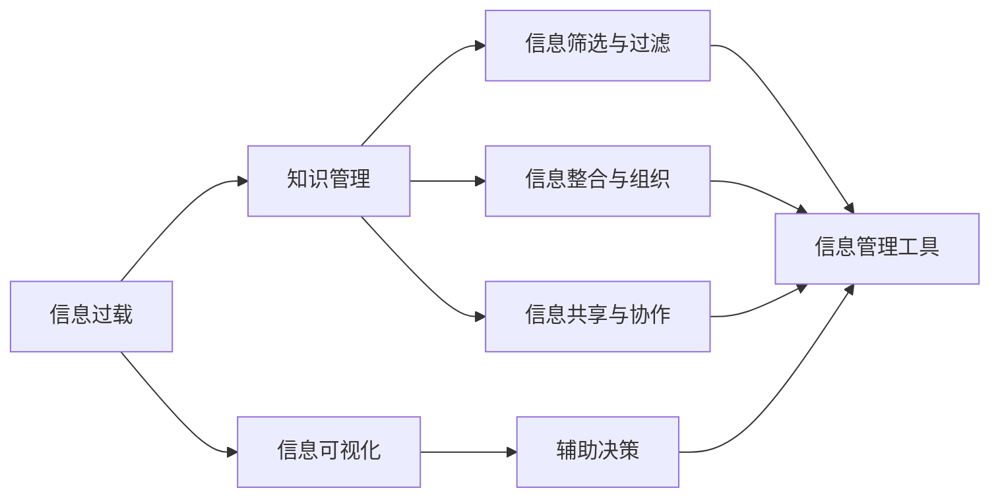

                 

# 信息过载与知识工作者：如何管理信息以提高生产力

> 关键词：信息过载, 知识管理, 信息管理工具, 知识工作者, 生产率提升, 信息可视化

## 1. 背景介绍

### 1.1 问题由来

在数字化时代，信息技术的飞速发展为知识工作者带来了前所未有的便利，同时也带来了信息过载的挑战。随着数据的指数级增长，个人和企业面临的信息量越来越大，如何有效管理、筛选和利用这些信息，成为知识工作者面临的重大难题。信息过载不仅导致决策迟缓、注意力分散，还容易引发疲劳和压力，进而影响工作效率和生产率。

为了应对信息过载，本文将探讨知识管理（Knowledge Management）的概念、关键原理和具体方法，并结合实际应用案例，提出了一套信息管理工具集成的解决方案，旨在帮助知识工作者提高工作效率，提升生产力。

### 1.2 问题核心关键点

有效管理信息的核心在于：
1. **信息的筛选与过滤**：帮助知识工作者从海量信息中快速提取关键信息。
2. **信息的整合与组织**：构建结构化的信息体系，方便查找和引用。
3. **信息的共享与协作**：促进知识工作者之间的信息交流和协同工作。
4. **信息的可视化**：通过图表、仪表盘等方式直观呈现信息，辅助决策。
5. **信息的反馈与优化**：通过数据分析和用户反馈，不断优化信息管理工具。

## 2. 核心概念与联系

### 2.1 核心概念概述

在深入探讨信息管理工具前，首先需要理解几个关键概念：

- **信息过载（Information Overload）**：指个人或系统接收的信息超出了其处理能力，导致信息处理效率下降。
- **知识管理（Knowledge Management）**：旨在优化知识获取、创造、共享和应用的过程，以提高组织和个人的工作效率。
- **知识工作者（Knowledge Worker）**：指那些依靠知识和信息而非体力劳动来创造价值的专业人士，如科学家、工程师、顾问等。
- **信息可视化（Information Visualization）**：利用图表、图形等视觉元素直观呈现信息，帮助理解和决策。
- **信息管理工具（Information Management Tools）**：辅助信息管理的技术工具，如文档管理系统、内容管理系统、协作平台等。

这些概念之间的关系可以通过以下Mermaid流程图来展示：



这个流程图展示了信息过载、知识管理与信息可视化、信息管理工具之间的逻辑关系：

1. 信息过载需要通过知识管理来解决。
2. 知识管理涉及信息筛选与过滤、整合与组织、共享与协作等多个方面。
3. 信息可视化辅助信息筛选与过滤和辅助决策。
4. 信息管理工具支持信息筛选与过滤、整合与组织、共享与协作以及辅助决策。

## 3. 核心算法原理 & 具体操作步骤

### 3.1 算法原理概述

信息管理工具的核心算法原理可以总结为：

- **信息抽取（Information Extraction）**：从大量非结构化文本中自动抽取有用的信息。
- **信息索引（Information Indexing）**：构建信息索引数据库，方便快速检索。
- **信息推荐（Information Recommendation）**：基于用户行为和兴趣，推荐最相关的信息。
- **信息可视化（Information Visualization）**：利用图表、仪表盘等可视化工具呈现信息。

这些原理共同构成了信息管理工具的基础，通过它们，可以有效地管理、筛选和利用信息，提高知识工作者的生产力。

### 3.2 算法步骤详解

信息管理工具的开发和应用通常包括以下几个步骤：

**Step 1: 需求分析**
- 收集用户需求，明确信息管理的目标和要求。
- 定义信息的类型、来源和组织方式。
- 确定信息管理工具的功能模块。

**Step 2: 技术选型**
- 选择适合的技术栈，如Python、JavaScript等。
- 确定使用的信息管理工具和平台，如Confluence、SharePoint、JIRA等。
- 选择合适的数据库，如MySQL、Elasticsearch、MongoDB等。

**Step 3: 数据收集与预处理**
- 收集和整合企业内部和外部的信息源。
- 清洗和处理数据，去除重复和错误信息。
- 对文本进行分词、词性标注等自然语言处理（NLP）操作。

**Step 4: 信息抽取与索引**
- 使用信息抽取技术，从文本中提取关键信息。
- 构建信息索引数据库，将信息按照预定的结构进行组织。
- 使用搜索引擎技术，实现快速检索和信息导航。

**Step 5: 信息推荐**
- 利用机器学习算法，基于用户行为和兴趣进行信息推荐。
- 实现个性化推荐系统，提高用户满意度和信息利用率。

**Step 6: 信息可视化**
- 设计可视化界面，将关键信息以图表、仪表盘等形式呈现。
- 使用可视化工具，如Tableau、PowerBI、D3.js等，生成动态图表和仪表盘。
- 提供数据报表和仪表盘，支持多维度数据分析和监控。

**Step 7: 系统集成与测试**
- 将信息管理工具集成到企业现有的IT系统中。
- 进行系统测试和调优，确保工具稳定性和可用性。
- 收集用户反馈，不断改进和优化信息管理工具。

### 3.3 算法优缺点

信息管理工具的优势包括：

- **效率提升**：自动化信息筛选与过滤，减少人工操作。
- **信息整合**：构建结构化的信息体系，便于检索和管理。
- **协作增强**：促进知识工作者之间的信息交流和协作。
- **辅助决策**：通过可视化工具，辅助决策过程。

缺点则主要包括：

- **依赖技术**：需要依赖先进的技术和工具。
- **用户习惯**：用户需要适应新的工具和工作流程。
- **数据隐私**：处理大量敏感信息时，需注意数据隐私和安全问题。
- **成本高昂**：开发和维护成本较高，尤其对中小型企业。

### 3.4 算法应用领域

信息管理工具广泛应用于以下领域：

- **企业内部知识管理**：帮助企业整合知识资源，促进知识共享和创新。
- **研发项目管理**：通过信息管理工具支持研发项目的任务分配、进度跟踪和成果管理。
- **客户关系管理**：通过信息管理工具优化客户信息管理和客户关系维护。
- **内容发布与营销**：利用信息推荐系统，提升内容发布和营销效果。
- **智能客服系统**：通过信息管理工具，提高客户服务质量和效率。

## 4. 数学模型和公式 & 详细讲解 & 举例说明

### 4.1 数学模型构建

信息管理工具的核心数学模型通常包括：

- **信息抽取模型**：基于机器学习和自然语言处理技术，从文本中抽取关键信息。
- **信息推荐模型**：使用协同过滤、内容推荐等算法，根据用户行为和兴趣推荐信息。
- **信息可视化模型**：利用统计学和图形学知识，设计可视化界面和动态图表。

### 4.2 公式推导过程

以信息推荐模型为例，推荐算法的基本公式为：

$$
R(i, j) = \text{user\_interest}(i) \cdot \text{item\_qualification}(j)
$$

其中，$R(i, j)$ 表示用户$i$对项目$j$的推荐评分，$\text{user\_interest}(i)$ 为用户$i$的兴趣向量，$\text{item\_qualification}(j)$ 为项目$j$的特征向量。

通过余弦相似度或欧式距离等度量方法，计算用户与项目的相似度，从而生成推荐列表。

### 4.3 案例分析与讲解

以Elasticsearch作为信息管理工具的一个例子，其核心技术包括：

- **信息索引**：通过倒排索引技术，快速检索和过滤信息。
- **分布式存储**：支持水平扩展，存储海量数据。
- **查询语言**：使用Elasticsearch查询语言（EQL），方便进行复杂查询和分析。
- **可视化工具**：配合Kibana，提供丰富的可视化仪表盘和报表。

## 5. 项目实践：代码实例和详细解释说明

### 5.1 开发环境搭建

为便于信息管理工具的开发和测试，以下介绍一个基本的环境搭建流程：

1. **安装开发环境**：
   - 安装Python 3.7及以上版本，确保其与信息管理工具库兼容。
   - 安装pip、conda等依赖管理工具，方便安装和管理第三方库。

2. **配置开发环境**：
   - 配置开发环境变量，如PYTHONPATH、PATH等。
   - 安装必要的依赖库，如NLP、数据处理、可视化等工具库。

3. **搭建本地服务器**：
   - 搭建本地服务器，如使用AWS、阿里云、腾讯云等云服务提供商。
   - 部署信息管理工具，进行初步测试和调试。

### 5.2 源代码详细实现

以下是一个基于Elasticsearch的信息管理工具的Python代码实现：

```python
from elasticsearch import Elasticsearch
from elasticsearch_dsl import Document, Index, Search, Q

# 初始化Elasticsearch客户端
es = Elasticsearch([{'host': 'localhost', 'port': 9200}])

# 定义索引结构
index = Index('my_index')
index.create()

# 定义文档类型
doc_type = Document()
doc_type.fields['id'] = Text()
doc_type.fields['name'] = Text()
doc_type.fields['content'] = Text()
doc_type.save()

# 添加文档
doc = doc_type(
    id='1',
    name='Doc 1',
    content='This is a sample document.'
)
doc.save()

# 查询文档
search = Search(index='my_index')
search.filter('term', id='1')
results = search.execute()
for hit in results:
    print(hit)
```

### 5.3 代码解读与分析

上述代码主要实现了以下功能：

1. **Elasticsearch客户端初始化**：通过Elasticsearch客户端连接本地服务器。
2. **索引创建与结构定义**：创建索引，并定义文档类型，包括ID、标题、内容等字段。
3. **文档添加**：定义并保存一个文档。
4. **文档查询**：通过查询语句获取指定ID的文档，并打印结果。

## 6. 实际应用场景

### 6.1 智能客服系统

智能客服系统通过信息管理工具，实现自动化的信息筛选与过滤、知识库管理、用户交互记录等功能。以下是一个典型的智能客服系统实现流程：

1. **用户意图识别**：利用NLP技术，识别用户意图。
2. **知识库查询**：根据用户意图，查询知识库中的相关文档。
3. **信息推荐**：推荐相关的FAQ、常见问题解答等。
4. **对话管理**：基于用户对话历史，生成自然语言回复。
5. **用户满意度评估**：通过用户反馈，不断优化对话管理模型。

### 6.2 研发项目管理

研发项目管理工具通过信息管理工具，实现任务分配、进度跟踪、成果管理等功能。以下是一个典型的研发项目管理实现流程：

1. **任务分配**：根据项目需求，分配任务给相关开发人员。
2. **进度跟踪**：记录任务完成进度，生成项目进度报告。
3. **成果管理**：记录项目成果，并进行版本控制。
4. **信息推荐**：根据用户行为，推荐相关的技术文档、代码示例等。

### 6.3 客户关系管理

客户关系管理工具通过信息管理工具，实现客户信息管理、客户关系维护等功能。以下是一个典型的客户关系管理实现流程：

1. **客户信息管理**：记录客户基本信息，如姓名、联系方式等。
2. **客户关系维护**：记录客户互动历史，生成客户满意度报告。
3. **信息推荐**：根据客户行为，推荐相关的产品信息、促销活动等。

### 6.4 未来应用展望

未来信息管理工具的发展趋势主要包括：

1. **智能化增强**：利用AI技术，提升信息推荐、文档抽取的智能化程度。
2. **多模态融合**：支持图像、视频等多模态数据的管理和分析。
3. **协作平台集成**：与企业现有的协作平台进行深度集成，支持协同工作。
4. **自动化部署**：支持一键部署和扩展，提升系统的可扩展性。

## 7. 工具和资源推荐

### 7.1 学习资源推荐

以下是一些帮助学习信息管理工具和知识管理技术的资源推荐：

1. **《信息管理与知识管理：理论和实践》**：介绍信息管理与知识管理的基本概念、方法和工具。
2. **Coursera《信息管理和知识管理》课程**：提供系统化的信息管理与知识管理理论学习。
3. **Udemy《信息管理工具入门》课程**：介绍信息管理工具的搭建和使用。
4. **Kaggle《信息管理与数据分析》竞赛**：通过实际案例，提升信息管理与数据分析能力。

### 7.2 开发工具推荐

以下是一些常用的信息管理工具和开发工具推荐：

1. **Elasticsearch**：高性能的全文搜索和分析引擎。
2. **Confluence**：知识管理平台，支持文档共享和协作。
3. **Slack**：团队协作工具，支持即时消息、文件共享和任务管理。
4. **Tableau**：数据可视化工具，支持动态图表和仪表盘。

### 7.3 相关论文推荐

以下是一些关于信息管理工具和知识管理技术的重要论文推荐：

1. **《知识管理的框架与技术》**：总结了知识管理的框架和主要技术。
2. **《基于信息抽取的知识管理》**：探讨了信息抽取技术在知识管理中的应用。
3. **《信息推荐的机器学习算法》**：介绍了协同过滤、内容推荐等机器学习算法。
4. **《信息可视化技术综述》**：总结了信息可视化的主要技术和方法。

## 8. 总结：未来发展趋势与挑战

### 8.1 研究成果总结

信息管理工具通过有效管理信息，帮助知识工作者提升工作效率，减轻信息过载的困扰。信息抽取、信息推荐和信息可视化等核心技术，已成为信息管理工具的核心竞争力。

### 8.2 未来发展趋势

未来信息管理工具的发展趋势包括：

1. **智能化**：通过AI技术提升信息推荐和抽取的智能化程度。
2. **多模态融合**：支持图像、视频等多模态数据的管理和分析。
3. **协同工作**：支持团队协作和知识共享，促进信息的多角度利用。
4. **可扩展性**：支持自动化部署和扩展，提升系统的可扩展性。

### 8.3 面临的挑战

信息管理工具在应用过程中，仍面临一些挑战：

1. **技术复杂度**：需要依赖先进的技术和工具，开发和维护成本较高。
2. **用户习惯**：用户需要适应新的工具和工作流程，培训成本较高。
3. **数据隐私**：处理大量敏感信息时，需注意数据隐私和安全问题。
4. **数据质量**：数据的准确性和完整性直接影响信息管理的效果。

### 8.4 研究展望

未来信息管理工具的研究方向包括：

1. **深度学习与自然语言处理**：利用深度学习技术提升信息抽取和推荐的准确性。
2. **多模态融合技术**：支持多种数据类型（文本、图像、视频等）的管理和分析。
3. **协同工作技术**：支持多人协作和知识共享，增强团队的协同效应。
4. **数据隐私保护**：采用先进的数据加密和隐私保护技术，保障用户隐私。

## 9. 附录：常见问题与解答

**Q1: 信息管理工具如何有效管理海量数据？**

A: 信息管理工具通常采用分布式存储和分布式计算技术，如Elasticsearch，实现海量数据的存储和处理。通过倒排索引、分片等技术，支持快速检索和数据一致性。

**Q2: 信息管理工具如何提升信息抽取的准确性？**

A: 信息抽取技术主要依赖自然语言处理（NLP）和机器学习算法，通过标注大量样本数据进行模型训练，不断优化抽取算法，提高信息抽取的准确性。

**Q3: 信息管理工具如何实现个性化信息推荐？**

A: 信息推荐系统通常使用协同过滤、内容推荐等算法，基于用户行为和兴趣进行信息推荐。推荐算法需要考虑用户历史行为、项目属性和用户兴趣等多个因素，实现个性化推荐。

**Q4: 信息管理工具如何实现信息可视化？**

A: 信息可视化主要依赖统计学和图形学技术，通过图表、仪表盘等视觉元素呈现信息。可视化工具如Tableau、PowerBI、D3.js等，可以生成动态图表和仪表盘，支持多维度数据分析和监控。

**Q5: 信息管理工具如何应对数据隐私问题？**

A: 信息管理工具需要采用先进的数据加密和隐私保护技术，如数据脱敏、访问控制等，保障用户隐私。同时，需要在用户权限和数据共享之间找到平衡，确保信息的安全性和可用性。

---

作者：禅与计算机程序设计艺术 / Zen and the Art of Computer Programming

