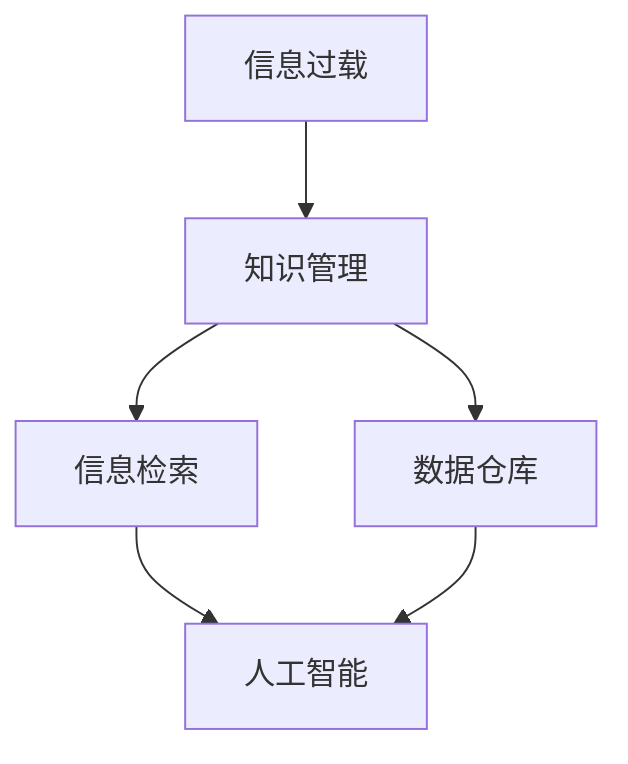

                 

# 信息过载与知识管理策略实施：有效组织和检索信息的指南

> 关键词：信息过载, 知识管理, 信息检索, 大数据, 信息组织策略, 数据仓库, 人工智能

## 1. 背景介绍

### 1.1 问题由来

在当今信息化快速发展的时代，各类信息如爆炸式增长，从学术论文、专利文献、企业报告，到社交媒体、博客、新闻网站等，每天产生的海量数据让人应接不暇。伴随互联网技术的发展，数字信息的获取、存储、分享变得前所未有的便捷，但信息过载（Information Overload）的问题也愈发凸显。信息过载不仅使得决策者难以从海量信息中快速提炼有用内容，还可能产生“认知负荷”，甚至引发“认知迷思”，导致认知偏误（Cognitive Bias）、决策失误。

信息过载问题已经严重影响到企业的运营效率和创新能力，对个人的生活质量和幸福感也产生了不良影响。因此，信息管理和知识管理的重要性日益凸显。如何有效组织和检索信息，提高决策质量和信息利用效率，成为了业界和学术界研究的热点问题。

## 2. 核心概念与联系

### 2.1 核心概念概述

为更好地理解信息过载与知识管理的策略，本节将介绍几个核心概念：

- 信息过载（Information Overload）：指个人或组织接收的信息量超出其处理能力的现象。过载的信息不仅难以消化，还可能分散注意力，影响决策。
- 知识管理（Knowledge Management）：通过信息技术手段，系统化地管理和利用知识的过程，目的是提高知识共享和复用的效率。
- 信息检索（Information Retrieval）：从海量信息集合中获取所需信息的自动化处理过程。目标是在最短的时间内，找到与查询需求最相关的信息。
- 数据仓库（Data Warehouse）：将企业内外部数据源汇总并存储的结构化数据存储系统。它支持企业的数据分析、决策支持和报告生成。
- 人工智能（AI）：通过机器学习、深度学习等技术，实现信息自动处理和知识挖掘的技术手段。AI在信息过载问题中发挥着重要的作用。

这些核心概念之间的联系可以通过以下Mermaid流程图来展示：



这个流程图展示信息过载和知识管理的相互关系，以及它们与信息检索、数据仓库和人工智能等关键技术之间的联系。

## 3. 核心算法原理 & 具体操作步骤

### 3.1 算法原理概述

信息管理与知识管理的策略主要集中在如何有效地组织和检索信息。具体到算法层面，可以基于以下几个核心步骤：

1. **数据收集与预处理**：从多个数据源收集相关数据，并进行清洗、去重等预处理，保证数据的质量。
2. **信息组织**：通过文本挖掘、主题建模等方法，将数据转换为结构化的知识单元，并建立索引。
3. **信息检索**：设计高效的检索模型，通过查询扩展、排序算法等技术，从知识库中快速检索到相关结果。
4. **知识融合与推荐**：利用机器学习算法，将多源异构的知识单元进行融合，并根据用户偏好生成推荐结果。
5. **反馈与优化**：根据用户反馈，不断优化模型参数和查询策略，提升系统的准确性和用户满意度。

这些步骤共同构成了信息管理和知识管理的核心算法流程。

### 3.2 算法步骤详解

下面详细介绍这些步骤的实施细节：

#### 数据收集与预处理

1. **数据源确定**：明确信息收集的范围，如企业内部系统、社交媒体、新闻网站等。
2. **数据采集**：使用爬虫、API接口等手段，自动收集数据。
3. **数据清洗**：去除重复、错误和不相关数据，处理缺失值和异常值。
4. **数据存储**：使用数据库系统，将清洗后的数据存储起来，方便后续处理。

#### 信息组织

1. **文本挖掘**：通过词频统计、TF-IDF算法等方法，提取文本中的关键词和短语。
2. **主题建模**：应用LDA（Latent Dirichlet Allocation）等主题模型，自动发现文本中的隐含主题。
3. **建立索引**：将主题模型提取的关键词和短语建立索引，方便快速检索。

#### 信息检索

1. **查询构建**：设计查询语言，如布尔查询、向量空间模型等，构建查询表达式。
2. **相似度计算**：通过余弦相似度、Jaccard相似度等方法，计算查询与文档的相似度。
3. **排序算法**：根据相似度得分，设计排序算法，如基于排序的相关性排序。
4. **检索结果呈现**：设计友好的界面，显示检索结果，支持文本预览、摘要展示等功能。

#### 知识融合与推荐

1. **知识图谱构建**：通过RDF（Resource Description Framework）等技术，构建知识图谱，描述实体和关系。
2. **融合算法**：使用图嵌入、K-means等算法，将多源异构的知识单元融合到知识图谱中。
3. **推荐算法**：应用协同过滤、基于内容的推荐算法，根据用户行为生成个性化推荐。

#### 反馈与优化

1. **用户反馈收集**：通过用户点击、评分等行为，收集反馈信息。
2. **模型优化**：根据反馈信息，调整模型参数和算法，优化查询效果。
3. **持续更新**：定期更新数据源和模型，确保系统的实时性。

### 3.3 算法优缺点

基于以上核心步骤，信息管理和知识管理的策略具有以下优点和缺点：

#### 优点

1. **高效性**：通过自动化的数据处理和模型优化，减少了人工干预，提高了信息检索和知识管理的效率。
2. **准确性**：通过多种算法的融合，提高了检索结果的准确性，避免了人为主观偏差。
3. **扩展性**：支持多源异构数据的处理和融合，能够适应不同规模和类型的数据集。
4. **自动化**：利用人工智能技术，能够自动发现新知识，适应快速变化的信息环境。

#### 缺点

1. **技术门槛高**：需要掌握数据挖掘、主题建模、机器学习等多种技术，对开发者要求较高。
2. **数据隐私问题**：在处理企业内部数据时，需注意数据隐私和保密问题。
3. **计算资源消耗大**：信息组织和知识融合等步骤需要大量的计算资源，可能导致成本上升。
4. **结果解释性差**：自动化算法生成的推荐结果难以解释，可能导致用户信任度下降。

尽管存在这些局限性，但基于以上算法原理的信息管理和知识管理策略，仍然是处理信息过载问题的重要手段。未来随着技术的进步，这些缺点将逐步得到缓解。

### 3.4 算法应用领域

信息管理和知识管理的应用领域非常广泛，包括但不限于：

- 企业信息管理：支持企业文档管理、知识库构建、文档搜索等功能。
- 政府信息公开：提供政策法规、项目申报、公共服务等信息的检索和查询。
- 在线教育：通过知识图谱和推荐系统，为学生提供个性化学习资源。
- 智慧医疗：提供疾病知识库、诊疗指南、药物信息等查询服务。
- 金融领域：提供金融资讯、市场分析、投资建议等信息检索和知识融合服务。

## 4. 数学模型和公式 & 详细讲解 & 举例说明

### 4.1 数学模型构建

在信息管理和知识管理中，常见的数学模型包括向量空间模型（Vector Space Model）、余弦相似度（Cosine Similarity）、TF-IDF（Term Frequency-Inverse Document Frequency）等。

以余弦相似度为例，假设查询$q$和文档$d$的词向量表示为$\vec{q}$和$\vec{d}$，则余弦相似度计算公式为：

$$
sim(q,d) = \frac{\vec{q} \cdot \vec{d}}{\|\vec{q}\| \|\vec{d}\|}
$$

其中$\cdot$表示向量点乘，$\|\vec{q}\|$和$\|\vec{d}\|$分别表示向量$\vec{q}$和$\vec{d}$的范数。

### 4.2 公式推导过程

余弦相似度的推导过程如下：

设查询$q$和文档$d$的词向量分别为$\vec{q} = (q_1, q_2, \ldots, q_n)$和$\vec{d} = (d_1, d_2, \ldots, d_n)$，其中$n$表示词汇表大小。

余弦相似度为：

$$
sim(q,d) = \frac{\vec{q} \cdot \vec{d}}{\|\vec{q}\| \|\vec{d}\|}
$$

向量点乘$\vec{q} \cdot \vec{d} = q_1d_1 + q_2d_2 + \ldots + q_nd_n$，向量范数$\|\vec{q}\| = \sqrt{q_1^2 + q_2^2 + \ldots + q_n^2}$和$\|\vec{d}\| = \sqrt{d_1^2 + d_2^2 + \ldots + d_n^2}$。

将上述公式代入，得到余弦相似度公式：

$$
sim(q,d) = \frac{q_1d_1 + q_2d_2 + \ldots + q_nd_n}{\sqrt{q_1^2 + q_2^2 + \ldots + q_n^2} \sqrt{d_1^2 + d_2^2 + \ldots + d_n^2}}
$$

### 4.3 案例分析与讲解

以企业文档管理为例，假设企业有大量文档和项目报告，希望通过关键词检索快速找到相关文档。

1. **数据预处理**：从企业文档管理系统导出文档文本，并进行清洗、去重等预处理。
2. **信息组织**：对文档文本进行分词，提取关键词和短语，使用TF-IDF算法计算关键词权重。
3. **建立索引**：将关键词和短语建立索引，便于后续查询。
4. **信息检索**：用户输入查询词，系统根据余弦相似度计算查询词与文档的相似度，返回最相关的文档列表。

假设查询词为“人工智能”，系统根据余弦相似度计算所有文档的相似度得分，并选择得分最高的文档作为推荐结果。

例如，假设文档1和文档2的词向量表示为：

$$
\vec{d1} = (0.1, 0.2, 0.3, 0.4, 0.5)
$$

$$
\vec{d2} = (0.6, 0.7, 0.8, 0.9, 1.0)
$$

查询词的词向量为$\vec{q} = (0.0, 0.0, 0.0, 0.5, 0.0)$。

计算余弦相似度：

$$
sim(q,d1) = \frac{0.0 \times 0.1 + 0.0 \times 0.2 + 0.0 \times 0.3 + 0.5 \times 0.4 + 0.0 \times 0.5}{\sqrt{0.0^2 + 0.0^2 + 0.0^2 + 0.5^2 + 0.0^2} \sqrt{0.1^2 + 0.2^2 + 0.3^2 + 0.4^2 + 0.5^2}}
$$

$$
sim(q,d1) = \frac{0.2}{\sqrt{0.25} \sqrt{0.6 + 0.4 + 0.3 + 0.4 + 0.5}}
$$

$$
sim(q,d1) = 0.2
$$

同样计算文档2的相似度：

$$
sim(q,d2) = \frac{0.0 \times 0.6 + 0.0 \times 0.7 + 0.0 \times 0.8 + 0.5 \times 0.9 + 0.0 \times 1.0}{\sqrt{0.0^2 + 0.0^2 + 0.0^2 + 0.5^2 + 0.0^2} \sqrt{0.6^2 + 0.7^2 + 0.8^2 + 0.9^2 + 1.0^2}}
$$

$$
sim(q,d2) = \frac{0.45}{\sqrt{0.25} \sqrt{0.6 + 0.7 + 0.8 + 0.9 + 1.0}}
$$

$$
sim(q,d2) = 0.36
$$

因此，系统推荐文档2作为与查询词“人工智能”最相关的文档。

## 5. 项目实践：代码实例和详细解释说明

### 5.1 开发环境搭建

在进行信息管理和知识管理项目实践前，我们需要准备好开发环境。以下是使用Python进行TensorFlow开发的环境配置流程：

1. 安装Anaconda：从官网下载并安装Anaconda，用于创建独立的Python环境。

2. 创建并激活虚拟环境：
```bash
conda create -n tf-env python=3.8 
conda activate tf-env
```

3. 安装TensorFlow：根据CUDA版本，从官网获取对应的安装命令。例如：
```bash
conda install tensorflow -c tf -c conda-forge
```

4. 安装各类工具包：
```bash
pip install numpy pandas scikit-learn matplotlib tqdm jupyter notebook ipython
```

完成上述步骤后，即可在`tf-env`环境中开始信息管理和知识管理项目的实践。

### 5.2 源代码详细实现

下面以企业文档管理为例，给出使用TensorFlow进行信息检索的PyTorch代码实现。

首先，定义数据预处理函数：

```python
import tensorflow as tf
import pandas as pd
import numpy as np

def preprocess_data(data_path):
    # 读取数据集
    df = pd.read_csv(data_path)
    # 清洗数据
    df = df.dropna().drop_duplicates()
    # 分词和词频统计
    tokenizer = tf.keras.preprocessing.text.Tokenizer(num_words=10000)
    tokenizer.fit_on_texts(df['content'])
    X = tokenizer.texts_to_sequences(df['content'])
    y = np.array(df['label'])
    return X, y
```

然后，定义信息检索模型：

```python
from tensorflow.keras.layers import Embedding, Dense, Dot, LSTM, Bidirectional

class Doc2Vec(tf.keras.Model):
    def __init__(self, embedding_dim=100):
        super(Doc2Vec, self).__init__()
        self.encoder = Embedding(input_dim=10000, output_dim=embedding_dim, input_length=100)
        self.lstm = Bidirectional(LSTM(32, return_sequences=True))
        self.dot = Dot(axes=1)
        self.fc = Dense(1, activation='sigmoid')

    def call(self, inputs):
        x = self.encoder(inputs)
        x = self.lstm(x)
        x = self.dot(x, x)
        x = self.fc(x)
        return x
```

接着，定义模型训练函数：

```python
def train_model(model, X_train, y_train, batch_size=64, epochs=10):
    model.compile(optimizer='adam', loss='binary_crossentropy', metrics=['accuracy'])
    model.fit(X_train, y_train, batch_size=batch_size, epochs=epochs, validation_split=0.2)
    return model
```

最后，启动训练流程并在测试集上评估：

```python
X_train, y_train = preprocess_data('train_data.csv')
X_test, y_test = preprocess_data('test_data.csv')

model = Doc2Vec()
model = train_model(model, X_train, y_train)

test_loss, test_acc = model.evaluate(X_test, y_test)
print(f'Test accuracy: {test_acc:.4f}')
```

以上就是使用TensorFlow对企业文档管理项目进行信息检索的完整代码实现。可以看到，TensorFlow提供了强大的深度学习框架，方便开发者进行模型构建和训练。

### 5.3 代码解读与分析

让我们再详细解读一下关键代码的实现细节：

**preprocess_data函数**：
- 读取数据集
- 清洗数据，去除缺失值和重复值
- 分词和词频统计，使用Keras内置的Tokenizer实现
- 将文本转换为模型所需的序列数据
- 提取标签数据

**Doc2Vec类**：
- 定义模型的网络结构，包括嵌入层、双向LSTM层、点乘层和全连接层
- 实现模型前向传播，将文本输入转换为向量表示
- 定义损失函数和优化器

**train_model函数**：
- 使用Keras编译模型，设置损失函数和优化器
- 调用模型fit方法进行训练，设置批次大小和迭代轮数
- 返回训练后的模型

**训练流程**：
- 调用preprocess_data函数，获取训练集和测试集的数据
- 实例化Doc2Vec模型
- 调用train_model函数进行模型训练
- 在测试集上评估模型性能，输出测试准确率

代码的实现细节主要体现在数据预处理、模型构建和模型训练等关键环节。预处理环节通过Keras内置的Tokenizer实现文本分词和序列转换，模型构建环节利用TensorFlow构建了基于双向LSTM的信息检索模型，训练环节则通过Keras提供的fit方法实现模型训练。整个流程体现了TensorFlow和Keras的强大工具支持，使得信息检索模型的实现变得更加便捷高效。

## 6. 实际应用场景

### 6.1 企业文档管理

企业文档管理系统是信息管理和知识管理的重要应用场景。在信息爆炸的今天，企业文档管理面临着大量文档的存储、检索和利用问题。通过信息检索技术，企业可以快速找到所需的文档，避免文档丢失和冗余，提高文档利用效率。

在具体实现中，可以通过以下步骤进行文档管理：

1. **文档收集**：自动从企业内部系统、云存储、邮件等渠道收集文档。
2. **数据清洗**：清洗文档中的噪声、冗余信息，确保数据质量。
3. **信息组织**：对文档进行分词、词频统计、主题建模等，建立索引。
4. **信息检索**：用户输入关键词或文档标题，系统根据余弦相似度检索相关文档。
5. **文档推荐**：根据用户行为和文档标签，推荐相关文档，辅助决策。

### 6.2 政府信息公开

政府信息公开是信息管理和知识管理在政府应用的重要表现。通过信息检索技术，公众可以方便地获取政府公开的信息，提高政府透明度和效率。

具体实现步骤如下：

1. **数据收集**：从政府网站、数据库、公告等渠道收集信息。
2. **数据清洗**：去除重复、错误的信息，确保数据准确性。
3. **信息组织**：对信息进行分类、标签化，建立索引。
4. **信息检索**：用户输入查询词，系统检索相关文档。
5. **信息展示**：以网页、PDF等形式展示检索结果，支持文本预览和下载。

### 6.3 在线教育

在线教育平台需要处理大量的学习资源和用户行为数据。通过信息检索和知识管理技术，在线教育平台可以实现个性化推荐，提升用户体验和学习效果。

具体实现步骤如下：

1. **数据收集**：从在线教育平台收集课程、视频、论坛等资源。
2. **数据清洗**：清洗课程信息，去除重复、错误的内容。
3. **信息组织**：对课程内容进行分词、词频统计、主题建模等，建立索引。
4. **信息检索**：用户输入学习需求，系统检索相关课程和视频。
5. **知识融合**：利用知识图谱和推荐算法，生成个性化学习资源推荐。

## 7. 工具和资源推荐

### 7.1 学习资源推荐

为了帮助开发者系统掌握信息管理和知识管理的理论基础和实践技巧，这里推荐一些优质的学习资源：

1. 《信息检索原理与实践》系列书籍：介绍了信息检索的基础理论和经典算法，适合初学者入门。
2. 《数据科学导论》课程：由Coursera提供，涵盖数据预处理、机器学习、信息检索等多个环节，适合深入学习。
3. 《TensorFlow实战》书籍：全面介绍了TensorFlow的基本概念和使用方法，适合TensorFlow开发者。
4. 《Python数据科学手册》书籍：涵盖数据处理、数据可视化、信息检索等多个方面的Python编程技巧，适合Python开发者。
5. 《机器学习实战》书籍：介绍了机器学习算法的基本原理和应用案例，适合对机器学习感兴趣的学习者。

通过对这些资源的学习实践，相信你一定能够快速掌握信息管理和知识管理的精髓，并用于解决实际的信息过载问题。

### 7.2 开发工具推荐

高效的开发离不开优秀的工具支持。以下是几款用于信息管理和知识管理开发的常用工具：

1. TensorFlow：由Google主导开发的深度学习框架，支持分布式计算，适合大规模数据处理。
2. PyTorch：由Facebook主导开发的深度学习框架，灵活性高，适合研究性开发。
3. Elasticsearch：开源的分布式搜索和分析引擎，适合构建大型搜索系统。
4. Apache Solr：Apache基金会提供的开源搜索平台，支持全文检索、索引、缓存等功能。
5. Apache Spark：开源的分布式计算框架，支持大数据处理和分析，适合处理海量数据。

合理利用这些工具，可以显著提升信息管理和知识管理的开发效率，加速创新迭代的步伐。

### 7.3 相关论文推荐

信息管理和知识管理的发展源于学界的持续研究。以下是几篇奠基性的相关论文，推荐阅读：

1. "A Survey of Information Retrieval Technologies and Trends"（信息检索技术综述）：介绍了信息检索的基本概念、算法和技术发展趋势。
2. "Latent Semantic Indexing: A Survey"（隐含语义索引综述）：介绍了隐含语义索引技术在信息检索中的应用。
3. "Knowledge Management: Concepts, Approaches, Practices, and Trends"（知识管理综述）：介绍了知识管理的概念、方法和应用趋势。
4. "Fine-Grained Semantic Indexing"（细粒度语义索引）：介绍了细粒度语义索引技术在信息检索中的应用。
5. "Knowledge Graphs and Semantic Web"（知识图谱和语义网）：介绍了知识图谱在信息检索中的应用，探讨了其与传统数据库的区别和优势。

这些论文代表了大信息管理和知识管理技术的发展脉络。通过学习这些前沿成果，可以帮助研究者把握学科前进方向，激发更多的创新灵感。

## 8. 总结：未来发展趋势与挑战

### 8.1 总结

本文对信息过载与知识管理的策略进行了全面系统的介绍。首先阐述了信息过载和知识管理的背景和意义，明确了信息检索和知识管理在处理信息过载问题中的重要作用。其次，从原理到实践，详细讲解了信息检索和知识管理的核心算法流程，给出了信息检索的数学模型和公式推导，并给出了企业文档管理、政府信息公开和在线教育等多个实际应用场景的代码实例。

通过本文的系统梳理，可以看到，信息过载和知识管理策略在多个领域中都具有广泛的应用前景，是解决信息过载问题的重要手段。随着数据科学、人工智能技术的不断进步，这些策略将在未来的信息管理和知识管理中发挥越来越重要的作用。

### 8.2 未来发展趋势

展望未来，信息管理和知识管理的策略将呈现以下几个发展趋势：

1. **智能化**：利用自然语言处理、机器学习等技术，提高信息检索和知识管理的自动化水平。
2. **跨平台**：通过云计算、分布式计算等技术，支持多平台、跨系统的信息管理和知识共享。
3. **个性化**：根据用户行为和偏好，提供个性化信息推荐和知识服务。
4. **多模态**：融合文本、图像、视频等多模态数据，提高信息检索和知识管理的效果。
5. **实时化**：利用流计算、实时数据处理等技术，实现信息检索和知识管理的实时化。

这些趋势将推动信息管理和知识管理技术向更加智能化、自动化、实时化的方向发展，为解决信息过载问题提供更高效、更智能的解决方案。

### 8.3 面临的挑战

尽管信息管理和知识管理策略已经取得了显著进展，但在实际应用中仍面临一些挑战：

1. **数据隐私问题**：在处理企业内部数据时，需注意数据隐私和保密问题。
2. **计算资源消耗大**：信息检索和知识管理涉及大量计算，可能对系统性能产生影响。
3. **结果解释性差**：自动化算法生成的结果难以解释，可能影响用户信任度。
4. **跨领域融合难度大**：多源异构数据的融合和整合，需要克服跨领域数据异构性的挑战。
5. **实时性需求高**：实时化需求将带来系统架构和算法的复杂性。

尽管这些挑战存在，但通过不断的研究和实践，相信未来信息管理和知识管理技术将在解决信息过载问题中发挥更大的作用。

### 8.4 研究展望

面向未来，信息管理和知识管理技术的研究方向将集中在以下几个方面：

1. **跨领域融合**：探索如何将多源异构数据整合到知识图谱中，实现跨领域的知识共享。
2. **智能化推荐**：结合认知心理学和行为学原理，开发更加智能化的推荐算法。
3. **自动化处理**：利用自动化算法和知识图谱技术，实现信息检索和知识管理的自动化。
4. **实时化处理**：利用流计算和大数据技术，实现实时化信息检索和知识管理。
5. **交互式界面**：开发友好的交互式界面，支持用户自定义查询和反馈。

这些研究方向将推动信息管理和知识管理技术向更加智能、自动化、实时化的方向发展，为解决信息过载问题提供更高效、更智能的解决方案。

## 9. 附录：常见问题与解答

**Q1：信息管理与知识管理有什么区别？**

A: 信息管理主要侧重于数据的存储、检索和利用，强调数据的结构化和可访问性。而知识管理则更关注知识的发现、共享和应用，强调知识的获取、传播和复用。信息管理是知识管理的基础，两者相辅相成。

**Q2：如何评估信息检索系统的性能？**

A: 信息检索系统的性能评估可以从多个方面进行，包括：

1. **准确性**：检索系统是否能够准确地找到用户所需的信息。
2. **召回率**：检索系统能够找到所有相关信息的程度。
3. **相关性**：检索系统返回结果的相关性，是否符合用户需求。
4. **速度**：检索系统的响应时间，是否能够满足用户实时查询的需求。

常用的评估指标包括准确率、召回率、F1分数、NDCG等。

**Q3：如何处理多源异构数据？**

A: 多源异构数据的处理主要涉及数据清洗、数据融合和数据转换。

1. **数据清洗**：去除数据中的噪声、重复和错误信息，确保数据质量。
2. **数据融合**：通过数据融合技术，将多源数据整合到一个统一的数据模型中，如知识图谱、多维数据库等。
3. **数据转换**：将不同数据格式的数据转换为相同格式，如将文本数据转换为向量表示，方便后续处理。

常用的数据融合技术包括关联规则、分类、聚类等。

**Q4：什么是知识图谱？**

A: 知识图谱是一种以图结构形式表示实体和关系的知识库，用于描述和组织各类知识。知识图谱将知识以图形化方式呈现，便于用户理解和应用。

知识图谱可以用于信息检索、推荐系统、自然语言处理等多个领域，通过节点和边描述实体和关系，实现知识的有序化和网络化。

**Q5：如何提高信息检索系统的实时性？**

A: 提高信息检索系统的实时性主要涉及以下几个方面：

1. **分布式计算**：利用分布式计算技术，将检索任务分散到多个计算节点，提升检索速度。
2. **索引优化**：优化索引结构，提高检索效率。
3. **缓存技术**：利用缓存技术，将常用的检索结果缓存到内存中，减少查询时间。
4. **流计算**：利用流计算技术，实时处理和分析数据流，实现实时检索。

这些技术可以显著提高信息检索系统的实时性，满足用户实时查询的需求。

---

作者：禅与计算机程序设计艺术 / Zen and the Art of Computer Programming

