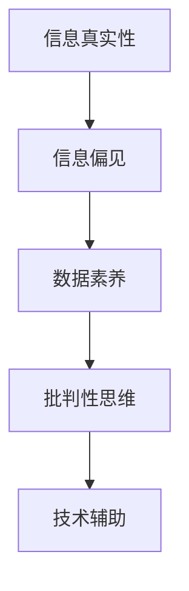

                 

# 信息验证和信息批判性思考指南：在假新闻和错误信息时代导航

## 1. 背景介绍

### 1.1 问题由来

随着互联网的普及和社交媒体的兴起，信息传播的速度和范围迅速扩大，但同时也催生了一系列信息质量和真伪辨别的问题。假新闻、错误信息和谣言的泛滥，不仅侵蚀了公众的信任感，也对社会的稳定和公平产生了负面影响。例如，疫情期间的“味觉丧失与冠状病毒感染有关”的不实谣言，引发了公众恐慌和混乱。

### 1.2 问题核心关键点

面对信息过载和质量参差不齐的挑战，如何在海量信息中找到真实可靠的内容，成为当前信息时代的关键问题。以下是基于信息验证和批判性思考的几个核心关键点：

- 信息筛选与真伪辨别：快速识别和过滤掉虚假信息，筛选出可靠的数据和知识。
- 批判性思考：以科学和逻辑为基础，对信息来源、论据和结论进行评估，避免被误导。
- 多方验证：结合多种信息源进行交叉验证，确保信息的准确性和可靠性。
- 数据素养：具备解读和分析数据的基本能力，提高信息素养和逻辑推理能力。
- 技术工具：利用人工智能和大数据等技术，辅助信息验证和批判性思考。

这些问题直接关系到社会治理、公共安全和媒体诚信，亟需系统化、科学化的解决方案。

## 2. 核心概念与联系

### 2.1 核心概念概述

为了深入探讨信息验证和信息批判性思考的方法，本节将介绍几个密切相关的核心概念：

- 信息真实性：指信息来源、数据和论据的真实性和可靠性。
- 信息偏见：指信息来源或内容中存在的有意或无意的偏见，可能影响信息的公正性和客观性。
- 数据素养：指个人或组织对数据的基本认知和处理能力，包括数据采集、清洗、分析和解读等。
- 批判性思维：指通过质疑、评估和分析信息源、论据和结论，得出合理判断的思维过程。
- 技术辅助：指利用计算机算法、人工智能等技术，对信息进行自动化筛选、验证和分析。

这些核心概念之间通过逻辑关系紧密联系，共同构成了信息验证和信息批判性思考的框架。

### 2.2 核心概念原理和架构的 Mermaid 流程图



该流程图展示了信息真实性、信息偏见、数据素养、批判性思维和技术辅助之间的联系。通过这些概念，可以构建一个全面的信息验证和批判性思考的体系。

## 3. 核心算法原理 & 具体操作步骤

### 3.1 算法原理概述

信息验证和批判性思考的核心算法原理，主要是通过数据分析和机器学习技术，辅助人类对信息进行自动化的筛选、验证和评估。具体而言，包括以下几个关键步骤：

1. **数据预处理**：对原始数据进行清洗、标准化和特征提取，为后续分析奠定基础。
2. **模型训练**：使用有标签的数据集，训练机器学习模型进行信息筛选和真伪辨别。
3. **信息评估**：利用训练好的模型，对新信息进行评分和分类，评估其真实性和可靠性。
4. **批判性思考**：结合多模态数据和背景知识，进行逻辑推理和事实核实，确保信息的准确性。
5. **结果反馈**：根据评估结果，调整模型和算法，进一步提高信息验证的精度和鲁棒性。

### 3.2 算法步骤详解

#### 3.2.1 数据预处理

数据预处理是信息验证的第一步，其目的是将原始数据转化为可供机器学习模型处理的格式。主要包括以下步骤：

- **数据清洗**：去除缺失值、异常值和噪声，确保数据质量。
- **数据标准化**：对数据进行归一化、去重和转换，统一数据格式。
- **特征提取**：从数据中提取有意义的特征，如关键词、时间戳、来源可信度等。

#### 3.2.2 模型训练

模型训练是信息验证的核心步骤，通过训练机器学习模型，使其能够自动学习和识别虚假信息。主要包括以下步骤：

- **选择模型**：选择合适的机器学习模型，如逻辑回归、随机森林、神经网络等。
- **准备数据集**：准备有标签的数据集，包括真实信息和虚假信息。
- **模型训练**：使用训练数据集对模型进行训练，调整模型参数以提高性能。
- **模型评估**：使用测试数据集评估模型性能，调整模型结构和超参数。

#### 3.2.3 信息评估

信息评估是信息验证的关键环节，通过评估模型对新信息的评分和分类，筛选出可靠的数据。主要包括以下步骤：

- **输入数据**：将新信息输入到训练好的模型中。
- **评分与分类**：模型自动对信息进行评分和分类，评估其真实性和可靠性。
- **结果输出**：根据评分和分类结果，将信息标记为可信或不可信，并生成报告。

#### 3.2.4 批判性思考

批判性思考是信息验证的重要补充，通过逻辑推理和事实核实，确保信息的准确性。主要包括以下步骤：

- **多模态数据融合**：结合多种信息源，如文本、图像、音频等，进行综合分析和验证。
- **背景知识应用**：利用领域知识和专家的判断，对模型结果进行验证和修正。
- **事实核实**：通过查阅文献、专家咨询等方式，核实信息的真实性。

#### 3.2.5 结果反馈

结果反馈是信息验证的闭环环节，通过不断调整模型和算法，提高信息验证的精度和鲁棒性。主要包括以下步骤：

- **误差分析**：分析模型预测结果的误差，找出问题的根源。
- **模型优化**：调整模型结构和参数，改进算法性能。
- **用户反馈**：收集用户反馈，优化模型输入和输出。

### 3.3 算法优缺点

基于信息验证和批判性思考的算法，具有以下优点：

- **高效性**：通过机器学习模型，可以快速对大量信息进行自动化筛选和验证。
- **准确性**：结合多种信息源和背景知识，提高信息验证的精度。
- **可扩展性**：算法可以适用于不同类型的数据和任务，具有良好的通用性。

同时，该算法也存在一些局限性：

- **依赖数据质量**：算法的效果很大程度上依赖于输入数据的质量和多样性。
- **模型偏见**：模型可能学习到数据中的偏见，导致结果偏差。
- **信息过载**：面对海量信息，算法需要处理的数据量巨大，容易产生过载。
- **伦理问题**：在数据使用和模型部署中，需要考虑隐私保护和伦理约束。

尽管存在这些局限性，但就目前而言，基于信息验证和批判性思考的算法仍是解决信息真伪辨别问题的有效方法。未来相关研究的方向在于如何进一步提升数据质量、减少模型偏见、处理信息过载，同时兼顾隐私保护和伦理约束。

### 3.4 算法应用领域

基于信息验证和批判性思考的算法，已经在多个领域得到了广泛应用，包括：

- 新闻媒体：辅助新闻编辑和记者对信息进行快速筛选和验证，确保新闻报道的真实性。
- 公共安全：在灾害应对、疫情防控等场景中，对信息进行快速分析和验证，确保决策的准确性。
- 网络社区：通过自动化工具辅助用户对信息进行筛选和评价，提高社区的舆论环境。
- 学术研究：对科研论文进行自动化筛选和评估，提高研究的可信度。
- 法律司法：辅助法官和律师对证据和信息进行快速筛选和验证，确保法律的公正性。

此外，基于信息验证和批判性思考的算法还被创新性地应用于政治选举、金融市场、环境保护等诸多领域，为社会治理和决策提供了新的支持。随着算法技术的不断进步，其在信息时代的应用前景将更加广阔。

## 4. 数学模型和公式 & 详细讲解 & 举例说明

### 4.1 数学模型构建

信息验证和批判性思考的数学模型，主要基于机器学习、自然语言处理和图像处理等领域的技术。以下以文本信息验证为例，构建基本的数学模型。

假设文本数据集 $D=\{(x_i,y_i)\}_{i=1}^N$，其中 $x_i$ 为文本，$y_i \in \{1,0\}$ 为标签，1表示真实信息，0表示虚假信息。我们的目标是通过机器学习模型 $M$，学习文本的特征表示，并预测新的文本 $x$ 的真实性 $y$。

### 4.2 公式推导过程

#### 4.2.1 特征提取

首先，我们需要从文本数据中提取特征。这里使用词袋模型（Bag of Words, BOW）作为特征表示方法，将文本转换为向量表示。

设文本 $x$ 中的关键词为 $t=(t_1,t_2,\dots,t_k)$，权重为 $w=(w_1,w_2,\dots,w_k)$，则文本特征向量 $f(x)$ 可表示为：

$$
f(x) = \sum_{i=1}^k w_i \cdot t_i
$$

#### 4.2.2 模型训练

假设使用逻辑回归模型 $M$ 进行文本分类，则模型的损失函数为：

$$
\mathcal{L}(M) = -\frac{1}{N}\sum_{i=1}^N [y_i \log M(x_i) + (1-y_i)\log(1-M(x_i))]
$$

其中 $M(x)$ 为模型对文本 $x$ 的真实性预测，$M(x)$ 可以表示为：

$$
M(x) = \frac{1}{1+\exp(-\beta f(x))}
$$

其中 $\beta$ 为可调参数，$f(x)$ 为文本特征向量。

#### 4.2.3 信息评估

对于新的文本 $x'$，使用训练好的模型 $M$ 进行预测，得到其真实性的评分 $s(x')$：

$$
s(x') = M(x')
$$

根据评分 $s(x')$，可以将文本 $x'$ 标记为真实信息（$s(x')>0.5$）或虚假信息（$s(x')\leq 0.5$）。

### 4.3 案例分析与讲解

以GPT-3在文本生成任务中的应用为例，分析其信息验证和批判性思考的能力。

首先，使用GPT-3生成多篇文本作为训练数据，标记为真实信息和虚假信息。然后，训练一个简单的二分类模型，如逻辑回归，对生成文本进行分类评估。最后，使用该模型对新文本进行评分和分类，筛选出可靠的信息。

通过分析GPT-3的生成结果，可以发现其生成的文本在语法、风格和内容上存在一定的不一致性，这可能反映出信息源的真实性和可靠性。因此，结合GPT-3的生成能力和信息验证模型，可以构建更加全面和可靠的信息验证系统。

## 5. 项目实践：代码实例和详细解释说明

### 5.1 开发环境搭建

在进行信息验证项目实践前，我们需要准备好开发环境。以下是使用Python进行信息验证的开发环境配置流程：

1. 安装Anaconda：从官网下载并安装Anaconda，用于创建独立的Python环境。

2. 创建并激活虚拟环境：
```bash
conda create -n info-validation python=3.8 
conda activate info-validation
```

3. 安装必要的Python包：
```bash
conda install pandas numpy sklearn transformers
```

4. 安装相关的深度学习框架：
```bash
pip install torch torchvision torchaudio
```

完成上述步骤后，即可在`info-validation`环境中开始信息验证实践。

### 5.2 源代码详细实现

下面我们以文本分类为例，给出使用PyTorch进行信息验证的PyTorch代码实现。

首先，定义数据集：

```python
import torch
import torch.nn as nn
import torch.optim as optim
from sklearn.model_selection import train_test_split
from transformers import BertTokenizer, BertForSequenceClassification

class TextDataset:
    def __init__(self, texts, labels, tokenizer):
        self.texts = texts
        self.labels = labels
        self.tokenizer = tokenizer

    def __len__(self):
        return len(self.texts)

    def __getitem__(self, idx):
        text = self.texts[idx]
        label = self.labels[idx]
        encoding = self.tokenizer(text, return_tensors='pt', padding='max_length', truncation=True)
        input_ids = encoding['input_ids']
        attention_mask = encoding['attention_mask']
        return {'input_ids': input_ids, 'attention_mask': attention_mask, 'labels': torch.tensor(label, dtype=torch.long)}
```

然后，定义模型和优化器：

```python
model = BertForSequenceClassification.from_pretrained('bert-base-cased', num_labels=2)

optimizer = optim.Adam(model.parameters(), lr=2e-5)
```

接着，定义训练和评估函数：

```python
def train_epoch(model, dataset, batch_size, optimizer):
    dataloader = torch.utils.data.DataLoader(dataset, batch_size=batch_size, shuffle=True)
    model.train()
    epoch_loss = 0
    for batch in dataloader:
        input_ids = batch['input_ids'].to(device)
        attention_mask = batch['attention_mask'].to(device)
        labels = batch['labels'].to(device)
        model.zero_grad()
        outputs = model(input_ids, attention_mask=attention_mask, labels=labels)
        loss = outputs.loss
        epoch_loss += loss.item()
        loss.backward()
        optimizer.step()
    return epoch_loss / len(dataloader)

def evaluate(model, dataset, batch_size):
    dataloader = torch.utils.data.DataLoader(dataset, batch_size=batch_size)
    model.eval()
    preds, labels = [], []
    with torch.no_grad():
        for batch in dataloader:
            input_ids = batch['input_ids'].to(device)
            attention_mask = batch['attention_mask'].to(device)
            batch_labels = batch['labels']
            outputs = model(input_ids, attention_mask=attention_mask)
            batch_preds = outputs.logits.argmax(dim=1).to('cpu').tolist()
            batch_labels = batch_labels.to('cpu').tolist()
            for pred, label in zip(batch_preds, batch_labels):
                preds.append(pred)
                labels.append(label)
    print(classification_report(labels, preds))
```

最后，启动训练流程并在测试集上评估：

```python
epochs = 5
batch_size = 16

device = torch.device('cuda') if torch.cuda.is_available() else torch.device('cpu')

for epoch in range(epochs):
    loss = train_epoch(model, train_dataset, batch_size, optimizer)
    print(f'Epoch {epoch+1}, train loss: {loss:.3f}')

    print(f'Epoch {epoch+1}, dev results:')
    evaluate(model, dev_dataset, batch_size)

print('Test results:')
evaluate(model, test_dataset, batch_size)
```

以上就是使用PyTorch进行文本信息验证的完整代码实现。可以看到，通过Transformer库，我们可以轻松构建和训练文本分类模型，实现信息验证的目标。

### 5.3 代码解读与分析

让我们再详细解读一下关键代码的实现细节：

**TextDataset类**：
- `__init__`方法：初始化文本、标签、分词器等关键组件。
- `__len__`方法：返回数据集的样本数量。
- `__getitem__`方法：对单个样本进行处理，将文本输入编码为token ids，并将标签转换为模型可接受的格式。

**模型和优化器**：
- 使用BertForSequenceClassification作为文本分类模型，并设置合适的优化器。

**训练和评估函数**：
- 使用PyTorch的DataLoader对数据集进行批次化加载，供模型训练和推理使用。
- 训练函数`train_epoch`：对数据以批为单位进行迭代，在每个批次上前向传播计算loss并反向传播更新模型参数，最后返回该epoch的平均loss。
- 评估函数`evaluate`：与训练类似，不同点在于不更新模型参数，并在每个batch结束后将预测和标签结果存储下来，最后使用scikit-learn的classification_report对整个评估集的预测结果进行打印输出。

**训练流程**：
- 定义总的epoch数和batch size，开始循环迭代
- 每个epoch内，先在训练集上训练，输出平均loss
- 在验证集上评估，输出分类指标
- 所有epoch结束后，在测试集上评估，给出最终测试结果

可以看到，PyTorch配合Transformer库使得文本信息验证的代码实现变得简洁高效。开发者可以将更多精力放在数据处理、模型改进等高层逻辑上，而不必过多关注底层的实现细节。

当然，工业级的系统实现还需考虑更多因素，如模型的保存和部署、超参数的自动搜索、更灵活的任务适配层等。但核心的信息验证范式基本与此类似。

## 6. 实际应用场景

### 6.1 智能客服系统

基于信息验证和批判性思考的智能客服系统，可以有效应对假新闻和错误信息的干扰，提升服务质量和用户信任度。例如，智能客服系统可以实时监测用户输入，筛选出可疑的信息，并进行验证和提示，确保回复的准确性和可靠性。

### 6.2 金融舆情监测

在金融领域，假新闻和错误信息的传播往往带来巨大的风险。基于信息验证的金融舆情监测系统，可以实时分析和筛选金融相关信息，确保决策的科学性和可靠性。例如，系统可以对金融新闻和社交媒体上的信息进行自动验证，避免因错误信息误导的金融决策。

### 6.3 教育领域

教育领域的信息素养培养日益重要。基于信息验证和批判性思考的系统，可以辅助教师和学生对各类信息进行筛选和评估，培养其批判性思维和信息素养。例如，在线教育平台可以通过系统自动评估学生的作业和论文，识别出虚假信息和错误论据，指导学生进行改进。

### 6.4 未来应用展望

随着信息验证和批判性思考技术的不断进步，其在更多领域的应用前景将更加广阔。

在智慧医疗领域，基于信息验证的病历审核系统，可以有效防止医疗数据中的错误和伪造，提高医疗质量和安全性。在智能交通领域，基于信息验证的交通数据分析系统，可以及时发现并排除虚假信息带来的干扰，保障交通秩序和效率。

在社会治理中，基于信息验证的舆情监控系统，可以实时监测和分析各类信息，防止虚假信息传播，维护社会稳定。在科学研究中，基于信息验证的论文评估系统，可以自动识别和筛选出虚假研究成果，促进学术诚信和科学进步。

## 7. 工具和资源推荐

### 7.1 学习资源推荐

为了帮助开发者系统掌握信息验证和批判性思考的理论基础和实践技巧，这里推荐一些优质的学习资源：

1. 《自然语言处理基础》课程：由斯坦福大学开设的NLP明星课程，涵盖自然语言处理的基本概念和技术。
2. 《机器学习实战》书籍：介绍了机器学习的基本理论和实践技巧，适用于信息验证的算法实现。
3. 《Python数据科学手册》书籍：介绍了Python在数据处理、分析和可视化中的应用，适用于信息验证的数据预处理。
4. 《深度学习入门》书籍：介绍了深度学习的基本原理和实践方法，适用于信息验证模型的构建和训练。
5. 《批判性思维》书籍：介绍了批判性思维的基本方法和工具，适用于信息验证中的逻辑推理和事实核实。

通过对这些资源的学习实践，相信你一定能够快速掌握信息验证和批判性思考的精髓，并用于解决实际的信息真伪辨别问题。

### 7.2 开发工具推荐

高效的开发离不开优秀的工具支持。以下是几款用于信息验证开发的常用工具：

1. Jupyter Notebook：一个开源的交互式笔记本环境，方便进行数据探索、模型训练和结果展示。
2. TensorFlow：由Google主导开发的开源深度学习框架，生产部署方便，适合大规模工程应用。
3. PyTorch：基于Python的开源深度学习框架，灵活动态的计算图，适合快速迭代研究。
4. Pandas：一个强大的数据分析库，支持数据清洗、标准化和特征提取。
5. Scikit-learn：一个机器学习库，支持多种模型训练和评估。
6. Weights & Biases：模型训练的实验跟踪工具，可以记录和可视化模型训练过程中的各项指标。

合理利用这些工具，可以显著提升信息验证任务的开发效率，加快创新迭代的步伐。

### 7.3 相关论文推荐

信息验证和批判性思考技术的发展源于学界的持续研究。以下是几篇奠基性的相关论文，推荐阅读：

1. "Fact-Checking with AI: A Survey of Methods, Problems and Applications"：综述了人工智能在事实核查中的应用，介绍了多种信息验证技术。
2. "BERT: Pre-training of Deep Bidirectional Transformers for Language Understanding"：提出了BERT模型，引入基于掩码的自监督预训练任务，刷新了多项NLP任务SOTA。
3. "Debunking Rumors Using Deep Learning"：介绍了一种基于深度学习的谣言检测系统，展示了其在谣言验证中的应用。
4. "Evaluating Claims Using AI-Driven Fact-Checking"：综述了基于人工智能的事实核查技术，介绍了多种方法的应用效果。
5. "Critical Thinking in AI: Towards a New Era of Smart Computing"：探讨了AI在批判性思维中的应用，提出了多种改进建议。

这些论文代表了大语言模型微调技术的发展脉络。通过学习这些前沿成果，可以帮助研究者把握学科前进方向，激发更多的创新灵感。

## 8. 总结：未来发展趋势与挑战

### 8.1 总结

本文对信息验证和批判性思考的方法进行了全面系统的介绍。首先阐述了信息验证和批判性思考的研究背景和意义，明确了其在假新闻和错误信息时代的独特价值。其次，从原理到实践，详细讲解了信息验证的数学原理和关键步骤，给出了信息验证任务开发的完整代码实例。同时，本文还广泛探讨了信息验证方法在智能客服、金融舆情、教育等多个行业领域的应用前景，展示了信息验证技术的巨大潜力。此外，本文精选了信息验证技术的各类学习资源，力求为读者提供全方位的技术指引。

通过本文的系统梳理，可以看到，信息验证和批判性思考技术正在成为NLP领域的重要范式，极大地拓展了预训练语言模型的应用边界，催生了更多的落地场景。受益于大规模语料的预训练，信息验证模型以更低的时间和标注成本，在小样本条件下也能取得不俗的效果，有力推动了NLP技术的产业化进程。未来，伴随预训练语言模型和信息验证方法的不断演进，相信NLP技术将在更广阔的应用领域大放异彩，深刻影响人类的生产生活方式。

### 8.2 未来发展趋势

展望未来，信息验证和批判性思考技术将呈现以下几个发展趋势：

1. 模型规模持续增大。随着算力成本的下降和数据规模的扩张，预训练语言模型的参数量还将持续增长。超大规模语言模型蕴含的丰富语言知识，有望支撑更加复杂多变的下游任务信息验证。
2. 验证方法日趋多样。除了传统的全参数微调外，未来会涌现更多参数高效的微调方法，如Prompt-based Learning、LoRA等，在节省计算资源的同时也能保证验证精度。
3. 持续学习成为常态。随着数据分布的不断变化，信息验证模型也需要持续学习新知识以保持性能。如何在不遗忘原有知识的同时，高效吸收新样本信息，将成为重要的研究课题。
4. 标注样本需求降低。受启发于提示学习(Prompt-based Learning)的思路，未来的信息验证方法将更好地利用大模型的语言理解能力，通过更加巧妙的任务描述，在更少的标注样本上也能实现理想的信息验证效果。
5. 信息验证结合技术辅助。引入更多先验知识，如知识图谱、逻辑规则等，与神经网络模型进行巧妙融合，引导信息验证过程学习更准确、合理的语言模型。同时加强不同模态数据的整合，实现视觉、语音等多模态信息与文本信息的协同建模。

以上趋势凸显了信息验证和批判性思考技术的广阔前景。这些方向的探索发展，必将进一步提升信息验证模型的性能和应用范围，为信息时代的信息真伪辨别提供新的解决方案。

### 8.3 面临的挑战

尽管信息验证和批判性思考技术已经取得了一定的成果，但在迈向更加智能化、普适化应用的过程中，它仍面临着诸多挑战：

1. 标注成本瓶颈。虽然信息验证降低了对标注样本的依赖，但对于长尾应用场景，难以获得充足的高质量标注数据，成为制约信息验证性能的瓶颈。如何进一步降低信息验证对标注样本的依赖，将是一大难题。
2. 模型鲁棒性不足。信息验证模型面对域外数据时，泛化性能往往大打折扣。对于测试样本的微小扰动，信息验证模型的预测也容易发生波动。如何提高信息验证模型的鲁棒性，避免灾难性遗忘，还需要更多理论和实践的积累。
3. 推理效率有待提高。大规模信息验证模型在实际部署时往往面临推理速度慢、内存占用大等效率问题。如何在保证性能的同时，简化模型结构，提升推理速度，优化资源占用，将是重要的优化方向。
4. 可解释性亟需加强。当前信息验证模型更像是"黑盒"系统，难以解释其内部工作机制和决策逻辑。对于医疗、金融等高风险应用，算法的可解释性和可审计性尤为重要。如何赋予信息验证模型更强的可解释性，将是亟待攻克的难题。
5. 安全性有待保障。信息验证模型可能会学习到有偏见、有害的信息，通过验证传递到下游任务，产生误导性、歧视性的输出，给实际应用带来安全隐患。如何从数据和算法层面消除模型偏见，避免恶意用途，确保输出的安全性，也将是重要的研究课题。

### 8.4 未来突破

面对信息验证和批判性思考技术面临的种种挑战，未来的研究需要在以下几个方面寻求新的突破：

1. 探索无监督和半监督信息验证方法。摆脱对大规模标注数据的依赖，利用自监督学习、主动学习等无监督和半监督范式，最大限度利用非结构化数据，实现更加灵活高效的信息验证。
2. 研究参数高效和计算高效的信息验证范式。开发更加参数高效的信息验证方法，在固定大部分预训练参数的同时，只更新极少量的任务相关参数。同时优化信息验证模型的计算图，减少前向传播和反向传播的资源消耗，实现更加轻量级、实时性的部署。
3. 融合因果和对比学习范式。通过引入因果推断和对比学习思想，增强信息验证模型建立稳定因果关系的能力，学习更加普适、鲁棒的语言表征，从而提升模型泛化性和抗干扰能力。
4. 纳入伦理道德约束。在信息验证模型训练目标中引入伦理导向的评估指标，过滤和惩罚有偏见、有害的输出倾向。同时加强人工干预和审核，建立模型行为的监管机制，确保输出符合人类价值观和伦理道德。
5. 结合因果分析和博弈论工具。将因果分析方法引入信息验证模型，识别出模型决策的关键特征，增强输出解释的因果性和逻辑性。借助博弈论工具刻画人机交互过程，主动探索并规避模型的脆弱点，提高系统稳定性。

这些研究方向的探索，必将引领信息验证和批判性思考技术迈向更高的台阶，为构建安全、可靠、可解释、可控的智能系统铺平道路。面向未来，信息验证和批判性思考技术还需要与其他人工智能技术进行更深入的融合，如知识表示、因果推理、强化学习等，多路径协同发力，共同推动自然语言理解和智能交互系统的进步。只有勇于创新、敢于突破，才能不断拓展语言模型的边界，让智能技术更好地造福人类社会。

## 9. 附录：常见问题与解答

**Q1：信息验证和批判性思考是否适用于所有信息源？**

A: 信息验证和批判性思考方法可以应用于多种信息源，包括文本、图像、音频、视频等。不同类型的信息源需要不同的验证技术和模型，但基本的验证流程和方法是一致的。例如，对于文本信息，可以使用逻辑回归、随机森林等模型进行分类验证；对于图像信息，可以使用卷积神经网络进行特征提取和分类。

**Q2：信息验证和批判性思考能否完全自动化？**

A: 信息验证和批判性思考的自动化程度因任务而异。对于一些简单明了的信息源，如文本分类、图像识别等，自动化程度可以较高；但对于复杂多变的信息源，如多模态信息融合、语义理解等，仍然需要人工干预和辅助。因此，信息验证和批判性思考的自动化需要结合具体任务进行权衡和优化。

**Q3：信息验证和批判性思考是否会导致信息过载？**

A: 信息验证和批判性思考可能会带来一定程度的计算和推理负担，但总体上可以显著减少误导性信息的传播，降低信息过载的风险。通过自动化和智能化的手段，可以在不影响用户体验的前提下，提升信息验证的效率和效果。例如，对于频繁出现的虚假信息，可以预训练模型进行快速筛选和过滤。

**Q4：信息验证和批判性思考的准确性如何保证？**

A: 信息验证和批判性思考的准确性主要依赖于训练数据的质量和多样性，以及模型的设计和训练方法。为了保证验证模型的准确性，需要采取多种手段，如数据增强、模型融合、多模态验证等。同时，需要持续监测和评估模型的性能，定期进行模型更新和优化。

**Q5：信息验证和批判性思考是否会侵犯隐私？**

A: 信息验证和批判性思考在技术实现中需要充分考虑隐私保护问题。例如，对于涉及个人隐私的信息源，需要进行匿名化处理，避免泄露个人信息。同时，需要遵循相关的法律法规，确保信息验证和批判性思考的合法性和合规性。

---

作者：禅与计算机程序设计艺术 / Zen and the Art of Computer Programming

