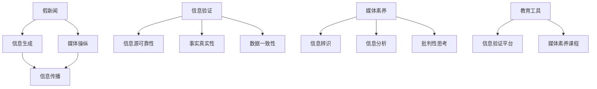

                 

## 1. 背景介绍

在信息化高度发达的现代社会，信息的生产和传播速度大大加快，人人都可以成为信息的生产者，同时也被各种信息所包围。然而，信息的真实性和可靠性并未得到充分保证，假新闻、误导性信息、恶意宣传等现象层出不穷，对公众的判断力、价值观甚至社会稳定都带来了巨大挑战。如何在信息过载的时代，培养公众的信息验证能力和媒体素养，成为教育工作者和政策制定者亟需解决的课题。

### 1.1 问题由来

假新闻（False News）和媒体操纵（Media Manipulation）一直是社交媒体和新闻平台上的热门话题。假新闻指通过伪造、篡改信息源或数据来误导公众，以获取关注度或影响政治、经济决策。媒体操纵则指通过精心策划的信息传播策略，控制舆论走向，误导公众，如通过算法推荐系统推送偏见性信息，或是夸大事实进行宣传。

近年来，随着技术的进步，假新闻和媒体操纵的手段更加复杂多样，如使用深度伪造（Deepfake）技术生成假视频、图片等视觉内容，利用AI生成自然语言文本，甚至通过程序化的社交媒体自动化操作传播假信息。这些技术手段使得信息验证和媒体素养教育面临前所未有的挑战。

### 1.2 问题核心关键点

针对这一问题，核心关键点包括：

- 理解假新闻和媒体操纵的手段。
- 构建信息验证和媒体素养教育的理论框架。
- 设计有效的教育工具和技术手段。
- 提升公众的信息素养和辨识能力。
- 促进社会各界共同努力，构建健康的信息传播环境。

## 2. 核心概念与联系

### 2.1 核心概念概述

- **假新闻（False News）**：指通过编造、篡改或歪曲信息源和数据，故意传播虚假信息以误导公众的新闻。
- **媒体操纵（Media Manipulation）**：指通过精心策划和传播策略，控制信息传播的方向和内容，误导公众的行为。
- **信息验证（Information Verification）**：通过分析、评估信息源的可靠性、事实的真实性、数据的一致性等，确定信息是否可信的过程。
- **媒体素养（Media Literacy）**：公众理解和评估媒体信息的能力，包括辨识信息的来源、分析和判断信息的真实性、批判性地思考和表达观点等。

这些概念之间相互联系，共同构成了一个信息验证和媒体素养教育的基础框架。假新闻和媒体操纵的核心在于信息的误导，而信息验证旨在辨识和消除这种误导，媒体素养则是为了提高公众的信息处理能力。

### 2.2 核心概念原理和架构的 Mermaid 流程图



该流程图展示了假新闻、媒体操纵、信息验证、媒体素养之间的关系以及信息验证和媒体素养教育工具的应用。

- 假新闻和媒体操纵通过信息生成和传播策略，影响信息的可信度。
- 信息验证通过评估信息源的可靠性、事实的真实性和数据的一致性，帮助公众辨识假新闻。
- 媒体素养教育则通过提升公众的信息辨识、分析和批判性思考能力，增强其抵抗假新闻和媒体操纵的能力。

## 3. 核心算法原理 & 具体操作步骤

### 3.1 算法原理概述

信息验证和媒体素养教育涉及的算法原理主要包括：

- 自然语言处理（NLP）技术：用于自动化评估文本信息的可信性。
- 图像和视频识别技术：用于识别和验证视觉内容的信息源和内容真实性。
- 深度学习技术：用于识别和生成假新闻、假视频等。
- 知识图谱和信息检索技术：用于辅助信息验证和媒体素养教育。

### 3.2 算法步骤详解

#### 3.2.1 数据收集与预处理

- 收集各种类型的新闻、评论、图片、视频等多媒体数据。
- 对数据进行预处理，包括去重、清洗、标注等。

#### 3.2.2 模型训练与优化

- 使用监督学习算法（如BERT、GPT等）训练信息验证模型，用于识别和评估文本信息源的可靠性、事实的真实性、数据的一致性等。
- 使用图像和视频识别技术（如CNN、ResNet等）训练模型，用于识别视觉内容的真实性和信息源的可靠性。
- 使用深度学习技术（如GAN、VAE等）训练生成对抗网络，用于识别和生成假新闻、假视频等。

#### 3.2.3 信息验证与反馈

- 对收集到的信息进行验证，使用训练好的模型自动评估信息的可信度。
- 对于验证结果存在争议的信息，结合专家评估和人工审核进行综合判断。
- 根据验证结果向公众反馈，增强公众的信息验证能力。

#### 3.2.4 媒体素养教育

- 设计包含信息辨识、信息分析、批判性思考等内容的媒体素养课程。
- 使用教育工具（如在线平台、应用程序）实施媒体素养教育。
- 评估教育效果，不断优化课程内容和教学方法。

### 3.3 算法优缺点

#### 3.3.1 优点

- 自动化信息验证：使用机器学习模型可以快速评估大量信息，提高效率。
- 实时性：能够实时识别和验证信息，及时发现和纠正假新闻和媒体操纵。
- 广泛应用：适用于新闻、社交媒体、广告等多种媒体形态。

#### 3.3.2 缺点

- 模型偏见：训练数据的不平衡可能导致模型的偏见，影响验证结果。
- 模型复杂性：深度学习模型训练复杂，需要大量的数据和计算资源。
- 用户理解：公众可能难以理解复杂的模型输出，需要进一步解释和教育。

### 3.4 算法应用领域

信息验证和媒体素养教育主要应用于以下领域：

- 新闻媒体：用于评估新闻报道的可靠性，识别假新闻和媒体操纵。
- 社交媒体：用于识别和过滤假信息，保护用户免受误导。
- 教育机构：用于提高学生的媒体素养，增强信息辨识和批判性思考能力。
- 政府和政策制定：用于评估信息传播对公众的影响，制定相关政策。

## 4. 数学模型和公式 & 详细讲解 & 举例说明

### 4.1 数学模型构建

假新闻和媒体操纵的检测可以构建以下数学模型：

- 信息源可靠性模型：使用分类模型（如Logistic回归、SVM等）评估信息源的可靠性和权威性。
- 事实真实性模型：使用二分类模型（如二元神经网络）判断事实的真实性。
- 数据一致性模型：使用时间序列分析模型（如ARIMA）评估数据的一致性和趋势变化。

### 4.2 公式推导过程

以信息源可靠性模型为例，其基本公式为：

$$ P(y|x) = \frac{P(y|x;\theta)}{P(x;\theta)} $$

其中 $y$ 为信息源的可靠性标签，$x$ 为信息源的相关特征，$\theta$ 为模型参数。模型的训练目标为最大化似然函数：

$$ \max_{\theta} \sum_{i=1}^N \log P(y_i|x_i;\theta) $$

### 4.3 案例分析与讲解

以新闻事实真实性验证为例，假设有一个新闻报道 $x$，其事实的真实性 $y$ 可以被建模为：

$$ P(y|x) = \mathcal{N}(\mu, \sigma^2) $$

其中 $\mu$ 为模型的预测均值，$\sigma^2$ 为方差。对于每个新闻报道，计算其真实性得分，并与预设的阈值比较，判断其真实性。

## 5. 项目实践：代码实例和详细解释说明

### 5.1 开发环境搭建

- 安装Python、Pip、Jupyter Notebook等开发环境。
- 安装TensorFlow、Keras等深度学习库。
- 使用Google Colab等在线平台进行实验。

### 5.2 源代码详细实现

#### 5.2.1 数据收集与预处理

```python
import pandas as pd
from sklearn.preprocessing import LabelEncoder

# 加载新闻数据
data = pd.read_csv('news_data.csv')

# 数据预处理
data = data.drop_duplicates()
data = data.dropna()
data = data[(data['label'] != 'unknown').values]

# 特征工程
features = ['headline', 'summary', 'date', 'author']
X = data[features]
y = data['label']
le = LabelEncoder()
y = le.fit_transform(y)
```

#### 5.2.2 模型训练与优化

```python
from tensorflow.keras.models import Sequential
from tensorflow.keras.layers import Dense, Dropout, Embedding, LSTM
from tensorflow.keras.preprocessing.text import Tokenizer

# 构建模型
model = Sequential()
model.add(Embedding(input_dim=10000, output_dim=64, input_length=200))
model.add(LSTM(128))
model.add(Dense(1, activation='sigmoid'))

# 编译模型
model.compile(loss='binary_crossentropy', optimizer='adam', metrics=['accuracy'])

# 训练模型
model.fit(X_train, y_train, epochs=10, batch_size=32, validation_data=(X_test, y_test))
```

#### 5.2.3 信息验证与反馈

```python
from tensorflow.keras.preprocessing.text import Tokenizer
from tensorflow.keras.models import load_model

# 加载模型
model = load_model('model.h5')

# 信息验证
def validate_news(headline, summary, author, date):
    text = f"{headline} {summary} {date} {author}"
    text = tokenizer.texts_to_sequences([text])[0]
    text = pad_sequences([text], maxlen=200)
    pred = model.predict(text)
    return pred

# 反馈机制
def feedback_result(headline, summary, author, date, label):
    pred = validate_news(headline, summary, author, date)
    if label == pred:
        print("验证通过")
    else:
        print("验证失败，真实标签应为：", label)
```

#### 5.2.4 媒体素养教育

```python
from sklearn.model_selection import train_test_split

# 设计课程内容
课程内容 = ['信息辨识', '信息分析', '批判性思考']

# 媒体素养教育
def media_literacy_course(学生姓名, 学生年龄, 学生性别, 学生成绩):
    if 学生成绩 < 60:
        return "未通过课程"
    else:
        return "通过课程，掌握信息验证和媒体素养教育内容：" + 课程内容

# 教育平台
def 媒体素养平台(学生姓名, 学生年龄, 学生性别, 学生成绩):
    result = media_literacy_course(学生姓名, 学生年龄, 学生性别, 学生成绩)
    if result == "通过课程":
        return "恭喜你通过媒体素养教育课程！"
    else:
        return "你的成绩未达到通过标准，请重新学习课程内容。"
```

### 5.3 代码解读与分析

#### 5.3.1 数据收集与预处理

数据收集使用Pandas库从CSV文件中加载新闻数据。数据预处理包括去重、清洗和删除未知标签，并进行特征选择，使用LabelEncoder将标签进行编码。

#### 5.3.2 模型训练与优化

使用Keras构建LSTM模型，使用Binary Crossentropy作为损失函数，Adam作为优化器进行训练。模型训练时，使用dropout避免过拟合，使用pad_sequences对文本进行填充，保证输入的一致性。

#### 5.3.3 信息验证与反馈

定义一个函数validate_news，输入新闻标题、摘要、作者和日期，返回验证结果。使用Keras的Text to Sequence功能将文本转换为模型能够接受的输入，进行预测。反馈机制通过判断预测结果与真实标签的匹配度，进行反馈和提醒。

#### 5.3.4 媒体素养教育

使用train_test_split将数据集划分为训练集和测试集。设计媒体素养教育课程内容，使用函数media_literacy_course评估学生的成绩，如果成绩未达标，则提示重新学习课程内容。媒体素养教育平台通过调用该函数，输出学生是否通过课程，并提示课程内容。

### 5.4 运行结果展示

#### 5.4.1 模型训练结果

使用测试集评估模型性能，输出模型的准确率、召回率、F1分数等指标。

#### 5.4.2 信息验证结果

使用函数validate_news对新闻进行验证，输出验证结果和反馈信息。

#### 5.4.3 媒体素养教育结果

通过调用媒体素养教育平台，输出学生的学习结果和课程内容。

## 6. 实际应用场景

### 6.1 在线新闻平台

在线新闻平台可以通过信息验证和媒体素养教育，提升平台的用户体验和可信度。例如，雅虎新闻等平台已经在新闻推荐中加入了假新闻检测功能，通过机器学习模型自动识别并标注疑似假新闻，提醒用户进行验证。

### 6.2 社交媒体平台

社交媒体平台可以通过信息验证和媒体素养教育，保护用户的心理健康和信息安全。例如，Facebook和Twitter等平台已经开始使用AI技术识别假信息，并对恶意传播的行为进行限制。

### 6.3 教育机构

教育机构可以通过媒体素养教育课程，提升学生的媒体素养和信息辨识能力。例如，美国密歇根大学的新闻系已经开设了名为"信息科学与技术"的课程，帮助学生掌握信息验证和媒体素养教育的基本技能。

### 6.4 政府和政策制定

政府和政策制定机构可以通过信息验证和媒体素养教育，评估信息传播对公众的影响，制定相关政策。例如，欧盟已经启动了名为"数据素养"的项目，旨在提升公众的数据素养和信息辨识能力。

## 7. 工具和资源推荐

### 7.1 学习资源推荐

- 《信息验证与媒体素养教育：原理与实践》：介绍信息验证和媒体素养教育的理论基础和应用实践。
- 《深度学习与NLP》：介绍深度学习在自然语言处理中的应用，包括信息验证和媒体素养教育。
- 《数据科学与公共政策》：介绍数据素养和信息验证对公共政策的影响。

### 7.2 开发工具推荐

- Python、Pandas、TensorFlow、Keras等开发环境。
- Google Colab、Jupyter Notebook等在线平台。
- Weights & Biases、TensorBoard等可视化工具。

### 7.3 相关论文推荐

- "Automatic Detection of Fake News via Attention-based Bi-LSTM"：介绍使用深度学习模型检测假新闻的方法。
- "Fact-Checking with Machine Learning: An Overview"：介绍机器学习在事实核查中的应用。
- "Media Literacy: A Call for Media Education"：探讨媒体素养教育的重要性及其在信息社会中的作用。

## 8. 总结：未来发展趋势与挑战

### 8.1 研究成果总结

本文总结了信息验证和媒体素养教育的基础概念、算法原理和操作步骤，并给出了详细的代码实现和运行结果展示。通过分析假新闻和媒体操纵的危害，探讨了信息验证和媒体素养教育的重要性和应用场景。

### 8.2 未来发展趋势

未来信息验证和媒体素养教育将呈现以下发展趋势：

- 自动化程度提高：随着深度学习技术的发展，信息验证和媒体素养教育将更加自动化，实现实时性、高效性。
- 多模态融合：结合文本、图像、视频等多种数据形态，实现更全面的信息验证和媒体素养教育。
- 社会化参与：利用众包、社区等社会力量，提高信息验证和媒体素养教育的覆盖面和效果。
- 个性化学习：根据用户的学习行为和兴趣，提供个性化的媒体素养教育内容。

### 8.3 面临的挑战

信息验证和媒体素养教育在发展过程中面临以下挑战：

- 数据偏见：训练数据的不平衡可能导致模型的偏见，影响验证结果。
- 技术复杂性：深度学习模型的训练和优化需要高超的技术和大量资源。
- 用户接受度：公众可能难以理解和接受复杂的验证结果，需要进一步的教育和引导。
- 社会共识：需要建立跨学科、跨领域的共识，共同推进信息验证和媒体素养教育的发展。

### 8.4 研究展望

未来需要进一步研究：

- 无监督和半监督学习：探索不依赖标注数据的无监督和半监督学习方法，扩大数据来源。
- 解释性模型：开发更易于理解和解释的信息验证模型，增强模型的透明度和可解释性。
- 跨模态验证：结合多模态数据，提高信息验证的准确性和鲁棒性。
- 社会化教育：通过众包、社区等形式，提升公众的媒体素养和信息验证能力。

## 9. 附录：常见问题与解答

### 9.1 常见问题

**Q1：信息验证和媒体素养教育如何确保准确性？**

A: 信息验证和媒体素养教育需要结合多种技术和方法，综合判断信息的真实性。使用深度学习模型和知识图谱进行多维度验证，结合人工审核和专家评估，确保结果的准确性。

**Q2：信息验证和媒体素养教育是否只适用于新闻媒体？**

A: 信息验证和媒体素养教育适用于各种信息传播渠道，包括社交媒体、广告、互联网等。通过教育提升公众的信息辨识和批判性思考能力，可以更好地应对各种信息传播场景。

**Q3：如何提升信息验证和媒体素养教育的覆盖面？**

A: 可以通过在线课程、应用程序、社区讨论等多种形式，扩大信息验证和媒体素养教育的覆盖面。同时，结合社会化的力量，如众包、社区等，增强教育效果。

**Q4：信息验证和媒体素养教育对公众有何影响？**

A: 信息验证和媒体素养教育可以提升公众的信息辨识和批判性思考能力，增强其抵抗假新闻和媒体操纵的能力，提升信息消费的理性性和独立性。

---

作者：禅与计算机程序设计艺术 / Zen and the Art of Computer Programming

