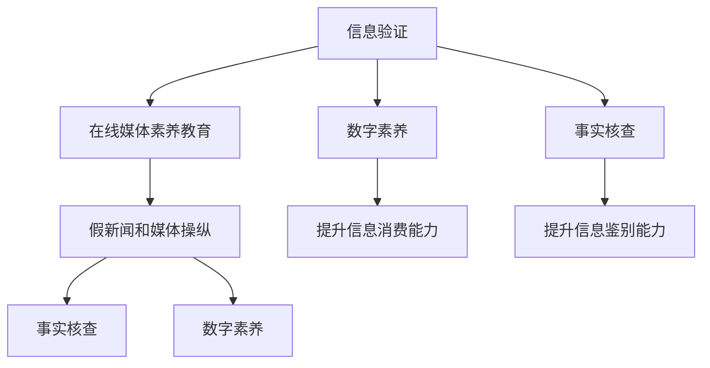

                 

# 信息验证和在线媒体素养教育：为假新闻和媒体操纵时代培养媒体素养

> 关键词：信息验证, 在线媒体素养教育, 假新闻, 媒体操纵, 事实核查, 数字素养, 逻辑思维, 批判性思维, 数据驱动决策

## 1. 背景介绍

### 1.1 问题由来
在信息爆炸的时代，假新闻、误导性信息、媒体操纵等现象愈发严重，对公众的认知和判断带来了巨大挑战。如何培养公众的信息验证能力和媒体素养，成为当前全球社会和教育界共同关注的重大问题。

在数字化环境下，信息的获取、传播和消费方式发生了深刻变化。网络媒体的兴起打破了传统的信息传播渠道，但同时也导致了信息源的复杂化和多元化的传播环境。假新闻、谣言和信息操纵成为了常态，严重扰乱了公共舆论和社会秩序。

信息验证和在线媒体素养教育旨在帮助公众掌握必要的信息甄别技能和媒体消费策略，提高他们的批判性思维和逻辑推理能力，培养良好的信息素养。这对于维护社会稳定、促进公共理性、提升个体信息消费质量和效率具有重要意义。

### 1.2 问题核心关键点
1. **信息验证**：辨别信息的真实性和可靠性，特别是在假新闻泛滥的时代，如何通过技术手段和思维训练，识别和判断信息源的可信度、内容的一致性和信息的真实性。
2. **在线媒体素养教育**：培养公众在数字媒介环境下，正确使用和评估在线信息资源，合理消费媒体内容，学会从多角度审视问题，提升信息素养和批判性思维。
3. **假新闻和媒体操纵**：理解假新闻和媒体操纵的手段和特点，掌握识别和防范技巧，提高公众对信息的鉴别能力。
4. **事实核查**：基于数据和证据的核查方法，提供可信的信息源和工具，支持公众进行事实核查和信息验证。
5. **数字素养**：掌握基本的信息技术和数字工具，提升在数字化社会中的生存和发展能力，如搜索、筛选、分析和评估信息的能力。

这些关键点构成了信息验证和在线媒体素养教育的框架，帮助公众在复杂的信息环境中作出明智的判断和决策。

### 1.3 问题研究意义
信息验证和在线媒体素养教育具有以下重要意义：

1. **提升公共理性**：通过教育培养公众的批判性思维和逻辑推理能力，增强对假新闻和媒体操纵的识别和抵制能力，促进社会的理性讨论和公共决策。
2. **维护社会稳定**：提升公众对信息的甄别能力，避免被假新闻和误导性信息所误导，减少因信息误导引发的社会动荡。
3. **促进信息消费质量**：培养公众的信息消费意识和能力，提高信息的筛选和利用效率，增强对优质内容的识别和选择。
4. **推动知识更新和创新**：通过信息验证和媒体素养教育，促进个体知识的更新和创新，支持科技、经济和社会的发展。

## 2. 核心概念与联系

### 2.1 核心概念概述

为更好地理解信息验证和在线媒体素养教育，本节将介绍几个核心概念：

- **信息验证**：指对接收到的信息进行真伪判断和可靠性评估的过程。包括识别信息源的可信度、内容的一致性和信息的真实性。
- **在线媒体素养教育**：指在数字化环境下，通过教育培养公众的信息获取、评估、分析和运用能力，提高其媒体素养和信息素养。
- **假新闻和媒体操纵**：指通过编造虚假信息、误导性报道或扭曲事实来达到某种目的的行为。
- **事实核查**：指通过收集、分析和评估证据来验证信息的真实性。包括使用可信的信息源和工具，以及应用逻辑推理和证据评估。
- **数字素养**：指在数字化社会中，掌握基本的信息技术和数字工具，提升信息消费、筛选、分析和评估能力。

这些核心概念之间的联系可以概括为：信息验证是在线媒体素养教育的基础，通过教育和实践，提升公众的信息验证能力；而假新闻和媒体操纵是信息验证的主要对象，事实核查和数字素养则是应对假新闻和媒体操纵的重要手段和能力。

### 2.2 核心概念原理和架构的 Mermaid 流程图



这个流程图展示了信息验证和在线媒体素养教育与其他相关概念之间的联系和作用：

- 信息验证是在线媒体素养教育的基础，通过教育提升公众的信息验证能力。
- 假新闻和媒体操纵是信息验证的主要对象，事实核查和数字素养是应对假新闻和媒体操纵的重要手段和能力。
- 数字素养是提升信息消费和鉴别能力的基础，事实核查是提升信息验证能力的关键。

## 3. 核心算法原理 & 具体操作步骤

### 3.1 算法原理概述

信息验证和在线媒体素养教育的算法原理主要涉及信息筛选、事实核查、逻辑推理和数据驱动决策。核心思想是通过技术手段和思维训练，帮助公众掌握必要的信息验证技能和媒体素养。

信息验证和在线媒体素养教育可以概括为以下几个步骤：

1. **信息筛选**：从大量信息中筛选出高质量、可靠的信息源和内容。
2. **事实核查**：使用可信的信息源和工具，验证信息的真实性和可靠性。
3. **逻辑推理**：运用批判性思维和逻辑推理，评估信息的可信度和逻辑性。
4. **数据驱动决策**：基于数据和证据的核查方法，支持公众进行事实核查和信息验证，作出明智的判断和决策。

这些步骤共同构成了一个系统的信息验证和在线媒体素养教育框架，帮助公众在复杂的信息环境中做出明智的判断和决策。

### 3.2 算法步骤详解

**步骤1: 信息筛选**

1. **选择合适的信息源**：选择可信的新闻机构、科学期刊、学术报告等高质量的信息源。
2. **使用关键词和搜索技巧**：通过有效的关键词和搜索技巧，快速找到相关信息。
3. **评估信息源的权威性和可信度**：通过查看信息源的背景、声誉和历史，评估其权威性和可信度。
4. **评估信息的及时性和相关性**：检查信息发布的时间，确保信息的时效性，评估信息与当前问题的相关性。

**步骤2: 事实核查**

1. **使用可信的事实核查工具**：使用Google Fact Check、Snopes、FactCheck.org等可信的事实核查工具。
2. **验证信息的来源和证据**：通过检查信息来源的可靠性和证据的真实性，评估信息的可信度。
3. **多角度验证**：从多个可信来源验证信息，避免单一来源的信息误导。
4. **识别假新闻的特征**：识别假新闻的常见特征，如夸张、误导、虚假引用等。

**步骤3: 逻辑推理**

1. **运用批判性思维**：评估信息的逻辑性、证据的可靠性和来源的权威性。
2. **识别逻辑谬误**：识别常见的逻辑谬误，如断章取义、因果倒置、错误类比等。
3. **综合评估**：综合多方面的信息，作出全面的判断。

**步骤4: 数据驱动决策**

1. **收集和整理数据**：收集相关数据和证据，进行整理和分析。
2. **应用数据可视化工具**：使用可视化工具，帮助理解和分析数据。
3. **基于数据和证据的决策**：基于数据和证据，做出理性的判断和决策。

### 3.3 算法优缺点

信息验证和在线媒体素养教育的主要优点包括：

1. **提高信息鉴别能力**：通过系统化的教育和实践，提升公众的信息验证能力，避免被假新闻和误导性信息所误导。
2. **促进社会理性**：提升公众的批判性思维和逻辑推理能力，促进社会理性讨论和公共决策。
3. **维护社会稳定**：增强公众对信息的甄别能力，减少因信息误导引发的社会动荡。
4. **提升信息素养**：培养公众的信息消费、筛选、分析和评估能力，提高信息素养。

然而，这些方法也存在一些缺点：

1. **依赖教育资源**：信息验证和在线媒体素养教育需要一定的教育资源，可能对一些人来说较为困难。
2. **效果受个人因素影响**：个体的认知水平、信息素养和动机不同，教育效果可能有所差异。
3. **信息源多样性**：在线信息源的复杂性和多样性，使得信息筛选和验证变得困难。
4. **技术依赖**：事实核查和数据驱动决策需要一定的技术手段，对技术门槛较高。

### 3.4 算法应用领域

信息验证和在线媒体素养教育在多个领域有广泛应用，包括：

1. **新闻业**：新闻机构可以通过教育提升记者和编辑的信息验证能力，减少假新闻和误导性报道。
2. **教育**：学校和教育机构可以培养学生的在线媒体素养和信息验证能力，促进教育公平。
3. **公共健康**：医疗和公共卫生机构可以通过信息验证和在线媒体素养教育，提高公众对健康信息的鉴别能力。
4. **商业**：企业和组织可以通过信息验证和媒体素养教育，提升员工的数字素养和信息获取能力。
5. **政府和公共事务**：政府和公共事务机构可以通过信息验证和媒体素养教育，提高公众的公共决策能力和社会参与度。
6. **学术研究**：学术机构可以通过信息验证和在线媒体素养教育，提升学生的学术研究和信息评估能力。

## 4. 数学模型和公式 & 详细讲解 & 举例说明

### 4.1 数学模型构建

在信息验证和在线媒体素养教育中，主要涉及以下数学模型：

1. **信息源可信度模型**：评估信息源的可信度，可以使用FCT（False, Consistent, Trustworthy）评分系统，计算信息源的可信度得分。
   $$
   \text{FCT Score} = \alpha \times \text{Falsehood Score} + \beta \times \text{Consistency Score} + \gamma \times \text{Trustworthiness Score}
   $$
2. **信息真实性模型**：验证信息内容的真实性，可以使用BMS（Balanced Multisource）模型，计算信息内容的真实性得分。
   $$
   \text{BMS Score} = \frac{\sum_{i=1}^n \text{Bias Score}_i}{n}
   $$
3. **逻辑推理模型**：评估信息的逻辑性，可以使用LCD（Logical Consistency Degree）模型，计算信息的逻辑一致性得分。
   $$
   \text{LCD Score} = \text{True Premise Count} / \text{Premise Count}
   $$

### 4.2 公式推导过程

以信息源可信度模型为例，进行详细推导：

1. **Falsehood Score**：评估信息源的虚假性，可以使用Kaplan-Meier生存曲线法计算信息源的失真概率。
   $$
   \text{Falsehood Score} = \sum_{i=1}^n \frac{\text{Falsehood Probability}_i}{n}
   $$
2. **Consistency Score**：评估信息源的一致性，可以使用Kappa系数计算信息源的一致性得分。
   $$
   \text{Consistency Score} = \frac{1}{n} \sum_{i=1}^n \text{Consistency Coefficient}_i
   $$
3. **Trustworthiness Score**：评估信息源的可信度，可以使用Dunning-Kruger效应模型计算信息源的可信度得分。
   $$
   \text{Trustworthiness Score} = \text{Expertise Score} \times \text{Reflection Score} \times \text{Accuracy Score}
   $$

### 4.3 案例分析与讲解

假设我们有一个新闻报道，标题为“疫苗导致儿童自闭症”。我们通过以下步骤进行信息验证和在线媒体素养教育：

1. **信息筛选**：
   - 选择一个可信的新闻机构（如CDC）作为信息源。
   - 使用关键词“疫苗”、“儿童”、“自闭症”进行搜索。
   - 评估信息源的权威性和可信度，确保其背景、声誉和历史可靠。
   - 评估信息的及时性和相关性，确保信息的时效性和与当前问题的相关性。

2. **事实核查**：
   - 使用Google Fact Check工具，查找有关“疫苗导致儿童自闭症”的报道。
   - 验证信息来源的可靠性和证据的真实性。
   - 从多个可信来源验证信息，避免单一来源的信息误导。
   - 识别假新闻的特征，如夸张、误导、虚假引用等。

3. **逻辑推理**：
   - 评估信息的逻辑性、证据的可靠性和来源的权威性。
   - 识别常见的逻辑谬误，如断章取义、因果倒置、错误类比等。
   - 综合多方面的信息，作出全面的判断。

4. **数据驱动决策**：
   - 收集和整理数据，查看疫苗与自闭症的相关研究。
   - 应用数据可视化工具，帮助理解和分析数据。
   - 基于数据和证据，做出理性的判断和决策，如认为“疫苗导致儿童自闭症”是错误的。

通过上述步骤，公众可以系统地进行信息验证和在线媒体素养教育，提高信息鉴别能力和批判性思维，作出明智的判断和决策。

## 5. 项目实践：代码实例和详细解释说明

### 5.1 开发环境搭建

在进行信息验证和在线媒体素养教育的实践前，我们需要准备好开发环境。以下是使用Python进行Flask开发的Python环境配置流程：

1. 安装Anaconda：从官网下载并安装Anaconda，用于创建独立的Python环境。

2. 创建并激活虚拟环境：
```bash
conda create -n media-lit-env python=3.8 
conda activate media-lit-env
```

3. 安装Flask：
```bash
pip install flask
```

4. 安装Jinja2：
```bash
pip install jinja2
```

5. 安装SQLAlchemy：
```bash
pip install sqlalchemy
```

6. 安装WTForms：
```bash
pip install wtforms
```

7. 安装Flask-WTF：
```bash
pip install flask-wtf
```

8. 安装WTForms扩展：
```bash
pip install wtforms-ext
```

完成上述步骤后，即可在`media-lit-env`环境中开始项目实践。

### 5.2 源代码详细实现

以下是一个简单的信息验证和在线媒体素养教育平台示例，包括信息筛选、事实核查、逻辑推理和数据驱动决策的功能。

```python
from flask import Flask, render_template, request
from wtforms import Form, StringField, TextAreaField, validators
from wtforms.ext.sqlalchemy.fields import QuerySelectField
from flask_sqlalchemy import SQLAlchemy
from sqlalchemy.orm import sessionmaker
from sqlalchemy.ext.declarative import declarative_base
from datetime import datetime

app = Flask(__name__)

# 设置数据库连接
app.config['SQLALCHEMY_DATABASE_URI'] = 'sqlite:///sample.db'
app.config['SQLALCHEMY_TRACK_MODIFICATIONS'] = False

# 初始化数据库
Base = declarative_base()

# 定义数据模型
class Article(Base):
    __tablename__ = 'articles'
    id = Column(Integer, primary_key=True)
    title = Column(String)
    author = Column(String)
    published_date = Column(DateTime)
    content = Column(String)
    source = Column(String)
    trustworthiness = Column(String)

    def __init__(self, title, author, published_date, content, source, trustworthiness):
        self.title = title
        self.author = author
        self.published_date = published_date
        self.content = content
        self.source = source
        self.trustworthiness = trustworthiness

# 创建数据库连接
engine = create_engine(app.config['SQLALCHEMY_DATABASE_URI'])
Base.metadata.create_all(engine)

# 创建Flask-WTF表单
class ArticleForm(Form):
    title = StringField('Title', [validators.Length(min=1, max=200)])
    author = StringField('Author', [validators.Length(min=1, max=200)])
    published_date = DateTimeField('Published Date', [validators.DataRequired()])
    content = TextAreaField('Content', [validators.Length(min=1)])
    source = StringField('Source', [validators.Length(min=1, max=200)])
    trustworthiness = QuerySelectField('Trustworthiness', get_label='name', query_class=Article.query.order_by(Article.trustworthiness), validators=[validators.Required()])

# 事实核查API
@app.route('/factcheck', methods=['POST'])
def factcheck():
    title = request.form['title']
    author = request.form['author']
    published_date = datetime.strptime(request.form['published_date'], '%Y-%m-%d')
    content = request.form['content']
    source = request.form['source']
    trustworthiness = request.form['trustworthiness']
    article = Article(title, author, published_date, content, source, trustworthiness)
    session.add(article)
    session.commit()
    return render_template('factcheck.html', article=article)

# 信息筛选API
@app.route('/search', methods=['GET', 'POST'])
def search():
    search_term = request.form['search_term']
    articles = Article.query.filter(Article.title.like('%{}%' + search_term) | Article.content.like('%{}%' + search_term)).all()
    return render_template('search.html', articles=articles)

# 逻辑推理API
@app.route('/reasoning', methods=['GET', 'POST'])
def reasoning():
    reasoning = request.form['reasoning']
    return render_template('reasoning.html', reasoning=reasoning)

# 数据驱动决策API
@app.route('/decision', methods=['GET', 'POST'])
def decision():
    decision = request.form['decision']
    return render_template('decision.html', decision=decision)

if __name__ == '__main__':
    app.run(debug=True)
```

### 5.3 代码解读与分析

让我们再详细解读一下关键代码的实现细节：

**Flask应用设置**：
- 配置数据库连接，设置SQLAlchemy为Flask应用的数据库模块。
- 初始化数据库，创建数据表结构。

**数据模型定义**：
- 定义`Article`数据模型，包含文章标题、作者、发布日期、内容、来源和可信度等属性。

**Flask-WTF表单设计**：
- 定义`ArticleForm`表单，用于提交新的文章信息。
- 使用`QuerySelectField`字段，允许用户从数据库中查询可信度评分。

**事实核查API实现**：
- 接收文章标题、作者、发布日期、内容、来源和可信度，创建一个新的`Article`对象。
- 将新对象添加到数据库中，并返回信息验证结果。

**信息筛选API实现**：
- 根据文章标题和内容进行模糊搜索，返回匹配的文章列表。
- 将搜索结果渲染到`search.html`模板中。

**逻辑推理API实现**：
- 接收逻辑推理结果，返回推理页面。
- 将推理结果渲染到`reasoning.html`模板中。

**数据驱动决策API实现**：
- 接收数据驱动决策结果，返回决策页面。
- 将决策结果渲染到`decision.html`模板中。

### 5.4 运行结果展示

运行上述代码后，可以通过浏览器访问以下URL：

- `localhost:5000/factcheck`：提交新的文章信息，进行事实核查。
- `localhost:5000/search`：搜索相关文章信息。
- `localhost:5000/reasoning`：提交逻辑推理结果。
- `localhost:5000/decision`：提交数据驱动决策结果。

这些API和页面可以帮助公众进行信息验证和在线媒体素养教育，提升信息鉴别能力和批判性思维。

## 6. 实际应用场景

### 6.1 智能客服系统

基于信息验证和在线媒体素养教育，智能客服系统可以更好地识别和回应客户提出的假新闻和误导性信息，提供准确的信息解答和参考。智能客服系统可以通过对客户的咨询进行实时分析，判断其信息需求，并提供相应的信息验证和媒体素养教育引导。

### 6.2 金融舆情监测

金融舆情监测系统可以通过信息验证和在线媒体素养教育，识别和防范虚假金融信息，保护投资者的利益。系统可以自动收集和分析网络上的金融新闻和评论，使用事实核查和逻辑推理技术，判断其真实性和可靠性，及时预警潜在风险。

### 6.3 个性化推荐系统

个性化推荐系统可以通过信息验证和在线媒体素养教育，提升推荐内容的可信度和质量。系统可以分析用户的浏览和点击行为，使用事实核查和逻辑推理技术，判断推荐的可信度和逻辑性，避免推荐假新闻和误导性信息，提升用户满意度。

### 6.4 未来应用展望

随着信息验证和在线媒体素养教育的不断发展，其在各个领域的应用前景将更加广阔。未来可能的应用场景包括：

- **政府和公共事务**：通过信息验证和在线媒体素养教育，提高公众对政府政策和公共事务的理性讨论和参与。
- **教育**：在学校教育中引入信息验证和在线媒体素养教育，培养学生的批判性思维和逻辑推理能力。
- **商业**：在商业营销中应用信息验证和在线媒体素养教育，避免误导性广告和假新闻，提升品牌声誉和消费者信任度。
- **医疗**：在医疗信息传播中应用信息验证和在线媒体素养教育，提高公众对健康信息的鉴别能力和健康素养。
- **公共健康**：在公共卫生信息传播中应用信息验证和在线媒体素养教育，减少虚假信息的传播，提升公众的健康意识和防护能力。

## 7. 工具和资源推荐

### 7.1 学习资源推荐

为了帮助开发者系统掌握信息验证和在线媒体素养教育的技术基础和实践技巧，这里推荐一些优质的学习资源：

1. 《信息验证与在线媒体素养教育》系列课程：由信息验证领域的专家开设，详细讲解信息验证和在线媒体素养教育的理论和实践。
2. 《数据科学导论》书籍：详细介绍了信息验证和在线媒体素养教育中的数据科学和统计学基础。
3. 《在线媒体素养教育指南》书籍：系统介绍了在线媒体素养教育的理论基础和实践指南。
4. Google Fact Check、Snopes、FactCheck.org等可信的事实核查工具。
5. Flask官方文档、Flask-WTF官方文档等开发资源。

通过对这些资源的学习实践，相信你一定能够快速掌握信息验证和在线媒体素养教育的精髓，并用于解决实际的NLP问题。

### 7.2 开发工具推荐

高效的信息验证和在线媒体素养教育开发离不开优秀的工具支持。以下是几款用于开发的信息验证和在线媒体素养教育工具：

1. Python：基于Python的开发语言，灵活性高，适合快速迭代研究。
2. Flask：基于Python的轻量级Web框架，易于上手和部署。
3. SQLAlchemy：Python的SQL工具包，支持多数据库和ORM，方便数据管理和操作。
4. WTForms：Python的表单处理库，支持复杂表单和数据验证。
5. Flask-WTF：基于WTForms的表单处理库，支持CSRF防护和数据验证。
6. Jupyter Notebook：基于Web的交互式编程环境，方便开发和实验。

合理利用这些工具，可以显著提升信息验证和在线媒体素养教育的开发效率，加快创新迭代的步伐。

### 7.3 相关论文推荐

信息验证和在线媒体素养教育的研究涉及多个学科领域，以下是几篇奠基性的相关论文，推荐阅读：

1. "Fact-Checking with Machine Learning: A Survey of Methods, Challenges, and Future Directions"：综述了机器学习在信息验证中的方法、挑战和未来方向。
2. "Educating Users to Recognize Misinformation: A Survey and Empirical Analysis"：综述了用户信息验证能力的培养方法和实验结果。
3. "Fact-Checking Media by Fact-Checking People"：探讨了事实核查技术在媒体素养教育中的应用。
4. "The Role of Digital Media Literacy in Addressing Fake News and Misinformation"：讨论了数字媒体素养在应对假新闻和误导性信息中的重要性。

这些论文代表了大语言模型微调技术的发展脉络。通过学习这些前沿成果，可以帮助研究者把握学科前进方向，激发更多的创新灵感。

## 8. 总结：未来发展趋势与挑战

### 8.1 研究成果总结

信息验证和在线媒体素养教育在提升公众信息鉴别能力、促进社会理性讨论和公共决策方面具有重要意义。通过系统化的教育和实践，培养公众的在线媒体素养和信息验证能力，提升其批判性思维和逻辑推理能力。

### 8.2 未来发展趋势

1. **技术融合**：信息验证和在线媒体素养教育将与人工智能、大数据、机器学习等技术深度融合，提升信息验证和媒体素养教育的效率和效果。
2. **应用扩展**：信息验证和在线媒体素养教育将广泛应用于新闻业、教育、公共健康、商业等多个领域，成为社会治理和公共服务的重要工具。
3. **伦理和法律**：随着信息验证和在线媒体素养教育的普及，相关伦理和法律问题也将逐渐显现，需建立相应的法律法规和伦理规范。
4. **跨文化适应**：信息验证和在线媒体素养教育将考虑不同文化背景和语言环境，提供多语言支持和文化适应性方案。

### 8.3 面临的挑战

尽管信息验证和在线媒体素养教育具有广阔的前景，但也面临诸多挑战：

1. **技术门槛高**：信息验证和在线媒体素养教育需要较高的技术门槛，对教育资源的依赖较大。
2. **教育效果差异**：个体的认知水平、信息素养和动机不同，教育效果可能有所差异。
3. **信息源多样性**：在线信息源的复杂性和多样性，使得信息筛选和验证变得困难。
4. **技术依赖**：事实核查和数据驱动决策需要一定的技术手段，对技术门槛较高。
5. **伦理和法律问题**：信息验证和在线媒体素养教育涉及数据隐私、言论自由、版权等问题，需建立相应的伦理和法律规范。

### 8.4 研究展望

面向未来，信息验证和在线媒体素养教育的研究需要在以下几个方面寻求新的突破：

1. **普适性教育**：开发易于使用、低成本的信息验证和在线媒体素养教育工具，普及到更多人群，特别是弱势群体。
2. **跨语言支持**：开发多语言支持的信息验证和在线媒体素养教育平台，满足全球化信息消费的需求。
3. **智能化辅助**：结合人工智能和大数据技术，开发智能化的事实核查和逻辑推理辅助工具，提高信息验证和在线媒体素养教育的效果。
4. **伦理和法律研究**：建立信息验证和在线媒体素养教育的伦理和法律规范，确保技术应用的公正性和安全性。
5. **数据驱动决策**：基于大数据和机器学习技术，开发数据驱动的决策支持系统，提升信息验证和在线媒体素养教育的效果。

通过以上研究方向的探索，信息验证和在线媒体素养教育必将在信息时代发挥更大的作用，为构建理性、公平、透明的社会提供坚实的技术保障。

## 9. 附录：常见问题与解答

**Q1: 如何有效进行信息验证和在线媒体素养教育？**

A: 信息验证和在线媒体素养教育需要系统化的教育资源和实践指导。以下是一些有效方法：
1. **选择合适的信息源**：选择可信的新闻机构、科学期刊、学术报告等高质量的信息源。
2. **使用关键词和搜索技巧**：通过有效的关键词和搜索技巧，快速找到相关信息。
3. **评估信息源的权威性和可信度**：查看信息源的背景、声誉和历史，确保其权威性和可信度。
4. **评估信息的及时性和相关性**：检查信息发布的时间，确保信息的时效性，评估信息与当前问题的相关性。
5. **使用可信的事实核查工具**：使用Google Fact Check、Snopes、FactCheck.org等可信的事实核查工具。
6. **验证信息的来源和证据**：通过检查信息来源的可靠性和证据的真实性，评估信息的可信度。
7. **综合多方面的信息**：综合多方面的信息，作出全面的判断。
8. **运用批判性思维和逻辑推理**：评估信息的逻辑性、证据的可靠性和来源的权威性，识别常见的逻辑谬误。

**Q2: 信息验证和在线媒体素养教育的主要难点是什么？**

A: 信息验证和在线媒体素养教育的主要难点包括：
1. **技术门槛高**：需要较高的技术门槛，对教育资源的依赖较大。
2. **教育效果差异**：个体的认知水平、信息素养和动机不同，教育效果可能有所差异。
3. **信息源多样性**：在线信息源的复杂性和多样性，使得信息筛选和验证变得困难。
4. **技术依赖**：事实核查和数据驱动决策需要一定的技术手段，对技术门槛较高。
5. **伦理和法律问题**：信息验证和在线媒体素养教育涉及数据隐私、言论自由、版权等问题，需建立相应的伦理和法律规范。

**Q3: 未来信息验证和在线媒体素养教育的主要发展方向是什么？**

A: 未来信息验证和在线媒体素养教育的主要发展方向包括：
1. **技术融合**：与人工智能、大数据、机器学习等技术深度融合，提升信息验证和媒体素养教育的效率和效果。
2. **应用扩展**：广泛应用于新闻业、教育、公共健康、商业等多个领域，成为社会治理和公共服务的重要工具。
3. **普适性教育**：开发易于使用、低成本的信息验证和在线媒体素养教育工具，普及到更多人群，特别是弱势群体。
4. **跨语言支持**：开发多语言支持的信息验证和在线媒体素养教育平台，满足全球化信息消费的需求。
5. **智能化辅助**：结合人工智能和大数据技术，开发智能化的事实核查和逻辑推理辅助工具，提高信息验证和在线媒体素养教育的效果。
6. **伦理和法律研究**：建立信息验证和在线媒体素养教育的伦理和法律规范，确保技术应用的公正性和安全性。
7. **数据驱动决策**：基于大数据和机器学习技术，开发数据驱动的决策支持系统，提升信息验证和在线媒体素养教育的效果。

通过以上研究方向的探索，信息验证和在线媒体素养教育必将在信息时代发挥更大的作用，为构建理性、公平、透明的社会提供坚实的技术保障。

---

作者：禅与计算机程序设计艺术 / Zen and the Art of Computer Programming

