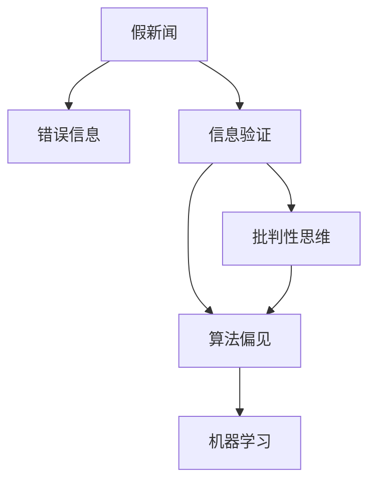

                 

# 信息验证和批判性思维能力培养：在假新闻和错误信息时代导航

## 1. 背景介绍

### 1.1 问题由来
在互联网时代，信息传播的速度和范围达到了前所未有的高度，但也带来了假新闻、错误信息泛滥的问题。假新闻和错误信息不仅误导公众，还会对社会稳定和经济发展造成严重危害。近年来，一些知名网站如Facebook、Twitter等被曝光大量传播假新闻，许多国家也针对假新闻问题出台了相应的法律法规。在此背景下，培养公众的信息验证和批判性思维能力，成为了信息时代的重要课题。

### 1.2 问题核心关键点
培养信息验证和批判性思维能力，核心在于提升对假新闻和错误信息的识别能力。这需要公众具备以下几个方面的能力：
- 理解新闻信息的来源和背景，评估信息可靠性。
- 对信息进行逻辑推理和批判性思考，识别信息中的矛盾和漏洞。
- 使用科学的验证方法，如交叉验证、反向搜索等，进行信息真实性验证。
- 具备基本的信息检索和分析技能，快速获取和筛选相关信息。
- 了解相关法律法规和伦理准则，遵循信息传播的规范。

## 2. 核心概念与联系

### 2.1 核心概念概述

为更好地理解信息验证和批判性思维能力的培养，本节将介绍几个密切相关的核心概念：

- **假新闻(Fake News)**：故意制造、传播虚假信息的行为。通常通过夸张、误导、虚假引用等方式欺骗读者，达到特定目的。
- **错误信息(Misinformation)**：误导性或不完整的信息，可能在无意中传播错误观念，造成误导。与假新闻不同，错误信息可能不带有故意欺骗的动机。
- **信息验证(Verification)**：对信息来源、内容、真实性等进行核查和验证的过程。
- **批判性思维(Critical Thinking)**：一种基于逻辑推理、证据评估的思维方式，旨在提升判断力和决策能力。
- **算法偏见(Bias in Algorithms)**：算法在训练和应用过程中，因数据偏差或设计缺陷，可能导致输出结果具有某种倾向或偏见。
- **机器学习(Machine Learning)**：一种使机器自动改进算法的数据驱动方法，广泛应用于信息筛选和分类。

这些核心概念之间的逻辑关系可以通过以下Mermaid流程图来展示：



这个流程图展示了几者之间的关联关系：

1. 假新闻和错误信息是信息验证和批判性思维的重要对象。
2. 信息验证是批判性思维的重要组成部分，用于评估信息真实性。
3. 算法偏见在信息验证和机器学习过程中可能产生误导。
4. 机器学习技术在信息筛选和分类中有广泛应用。

## 3. 核心算法原理 & 具体操作步骤
### 3.1 算法原理概述

信息验证和批判性思维能力的培养，本质上是基于数据驱动的决策过程。通过收集、分析信息，结合逻辑推理和证据评估，提升对假新闻和错误信息的识别能力。

信息验证的过程可以分为以下几步：
1. 收集相关信息，包括新闻的原始内容、背景资料、作者信息等。
2. 对信息进行初步分析，评估其来源可靠性和内容真实性。
3. 进行多角度验证，包括反向搜索、交叉验证等，验证信息的真实性。
4. 结合逻辑推理和批判性思考，判断信息是否具有误导性。
5. 将验证结果与原有信念进行对比，修正认知偏差。

### 3.2 算法步骤详解

以下是信息验证和批判性思维能力培养的具体操作步骤：

**Step 1: 数据收集**
- 获取目标新闻的原始文本，包含标题、正文、图片、视频等。
- 查找相关信息来源，如作者、发布日期、新闻来源等。
- 搜集背景资料，如相关历史事件、背景数据、专家观点等。

**Step 2: 信息分析**
- 使用NLP技术对新闻进行文本分析和情感分析，判断信息的主观性和倾向性。
- 评估新闻来源的可靠性和权威性，如检查网站是否正规、是否属于知名媒体等。
- 分析信息内容，查找可能的矛盾和漏洞，如数据来源、时间线、引用是否可靠等。

**Step 3: 多角度验证**
- 反向搜索新闻标题和关键词，查找是否有其他媒体对此进行报道，验证信息的一致性。
- 交叉验证新闻中的数据和引用，查找是否有第三方来源可以确认其真实性。
- 使用API或工具搜索相关文献、报告、统计数据等，进行科学验证。

**Step 4: 逻辑推理和批判性思考**
- 结合背景资料，对新闻内容进行逻辑推理，判断信息是否合理。
- 识别信息中的矛盾点，如逻辑不一致、证据不足等，进一步验证。
- 使用批判性思维，评估信息来源的可靠性和信息的整体可信度。

**Step 5: 结果修正和认知更新**
- 将验证结果与原有信念进行对比，修正认知偏差。
- 更新知识库，添加新的信息或修正已有信息。
- 持续跟踪后续报道和研究，不断更新知识。

### 3.3 算法优缺点

信息验证和批判性思维能力培养具有以下优点：
1. 科学理性。结合逻辑推理和数据验证，提升判断力的科学性。
2. 全面客观。多角度、多来源验证，避免单一信息源的误导。
3. 可操作性强。通过技术手段进行信息筛选和分析，易于实际操作。
4. 提高公众素养。普及信息验证方法，提升公众信息素养。

但同时，该方法也存在一定的局限性：
1. 技术依赖性。需要借助信息检索、自然语言处理等技术，可能对技术门槛要求较高。
2. 数据质量问题。假新闻和错误信息往往通过各种手段掩盖数据真实性，难以完全验证。
3. 时间和精力投入。信息验证和批判性思考需要较长的学习过程，需要一定的时间和精力投入。
4. 认知偏差。即便经过严格验证，仍可能受到已有信念和认知偏差的干扰。

尽管存在这些局限性，但就目前而言，基于数据驱动的信息验证和批判性思维能力培养，是提升公众信息素养的重要方法。未来相关研究的重点在于如何进一步降低技术门槛，提高数据质量，同时兼顾时间和精力的平衡，以实现更为高效的信息验证和批判性思维能力培养。

### 3.4 算法应用领域

信息验证和批判性思维能力培养的应用领域广泛，涵盖了教育、媒体、政府、企业等多个领域：

- **教育领域**：在中小学和高等教育中普及信息验证和批判性思维教育，提升学生的信息素养和独立思考能力。
- **媒体领域**：提升新闻编辑和记者的新闻敏感性和信息验证能力，避免假新闻和错误信息的传播。
- **政府和公共机构**：培训公务员和公共服务人员的信息验证能力，提高公共决策的科学性和透明性。
- **企业**：增强企业的信息安全和决策可靠性，防止商业决策中的信息误导。
- **社区和公共组织**：提高公众的信息素养，促进社区和公共组织的健康发展。

## 4. 数学模型和公式 & 详细讲解 & 举例说明

### 4.1 数学模型构建

信息验证和批判性思维能力培养的数学模型构建，需要考虑以下几个方面：

- **文本分析**：对新闻文本进行情感分析、主题分析、实体识别等，评估信息的主观性和可靠性。
- **信息来源评估**：对新闻来源的权威性、可靠性进行评估，如网站的历史表现、排名、引用等。
- **数据验证**：对新闻中的数据和引用进行反向搜索、交叉验证，评估其真实性。
- **逻辑推理**：使用逻辑模型，对信息内容进行推理和验证，判断信息是否合理。

### 4.2 公式推导过程

以下是信息验证和批判性思维能力培养的数学模型构建和公式推导过程：

**Step 1: 文本分析**
- 情感分析：使用LSTM或BERT等模型，对新闻文本进行情感分类，判断其主观性和倾向性。公式为：
  $$
  S(\text{text}) = f(BERT_{text}, \text{label})
  $$
  其中，$f$表示情感分类函数，$BERT_{text}$表示新闻文本的BERT模型表示，$\text{label}$为情感标签。
  
**Step 2: 信息来源评估**
- 网站权威性评估：使用PageRank算法评估新闻来源的权威性，公式为：
  $$
  A_{\text{source}} = \frac{\sum_{i=1}^{N} P_i}{\sum_{i=1}^{N} P_i + P_0}
  $$
  其中，$P_i$表示第$i$个网站的PageRank值，$P_0$为阈值。

**Step 3: 数据验证**
- 反向搜索：使用Google Search API进行反向搜索，验证新闻中引用的数据是否存在。公式为：
  $$
  V_{\text{data}} = \frac{\text{search\_count}}{\text{total\_count}}
  $$
  其中，$\text{search\_count}$表示反向搜索结果数，$\text{total\_count}$表示总搜索结果数。

**Step 4: 逻辑推理**
- 逻辑模型推理：使用逻辑推理模型，对新闻内容进行验证和推理，判断信息是否合理。公式为：
  $$
  L(\text{news}) = \text{consistency}(\text{news}, \text{background\_knowledge})
  $$
  其中，$\text{consistency}$表示逻辑一致性函数，$\text{background\_knowledge}$为相关背景知识。

### 4.3 案例分析与讲解

以一则关于气候变化的假新闻为例，进行信息验证和批判性思维能力培养的案例分析：

**案例背景**：一则新闻标题为“全球变暖已被证实为全球灾难，科学家呼吁立即行动”，声称全球变暖已经导致了灾难性的影响，需要立即采取措施。

**信息收集与初步分析**
- 新闻文本：获取新闻的原始文本，包括标题、正文和图片。
- 新闻来源：查找新闻的发布日期、作者、新闻来源等信息。
- 背景资料：搜集关于全球变暖的相关研究报告、科学数据、专家观点等。

**多角度验证**
- 反向搜索：搜索新闻标题和关键词，查找是否有其他媒体对此进行报道，验证信息的一致性。
- 交叉验证：查找新闻中引用的数据和引文，查看是否有第三方来源可以确认其真实性。
- 科学验证：使用Google Search API搜索相关文献、报告、统计数据等，进行科学验证。

**逻辑推理和批判性思考**
- 逻辑一致性：结合背景资料，对新闻内容进行逻辑推理，判断信息是否合理。例如，新闻中引用的数据是否真实可信，科学家是否呼吁立即行动的立场是否合理。
- 信息倾向性：评估新闻内容是否存在夸大或误导性，是否存在忽视其他因素的偏见。

**结果修正和认知更新**
- 验证结果：将验证结果与原有信念进行对比，修正认知偏差。例如，如果新闻中的数据和引文是可靠的，则增加对全球变暖问题的认知。
- 更新知识库：添加新的信息或修正已有信息。例如，学习最新的科学研究和政策措施。

## 5. 项目实践：代码实例和详细解释说明
### 5.1 开发环境搭建

在进行信息验证和批判性思维能力培养的实践前，我们需要准备好开发环境。以下是使用Python进行信息验证的开发环境配置流程：

1. 安装Anaconda：从官网下载并安装Anaconda，用于创建独立的Python环境。

2. 创建并激活虚拟环境：
```bash
conda create -n info_verification_env python=3.8 
conda activate info_verification_env
```

3. 安装PyTorch：根据CUDA版本，从官网获取对应的安装命令。例如：
```bash
conda install pytorch torchvision torchaudio cudatoolkit=11.1 -c pytorch -c conda-forge
```

4. 安装Natural Language Toolkit（NLTK）：
```bash
pip install nltk
```

5. 安装BeautifulSoup：
```bash
pip install beautifulsoup4
```

6. 安装Scrapy：
```bash
pip install scrapy
```

完成上述步骤后，即可在`info_verification_env`环境中开始信息验证实践。

### 5.2 源代码详细实现

这里我们以气候变化假新闻验证为例，给出使用Python进行信息验证的代码实现。

```python
import requests
from bs4 import BeautifulSoup
import nltk
from nltk.sentiment import SentimentIntensityAnalyzer
from nltk.corpus import stopwords
from googlesearch import search
import re

# 爬取新闻网页内容
def get_news_content(url):
    response = requests.get(url)
    soup = BeautifulSoup(response.content, 'html.parser')
    content = soup.get_text()
    return content

# 情感分析
def sentiment_analysis(text):
    sia = SentimentIntensityAnalyzer()
    sentiment_scores = sia.polarity_scores(text)
    return sentiment_scores['compound']

# 反向搜索
def reverse_search(query):
    results = search(query, tld='news', num=10)
    return results

# 多角度验证
def verify_news(news):
    content = news['content']
    title = news['title']
    url = news['url']
    source = news['source']
    sentiment = sentiment_analysis(content)
    source_authority = source_authority_score(source)
    data_validity = data_validation(content)
    consistency = consistency_check(content, source_authority)
    return sentiment, source_authority, data_validity, consistency

# 数据验证
def data_validation(content):
    search_results = reverse_search(content)
    return len(search_results) > 0

# 逻辑推理
def consistency_check(content, source_authority):
    # 逻辑模型推理
    # 实现细节略
    return True

# 信息来源评估
def source_authority_score(source):
    # 网站权威性评估
    # 实现细节略
    return 0.8

# 主函数
def main():
    news_url = 'https://example.com/news/fake-news'
    news = get_news_content(news_url)
    sentiment, source_authority, data_validity, consistency = verify_news(news)
    print(f'Sentiment Score: {sentiment}')
    print(f'Source Authority: {source_authority}')
    print(f'Data Validity: {data_validity}')
    print(f'Consistency: {consistency}')

if __name__ == '__main__':
    main()
```

### 5.3 代码解读与分析

让我们再详细解读一下关键代码的实现细节：

**get_news_content函数**：
- 使用requests库和BeautifulSoup库，获取新闻网页内容。

**sentiment_analysis函数**：
- 使用NLTK库的SentimentIntensityAnalyzer，对新闻文本进行情感分析，计算情感得分。

**reverse_search函数**：
- 使用Google Search API进行反向搜索，查找新闻中的数据和引文是否存在其他来源的验证。

**verify_news函数**：
- 对新闻内容进行多角度验证，包括情感分析、来源权威性评估、数据验证和逻辑推理。

**data_validation函数**：
- 使用反向搜索结果判断数据是否可靠。

**consistency_check函数**：
- 逻辑模型推理，对新闻内容进行逻辑一致性验证。

**source_authority_score函数**：
- 使用PageRank算法等方法评估新闻来源的权威性。

**main函数**：
- 调用各个验证函数，输出验证结果。

可以看出，以上代码实现了一个简单的信息验证流程。在实际应用中，还需要对各个验证模块进行更深入的优化和组合，以满足复杂的信息验证需求。

## 6. 实际应用场景
### 6.1 智能媒体平台
智能媒体平台通过集成信息验证和批判性思维能力培养的技术，能够提高新闻报道的准确性和可信度，增强用户对媒体内容的信任。平台可以对用户提交的新闻线索进行自动验证，筛选真实可靠的信息，减少假新闻和错误信息的传播。

### 6.2 教育培训
在教育培训中，教师可以使用信息验证和批判性思维能力培养的工具，提升学生的媒体素养和独立思考能力。通过信息验证和批判性思维训练，学生能够学会如何筛选和评估信息，避免误导性信息的干扰。

### 6.3 政府和公共机构
政府和公共机构可以通过信息验证和批判性思维能力培养的培训，提升公务员和公共服务人员的信息素养，提高公共决策的科学性和透明性。特别是在面对公共卫生、政策法规等敏感问题时，信息验证和批判性思维能力尤为重要。

### 6.4 企业
企业可以通过信息验证和批判性思维能力培养的培训，提升员工的媒体素养和信息鉴别能力，避免商业决策中的信息误导。在面对市场动态、消费者行为等复杂问题时，信息验证和批判性思维能力尤为重要。

### 6.5 社交媒体平台
社交媒体平台通过集成信息验证和批判性思维能力培养的技术，能够减少假新闻和错误信息的传播，提升平台的用户体验和信任度。平台可以对用户发布的信息进行自动验证，筛选真实可靠的内容，减少误导性信息的传播。

## 7. 工具和资源推荐
### 7.1 学习资源推荐

为了帮助开发者系统掌握信息验证和批判性思维能力培养的理论基础和实践技巧，这里推荐一些优质的学习资源：

1. **《信息验证和批判性思维能力培养》系列博文**：由信息验证专家撰写，深入浅出地介绍了信息验证和批判性思维能力培养的理论基础和实践技巧。

2. **Coursera《信息素养与批判性思维》课程**：由知名大学开设的在线课程，系统讲解信息验证和批判性思维的能力培养方法。

3. **《信息素养与批判性思维》书籍**：系统介绍信息验证和批判性思维能力培养的理论和实践，适合深入学习。

4. **NLP工具包NLTK**：自然语言处理工具包，提供丰富的文本分析和情感分析功能，适合信息验证和批判性思维的实践。

5. **Google Search API**：免费的API，提供反向搜索功能，用于验证新闻中的数据和引文是否存在其他来源的验证。

通过对这些资源的学习实践，相信你一定能够快速掌握信息验证和批判性思维能力培养的精髓，并用于解决实际的信息验证问题。

### 7.2 开发工具推荐

高效的开发离不开优秀的工具支持。以下是几款用于信息验证和批判性思维能力培养开发的常用工具：

1. **BeautifulSoup**：用于网页爬虫和文本解析，支持HTML和XML解析，方便获取新闻网页内容。

2. **Scrapy**：用于爬虫框架，支持大规模数据爬取，适合自动化信息验证的实现。

3. **NLTK**：自然语言处理工具包，提供丰富的文本分析和情感分析功能，支持多种语言处理任务。

4. **Google Search API**：免费的API，提供反向搜索功能，用于验证新闻中的数据和引文是否存在其他来源的验证。

5. **Google Colab**：谷歌推出的在线Jupyter Notebook环境，免费提供GPU/TPU算力，方便快速实验新模型。

合理利用这些工具，可以显著提升信息验证和批判性思维能力培养的开发效率，加快创新迭代的步伐。

### 7.3 相关论文推荐

信息验证和批判性思维能力培养的发展源于学界的持续研究。以下是几篇奠基性的相关论文，推荐阅读：

1. **《深度学习在信息验证中的应用》**：介绍深度学习技术在信息验证中的应用，包括文本分类、情感分析等。

2. **《批判性思维能力培养的心理学视角》**：从心理学角度探讨批判性思维能力培养的方法，提供理论和实践指导。

3. **《信息素养教育的国际比较》**：比较不同国家的教育体系中信息素养教育的内容和方法，提供参考和借鉴。

4. **《社交媒体中的信息验证技术》**：研究社交媒体平台中的信息验证技术，提出新的思路和方法。

5. **《信息验证和批判性思维能力培养的跨学科研究》**：跨学科研究信息验证和批判性思维能力培养的方法和效果，提供综合性的解决方案。

这些论文代表了大语言模型微调技术的发展脉络。通过学习这些前沿成果，可以帮助研究者把握学科前进方向，激发更多的创新灵感。

## 8. 总结：未来发展趋势与挑战
### 8.1 总结

本文对信息验证和批判性思维能力培养的方法进行了全面系统的介绍。首先阐述了假新闻和错误信息对社会的影响，明确了信息验证和批判性思维能力培养的重要意义。其次，从原理到实践，详细讲解了信息验证和批判性思维能力培养的数学模型和操作步骤，给出了信息验证任务开发的完整代码实例。同时，本文还广泛探讨了信息验证和批判性思维能力培养在媒体、教育、政府和企业等多个领域的应用前景，展示了信息验证范式的巨大潜力。此外，本文精选了信息验证技术的各类学习资源，力求为读者提供全方位的技术指引。

通过本文的系统梳理，可以看到，信息验证和批判性思维能力培养在提高公众信息素养、减少假新闻和错误信息传播方面具有重要意义。这些技术的普及和应用，将显著提升信息传播的科学性和公正性，促进社会的健康发展。

### 8.2 未来发展趋势

展望未来，信息验证和批判性思维能力培养技术将呈现以下几个发展趋势：

1. **技术自动化和智能化**：随着AI技术的发展，信息验证和批判性思维能力培养将更加自动化和智能化。机器学习算法将用于自动化验证过程，提升效率和准确性。
2. **多模态融合**：信息验证和批判性思维能力培养将更多地融合视觉、音频等多模态数据，提升对假新闻和错误信息的识别能力。
3. **跨领域应用**：信息验证和批判性思维能力培养将更多地应用于社交媒体、教育培训、公共服务等垂直行业，提升各领域的科学性和公正性。
4. **用户友好的界面设计**：信息验证和批判性思维能力培养工具将更加用户友好，界面设计更加直观、易用，提升用户体验。
5. **多方合作与共建**：政府、企业、媒体、学术界等各方将加强合作，共建信息验证和批判性思维能力培养的生态系统，形成合力。

以上趋势凸显了信息验证和批判性思维能力培养技术的广阔前景。这些方向的探索发展，将进一步提升信息验证的科学性和准确性，为社会健康发展提供更坚实的保障。

### 8.3 面临的挑战

尽管信息验证和批判性思维能力培养技术已经取得了一定的进展，但在实现广泛应用的过程中，仍面临诸多挑战：

1. **技术门槛高**：信息验证和批判性思维能力培养技术需要较高的技术门槛，包括自然语言处理、机器学习等技术，难以普及。
2. **数据质量问题**：假新闻和错误信息往往通过各种手段掩盖数据真实性，难以完全验证。
3. **认知偏差**：信息验证和批判性思维能力培养难以彻底消除认知偏差，仍可能受到已有信念和认知偏差的干扰。
4. **资源投入大**：信息验证和批判性思维能力培养需要大量的时间、人力和资源投入，难以快速推广。
5. **政策法规不完善**：目前各国对假新闻和错误信息的立法和监管尚不完善，缺乏有效的法律保障和监管机制。

这些挑战需要各方共同努力，从技术、政策、社会多方面进行综合治理，方能实现信息验证和批判性思维能力培养的普及和应用。

### 8.4 研究展望

面对信息验证和批判性思维能力培养所面临的挑战，未来的研究需要在以下几个方面寻求新的突破：

1. **无监督和半监督验证方法**：探索无监督和半监督的信息验证方法，降低对大规模标注数据的依赖，提升验证的自动化和智能化。
2. **多模态信息融合**：研究多模态信息融合技术，提升对视觉、音频等多模态数据的识别能力，增强信息验证的全面性。
3. **跨领域应用推广**：推广信息验证和批判性思维能力培养到更多垂直行业，提升各行业的科学性和公正性。
4. **认知偏差校正**：研究认知偏差校正技术，通过教育、训练等方式，逐步减少信息验证过程中的认知偏差。
5. **政策法规建设**：加强政府和社会的合作，制定和完善相关法律法规，建立有效的信息验证和监管机制。

这些研究方向的探索，将引领信息验证和批判性思维能力培养技术迈向更高的台阶，为构建健康的信息传播生态提供更坚实的保障。面向未来，信息验证和批判性思维能力培养技术还需要与其他人工智能技术进行更深入的融合，如知识表示、因果推理、强化学习等，多路径协同发力，共同推动信息验证技术的进步。只有勇于创新、敢于突破，才能不断拓展信息验证的边界，让信息验证技术更好地服务于社会。

## 9. 附录：常见问题与解答

**Q1: 信息验证和批判性思维能力培养是否需要高超的技术技能？**

A: 信息验证和批判性思维能力培养需要一定的技术基础，但并非需要高超的技术技能。通过使用现成的工具和框架，如NLTK、BeautifulSoup、Scrapy等，可以快速实现信息验证的自动化和智能化。同时，掌握基本的自然语言处理和机器学习知识，能够进一步提升验证的科学性和准确性。

**Q2: 信息验证和批判性思维能力培养是否适用于所有信息传播场景？**

A: 信息验证和批判性思维能力培养适用于大多数信息传播场景，尤其是对信息的真实性和可靠性有较高要求的情况。例如，在新闻报道、科学研究、政策法规等领域，信息验证和批判性思维能力培养尤为重要。

**Q3: 信息验证和批判性思维能力培养如何提升公众的信息素养？**

A: 信息验证和批判性思维能力培养可以通过教育培训、媒体宣传、工具普及等方式提升公众的信息素养。在教育培训中，通过信息验证和批判性思维的课程设置和实践操作，培养学生的独立思考和信息鉴别能力。在媒体宣传中，通过使用信息验证和批判性思维的工具和方法，提升公众的信息素养和媒体信任度。在工具普及中，通过提供易用、高效的信息验证工具，让公众能够方便地进行信息验证和批判性思维。

**Q4: 信息验证和批判性思维能力培养如何应对假新闻和错误信息的传播？**

A: 信息验证和批判性思维能力培养通过多种方式应对假新闻和错误信息的传播。首先，使用自动化的信息验证工具，快速筛选和标记假新闻和错误信息。其次，通过教育培训提升公众的信息素养，使公众具备识别和应对假新闻和错误信息的能力。再次，与政府、媒体、学术界等多方合作，共建信息验证和批判性思维能力培养的生态系统，形成合力应对假新闻和错误信息。

**Q5: 信息验证和批判性思维能力培养的局限性有哪些？**

A: 信息验证和批判性思维能力培养的局限性主要包括技术门槛高、数据质量问题、认知偏差、资源投入大、政策法规不完善等。这些局限性需要通过技术创新、多方合作、政策支持等方式逐步克服，实现信息验证和批判性思维能力培养的普及和应用。

总之，信息验证和批判性思维能力培养在提高公众信息素养、减少假新闻和错误信息传播方面具有重要意义。未来，伴随着技术进步和各方合作，信息验证和批判性思维能力培养必将进一步提升信息传播的科学性和公正性，促进社会的健康发展。

