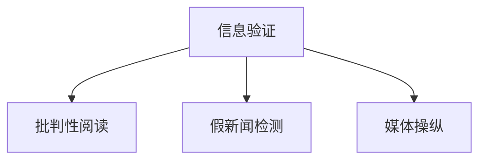

                 

# 信息验证和批判性阅读指南：在假新闻和媒体操纵时代导航

## 1. 背景介绍

在信息爆炸和社交媒体时代，假新闻和媒体操纵的问题日益严重，对公众信任和民主制度构成了巨大挑战。面对信息泛滥和信息筛选的难题，如何提升个人和机构的信息验证能力和批判性阅读能力，显得尤为重要。本篇文章旨在通过技术手段，结合批判性思维，为读者提供一套全面的信息验证和批判性阅读指南。

## 2. 核心概念与联系

### 2.1 核心概念概述

本节将介绍几个关键概念，包括信息验证、批判性阅读、假新闻检测、媒体操纵等，并揭示它们之间的联系。

- **信息验证**：指通过技术手段和逻辑推理，确认信息的真实性和准确性。
- **批判性阅读**：指对信息来源、内容、上下文等进行全面分析和独立判断，以避免被误导或欺骗。
- **假新闻检测**：使用机器学习和自然语言处理技术，识别和筛选假新闻。
- **媒体操纵**：指利用各种手段，制造、传播虚假信息，误导公众或达成特定目的。

这些概念通过以下Mermaid流程图联系起来：



## 3. 核心算法原理 & 具体操作步骤
### 3.1 算法原理概述

信息验证和批判性阅读的核心算法原理，在于综合应用自然语言处理(NLP)、机器学习(ML)、计算机视觉(CV)等技术手段，对信息的来源、内容、上下文等进行深入分析和独立判断。以下是一些关键的技术手段：

1. **自然语言处理(NLP)**：利用语言模型、情感分析、命名实体识别等技术，解析和理解文本内容。
2. **机器学习(ML)**：通过分类、聚类、回归等算法，构建信息验证模型。
3. **计算机视觉(CV)**：处理图像、视频等多媒体数据，提取关键信息。
4. **数据挖掘**：从大量数据中发现关联和模式，进行信息交叉验证。
5. **专家系统**：结合专家知识和规则，提升信息验证的准确性和权威性。

### 3.2 算法步骤详解

信息验证和批判性阅读的具体操作步骤如下：

1. **收集信息源**：收集可能的信息源，包括新闻网站、社交媒体、博客、论坛等。
2. **预处理数据**：对收集到的数据进行去重、清洗、分词、分句等预处理。
3. **特征提取**：提取关键特征，如文本长度、情感倾向、关键词等。
4. **模型训练**：构建并训练信息验证模型，如分类器、聚类器等。
5. **验证与筛选**：将模型应用于信息源，进行验证和筛选。
6. **批判性阅读**：对筛选出的信息进行独立判断，结合背景知识进行深度分析。
7. **结果反馈**：根据反馈结果不断优化模型和验证流程。

### 3.3 算法优缺点

信息验证和批判性阅读的算法具有以下优点：

- 自动化程度高，提升验证效率。
- 数据分析全面，提升验证准确性。
- 可扩展性强，适用于多种信息类型。

同时，该算法也存在一些缺点：

- 数据偏差可能导致模型偏误。
- 深度学习模型可能过度拟合特定数据。
- 对背景知识的依赖较大，需要人工干预。

### 3.4 算法应用领域

信息验证和批判性阅读的算法已经在多个领域得到了广泛应用，例如：

- 新闻业：提高新闻真实性验证能力，防范假新闻传播。
- 广告业：检测广告内容的真实性，提升广告投放效果。
- 政治领域：识别虚假信息，保护民主进程。
- 法律领域：验证法律文书的真实性，保障司法公正。
- 医学领域：验证医学信息的准确性，提升医疗质量。
- 教育领域：提高信息筛选能力，培养批判性思维。

## 4. 数学模型和公式 & 详细讲解 & 举例说明
### 4.1 数学模型构建

信息验证的数学模型通常基于分类和聚类算法。以下以分类模型为例，介绍其构建过程。

假设信息验证问题可以表示为分类问题，即判断信息是否为真。设信息集合为 $X$，标签集合为 $\{0,1\}$，其中 $0$ 表示假新闻，$1$ 表示真新闻。则分类模型的目标是最小化以下损失函数：

$$
L(\theta) = \frac{1}{N}\sum_{i=1}^N L(x_i, \hat{y}_i)
$$

其中 $\theta$ 为模型参数，$L$ 为损失函数，$x_i$ 为输入样本，$\hat{y}_i$ 为模型预测的标签。

### 4.2 公式推导过程

以逻辑回归模型为例，其目标是最小化交叉熵损失函数：

$$
L(\theta) = -\frac{1}{N}\sum_{i=1}^N \bigg[ y_i \log \hat{y}_i + (1-y_i) \log (1-\hat{y}_i) \bigg]
$$

其中 $\hat{y}_i = \sigma(z_i)$，$\sigma(z)$ 为sigmoid函数，$z_i = \sum_{j=1}^n w_j x_{ij} + b$，$x_{ij}$ 为样本 $x_i$ 的第 $j$ 个特征，$w_j$ 和 $b$ 为模型参数。

### 4.3 案例分析与讲解

以下通过一个简单的例子，展示信息验证模型的训练和应用过程。

假设有一个文本分类任务，包含两个类别：正面评价和负面评价。给定训练集 $D = \{(x_1, y_1), (x_2, y_2), ..., (x_n, y_n)\}$，其中 $x_i$ 为样本，$y_i$ 为标签。我们的目标是最小化交叉熵损失函数，训练一个分类模型。

首先，对文本进行预处理，包括分词、去停用词、构建词向量等。然后，使用随机梯度下降等优化算法，最小化损失函数：

$$
\theta \leftarrow \theta - \eta \nabla_{\theta}L(\theta)
$$

其中 $\eta$ 为学习率。在训练完成后，使用模型对新样本 $x'$ 进行预测，得到 $\hat{y}'$，从而验证信息是否为真。

## 5. 项目实践：代码实例和详细解释说明
### 5.1 开发环境搭建

开发环境搭建主要包括以下步骤：

1. **安装Python**：下载并安装最新版本的Python，确保支持必要的库版本。
2. **安装依赖库**：使用pip安装必要的依赖库，如numpy、pandas、scikit-learn、nltk等。
3. **搭建服务器**：使用Docker或Kubernetes搭建服务器环境，确保稳定性。

### 5.2 源代码详细实现

以下是一个简单的信息验证模型的Python代码实现，包括文本预处理、模型训练和验证：

```python
import numpy as np
from sklearn.feature_extraction.text import CountVectorizer
from sklearn.linear_model import LogisticRegression
from sklearn.metrics import accuracy_score

# 文本预处理
def preprocess_text(text):
    # 分词
    tokens = nltk.word_tokenize(text)
    # 去停用词
    stopwords = set(nltk.corpus.stopwords.words('english'))
    tokens = [token for token in tokens if token.lower() not in stopwords]
    # 构建词向量
    vectorizer = CountVectorizer()
    features = vectorizer.fit_transform(tokens)
    # 归一化
    features = np.array(features.todense()) / np.linalg.norm(features, axis=1, keepdims=True)
    return features

# 训练模型
def train_model(X, y):
    vectorizer = CountVectorizer()
    X = vectorizer.fit_transform(X)
    features = np.array(X.todense()) / np.linalg.norm(X, axis=1, keepdims=True)
    model = LogisticRegression(solver='liblinear', C=1.0)
    model.fit(features, y)
    return vectorizer, model

# 验证模型
def validate_model(vectorizer, model, X_test, y_test):
    X_test = vectorizer.transform(X_test)
    features_test = np.array(X_test.todense()) / np.linalg.norm(X_test, axis=1, keepdims=True)
    y_pred = model.predict(features_test)
    accuracy = accuracy_score(y_test, y_pred)
    return accuracy
```

### 5.3 代码解读与分析

该代码实现了文本预处理、模型训练和验证的基本流程。关键点如下：

1. **文本预处理**：使用nltk库进行分词和去停用词操作，并构建词向量。
2. **模型训练**：使用逻辑回归模型进行训练，最小化交叉熵损失函数。
3. **模型验证**：对测试集进行预测，并计算模型的准确度。

## 6. 实际应用场景
### 6.1 新闻业

新闻业是信息验证和批判性阅读的重要应用场景。假新闻检测系统可以通过自动化手段，实时监测和筛选假新闻，提升新闻的真实性和可信度。例如，使用BERT等大模型进行新闻事实检测，可以有效识别和过滤虚假报道。

### 6.2 广告业

广告业也面临着信息验证的挑战。广告投放前，需要进行广告内容的真实性检测，防止误导性信息的传播。例如，使用深度学习模型对广告文本和图像进行分类，判断广告内容是否真实可信。

### 6.3 政治领域

政治领域的信息验证和批判性阅读尤为重要。假新闻和误导性信息的传播可能影响选举结果和社会稳定。通过自动化系统，可以有效监测和防范虚假信息的传播。

### 6.4 未来应用展望

未来的信息验证和批判性阅读技术将进一步提升自动化和智能化水平，实现对多模态数据的综合分析。例如，结合计算机视觉和自然语言处理技术，构建多模态信息验证系统，提升对视频、音频等多媒体数据的处理能力。

## 7. 工具和资源推荐
### 7.1 学习资源推荐

1. **Python自然语言处理入门**：《Python自然语言处理》（Natural Language Processing with Python）一书，是NLP入门的经典教材，介绍了Python在NLP中的应用。
2. **深度学习基础**：《深度学习》（Deep Learning）一书，由深度学习领域的权威教材，涵盖了深度学习的理论基础和实践技巧。
3. **信息验证技术**：《信息验证技术综述》（Survey on Information Verification Techniques）一文，综述了信息验证的主要技术和方法，提供了全面的技术指南。
4. **批判性思维训练**：《批判性思维》（Critical Thinking）一书，介绍了批判性思维的基本方法和技巧，提升批判性阅读能力。

### 7.2 开发工具推荐

1. **Python**：Python是NLP和机器学习领域的主流语言，使用方便，库丰富。
2. **TensorFlow**：由Google开发的深度学习框架，支持分布式计算，适用于大规模模型的训练和推理。
3. **PyTorch**：Facebook开发的深度学习框架，易用性强，支持动态图机制。
4. **Scikit-learn**：Python的机器学习库，提供了丰富的模型和算法。
5. **NLTK**：Python的自然语言处理库，提供了文本预处理和语料库支持。

### 7.3 相关论文推荐

1. **假新闻检测**：《假新闻检测综述》（A Survey on Fake News Detection）一文，综述了假新闻检测的主要技术和方法。
2. **信息验证**：《信息验证技术综述》（Survey on Information Verification Techniques）一文，综述了信息验证的主要技术和方法。
3. **多模态信息验证**：《多模态信息验证综述》（A Survey on Multi-modal Information Verification）一文，综述了多模态信息验证的主要技术和方法。

## 8. 总结：未来发展趋势与挑战
### 8.1 总结

信息验证和批判性阅读技术在大数据和社交媒体时代显得尤为重要。通过综合应用自然语言处理、机器学习等技术手段，可以有效提升信息验证的准确性和自动化水平，帮助人们更好地辨别信息的真实性和可靠性。

### 8.2 未来发展趋势

未来的信息验证和批判性阅读技术将呈现以下几个发展趋势：

1. **多模态融合**：结合计算机视觉、语音识别等技术，提升对多模态数据的处理能力。
2. **自动化程度提高**：通过深度学习等技术，提升信息验证的自动化水平，减少人工干预。
3. **模型融合与集成**：结合多种模型和算法，提升信息验证的准确性和鲁棒性。
4. **实时化与智能化**：实现对实时数据的实时分析和智能决策，提升信息验证的时效性。
5. **可解释性增强**：增强模型的可解释性，提升用户信任度。

### 8.3 面临的挑战

信息验证和批判性阅读技术在发展过程中仍面临一些挑战：

1. **数据获取与处理**：获取高质量的数据和进行有效的数据预处理，是信息验证的关键。
2. **模型泛化能力**：提升模型在不同场景和领域中的泛化能力，是信息验证的难点。
3. **模型复杂度**：避免模型过于复杂，降低计算和存储成本，是信息验证的重要挑战。
4. **模型可解释性**：增强模型的可解释性，提升用户对模型的信任度，是信息验证的重要课题。

### 8.4 研究展望

未来，信息验证和批判性阅读技术需要进一步解决数据获取与处理、模型泛化能力、模型复杂度和模型可解释性等问题，才能实现更广泛的应用和更高的可靠性。通过多学科交叉和多方协同，相信信息验证和批判性阅读技术将进一步发展，为社会带来更可靠的信息环境。

## 9. 附录：常见问题与解答

**Q1：信息验证和批判性阅读技术是否适用于所有信息类型？**

A: 信息验证和批判性阅读技术可以应用于多种信息类型，包括文本、图像、音频、视频等。不同类型的信息需要采用不同的技术和工具进行处理。

**Q2：如何提高信息验证模型的泛化能力？**

A: 提高模型泛化能力的关键在于获取更多的训练数据和进行有效的数据增强。同时，采用不同的模型结构和正则化技术，如Dropout、L2正则等，也可以提升模型的泛化能力。

**Q3：如何增强信息验证模型的可解释性？**

A: 增强模型可解释性的方法包括可视化技术，如特征可视化、梯度热图等，以及模型蒸馏技术，如知识蒸馏、模型压缩等。同时，结合领域专家的知识，对模型进行解释和调试，也是提高可解释性的重要方法。

**Q4：信息验证和批判性阅读技术在实际应用中面临哪些挑战？**

A: 实际应用中，信息验证和批判性阅读技术面临的主要挑战包括：数据获取与处理、模型泛化能力、模型复杂度和模型可解释性等。需要综合考虑技术、经济、社会等多方面因素，进行全面优化。

---

作者：禅与计算机程序设计艺术 / Zen and the Art of Computer Programming

