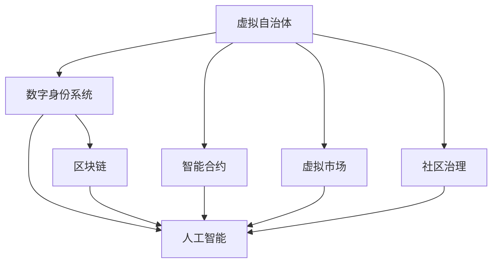

                 

# 元宇宙中的虚拟政府：全球治理的新模式

## 1. 背景介绍

随着人工智能、虚拟现实、物联网等技术的迅猛发展，元宇宙（Metaverse）概念正在迅速崛起，成为新一代的互联网生态。作为虚拟数字世界的真实投影，元宇宙在深度融合数字经济与现实经济的同时，也引发了全球治理模式的革新。虚拟政府作为一种新的治理模式，通过利用人工智能、区块链等技术，突破了传统物理世界的限制，实现了高度自治和全球协同的治理目标。本文将深入探讨虚拟政府的构建原理、核心技术，以及其在元宇宙下的应用前景。

## 2. 核心概念与联系

### 2.1 核心概念概述

元宇宙中的虚拟政府指的是，基于元宇宙虚拟空间，通过人工智能、区块链、云计算等技术手段，构建的自治、透明、高效、安全的全球治理系统。其核心目标是通过模拟现实世界的政府职能，实现虚拟世界中的公共秩序、社会管理、经济运行等功能。

虚拟政府的核心组件包括：

- **虚拟自治体**：即虚拟政府的基本治理单元，如虚拟城市、虚拟国家等，具备一定的自治权和行政职能。
- **数字身份系统**：提供在虚拟世界中的身份认证和电子政务服务。
- **智能合约**：自动化执行政府决策和公共服务，如纳税、福利发放等。
- **虚拟市场**：提供虚拟资产交易、公共资源分配等功能。
- **社区治理**：支持虚拟社区的自我管理、服务反馈等。

### 2.2 核心概念联系

虚拟政府的构建涉及多个领域的前沿技术，各技术之间相互协作，形成了一个复杂的系统结构。具体如下：

- **人工智能**：通过自然语言处理、计算机视觉、机器学习等技术，实现对虚拟世界的智能感知和高效治理。
- **区块链**：保障虚拟政府中的数据安全和透明性，通过分布式账本记录政府决策和公共事务。
- **云计算**：提供元宇宙的计算资源，支持大规模、高并发的政务服务。
- **虚拟现实**：构建沉浸式的虚拟政府管理界面，提供用户友好的政务服务体验。

这些技术通过不同的层次和方式，支撑起虚拟政府的运行框架。下面，我们通过一个Mermaid流程图展示虚拟政府的核心组件和技术联系：



这个图表清晰地展示了各个组件和技术之间的联系。接下来，我们将深入探讨虚拟政府的构建原理和具体操作步骤。

## 3. 核心算法原理 & 具体操作步骤

### 3.1 算法原理概述

虚拟政府的构建涉及算法原理和具体操作步骤两个方面，其中算法原理主要涉及到虚拟自治体的治理逻辑、智能合约的执行机制、数字身份系统的认证方法等。具体操作步骤则涵盖了从数据采集、模型训练到智能合约部署的整个流程。

### 3.2 算法步骤详解

#### 3.2.1 虚拟自治体治理

虚拟自治体的治理算法主要包括以下几个步骤：

1. **虚拟自治体建立**：通过虚拟现实技术，构建虚拟城市、国家等自治体。
2. **自治体治理模型设计**：设计虚拟自治体的治理模型，包括法律法规、经济政策、社区规则等。
3. **自治体决策与执行**：通过智能合约实现自治体的决策和执行，如税收征收、公共资源分配等。

#### 3.2.2 智能合约执行

智能合约是虚拟政府的核心组成部分，其执行流程如下：

1. **合约编写与验证**：用户编写智能合约代码，并提交给区块链网络进行验证。
2. **合约部署与执行**：通过区块链网络将合约部署到虚拟自治体中，智能合约在满足触发条件时自动执行。
3. **合约监控与维护**：通过智能合约监控系统，实时监控合约执行状态，确保其正确性和安全性。

#### 3.2.3 数字身份系统认证

数字身份系统通过人工智能和区块链技术，实现虚拟世界中的身份认证和管理。其认证流程如下：

1. **身份注册**：用户通过AI算法进行身份信息验证，生成数字身份信息。
2. **身份认证**：在虚拟自治体中，通过区块链记录身份信息，确保其唯一性和不可篡改性。
3. **身份验证**：用户通过身份验证后，可享受虚拟政府提供的公共服务，如教育、医疗、社会保障等。

### 3.3 算法优缺点

虚拟政府的构建技术涉及多个领域的前沿技术，其算法优势和劣势如下：

#### 3.3.1 优势

1. **自治性强**：通过智能合约和区块链技术，虚拟自治体的决策和执行具有高度自治性。
2. **透明度高**：所有政府决策和公共事务都记录在区块链上，具有高度透明性。
3. **效率高**：通过AI和大数据技术，提高治理效率，实现实时响应。

#### 3.3.2 劣势

1. **技术复杂度高**：构建虚拟政府需要融合多种前沿技术，技术实现复杂度较高。
2. **数据安全风险高**：虚拟世界的安全问题仍未完全解决，数据泄露和网络攻击风险依然存在。
3. **治理成本高**：初期建设和运营成本较高，对技术资源和资金要求较高。

### 3.4 算法应用领域

虚拟政府的应用领域广泛，包括但不限于以下几个方面：

- **虚拟城市管理**：构建虚拟城市，提供城市规划、交通管理、公共服务等。
- **虚拟国家治理**：构建虚拟国家，进行外交事务、国防安全等管理。
- **虚拟金融市场**：提供虚拟资产交易、市场监管等功能。
- **虚拟社区自治**：支持虚拟社区的自我管理和公共事务处理。
- **虚拟教育医疗**：提供远程教育和医疗服务，改善全球教育医疗资源分布不均的问题。

## 4. 数学模型和公式 & 详细讲解 & 举例说明

### 4.1 数学模型构建

虚拟政府的构建涉及多个数学模型，如虚拟自治体的治理模型、智能合约的执行模型、数字身份系统的认证模型等。下面，我们以智能合约的执行模型为例，说明其数学模型构建过程。

#### 4.1.1 智能合约模型构建

智能合约的执行模型主要由输入数据、模型参数、输出结果组成，其数学模型为：

$$
f(x, \theta) = y
$$

其中 $x$ 为输入数据，$y$ 为输出结果，$\theta$ 为模型参数。智能合约模型的构建流程如下：

1. **输入数据采集**：采集政府决策和公共事务的相关数据。
2. **模型训练**：通过AI算法训练智能合约模型，得到参数 $\theta$。
3. **模型验证与优化**：对训练好的模型进行验证，优化参数 $\theta$，确保其准确性和稳定性。

#### 4.1.2 案例分析与讲解

我们以一个虚拟城市的税收征收为例，说明智能合约的执行过程。

1. **数据采集**：采集城市内所有纳税人的收入、消费、资产等数据。
2. **模型训练**：通过AI算法训练税收征收模型，得到参数 $\theta$。
3. **智能合约编写**：编写智能合约代码，规定纳税人和税收征收的规则。
4. **智能合约部署**：将智能合约部署到区块链网络中，实现自动执行。
5. **智能合约监控**：实时监控智能合约执行状态，确保其正确性和安全性。

### 4.2 公式推导过程

智能合约的执行模型中，输出结果 $y$ 可由下式计算得到：

$$
y = f(x, \theta) = \sum_{i=1}^n w_i \cdot f_i(x)
$$

其中 $f_i(x)$ 为第 $i$ 个特征的函数，$w_i$ 为特征权重。智能合约模型的训练过程如下：

1. **数据预处理**：对采集到的数据进行预处理，如归一化、去噪等。
2. **模型训练**：使用AI算法训练模型，优化参数 $\theta$，使其最小化损失函数。
3. **模型验证**：使用验证集对训练好的模型进行验证，调整参数 $\theta$，确保其准确性。

### 4.3 案例分析与讲解

我们以一个虚拟城市的公共资源分配为例，说明数字身份系统的认证过程。

1. **数据采集**：采集城市内所有居民的身份信息、资产、需求等数据。
2. **身份注册**：通过AI算法验证身份信息，生成数字身份信息。
3. **身份认证**：将数字身份信息记录在区块链上，确保其唯一性和不可篡改性。
4. **身份验证**：居民通过身份验证后，可享受虚拟政府提供的公共服务，如教育、医疗等。

## 5. 项目实践：代码实例和详细解释说明

### 5.1 开发环境搭建

为了实现虚拟政府的开发，我们需要搭建相应的开发环境。以下是具体的开发环境搭建流程：

1. **操作系统安装**：选择适合的操作系统，如Linux、Windows等。
2. **编程语言选择**：选择适合的编程语言，如Python、Java等。
3. **开发工具安装**：安装适合的开发工具，如IDE、版本控制系统等。
4. **云计算资源准备**：选择适合的云计算平台，如AWS、阿里云等，并准备云计算资源。
5. **AI和区块链框架安装**：安装适合的AI和区块链框架，如TensorFlow、PyTorch、Ethereum等。

### 5.2 源代码详细实现

虚拟政府的开发需要编写多个模块，以下是一个示例：

```python
# 虚拟自治体治理
class VirtualAutonomy:
    def __init__(self, parameters):
        # 初始化虚拟自治体参数
        self.parameters = parameters

    def governance_model(self):
        # 构建虚拟自治体的治理模型
        # 返回治理模型参数

# 智能合约执行
class SmartContract:
    def __init__(self, parameters):
        # 初始化智能合约参数
        self.parameters = parameters

    def execute(self, input_data):
        # 执行智能合约
        # 返回执行结果

# 数字身份系统认证
class DigitalIDSystem:
    def __init__(self, parameters):
        # 初始化数字身份系统参数
        self.parameters = parameters

    def authentication(self, user_data):
        # 认证数字身份
        # 返回认证结果
```

### 5.3 代码解读与分析

虚拟政府的代码实现涉及多个模块和组件，以下是对关键代码的解读与分析：

#### 5.3.1 虚拟自治体治理模块

虚拟自治体治理模块主要负责构建虚拟自治体的治理模型，并执行相应的决策。以下是对其主要功能的解读：

```python
class VirtualAutonomy:
    def __init__(self, parameters):
        # 初始化虚拟自治体参数
        self.parameters = parameters

    def governance_model(self):
        # 构建虚拟自治体的治理模型
        # 返回治理模型参数
```

#### 5.3.2 智能合约执行模块

智能合约执行模块主要负责执行智能合约，并确保其正确性和安全性。以下是对其主要功能的解读：

```python
class SmartContract:
    def __init__(self, parameters):
        # 初始化智能合约参数
        self.parameters = parameters

    def execute(self, input_data):
        # 执行智能合约
        # 返回执行结果
```

#### 5.3.3 数字身份系统认证模块

数字身份系统认证模块主要负责身份验证和认证，确保虚拟政府系统的安全性和透明性。以下是对其主要功能的解读：

```python
class DigitalIDSystem:
    def __init__(self, parameters):
        # 初始化数字身份系统参数
        self.parameters = parameters

    def authentication(self, user_data):
        # 认证数字身份
        # 返回认证结果
```

### 5.4 运行结果展示

虚拟政府的运行结果包括多个方面，如虚拟自治体的决策、智能合约的执行、数字身份系统的认证等。以下是具体的运行结果展示：

1. **虚拟自治体决策结果**：虚拟自治体根据输入数据和治理模型，输出相应的决策结果。
2. **智能合约执行结果**：智能合约根据输入数据和执行模型，输出相应的执行结果。
3. **数字身份系统认证结果**：数字身份系统根据输入数据和认证模型，输出相应的认证结果。

## 6. 实际应用场景

### 6.1 虚拟城市管理

虚拟城市管理是虚拟政府的重要应用场景之一，通过构建虚拟城市，可以实现高效的公共服务和管理。具体应用场景包括：

- **城市规划**：利用虚拟自治体的治理模型，优化城市布局和基础设施建设。
- **交通管理**：利用智能合约，实现交通流量调控、公交调度等管理。
- **公共安全**：利用数字身份系统，实现人员监控和犯罪预防。

### 6.2 虚拟国家治理

虚拟国家治理是虚拟政府的重要应用场景之一，通过构建虚拟国家，可以实现高效的国际关系管理和国防安全。具体应用场景包括：

- **外交事务**：利用虚拟自治体的治理模型，进行国际事务处理和外交谈判。
- **国防安全**：利用智能合约，实现军事物资调配、人员调度等管理。
- **应急响应**：利用数字身份系统，实现灾害预警和紧急救援。

### 6.3 虚拟金融市场

虚拟金融市场是虚拟政府的重要应用场景之一，通过构建虚拟金融市场，可以实现高效的交易管理和市场监管。具体应用场景包括：

- **虚拟资产交易**：利用智能合约，实现虚拟资产的交易和交易记录。
- **市场监管**：利用智能合约，实现市场规则的执行和违规行为的处罚。
- **金融稳定**：利用数字身份系统，实现金融数据的监测和风险预警。

### 6.4 未来应用展望

随着元宇宙技术的发展，虚拟政府的应用场景将不断扩展。未来，虚拟政府将可能应用于以下领域：

- **虚拟教育医疗**：通过构建虚拟学校和医院，实现全球教育医疗资源的高效分配。
- **虚拟社区自治**：通过支持虚拟社区的自我管理和公共事务处理，实现社区自治和协同管理。
- **虚拟艺术文化**：通过构建虚拟博物馆、艺术馆，实现文化资源的全球共享和交流。
- **虚拟商业活动**：通过构建虚拟市场和商业平台，实现虚拟商业活动的高效管理和监管。

## 7. 工具和资源推荐

### 7.1 学习资源推荐

为了帮助开发者系统掌握虚拟政府的构建原理和实践技巧，以下是一些优质的学习资源：

1. **《元宇宙技术白皮书》**：介绍了元宇宙和虚拟政府的基本概念和关键技术。
2. **《区块链技术与应用》**：介绍了区块链技术的基本原理和应用场景。
3. **《智能合约编程指南》**：介绍了智能合约的基本概念和编程方法。
4. **《人工智能与元宇宙》**：介绍了AI技术在元宇宙中的应用。
5. **《元宇宙开发实战》**：提供了元宇宙开发的具体案例和实践经验。

通过对这些资源的学习实践，相信你一定能够快速掌握虚拟政府的构建原理和实践技巧。

### 7.2 开发工具推荐

为了实现虚拟政府的开发，我们需要选择合适的开发工具。以下是几款推荐的开发工具：

1. **VSCode**：适用于Python编程和版本控制的工具。
2. **Jupyter Notebook**：适用于数据处理和模型训练的工具。
3. **AWS SageMaker**：适用于云计算和大数据处理的工具。
4. **Ethereum**：适用于智能合约部署和执行的平台。
5. **GitHub**：适用于版本控制和代码协作的平台。

合理利用这些工具，可以显著提升虚拟政府的开发效率，加快创新迭代的步伐。

### 7.3 相关论文推荐

虚拟政府的构建涉及多个领域的前沿技术，以下是几篇相关的研究论文，推荐阅读：

1. **《基于区块链的虚拟自治体治理模型研究》**：介绍了虚拟自治体的构建方法和治理模型。
2. **《智能合约在元宇宙中的应用研究》**：介绍了智能合约在虚拟政府中的应用场景和技术实现。
3. **《数字身份系统在元宇宙中的应用研究》**：介绍了数字身份系统在虚拟政府中的认证机制和实现方法。
4. **《元宇宙中的政府治理研究》**：介绍了元宇宙中虚拟政府的构建原理和应用场景。
5. **《区块链技术在虚拟政府中的应用研究》**：介绍了区块链技术在虚拟政府中的应用方法和技术实现。

这些论文代表了大语言模型微调技术的发展脉络，通过学习这些前沿成果，可以帮助研究者把握学科前进方向，激发更多的创新灵感。

## 8. 总结：未来发展趋势与挑战

### 8.1 研究成果总结

本文对虚拟政府的构建原理、核心技术以及应用场景进行了全面系统的介绍。首先，我们探讨了虚拟政府的构建原理和核心组件，强调了AI、区块链、云计算等技术的重要性。其次，我们详细讲解了虚拟政府的核心算法原理和操作步骤，包括虚拟自治体治理、智能合约执行、数字身份系统认证等。最后，我们探讨了虚拟政府在元宇宙下的应用场景和未来发展趋势，展望了虚拟政府在各个领域的广泛应用。

### 8.2 未来发展趋势

展望未来，虚拟政府的发展趋势包括以下几个方面：

1. **技术融合增强**：虚拟政府将不断融合AI、区块链、云计算等前沿技术，提高治理效率和效果。
2. **治理模式创新**：虚拟政府将探索新的治理模式，如去中心化治理、社区自治等，增强自治性和公平性。
3. **国际合作加强**：虚拟政府将加强国际合作，促进全球治理的协同和统一。
4. **隐私保护加强**：虚拟政府将加强隐私保护，确保数据安全和用户隐私。
5. **伦理道德关注**：虚拟政府将关注伦理道德问题，确保治理过程符合人类价值观和伦理规范。

### 8.3 面临的挑战

尽管虚拟政府具有巨大的潜力和发展前景，但在其发展过程中，仍面临诸多挑战：

1. **技术实现复杂**：构建虚拟政府需要融合多种前沿技术，技术实现复杂度较高。
2. **数据安全风险**：虚拟世界的安全问题仍未完全解决，数据泄露和网络攻击风险依然存在。
3. **治理成本高昂**：初期建设和运营成本较高，对技术资源和资金要求较高。
4. **用户接受度低**：用户对虚拟政府接受度不高，需要通过教育宣传和用户体验优化提高接受度。
5. **法律法规缺失**：虚拟政府涉及的法律规范和技术标准尚未完全制定，亟需完善相关法律法规。

### 8.4 研究展望

面对虚拟政府面临的诸多挑战，未来的研究需要在以下几个方面寻求新的突破：

1. **技术实现优化**：开发更加高效、可靠的虚拟政府技术，提高技术实现效率和效果。
2. **数据安全保障**：通过AI和大数据技术，提高数据安全保障能力，确保数据和系统的安全性。
3. **治理成本降低**：探索低成本的虚拟政府构建方法，降低初期建设和运营成本。
4. **用户接受度提高**：通过用户体验优化和教育宣传，提高用户对虚拟政府的接受度。
5. **法律法规完善**：制定和完善虚拟政府相关的法律法规和技术标准，确保其合法合规。

这些研究方向的探索，必将引领虚拟政府技术迈向更高的台阶，为构建安全、可靠、可解释、可控的智能系统铺平道路。面向未来，虚拟政府技术还需要与其他人工智能技术进行更深入的融合，如知识表示、因果推理、强化学习等，多路径协同发力，共同推动元宇宙和虚拟政府技术的发展。只有勇于创新、敢于突破，才能不断拓展虚拟政府的边界，让智能技术更好地造福人类社会。

## 9. 附录：常见问题与解答

**Q1：虚拟政府是否适合所有国家和地区？**

A: 虚拟政府技术可以应用于各类国家和地区，但具体应用时需要考虑本地法律、文化、技术等方面的差异。例如，在一些国家，可能还需要考虑网络安全和隐私保护的法律要求。

**Q2：如何保证虚拟政府的透明度和公平性？**

A: 虚拟政府的透明度和公平性主要通过智能合约和区块链技术来实现。智能合约的代码公开透明，记录在区块链上的交易数据不可篡改，从而保证了虚拟政府的透明度和公平性。

**Q3：虚拟政府对现有的政府系统有哪些影响？**

A: 虚拟政府在一定程度上可以补充和完善现有的政府系统，提高治理效率和响应速度。但同时，虚拟政府也可能对现有的政府系统带来挑战，如数据整合、系统集成等。

**Q4：虚拟政府在实际应用中面临哪些技术挑战？**

A: 虚拟政府在实际应用中面临的技术挑战主要包括：技术实现复杂、数据安全风险高、治理成本高昂、用户接受度低、法律法规缺失等。需要通过不断的技术创新和政策完善来解决这些问题。

**Q5：未来虚拟政府的发展方向是什么？**

A: 未来虚拟政府的发展方向包括技术融合增强、治理模式创新、国际合作加强、隐私保护加强、伦理道德关注等。通过这些方向的研究，虚拟政府将能够更好地服务于全球治理和社会管理。

作者：禅与计算机程序设计艺术 / Zen and the Art of Computer Programming

