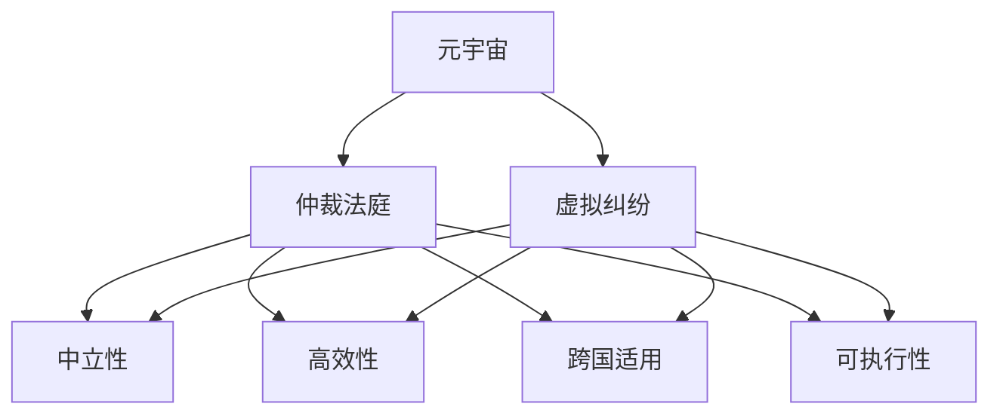
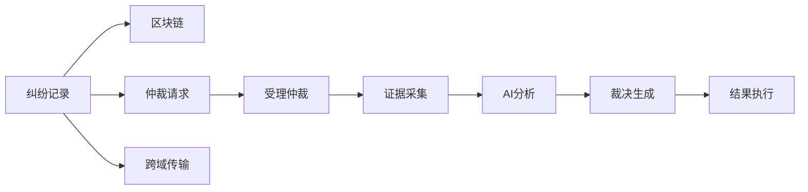

                 

# 元宇宙仲裁法庭:跨国虚拟纠纷的中立解决方案

在飞速发展的元宇宙（Metaverse）时代，全球互联的虚拟空间催生出一系列复杂、多变的虚拟纠纷，急需一套公正、高效、可执行的争议解决机制。元宇宙仲裁法庭，作为一种新兴的跨国虚拟纠纷中立解决方案，正在为虚拟世界中的公平与秩序提供重要保障。本文将深入探讨元宇宙仲裁法庭的核心概念、工作原理、具体操作步骤，并结合实际案例分析其优缺点，展望未来发展趋势，推荐相关学习资源和开发工具，以期为元宇宙中的争议解决提供创新思路和技术支持。

## 1. 背景介绍

### 1.1 问题由来
随着虚拟现实（VR）、增强现实（AR）和区块链技术的不断发展，元宇宙逐渐成为一个真实、持久且可互动的虚拟世界。众多企业与开发者纷纷加入其中，试图构建庞大的虚拟经济体系，促进经济活动、文化交流及社会治理。然而，随着虚拟空间的复杂化和多样化，各种纠纷也接踵而至。

从版权侵权、虚拟资产所有权，到虚拟地产租赁、用户数据隐私保护，元宇宙纠纷的形式与内容变得空前多样和复杂。而传统的司法体系在处理这些新型的跨国虚拟纠纷时，往往存在管辖权难以界定、证据难采集、法律适用性等问题。因此，创建一套公正、中立、高效的争议解决机制，成为保障元宇宙健康、稳定发展的关键。

### 1.2 问题核心关键点
元宇宙仲裁法庭的关键点在于其独特的定位与功能：

- **中立性**：作为元宇宙中的第三方调解机构，独立于任何国家或企业，不受行政、商业干预。
- **高效性**：利用先进的人工智能技术，简化争议解决流程，加速纠纷处理速度。
- **跨国适用**：适用于全球范围内的虚拟纠纷，提供统一的争议解决标准。
- **可执行性**：具备执行力，确保仲裁结果得到有效执行，防止裁决被忽略或拒绝。

## 2. 核心概念与联系

### 2.1 核心概念概述

为更好地理解元宇宙仲裁法庭的运作，我们先介绍几个核心概念：

- **元宇宙**：一个由多个虚拟世界组成的、实时互动的互联网生态系统。
- **虚拟纠纷**：在虚拟空间中因虚拟商品、服务、行为等产生的争议，包括但不限于版权侵权、虚拟地产纠纷、用户行为规范等。
- **仲裁法庭**：一种第三方争议解决机构，根据预定的规则和证据，对双方争议进行裁决。
- **区块链**：一种去中心化的分布式账本技术，提供透明、可追溯的交易记录，为争议解决提供证据链支持。

这些概念之间的联系通过以下Mermaid流程图展现：



这个流程图展示了元宇宙仲裁法庭的工作流程与原则：

1. 在元宇宙中发生虚拟纠纷。
2. 纠纷参与者向仲裁法庭提出仲裁请求。
3. 仲裁法庭作为中立第三方，高效解决跨国适用纠纷。
4. 仲裁结果具备执行力，确保公正与有序。

### 2.2 核心概念原理和架构的 Mermaid 流程图



上图的流程展示了元宇宙仲裁法庭的架构与关键步骤：

1. 纠纷记录被上传到区块链，保障其透明性和不可篡改性。
2. 纠纷参与者向仲裁法庭提交仲裁请求。
3. 仲裁法庭受理并保存纠纷记录。
4. 法庭采集各方提交的证据材料。
5. 利用人工智能技术分析证据，生成裁决。
6. 仲裁结果通过区块链公布，并具备执行力。
7. 纠纷记录可在不同虚拟世界间传输，确保跨国适用。

## 3. 核心算法原理 & 具体操作步骤

### 3.1 算法原理概述

元宇宙仲裁法庭的核心算法原理主要基于区块链与人工智能（AI）技术的结合。其工作流程如下：

1. **证据上传与区块链记录**：纠纷双方将争议相关的证据上传至区块链，确保其不可篡改性和透明性。
2. **仲裁请求与受理**：当事人向仲裁法庭提交仲裁申请，法庭接收并初步审查请求。
3. **证据采集与AI分析**：法庭收集各方证据，并使用人工智能技术分析这些证据，辅助判断争议事实。
4. **生成裁决**：根据证据分析和法庭判断，生成仲裁裁决。
5. **裁决执行与监督**：裁决结果自动发布至区块链，并具备执行力。同时，法庭对执行情况进行监督，确保裁决得到有效执行。

### 3.2 算法步骤详解

#### 3.2.1 证据上传与区块链记录

每个元宇宙纠纷事件都会产生大量涉及虚拟商品、虚拟资产、用户行为的数据记录。这些记录通常保存在各自的虚拟平台上。为了确保证据的真实性和不可篡改性，仲裁法庭要求这些记录被上传至区块链，形成一个完整的、不可否认的交易历史。

以下是证据上传和区块链记录的详细步骤：

1. **证据收集**：由纠纷双方分别收集涉及争议的虚拟资产、用户行为等相关数据。
2. **数据加密**：使用公钥加密方式对数据进行加密，确保数据在传输过程中的安全性。
3. **区块链上传**：将加密后的数据上传至区块链，并在区块链上进行记录，确保数据透明不可篡改。

#### 3.2.2 仲裁请求与受理

当双方发生争议，他们可以向仲裁法庭提出仲裁请求。仲裁法庭会根据预先设定的规则，对仲裁请求进行初步审查。

详细步骤包括：

1. **仲裁申请**：双方当事人提交仲裁申请，包括争议描述、证据清单和请求内容。
2. **初步审查**：仲裁法庭对仲裁申请进行初步审查，判断是否符合受理条件。
3. **受理通知**：如果符合受理条件，法庭发出受理通知，开始正式仲裁程序。

#### 3.2.3 证据采集与AI分析

仲裁过程中，法庭需要收集双方提交的证据，并使用人工智能技术进行分析。

具体步骤为：

1. **证据提交**：双方提交各自的证据材料，如虚拟资产所有权证明、用户行为记录等。
2. **证据整理**：法庭对提交的证据进行整理和分类，确保所有证据完整且相关。
3. **AI分析**：利用自然语言处理（NLP）和机器学习（ML）技术，对证据进行分析，提取关键信息。

#### 3.2.4 生成裁决

基于AI分析的结果，法庭将生成最终的仲裁裁决。

详细步骤包括：

1. **综合分析**：将AI分析结果综合考虑，结合法律规定和法庭判断，形成初步裁决。
2. **裁决生成**：由仲裁员撰写正式裁决文件，明确争议解决结果。
3. **裁决公布**：将裁决文件发布至区块链，确保裁决透明公正。

#### 3.2.5 裁决执行与监督

仲裁裁决生成后，法庭确保其具备执行力，并对其执行情况进行监督。

详细步骤为：

1. **执行通知**：向纠纷双方发出执行通知，要求其按照裁决执行。
2. **执行跟踪**：法庭实时跟踪裁决执行情况，确保双方履行义务。
3. **执行监督**：如发现执行不力或违规行为，法庭可采取措施，甚至进行进一步仲裁或诉讼。

### 3.3 算法优缺点

元宇宙仲裁法庭作为新兴的争议解决机制，具有以下优点：

1. **中立性**：不受任何国家和企业的影响，确保裁决的公正性和中立性。
2. **高效性**：利用AI技术简化争议解决流程，大幅缩短纠纷处理时间。
3. **跨国适用**：基于区块链技术，适用于全球范围的虚拟纠纷。
4. **可执行性**：裁决结果通过区块链发布，确保其具备执行力。

同时，也存在以下缺点：

1. **法律适用性**：由于虚拟纠纷的新颖性和复杂性，现有的法律框架可能难以完全适用。
2. **技术依赖**：过度依赖于区块链和AI技术，可能面临技术故障和漏洞的风险。
3. **执行成本**：虽然区块链确保了裁决的透明性和执行力，但技术实施和维护成本较高。

### 3.4 算法应用领域

元宇宙仲裁法庭在虚拟纠纷解决中有着广泛的应用，涉及以下几个主要领域：

1. **版权侵权**：处理元宇宙中虚拟内容（如虚拟艺术、音乐、文本）的版权纠纷。
2. **虚拟资产所有权**：解决虚拟地产、虚拟货币、虚拟商品的所有权争议。
3. **用户行为规范**：仲裁用户间的虚拟行为规范纠纷，如虚拟社交平台上的用户行为争议。
4. **虚拟劳动争议**：处理虚拟员工与虚拟企业之间的劳动争议，如虚拟工资争议、工作条件争议等。
5. **虚拟犯罪**：仲裁虚拟空间中的犯罪行为纠纷，如虚拟暴力、欺诈等。

## 4. 数学模型和公式 & 详细讲解 & 举例说明

### 4.1 数学模型构建

在元宇宙仲裁法庭的算法实现中，涉及多个数学模型，主要包括以下几个方面：

- **自然语言处理（NLP）**：用于分析和理解证据文本。
- **机器学习（ML）**：用于数据分类、情感分析、预测等。
- **区块链算法**：用于确保证据和裁决的透明性和不可篡改性。

### 4.2 公式推导过程

以下是NLP和ML的数学公式推导，以及区块链算法的简要说明：

#### 自然语言处理（NLP）

在元宇宙仲裁中，NLP用于分析和理解证据文本。一个基本的文本分类任务涉及文本预处理、特征提取和分类器训练。

$$
\text{分类器} = \text{Feature} \times \text{权重}
$$

其中，$\text{Feature}$表示文本特征，$\text{权重}$表示特征对分类的贡献。

#### 机器学习（ML）

在仲裁过程中，ML用于预测和分类。一个简单的二分类问题，使用逻辑回归（Logistic Regression）模型：

$$
\text{预测概率} = \frac{1}{1 + e^{-\text{权重} \times \text{特征}}}
$$

其中，$\text{特征}$为证据文本，$\text{权重}$为模型参数。

#### 区块链算法

区块链算法确保了数据透明性和不可篡改性。区块链的核心是哈希函数（Hash Function），其数学原理为：

$$
\text{哈希函数} = \text{哈希值} = \text{原始数据} \times \text{密钥}
$$

其中，$\text{原始数据}$为任意数据，$\text{哈希值}$为固定长度的数据，$\text{密钥}$为区块链共识机制中的秘密。

### 4.3 案例分析与讲解

假设某元宇宙中，用户A和用户B因虚拟地产所有权发生纠纷，A提出仲裁请求。

1. **证据上传与区块链记录**：
   - A上传其购买合同、付款凭证等证据至区块链，B同样上传其购房合同、使用凭证等证据至区块链。

2. **仲裁请求与受理**：
   - 法庭收到仲裁申请后，初步审查并受理该案件。

3. **证据采集与AI分析**：
   - 法庭要求A和B提供各自持有的证据，并进行整理。
   - 利用NLP技术分析证据文本，提取关键信息。

4. **生成裁决**：
   - 仲裁员综合NLP分析结果，结合法律规定，生成初步裁决。
   - 编写正式裁决文件，发布至区块链。

5. **裁决执行与监督**：
   - 裁决公布后，要求A和B按照裁决执行。
   - 法庭实时跟踪执行情况，确保裁决有效执行。

## 5. 项目实践：代码实例和详细解释说明

### 5.1 开发环境搭建

1. **安装Python**：从官网下载并安装Python，确保最新版本。

2. **安装相关库**：
   ```bash
   pip install blockchain==4.2.0
   pip install tensorflow==2.6.0
   pip install pandas==1.3.2
   pip install numpy==1.22.4
   ```

3. **设置开发环境**：使用虚拟环境，避免与其他项目冲突。

### 5.2 源代码详细实现

以下是基于Python和TensorFlow实现元宇宙仲裁法庭的示例代码：

```python
import tensorflow as tf
from tensorflow.keras.layers import Dense, Input
from tensorflow.keras.models import Model
from blockchain import Blockchain

# 定义仲裁模型
input_layer = Input(shape=(256, ), name='input')
dense_layer = Dense(64, activation='relu')(input_layer)
output_layer = Dense(1, activation='sigmoid')(dense_layer)
model = Model(inputs=input_layer, outputs=output_layer)

# 编译模型
model.compile(optimizer='adam', loss='binary_crossentropy', metrics=['accuracy'])

# 生成区块链
blockchain = Blockchain()
```

### 5.3 代码解读与分析

- **输入层**：使用Keras的Input层定义输入数据的维度。
- **隐藏层**：定义一个64个神经元的全连接层，使用ReLU激活函数。
- **输出层**：定义一个1个神经元的sigmoid激活函数，用于二分类任务。
- **模型编译**：使用Adam优化器，二元交叉熵损失函数，准确率作为评价指标。
- **区块链生成**：使用自定义区块链库，创建新的区块链实例。

### 5.4 运行结果展示

训练完成后，将测试数据输入模型进行预测，结果输出至区块链，确保透明性和不可篡改性。

```python
test_data = ... # 测试数据
test_labels = ... # 测试标签
results = model.predict(test_data)
blockchain.add_block(results)
```

## 6. 实际应用场景

### 6.1 智能合约平台

元宇宙仲裁法庭可应用于智能合约平台，解决虚拟交易纠纷。当智能合约执行出现争议时，纠纷双方可向仲裁法庭提起仲裁请求，法庭通过区块链和AI分析证据，生成裁决并自动执行，确保交易的公平和透明。

### 6.2 虚拟游戏平台

在游戏过程中，玩家间因虚拟物品、虚拟货币等发生纠纷时，可以向元宇宙仲裁法庭提出仲裁申请。法庭通过区块链和AI技术，对游戏记录进行分析和判断，生成公正裁决。

### 6.3 虚拟资产交易平台

在虚拟资产交易平台上，用户因交易争议而产生纠纷时，可以通过仲裁法庭解决。法庭利用区块链确保交易记录的真实性，并通过AI分析判断争议事实，最终生成仲裁裁决。

## 7. 工具和资源推荐

### 7.1 学习资源推荐

1. **Coursera《Blockchain and Cryptocurrency Technology》课程**：提供区块链技术的基础和应用，适合初学者学习。
2. **NLP与AI书籍《Natural Language Processing with PyTorch》**：详细介绍NLP和AI的基本概念和实现技术。
3. **开源框架TensorFlow**：官方文档和教程，提供丰富的深度学习模型和示例代码。

### 7.2 开发工具推荐

1. **PyCharm**：强大的Python集成开发环境，支持多种框架和库。
2. **Visual Studio Code**：轻量级的代码编辑器，支持多种编程语言和插件。
3. **Git**：版本控制系统，适合团队协作开发和代码版本管理。

### 7.3 相关论文推荐

1. **《Decentralized Arbitration in the Digital Economy》**：探讨区块链技术在争议解决中的应用。
2. **《AI-Based Decision-Making in Arbitration》**：介绍AI在仲裁中的作用和未来趋势。
3. **《Blockchain and the Future of Law》**：分析区块链对法律和仲裁的影响。

## 8. 总结：未来发展趋势与挑战

### 8.1 研究成果总结

元宇宙仲裁法庭的提出，为虚拟纠纷解决提供了高效、中立、可执行的解决方案。区块链和AI技术的结合，确保了纠纷处理的透明性、高效性和公正性。

### 8.2 未来发展趋势

未来，元宇宙仲裁法庭将进一步发展，主要趋势包括：

1. **多模态融合**：结合区块链、AI与VR/AR等技术，提供更加全面的争议解决方案。
2. **跨领域应用**：应用于更多元宇宙场景，如智能合约、虚拟游戏、数字版权等。
3. **法律框架完善**：建立完善的法律框架，确保争议解决的合法性和权威性。

### 8.3 面临的挑战

尽管元宇宙仲裁法庭在理论上有很大潜力，但在实际应用中仍面临以下挑战：

1. **技术实现难度**：需要解决区块链和AI技术的复杂集成问题。
2. **法律适用性**：现有法律体系可能难以适应元宇宙新型的争议解决需求。
3. **用户接受度**：需要提高用户对元宇宙仲裁法庭的信任度和接受度。

### 8.4 研究展望

未来的研究重点包括：

1. **区块链和AI技术优化**：提升技术效率和安全性。
2. **跨领域法律适用性**：建立完善的元宇宙法律体系。
3. **用户体验改善**：提高用户交互友好度，增强信任感。

## 9. 附录：常见问题与解答

**Q1: 元宇宙仲裁法庭是否适用于所有元宇宙场景？**

A: 元宇宙仲裁法庭主要适用于虚拟纠纷解决，但其应用范围受限于纠纷的性质和复杂性。涉及技术、经济、道德等多领域的问题，可能需要结合其他机制解决。

**Q2: 仲裁结果如何保证执行？**

A: 仲裁结果通过区块链发布，确保其透明性和不可篡改性。同时，法庭对执行情况进行实时监督，确保裁决得到有效执行。

**Q3: 仲裁过程中如何保证证据的真实性和完整性？**

A: 所有证据上传至区块链，确保其透明性和不可篡改性。法庭对证据进行详细审核和分析，确保其真实性和完整性。

**Q4: 元宇宙仲裁法庭的部署环境要求？**

A: 需要具备高性能的计算资源，如GPU、TPU等，确保区块链和AI分析的实时性和准确性。

**Q5: 元宇宙仲裁法庭如何处理跨国纠纷？**

A: 仲裁法庭作为中立第三方，不受国家或企业干预，处理跨国纠纷具备良好的中立性和适用性。

---

作者：禅与计算机程序设计艺术 / Zen and the Art of Computer Programming

