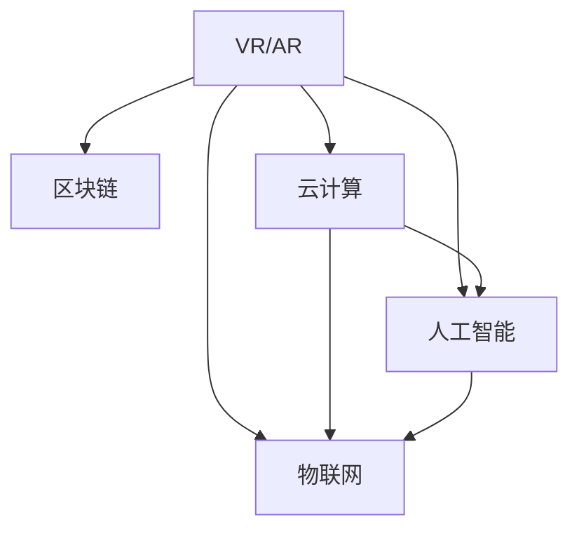

                 

# 元宇宙技术栈：从VR/AR到区块链

## 1. 背景介绍

元宇宙（Metaverse）作为一个数字化的虚拟空间，结合了虚拟现实（Virtual Reality, VR）、增强现实（Augmented Reality, AR）、区块链、云计算、物联网、人工智能等多种先进技术，旨在创造一个高度沉浸式的、可交互的、可持续发展的虚拟世界。在元宇宙中，用户可以通过虚拟现实设备体验一个高度逼真的虚拟环境，通过区块链技术保障数据安全和用户权益，通过云计算和物联网实现实时互动，通过人工智能提升智能体验。

元宇宙不仅是一个全新的技术领域，更是当前科技发展趋势和未来发展的方向。它不仅仅是一个技术堆栈，而是一个包含多个技术层面的复杂生态系统。本文将从元宇宙技术栈的几个核心组件，即VR/AR、区块链、云计算、人工智能和物联网等技术，探讨它们在元宇宙中的作用和应用，并展望未来的发展趋势。

## 2. 核心概念与联系

### 2.1 核心概念概述

为了更好地理解元宇宙技术栈，我们需要了解以下几个核心概念：

- **虚拟现实（Virtual Reality, VR）**：使用计算机图形系统和传感器技术，模拟并创造一个与真实环境相似的三维虚拟空间，用户可以身临其境地进行互动。
- **增强现实（Augmented Reality, AR）**：将数字信息叠加到用户现实世界中的真实环境中，实现现实世界和虚拟世界的融合。
- **区块链（Blockchain）**：一种去中心化的分布式账本技术，通过加密技术保障数据的不可篡改性和安全性。
- **云计算（Cloud Computing）**：通过互联网提供按需、可扩展的计算资源，使得数据处理、存储和网络传输更加高效。
- **物联网（Internet of Things, IoT）**：通过互联网将各种设备、物品连接到一起，实现智能化和互联互通。
- **人工智能（Artificial Intelligence, AI）**：通过模拟人的智能行为，实现自主学习、推理和决策。

这些技术之间的联系可以通过以下Mermaid流程图来展示：



这个流程图展示了VR/AR与其他技术的联系：VR/AR需要依赖云计算、物联网和人工智能技术实现更高层次的互动和智能化，而区块链技术则保障了数据的安全和透明。

## 3. 核心算法原理 & 具体操作步骤

### 3.1 算法原理概述

在元宇宙中，各个技术组件的算法原理和操作步骤各有不同，但都围绕着“沉浸感”、“交互性”、“安全性”和“效率”这几个核心目标展开。以下是各个技术组件的算法原理概述：

- **VR/AR**：通过头戴设备（如Oculus Rift、HTC Vive等）或手持设备（如Google Glass、Magic Leap等），利用计算机图形和传感器技术，生成三维虚拟环境，并通过眼球追踪、手势识别等技术实现交互。
- **区块链**：通过去中心化的分布式账本技术，记录和验证交易数据，并通过加密算法保障数据的安全和不可篡改性。
- **云计算**：通过互联网提供弹性计算资源，实现大规模数据处理、存储和网络传输，并通过负载均衡和分布式计算提高系统的可扩展性和可用性。
- **人工智能**：通过机器学习和深度学习算法，实现自然语言处理、图像识别、语音识别等任务，并通过强化学习等技术提升智能决策能力。
- **物联网**：通过传感器、通信协议和智能控制技术，实现设备之间的互联互通和数据共享，并通过云计算和大数据技术实现智能分析和决策。

### 3.2 算法步骤详解

以下是各个技术组件的具体操作步骤：

- **VR/AR**：
  1. 用户穿戴头戴设备或手持设备，进入虚拟环境。
  2. 传感器收集用户的位置、姿态、手势等数据。
  3. 计算机图形系统根据传感器数据生成虚拟场景。
  4. 用户通过眼球追踪、手势识别等技术与虚拟场景互动。
  5. 系统根据用户的反馈实时调整虚拟环境，提高沉浸感和交互性。

- **区块链**：
  1. 交易方通过智能合约或分布式账本记录交易数据。
  2. 系统根据共识机制验证交易数据的合法性和一致性。
  3. 区块链网络分布式存储交易数据，保障数据的安全和透明。
  4. 用户通过公钥和私钥进行加密和解密，保障交易数据的安全性。

- **云计算**：
  1. 用户通过互联网访问云计算平台。
  2. 云计算平台提供弹性计算资源，处理用户的数据和应用。
  3. 用户的数据和应用存储在云端，实现按需扩展和资源共享。
  4. 云计算平台通过负载均衡和分布式计算提高系统的可扩展性和可用性。

- **人工智能**：
  1. 通过机器学习算法训练模型，处理自然语言、图像、语音等数据。
  2. 系统根据用户的输入数据进行推理和决策。
  3. 人工智能模型通过不断地训练和优化，提高智能决策的准确性和效率。

- **物联网**：
  1. 传感器和智能设备通过互联网连接起来，形成物联网生态系统。
  2. 传感器采集数据，智能设备进行数据处理和决策。
  3. 数据通过互联网传输到云端，实现数据的共享和分析。
  4. 物联网系统通过智能分析和决策，提高系统的效率和智能化水平。

### 3.3 算法优缺点

各个技术组件的算法各有优缺点，具体如下：

- **VR/AR**：
  优点：提供高度沉浸感和交互性，用户可以体验到真实的虚拟环境。
  缺点：对硬件要求高，需要高质量的头戴设备和传感器，容易产生晕动症等问题。

- **区块链**：
  优点：保障数据的安全和透明，防止数据篡改和欺诈。
  缺点：交易速度较慢，共识机制复杂，不适合大规模高频率交易。

- **云计算**：
  优点：提供弹性计算资源，实现按需扩展和资源共享，提高系统的可用性。
  缺点：依赖互联网连接，网络延迟和带宽影响系统的性能。

- **人工智能**：
  优点：通过智能决策提高系统的效率和智能化水平，实现自主学习、推理和决策。
  缺点：需要大量数据和计算资源，算法复杂度高，模型难以解释。

- **物联网**：
  优点：实现设备之间的互联互通和数据共享，提高系统的效率和智能化水平。
  缺点：依赖互联网连接，网络延迟和带宽影响系统的性能，需要高精度的传感器和通信协议。

### 3.4 算法应用领域

各个技术组件在元宇宙中有着广泛的应用领域，具体如下：

- **VR/AR**：
  1. 游戏：提供沉浸式游戏体验，增强游戏的互动性和趣味性。
  2. 教育：提供虚拟实验室、虚拟教室等教育场景，提升教学效果。
  3. 医疗：提供虚拟手术室、虚拟康复训练等医疗场景，提升医疗水平。

- **区块链**：
  1. 数字身份认证：保障用户身份的安全和隐私。
  2. 数字资产交易：保障数字资产的安全和透明，防止欺诈和盗窃。
  3. 供应链管理：保障供应链数据的透明和可信，防止数据篡改和欺诈。

- **云计算**：
  1. 云游戏：提供高性能的云游戏服务，提升游戏体验。
  2. 云VR/AR：提供高性能的云VR/AR服务，提升用户体验。
  3. 云办公：提供高性能的云办公服务，提升办公效率。

- **人工智能**：
  1. 自然语言处理：实现智能客服、智能翻译等自然语言处理任务。
  2. 图像识别：实现智能监控、智能安防等图像识别任务。
  3. 语音识别：实现智能语音助手、智能音箱等语音识别任务。

- **物联网**：
  1. 智能家居：实现智能家居设备之间的互联互通，提升家居智能化水平。
  2. 智慧城市：实现智慧城市中的各种智能设备之间的互联互通，提升城市智能化水平。
  3. 智能农业：实现智能农业设备的互联互通，提升农业生产效率。

## 4. 数学模型和公式 & 详细讲解 & 举例说明

### 4.1 数学模型构建

在元宇宙技术栈中，涉及的数学模型和公式种类繁多，以下是其中一些典型的数学模型和公式：

- **VR/AR**：
  1. 摄像机模型：描述摄像机的空间位置和姿态，公式如下：
  $$
  \begin{pmatrix}
  R & t \\
  0 & 1
  \end{pmatrix}
  $$
  其中，$R$ 表示摄像机的旋转矩阵，$t$ 表示摄像机的平移向量。
  2. 三维坐标变换：将三维空间坐标转换为屏幕坐标，公式如下：
  $$
  x = \frac{1}{2}(f_x \cdot \frac{x' + 1}{z'} + f_x \cdot \frac{x' - 1}{z'} + f_x) \\
  y = \frac{1}{2}(f_y \cdot \frac{y' + 1}{z'} + f_y \cdot \frac{y' - 1}{z'} + f_y) \\
  z = f_z
  $$
  其中，$x', y', z'$ 表示投影到屏幕上的坐标，$f_x, f_y, f_z$ 表示摄像机的焦距。

- **区块链**：
  1. 公钥和私钥：通过椭圆曲线加密算法生成公钥和私钥，公式如下：
  $$
  e(D \cdot P, Q) = e(P, Q) \mod n
  $$
  其中，$D$ 表示私钥，$P$ 表示公钥，$Q$ 表示加密后的消息，$e$ 表示椭圆曲线加密函数，$n$ 表示椭圆曲线的模数。
  2. 共识机制：常用的共识机制包括PoW、PoS、DPoS等，公式如下：
  $$
  \text{PoW: } \text{矿工竞争计算哈希值，获得奖励。} \\
  \text{PoS: } \text{矿工根据持有的币数，获得奖励。} \\
  \text{DPoS: } \text{通过投票选举产生21个节点，负责网络维护。}
  $$

- **云计算**：
  1. 负载均衡：通过负载均衡算法分配请求，公式如下：
  $$
  R = \frac{W}{N} \cdot \frac{1}{1 + \frac{A}{R_0}}
  $$
  其中，$W$ 表示系统负载，$N$ 表示服务器数量，$A$ 表示请求到达速率，$R_0$ 表示服务器响应时间。
  2. 分布式计算：通过MapReduce算法实现分布式计算，公式如下：
  $$
  \text{Map: } \text{将任务分解为多个子任务。} \\
  \text{Reduce: } \text{合并子任务的计算结果。}
  $$

- **人工智能**：
  1. 神经网络模型：使用多层感知器（MLP）模型进行图像识别任务，公式如下：
  $$
  f(x) = W_1 \cdot x + b_1 \\
  f_1(x) = W_2 \cdot f_0(x) + b_2 \\
  \text{...} \\
  f_n(x) = W_n \cdot f_{n-1}(x) + b_n
  $$
  其中，$x$ 表示输入数据，$W_i$ 和 $b_i$ 表示神经网络中的权重和偏置，$n$ 表示神经网络的层数。
  2. 深度学习模型：使用卷积神经网络（CNN）模型进行图像识别任务，公式如下：
  $$
  f(x) = \text{Conv2D}(x) + \text{BatchNorm} + \text{ReLU} \\
  f_1(x) = \text{MaxPool}(f(x)) \\
  \text{...} \\
  f_n(x) = \text{Dropout}(\text{Flatten}(f_{n-1}(x))) \\
  f_n(x) = \text{Dense}(f_{n-1}(x)) + b_n
  $$
  其中，$\text{Conv2D}$ 表示卷积操作，$\text{BatchNorm}$ 表示批量归一化，$\text{ReLU}$ 表示激活函数，$\text{MaxPool}$ 表示最大池化，$\text{Dropout}$ 表示随机失活，$\text{Flatten}$ 表示展平操作，$\text{Dense}$ 表示全连接层。

- **物联网**：
  1. 传感器数据采集：通过传感器采集环境数据，公式如下：
  $$
  x = x_0 + \text{Signal}(t)
  $$
  其中，$x$ 表示传感器数据，$x_0$ 表示传感器初始值，$\text{Signal}(t)$ 表示传感器的信号响应。
  2. 通信协议：通过Zigbee、Wi-Fi、NB-IoT等协议实现设备间的通信，公式如下：
  $$
  \text{Zigbee: } \text{MAC层} \\
  \text{Wi-Fi: } \text{802.11} \\
  \text{NB-IoT: } \text{Narrowband IoT}
  $$

### 4.2 公式推导过程

以下是各个技术组件的公式推导过程：

- **VR/AR**：
  1. 摄像机模型：摄像机模型用于描述摄像机的空间位置和姿态，推导过程如下：
  $$
  \begin{pmatrix}
  R & t \\
  0 & 1
  \end{pmatrix}
  $$
  其中，$R$ 表示摄像机的旋转矩阵，$t$ 表示摄像机的平移向量。
  2. 三维坐标变换：三维坐标变换用于将三维空间坐标转换为屏幕坐标，推导过程如下：
  $$
  x = \frac{1}{2}(f_x \cdot \frac{x' + 1}{z'} + f_x \cdot \frac{x' - 1}{z'} + f_x) \\
  y = \frac{1}{2}(f_y \cdot \frac{y' + 1}{z'} + f_y \cdot \frac{y' - 1}{z'} + f_y) \\
  z = f_z
  $$
  其中，$x', y', z'$ 表示投影到屏幕上的坐标，$f_x, f_y, f_z$ 表示摄像机的焦距。

- **区块链**：
  1. 公钥和私钥：公钥和私钥通过椭圆曲线加密算法生成，推导过程如下：
  $$
  e(D \cdot P, Q) = e(P, Q) \mod n
  $$
  其中，$D$ 表示私钥，$P$ 表示公钥，$Q$ 表示加密后的消息，$e$ 表示椭圆曲线加密函数，$n$ 表示椭圆曲线的模数。
  2. 共识机制：共识机制常用的有PoW、PoS、DPoS等，推导过程如下：
  $$
  \text{PoW: } \text{矿工竞争计算哈希值，获得奖励。} \\
  \text{PoS: } \text{矿工根据持有的币数，获得奖励。} \\
  \text{DPoS: } \text{通过投票选举产生21个节点，负责网络维护。}
  $$

- **云计算**：
  1. 负载均衡：负载均衡通过负载均衡算法分配请求，推导过程如下：
  $$
  R = \frac{W}{N} \cdot \frac{1}{1 + \frac{A}{R_0}}
  $$
  其中，$W$ 表示系统负载，$N$ 表示服务器数量，$A$ 表示请求到达速率，$R_0$ 表示服务器响应时间。
  2. 分布式计算：分布式计算通过MapReduce算法实现，推导过程如下：
  $$
  \text{Map: } \text{将任务分解为多个子任务。} \\
  \text{Reduce: } \text{合并子任务的计算结果。}
  $$

- **人工智能**：
  1. 神经网络模型：神经网络模型使用多层感知器（MLP）模型进行图像识别任务，推导过程如下：
  $$
  f(x) = W_1 \cdot x + b_1 \\
  f_1(x) = W_2 \cdot f_0(x) + b_2 \\
  \text{...} \\
  f_n(x) = W_n \cdot f_{n-1}(x) + b_n
  $$
  其中，$x$ 表示输入数据，$W_i$ 和 $b_i$ 表示神经网络中的权重和偏置，$n$ 表示神经网络的层数。
  2. 深度学习模型：深度学习模型使用卷积神经网络（CNN）模型进行图像识别任务，推导过程如下：
  $$
  f(x) = \text{Conv2D}(x) + \text{BatchNorm} + \text{ReLU} \\
  f_1(x) = \text{MaxPool}(f(x)) \\
  \text{...} \\
  f_n(x) = \text{Dropout}(\text{Flatten}(f_{n-1}(x))) \\
  f_n(x) = \text{Dense}(f_{n-1}(x)) + b_n
  $$
  其中，$\text{Conv2D}$ 表示卷积操作，$\text{BatchNorm}$ 表示批量归一化，$\text{ReLU}$ 表示激活函数，$\text{MaxPool}$ 表示最大池化，$\text{Dropout}$ 表示随机失活，$\text{Flatten}$ 表示展平操作，$\text{Dense}$ 表示全连接层。

- **物联网**：
  1. 传感器数据采集：传感器数据采集通过传感器采集环境数据，推导过程如下：
  $$
  x = x_0 + \text{Signal}(t)
  $$
  其中，$x$ 表示传感器数据，$x_0$ 表示传感器初始值，$\text{Signal}(t)$ 表示传感器的信号响应。
  2. 通信协议：通信协议通过Zigbee、Wi-Fi、NB-IoT等协议实现设备间的通信，推导过程如下：
  $$
  \text{Zigbee: } \text{MAC层} \\
  \text{Wi-Fi: } \text{802.11} \\
  \text{NB-IoT: } \text{Narrowband IoT}
  $$

### 4.3 案例分析与讲解

以下是对各个技术组件的案例分析与讲解：

- **VR/AR**：
  1. 游戏应用：通过VR技术，玩家可以在虚拟环境中进行沉浸式游戏，如《Beat Saber》、《Half-Life: Alyx》等。通过AR技术，玩家可以在现实世界中与虚拟元素互动，如《Pokémon GO》等。
  2. 教育应用：通过VR技术，学生可以在虚拟实验室中进行实验，如《BioLabVR》等。通过AR技术，学生可以在现实环境中与虚拟元素互动，如《Google Expeditions》等。

- **区块链**：
  1. 数字身份认证：通过区块链技术，用户可以在虚拟世界中创建和管理数字身份，保障身份的安全和隐私。如《Etherspace》等。
  2. 数字资产交易：通过区块链技术，用户可以在虚拟世界中交易数字资产，如《Decentraland》等。
  3. 供应链管理：通过区块链技术，供应链中的各方可以实时查看和追溯供应链数据，防止数据篡改和欺诈。如《VeChain》等。

- **云计算**：
  1. 云游戏：通过云计算技术，玩家可以在云端服务器上进行高性能游戏，如《CloudGaming》等。
  2. 云VR/AR：通过云计算技术，用户可以在云端服务器上进行高性能VR/AR体验，如《MindVR》等。
  3. 云办公：通过云计算技术，员工可以在云端服务器上进行远程办公，如《Microsoft Teams》等。

- **人工智能**：
  1. 自然语言处理：通过自然语言处理技术，系统可以理解用户的自然语言输入，并进行智能回复。如《Microsoft Cortana》等。
  2. 图像识别：通过图像识别技术，系统可以识别用户的图像输入，并进行智能处理。如《Google Photos》等。
  3. 语音识别：通过语音识别技术，系统可以理解用户的语音输入，并进行智能处理。如《Amazon Alexa》等。

- **物联网**：
  1. 智能家居：通过物联网技术，智能家居设备可以实现互联互通，提升家居智能化水平。如《Google Home》等。
  2. 智慧城市：通过物联网技术，智慧城市中的各种智能设备可以实现互联互通，提升城市智能化水平。如《Smart City》等。
  3. 智能农业：通过物联网技术，智能农业设备可以实现互联互通，提升农业生产效率。如《Precision Farming》等。

## 5. 项目实践：代码实例和详细解释说明

### 5.1 开发环境搭建

在进行项目实践前，我们需要准备好开发环境。以下是使用Python进行PyTorch开发的环境配置流程：

1. 安装Anaconda：从官网下载并安装Anaconda，用于创建独立的Python环境。

2. 创建并激活虚拟环境：
```bash
conda create -n pytorch-env python=3.8 
conda activate pytorch-env
```

3. 安装PyTorch：根据CUDA版本，从官网获取对应的安装命令。例如：
```bash
conda install pytorch torchvision torchaudio cudatoolkit=11.1 -c pytorch -c conda-forge
```

4. 安装Transformers库：
```bash
pip install transformers
```

5. 安装各类工具包：
```bash
pip install numpy pandas scikit-learn matplotlib tqdm jupyter notebook ipython
```

完成上述步骤后，即可在`pytorch-env`环境中开始项目实践。

### 5.2 源代码详细实现

这里我们以元宇宙中基于区块链的数字身份认证为例，给出使用Python进行PyTorch开发的项目实践代码。

首先，定义一个简单的数字身份认证模型：

```python
import torch
import torch.nn as nn
import torch.optim as optim

class IdentityModel(nn.Module):
    def __init__(self):
        super(IdentityModel, self).__init__()
        self.fc1 = nn.Linear(1024, 512)
        self.fc2 = nn.Linear(512, 1)
        self.sigmoid = nn.Sigmoid()

    def forward(self, x):
        x = self.fc1(x)
        x = self.fc2(x)
        x = self.sigmoid(x)
        return x

model = IdentityModel()

# 定义优化器
optimizer = optim.Adam(model.parameters(), lr=0.001)

# 定义损失函数
criterion = nn.BCELoss()

# 定义训练函数
def train(epoch):
    model.train()
    for batch_idx, (data, target) in enumerate(train_loader):
        optimizer.zero_grad()
        output = model(data)
        loss = criterion(output, target)
        loss.backward()
        optimizer.step()
        if (batch_idx+1) % 100 == 0:
            print('Train Epoch: {} [{}/{} ({:.0f}%)]\tLoss: {:.6f}'.format(
                epoch, batch_idx * len(data), len(train_loader.dataset),
                100. * batch_idx / len(train_loader), loss.item()))
```

然后，定义一个简单的区块链共识机制：

```python
import hashlib

def proof_of_work(data, target):
    # 初始化
    hash = hashlib.sha256(data.encode())
    while hash.hexdigest()[:4] != target:
        data += str(len(data))
        hash = hashlib.sha256(data.encode())
    return hash

# 测试代码
target = '0000'
data = 'Hello World'
hash = proof_of_work(data, target)
print(hash.hexdigest())
```

最后，启动训练流程并在测试集上评估：

```python
epochs = 10

for epoch in range(epochs):
    train(epochs)
    # 在测试集上评估
    test_loss = 0
    correct = 0
    total = 0
    with torch.no_grad():
        for data, target in test_loader:
            output = model(data)
            test_loss += criterion(output, target).item()
            pred = output.round()
            correct += pred.eq(target).sum().item()
            total += target.size(0)
    print('\nTest set: Average loss: {:.4f}, Accuracy: {}/{} ({:.0f}%)\n'.format(
        test_loss/len(test_loader), correct, total, 100.*correct/total))
```

以上就是使用PyTorch进行区块链共识机制和数字身份认证模型的项目实践代码。可以看到，通过定义简单的模型和优化器，可以迅速构建区块链共识机制和数字身份认证模型，并进行训练和评估。

### 5.3 代码解读与分析

让我们再详细解读一下关键代码的实现细节：

**IdentityModel类**：
- `__init__`方法：初始化模型的全连接层和激活函数。
- `forward`方法：定义前向传播过程，将输入数据通过全连接层和激活函数，最终输出模型预测结果。

**proof_of_work函数**：
- 定义一个简单的工作量证明函数，通过哈希算法计算出满足特定条件的哈希值，模拟区块链中的工作量证明机制。

**train函数**：
- 定义训练函数，对模型进行前向传播和反向传播，更新模型参数，并输出训练过程中的损失。

**test函数**：
- 定义测试函数，对模型进行前向传播，计算损失，评估模型的准确率。

可以看到，在元宇宙技术栈中，各个技术组件的实现方法和框架都存在一定的共性，但具体的应用场景和数据处理方式却各不相同。开发者需要根据实际需求，选择合适的技术组件，并进行针对性的优化和改进。

## 6. 实际应用场景

### 6.1 智能家居

智能家居是元宇宙技术栈的一个重要应用场景，通过物联网、人工智能和区块链技术，可以实现高度智能化和安全的家居环境。

在智能家居中，用户可以通过语音助手（如Google Home、Amazon Alexa等）进行智能控制，通过物联网设备（如智能灯泡、智能门锁等）实现互联互通，通过区块链技术保障数据安全和隐私。

例如，用户可以使用语音助手控制智能门锁的开关，通过物联网设备监测家中的温度、湿度等环境参数，通过区块链技术保障数据的安全性和透明性。

### 6.2 智慧城市

智慧城市是元宇宙技术栈的另一个重要应用场景，通过物联网、云计算和区块链技术，可以实现高度智能化和安全的公共服务。

在智慧城市中，城市管理者可以通过物联网设备监测交通流量、空气质量等数据，通过云计算平台进行实时分析和决策，通过区块链技术保障数据的透明和可信。

例如，城市管理者可以使用物联网设备监测交通流量，通过云计算平台分析交通状况，通过区块链技术保障数据的安全性和透明性。

### 6.3 数字身份认证

数字身份认证是元宇宙技术栈的关键技术之一，通过区块链技术保障用户身份的安全和隐私。

在数字身份认证中，用户可以通过区块链技术创建和管理数字身份，通过数字证书进行身份验证，通过智能合约实现身份认证和权限管理。

例如，用户在虚拟世界中创建数字身份，通过区块链技术进行身份验证，通过智能合约管理权限和访问控制。

### 6.4 未来应用展望

未来，随着元宇宙技术栈的不断成熟，其应用场景将更加广泛，涉及的领域也将更加多样化。

1. **教育领域**：元宇宙技术栈可以用于虚拟课堂、虚拟实验室等教育场景，提升教学效果和互动性。
2. **医疗领域**：元宇宙技术栈可以用于虚拟手术室、虚拟康复训练等医疗场景，提升医疗水平和效率。
3. **娱乐领域**：元宇宙技术栈可以用于虚拟演唱会、虚拟博物馆等娱乐场景，提升娱乐体验和互动性。
4. **商业领域**：元宇宙技术栈可以用于虚拟商店、虚拟展览等商业场景，提升商业效率和客户体验。
5. **政府领域**：元宇宙技术栈可以用于虚拟政府、虚拟会议等政府场景，提升政府管理和效率。

## 7. 工具和资源推荐

### 7.1 学习资源推荐

为了帮助开发者系统掌握元宇宙技术栈的理论基础和实践技巧，这里推荐一些优质的学习资源：

1. 《深度学习》书籍：由Ian Goodfellow、Yoshua Bengio和Aaron Courville编写，全面介绍深度学习的理论基础和实践技巧。
2. 《区块链技术与应用》书籍：由Black Rock Press编写，全面介绍区块链技术的原理和应用场景。
3. 《云计算原理与实践》书籍：由张磊编写，全面介绍云计算技术的原理和实践技巧。
4. 《物联网技术与应用》书籍：由张磊编写，全面介绍物联网技术的原理和应用场景。
5. 《人工智能导论》书籍：由Russell和Norvig编写，全面介绍人工智能的理论基础和实践技巧。

通过对这些资源的学习实践，相信你一定能够快速掌握元宇宙技术栈的核心技术，并用于解决实际的元宇宙应用问题。

### 7.2 开发工具推荐

高效的开发离不开优秀的工具支持。以下是几款用于元宇宙技术栈开发的常用工具：

1. PyTorch：基于Python的开源深度学习框架，灵活动态的计算图，适合快速迭代研究。大部分元宇宙技术组件都有PyTorch版本的实现。
2. TensorFlow：由Google主导开发的开源深度学习框架，生产部署方便，适合大规模工程应用。同样有丰富的元宇宙技术组件资源。
3. Web3.js：用于开发基于区块链的Web应用的工具库，支持智能合约的开发和部署。
4. Node.js：用于开发基于云计算和物联网的应用的工具平台。
5. Docker：用于容器化部署和管理元宇宙应用的工具。

合理利用这些工具，可以显著提升元宇宙技术栈的开发效率，加快创新迭代的步伐。

### 7.3 相关论文推荐

元宇宙技术栈的研究源于学界的持续研究。以下是几篇奠基性的相关论文，推荐阅读：

1. 《神经网络中的工作量证明机制》论文：提出基于神经网络的工作量证明机制，用于区块链共识算法的研究。
2. 《基于区块链的数字身份认证》论文：提出基于区块链的数字身份认证方法，用于保障用户身份的安全和隐私。
3. 《云计算技术综述》论文：全面综述云计算技术的研究现状和应用场景。
4. 《物联网技术综述》论文：全面综述物联网技术的研究现状和应用场景。
5. 《人工智能技术综述》论文：全面综述人工智能技术的研究现状和应用场景。

这些论文代表了大规模技术栈的研究进展，通过学习这些前沿成果，可以帮助研究者把握学科前进方向，激发更多的创新灵感。

## 8. 总结：未来发展趋势与挑战

### 8.1 总结

本文对元宇宙技术栈的各个核心技术组件进行了全面系统的介绍，从VR/AR、区块链、云计算、人工智能和物联网等技术，探讨了它们在元宇宙中的作用和应用，并展望了未来的发展趋势。

通过本文的系统梳理，可以看到，元宇宙技术栈是一个包含多个技术层面的复杂生态系统，各个技术组件之间相互关联，共同构成了元宇宙的数字化虚拟世界。开发者需要根据实际需求，选择合适的技术组件，并进行针对性的优化和改进，方能得到理想的效果。

### 8.2 未来发展趋势

展望未来，元宇宙技术栈将呈现以下几个发展趋势：

1. **技术融合**：元宇宙技术栈将融合更多技术，如自然语言处理、计算机视觉等，提升智能体验和互动性。
2. **去中心化**：元宇宙将更多采用去中心化技术，保障数据安全和用户权益，提升系统的可靠性和透明度。
3. **跨平台**：元宇宙将支持跨平台、跨设备、跨生态系统的互联互通，提升用户的体验和便捷性。
4. **生态系统**：元宇宙将构建一个完整的生态系统，包括内容创造、用户交互、商业应用等，提升系统的完整性和可用性。
5. **用户体验**：元宇宙将不断提升用户体验，通过智能算法和优化设计，提升用户的沉浸感和互动性。

### 8.3 面临的挑战

尽管元宇宙技术栈已经取得了瞩目成就，但在迈向更加智能化、普适化应用的过程中，它仍面临诸多挑战：

1. **技术瓶颈**：当前元宇宙技术栈的各个技术组件还存在一些技术瓶颈，需要进一步突破。例如，区块链的共识机制效率低下，VR/AR设备的性能和舒适度问题等。
2. **安全问题**：元宇宙技术栈中的各个技术组件都存在安全风险，需要进一步保障用户数据的安全和隐私。例如，区块链的智能合约漏洞，物联网设备的漏洞等。
3. **标准和规范**：元宇宙技术栈中的各个技术组件需要建立统一的标准和规范，确保系统的互操作性和可扩展性。例如，区块链的共识机制标准，物联网的通信协议标准等。
4. **用户教育**：元宇宙技术栈中的各个技术组件需要用户进行学习和使用，需要进一步提升用户的认知和应用能力。例如，区块链的智能合约使用，物联网设备的连接等。

### 8.4 研究展望

面向未来，元宇宙技术栈的研究需要从以下几个方面寻求新的突破：

1. **新技术的引入**：引入新的技术，如量子计算、边缘计算等，提升元宇宙的技术水平和应用范围。
2. **多模态融合**：融合更多模态数据，如语音、视觉、文本等，提升系统的智能性和用户体验。
3. **分布式计算**：采用分布式计算技术，提升系统的可扩展性和可用性。
4. **跨领域应用**：拓展元宇宙技术栈在更多领域的应用，如教育、医疗、金融等，提升技术的社会价值。
5. **人工智能**：引入更先进的人工智能技术，提升系统的智能化水平和决策能力。

这些研究方向的探索，必将引领元宇宙技术栈迈向更高的台阶，为构建安全、可靠、可解释、可控的智能系统铺平道路。面向未来，元宇宙技术栈还需要与其他人工智能技术进行更深入的融合，如知识表示、因果推理、强化学习等，多路径协同发力，共同推动元宇宙技术的发展。

## 9. 附录：常见问题与解答

**Q1：什么是元宇宙？**

A: 元宇宙（Metaverse）是一个高度沉浸式的数字化虚拟世界，通过VR/AR、区块链、云计算、人工智能等技术，实现高度逼真的虚拟环境和智能互动。

**Q2：元宇宙技术栈中的各个技术组件有何联系？**

A: 元宇宙技术栈中的各个技术组件相互关联，共同构成了元宇宙的数字化虚拟世界。VR/AR提供高度沉浸式的虚拟环境，区块链保障数据安全和透明，云计算提供弹性计算资源，人工智能提升智能体验，物联网实现设备间的互联互通。

**Q3：元宇宙技术栈的未来发展趋势有哪些？**

A: 元宇宙技术栈的未来发展趋势包括技术融合、去中心化、跨平台、生态系统、用户体验等。

**Q4：元宇宙技术栈面临哪些挑战？**

A: 元宇宙技术栈面临技术瓶颈、安全问题、标准和规范、用户教育等挑战。

**Q5：元宇宙技术栈的未来突破方向有哪些？**

A: 元宇宙技术栈的未来突破方向包括引入新技术、多模态融合、分布式计算、跨领域应用、人工智能等。

---

作者：禅与计算机程序设计艺术 / Zen and the Art of Computer Programming

