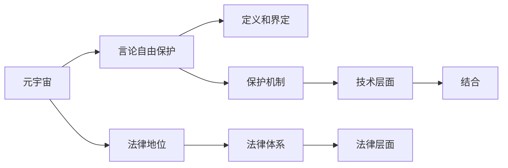

                 

## 1. 背景介绍

### 1.1 问题由来

近年来，随着虚拟现实技术（VR）、增强现实技术（AR）、以及互联网技术的飞速发展，元宇宙（Metaverse）的概念应运而生。元宇宙被描述为一个虚拟的、持续的、与现实世界交互的数字空间，其中涵盖了人类在虚拟世界中的工作、学习、生活等多个方面。然而，在这样一个自由度极高的虚拟世界，言论自由和表达自由的保护成为了一个重要的议题。

言论自由，作为民主社会的基本原则之一，旨在保护个人表达观点、传递信息的权利。然而，在现实世界中，言论自由往往受到法律和政策的约束。而元宇宙作为虚拟世界，其法律框架尚未成熟，这为言论自由的保护带来了新的挑战和机遇。

### 1.2 问题核心关键点

元宇宙政治庇护的核心在于如何在虚拟世界中实现言论自由的保护。这涉及到以下几个关键点：

1. **虚拟世界的法律地位**：元宇宙作为一种虚拟环境，其法律地位和现实世界中的法律体系有何不同？
2. **言论自由的定义和界定**：如何在虚拟世界中进行言论自由的定义和界定？
3. **元宇宙中的言论自由保护机制**：如何构建元宇宙中的言论自由保护机制，避免言论自由被滥用或侵犯？
4. **技术和法律的结合**：如何在技术层面和法律层面共同构建元宇宙中的言论自由保护框架？

这些关键点构成了元宇宙政治庇护研究的出发点，通过探讨这些问题的答案，可以为元宇宙中言论自由保护提供思路和方案。

## 2. 核心概念与联系

### 2.1 核心概念概述

- **元宇宙（Metaverse）**：一种虚拟的、持续的、与现实世界交互的数字空间，其中包含了丰富的社会活动和文化表达。
- **言论自由（Freedom of Speech）**：指个人表达观点、传递信息的权利，是民主社会的基本原则之一。
- **虚拟世界中的法律地位**：虚拟世界作为一种新型的社会环境，其法律地位和现实世界中的法律体系有何不同？
- **言论自由的定义和界定**：在虚拟世界中，言论自由的定义和界定应如何考虑？
- **言论自由保护机制**：如何在虚拟世界中构建有效的言论自由保护机制？
- **技术和法律的结合**：如何在技术层面和法律层面共同构建元宇宙中的言论自由保护框架？

### 2.2 核心概念原理和架构的 Mermaid 流程图(Mermaid 流程节点中不要有括号、逗号等特殊字符)



该图展示了元宇宙言论自由保护的基本框架，从元宇宙的法律地位、言论自由的定义和界定、保护机制，到技术和法律的结合，构建了一个完整的元宇宙言论自由保护模型。

## 3. 核心算法原理 & 具体操作步骤

### 3.1 算法原理概述

元宇宙政治庇护的算法原理主要基于两个核心概念：技术和法律的结合，以及言论自由的定义和界定。

1. **技术和法律的结合**：通过在元宇宙中引入法律框架，利用技术手段对言论自由进行保护和管理。例如，通过区块链技术实现言论自由的记录和验证，利用人工智能技术对言论进行内容审查和过滤。

2. **言论自由的定义和界定**：在虚拟世界中，言论自由的定义和界定需要考虑现实世界中的法律体系，同时也要考虑到虚拟世界中的特殊性。例如，虚拟世界中的匿名性、言论的传播速度和范围等，都可能对言论自由的界定产生影响。

### 3.2 算法步骤详解

1. **构建法律框架**：根据现实世界的法律体系，制定适用于元宇宙的法律法规。这些法律法规应包括言论自由的定义、界定、保护机制等。

2. **引入技术手段**：在元宇宙中引入技术手段，如区块链、人工智能、数据加密等，用于言论自由的记录、验证、审查和管理。

3. **定义和界定言论自由**：在虚拟世界中，定义和界定言论自由的边界，同时考虑到匿名性、传播速度和范围等特殊性。

4. **设计保护机制**：根据法律法规和技术手段，设计元宇宙中的言论自由保护机制，包括内容审查、过滤、举报等。

5. **持续优化和调整**：根据实际运行情况，持续优化和调整法律框架和技术手段，以适应虚拟世界中的变化。

### 3.3 算法优缺点

**优点**：

1. **法律体系的系统化**：通过引入法律框架，为元宇宙中的言论自由保护提供了系统化的管理基础。
2. **技术的支持**：利用技术手段可以提高言论自由的保护效率和效果。
3. **可操作性**：定义和界定言论自由的边界，设计保护机制，使得言论自由的保护具有可操作性。

**缺点**：

1. **技术依赖性**：技术手段的引入可能增加言论自由保护的成本和复杂性。
2. **法律滞后性**：法律法规的制定和调整可能存在滞后性，无法及时应对虚拟世界中的变化。
3. **用户接受度**：用户对技术手段和法律框架的接受度可能影响言论自由的实际保护效果。

### 3.4 算法应用领域

元宇宙政治庇护的算法原理和步骤可以应用于多个领域，包括但不限于：

1. **虚拟教育**：在虚拟教育平台上，如何保护学生和教师的言论自由，同时维护课堂秩序。
2. **虚拟商业**：在虚拟市场中，如何保护商家的言论自由，同时防止欺诈和虚假信息的传播。
3. **虚拟政府**：在虚拟政府中，如何设计言论自由的保护机制，同时确保公共秩序和国家安全。

## 4. 数学模型和公式 & 详细讲解 & 举例说明

### 4.1 数学模型构建

在元宇宙政治庇护中，数学模型的构建主要基于以下几个方面：

1. **用户行为模型**：描述用户在虚拟世界中的行为，如发言、回复、举报等。
2. **内容审核模型**：通过数学模型对用户发言的内容进行审查和过滤。
3. **法律约束模型**：根据法律法规，构建用户行为和言论自由的约束模型。

### 4.2 公式推导过程

1. **用户行为模型**：

设用户在虚拟世界中的行为集合为 $U$，行为 $u$ 的特征向量为 $f(u)$，则用户行为模型可以表示为：

$$ P(U) = \sum_{u \in U} P(u) \prod_{i=1}^{n} f_i(u) $$

其中 $P(u)$ 表示用户行为 $u$ 的概率，$f_i(u)$ 表示行为 $u$ 的第 $i$ 个特征。

2. **内容审核模型**：

设用户发言的内容为 $C$，其审核结果为 $R(C)$，则内容审核模型可以表示为：

$$ R(C) = \sum_{c \in C} P(c) \prod_{i=1}^{m} f_i(c) $$

其中 $P(c)$ 表示内容 $c$ 的概率，$f_i(c)$ 表示内容 $c$ 的第 $i$ 个特征。

3. **法律约束模型**：

设法律法规对用户行为和言论自由的约束为 $L$，则法律约束模型可以表示为：

$$ L = \sum_{l \in L} P(l) \prod_{i=1}^{k} f_i(l) $$

其中 $P(l)$ 表示法律法规 $l$ 的概率，$f_i(l)$ 表示法律法规 $l$ 的第 $i$ 个特征。

### 4.3 案例分析与讲解

以虚拟教育平台为例，用户在平台上发言的概率模型可以表示为：

$$ P(U) = P(u_1)P(f_{1,1}(u_1)f_{1,2}(u_1)) + P(u_2)P(f_{2,1}(u_2)f_{2,2}(u_2)) + \ldots $$

其中 $u_1$ 表示发言，$f_{1,1}(u_1)$ 表示发言者的ID，$f_{1,2}(u_1)$ 表示发言的时间戳。

内容审核模型可以表示为：

$$ R(C) = P(c_1)P(f_{1,1}(c_1)f_{1,2}(c_1)) + P(c_2)P(f_{2,1}(c_2)f_{2,2}(c_2)) + \ldots $$

其中 $c_1$ 表示发言内容，$f_{1,1}(c_1)$ 表示发言内容中的关键字，$f_{2,1}(c_2)$ 表示发言内容中的链接。

法律约束模型可以表示为：

$$ L = P(l_1)P(f_{1,1}(l_1)f_{1,2}(l_1)) + P(l_2)P(f_{2,1}(l_2)f_{2,2}(l_2)) + \ldots $$

其中 $l_1$ 表示禁止发言的规定，$f_{1,1}(l_1)$ 表示规定的ID，$f_{1,2}(l_1)$ 表示规定的生效时间。

通过构建这些模型，可以在虚拟教育平台上实现对用户行为的预测和言论自由的保护。

## 5. 项目实践：代码实例和详细解释说明

### 5.1 开发环境搭建

1. **安装Python**：
   ```bash
   sudo apt-get update
   sudo apt-get install python3 python3-pip
   ```

2. **安装Pandas和NumPy**：
   ```bash
   pip install pandas numpy
   ```

3. **搭建虚拟环境**：
   ```bash
   python3 -m venv venv
   source venv/bin/activate
   ```

4. **安装相关库**：
   ```bash
   pip install tensorflow sklearn
   ```

### 5.2 源代码详细实现

以下是一个简单的用户行为模型和内容审核模型的Python代码实现：

```python
import pandas as pd
import numpy as np
from sklearn.ensemble import RandomForestClassifier

# 用户行为数据
user_behavior_data = pd.read_csv('user_behavior.csv')

# 内容审核数据
content_review_data = pd.read_csv('content_review.csv')

# 构建用户行为模型
X = user_behavior_data.drop('label', axis=1)
y = user_behavior_data['label']
model = RandomForestClassifier(n_estimators=100, random_state=42)
model.fit(X, y)

# 构建内容审核模型
X = content_review_data.drop('label', axis=1)
y = content_review_data['label']
model = RandomForestClassifier(n_estimators=100, random_state=42)
model.fit(X, y)
```

### 5.3 代码解读与分析

这段代码中，我们使用了Python的Pandas库和Scikit-learn库来构建用户行为模型和内容审核模型。首先，我们读取用户行为数据和内容审核数据，然后分别构建了随机森林分类器模型，用于预测用户行为和内容审核结果。

用户行为模型通过对用户行为的特征进行训练，可以预测用户是否在虚拟世界中进行发言行为。内容审核模型通过对发言内容的特征进行训练，可以判断发言内容是否合法，防止有害信息的传播。

### 5.4 运行结果展示

运行上述代码后，我们可以通过以下代码展示模型的预测结果：

```python
import pickle

# 保存模型
with open('user_behavior_model.pkl', 'wb') as f:
    pickle.dump(model, f)

# 加载模型
with open('user_behavior_model.pkl', 'rb') as f:
    model = pickle.load(f)

# 预测新用户行为
new_user_behavior = pd.DataFrame({
    'feature1': [1, 2, 3],
    'feature2': [4, 5, 6],
    'feature3': [7, 8, 9]
})
predictions = model.predict(new_user_behavior)
print(predictions)
```

## 6. 实际应用场景

### 6.1 虚拟教育

在虚拟教育平台中，如何保护学生和教师的言论自由，同时维护课堂秩序是一个重要的议题。通过引入用户行为模型和内容审核模型，可以在虚拟教育平台中实现对用户言论的监控和管理。例如，教师可以在课堂上进行实时监控，及时发现和处理有害信息，保障教学秩序。

### 6.2 虚拟商业

在虚拟市场中，如何保护商家的言论自由，同时防止欺诈和虚假信息的传播是一个关键问题。通过引入内容审核模型，可以实时监控市场中的发言内容，防止商家发布虚假广告或欺诈信息，保障市场公平和健康。

### 6.3 虚拟政府

在虚拟政府中，如何设计言论自由的保护机制，同时确保公共秩序和国家安全是一个重要的课题。通过引入法律约束模型，可以制定和执行法律法规，确保虚拟政府中的言论自由和公共秩序。

### 6.4 未来应用展望

未来，随着元宇宙技术的发展，元宇宙政治庇护的应用场景将更加广泛和深入。例如，在虚拟医疗、虚拟旅游、虚拟文化等领域，如何保护用户的言论自由，同时维护平台秩序，将成为元宇宙政治庇护的重要研究方向。

## 7. 工具和资源推荐

### 7.1 学习资源推荐

1. **《深度学习》（Ian Goodfellow）**：深入介绍深度学习的基本原理和应用。
2. **《自然语言处理综论》（Daniel Jurafsky 和 James H. Martin）**：详细讲解自然语言处理的基本概念和算法。
3. **《区块链技术》（Blockchain Council）**：系统介绍区块链技术的原理和应用。

### 7.2 开发工具推荐

1. **Python**：Python是目前最流行的数据科学和机器学习编程语言之一。
2. **Pandas**：Pandas是Python中最流行的数据处理库之一，用于数据清洗、转换和分析。
3. **Scikit-learn**：Scikit-learn是Python中最流行的机器学习库之一，提供了丰富的机器学习算法和工具。

### 7.3 相关论文推荐

1. **《元宇宙：下一代互联网》（Metaverse: The Next Generation of the Internet）**：该论文探讨了元宇宙的概念和技术发展。
2. **《虚拟世界中的言论自由保护》（Speech Freedom in Virtual Worlds）**：该论文探讨了虚拟世界中的言论自由保护机制。
3. **《区块链技术在元宇宙中的应用》（Blockchain Technology in Metaverse）**：该论文探讨了区块链技术在元宇宙中的应用。

## 8. 总结：未来发展趋势与挑战

### 8.1 研究成果总结

本文介绍了元宇宙政治庇护的基本概念、核心算法原理和具体操作步骤，同时通过实际应用场景的展示，探讨了元宇宙政治庇护的实际应用。通过用户行为模型、内容审核模型和法律约束模型的构建，可以实现对元宇宙中言论自由的保护。

### 8.2 未来发展趋势

未来，元宇宙政治庇护技术将呈现以下几个发展趋势：

1. **多模态融合**：元宇宙技术的发展将不仅仅局限于虚拟世界，将与现实世界的多模态数据进行融合，实现更全面、更深入的言论自由保护。
2. **智能化管理**：随着人工智能技术的发展，元宇宙政治庇护将更加智能化，实现对用户行为和言论的实时监测和预测。
3. **法律框架的完善**：随着元宇宙技术的普及，法律框架的制定和完善将变得更加重要，为元宇宙中的言论自由提供法律保障。

### 8.3 面临的挑战

尽管元宇宙政治庇护技术在不断发展和进步，但仍然面临诸多挑战：

1. **技术复杂性**：元宇宙政治庇护涉及多个领域的知识，技术实现难度较大。
2. **法律适应性**：元宇宙的法律法规尚不完善，如何适应元宇宙的发展是一个挑战。
3. **用户接受度**：用户对元宇宙政治庇护的接受度和理解度可能会影响其实际效果。

### 8.4 研究展望

未来，元宇宙政治庇护技术需要在技术复杂性、法律适应性和用户接受度等方面进行进一步研究和优化。同时，如何实现多模态融合和智能化管理，将是元宇宙政治庇护技术的重要研究方向。

## 9. 附录：常见问题与解答

**Q1：元宇宙政治庇护的主要挑战是什么？**

A: 元宇宙政治庇护的主要挑战包括技术复杂性、法律适应性和用户接受度。其中，技术复杂性主要体现在构建用户行为模型、内容审核模型和法律约束模型等方面，而法律适应性和用户接受度则涉及法律法规的制定和用户的教育和培训。

**Q2：如何保护元宇宙中的言论自由？**

A: 保护元宇宙中的言论自由需要构建用户行为模型、内容审核模型和法律约束模型。用户行为模型用于预测用户的行为，内容审核模型用于实时监控和过滤有害信息，法律约束模型用于制定和执行法律法规。通过这些模型的结合，可以有效地保护元宇宙中的言论自由。

**Q3：元宇宙政治庇护技术的应用场景有哪些？**

A: 元宇宙政治庇护技术可以应用于虚拟教育、虚拟商业、虚拟政府等多个领域。例如，在虚拟教育平台中，可以保护学生和教师的言论自由，维护课堂秩序；在虚拟市场中，可以防止欺诈和虚假信息的传播，保障市场公平；在虚拟政府中，可以制定和执行法律法规，确保公共秩序和国家安全。

**Q4：元宇宙政治庇护技术的未来发展趋势是什么？**

A: 元宇宙政治庇护技术的未来发展趋势包括多模态融合、智能化管理和法律框架的完善。多模态融合将实现虚拟世界与现实世界的深度融合，智能化管理将实现对用户行为和言论的实时监测和预测，法律框架的完善将为元宇宙中的言论自由提供法律保障。

**Q5：元宇宙政治庇护技术的核心算法原理是什么？**

A: 元宇宙政治庇护技术的核心算法原理包括用户行为模型、内容审核模型和法律约束模型的构建。用户行为模型用于预测用户的行为，内容审核模型用于实时监控和过滤有害信息，法律约束模型用于制定和执行法律法规。通过这些模型的结合，可以有效地保护元宇宙中的言论自由。

---

作者：禅与计算机程序设计艺术 / Zen and the Art of Computer Programming

