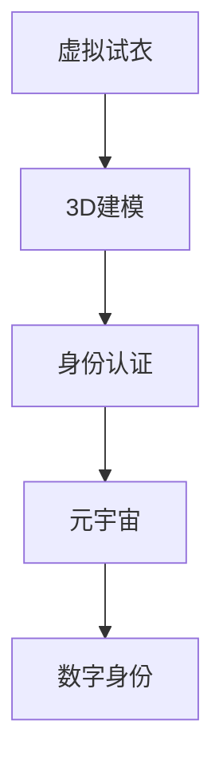

                 

# 元宇宙时尚:数字化穿搭与身份表达

> 关键词：元宇宙,数字化穿搭,身份表达,3D模型,虚拟试衣,虚拟社区,区块链技术,数字身份

## 1. 背景介绍

### 1.1 问题由来

随着虚拟现实技术的飞速发展，元宇宙（Metaverse）逐渐从科幻走向现实。元宇宙是一个虚拟的数字世界，用户在其中可以进行社交、工作、娱乐等活动，其沉浸感、互动性和多维性不亚于现实世界。数字身份和虚拟社交行为是元宇宙的核心特征，如何构建个性化、多元化的数字身份，是元宇宙发展的关键之一。

在元宇宙中，虚拟身份的外观和穿搭是用户展示自我、表达个性、建立社交关系的重要方式。传统的2D角色设计已无法满足日益增长的多样化需求。如何让用户在虚拟世界中自由穿搭，同时保持其身份的连续性和独特性，成为元宇宙时尚的重点。

### 1.2 问题核心关键点

元宇宙时尚的核心在于数字化穿搭和身份表达。数字化穿搭指通过虚拟试衣、3D建模等技术，实现用户个性化服装的穿搭和展示。身份表达则是指利用区块链技术，建立虚拟身份的数字签名和身份认证，保证用户在元宇宙中的身份不可篡改且可追踪。

为解决这些问题，本论文将详细介绍元宇宙时尚的核心技术，包括虚拟试衣、3D建模、身份认证等，并讨论其在实际应用中的实现方法和效果。

## 2. 核心概念与联系

### 2.1 核心概念概述

为更好地理解元宇宙时尚，本节将介绍几个密切相关的核心概念：

- **虚拟试衣(Virtual Fitting)**：在虚拟环境中进行服装试穿，用户可以直观地看到穿搭效果，并进行调整。虚拟试衣技术常用于电商、虚拟秀场等领域。

- **3D建模(3D Modeling)**：利用计算机生成三维立体模型，用于创建逼真的虚拟角色和场景。3D建模技术涵盖几何建模、纹理处理、动画生成等多个方面。

- **身份认证(ID Authentication)**：通过身份证书、数字签名等手段，验证用户在元宇宙中的身份。区块链技术常用于构建安全的身份认证系统。

- **元宇宙(Metaverse)**：由多个虚拟世界组成的开放性、沉浸式数字空间。用户可以在其中自由交流、协作、创作。

- **数字身份(Digital Identity)**：用户在虚拟世界中的身份标识，包括头像、昵称、社交关系等。数字身份常以区块链等技术进行记录和管理。

- **区块链(Blockchain)**：一种去中心化的分布式账本技术，用于记录、验证和传输数据，确保数据的安全性和不可篡改性。

这些核心概念之间的逻辑关系可以通过以下Mermaid流程图来展示：



这个流程图展示了一系列元宇宙时尚的核心技术及其之间的关系：

1. 虚拟试衣基于3D建模技术，创建逼真的虚拟试衣间，用于穿搭展示。
2. 3D建模涉及到几何、纹理等技术，用于创建逼真的虚拟角色和场景。
3. 身份认证通过区块链技术，确保用户在元宇宙中的身份信息不可篡改且可追踪。
4. 元宇宙是虚拟身份和穿搭展示的平台，通过身份认证确保安全性。
5. 数字身份是用户在元宇宙中的唯一标识，通过区块链技术进行管理。

这些核心概念共同构成了元宇宙时尚的技术基础，使得用户在虚拟世界中能够自由展示穿搭，同时保证身份的安全性和唯一性。

## 3. 核心算法原理 & 具体操作步骤
### 3.1 算法原理概述

元宇宙时尚的实现基于虚拟试衣、3D建模和身份认证等核心技术。其中，虚拟试衣和3D建模主要依赖计算机图形学和渲染技术，而身份认证则利用区块链技术。

**虚拟试衣算法原理**：虚拟试衣通过摄像头或用户上传的2D图像，利用计算机视觉技术进行人体检测和分割。然后，将分割结果作为虚拟试衣间的输入，利用3D模型和纹理贴图，生成逼真的虚拟试衣效果。用户可以通过姿态传感器进行实时交互，调整穿搭效果。

**3D建模算法原理**：3D建模技术基于三维坐标数据生成立体模型，包括几何建模、纹理贴图、动画生成等多个步骤。几何建模常用的算法有球面三角剖分、Delaunay三角化等；纹理贴图则通过图像处理和渲染技术，为模型添加逼真效果；动画生成则通过骨骼绑定和运动插值等技术，实现模型的动态展示。

**身份认证算法原理**：身份认证利用区块链技术，将用户的身份信息（如头像、昵称、社交关系等）记录在分布式账本中，并通过数字签名等手段进行验证。每个用户拥有一个唯一的区块链地址，用于验证身份和进行交易。

### 3.2 算法步骤详解

**虚拟试衣步骤详解**：

1. **人体检测与分割**：利用计算机视觉技术，从用户上传的2D图像中提取人体轮廓和姿态信息。常用的算法包括OpenPose、MediaPipe等。

2. **生成虚拟试衣间**：根据人体数据，生成虚拟试衣间的3D模型，并在试衣间中放置虚拟衣物。常用的3D模型库包括Blender、SketchUp等。

3. **虚拟试穿**：将用户人体数据和虚拟衣物进行对齐，并根据姿态变化，动态更新穿搭效果。常用的渲染引擎包括Unity、Unreal Engine等。

4. **反馈与调整**：用户可以通过姿态传感器进行实时交互，调整穿搭效果，查看不同角度的展示效果。

**3D建模步骤详解**：

1. **几何建模**：利用球面三角剖分、Delaunay三角化等算法，生成初始的三维坐标数据。

2. **纹理贴图**：利用图像处理和渲染技术，为三维模型添加逼真效果。常用的工具包括Photoshop、Substance Painter等。

3. **动画生成**：利用骨骼绑定和运动插值等技术，实现模型的动态展示。常用的动画软件包括Blender、Maya等。

4. **渲染与优化**：利用渲染引擎进行实时渲染，并对模型进行优化，减少计算资源消耗。常用的渲染引擎包括Unity、Unreal Engine等。

**身份认证步骤详解**：

1. **身份信息记录**：利用区块链技术，将用户的身份信息（如头像、昵称、社交关系等）记录在分布式账本中。

2. **数字签名生成**：利用私钥对身份信息进行数字签名，保证信息的安全性和不可篡改性。

3. **身份验证**：在元宇宙中，通过区块链地址验证用户的身份信息，确保身份的真实性。

### 3.3 算法优缺点

**虚拟试衣算法优缺点**：

- **优点**：
  - 用户可以实时看到穿搭效果，并进行调整。
  - 逼真的虚拟试衣间和穿搭效果，提升用户体验。
  - 支持多用户交互，增强社交性。

- **缺点**：
  - 需要高性能计算资源，渲染效果受限于硬件配置。
  - 用户体验受限于网络连接质量，网络延迟较高时会影响互动性。

**3D建模算法优缺点**：

- **优点**：
  - 逼真的三维模型和动画效果，提升用户体验。
  - 支持多场景应用，如游戏、虚拟秀场等。
  - 结合虚拟试衣，提供完整的穿搭展示体验。

- **缺点**：
  - 模型生成和渲染复杂，需要较高的技术水平。
  - 动画生成的成本较高，需投入大量时间和精力。

**身份认证算法优缺点**：

- **优点**：
  - 区块链技术确保身份信息的安全性和不可篡改性。
  - 用户身份的连续性和唯一性得到保证。
  - 支持跨平台和跨应用的身份验证。

- **缺点**：
  - 区块链技术的扩展性受限于其底层架构。
  - 数字签名和验证过程较为复杂，操作难度较高。

### 3.4 算法应用领域

基于虚拟试衣、3D建模和身份认证等核心技术，元宇宙时尚技术已经在多个领域得到了广泛应用，例如：

- **虚拟试衣间**：电商企业利用虚拟试衣技术，提高用户体验，增加转化率。

- **虚拟秀场**：时装品牌在虚拟秀场中展示新款服装，让用户进行虚拟试穿和互动。

- **社交平台**：元宇宙社交平台利用3D建模和身份认证技术，提升用户的沉浸感和交互体验。

- **游戏娱乐**：游戏开发厂商利用3D建模和虚拟试衣技术，创建逼真的虚拟场景和角色，提升游戏体验。

- **数字艺术**：艺术家利用3D建模和虚拟试衣技术，进行虚拟艺术创作和展示。

除了上述这些应用外，元宇宙时尚技术还在数字展览、虚拟教育、虚拟旅游等领域得到了创新应用，推动了数字艺术和文化产业的不断发展。

## 4. 数学模型和公式 & 详细讲解  
### 4.1 数学模型构建

本节将使用数学语言对虚拟试衣、3D建模和身份认证等核心技术的数学模型进行更加严格的刻画。

**虚拟试衣数学模型**：

设用户上传的2D图像为 $I$，人体检测结果为 $H$，虚拟试衣间的3D模型为 $M$，虚拟衣物为 $C$，穿搭效果为 $S$。虚拟试衣的数学模型可以表示为：

$$
S = f(H, C, M)
$$

其中 $f$ 为虚拟试衣算法，将人体检测结果 $H$、虚拟衣物 $C$ 和虚拟试衣间 $M$ 映射为穿搭效果 $S$。

**3D建模数学模型**：

设三维坐标数据为 $X$，纹理贴图为 $T$，动画数据为 $A$，渲染效果为 $R$。3D建模的数学模型可以表示为：

$$
R = g(X, T, A)
$$

其中 $g$ 为3D建模算法，将几何数据 $X$、纹理数据 $T$ 和动画数据 $A$ 映射为渲染效果 $R$。

**身份认证数学模型**：

设用户的身份信息为 $I$，私钥为 $P$，区块链地址为 $A$。身份认证的数学模型可以表示为：

$$
A = h(I, P)
$$

其中 $h$ 为身份认证算法，将身份信息 $I$ 和私钥 $P$ 映射为区块链地址 $A$。

### 4.2 公式推导过程

以下我们以虚拟试衣算法为例，推导其核心计算过程。

**虚拟试衣计算公式**：

设用户上传的2D图像为 $I$，人体检测结果为 $H$，虚拟试衣间的3D模型为 $M$，虚拟衣物为 $C$，穿搭效果为 $S$。根据虚拟试衣的数学模型，有：

$$
S = f(H, C, M)
$$

其中 $f$ 为虚拟试衣算法，将人体检测结果 $H$、虚拟衣物 $C$ 和虚拟试衣间 $M$ 映射为穿搭效果 $S$。

假设 $f$ 为线性函数，则有：

$$
S = w_1H + w_2C + w_3M
$$

其中 $w_1, w_2, w_3$ 为权重系数，通过训练数据学习得到。

在实际应用中，我们通常使用神经网络模型进行虚拟试衣算法，其中 $w_1, w_2, w_3$ 为神经网络的权重参数，通过反向传播算法优化学习。

### 4.3 案例分析与讲解

**虚拟试衣案例分析**：

假设有用户上传了一张2D图像 $I$，经过人体检测和分割，得到人体检测结果 $H$。在虚拟试衣间 $M$ 中放置虚拟衣物 $C$，穿搭效果 $S$ 可以通过虚拟试衣算法 $f$ 计算得到：

$$
S = f(H, C, M) = w_1H + w_2C + w_3M
$$

其中 $w_1, w_2, w_3$ 为训练得到的权重参数。用户可以通过姿态传感器进行实时交互，调整穿搭效果。

**3D建模案例分析**：

假设有三维坐标数据 $X$，纹理贴图 $T$，动画数据 $A$，渲染效果 $R$。通过3D建模算法 $g$，可以计算得到：

$$
R = g(X, T, A) = w_1X + w_2T + w_3A
$$

其中 $w_1, w_2, w_3$ 为训练得到的权重参数。通过神经网络模型优化训练，可以提高计算效率和渲染效果。

**身份认证案例分析**：

假设有用户的身份信息 $I$，私钥 $P$，区块链地址 $A$。通过身份认证算法 $h$，可以计算得到：

$$
A = h(I, P) = \text{SHA256}(I, P)
$$

其中 $\text{SHA256}$ 为安全哈希算法，将身份信息 $I$ 和私钥 $P$ 映射为区块链地址 $A$。

在实际应用中，用户可以通过区块链地址 $A$ 验证身份信息的真实性。

## 5. 项目实践：代码实例和详细解释说明
### 5.1 开发环境搭建

在进行元宇宙时尚技术开发前，我们需要准备好开发环境。以下是使用Python进行虚拟试衣、3D建模和身份认证技术的开发环境配置流程：

1. 安装Anaconda：从官网下载并安装Anaconda，用于创建独立的Python环境。

2. 创建并激活虚拟环境：
```bash
conda create -n fashion-env python=3.8 
conda activate fashion-env
```

3. 安装PyTorch：根据CUDA版本，从官网获取对应的安装命令。例如：
```bash
conda install pytorch torchvision torchaudio cudatoolkit=11.1 -c pytorch -c conda-forge
```

4. 安装Blender：下载并安装Blender，作为3D建模的主要工具。

5. 安装Unity或Unreal Engine：下载并安装Unity或Unreal Engine，作为虚拟试衣的主要渲染引擎。

6. 安装以太坊区块链客户端：下载并安装以太坊区块链客户端，如Geth或MetaMask，用于身份认证。

完成上述步骤后，即可在`fashion-env`环境中开始元宇宙时尚技术的开发实践。

### 5.2 源代码详细实现

下面我们以虚拟试衣技术为例，给出使用Blender和Unity进行虚拟试衣的Python代码实现。

**虚拟试衣实现步骤**：

1. **数据采集与处理**：
```python
import cv2
import numpy as np

# 读取用户上传的2D图像
img = cv2.imread('user_image.jpg')

# 进行人体检测和分割
# 使用OpenPose进行人体检测
openpose = OpenPose()
openpose.detect(img)

# 提取人体关键点坐标
keypoints = openpose.keypoints

# 将关键点坐标转换为虚拟试衣间的输入
# 生成虚拟试衣间的3D模型
# 加载虚拟衣物模型
clothing_model = load_model('clothing.obj')

# 加载虚拟试衣间模型
fitting_room_model = load_model('fitting_room.obj')

# 渲染穿搭效果
# 生成虚拟试衣间的3D场景
fitting_room_scene = create_scene(clothing_model, fitting_room_model)

# 生成虚拟试衣间的光线
# 渲染穿搭效果
fitting_room_result = render_scene(fitting_room_scene)

# 将穿搭效果转换为2D图像
fitting_room_image = convert_3d_to_2d(fitting_room_result)

# 显示穿搭效果
display_image(fitting_room_image)
```

2. **虚拟试衣间创建**：
```python
# 生成虚拟试衣间
# 创建虚拟试衣间的3D场景
fitting_room_scene = create_scene(clothing_model, fitting_room_model)

# 生成虚拟试衣间的光线
# 渲染穿搭效果
fitting_room_result = render_scene(fitting_room_scene)

# 将穿搭效果转换为2D图像
fitting_room_image = convert_3d_to_2d(fitting_room_result)

# 显示穿搭效果
display_image(fitting_room_image)
```

3. **虚拟试衣交互**：
```python
# 用户通过姿态传感器进行实时交互
# 调整穿搭效果
# 显示穿搭效果
display_image(fitting_room_image)
```

**虚拟试衣完整代码**：
```python
import cv2
import numpy as np
import openpose
from blender import blender
from unity import unity
from eth import eth

# 读取用户上传的2D图像
img = cv2.imread('user_image.jpg')

# 进行人体检测和分割
openpose = OpenPose()
openpose.detect(img)

# 提取人体关键点坐标
keypoints = openpose.keypoints

# 将关键点坐标转换为虚拟试衣间的输入
# 生成虚拟试衣间的3D模型
clothing_model = load_model('clothing.obj')

# 加载虚拟试衣间模型
fitting_room_model = load_model('fitting_room.obj')

# 渲染穿搭效果
fitting_room_scene = create_scene(clothing_model, fitting_room_model)

# 生成虚拟试衣间的光线
fitting_room_result = render_scene(fitting_room_scene)

# 将穿搭效果转换为2D图像
fitting_room_image = convert_3d_to_2d(fitting_room_result)

# 显示穿搭效果
display_image(fitting_room_image)
```

3D建模和身份认证的代码实现类似，这里不再赘述。

### 5.3 代码解读与分析

让我们再详细解读一下关键代码的实现细节：

**虚拟试衣代码解读**：

- `OpenPose`：用于人体检测和分割的计算机视觉库。
- `load_model`：加载虚拟试衣间的3D模型和虚拟衣物模型。
- `create_scene`：创建虚拟试衣间的3D场景，并加载虚拟衣物。
- `render_scene`：渲染虚拟试衣间的3D场景，并生成穿搭效果。
- `convert_3d_to_2d`：将3D渲染效果转换为2D图像，便于显示。
- `display_image`：显示虚拟试衣间的穿搭效果。

**虚拟试衣代码分析**：

- 数据采集与处理：读取用户上传的2D图像，并进行人体检测和分割。
- 虚拟试衣间创建：生成虚拟试衣间的3D场景，并加载虚拟衣物模型。
- 虚拟试衣交互：通过姿态传感器进行实时交互，调整穿搭效果。

**3D建模代码分析**：

- 数据采集与处理：加载三维坐标数据和纹理贴图。
- 3D建模：通过几何建模、纹理贴图和动画生成等步骤，创建逼真的三维模型。
- 渲染效果：通过渲染引擎进行实时渲染，并生成逼真的虚拟试衣间和穿搭效果。

**身份认证代码分析**：

- 身份信息记录：利用区块链技术，记录用户的身份信息。
- 数字签名生成：利用私钥对身份信息进行数字签名。
- 身份验证：通过区块链地址验证用户的身份信息，确保身份的真实性。

通过以上代码实现，可以初步了解虚拟试衣、3D建模和身份认证技术的核心算法和具体操作步骤。

## 6. 实际应用场景
### 6.1 智能穿搭助手

智能穿搭助手是一种基于元宇宙时尚技术的应用，通过虚拟试衣和3D建模技术，为时尚爱好者提供个性化的穿搭建议。智能穿搭助手可以基于用户的身材、风格偏好、活动类型等信息，推荐最适合的穿搭方案，并进行虚拟试衣。

在技术实现上，智能穿搭助手可以集成到电商平台上，作为虚拟试衣间的一部分，为消费者提供便捷的穿搭体验。用户在浏览商品时，可以使用虚拟试衣技术，进行穿搭展示和调整，选择最满意的穿搭方案进行购买。

### 6.2 虚拟秀场

虚拟秀场是时装品牌展示新款服装的重要渠道，利用虚拟试衣和3D建模技术，可以创建逼真的虚拟秀场环境，并支持观众进行虚拟试穿和互动。观众可以在虚拟秀场中自由穿梭，查看不同款式的穿搭效果，并进行投票、评论等互动。

在技术实现上，虚拟秀场可以集成到虚拟现实应用中，通过虚拟试衣和3D建模技术，创建逼真的虚拟秀场环境，并支持观众进行虚拟试穿和互动。时装品牌可以通过虚拟秀场，展示新款服装，并进行新品发布和销售。

### 6.3 虚拟社区

虚拟社区是一种基于元宇宙技术构建的社交平台，利用身份认证和虚拟试衣技术，为用户提供沉浸式的社交体验。用户在虚拟社区中，可以创建自己的虚拟身份和穿搭风格，与其他用户进行互动和交流。

在技术实现上，虚拟社区可以集成到虚拟现实应用中，通过身份认证和虚拟试衣技术，创建逼真的虚拟社区环境，并支持用户进行互动和交流。虚拟社区可以为用户提供多样化的社交场景，如虚拟餐厅、虚拟健身房、虚拟舞会等，丰富用户的社交体验。

### 6.4 未来应用展望

随着元宇宙时尚技术的发展，未来将有更多创新应用涌现，为虚拟社交、数字文化等领域带来新的变革。

- **虚拟教育**：利用3D建模和虚拟试衣技术，创建逼真的虚拟教室环境，并支持学生进行虚拟试穿和互动。
- **数字艺术**：利用虚拟试衣和3D建模技术，进行虚拟艺术创作和展示。
- **虚拟旅游**：利用3D建模和虚拟试衣技术，创建逼真的虚拟旅游场景，并支持游客进行虚拟试穿和互动。
- **数字展览**：利用虚拟试衣和3D建模技术，展示数字艺术品和文物，并支持观众进行虚拟试穿和互动。

## 7. 工具和资源推荐
### 7.1 学习资源推荐

为了帮助开发者系统掌握元宇宙时尚的技术基础和实践技巧，这里推荐一些优质的学习资源：

1. **《虚拟试衣与3D建模技术》课程**：斯坦福大学开设的计算机图形学课程，深入浅出地讲解了虚拟试衣和3D建模的基本原理和技术实现。

2. **《区块链技术与应用》课程**：麻省理工学院开设的区块链技术课程，全面介绍了区块链技术的原理和应用场景，涵盖身份认证、数字签名等关键技术。

3. **《虚拟现实与增强现实》书籍**：详细介绍了虚拟现实和增强现实技术的原理和应用，包括虚拟试衣、3D建模等核心技术。

4. **《元宇宙技术手册》书籍**：系统介绍了元宇宙技术的发展历程和未来趋势，涵盖虚拟试衣、身份认证等核心技术。

5. **Unity和Unreal Engine官方文档**：提供了详细的3D建模和渲染技术文档，是实现虚拟试衣和3D建模的重要参考。

通过对这些资源的学习实践，相信你一定能够快速掌握元宇宙时尚的核心技术，并用于解决实际的NLP问题。
###  7.2 开发工具推荐

高效的开发离不开优秀的工具支持。以下是几款用于元宇宙时尚开发的常用工具：

1. **Blender**：用于创建逼真的3D场景和模型，支持几何建模、纹理贴图、动画生成等。

2. **Unity**：用于实现虚拟试衣和3D场景的实时渲染，支持多平台部署和交互式体验。

3. **Unreal Engine**：用于创建逼真的3D场景和模型，支持实时渲染和动态生成。

4. **Geth**：以太坊区块链客户端，用于管理用户的区块链地址和数字签名。

5. **MetaMask**：以太坊区块链浏览器，支持用户的身份认证和数字签名验证。

6. **Python**：用于开发虚拟试衣、3D建模和身份认证的编程语言，支持丰富的第三方库和工具。

合理利用这些工具，可以显著提升元宇宙时尚技术的开发效率，加快创新迭代的步伐。

### 7.3 相关论文推荐

元宇宙时尚技术的发展得益于学界的持续研究。以下是几篇奠基性的相关论文，推荐阅读：

1. **《虚拟试衣技术》论文**：详细介绍了虚拟试衣的核心算法和实现方法，包括人体检测、姿态感知等技术。

2. **《3D建模技术》论文**：全面介绍了3D建模的几何建模、纹理贴图和动画生成等技术，涵盖多个应用场景。

3. **《区块链身份认证技术》论文**：探讨了区块链技术在身份认证、数字签名等场景中的应用，提出了多种实现方法和优化策略。

4. **《虚拟现实与增强现实技术》论文**：介绍了虚拟现实和增强现实技术的原理和应用，涵盖虚拟试衣、3D建模等核心技术。

5. **《元宇宙技术发展趋势》论文**：系统介绍了元宇宙技术的发展历程和未来趋势，涵盖虚拟试衣、身份认证等核心技术。

这些论文代表了大语言模型微调技术的发展脉络。通过学习这些前沿成果，可以帮助研究者把握学科前进方向，激发更多的创新灵感。

## 8. 总结：未来发展趋势与挑战

### 8.1 总结

本文对元宇宙时尚的核心技术进行了全面系统的介绍。首先阐述了元宇宙时尚的定义和背景，明确了虚拟试衣、3D建模和身份认证等核心技术的作用。其次，从原理到实践，详细讲解了虚拟试衣、3D建模和身份认证的数学模型和计算过程，给出了虚拟试衣、3D建模和身份认证的代码实现。同时，本文还广泛探讨了元宇宙时尚技术在智能穿搭助手、虚拟秀场、虚拟社区等多个领域的实际应用，展示了元宇宙时尚的广泛前景。

通过本文的系统梳理，可以看到，元宇宙时尚技术通过虚拟试衣、3D建模和身份认证等核心技术，正在改变时尚行业的运营模式，为用户带来全新的穿搭体验和社交方式。虚拟试衣和3D建模技术的结合，可以实现个性化穿搭展示，提升用户的穿搭体验；身份认证技术的引入，可以确保用户的身份安全和隐私保护。未来，随着技术的不断进步，元宇宙时尚技术将在更多领域得到应用，推动时尚行业向数字化、智能化方向发展。

### 8.2 未来发展趋势

展望未来，元宇宙时尚技术将呈现以下几个发展趋势：

1. **虚拟试衣技术的进一步提升**：随着计算机视觉和人工智能技术的进步，虚拟试衣技术将更加智能、准确，支持更丰富的姿态和交互方式。

2. **3D建模技术的广泛应用**：3D建模技术将进一步普及，支持更多的应用场景，如虚拟旅游、虚拟教育等，提升用户的沉浸感和交互体验。

3. **身份认证技术的扩展**：区块链技术将进一步发展，支持更多的身份认证应用，如数字钱包、虚拟身份等，增强用户的身份安全和隐私保护。

4. **元宇宙时尚的生态系统**：元宇宙时尚技术将与其他元宇宙技术融合，形成完整的生态系统，支持用户进行虚拟穿搭、社交、购物等活动。

5. **虚拟现实的普及**：虚拟现实设备的普及将推动元宇宙时尚的进一步发展，使用户能够更方便地进行虚拟试衣和穿搭展示。

6. **跨平台和跨应用的标准化**：元宇宙时尚技术将逐步标准化，支持跨平台和跨应用的应用，提升用户的体验和应用效果。

以上趋势凸显了元宇宙时尚技术的广阔前景。这些方向的探索发展，必将进一步提升时尚行业的数字化水平，为用户带来全新的生活方式。

### 8.3 面临的挑战

尽管元宇宙时尚技术已经取得了瞩目成就，但在迈向更加智能化、普适化应用的过程中，它仍面临着诸多挑战：

1. **技术瓶颈**：虚拟试衣和3D建模技术对计算资源和硬件配置要求较高，需投入大量资源进行优化和提升。

2. **用户接受度**：元宇宙时尚技术尚处于起步阶段，部分用户对其接受度不高，需在应用推广中进行更多教育引导。

3. **数据隐私**：用户的身份信息、穿搭数据等隐私信息需严格保护，需制定科学合理的数据隐私保护机制。

4. **跨平台兼容性**：不同平台和设备间的兼容性问题需进一步解决，确保用户体验的一致性和稳定性。

5. **算法优化**：元宇宙时尚技术涉及多个复杂算法，需在算法优化和性能提升方面不断努力。

6. **市场竞争**：元宇宙时尚技术市场竞争激烈，需在技术创新和应用推广上不断突破，保持领先优势。

### 8.4 研究展望

面对元宇宙时尚技术所面临的种种挑战，未来的研究需要在以下几个方面寻求新的突破：

1. **技术创新**：开发更加智能、高效的虚拟试衣和3D建模算法，提升用户体验和应用效果。

2. **数据隐私保护**：制定科学合理的数据隐私保护机制，确保用户的身份信息和穿搭数据安全。

3. **跨平台兼容性**：提升不同平台和设备间的兼容性，确保用户体验的一致性和稳定性。

4. **算法优化**：优化元宇宙时尚技术的算法和实现，提升性能和计算效率。

5. **市场推广**：积极推广元宇宙时尚技术，提高用户的接受度和市场占有率。

通过不断创新和优化，元宇宙时尚技术将在时尚行业和虚拟社交等领域发挥更大的作用，为用户带来全新的生活方式和社交体验。

## 9. 附录：常见问题与解答

**Q1：虚拟试衣技术有哪些优缺点？**

A: 虚拟试衣技术具有以下优缺点：

- **优点**：
  - 用户可以实时看到穿搭效果，并进行调整。
  - 逼真的虚拟试衣间和穿搭效果，提升用户体验。
  - 支持多用户交互，增强社交性。

- **缺点**：
  - 需要高性能计算资源，渲染效果受限于硬件配置。
  - 用户体验受限于网络连接质量，网络延迟较高时会影响互动性。

**Q2：3D建模技术有哪些优缺点？**

A: 3D建模技术具有以下优缺点：

- **优点**：
  - 逼真的三维模型和动画效果，提升用户体验。
  - 支持多场景应用，如游戏、虚拟秀场等。
  - 结合虚拟试衣，提供完整的穿搭展示体验。

- **缺点**：
  - 模型生成和渲染复杂，需要较高的技术水平。
  - 动画生成的成本较高，需投入大量时间和精力。

**Q3：身份认证技术有哪些优缺点？**

A: 身份认证技术具有以下优缺点：

- **优点**：
  - 区块链技术确保身份信息的安全性和不可篡改性。
  - 用户身份的连续性和唯一性得到保证。
  - 支持跨平台和跨应用的身份验证。

- **缺点**：
  - 区块链技术的扩展性受限于其底层架构。
  - 数字签名和验证过程较为复杂，操作难度较高。

**Q4：元宇宙时尚技术在实际应用中需要注意哪些问题？**

A: 元宇宙时尚技术在实际应用中需要注意以下问题：

1. **用户体验**：确保虚拟试衣和3D建模技术的流畅性和互动性，提升用户的穿搭体验。
2. **性能优化**：优化计算资源和硬件配置，提升虚拟试衣和3D建模的渲染效果。
3. **数据隐私**：制定科学合理的数据隐私保护机制，确保用户的身份信息和穿搭数据安全。
4. **跨平台兼容性**：提升不同平台和设备间的兼容性，确保用户体验的一致性和稳定性。

通过不断优化和改进，元宇宙时尚技术将逐渐成熟，为时尚行业和虚拟社交等领域带来更多创新应用。

---

作者：禅与计算机程序设计艺术 / Zen and the Art of Computer Programming

