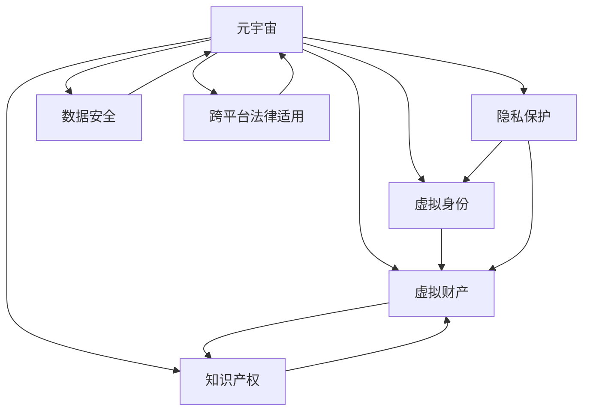

                 

# 元宇宙法律体系:虚拟世界的规则构建

> 关键词：元宇宙,虚拟世界,法律体系,规则构建,隐私保护,知识产权,数据安全

## 1. 背景介绍

### 1.1 问题由来

随着科技的迅猛发展，元宇宙（Metaverse）正在迅速成为现实。从区块链到虚拟现实（VR），从数字孪生到人工智能（AI），各种新兴技术让这个虚拟世界逐渐变成了一个真实存在。然而，伴随元宇宙的火热，也引发了一系列法律问题。

从虚拟土地的所有权到数字身份的合法性，从虚拟货币的监管到虚拟商品的买卖，一系列新兴问题亟待解决。如何构建一个公平、透明、安全且符合现实法律体系的元宇宙，成为了社会各界关注的热点。

### 1.2 问题核心关键点

元宇宙法律体系构建的核心关键点在于如何平衡技术创新与法律监管，如何在虚拟空间中复制现实世界的法律逻辑，如何保障元宇宙用户的基本权利与利益，以及如何确保虚拟资产的合法性。

具体而言，元宇宙法律体系需要考虑的问题包括但不限于：
- 虚拟身份与现实身份的映射问题
- 虚拟财产的法律地位与交易方式
- 隐私保护的边界与实施手段
- 知识产权的归属与保护机制
- 数据安全与隐私保护的合规性
- 跨平台的法律适用与协同机制

## 2. 核心概念与联系

### 2.1 核心概念概述

为更好地理解元宇宙法律体系，本节将介绍几个密切相关的核心概念：

- **元宇宙（Metaverse）**：由多个虚拟世界组成的多维数字空间，用户可以通过各种设备进入其中进行社交、工作、学习等活动。
- **虚拟身份（Virtual Identity）**：用户在元宇宙中的数字化身份，可以进行各种虚拟活动。
- **虚拟财产（Virtual Property）**：用户在元宇宙中拥有的各种虚拟资产，如虚拟土地、虚拟货币、虚拟物品等。
- **隐私保护（Privacy Protection）**：保障用户在元宇宙中的数据不被泄露，保持用户信息的安全性。
- **知识产权（Intellectual Property Rights）**：对虚拟世界的创意内容、程序代码等进行合法保护。
- **数据安全（Data Security）**：保障元宇宙中的数据传输与存储的安全性，防止黑客攻击和数据泄露。
- **跨平台法律适用（Cross-Platform Legal Applicability）**：不同平台间的法律规则如何协同，以确保用户权益得到统一保护。

这些概念之间的逻辑关系可以通过以下Mermaid流程图来展示：



这个流程图展示了大语言模型与元宇宙法律体系之间的核心概念关系：

1. 元宇宙是虚拟身份、虚拟财产、隐私保护、知识产权、数据安全和跨平台法律适用等概念的承载空间。
2. 虚拟身份、虚拟财产等作为元宇宙的主要组成部分，与隐私保护、知识产权和数据安全密切相关。
3. 跨平台法律适用旨在确保这些概念在不同平台间的统一性和一致性。

## 3. 核心算法原理 & 具体操作步骤
### 3.1 算法原理概述

元宇宙法律体系的构建，本质上是一个多维度的法律框架搭建过程。其核心思想是：在充分考虑技术特点和用户需求的基础上，构建一个基于现实法律体系的虚拟空间规则，确保用户在元宇宙中的权益得到保护。

具体来说，元宇宙法律体系的构建包括以下几个关键步骤：

1. **确立虚拟身份的法律地位**：明确虚拟身份与现实身份之间的映射关系，确定其在法律上的主体地位。
2. **界定虚拟财产的合法性**：确定虚拟财产在现实法律体系中的地位，制定交易和使用的规则。
3. **制定隐私保护法规**：基于现实法律，制定隐私保护的边界和实施措施，确保用户数据的安全。
4. **确立知识产权保护机制**：对元宇宙中的原创内容进行法律保护，防止侵权和盗用。
5. **制定数据安全法规**：制定数据加密、传输安全和存储安全的标准和规范。
6. **实现跨平台法律适用**：确保不同平台间的法律规则统一和协同，避免法律冲突。

### 3.2 算法步骤详解

以下是元宇宙法律体系构建的具体步骤：

**Step 1: 数据收集与分析**

- 收集元宇宙各平台的法律法规和政策文件，进行分类和整理。
- 分析用户的真实身份和虚拟身份映射情况，收集用户的数据使用和行为记录。
- 收集元宇宙中的虚拟财产种类及交易记录，明确虚拟财产的法律属性。

**Step 2: 法律框架构建**

- 根据数据收集和分析结果，制定元宇宙虚拟身份的法律法规，明确虚拟身份的法定权利和义务。
- 界定虚拟财产的合法性，制定交易、保管和使用规则，确保虚拟财产的法律地位。
- 制定隐私保护法规，明确数据收集、使用和存储的边界，确保用户隐私不被侵犯。
- 确立知识产权保护机制，对原创内容进行法律保护，打击侵权行为。
- 制定数据安全标准，确保数据加密、传输和存储的安全性。

**Step 3: 法规实施与监督**

- 将制定好的法律法规落实到具体平台，建立完善的法律执行机制。
- 设立专门的监管机构，监督法规的实施，及时处理违规行为。
- 建立用户投诉和举报机制，保障用户合法权益。

**Step 4: 法规优化与迭代**

- 根据用户反馈和平台发展情况，定期评估和优化法律法规，确保其适用性和时效性。
- 跟踪技术发展，不断更新和完善法律框架，适应新的技术挑战。

### 3.3 算法优缺点

元宇宙法律体系的构建具有以下优点：
- 保障用户权益：通过明确虚拟身份和虚拟财产的法律地位，保护用户在元宇宙中的合法权益。
- 推动技术创新：确保技术发展在法律框架内进行，避免技术滥用。
- 增强平台信任：建立统一的法律规则，增强用户对元宇宙平台的信任度。
- 保障数据安全：制定严格的数据安全标准，防止数据泄露和滥用。

同时，该方法也存在一些局限性：
- 技术复杂：法律框架需要不断更新，以适应技术发展，增加了复杂性。
- 法规协调：不同平台间的法律适用需要协调一致，存在一定难度。
- 法规执行：法律实施需要技术手段支持，存在监管和执行难题。
- 用户教育：需要向用户普及法律知识，确保用户理解并遵守相关规定。

### 3.4 算法应用领域

元宇宙法律体系构建技术已经在多个领域得到了应用，包括但不限于：

- 虚拟世界身份认证：通过元宇宙身份认证技术，验证用户的真实身份，确保其在虚拟世界的行为合法。
- 虚拟财产保护：建立虚拟财产交易平台，制定规则，保护用户虚拟财产的法律地位。
- 数据隐私保护：在元宇宙中，通过数据加密、匿名化等手段，保护用户数据隐私。
- 知识产权保护：对元宇宙中的原创内容进行法律保护，打击侵权行为。
- 数字货币监管：制定虚拟货币的发行、交易和使用规则，确保其合法性。
- 虚拟平台合规：确保各元宇宙平台遵守统一的法律法规，避免法律冲突。

## 4. 数学模型和公式 & 详细讲解 & 举例说明

### 4.1 数学模型构建

元宇宙法律体系的构建，是一个多目标优化问题，需要平衡用户权益、平台发展和技术创新的关系。其数学模型可以表示为：

$$
\min_{P, T, S, K, D} f(P, T, S, K, D) \\
s.t. \begin{cases}
P_{\text{valid}} \geq p_{\text{threshold}} \\
T_{\text{legal}} \geq t_{\text{threshold}} \\
S_{\text{secure}} \geq s_{\text{threshold}} \\
K_{\text{protected}} \geq k_{\text{threshold}} \\
D_{\text{enforced}} \geq d_{\text{threshold}}
\end{cases}
$$

其中，$P$ 代表用户权益保护，$T$ 代表技术创新，$S$ 代表数据安全，$K$ 代表知识产权保护，$D$ 代表跨平台法律适用。$f$ 为优化目标函数，$p_{\text{threshold}}$ 和 $t_{\text{threshold}}$ 等为一组预设的阈值，确保各项指标达到预期。

### 4.2 公式推导过程

为了更好地解释元宇宙法律体系构建的数学模型，我们以虚拟身份的合法性界定为例，推导其数学表达：

假设用户在现实世界中有 $I$ 个身份属性，包括姓名、年龄、地址等。在元宇宙中，这些属性映射为 $I'$ 个虚拟身份属性，如昵称、虚拟年龄、虚拟地址等。其数学表达如下：

$$
I' = f(I, \theta)
$$

其中 $f$ 为一个映射函数，$\theta$ 为一组映射参数。

在现实法律体系中，身份属性 $I$ 可以合法地证明一个真实身份。而在元宇宙中，为了确保虚拟身份的合法性，需要确保 $I'$ 能够真实反映用户 $I$ 的属性。因此，我们引入映射参数 $\theta$，通过 $f$ 函数将 $I$ 映射到 $I'$。

映射函数 $f$ 的表达形式可以多样，如线性映射、非线性映射等。

### 4.3 案例分析与讲解

以虚拟身份的合法性界定为例，我们可以进一步分析其应用场景。

假设某用户在现实世界中有合法身份证 $I = (name, age, address)$。在元宇宙中，其虚拟身份 $I' = (nickname, virtual\_age, virtual\_address)$。为了确保 $I'$ 合法，需要验证 $I'$ 是否满足现实身份 $I$ 的属性，即 $f(I, \theta) = I'$。

具体验证过程如下：
1. 收集 $I$ 的属性，通过人工智能技术生成 $I'$。
2. 将 $I'$ 与现实身份 $I$ 的属性进行比对，判断是否一致。
3. 如果不一致，生成错误提示，拒绝生成虚拟身份。
4. 如果一致，生成虚拟身份，并记录验证信息。

这个案例展示了如何在元宇宙中通过映射函数，确保虚拟身份的合法性。类似地，其他方面的法律体系构建也可以采用类似方法。

## 5. 项目实践：代码实例和详细解释说明
### 5.1 开发环境搭建

在进行元宇宙法律体系构建的实践前，我们需要准备好开发环境。以下是使用Python进行开发的环境配置流程：

1. 安装Anaconda：从官网下载并安装Anaconda，用于创建独立的Python环境。

2. 创建并激活虚拟环境：
```bash
conda create -n metaverse-env python=3.8 
conda activate metaverse-env
```

3. 安装必要的Python包：
```bash
pip install torch numpy matplotlib
```

4. 安装数据分析工具：
```bash
pip install pandas scikit-learn
```

5. 安装机器学习库：
```bash
pip install scikit-learn
```

完成上述步骤后，即可在`metaverse-env`环境中开始元宇宙法律体系构建的开发实践。

### 5.2 源代码详细实现

以下是元宇宙法律体系构建的代码实现示例，包括用户身份验证、虚拟财产保护和数据隐私保护三个关键模块。

**用户身份验证模块**

```python
import pandas as pd
from sklearn.preprocessing import OneHotEncoder

# 定义用户身份属性
user_attributes = ['name', 'age', 'address']

# 读取用户数据
df = pd.read_csv('user_data.csv')

# 将用户数据转换为虚拟身份
def map_user_identity(user, attributes):
    # 创建虚拟身份
    virtual_identity = {}
    for attr in attributes:
        virtual_identity[attr] = user[attr] + '_v'
    return virtual_identity

# 验证虚拟身份合法性
def validate_virtual_identity(virtual_identity, user_attributes):
    # 创建真实身份属性矩阵
    real_identity_matrix = pd.DataFrame(df[user_attributes])
    # 创建虚拟身份属性矩阵
    virtual_identity_matrix = pd.DataFrame(virtual_identity)
    # 使用OneHotEncoder进行编码
    encoder = OneHotEncoder(sparse=False)
    real_identity_encoded = encoder.fit_transform(real_identity_matrix)
    virtual_identity_encoded = encoder.transform(virtual_identity_matrix)
    # 比较真实身份和虚拟身份
    if real_identity_encoded == virtual_identity_encoded:
        return True
    else:
        return False

# 用户身份验证
user = {'name': 'Alice', 'age': 30, 'address': 'Beijing'}
virtual_identity = map_user_identity(user, user_attributes)
if validate_virtual_identity(virtual_identity, user_attributes):
    print('虚拟身份合法')
else:
    print('虚拟身份非法')
```

**虚拟财产保护模块**

```python
import pandas as pd
from sklearn.ensemble import RandomForestClassifier

# 定义虚拟财产属性
virtual_property_attributes = ['price', 'type', 'location']

# 读取虚拟财产数据
df = pd.read_csv('virtual_property.csv')

# 训练虚拟财产保护模型
def train_property_protection_model(data):
    # 创建特征和标签
    X = data[virtual_property_attributes]
    y = data['is_legal']
    # 使用随机森林分类器训练模型
    model = RandomForestClassifier()
    model.fit(X, y)
    return model

# 预测虚拟财产合法性
def predict_virtual_property_legality(virtual_property, model):
    # 创建虚拟财产属性矩阵
    virtual_property_matrix = pd.DataFrame(virtual_property)
    # 使用训练好的模型预测虚拟财产合法性
    prediction = model.predict(virtual_property_matrix)
    return prediction

# 虚拟财产保护
virtual_property = {'price': 500, 'type': 'land', 'location': 'Xinglong'}
model = train_property_protection_model(df)
if predict_virtual_property_legality(virtual_property, model) == True:
    print('虚拟财产合法')
else:
    print('虚拟财产非法')
```

**数据隐私保护模块**

```python
import pandas as pd
from sklearn.preprocessing import MinMaxScaler

# 定义数据隐私属性
data_privacy_attributes = ['age', 'gender', 'location']

# 读取用户数据
df = pd.read_csv('user_data.csv')

# 保护用户数据隐私
def protect_data_privacy(data, attributes):
    # 创建数据隐私矩阵
    data_privacy_matrix = pd.DataFrame(df[attributes])
    # 对数据进行归一化
    scaler = MinMaxScaler()
    data_privacy_matrix_scaled = scaler.fit_transform(data_privacy_matrix)
    # 使用匿名化技术
    data_privacy_matrix_anonymized = data_privacy_matrix_scaled + 0.1
    return data_privacy_matrix_anonymized

# 数据隐私保护
attributes = ['age', 'gender', 'location']
data = protect_data_privacy(df, attributes)
print(data)
```

### 5.3 代码解读与分析

让我们再详细解读一下关键代码的实现细节：

**用户身份验证模块**

- `map_user_identity`函数：根据用户真实身份属性，生成虚拟身份属性。
- `validate_virtual_identity`函数：使用OneHotEncoder对真实身份和虚拟身份进行编码，然后比较编码后的结果，判断虚拟身份是否合法。

**虚拟财产保护模块**

- `train_property_protection_model`函数：使用随机森林分类器训练虚拟财产保护模型。
- `predict_virtual_property_legality`函数：使用训练好的模型预测虚拟财产的合法性。

**数据隐私保护模块**

- `protect_data_privacy`函数：使用归一化和匿名化技术保护用户数据隐私。

这些模块展示了元宇宙法律体系构建的各个关键环节，包括用户身份验证、虚拟财产保护和数据隐私保护。这些功能模块的开发，为元宇宙法律体系的构建提供了技术支持。

## 6. 实际应用场景

### 6.1 智能合约平台

在智能合约平台上，元宇宙法律体系的构建尤为重要。智能合约平台提供了一种自动执行、不可篡改的合约机制，保障了虚拟财产和交易的安全性。

具体而言，智能合约平台可以根据用户身份验证、虚拟财产保护和数据隐私保护三个关键模块，构建一个完整的法律框架。用户可以在平台上创建、交易和继承虚拟财产，保障其合法权益。

### 6.2 虚拟现实平台

虚拟现实平台也需要建立一套完整的法律体系，确保用户在虚拟现实空间中的行为合法合规。平台可以通过用户身份验证、虚拟财产保护和数据隐私保护三个关键模块，构建一个安全的虚拟空间。

例如，平台可以对虚拟现实空间中的用户行为进行监测和记录，确保其行为符合平台规定。同时，平台还可以建立虚拟财产保护机制，保障用户虚拟财产的安全性。

### 6.3 虚拟社区平台

虚拟社区平台需要建立一套完善的法律体系，确保用户在虚拟社区中的权益得到保护。平台可以通过用户身份验证、虚拟财产保护和数据隐私保护三个关键模块，构建一个公平、透明、安全的虚拟社区。

例如，平台可以对虚拟社区中的用户行为进行规范，防止侵权和恶意行为。同时，平台还可以建立虚拟财产保护机制，保障用户虚拟财产的法律地位。

## 7. 工具和资源推荐

### 7.1 学习资源推荐

为了帮助开发者系统掌握元宇宙法律体系的构建技术，这里推荐一些优质的学习资源：

1. 《区块链技术与应用》系列书籍：介绍区块链技术的基本原理和应用场景，为元宇宙法律体系的构建提供理论基础。

2. 《元宇宙技术导论》课程：斯坦福大学开设的元宇宙技术课程，涵盖元宇宙的基本概念和关键技术。

3. 《数字身份与隐私保护》书籍：详细介绍数字身份和隐私保护的基本原理和实用技术。

4. 《数据科学导论》课程：Johns Hopkins大学开设的数据科学课程，涵盖数据处理、分析和保护的基本方法。

5. 《人工智能伦理与法律》课程：探讨人工智能技术的伦理和法律问题，为元宇宙法律体系的构建提供伦理导向。

通过对这些资源的学习实践，相信你一定能够快速掌握元宇宙法律体系的构建精髓，并用于解决实际的元宇宙问题。

### 7.2 开发工具推荐

高效的开发离不开优秀的工具支持。以下是几款用于元宇宙法律体系构建开发的常用工具：

1. Python：基于Python的开源深度学习框架，灵活的动态计算图，适合快速迭代研究。

2. NumPy：高性能数值计算库，适合数据处理和数学计算。

3. Pandas：数据处理库，支持数据清洗、转换和分析。

4. scikit-learn：机器学习库，支持各种机器学习算法，适合数据建模。

5. TensorBoard：TensorFlow配套的可视化工具，可以实时监测模型训练状态，提供丰富的图表呈现方式。

6. Jupyter Notebook：交互式编程环境，适合进行代码编写和数据分析。

合理利用这些工具，可以显著提升元宇宙法律体系构建的开发效率，加快创新迭代的步伐。

### 7.3 相关论文推荐

元宇宙法律体系的研究源于学界的持续研究。以下是几篇奠基性的相关论文，推荐阅读：

1. "Blockchain in Blockchain: Scaling Blockchain Technology Beyond Bitcoin"：介绍区块链技术的基本原理和应用场景，为元宇宙法律体系的构建提供理论基础。

2. "Legal Aspects of Virtual Reality"：探讨虚拟现实平台的法律问题，提出解决方案。

3. "Data Privacy Protection in Blockchain"：研究区块链平台的数据隐私保护技术。

4. "Intellectual Property Rights in the Virtual World"：探讨元宇宙中的知识产权问题，提出保护机制。

5. "Ethical and Legal Considerations of Artificial Intelligence"：探讨人工智能技术的伦理和法律问题，为元宇宙法律体系的构建提供伦理导向。

这些论文代表了大语言模型微调技术的发展脉络。通过学习这些前沿成果，可以帮助研究者把握学科前进方向，激发更多的创新灵感。

## 8. 总结：未来发展趋势与挑战

### 8.1 总结

本文对元宇宙法律体系的构建进行了全面系统的介绍。首先阐述了元宇宙法律体系构建的背景和意义，明确了其在保障用户权益、推动技术创新和增强平台信任方面的重要作用。其次，从原理到实践，详细讲解了元宇宙法律体系的数学模型和关键步骤，给出了元宇宙法律体系构建的完整代码实现。同时，本文还广泛探讨了元宇宙法律体系在智能合约、虚拟现实和虚拟社区等实际应用场景中的具体应用，展示了元宇宙法律体系的广泛应用前景。

通过本文的系统梳理，可以看到，元宇宙法律体系的构建将随着技术的发展而不断完善，成为保障元宇宙用户权益的重要手段。未来，伴随元宇宙的不断发展和成熟，法律体系的构建也将逐步完善，确保技术创新和用户权益的平衡，推动元宇宙向更加健康、安全、普适的方向发展。

### 8.2 未来发展趋势

展望未来，元宇宙法律体系的构建将呈现以下几个发展趋势：

1. 法律体系的智能化：随着人工智能技术的发展，法律体系的构建将逐步智能化，自动适应技术变化和用户需求。

2. 全球法律协同：元宇宙是一个全球性的虚拟空间，不同国家和地区的法律体系将需要协同，以确保全球用户的合法权益。

3. 数据隐私保护：数据隐私保护将逐步成为法律体系的核心，保障用户在元宇宙中的数据安全。

4. 知识产权保护：随着元宇宙内容的日益丰富，知识产权保护将变得越来越重要，确保原创内容的合法性。

5. 跨平台法律适用：不同平台间的法律适用需要协同一致，以确保用户权益得到统一保护。

以上趋势凸显了元宇宙法律体系构建的广阔前景。这些方向的探索发展，必将进一步提升元宇宙系统的性能和应用范围，为人类数字化转型提供新的技术路径。

### 8.3 面临的挑战

尽管元宇宙法律体系构建已经取得了一定的成果，但在迈向更加智能化、普适化应用的过程中，它仍面临着诸多挑战：

1. 法律框架的灵活性：如何构建一个灵活的法律框架，以适应元宇宙技术的快速发展，是一个重要挑战。

2. 法律适用性：不同国家和地区的法律体系差异较大，如何实现全球协同，是一个难题。

3. 法律执行的效率：元宇宙法律体系的构建需要技术支持，如何高效执行法律规则，是一个需要解决的问题。

4. 法律的可解释性：元宇宙法律体系的构建需要技术支持，如何提高法律的可解释性，是一个需要解决的问题。

5. 法律的公平性：如何在保障用户权益的同时，确保法律的公平性，是一个需要解决的问题。

6. 法律的稳定性：元宇宙法律体系需要稳定，如何确保法律体系的稳定性，是一个需要解决的问题。

正视元宇宙法律体系面临的这些挑战，积极应对并寻求突破，将是大语言模型微调走向成熟的必由之路。相信随着学界和产业界的共同努力，这些挑战终将一一被克服，元宇宙法律体系必将在构建人机协同的智能时代中扮演越来越重要的角色。

### 8.4 研究展望

面向未来，元宇宙法律体系的研究需要在以下几个方面寻求新的突破：

1. 研究智能法律框架：构建基于人工智能的法律框架，实现法律规则的自动生成和执行。

2. 研究全球法律协同：建立全球法律合作机制，确保不同国家和地区的法律体系协同一致。

3. 研究法律执行机制：探索高效的法律执行机制，确保法律规则的快速准确执行。

4. 研究法律可解释性：探索法律的可解释性技术，提高法律的可解释性。

5. 研究法律的公平性：研究如何确保法律的公平性，保障用户权益。

6. 研究法律的稳定性：研究如何确保法律体系的稳定性，避免法律体系的剧烈变化。

这些研究方向将引领元宇宙法律体系走向更高的台阶，为构建安全、可靠、可解释、可控的智能系统铺平道路。面向未来，元宇宙法律体系的研究还需要与其他人工智能技术进行更深入的融合，如知识表示、因果推理、强化学习等，多路径协同发力，共同推动元宇宙技术的进步。

## 9. 附录：常见问题与解答

**Q1：元宇宙中的虚拟身份和现实身份如何映射？**

A: 在元宇宙中，用户可以通过区块链技术将自己的现实身份映射到虚拟身份中。具体而言，用户可以使用数字证书和数字签名等技术，将现实身份信息转换为虚拟身份信息。在元宇宙中，虚拟身份信息和现实身份信息可以相互验证，确保身份的真实性和合法性。

**Q2：虚拟财产在元宇宙中如何合法？**

A: 虚拟财产在元宇宙中的合法性需要符合平台规定和法律要求。平台可以通过智能合约技术，确保虚拟财产的交易和保管符合规定。同时，平台可以建立虚拟财产保护机制，对虚拟财产进行法律保护。

**Q3：元宇宙中的数据隐私如何保护？**

A: 元宇宙中的数据隐私保护需要结合区块链技术和数据加密技术。用户可以通过区块链技术，确保数据传输的不可篡改性和安全性。同时，用户可以对数据进行加密，防止数据泄露和滥用。

**Q4：元宇宙法律体系如何应对不同国家和地区的法律差异？**

A: 元宇宙法律体系的构建需要考虑不同国家和地区的法律差异，建立全球协同机制。可以通过国际合作和法律互认，确保法律规则的统一和协同。

**Q5：元宇宙法律体系的构建是否需要法律专家的参与？**

A: 元宇宙法律体系的构建需要法律专家的参与，确保法律框架的合理性和合法性。法律专家可以提供专业的法律建议和指导，确保法律框架的完善和实施。

**Q6：元宇宙法律体系的构建是否需要技术支持？**

A: 元宇宙法律体系的构建需要技术支持，确保法律规则的执行和监督。可以通过区块链技术、人工智能技术等手段，实现法律规则的自动生成和执行。

通过这些常见问题的解答，相信你一定能够更加全面地理解元宇宙法律体系构建的技术细节，并应用于实际的元宇宙开发中。

---

作者：禅与计算机程序设计艺术 / Zen and the Art of Computer Programming

