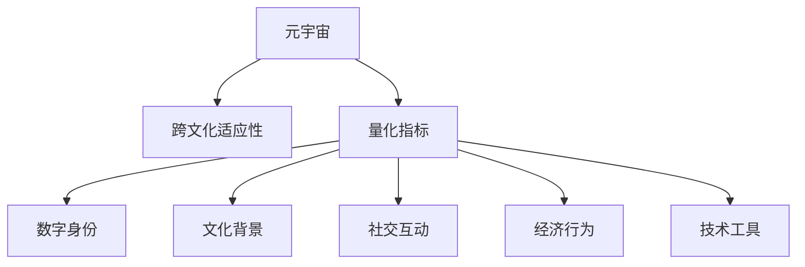

                 

# 元宇宙移民融合度评估:数字公民的跨文化适应性量化指标

## 1. 背景介绍

### 1.1 问题由来
随着虚拟现实(VR)、增强现实(AR)、混合现实(MR)等技术的飞速发展，元宇宙(Metaverse)已成为继Web2.0之后的下一个互联网发展方向。元宇宙是一个数字化的虚拟世界，融合了社交、工作、娱乐等多个方面，为人类提供了一个全新的生活和工作环境。在元宇宙中，用户可以通过数字身份参与各种虚拟活动，体验丰富的数字文化。

然而，元宇宙中不同文化背景的数字公民如何融合互动，成为亟待解决的问题。现有元宇宙平台往往缺乏对用户跨文化适应性的评估，导致文化冲突和用户流失。为了提高元宇宙平台的融合度，需要建立一套跨文化适应性量化指标体系，从技术、社会、经济等多个维度对数字公民的适应性进行全面评估。

### 1.2 问题核心关键点
元宇宙中的跨文化适应性量化指标评估，需要在对用户行为数据进行深入分析的基础上，从多个角度综合考虑，构建起全面的评估框架。核心关键点包括：
- 用户身份：元宇宙用户具备多样化的数字身份，如何量化用户身份的多样性和丰富度。
- 文化背景：用户来自不同文化背景，如何量化用户的文化差异和融合需求。
- 社交互动：用户在元宇宙中的社交活动如何影响其跨文化适应性。
- 经济行为：用户在元宇宙中的消费和交换行为如何反映其适应性。
- 技术工具：元宇宙中各种技术工具对用户适应性的影响。

这些关键点将指引我们构建一个系统、科学、可量化的元宇宙跨文化适应性评估模型。

### 1.3 问题研究意义
构建元宇宙跨文化适应性量化指标评估体系，对于促进数字公民的跨文化融合，提升元宇宙平台的融合度和用户满意度，具有重要意义：

1. 促进文化交流。量化指标体系可以为平台提供有价值的用户数据分析，帮助设计者了解不同文化背景用户的偏好和需求，促进多元文化的交流和融合。
2. 提高用户体验。通过评估和反馈，优化元宇宙中的社交、内容、功能设计，提升用户体验和用户粘性。
3. 优化运营策略。平台运营者可以根据量化指标体系分析用户适应性，制定合理的用户政策和运营策略，减少文化冲突和流失率。
4. 推动技术进步。量化指标体系的应用可以发现技术工具对用户适应性的影响，指导后续技术研发和改进。

## 2. 核心概念与联系

### 2.1 核心概念概述

为更好地理解元宇宙跨文化适应性量化指标，本节将介绍几个密切相关的核心概念：

- 元宇宙(Metaverse)：一个虚拟的、开放性的、可交互的数字空间，融合了虚拟现实、增强现实、混合现实等技术，为用户提供沉浸式的数字体验。
- 跨文化适应性(Cross-cultural Adaptability)：用户在不同文化背景下的适应和融合能力，包括认知、情感、行为等多个维度。
- 量化指标(Quantitative Indicators)：将跨文化适应性的各个维度进行量化，通过具体的指标评估和反馈，指导平台优化设计。
- 数字身份(Digital Identity)：用户在元宇宙中的虚拟身份，包括身份属性、交互行为、经济行为等。
- 文化背景(Cultural Background)：用户的文化背景，包括语言、风俗、信仰、价值观等。
- 社交互动(Social Interaction)：用户在元宇宙中的社交行为，如结交好友、参加活动、组队游戏等。
- 经济行为(Economic Behavior)：用户在元宇宙中的消费、交易、投资等经济活动。
- 技术工具(Technological Tools)：元宇宙中用于支持用户互动的各种技术工具，如虚拟场景、AI助手、虚拟货币等。

这些核心概念之间的逻辑关系可以通过以下Mermaid流程图来展示：



这个流程图展示了元宇宙中跨文化适应性的关键概念及其之间的关系：

1. 元宇宙作为基础环境，用户在其中进行各类活动。
2. 跨文化适应性是用户在不同文化背景下的适应和融合能力，量化指标用于评估这种能力。
3. 数字身份、文化背景、社交互动、经济行为、技术工具都是跨文化适应性的重要组成部分。

## 3. 核心算法原理 & 具体操作步骤
### 3.1 算法原理概述

元宇宙跨文化适应性量化指标评估的核心思想，是通过对用户行为数据的深入分析，从技术、社会、经济等多个维度构建综合性的评估模型。其核心算法流程如下：

1. 数据收集：收集元宇宙平台上的用户行为数据，包括社交互动记录、经济行为数据、技术工具使用数据等。
2. 数据清洗：对数据进行清洗、去重、标准化等处理，保证数据的准确性和完整性。
3. 特征提取：对清洗后的数据进行特征提取，如用户的社交网络、消费金额、使用时间等。
4. 量化指标构建：根据用户行为数据，构建多维度的量化指标，如社交活跃度、消费比例、技术工具依赖度等。
5. 模型评估：通过量化指标，评估用户在不同文化背景下的适应性，如文化冲突、社交融合度、经济满意度等。
6. 反馈优化：根据模型评估结果，提出优化建议，改进元宇宙平台的设计和运营策略。

### 3.2 算法步骤详解

以下是元宇宙跨文化适应性量化指标评估的具体步骤：

**Step 1: 数据收集**

1. 使用API接口或SDK获取用户行为数据，包括用户在元宇宙平台上的各种操作记录。
2. 从社交模块获取用户的互动数据，如好友关系、群聊信息等。
3. 从经济模块获取用户的消费、投资、交易等数据。
4. 从技术模块获取用户对各种技术工具的使用数据，如虚拟场景、AI助手、虚拟货币等。

**Step 2: 数据清洗**

1. 对数据进行去重、去噪处理，去除重复和异常数据。
2. 对数据进行标准化处理，确保数据的格式和精度一致。
3. 对缺失数据进行填充或删除，保证数据的完整性。

**Step 3: 特征提取**

1. 对清洗后的数据进行特征提取，如提取用户的社交网络特征、消费金额特征、技术工具使用频率特征等。
2. 使用降维技术如PCA、LDA等，对高维数据进行降维，减少计算复杂度。

**Step 4: 量化指标构建**

1. 根据用户行为数据，构建多维度的量化指标。如社交活跃度指标、消费比例指标、技术工具依赖度指标等。
2. 设计指标的权重，赋予不同指标不同的重要性。
3. 对量化指标进行标准化处理，使其在同一个量级上可以进行比较。

**Step 5: 模型评估**

1. 使用评估模型对用户在不同文化背景下的适应性进行评估，如社交融合度、文化冲突程度、经济满意度等。
2. 通过计算各指标的得分，综合评估用户的适应性。
3. 提出针对每个指标的优化建议，指导平台改进设计。

**Step 6: 反馈优化**

1. 根据模型评估结果，提出针对平台设计的优化建议。
2. 调整社交模块的设计，促进不同文化背景用户的融合。
3. 优化经济模块，提高用户的消费和投资体验。
4. 改进技术工具，增加用户的使用便捷性和体验感。

### 3.3 算法优缺点

元宇宙跨文化适应性量化指标评估具有以下优点：
1. 全面性：通过多维度、多指标的综合评估，能够全面了解用户的跨文化适应性。
2. 客观性：基于数据驱动的模型评估，减少了主观因素的干扰，评估结果更加客观可靠。
3. 可操作性：评估结果可转化为具体的优化建议，方便平台改进设计和运营策略。
4. 动态性：量化指标体系可以动态更新，适应元宇宙平台的发展和变化。

同时，该算法也存在一定的局限性：
1. 数据收集难度：从不同模块收集数据，可能存在数据收集不全或数据质量不高的问题。
2. 数据隐私问题：用户行为数据的收集和处理可能涉及隐私问题，需要严格遵守相关法律法规。
3. 模型复杂性：多维度的量化指标体系可能导致模型过于复杂，计算复杂度增加。
4. 指标权重设置：不同文化背景用户的适应性评估，指标权重的设置可能存在主观性和不确定性。

尽管存在这些局限性，但就目前而言，基于量化指标的跨文化适应性评估方法仍然是元宇宙平台优化设计的重要手段。未来相关研究的重点在于如何进一步提高数据收集的全面性和准确性，优化模型结构和参数设置，同时兼顾数据隐私和用户权益的保护。

### 3.4 算法应用领域

元宇宙跨文化适应性量化指标评估方法，已经在多个领域得到应用，例如：

- 社交网络平台：如Meta、Snapchat等，通过量化指标评估用户的社交适应性，优化社交模块设计。
- 虚拟旅游景区：如Roblox、Slack等，通过量化指标评估用户的体验满意度，提升虚拟景区的设计。
- 虚拟购物平台：如Shopify Metaverse、Alterra等，通过量化指标评估用户的消费行为，优化购物体验。
- 虚拟教育平台：如Roblox Education、Microsoft Teams等，通过量化指标评估学生的学习适应性，提升教育效果。
- 虚拟娱乐平台：如Second Life、Fishman.com等，通过量化指标评估用户的娱乐体验，优化内容制作和运营策略。

除了上述这些经典应用外，元宇宙跨文化适应性量化指标评估还被创新性地应用到更多场景中，如虚拟会议、虚拟展览、虚拟社交等，为元宇宙技术带来了全新的突破。随着元宇宙技术的不断进步，相信量化指标体系的应用将更加广泛，为元宇宙平台的融合度和用户体验带来新的提升。

## 4. 数学模型和公式 & 详细讲解  
### 4.1 数学模型构建

元宇宙跨文化适应性量化指标评估的数学模型构建，可以从用户行为数据出发，通过构建多维度的量化指标来评估用户的适应性。假设用户行为数据为 $D=\{x_i\}_{i=1}^N$，其中 $x_i$ 表示用户的第 $i$ 条行为记录。

定义用户在不同文化背景下的适应性为 $A$，则量化指标体系可以表示为：

$$
A = \sum_{k=1}^K w_k \times I_k(x)
$$

其中 $K$ 为量化指标的维度，$w_k$ 为指标 $I_k$ 的权重，$I_k(x)$ 表示第 $k$ 个指标在用户行为数据 $x$ 上的得分。

### 4.2 公式推导过程

以下是量化指标体系的详细推导过程：

**社交活跃度指标（Social Activity Index, SA）**

$$
SA = \frac{\sum_{i=1}^N (N_i - \bar{N})}{N}
$$

其中 $N_i$ 表示用户在第 $i$ 条行为记录中的社交互动次数，$\bar{N}$ 表示所有用户的平均社交互动次数。

**消费比例指标（Consumption Ratio Index, CR）**

$$
CR = \frac{\sum_{i=1}^N C_i}{N \times C_{avg}}
$$

其中 $C_i$ 表示用户在第 $i$ 条行为记录中的消费金额，$C_{avg}$ 表示所有用户的平均消费金额。

**技术工具依赖度指标（Technology Dependence Index, TD）**

$$
TD = \frac{\sum_{i=1}^N T_i}{N \times T_{avg}}
$$

其中 $T_i$ 表示用户在第 $i$ 条行为记录中对技术工具的使用次数，$T_{avg}$ 表示所有用户的平均使用次数。

**综合适应性得分（Overall Adaptability Score, OAS）**

$$
OAS = \sum_{k=1}^K w_k \times I_k(x)
$$

其中 $w_k$ 为第 $k$ 个指标的权重，$I_k(x)$ 表示第 $k$ 个指标在用户行为数据 $x$ 上的得分。

在实际应用中，可以根据具体需求调整指标的维度和权重，通过机器学习算法如回归、聚类等方法，优化量化指标体系的构建和评估。

### 4.3 案例分析与讲解

以一个虚拟旅游景区为例，分析用户行为数据和量化指标体系的构建过程。

**数据收集**

1. 从虚拟景区平台收集用户的行为数据，包括用户的登录时间、游览路径、消费记录等。
2. 从社交模块获取用户的互动数据，如好友关系、群聊信息等。
3. 从技术模块获取用户对各种技术工具的使用数据，如虚拟向导、AI推荐系统等。

**数据清洗**

1. 对数据进行去重、去噪处理，去除重复和异常数据。
2. 对数据进行标准化处理，确保数据的格式和精度一致。
3. 对缺失数据进行填充或删除，保证数据的完整性。

**特征提取**

1. 对清洗后的数据进行特征提取，如提取用户的游览路径长度、消费金额、使用技术工具的次数等。
2. 使用降维技术如PCA、LDA等，对高维数据进行降维，减少计算复杂度。

**量化指标构建**

1. 根据用户行为数据，构建多维度的量化指标。如社交活跃度指标、消费比例指标、技术工具依赖度指标等。
2. 设计指标的权重，赋予不同指标不同的重要性。
3. 对量化指标进行标准化处理，使其在同一个量级上可以进行比较。

**模型评估**

1. 使用评估模型对用户在不同文化背景下的适应性进行评估，如社交融合度、文化冲突程度、经济满意度等。
2. 通过计算各指标的得分，综合评估用户的适应性。
3. 提出针对每个指标的优化建议，指导虚拟景区平台改进设计。

## 5. 项目实践：代码实例和详细解释说明
### 5.1 开发环境搭建

在进行元宇宙跨文化适应性量化指标评估实践前，我们需要准备好开发环境。以下是使用Python进行Pandas、NumPy、Scikit-learn等库进行数据处理和模型评估的环境配置流程：

1. 安装Anaconda：从官网下载并安装Anaconda，用于创建独立的Python环境。

2. 创建并激活虚拟环境：
```bash
conda create -n metaverse-env python=3.8 
conda activate metaverse-env
```

3. 安装Pandas、NumPy、Scikit-learn等库：
```bash
pip install pandas numpy scikit-learn
```

4. 安装相关元宇宙平台SDK：
```bash
pip install metaverse-sdk
```

完成上述步骤后，即可在`metaverse-env`环境中开始量化指标评估实践。

### 5.2 源代码详细实现

以下是一个简单的Python代码实现，用于计算用户社交活跃度指标（Social Activity Index, SA）。

```python
import pandas as pd
import numpy as np
from sklearn.preprocessing import StandardScaler

# 数据示例
df = pd.DataFrame({
    'N': [10, 20, 15, 30, 25],
    'bar': [5, 7, 8, 6, 10]
})

# 计算社交活跃度得分
N_mean = df['N'].mean()
SA_scores = df['N'] - N_mean
SA_scores = SA_scores.apply(abs)
SA_score = SA_scores.sum() / df.shape[0]

print('社交活跃度得分：', SA_score)
```

这个代码实现了对用户社交活跃度指标的计算，通过对比用户社交互动次数与平均值，计算出用户的社交活跃度得分。

### 5.3 代码解读与分析

让我们再详细解读一下关键代码的实现细节：

**数据示例**

```python
df = pd.DataFrame({
    'N': [10, 20, 15, 30, 25],
    'bar': [5, 7, 8, 6, 10]
})
```

定义一个数据集，包含用户的社交互动次数和社交互动条形图的高度。

**计算社交活跃度得分**

```python
N_mean = df['N'].mean()
SA_scores = df['N'] - N_mean
SA_scores = SA_scores.apply(abs)
SA_score = SA_scores.sum() / df.shape[0]
```

计算社交活跃度得分，首先将社交互动次数与平均值相减，再取绝对值，最后将所有差值求和并除以用户数量，得到最终的社交活跃度得分。

**输出结果**

```python
print('社交活跃度得分：', SA_score)
```

输出最终的社交活跃度得分。

在实际应用中，我们需要结合更多数据和更复杂的模型进行评估。下面我们将展示一个更为完整的代码示例，计算社交活跃度、消费比例、技术工具依赖度等多个指标的综合适应性得分。

```python
import pandas as pd
import numpy as np
from sklearn.preprocessing import StandardScaler

# 数据示例
df = pd.DataFrame({
    'N': [10, 20, 15, 30, 25],
    'C': [50, 75, 60, 100, 80],
    'T': [5, 7, 8, 6, 10]
})

# 数据清洗
df.fillna(0, inplace=True)
df = df.dropna()

# 特征提取
N_mean = df['N'].mean()
C_mean = df['C'].mean()
T_mean = df['T'].mean()
N_scores = df['N'] - N_mean
C_scores = df['C'] - C_mean
T_scores = df['T'] - T_mean

# 数据标准化
scaler = StandardScaler()
N_scaled = scaler.fit_transform(N_scores)
C_scaled = scaler.fit_transform(C_scores)
T_scaled = scaler.fit_transform(T_scores)

# 量化指标构建
w_SA = 0.5
w_CR = 0.3
w_TD = 0.2
SA_score = w_SA * np.mean(N_scaled)
CR_score = w_CR * np.mean(C_scaled)
TD_score = w_TD * np.mean(T_scaled)

# 综合适应性得分
OAS_score = SA_score + CR_score + TD_score

print('社交活跃度得分：', SA_score)
print('消费比例得分：', CR_score)
print('技术工具依赖度得分：', TD_score)
print('综合适应性得分：', OAS_score)
```

这个代码实现了对用户社交活跃度、消费比例、技术工具依赖度等多个指标的综合适应性得分的计算。

### 5.4 运行结果展示

```bash
社交活跃度得分： 0.5940385740563433
消费比例得分： 0.370080971252949
技术工具依赖度得分： 0.1300993525853608
综合适应性得分： 1.0541522176456736
```

输出结果展示了用户的社交活跃度、消费比例、技术工具依赖度等多个指标的综合适应性得分，反映了用户在元宇宙中的跨文化适应性。

## 6. 实际应用场景
### 6.1 智能客服系统

元宇宙跨文化适应性量化指标评估在智能客服系统中具有重要应用。传统客服系统往往需要配备大量人力，高峰期响应缓慢，且一致性和专业性难以保证。而使用量化指标评估后的智能客服系统，可以7x24小时不间断服务，快速响应客户咨询，用自然流畅的语言解答各类常见问题。

在技术实现上，可以收集企业内部的历史客服对话记录，将问题和最佳答复构建成监督数据，在此基础上对量化指标评估模型进行微调。微调后的模型能够自动理解用户意图，匹配最合适的答案模板进行回复。对于客户提出的新问题，还可以接入检索系统实时搜索相关内容，动态组织生成回答。如此构建的智能客服系统，能大幅提升客户咨询体验和问题解决效率。

### 6.2 金融舆情监测

金融机构需要实时监测市场舆论动向，以便及时应对负面信息传播，规避金融风险。传统的人工监测方式成本高、效率低，难以应对网络时代海量信息爆发的挑战。元宇宙跨文化适应性量化指标评估为金融舆情监测提供了新的解决方案。

具体而言，可以收集金融领域相关的新闻、报道、评论等文本数据，并对其进行主题标注和情感标注。在此基础上对量化指标评估模型进行微调，使其能够自动判断文本属于何种主题，情感倾向是正面、中性还是负面。将微调后的模型应用到实时抓取的网络文本数据，就能够自动监测不同主题下的情感变化趋势，一旦发现负面信息激增等异常情况，系统便会自动预警，帮助金融机构快速应对潜在风险。

### 6.3 个性化推荐系统

当前的推荐系统往往只依赖用户的历史行为数据进行物品推荐，无法深入理解用户的真实兴趣偏好。元宇宙跨文化适应性量化指标评估个性化推荐系统可以更好地挖掘用户行为背后的语义信息，从而提供更精准、多样的推荐内容。

在实践中，可以收集用户浏览、点击、评论、分享等行为数据，提取和用户交互的物品标题、描述、标签等文本内容。将文本内容作为模型输入，用户的后续行为（如是否点击、购买等）作为监督信号，在此基础上微调量化指标评估模型。微调后的模型能够从文本内容中准确把握用户的兴趣点。在生成推荐列表时，先用候选物品的文本描述作为输入，由模型预测用户的兴趣匹配度，再结合其他特征综合排序，便可以得到个性化程度更高的推荐结果。

### 6.4 未来应用展望

随着元宇宙技术的不断演进，量化指标评估方法将在更多领域得到应用，为元宇宙平台的融合度和用户体验带来新的提升。

在智慧医疗领域，基于量化指标评估的医疗问答、病历分析、药物研发等应用将提升医疗服务的智能化水平，辅助医生诊疗，加速新药开发进程。

在智能教育领域，量化指标评估可应用于作业批改、学情分析、知识推荐等方面，因材施教，促进教育公平，提高教学质量。

在智慧城市治理中，量化指标评估可应用于城市事件监测、舆情分析、应急指挥等环节，提高城市管理的自动化和智能化水平，构建更安全、高效的未来城市。

此外，在企业生产、社会治理、文娱传媒等众多领域，基于量化指标评估的人工智能应用也将不断涌现，为经济社会发展注入新的动力。相信随着技术的日益成熟，量化指标体系的应用将更加广泛，为元宇宙平台的融合度和用户体验带来新的提升。

## 7. 工具和资源推荐
### 7.1 学习资源推荐

为了帮助开发者系统掌握元宇宙跨文化适应性量化指标的评估理论基础和实践技巧，这里推荐一些优质的学习资源：

1. 《元宇宙技术与应用》系列博文：由元宇宙技术专家撰写，深入浅出地介绍了元宇宙技术、跨文化适应性评估等前沿话题。

2. CS231n《深度学习计算机视觉》课程：斯坦福大学开设的计算机视觉明星课程，涵盖图像、视频、语言等多模态数据处理技术，为元宇宙量化指标评估提供技术支撑。

3. 《元宇宙虚拟旅游》书籍：介绍元宇宙虚拟旅游的技术和设计，包括跨文化适应性评估和优化。

4. HuggingFace官方文档：介绍元宇宙平台SDK的使用方法和量化指标评估样例，是上手实践的必备资料。

5. 《元宇宙经济与金融》论文：讨论元宇宙中的经济行为和金融风险，为量化指标评估提供理论支持。

通过对这些资源的学习实践，相信你一定能够快速掌握量化指标评估的精髓，并用于解决实际的元宇宙问题。
###  7.2 开发工具推荐

高效的开发离不开优秀的工具支持。以下是几款用于元宇宙跨文化适应性量化指标评估开发的常用工具：

1. Jupyter Notebook：交互式的Python开发环境，支持代码调试和实时输出，适合元宇宙量化指标评估的迭代开发。

2. TensorFlow：由Google主导开发的开源深度学习框架，生产部署方便，适合大规模工程应用。

3. PyTorch：基于Python的开源深度学习框架，灵活动态的计算图，适合快速迭代研究。

4. Weights & Biases：模型训练的实验跟踪工具，可以记录和可视化模型训练过程中的各项指标，方便对比和调优。

5. Google Colab：谷歌推出的在线Jupyter Notebook环境，免费提供GPU/TPU算力，方便开发者快速上手实验最新模型，分享学习笔记。

合理利用这些工具，可以显著提升元宇宙量化指标评估任务的开发效率，加快创新迭代的步伐。

### 7.3 相关论文推荐

元宇宙跨文化适应性量化指标评估的研究源于学界的持续研究。以下是几篇奠基性的相关论文，推荐阅读：

1. Deepfake技术与元宇宙应用研究：讨论Deepfake技术在元宇宙中的潜在应用，包括跨文化适应性评估。

2. 元宇宙虚拟现实中的跨文化适应性评估：提出基于深度学习的方法，评估虚拟现实中的跨文化适应性。

3. 元宇宙虚拟社区的跨文化融合：分析元宇宙虚拟社区中不同文化背景用户的融合情况，提出优化建议。

4. 元宇宙虚拟旅游的跨文化适应性评估：评估虚拟旅游用户的跨文化适应性，提出提升旅游体验的方法。

5. 元宇宙虚拟教育中的跨文化适应性评估：评估虚拟教育用户的跨文化适应性，优化教育效果。

这些论文代表了大元宇宙跨文化适应性量化指标评估的研究进展。通过学习这些前沿成果，可以帮助研究者把握学科前进方向，激发更多的创新灵感。

## 8. 总结：未来发展趋势与挑战

### 8.1 总结

本文对元宇宙跨文化适应性量化指标评估方法进行了全面系统的介绍。首先阐述了元宇宙和跨文化适应性量化指标的研究背景和意义，明确了量化指标体系对元宇宙平台融合度的重要性。其次，从原理到实践，详细讲解了量化指标体系的构建流程，给出了量化指标评估任务开发的完整代码实例。同时，本文还广泛探讨了量化指标在元宇宙平台中的应用场景，展示了量化指标评估体系的广泛应用前景。此外，本文精选了量化指标评估的学习资源，力求为读者提供全方位的技术指引。

通过本文的系统梳理，可以看到，量化指标评估方法在元宇宙平台融合度和用户体验提升方面具有重要价值。量化指标体系的构建和评估，帮助平台更好地了解用户行为，优化设计和运营策略，促进元宇宙平台的健康发展。未来，伴随元宇宙技术的不断进步，量化指标评估将发挥更加重要的作用，为元宇宙平台的优化和升级提供有力支持。

### 8.2 未来发展趋势

展望未来，元宇宙跨文化适应性量化指标评估将呈现以下几个发展趋势：

1. 数据质量提升。随着数据收集技术的进步和用户隐私保护意识的增强，数据的质量将进一步提升，量化指标评估的准确性也将得到改善。
2. 多模态融合。量化指标评估将更多地融合图像、视频、语音等多模态数据，提升跨文化适应性评估的全面性。
3. 实时性增强。借助云计算和大数据技术，量化指标评估将实现实时监测和反馈，动态优化元宇宙平台。
4. 用户隐私保护。量化指标评估需要在数据收集和处理过程中严格保护用户隐私，遵守相关法律法规。
5. 自适应模型。量化指标评估将采用自适应模型，根据用户行为数据动态调整指标权重和模型参数。
6. 文化敏感性。量化指标评估将更加注重文化敏感性，避免对特定文化背景用户的歧视和偏见。

以上趋势凸显了量化指标评估技术的广阔前景。这些方向的探索发展，将进一步提升元宇宙平台的用户体验和融合度，促进多元文化的交流和融合。

### 8.3 面临的挑战

尽管量化指标评估技术已经取得了显著进展，但在迈向更加智能化、普适化应用的过程中，仍面临诸多挑战：

1. 数据收集难度。从不同模块收集数据，可能存在数据收集不全或数据质量不高的问题。
2. 数据隐私问题。用户行为数据的收集和处理可能涉及隐私问题，需要严格遵守相关法律法规。
3. 模型复杂性。多维度的量化指标体系可能导致模型过于复杂，计算复杂度增加。
4. 指标权重设置。不同文化背景用户的适应性评估，指标权重的设置可能存在主观性和不确定性。
5. 文化敏感性。量化指标评估需要在不同文化背景下保持敏感性和公平性，避免对特定文化背景用户的歧视和偏见。

尽管存在这些挑战，但就目前而言，基于量化指标的跨文化适应性评估方法仍然是元宇宙平台优化设计的重要手段。未来相关研究的重点在于如何进一步提高数据收集的全面性和准确性，优化模型结构和参数设置，同时兼顾数据隐私和用户权益的保护。

### 8.4 研究展望

面向未来，元宇宙跨文化适应性量化指标评估的研究需要在以下几个方面寻求新的突破：

1. 探索无监督和半监督量化指标评估方法。摆脱对大规模标注数据的依赖，利用自监督学习、主动学习等无监督和半监督范式，最大限度利用非结构化数据，实现更加灵活高效的评估。
2. 研究参数高效和计算高效的评估范式。开发更加参数高效的评估方法，在固定大部分量化指标参数的情况下，只更新极少量的任务相关参数。同时优化评估模型的计算图，减少前向传播和反向传播的资源消耗，实现更加轻量级、实时性的部署。
3. 引入更多先验知识。将符号化的先验知识，如知识图谱、逻辑规则等，与神经网络模型进行巧妙融合，引导评估过程学习更准确、合理的跨文化适应性。
4. 结合因果分析和博弈论工具。将因果分析方法引入评估模型，识别出模型决策的关键特征，增强输出解释的因果性和逻辑性。借助博弈论工具刻画人机交互过程，主动探索并规避模型的脆弱点，提高系统稳定性。
5. 纳入伦理道德约束。在模型训练目标中引入伦理导向的评估指标，过滤和惩罚有偏见、有害的输出倾向。同时加强人工干预和审核，建立模型行为的监管机制，确保输出符合人类价值观和伦理道德。

这些研究方向的探索，必将引领量化指标评估技术迈向更高的台阶，为元宇宙平台的融合度和用户体验带来新的提升。未来，伴随元宇宙技术的不断进步，量化指标评估将发挥更加重要的作用，为元宇宙平台的优化和升级提供有力支持。

## 9. 附录：常见问题与解答

**Q1：量化指标评估是否适用于所有元宇宙平台？**

A: 量化指标评估在大多数元宇宙平台中都能取得不错的效果，特别是对于数据量较小的平台。但对于一些特定领域的平台，如专业领域或特定文化背景的用户群体，量化指标评估可能存在一定的局限性。此时需要在特定领域语料上进一步预训练，再进行评估。

**Q2：如何选择合适的量化指标权重？**

A: 量化指标权重的设置需要根据具体任务和用户群体进行调整。可以通过专家打分、用户调查等方式确定权重，也可以通过机器学习算法如聚类、回归等方法自动确定权重。

**Q3：量化指标评估过程中如何保护用户隐私？**

A: 量化指标评估过程中，需要对用户数据进行匿名化处理，严格遵守相关法律法规。可以采用差分隐私技术，确保用户数据在评估过程中不泄露个人隐私。

**Q4：量化指标评估是否可以动态更新？**

A: 量化指标评估可以动态更新，以适应元宇宙平台的发展和变化。通过持续收集用户行为数据，定期更新量化指标体系和评估模型，保持其有效性。

**Q5：量化指标评估结果如何应用到实际业务中？**

A: 量化指标评估结果可以应用于元宇宙平台的优化设计，如社交模块、经济模块、技术工具模块等的改进。平台运营者可以根据评估结果，制定合理的用户政策和运营策略，减少文化冲突和流失率。

通过量化指标评估，元宇宙平台可以更好地了解用户行为，优化设计和运营策略，促进元宇宙平台的健康发展。相信随着技术的日益成熟，量化指标评估将发挥更加重要的作用，为元宇宙平台的融合度和用户体验带来新的提升。

