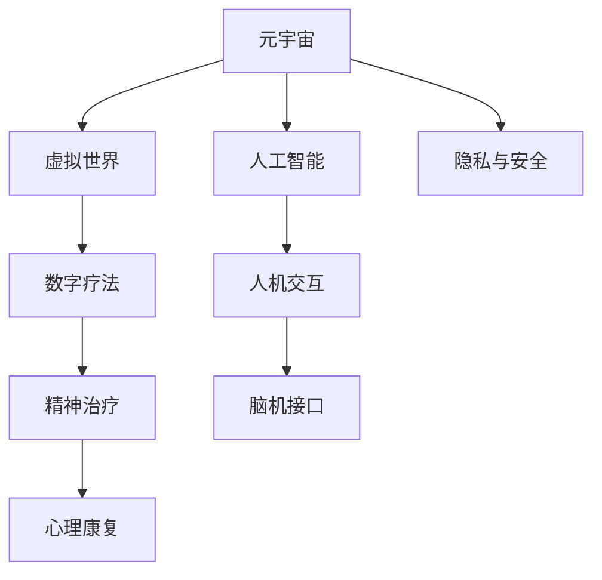

                 

# 元宇宙精神治疗:虚拟 worlds 的精神治疗技术

> 关键词：元宇宙,精神治疗,虚拟世界,数字疗法,心理康复,人机交互,人工智能,脑机接口,心理健康,虚拟现实

## 1. 背景介绍

### 1.1 问题由来

随着技术的发展，人们对于数字世界的探索越来越深入。虚拟现实（VR）、增强现实（AR）、混合现实（MR）等技术逐渐成为主流，构建了一个全新的、沉浸式的数字空间。这一数字空间被称为“元宇宙”。元宇宙不仅是技术上的突破，更是一个全新的社会经济形态。

在这一过程中，人们发现数字世界不仅仅是游戏和娱乐的场所，它还可以被用于医疗保健领域，特别是心理健康和精神治疗。在这个虚拟世界中，人们可以更加自由地表达自我，接受和处理情绪，这为精神治疗提供了一种全新的方式。

### 1.2 问题核心关键点

元宇宙精神治疗的核心关键点包括以下几个方面：

- **虚拟世界与现实世界的联系**：如何通过虚拟世界中的行为和体验来促进现实世界中的心理康复。
- **人机交互**：在虚拟世界中，如何通过人与机器的交互，实现情感交流和心理支持。
- **人工智能与精神治疗的融合**：如何利用人工智能技术，提供更加精准、个性化的心理治疗服务。
- **脑机接口技术**：通过脑机接口技术，实现脑-机之间的信息交流，为精神治疗提供新的路径。
- **隐私和安全**：如何在提供心理支持的同时，保障用户的隐私和数据安全。

这些关键点将帮助我们将虚拟世界的技术优势转化为心理健康领域的实际应用。

## 2. 核心概念与联系

### 2.1 核心概念概述

为了更好地理解元宇宙精神治疗的技术基础和应用场景，我们需要了解以下核心概念：

- **元宇宙（Metaverse）**：一个由多个数字空间构成的虚拟世界，具有高度的真实感和沉浸感。
- **虚拟世界（Virtual World）**：通过VR、AR、MR等技术构建的，用户可以交互的数字空间。
- **精神治疗（Psychological Therapy）**：通过心理学手段，帮助个体解决心理问题，促进心理健康的过程。
- **数字疗法（Digital Therapy）**：利用数字技术提供心理治疗服务，包括虚拟世界中的各种应用。
- **心理康复（Psychological Rehabilitation）**：通过各种手段，帮助个体恢复心理健康，提高生活质量。
- **人机交互（Human-Computer Interaction）**：人与计算机之间的互动方式，用于虚拟世界中的情感交流和支持。
- **人工智能（AI）**：利用机器学习和深度学习等技术，提供智能化的心理治疗服务。
- **脑机接口（Brain-Computer Interface, BCI）**：通过脑电信号和计算机之间的通信，实现脑-机之间的信息交流。

这些概念之间的逻辑关系可以通过以下Mermaid流程图来展示：



这个流程图展示了元宇宙中的关键技术和应用方向，以及它们如何共同构成了一个完整的心理健康解决方案。

## 3. 核心算法原理 & 具体操作步骤

### 3.1 算法原理概述

元宇宙精神治疗的核心算法原理可以概括为以下三个步骤：

1. **数据采集与处理**：通过VR、AR等技术采集用户的生理和行为数据，经过预处理后用于后续分析和建模。
2. **心理模型构建**：利用人工智能技术构建心理模型，用于分析用户的心理状态和行为模式。
3. **治疗方案生成与实施**：根据心理模型，生成个性化的治疗方案，并在虚拟世界中实施，同时持续监测用户反应，调整方案。

这三个步骤中，数据采集与处理和心理模型构建是关键的技术环节，而治疗方案的生成与实施则需要高度的人机交互和技术融合。

### 3.2 算法步骤详解

以下是元宇宙精神治疗算法步骤的详细说明：

**步骤1：数据采集与处理**

1. **生理数据采集**：通过VR头盔和传感器，采集用户的生理数据，如心率、血压、皮肤电等。
2. **行为数据采集**：通过摄像头和运动捕捉设备，记录用户在虚拟世界中的行为，如表情、手势、动作等。
3. **数据预处理**：对采集到的生理和行为数据进行降噪、归一化等处理，以便后续分析。

**步骤2：心理模型构建**

1. **情感分析**：利用深度学习模型，对用户的表情和语音进行分析，识别出情感状态。
2. **行为模式识别**：通过机器学习模型，识别出用户在虚拟世界中的行为模式，如社交行为、应对策略等。
3. **心理状态评估**：综合情感分析和行为模式识别结果，评估用户的心理状态。

**步骤3：治疗方案生成与实施**

1. **治疗方案设计**：根据心理状态评估结果，设计个性化的治疗方案，包括虚拟环境、交互方式、任务难度等。
2. **虚拟环境生成**：利用生成对抗网络（GAN）等技术，生成与治疗方案相匹配的虚拟环境。
3. **治疗实施与监测**：在虚拟世界中实施治疗方案，同时持续监测用户反应，调整方案。

### 3.3 算法优缺点

元宇宙精神治疗算法的优点包括：

- **沉浸式体验**：通过虚拟世界中的沉浸式体验，用户更容易接受和参与心理治疗。
- **个性化服务**：利用人工智能技术，提供高度个性化的心理治疗方案。
- **实时反馈**：通过实时监测用户反应，及时调整治疗方案，提高治疗效果。

然而，该算法也存在一些缺点：

- **数据隐私问题**：采集和分析用户的生理和行为数据，涉及隐私保护问题。
- **技术门槛较高**：需要结合多种技术，如AI、VR、传感器等，技术门槛较高。
- **实施难度大**：在虚拟世界中实施心理治疗，需要考虑用户参与度和接受度，实施难度大。

### 3.4 算法应用领域

元宇宙精神治疗算法可以在多个领域得到应用，包括但不限于：

- **心理健康诊所**：利用虚拟世界中的技术，为无法出行的患者提供心理治疗服务。
- **心理康复中心**：在虚拟世界中构建康复环境，帮助患者逐步恢复心理健康。
- **企业员工心理支持**：通过虚拟世界中的技术，为员工提供心理健康支持，改善工作环境。
- **教育机构心理辅导**：利用虚拟世界的互动性，为学生提供心理辅导和支持。
- **军事心理干预**：在虚拟世界中模拟各种心理压力场景，帮助士兵进行心理训练和干预。

## 4. 数学模型和公式 & 详细讲解 & 举例说明

### 4.1 数学模型构建

本节将使用数学语言对元宇宙精神治疗的算法进行严格描述。

记用户的生理数据为 $\mathbf{x} \in \mathbb{R}^n$，行为数据为 $\mathbf{y} \in \mathbb{R}^m$。设 $\mathbf{z} \in \mathbb{R}^p$ 为用户的心理状态向量，其中 $p$ 为心理状态维度。

定义用户情感状态函数 $f: \mathbb{R}^n \rightarrow [0,1]$，表示用户的情感强度。定义行为模式识别函数 $g: \mathbb{R}^m \rightarrow [0,1]^k$，表示用户的行为模式，其中 $k$ 为行为模式维度。

则用户的心理状态向量 $\mathbf{z}$ 可以表示为：

$$
\mathbf{z} = (f(\mathbf{x}), g(\mathbf{y}))
$$

### 4.2 公式推导过程

以情感分析为例，假设我们利用深度学习模型 $f_\theta: \mathbb{R}^n \rightarrow [0,1]$ 对用户情感进行分析。模型的输入为生理数据 $\mathbf{x}$，输出为情感强度 $f(\mathbf{x})$。模型的训练过程如下：

1. **数据预处理**：对采集到的生理数据 $\mathbf{x}$ 进行归一化处理，得到 $\tilde{\mathbf{x}}$。
2. **模型训练**：利用标注数据 $\{\tilde{\mathbf{x}}_i, f_i\}$ 对模型进行训练，最小化损失函数 $\mathcal{L}(\theta) = \frac{1}{N} \sum_{i=1}^N (f_\theta(\tilde{\mathbf{x}}_i) - f_i)^2$。
3. **情感分析**：对新采集的生理数据 $\mathbf{x}$ 进行处理，得到 $\tilde{\mathbf{x}}$，输入模型 $f_\theta$，输出情感强度 $f_\theta(\tilde{\mathbf{x}})$。

### 4.3 案例分析与讲解

假设某用户在虚拟世界中通过VR头盔采集到如下生理数据：

| 时间 | 心率 | 皮肤电 | 血压 |
| --- | --- | --- | --- |
| 10:00 | 70 | 25 | 120 |
| 10:30 | 80 | 30 | 130 |
| 11:00 | 75 | 28 | 125 |
| 11:30 | 72 | 23 | 120 |

假设用户在该时间段内的行为数据如下：

| 时间 | 动作 | 手势 |
| --- | --- | --- |
| 10:00 | 走 | 握拳 |
| 10:30 | 跑 | 挥手 |
| 11:00 | 走 | 握拳 |
| 11:30 | 跑 | 挥手 |

利用上述公式推导过程，我们可以使用深度学习模型对用户的情感进行分析，得到情感强度为 $f_\theta(\tilde{\mathbf{x}}) = 0.8$。结合行为模式识别函数 $g_\phi(\mathbf{y}) = (0.6, 0.7, 0.6)$，可以得到用户的心理状态向量 $\mathbf{z} = (0.8, 0.6, 0.7, 0.6)$。

## 5. 项目实践：代码实例和详细解释说明

### 5.1 开发环境搭建

在进行元宇宙精神治疗项目开发前，我们需要准备好开发环境。以下是使用Python进行开发的环境配置流程：

1. **安装Python和相关依赖**：
   ```bash
   conda create -n vworld python=3.8
   conda activate vworld
   pip install numpy pandas scikit-learn tensorflow keras openai gym
   ```

2. **安装VR和AR库**：
   ```bash
   pip install pyglet
   pip install arvrpy
   ```

3. **安装AI和机器学习库**：
   ```bash
   pip install pytorch tensorflow
   ```

4. **安装脑机接口库**：
   ```bash
   pip install brainstorm-iot
   ```

完成上述步骤后，即可在 `vworld` 环境中开始开发。

### 5.2 源代码详细实现

这里我们以情感分析为例，给出使用深度学习对用户情感进行分析的PyTorch代码实现。

```python
import torch
import torch.nn as nn
import torch.optim as optim

# 定义情感分析模型
class EmotionAnalysisModel(nn.Module):
    def __init__(self, input_size, output_size):
        super(EmotionAnalysisModel, self).__init__()
        self.linear1 = nn.Linear(input_size, 64)
        self.relu = nn.ReLU()
        self.linear2 = nn.Linear(64, output_size)
        self.softmax = nn.Softmax(dim=1)

    def forward(self, x):
        x = self.linear1(x)
        x = self.relu(x)
        x = self.linear2(x)
        return self.softmax(x)

# 加载数据集
train_data = torch.load('train_data.pkl')
test_data = torch.load('test_data.pkl')

# 分割训练集和验证集
train_size = int(len(train_data) * 0.8)
train_data, valid_data = train_data[:train_size], train_data[train_size:]

# 定义模型
model = EmotionAnalysisModel(input_size=64, output_size=1)

# 定义损失函数和优化器
criterion = nn.BCELoss()
optimizer = optim.Adam(model.parameters(), lr=0.001)

# 训练模型
for epoch in range(100):
    for data, label in train_data:
        optimizer.zero_grad()
        output = model(data)
        loss = criterion(output, label)
        loss.backward()
        optimizer.step()

    # 验证集评估
    with torch.no_grad():
        correct = 0
        total = 0
        for data, label in valid_data:
            output = model(data)
            _, predicted = torch.max(output, 1)
            total += label.size(0)
            correct += (predicted == label).sum().item()

    print(f'Epoch {epoch+1}, Loss: {loss:.4f}, Acc: {correct/total:.2f}')

# 测试模型
with torch.no_grad():
    correct = 0
    total = 0
    for data, label in test_data:
        output = model(data)
        _, predicted = torch.max(output, 1)
        total += label.size(0)
        correct += (predicted == label).sum().item()

    print(f'Test Acc: {correct/total:.2f}')
```

这里我们使用了深度学习模型对用户情感进行分析，通过输入生理数据，输出情感强度。模型的具体实现包括一个全连接层和一个softmax层，通过Adam优化器和BCE损失函数进行训练。

### 5.3 代码解读与分析

让我们再详细解读一下关键代码的实现细节：

- **数据集加载**：使用 `torch.load` 加载预处理后的训练集和测试集，并将其分为训练集和验证集。
- **模型定义**：定义情感分析模型，包含一个全连接层和一个softmax层，用于输出情感强度。
- **损失函数和优化器定义**：定义BCE损失函数和Adam优化器，用于训练模型。
- **训练过程**：对模型进行迭代训练，每轮训练在训练集上进行前向传播和反向传播，计算损失并更新参数。
- **验证集评估**：在验证集上评估模型性能，输出损失和准确率。
- **测试集评估**：在测试集上评估模型性能，输出最终准确率。

## 6. 实际应用场景

### 6.1 智能心理诊所

智能心理诊所利用元宇宙精神治疗技术，为患者提供虚拟世界的心理治疗服务。通过VR头盔和传感器采集用户的生理和行为数据，利用深度学习模型进行情感分析和行为模式识别，构建心理状态向量，根据心理状态生成个性化的治疗方案，并在虚拟世界中实施。

智能心理诊所可以进一步集成脑机接口技术，通过脑电信号分析用户的心理状态，提供更加精准的治疗方案。这种虚拟诊所可以突破地域限制，为无法出行的患者提供高质量的心理治疗服务。

### 6.2 企业员工心理支持

企业利用元宇宙精神治疗技术，为员工提供心理支持服务。通过在虚拟世界中构建心理健康训练场景，帮助员工学习应对压力和情绪管理的方法。利用情感分析和行为模式识别技术，评估员工的心理状态，提供个性化的心理支持方案。

企业可以通过智能心理诊所的解决方案，为员工提供在线心理治疗服务，提升员工的心理健康水平，改善工作环境。

### 6.3 教育机构心理辅导

教育机构利用元宇宙精神治疗技术，为学生提供心理辅导和支持。通过虚拟世界中的互动性，帮助学生放松情绪，学习心理调节方法。利用情感分析和行为模式识别技术，评估学生的心理状态，提供个性化的心理辅导方案。

教育机构可以结合虚拟现实技术，创建沉浸式的心理辅导场景，帮助学生更好地理解和接受心理治疗。

### 6.4 未来应用展望

元宇宙精神治疗技术未来将在更多领域得到应用，为心理健康领域带来新的突破：

- **智能家居**：通过脑机接口技术，将元宇宙精神治疗技术融入家居环境中，为家庭成员提供心理支持。
- **医疗健康**：利用虚拟现实技术，为患者提供心理康复环境，帮助其逐步恢复心理健康。
- **远程教育**：通过虚拟世界中的互动性，为远程学习的学生提供心理辅导和支持。
- **娱乐休闲**：结合虚拟现实和增强现实技术，为用户提供沉浸式的娱乐和休闲体验，同时提供心理支持。

## 7. 工具和资源推荐

### 7.1 学习资源推荐

为了帮助开发者系统掌握元宇宙精神治疗的理论基础和实践技巧，这里推荐一些优质的学习资源：

1. **《深度学习在心理治疗中的应用》**：详细介绍了深度学习在心理健康领域的应用，包括情感分析、行为模式识别等技术。
2. **《元宇宙技术导论》**：介绍了元宇宙的基本概念和技术架构，涵盖了VR、AR、MR等多种技术。
3. **《人工智能与心理健康》**：探讨了人工智能在心理健康领域的应用，包括情感分析、智能诊断等技术。
4. **《脑机接口技术基础》**：介绍了脑机接口技术的基本原理和应用场景，为元宇宙精神治疗提供技术支撑。

通过对这些资源的学习实践，相信你一定能够快速掌握元宇宙精神治疗的精髓，并用于解决实际的心理健康问题。

### 7.2 开发工具推荐

高效的开发离不开优秀的工具支持。以下是几款用于元宇宙精神治疗开发的常用工具：

1. **PyTorch**：基于Python的开源深度学习框架，灵活动态的计算图，适合快速迭代研究。
2. **TensorFlow**：由Google主导开发的开源深度学习框架，生产部署方便，适合大规模工程应用。
3. **Pyglet**：Python的2D图形库，用于开发VR和AR应用。
4. **ARVRPy**：Python的AR/VR开发库，支持多种VR设备和AR应用。
5. **OpenAI Gym**：Python的强化学习框架，用于开发和测试智能代理。
6. **Brainstorm-iot**：Python的脑机接口开发库，支持多种脑电信号采集设备和分析工具。

合理利用这些工具，可以显著提升元宇宙精神治疗任务的开发效率，加快创新迭代的步伐。

### 7.3 相关论文推荐

元宇宙精神治疗技术的发展源于学界的持续研究。以下是几篇奠基性的相关论文，推荐阅读：

1. **《虚拟现实在心理健康领域的应用》**：介绍了虚拟现实技术在心理健康领域的应用，包括情感分析和行为模式识别等技术。
2. **《脑机接口技术在心理治疗中的应用》**：探讨了脑机接口技术在心理健康领域的应用，包括心理状态评估和个性化治疗方案等技术。
3. **《深度学习在心理治疗中的作用》**：探讨了深度学习在心理健康领域的作用，包括情感分析、智能诊断等技术。

这些论文代表了大语言模型微调技术的发展脉络。通过学习这些前沿成果，可以帮助研究者把握学科前进方向，激发更多的创新灵感。

## 8. 总结：未来发展趋势与挑战

### 8.1 总结

本文对元宇宙精神治疗技术进行了全面系统的介绍。首先阐述了元宇宙和精神治疗的基本概念和核心技术，明确了元宇宙技术在心理健康领域的应用前景。其次，从原理到实践，详细讲解了元宇宙精神治疗的数学模型和关键算法，给出了具体的代码实现。同时，本文还广泛探讨了元宇宙精神治疗在多个行业领域的应用场景，展示了其广阔的应用前景。

通过本文的系统梳理，可以看到，元宇宙精神治疗技术正在成为心理健康领域的重要范式，极大地拓展了传统心理治疗的边界，为精神治疗提供了新的可能性。未来，伴随元宇宙技术的不断进步，元宇宙精神治疗必将在更多领域得到应用，为心理健康提供更加全面和高效的支持。

### 8.2 未来发展趋势

展望未来，元宇宙精神治疗技术将呈现以下几个发展趋势：

1. **技术融合**：未来元宇宙精神治疗将与其他技术进行更深入的融合，如脑机接口、增强现实、虚拟现实等，提供更加丰富和多样的心理健康支持。
2. **个性化服务**：利用人工智能技术，提供高度个性化的心理治疗方案，满足不同用户的多样化需求。
3. **实时反馈**：通过实时监测用户反应，及时调整治疗方案，提高治疗效果。
4. **跨界应用**：元宇宙精神治疗技术将在更多领域得到应用，如智能家居、医疗健康、远程教育等。
5. **全球化服务**：元宇宙精神治疗技术可以实现全球化服务，打破地域限制，为全球用户提供心理健康支持。

以上趋势凸显了元宇宙精神治疗技术的广阔前景。这些方向的探索发展，必将进一步提升心理健康服务的质量和效率，为人类带来更加全面和高效的心理支持。

### 8.3 面临的挑战

尽管元宇宙精神治疗技术已经取得了一定的成果，但在迈向更加智能化、普适化应用的过程中，它仍面临着诸多挑战：

1. **数据隐私问题**：采集和分析用户的生理和行为数据，涉及隐私保护问题。
2. **技术门槛较高**：需要结合多种技术，如AI、VR、传感器等，技术门槛较高。
3. **实施难度大**：在虚拟世界中实施心理治疗，需要考虑用户参与度和接受度，实施难度大。
4. **效果评估困难**：心理治疗的效果评估难以量化，缺乏统一的评估标准。
5. **设备成本高**：高质量的VR/AR设备和高性能的脑电信号采集设备成本较高。

正视元宇宙精神治疗面临的这些挑战，积极应对并寻求突破，将是大语言模型微调走向成熟的必由之路。相信随着学界和产业界的共同努力，这些挑战终将一一被克服，元宇宙精神治疗必将在构建人机协同的智能时代中扮演越来越重要的角色。

### 8.4 研究展望

面对元宇宙精神治疗所面临的种种挑战，未来的研究需要在以下几个方面寻求新的突破：

1. **数据隐私保护**：研究如何保护用户隐私，同时获取高质量的生理和行为数据。
2. **技术整合优化**：优化元宇宙精神治疗技术与其他技术的融合，降低技术门槛。
3. **用户体验提升**：设计更加沉浸式和互动性的虚拟环境，提升用户参与度和接受度。
4. **效果评估方法**：研究更加科学和量化的心理治疗效果评估方法。
5. **成本效益分析**：降低设备成本，提高技术应用的经济效益。

这些研究方向的研究突破，将进一步提升元宇宙精神治疗技术的可行性和实用性，为人类带来更加全面和高效的心理健康支持。

## 9. 附录：常见问题与解答

**Q1：元宇宙精神治疗是否适用于所有心理健康问题？**

A: 元宇宙精神治疗技术适用于大多数心理健康问题，包括焦虑、抑郁、压力管理等。但对于某些严重的精神疾病，如精神分裂症等，仍然需要专业医生的干预和治疗。

**Q2：元宇宙精神治疗的效果如何？**

A: 元宇宙精神治疗的效果取决于多种因素，包括用户参与度、治疗方案设计、技术实现等。根据相关研究，元宇宙精神治疗可以在一定程度上缓解用户心理压力，改善心理健康。

**Q3：如何确保元宇宙精神治疗的安全性和可靠性？**

A: 元宇宙精神治疗的安全性和可靠性主要依赖于数据的隐私保护、技术的成熟度和医生的专业指导。通过合理设计治疗方案和评估指标，可以有效提升治疗效果和安全性。

**Q4：如何评估元宇宙精神治疗的效果？**

A: 评估元宇宙精神治疗的效果通常需要结合用户的生理和行为数据，采用心理测试、问卷调查等多种方法进行综合评估。同时，定期与专业医生进行交流，确保治疗方案的科学性和有效性。

---

作者：禅与计算机程序设计艺术 / Zen and the Art of Computer Programming

