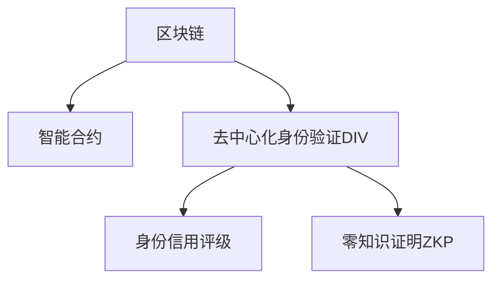
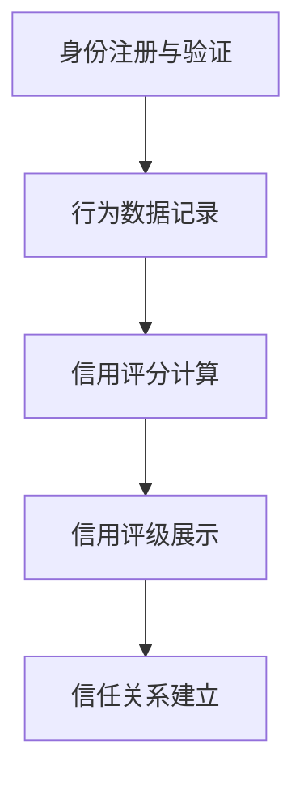

                 

# 元宇宙身份信用评级:去中心化身份验证的信用机制

## 1. 背景介绍

### 1.1 问题由来
随着区块链和元宇宙技术的迅猛发展，去中心化身份验证（Decentralized Identity Verification, DIV）成为构建安全、可靠、透明的数字身份系统的重要方向。元宇宙作为一个虚拟现实的空间，需要一套完善的身份信用评级机制来确保用户身份的真实性和可信度。然而，传统的基于中心化身份验证的方法难以适应元宇宙的分布式和去中心化特性，需要通过创新的信用评级机制，实现用户身份的自主管理和安全互信。

### 1.2 问题核心关键点
元宇宙身份信用评级系统需要通过区块链技术，利用智能合约和多维度的信用评分算法，构建去中心化的身份验证和信任机制。该系统旨在：
- 确保用户身份的真实性：通过加密和哈希等技术手段，验证用户身份的唯一性和真实性。
- 维护用户隐私安全：采用零知识证明和隐私保护技术，防止用户信息被滥用。
- 建立用户信任网络：基于用户行为数据和多维度的信用评分，构建用户间的信任关系。
- 支持可组合的信用机制：允许用户根据自身需求，选择不同的身份认证和信用评级系统，提高系统的灵活性和可扩展性。

## 2. 核心概念与联系

### 2.1 核心概念概述

为更好地理解元宇宙身份信用评级机制，本节将介绍几个密切相关的核心概念：

- 区块链(区块链, Blockchain)：一种分布式账本技术，通过去中心化的方式记录和验证交易，确保数据的不可篡改性和透明性。
- 智能合约(Smart Contract)：一种在区块链上自动执行的合约，无需中介机构即可验证和执行交易。
- 去中心化身份验证(去中心化身份验证, DIV)：利用区块链和智能合约技术，实现去中心化的身份管理和验证。
- 元宇宙(Metaverse)：一个虚拟的、高度交互的、持续进化的数字世界，由用户共建共享。
- 身份信用评级：基于用户行为数据和多维度信息，通过信用评分算法，对用户身份进行综合评估，建立用户间的信任关系。
- 零知识证明(零知识证明, ZKP)：一种加密技术，允许一方在不泄露自身信息的前提下，验证另一方的信息真实性。

这些核心概念之间的逻辑关系可以通过以下Mermaid流程图来展示：



这个流程图展示了大语言模型的核心概念及其之间的关系：

1. 区块链提供去中心化的交易记录和共识机制。
2. 智能合约在此基础上实现自动化的身份验证和管理。
3. 去中心化身份验证确保用户身份的真实性和安全性。
4. 身份信用评级系统通过多维度评分，构建用户信任网络。
5. 零知识证明技术保障用户隐私不被泄露。

这些概念共同构成了元宇宙身份信用评级系统的基础，确保了用户身份的真实性、安全性和可信度。

## 3. 核心算法原理 & 具体操作步骤
### 3.1 算法原理概述

元宇宙身份信用评级系统通过以下几步实现去中心化的身份验证和信任机制：

1. **身份注册与验证**：用户通过智能合约注册身份信息，并使用区块链技术进行验证。
2. **行为数据记录**：系统记录用户的各类行为数据，包括交易记录、互动历史等。
3. **信用评分计算**：根据行为数据和多维度信息，通过评分算法计算用户信用分数。
4. **信用评级展示**：将信用分数展示给用户，并允许用户参与验证和评分。
5. **信任关系建立**：基于信用分数和历史数据，建立用户间的信任关系。

系统的主要流程如图：



### 3.2 算法步骤详解

#### 3.2.1 身份注册与验证

**Step 1: 用户身份注册**
用户通过智能合约向区块链上注册身份信息。智能合约记录用户基本信息，如姓名、地址、联系方式等。

**Step 2: 身份信息验证**
用户提交身份证明材料（如身份证、驾照等），智能合约通过哈希函数对材料进行验证，确保信息的真实性和完整性。

#### 3.2.2 行为数据记录

**Step 3: 行为数据采集**
系统自动记录用户的行为数据，包括但不限于：
- 交易记录：区块链上的资金流向和交易金额。
- 互动历史：用户在元宇宙内的互动行为，如聊天、点赞、分享等。
- 投诉记录：用户间的投诉和纠纷记录。

**Step 4: 数据存储与处理**
将行为数据存储在区块链上，使用智能合约处理和分析数据，生成行为记录。

#### 3.2.3 信用评分计算

**Step 5: 多维度评分**
根据行为数据和其他信息，计算用户的信用评分。评分包括但不限于：
- 交易信用：根据交易记录计算用户交易的诚实度和可靠性。
- 互动信用：根据互动历史评估用户的社交行为和关系网络。
- 投诉信用：根据投诉记录评估用户的纠纷处理能力。

**Step 6: 评分更新**
根据新的行为数据和投诉记录，定期更新用户的信用评分。

#### 3.2.4 信用评级展示

**Step 7: 信用分数展示**
将用户的信用评分展示在区块链上，供其他用户查看和验证。

**Step 8: 用户参与验证**
用户可以对其他用户的信用分数进行验证和评分，提高系统的透明度和公信力。

#### 3.2.5 信任关系建立

**Step 9: 信任关系建立**
基于信用评分和历史数据，用户可以建立信任关系，开展合作和交易。

### 3.3 算法优缺点

元宇宙身份信用评级系统具有以下优点：
- 去中心化：通过区块链和智能合约，实现去中心化的身份验证和管理。
- 透明性：所有数据和行为记录公开透明，可追溯性好。
- 用户自主：用户自主管理身份信息，确保隐私和数据安全。
- 灵活性：支持多种信用评分算法和信任机制，具有高度可扩展性。

但该系统也存在以下缺点：
- 复杂性：系统设计复杂，需要多个智能合约协同工作。
- 数据隐私：虽然实现了用户隐私保护，但行为数据的存储和处理仍需注意安全问题。
- 计算成本：信用评分的计算和更新需要消耗一定的计算资源。
- 用户参与度：系统的公平性和公信力需要用户的广泛参与和信任。

### 3.4 算法应用领域

元宇宙身份信用评级系统已经在多个领域得到了应用，例如：

- 金融交易：用户可以通过信用评级系统，证明自身的交易能力和信用状况，获取金融服务。
- 数字资产：用户通过信用评分，证明自己能够遵守区块链规则，获取数字资产所有权。
- 虚拟市场：用户在虚拟市场内进行交易，信用评分直接影响其商业信誉。
- 社交网络：用户通过信用评分，建立信任关系，开展各类社交活动。
- 教育培训：学生和教师通过信用评分，建立教学和评估信任，提高教育质量。

除了上述这些经典应用外，元宇宙身份信用评级系统还被创新性地应用到更多场景中，如智能合约执行、数据隐私保护、去中心化治理等，为元宇宙的建设和发展提供了新的支持。

## 4. 数学模型和公式 & 详细讲解
### 4.1 数学模型构建

本节将使用数学语言对元宇宙身份信用评级系统的信用评分模型进行严格刻画。

记用户的信用评分为 $S$，根据行为数据和历史数据，计算公式为：

$$
S = \alpha T + \beta I + \gamma C
$$

其中，$\alpha, \beta, \gamma$ 为权重系数，$T$ 为交易信用评分，$I$ 为互动信用评分，$C$ 为投诉信用评分。

### 4.2 公式推导过程

假设用户 $i$ 的各类行为数据为 $D_i$，包括交易记录 $T_i$、互动历史 $I_i$ 和投诉记录 $C_i$。交易信用评分 $T_i$ 计算公式为：

$$
T_i = \sum_{t \in T_i} t_r(t)
$$

其中，$t$ 为交易记录，$t_r$ 为交易评分函数，$T_i$ 为交易记录集合。

互动信用评分 $I_i$ 计算公式为：

$$
I_i = \sum_{i \in I_i} i_s(i)
$$

其中，$i$ 为互动记录，$i_s$ 为互动评分函数，$I_i$ 为互动记录集合。

投诉信用评分 $C_i$ 计算公式为：

$$
C_i = \sum_{c \in C_i} c_c(c)
$$

其中，$c$ 为投诉记录，$c_c$ 为投诉评分函数，$C_i$ 为投诉记录集合。

最终信用评分 $S_i$ 计算公式为：

$$
S_i = \alpha T_i + \beta I_i + \gamma C_i
$$

### 4.3 案例分析与讲解

以金融交易为例，分析信用评分的计算和应用。

假设用户 $i$ 在某个金融平台上进行了 $n$ 笔交易，每次交易的金额为 $A_j$，其中 $j$ 为交易序号。假设每笔交易的诚实度评分为 $t_j$，互动历史评分为 $i_j$，投诉记录评分为 $c_j$。则交易信用评分 $T_i$ 计算公式为：

$$
T_i = \sum_{j=1}^n \frac{A_j \times t_j}{A_{\text{avg}}}
$$

其中，$A_{\text{avg}}$ 为用户平均交易金额。

假设用户 $i$ 在平台上与其他用户互动 $m$ 次，每次互动评分为 $i_k$，投诉记录评分为 $c_k$，则互动信用评分 $I_i$ 计算公式为：

$$
I_i = \sum_{k=1}^m \frac{i_k}{m_{\text{avg}}}
$$

其中，$m_{\text{avg}}$ 为用户平均互动次数。

假设用户 $i$ 在平台上收到投诉 $l$ 次，每次投诉评分为 $c_l$，则投诉信用评分 $C_i$ 计算公式为：

$$
C_i = \sum_{l=1}^l \frac{c_l}{l_{\text{avg}}}
$$

其中，$l_{\text{avg}}$ 为用户平均投诉次数。

最终信用评分 $S_i$ 计算公式为：

$$
S_i = \alpha \sum_{j=1}^n \frac{A_j \times t_j}{A_{\text{avg}}} + \beta \sum_{k=1}^m \frac{i_k}{m_{\text{avg}}} + \gamma \sum_{l=1}^l \frac{c_l}{l_{\text{avg}}}
$$

## 5. 项目实践：代码实例和详细解释说明
### 5.1 开发环境搭建

在进行元宇宙身份信用评级系统开发前，需要准备好开发环境。以下是使用Python进行智能合约开发的流程：

1. 安装Solidity IDE和编译器，确保能够编写、调试和编译智能合约代码。
2. 搭建以太坊测试网，如Ropsten或 Rinkeby，用于测试和部署智能合约。
3. 安装Truffle或Hardhat框架，用于构建和管理智能合约项目。
4. 配置本地或远程网络节点，确保智能合约能够正常交互和验证。
5. 安装Web3.js或ethers库，用于与区块链进行交互。

完成上述步骤后，即可在智能合约开发环境中进行项目实践。

### 5.2 源代码详细实现

下面是使用Solidity编写元宇宙身份信用评级系统的源代码实现：

```solidity
// SPDX-License-Identifier: MIT
pragma solidity ^0.8.0;

contract CreditScore {
    address public owner;
    mapping(address => uint256) public scores;

    constructor() {
        owner = msg.sender;
    }

    function registerIdentity(address user) public {
        scores[user] = 0;
    }

    function updateScore(address user, uint256 score) public {
        require(msg.sender == owner || user == msg.sender, "Only owner or self can update score");
        scores[user] = score;
    }

    function getScore(address user) public view returns (uint256) {
        return scores[user];
    }

    function calculateScore(address user) public view returns (uint256) {
        uint256 totalScore = 0;
        uint256[] memory transactions = getTransactions(user);
        uint256[] memory interactions = getInteractions(user);
        uint256[] memory complaints = getComplaints(user);

        for (uint256 i = 0; i < transactions.length; i++) {
            totalScore += transactions[i] * calculateTransactionScore(transactions[i]);
        }
        for (uint256 i = 0; i < interactions.length; i++) {
            totalScore += interactions[i] * calculateInteractionScore(interactions[i]);
        }
        for (uint256 i = 0; i < complaints.length; i++) {
            totalScore += complaints[i] * calculateComplaintScore(complaints[i]);
        }

        return totalScore;
    }

    // 示例函数，实际应用中需要根据具体业务逻辑编写
    function calculateTransactionScore(uint256 transactionAmount) public view returns (uint256) {
        // 计算交易评分
        // 这里假设评分函数为 transactionAmount * 0.1
        return transactionAmount * 0.1;
    }

    function calculateInteractionScore(uint256 interactionScore) public view returns (uint256) {
        // 计算互动评分
        // 这里假设评分函数为 interactionScore * 0.2
        return interactionScore * 0.2;
    }

    function calculateComplaintScore(uint256 complaintScore) public view returns (uint256) {
        // 计算投诉评分
        // 这里假设评分函数为 complaintScore * 0.3
        return complaintScore * 0.3;
    }
}
```

### 5.3 代码解读与分析

这段代码实现了一个简单的元宇宙身份信用评级智能合约，具有以下关键功能：

**registerIdentity函数**：用户通过智能合约注册身份信息。

**updateScore函数**：用户或管理员可以根据行为数据更新信用评分。

**getScore函数**：获取用户的信用评分。

**calculateScore函数**：根据行为数据计算用户的信用评分。

**calculateTransactionScore、calculateInteractionScore和calculateComplaintScore函数**：分别计算交易、互动和投诉的评分。

## 6. 实际应用场景

### 6.1 金融交易

在金融交易场景中，用户的信用评分直接影响其获取金融服务的资格和额度。金融机构可以通过智能合约自动验证和更新用户的信用评分，为用户提供更加公平、透明和可信的金融服务。

### 6.2 数字资产

在数字资产交易平台中，用户的信用评分可以作为其资产所有权和交易信用的证明。平台可以根据用户的信用评分，动态调整其资产权限和交易限额。

### 6.3 虚拟市场

在虚拟市场内，用户的信用评分直接影响其商业信誉和交易机会。平台可以根据用户的信用评分，推荐其参与交易，减少交易纠纷。

### 6.4 社交网络

在社交网络中，用户的信用评分可以作为其社交行为和关系网络的证明。平台可以根据用户的信用评分，推荐其参与活动，扩大社交影响力。

### 6.5 教育培训

在教育培训场景中，学生的信用评分可以作为其学习能力和诚信的证明。平台可以根据学生的信用评分，推荐其参与课程，提高教育效果。

## 7. 工具和资源推荐

### 7.1 学习资源推荐

为了帮助开发者系统掌握元宇宙身份信用评级系统的理论基础和实践技巧，这里推荐一些优质的学习资源：

1. 《Blockchain and Cryptocurrency Technologies》书籍：一本系统介绍区块链技术的经典书籍，涵盖加密技术、智能合约等核心内容。
2. Solidity官方文档：Solidity语言的官方文档，详细介绍了智能合约的语法和使用方法，是入门学习的好资料。
3. Truffle和Hardhat官方文档：智能合约开发框架的官方文档，提供了丰富的示例和教程，适合上手实践。
4. Web3.js和ethers官方文档：与区块链交互的库，提供了简洁的API接口，方便开发者快速上手。
5. Cryptozealot博客：区块链技术爱好者撰写的博客，涵盖智能合约、去中心化应用等多个领域，提供深入浅出的技术讲解。

通过对这些资源的学习实践，相信你一定能够快速掌握元宇宙身份信用评级系统的核心技术和应用方法。

### 7.2 开发工具推荐

高效的开发离不开优秀的工具支持。以下是几款用于元宇宙身份信用评级系统开发的常用工具：

1. Solidity IDE：如Remix IDE，用于编写、调试和编译智能合约代码。
2. Truffle和Hardhat框架：用于构建和管理智能合约项目，提供丰富的开发工具和插件。
3. Web3.js和ethers库：用于与区块链进行交互，提供简洁的API接口和丰富的功能。
4. MetaMask浏览器插件：用于管理用户的钱包和私钥，方便与区块链进行交互。
5. Remarkable笔记本：用于记录开发过程中的灵感和思路，支持Markdown格式。

合理利用这些工具，可以显著提升元宇宙身份信用评级系统的开发效率，加快创新迭代的步伐。

### 7.3 相关论文推荐

元宇宙身份信用评级技术的发展源于学界的持续研究。以下是几篇奠基性的相关论文，推荐阅读：

1. "Decentralized Identity Systems: A Survey"：一篇综述论文，总结了当前区块链和去中心化身份系统的发展现状和未来趋势。
2. "EthiCo: An Ethical Credit Score System on the Blockchain"：研究了基于区块链的信用评分系统，探讨了如何在去中心化环境中实现信用评分和信用交易。
3. "ZK-Proofs: Zero-Knowledge Proofs for Ethereum"：介绍了一种零知识证明技术，用于在区块链上验证和证明身份信息的真实性。
4. "Decentralized Social Credit Systems"：探讨了基于区块链的社交信用系统，研究了如何通过区块链技术建立和维护社会信用体系。

这些论文代表了大语言模型微调技术的发展脉络。通过学习这些前沿成果，可以帮助研究者把握学科前进方向，激发更多的创新灵感。

## 8. 总结：未来发展趋势与挑战

### 8.1 总结

本文对元宇宙身份信用评级系统进行了全面系统的介绍。首先阐述了元宇宙身份验证的现状和问题，明确了信用评级系统在构建安全、可靠、透明的数字身份系统中的重要价值。其次，从原理到实践，详细讲解了元宇宙身份信用评级系统的数学模型和核心步骤，给出了智能合约的完整代码实例。同时，本文还广泛探讨了信用评级系统在金融交易、数字资产、虚拟市场等多个行业领域的应用前景，展示了信用评级范式的巨大潜力。此外，本文精选了信用评级系统的各类学习资源，力求为读者提供全方位的技术指引。

通过本文的系统梳理，可以看到，元宇宙身份信用评级系统正在成为区块链和去中心化身份验证的重要范式，极大地拓展了用户身份验证的边界，催生了更多的落地场景。受益于区块链和智能合约技术的不断演进，相信信用评级系统必将在更广阔的应用领域大放异彩，深刻影响数字世界的信任和合作机制。

### 8.2 未来发展趋势

展望未来，元宇宙身份信用评级技术将呈现以下几个发展趋势：

1. 去中心化身份管理：进一步提升去中心化身份管理的安全性和便捷性，使用户能够自主管理和控制其身份信息。
2. 多维信用评分：引入更多的维度和评估指标，构建更加全面、准确的信用评分模型。
3. 跨平台互认：实现不同平台和系统的身份互认和信用互通，提升用户跨平台活动的可信度。
4. 隐私保护技术：利用零知识证明和隐私保护技术，保护用户身份信息和行为数据的隐私安全。
5. 用户参与机制：引入更多的用户参与和反馈机制，提升系统的透明度和公信力。
6. 区块链技术升级：随着区块链技术的不断演进，智能合约和信用评分算法也将不断优化，提高系统的性能和安全性。

以上趋势凸显了元宇宙身份信用评级技术的广阔前景。这些方向的探索发展，必将进一步提升身份验证和信任机制的完善度，为数字世界的安全、透明和可信奠定坚实基础。

### 8.3 面临的挑战

尽管元宇宙身份信用评级技术已经取得了一定的进展，但在迈向更加智能化、普适化应用的过程中，仍面临诸多挑战：

1. 数据隐私保护：如何平衡数据隐私和安全，防止数据泄露和滥用，是信用评级系统的重要课题。
2. 跨平台互认：实现不同平台和系统的身份互认和信用互通，需要解决技术标准化和数据格式统一的问题。
3. 计算资源消耗：信用评分的计算和更新需要消耗一定的计算资源，如何在保证效率的同时，兼顾公平性和准确性，是一个需要解决的问题。
4. 用户参与度：系统的公平性和公信力需要用户的广泛参与和信任，如何提高用户参与度，需要更多的激励和引导机制。
5. 法律合规性：信用评级系统的设计需要考虑法律合规性，确保其合法性和可操作性。
6. 技术成熟度：当前的信用评级技术仍处于早期阶段，需要更多的研究和实践，以提高系统的成熟度和稳定性。

正视元宇宙身份信用评级面临的这些挑战，积极应对并寻求突破，将是大语言模型微调技术走向成熟的必由之路。相信随着学界和产业界的共同努力，这些挑战终将一一被克服，信用评级系统必将在构建安全、透明、可信的数字世界中扮演越来越重要的角色。

### 8.4 研究展望

面对元宇宙身份信用评级系统面临的挑战，未来的研究需要在以下几个方面寻求新的突破：

1. 探索分布式和协作化的信用评分算法，提高系统的灵活性和可扩展性。
2. 引入机器学习和深度学习技术，提升信用评分的准确性和鲁棒性。
3. 研究区块链技术与AI技术的融合，探索更多应用场景和创新方向。
4. 开发跨平台互认和身份认证的解决方案，提升系统的通用性和互操作性。
5. 引入法律和伦理审查机制，确保系统的合法性和公正性。
6. 开发更加高效的隐私保护和零知识证明技术，保障用户数据的安全和隐私。

这些研究方向的探索，必将引领元宇宙身份信用评级技术迈向更高的台阶，为构建安全、可靠、可信的数字世界提供新的动力和支持。

## 9. 附录：常见问题与解答

**Q1: 什么是元宇宙身份信用评级系统？**

A: 元宇宙身份信用评级系统是一种基于区块链和智能合约技术的去中心化身份验证和信任机制。该系统通过记录用户的行为数据，利用多维度的评分算法，计算用户的信用分数，从而建立用户间的信任关系。

**Q2: 元宇宙身份信用评级系统如何保证用户隐私？**

A: 元宇宙身份信用评级系统采用零知识证明技术，确保用户行为数据和身份信息的隐私不被泄露。通过加密和哈希函数，对用户数据进行保护，只允许授权用户访问和验证。

**Q3: 元宇宙身份信用评级系统的主要应用场景有哪些？**

A: 元宇宙身份信用评级系统已经在金融交易、数字资产、虚拟市场、社交网络、教育培训等多个领域得到了应用，为各行业的数字化转型和创新提供了新的动力。

**Q4: 元宇宙身份信用评级系统的设计需要考虑哪些关键问题？**

A: 元宇宙身份信用评级系统的设计需要考虑数据隐私保护、跨平台互认、计算资源消耗、用户参与度、法律合规性以及技术成熟度等多个关键问题，确保系统的安全、透明和可信。

**Q5: 元宇宙身份信用评级系统的主要优点有哪些？**

A: 元宇宙身份信用评级系统的主要优点包括去中心化、透明性、用户自主、灵活性等。通过区块链和智能合约技术，实现了去中心化的身份验证和管理，确保数据公开透明，用户可以自主管理和控制身份信息，系统具有高度的可扩展性和灵活性。

这些问题的回答，可以帮助读者更全面地理解元宇宙身份信用评级系统，并在实践中灵活应用。

---

作者：禅与计算机程序设计艺术 / Zen and the Art of Computer Programming

