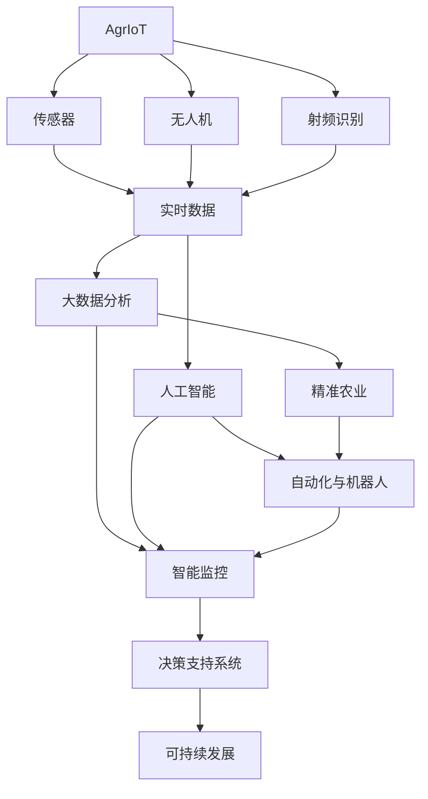

                 

# 全球脑与农业革命:智慧种植的未来

> 关键词：智慧农业,农业物联网,人工智能,大数据,精准农业,自动化,机器人技术,智能监控,农作物生长预测,决策支持系统,可持续发展

## 1. 背景介绍

### 1.1 问题由来

在全球人口不断增长和环境压力日益加大的背景下，保障食物安全和促进可持续发展成为各国政府和农业产业面临的重大挑战。传统的农业生产方式面临资源消耗大、生产效率低、抗风险能力弱等问题，急需通过技术创新和模式变革来实现变革。

随着人工智能、物联网、大数据等技术的飞速发展，智慧农业（Agricultural Robotics and Internet of Things, AgrIoT）成为引领农业生产方式变革的重要方向。智慧农业通过集成多种现代信息技术，构建智能农业系统，实现精准农业生产、病虫害防治、农产品质量监控等应用，大幅提高农业生产效率和资源利用率，提升农业抗风险能力。

### 1.2 问题核心关键点

智慧农业的核心在于利用先进技术手段，实现对农业生产的智能化管理。其主要技术内容包括：

1. **农业物联网**：通过传感器、卫星定位、无人机等手段实时监控土壤、气候、作物生长状态等，提供精准的农业数据支持。
2. **大数据分析**：整合海量农业数据，通过机器学习、深度学习等算法进行分析预测，为农业决策提供科学依据。
3. **人工智能**：利用机器视觉、自然语言处理等技术，提升农产品质量检测、病虫害识别、农机自动化等应用效果。
4. **精准农业**：通过土壤、气候、作物基因等数据，实现对农业生产的精细化管理，提高资源利用效率和产量。
5. **自动化与机器人技术**：采用农用机器人、自动灌溉、播种、收割等设备，实现农业生产的自动化和无人化。
6. **智能监控与决策支持**：基于实时数据和多源信息，构建智能监控系统和决策支持系统，辅助农业生产管理和风险预测。
7. **可持续发展**：结合环境、气候等数据，优化农业生产方式，推动农业绿色低碳发展。

智慧农业技术的成功应用，不仅能显著提升农业生产效率和产量，还能有效缓解资源短缺和环境压力，是实现农业可持续发展的关键路径。

## 2. 核心概念与联系

### 2.1 核心概念概述

智慧农业涉及多个核心技术概念，下面对其中的主要概念进行概述：

- **农业物联网（AgrIoT）**：通过传感器、射频识别、卫星定位、无人机等技术手段，实现对农业生产环境、作物生长状态等的实时监控和管理。
- **大数据分析**：利用大数据技术对农业生产、市场、环境等海量数据进行存储、处理和分析，为农业决策提供科学依据。
- **人工智能（AI）**：采用机器学习、深度学习、自然语言处理等技术，提升农业生产中的数据分析、图像识别、语音识别等能力。
- **精准农业**：基于精确数据和智能化决策，实现对农业生产的精细化管理，提高资源利用效率和产量。
- **自动化与机器人技术**：采用自动化设备和机器人技术，实现农业生产的自动化和无人化，提升生产效率和劳动条件。
- **智能监控与决策支持**：基于实时数据和智能算法，构建智能监控系统和决策支持系统，辅助农业生产管理和风险预测。
- **可持续发展**：结合环境、气候等数据，优化农业生产方式，推动农业绿色低碳发展。

这些概念之间存在紧密的联系，共同构成了智慧农业的技术体系。通过物联网和传感器技术获取实时数据，利用大数据和人工智能技术进行分析和预测，结合精准农业和自动化技术实现生产管理的精细化，最终通过智能监控和决策支持系统辅助生产决策，实现农业生产的智能化和可持续发展。

### 2.2 核心概念原理和架构的 Mermaid 流程图(Mermaid 流程节点中不要有括号、逗号等特殊字符)



这个Mermaid流程图展示了智慧农业技术体系的基本架构和流程。物联网技术通过传感器、无人机等获取实时数据，大数据分析对这些数据进行存储和处理，人工智能技术进行数据挖掘和分析，精准农业实现生产管理的精细化，自动化与机器人技术实现生产自动化，智能监控和决策支持系统辅助生产决策，最终推动农业绿色低碳发展。

## 3. 核心算法原理 & 具体操作步骤

### 3.1 算法原理概述

智慧农业中的核心算法主要围绕数据采集、数据分析和智能决策展开。以下是对这些算法的概述：

- **数据采集算法**：利用传感器、无人机、卫星定位等技术，实现对农业生产环境、作物生长状态等的实时监控和管理。
- **数据分析算法**：采用机器学习、深度学习、大数据分析等技术，对采集到的农业数据进行存储、处理和分析，提取有用信息。
- **智能决策算法**：结合数据分析结果和农业生产经验，构建决策支持系统，辅助农业生产管理和风险预测。

### 3.2 算法步骤详解

智慧农业的算法步骤主要包括以下几个环节：

1. **数据采集**：
   - 部署传感器、无人机、摄像头等设备，采集土壤、气候、作物生长状态等数据。
   - 使用卫星定位技术获取精准的地理位置信息。
   - 将采集到的数据实时传输至中央服务器或云平台。

2. **数据处理**：
   - 对采集到的数据进行清洗、去重、补全等预处理操作。
   - 使用大数据技术对数据进行存储和管理。
   - 采用机器学习、深度学习等算法对数据进行分析和建模。

3. **数据分析**：
   - 利用数据挖掘技术从海量数据中提取有用信息。
   - 构建统计模型和预测模型，对农业生产进行分析和预测。
   - 采用自然语言处理技术对文本数据进行分析和理解。

4. **智能决策**：
   - 结合数据分析结果和农业生产经验，构建决策支持系统。
   - 使用强化学习等技术对农业生产进行优化和调整。
   - 通过智能监控系统实时监控农业生产过程，及时发现和解决问题。

5. **应用部署**：
   - 将智能决策结果反馈到农业生产系统中，实现自动化和智能化管理。
   - 使用机器人技术实现农机自动化和无人化操作。
   - 集成AI技术，提升农产品质量检测、病虫害识别等应用效果。

### 3.3 算法优缺点

智慧农业中的算法具有以下优点：

1. **提高生产效率**：通过自动化和智能化管理，大幅提升农业生产效率和产量。
2. **资源利用率提高**：通过精准农业和智能决策，提高资源利用效率，减少资源浪费。
3. **抗风险能力增强**：通过实时监控和数据分析，及时发现和解决问题，提高农业抗风险能力。
4. **提升决策科学性**：通过大数据分析和智能决策，提供科学依据，提升农业决策的科学性和准确性。

但智慧农业算法也存在一些缺点：

1. **技术门槛高**：智慧农业技术涉及多个领域，技术复杂度较高，需要专业知识和技能。
2. **数据质量要求高**：采集和处理的数据质量直接影响算法的准确性和效果。
3. **设备成本高**：高精度的传感器、无人机等设备成本较高，需大规模投入。
4. **模型泛化能力有限**：智慧农业算法多基于特定场景的数据训练，模型泛化能力有限，难以应对复杂多变的农业生产环境。

### 3.4 算法应用领域

智慧农业技术在多个领域中得到了广泛应用，包括但不限于以下几个方面：

- **精准农业**：通过土壤、气候、作物基因等数据，实现对农业生产的精细化管理，提高资源利用效率和产量。
- **病虫害防治**：利用机器视觉和图像识别技术，实时监控和识别病虫害，进行及时防治。
- **农产品质量检测**：通过图像识别、光谱分析等技术，实现对农产品质量的快速检测和分级。
- **智能灌溉系统**：通过实时监控土壤湿度和作物生长状态，实现精准灌溉，减少水资源浪费。
- **农机自动化**：采用自动化设备和机器人技术，实现农业生产的自动化和无人化，提升生产效率和劳动条件。
- **智能监控与决策支持**：基于实时数据和智能算法，构建智能监控系统和决策支持系统，辅助农业生产管理和风险预测。

## 4. 数学模型和公式 & 详细讲解 & 举例说明

### 4.1 数学模型构建

智慧农业的数学模型主要基于机器学习和深度学习技术。以下是一个简单的农业数据预测模型的数学模型构建：

假设采集到农业数据 $D=\{x_i, y_i\}_{i=1}^N$，其中 $x_i$ 表示第 $i$ 次采集到的特征数据，$y_i$ 表示对应的产量数据。目标是构建一个预测模型 $f(x)$，使得预测值 $\hat{y}=f(x)$ 与实际值 $y$ 尽可能接近。常用的预测模型包括线性回归、决策树、随机森林、支持向量机等。

### 4.2 公式推导过程

以线性回归模型为例，其公式推导过程如下：

设预测模型为线性回归模型：

$$
f(x) = \beta_0 + \beta_1 x_1 + \beta_2 x_2 + \ldots + \beta_p x_p
$$

其中，$\beta_0$ 为截距，$\beta_1, \beta_2, \ldots, \beta_p$ 为特征系数。

假设模型训练误差为 $e_i=y_i-f(x_i)$，则模型训练的目标是最小化平均误差 $E=\frac{1}{N}\sum_{i=1}^N e_i^2$。

利用最小二乘法，求解 $\beta_0, \beta_1, \beta_2, \ldots, \beta_p$，使得 $E$ 最小化：

$$
\min_{\beta_0, \beta_1, \ldots, \beta_p} E
$$

将 $e_i=y_i-f(x_i)$ 带入，得：

$$
E = \frac{1}{N}\sum_{i=1}^N (y_i - (\beta_0 + \beta_1 x_{i1} + \beta_2 x_{i2} + \ldots + \beta_p x_{ip}))^2
$$

通过求解 $\beta_0, \beta_1, \beta_2, \ldots, \beta_p$，使上式最小化，即可得到线性回归模型的参数。

### 4.3 案例分析与讲解

以农业生产中常见的天气预测为例，采用线性回归模型进行天气与产量的关系分析：

假设采集到农业生产中的气候数据 $x_i=(降水, 气温, 光照, \ldots)$，产量数据 $y_i$，构建线性回归模型：

$$
f(x) = \beta_0 + \beta_1 \text{降水} + \beta_2 \text{气温} + \beta_3 \text{光照} + \ldots
$$

通过最小二乘法求解 $\beta_0, \beta_1, \beta_2, \beta_3, \ldots$，得到预测模型 $f(x)$。

将新的天气数据 $x_{new}=(\text{降水}_{new}, \text{气温}_{new}, \text{光照}_{new}, \ldots)$ 带入模型，得到预测产量 $\hat{y}_{new}=f(x_{new})$。

### 4.4 案例分析与讲解

以智能灌溉系统的控制为例，采用机器学习模型进行灌溉优化：

假设采集到土壤湿度、气温、作物生长状态等数据 $x_i=(土壤湿度, 气温, 作物状态, \ldots)$，灌溉量数据 $y_i$，构建机器学习模型：

- 使用随机森林或决策树算法，对 $x_i$ 和 $y_i$ 进行建模，得到预测模型 $f(x)$。
- 将新的数据 $x_{new}$ 带入模型，得到预测灌溉量 $\hat{y}_{new}=f(x_{new})$。
- 根据预测结果，实时调整灌溉系统，实现精准灌溉。

## 5. 项目实践：代码实例和详细解释说明

### 5.1 开发环境搭建

智慧农业项目开发需要依托于高可靠性的云计算平台和先进的大数据处理能力。以下是在AWS上进行智慧农业项目开发的典型环境配置流程：

1. 创建Amazon EC2实例，选择高性能计算型（Compute Optimized）的实例类型。
2. 安装所需的软硬件环境，包括操作系统、Python、Jupyter Notebook、TensorFlow等。
3. 安装必要的第三方库和工具，如Pandas、NumPy、TensorFlow、PyTorch、Keras等。
4. 连接至Amazon S3存储桶，读取和存储农业数据。
5. 安装Amazon EMR（Elastic MapReduce），进行大数据处理和分析。

完成上述步骤后，即可在EC2实例上启动智慧农业项目的开发环境。

### 5.2 源代码详细实现

以下是一个使用TensorFlow进行农业数据预测的代码实现：

```python
import tensorflow as tf
import pandas as pd
import numpy as np

# 读取数据
data = pd.read_csv('agriculture_data.csv')

# 数据预处理
features = data.drop('yield', axis=1)
target = data['yield']
features = np.array(features)
target = np.array(target)

# 划分训练集和测试集
train_features = features[:int(0.8*len(features))]
train_target = target[:int(0.8*len(target))]
test_features = features[int(0.8*len(features)):]
test_target = target[int(0.8*len(target)):]

# 构建模型
model = tf.keras.Sequential([
    tf.keras.layers.Dense(64, activation='relu', input_shape=(features.shape[1],)),
    tf.keras.layers.Dense(64, activation='relu'),
    tf.keras.layers.Dense(1)
])

# 编译模型
model.compile(optimizer=tf.keras.optimizers.Adam(0.01), loss='mse')

# 训练模型
model.fit(train_features, train_target, epochs=100, batch_size=32, validation_split=0.2)

# 测试模型
predictions = model.predict(test_features)
```

### 5.3 代码解读与分析

- **数据读取和预处理**：通过Pandas库读取CSV文件，使用Numpy数组对数据进行标准化处理，并划分训练集和测试集。
- **模型构建**：使用TensorFlow搭建三层神经网络模型，其中第一层和第二层使用ReLU激活函数，最后一层输出单值预测结果。
- **模型编译**：使用Adam优化器和均方误差损失函数进行模型编译。
- **模型训练**：在训练集上使用随机梯度下降算法进行模型训练，设置100个epoch和32个batch size，并使用验证集进行性能评估。
- **模型测试**：在测试集上进行模型预测，对比预测结果和实际产量。

## 6. 实际应用场景

### 6.1 智能灌溉系统

智能灌溉系统是智慧农业中的重要应用之一，通过实时监控土壤湿度、气温等数据，实现精准灌溉，减少水资源浪费。以下是一个智能灌溉系统的实际应用案例：

1. **数据采集**：通过土壤湿度传感器、气温传感器等设备，实时采集土壤湿度、气温等数据。
2. **数据传输**：将采集到的数据通过GPRS或Wi-Fi传输至中央服务器或云平台。
3. **数据分析**：在服务器上使用机器学习模型对数据进行分析和预测，得到最优灌溉方案。
4. **控制灌溉**：根据预测结果，自动调整灌溉系统，实现精准灌溉。

### 6.2 病虫害防治

病虫害防治是智慧农业中的另一项重要应用，通过图像识别和数据分析，实时监控和识别病虫害，进行及时防治。以下是一个病虫害防治系统的实际应用案例：

1. **数据采集**：通过摄像头、无人机等设备，实时采集作物图像数据。
2. **数据处理**：对采集到的图像数据进行预处理，如去噪、增强等，得到清晰的图像数据。
3. **病虫害识别**：使用深度学习模型对图像数据进行识别，判断是否存在病虫害。
4. **防治措施**：根据识别结果，自动调整防治方案，如喷药、施肥等，实现及时防治。

### 6.3 智能收获系统

智能收获系统通过机器视觉和图像识别技术，实时监控作物生长状态，自动控制收割机，提高收获效率和作物品质。以下是一个智能收获系统的实际应用案例：

1. **数据采集**：通过无人机或摄像头，实时采集作物生长图像数据。
2. **数据处理**：对采集到的图像数据进行预处理，如去噪、增强等，得到清晰的图像数据。
3. **作物识别**：使用深度学习模型对图像数据进行识别，判断作物的成熟度。
4. **自动收割**：根据识别结果，自动控制收割机，实现高效、精准的收割。

## 7. 工具和资源推荐

### 7.1 学习资源推荐

为了帮助开发者系统掌握智慧农业的开发技能，以下是一些优质的学习资源：

1. **《智慧农业技术与应用》**：系统介绍智慧农业的核心技术和应用场景，适合初学者入门。
2. **《农业物联网技术与应用》**：详细讲解物联网技术在农业中的应用，涵盖传感器、无人机、智能设备等。
3. **《深度学习在农业中的应用》**：深入探讨深度学习算法在智慧农业中的实际应用，包括图像识别、数据分析等。
4. **Coursera《农业数据分析》课程**：斯坦福大学开设的农业数据分析课程，涵盖数据采集、处理和分析等关键技术。
5. **Udacity《农业机器学习》纳米学位**：提供农业数据科学、机器学习等领域的深入学习，适合进阶开发者。

### 7.2 开发工具推荐

高效的开发离不开优秀的工具支持。以下是几款用于智慧农业开发的常用工具：

1. **AWS**：提供高可靠性的云计算平台，适合大规模数据处理和存储。
2. **TensorFlow**：强大的深度学习框架，适合构建智慧农业中的预测和识别模型。
3. **Keras**：高层次的神经网络API，易于上手，适合快速搭建智慧农业项目。
4. **Amazon EMR**：Elastic MapReduce，适合大规模数据处理和分析，适合智慧农业中复杂的数据处理需求。
5. **Jupyter Notebook**：交互式的编程环境，适合数据探索、模型调试和可视化展示。

### 7.3 相关论文推荐

智慧农业技术的发展源于学界的持续研究。以下是几篇奠基性的相关论文，推荐阅读：

1. **《基于物联网的智能灌溉系统》**：介绍基于物联网的智能灌溉系统的设计和实现，展示了其应用效果。
2. **《深度学习在农业中的潜在应用》**：探讨深度学习算法在农业中的潜在应用，包括图像识别、数据分析等。
3. **《农业机器学习》**：综述机器学习在农业中的应用，涵盖数据采集、特征提取、模型训练等关键技术。
4. **《农业物联网技术进展》**：介绍农业物联网技术的发展现状和未来趋势，涵盖传感器、无人机、智能设备等。

## 8. 总结：未来发展趋势与挑战

### 8.1 总结

本文对智慧农业技术进行了全面系统的介绍。首先阐述了智慧农业技术在农业生产中的重要性，明确了智慧农业技术的核心概念和应用场景。其次，从原理到实践，详细讲解了智慧农业中的关键算法和技术，给出了智慧农业项目开发的完整代码实例。同时，本文还广泛探讨了智慧农业技术在智能灌溉、病虫害防治、智能收获等领域的实际应用，展示了智慧农业技术的广泛前景。

通过本文的系统梳理，可以看到，智慧农业技术正在成为农业生产方式变革的重要方向，极大地提升农业生产效率和资源利用率，为农业可持续发展提供了新路径。未来，伴随智慧农业技术的不断演进，农业生产将迎来智能化、自动化、绿色低碳的全面变革。

### 8.2 未来发展趋势

展望未来，智慧农业技术将呈现以下几个发展趋势：

1. **物联网技术的普及**：随着物联网技术的不断成熟和成本降低，智慧农业中的传感器、无人机等设备将进一步普及，实时数据采集和处理能力将大幅提升。
2. **人工智能技术的深入应用**：机器学习、深度学习等人工智能技术将在智慧农业中得到更广泛应用，提升农业生产的智能化水平。
3. **大数据技术的融合**：智慧农业将进一步融合大数据技术，实现对海量农业数据的深度挖掘和分析，提升决策科学性和准确性。
4. **自动化和机器人技术的突破**：智能机器人、自动化设备将进一步发展，实现农业生产的完全自动化和无人化。
5. **智能监控与决策支持系统的优化**：智能监控和决策支持系统将不断优化，提升农业生产的智能化管理和风险预测能力。
6. **绿色低碳发展的推动**：智慧农业技术将推动农业绿色低碳发展，实现可持续发展。

以上趋势凸显了智慧农业技术的广阔前景。这些方向的探索发展，必将进一步提升农业生产效率和产量，实现农业的可持续发展。

### 8.3 面临的挑战

尽管智慧农业技术已经取得了瞩目成就，但在迈向更加智能化、普适化应用的过程中，它仍面临着诸多挑战：

1. **技术门槛高**：智慧农业技术涉及多个领域，技术复杂度较高，需要专业知识和技能。
2. **数据质量要求高**：采集和处理的数据质量直接影响算法的准确性和效果。
3. **设备成本高**：高精度的传感器、无人机等设备成本较高，需大规模投入。
4. **模型泛化能力有限**：智慧农业算法多基于特定场景的数据训练，模型泛化能力有限，难以应对复杂多变的农业生产环境。
5. **安全性问题**：智能设备和系统可能面临安全漏洞和数据泄露风险。

### 8.4 研究展望

面对智慧农业面临的挑战，未来的研究需要在以下几个方面寻求新的突破：

1. **降低技术门槛**：通过教育培训、开源项目等方式，降低智慧农业技术的学习门槛，推动技术普及。
2. **提升数据质量**：开发高质量的数据采集和处理工具，提高数据采集和处理效率。
3. **优化设备成本**：开发低成本、高精度的农业设备，降低智慧农业的初始投资。
4. **增强模型泛化能力**：研发跨领域、跨场景的智慧农业算法，提升算法的泛化能力。
5. **保障数据安全**：开发安全可靠的系统架构和协议，保障数据和设备安全。
6. **推动绿色低碳发展**：结合环境、气候等数据，优化农业生产方式，推动农业绿色低碳发展。

## 9. 附录：常见问题与解答

### Q1: 什么是智慧农业？

**A:** 智慧农业是指利用物联网、大数据、人工智能等现代信息技术手段，实现对农业生产的智能化管理。智慧农业通过实时监控和数据分析，优化农业生产过程，提高资源利用效率和产量，推动农业绿色低碳发展。

### Q2: 智慧农业技术包括哪些核心技术？

**A:** 智慧农业技术主要包括物联网、大数据、人工智能、机器学习、深度学习等技术。其中，物联网技术用于实时数据采集和传输，大数据技术用于海量数据存储和处理，人工智能技术用于数据分析和模型训练，机器学习和深度学习技术用于模型构建和智能决策。

### Q3: 智慧农业的应用场景有哪些？

**A:** 智慧农业的应用场景包括智能灌溉、病虫害防治、智能收获、智能监控与决策支持等。通过智慧农业技术，可以实现精准农业生产、病虫害实时监控、农产品质量检测、智能灌溉系统等，大幅提升农业生产效率和资源利用率，推动农业可持续发展。

### Q4: 智慧农业的开发环境有哪些？

**A:** 智慧农业开发环境通常需要依托于高可靠性的云计算平台和大数据处理能力。常用的开发环境包括AWS、Microsoft Azure、Google Cloud等云平台，以及本地服务器等。

### Q5: 智慧农业的未来发展趋势是什么？

**A:** 智慧农业的未来发展趋势包括物联网技术的普及、人工智能技术的深入应用、大数据技术的融合、自动化和机器人技术的突破、智能监控与决策支持系统的优化、绿色低碳发展的推动等。这些趋势将进一步提升农业生产效率和产量，实现农业的可持续发展。

---

作者：禅与计算机程序设计艺术 / Zen and the Art of Computer Programming

