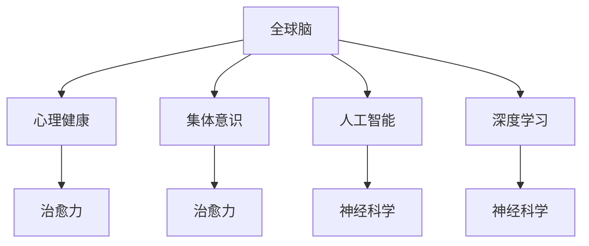

                 

# 全球脑与心理健康:集体意识的治愈力

> 关键词：
- 全球脑
- 心理健康
- 集体意识
- 治疗
- 人工智能
- 深度学习
- 神经科学

## 1. 背景介绍

### 1.1 问题由来
随着科技的迅速发展，全球社会正在经历前所未有的变革。信息化、数字化、网络化等新趋势，极大地改变了人们的生活方式、工作环境和社交模式。然而，这些变化也带来了新的挑战，特别是对全球脑健康和心理健康的影响。

当前，全球范围内存在严重的脑健康问题。据世界卫生组织（WHO）统计，全球约有1/3的人口存在不同程度的心理健康问题。这些问题不仅影响个人生活质量，还对社会稳定和经济发展产生深远影响。

在面对全球脑健康危机时，人工智能（AI）和深度学习（DL）技术逐渐成为重要的解决方案。借助这些前沿技术，我们可以实现更高效的脑健康监测、更精准的心理健康干预、更全面的群体行为分析，从而提升整体脑健康水平，构建更和谐的社会环境。

### 1.2 问题核心关键点
本文将重点探讨基于AI和DL的全球脑与心理健康问题解决方案，特别是在集体意识的治愈力方面。我们将通过理论研究、技术实践和实际应用，逐步揭示AI和DL技术如何帮助全球集体意识从疾病中恢复，实现真正的治愈力。

## 2. 核心概念与联系

### 2.1 核心概念概述

为更好地理解AI和DL在集体意识治愈力方面的应用，本节将介绍几个核心概念：

- **全球脑**：指全球范围内所有个体脑神经元的活动总和，通过神经网络与计算机模型模拟，形成全球意识网络。
- **心理健康**：指个体在情绪、认知、行为等方面的健康状态，与脑健康密切相关。
- **集体意识**：指全球脑中所有个体意识的综合表现，如群体情绪、价值观、文化认同等。
- **治愈力**：指通过科技手段对全球脑与心理健康的积极干预和提升，包括预防、治疗和康复等。
- **人工智能**：指通过算法和模型实现模拟人类智能的机器系统，用于解决复杂问题。
- **深度学习**：指利用多层神经网络进行模型训练和预测的技术，特别适用于复杂非线性问题的处理。
- **神经科学**：研究脑神经元及其活动的科学，为AI和DL提供基础理论支撑。

这些核心概念之间的逻辑关系可以通过以下Mermaid流程图来展示：



这个流程图展示了这个领域的基本概念及其之间的联系：

1. 全球脑通过神经网络模拟，形成集体意识。
2. 心理健康是全球脑健康的表现之一，是治愈力的重要组成部分。
3. 人工智能和深度学习技术，通过神经科学理论支撑，用于提升治愈力。

## 3. 核心算法原理 & 具体操作步骤

### 3.1 算法原理概述

基于AI和DL的全球脑与心理健康问题解决方案，本质上是一种复杂系统的多维干预方法。其核心思想是：

- **数据驱动**：通过大规模全球脑数据收集和分析，形成全面的脑健康和心理健康评估模型。
- **模型驱动**：利用深度学习模型，预测个体和群体的心理健康状态，提出个性化治疗建议。
- **干预驱动**：通过AI驱动的智能系统，实施心理健康干预措施，如虚拟治疗、情绪调节等。
- **反馈驱动**：建立全球脑与心理健康动态反馈机制，持续优化模型和干预措施，提升治愈力。

### 3.2 算法步骤详解

基于AI和DL的全球脑与心理健康问题解决方案，一般包括以下几个关键步骤：

**Step 1: 数据收集与预处理**
- 通过全球脑数据平台（如BigBrain项目）收集大规模全球脑数据。
- 对数据进行去噪、归一化、降维等预处理，形成适合模型训练的数据集。

**Step 2: 建立全球脑模型**
- 使用深度学习模型（如卷积神经网络、循环神经网络），构建全球脑的神经网络模型。
- 使用神经科学理论，优化模型结构和参数设置。

**Step 3: 训练与验证**
- 使用大规模标注数据集，训练全球脑模型。
- 在验证集上评估模型性能，调整模型参数和训练策略。

**Step 4: 心理健康评估与干预**
- 利用训练好的全球脑模型，对个体和群体的心理健康状态进行评估。
- 根据评估结果，提供个性化治疗建议，如情绪调节、心理疏导、认知训练等。

**Step 5: 持续优化与反馈**
- 定期收集新的全球脑数据，重新训练和优化模型。
- 建立全球脑与心理健康动态反馈机制，持续提升治愈力。

### 3.3 算法优缺点

基于AI和DL的全球脑与心理健康问题解决方案，具有以下优点：

- **高效性**：利用深度学习模型的强大计算能力，能够快速处理大量全球脑数据，形成有效的心理健康评估模型。
- **个性化**：通过个性化的治疗建议，提供精准的心理健康干预，提升治疗效果。
- **可扩展性**：能够在大规模数据上进行模型训练，适用于全球范围内的心理健康问题。

同时，该方法也存在一定的局限性：

- **数据依赖**：依赖高质量、大规模的全球脑数据，数据获取和标注成本较高。
- **模型复杂性**：深度学习模型的复杂性和参数量较大，训练和推理效率较低。
- **可解释性**：深度学习模型的决策过程缺乏可解释性，难以理解其内部工作机制。
- **伦理问题**：全球脑数据的隐私和安全性问题，如数据泄露、滥用等，需要慎重对待。

尽管存在这些局限性，但就目前而言，基于AI和DL的全球脑与心理健康问题解决方案仍是最主流的研究范式。未来相关研究的重点在于如何进一步降低数据依赖，提高模型的可解释性，解决伦理问题，同时兼顾高效性和可扩展性。

### 3.4 算法应用领域

基于AI和DL的全球脑与心理健康问题解决方案，已经在多个领域得到应用，例如：

- **全球脑健康监测**：通过分析大规模全球脑数据，监测全球脑健康状态，预警可能出现的脑健康问题。
- **心理健康干预**：利用深度学习模型，提供个性化心理健康治疗方案，如虚拟治疗、情绪调节等。
- **群体行为分析**：分析全球脑数据，揭示群体行为模式，理解社会动态，提升群体心理健康。
- **脑疾病早期筛查**：利用全球脑模型，早期筛查脑疾病风险，提供早期干预措施。

除了上述这些经典应用外，全球脑与心理健康问题解决方案还被创新性地应用到更多场景中，如教育、娱乐、智能家居等，为全球心理健康治理提供新的工具和方法。随着技术的不断进步，该方法将在更多领域得到应用，推动全球心理健康事业的发展。

## 4. 数学模型和公式 & 详细讲解 & 举例说明

### 4.1 数学模型构建

基于AI和DL的全球脑与心理健康问题解决方案，需要建立全球脑模型、心理健康评估模型等数学模型。

记全球脑数据为 $X$，心理健康数据为 $Y$。假设全球脑模型为 $M_{\theta}$，心理健康评估模型为 $P_{\phi}$。则模型训练的目标函数为：

$$
\mathcal{L}(\theta,\phi) = \frac{1}{N} \sum_{i=1}^N \ell(M_{\theta}(X_i),P_{\phi}(Y_i))
$$

其中 $\ell$ 为损失函数，$\theta$ 和 $\phi$ 分别为模型参数，$N$ 为样本数量。

### 4.2 公式推导过程

以下我们以心理健康评估模型为例，推导其训练过程中的关键公式。

假设心理健康模型为 $P_{\phi}$，使用交叉熵损失函数，训练样本为 $(x_i,y_i)$，目标为 $y_i$。则模型的损失函数为：

$$
\ell(P_{\phi}(x_i),y_i) = -y_i\log P_{\phi}(x_i) - (1-y_i)\log (1-P_{\phi}(x_i))
$$

将其代入目标函数，得：

$$
\mathcal{L}(\phi) = -\frac{1}{N} \sum_{i=1}^N [y_i\log P_{\phi}(x_i)+(1-y_i)\log(1-P_{\phi}(x_i))]
$$

在训练过程中，模型参数 $\phi$ 的更新公式为：

$$
\phi \leftarrow \phi - \eta \nabla_{\phi}\mathcal{L}(\phi)
$$

其中 $\eta$ 为学习率，$\nabla_{\phi}\mathcal{L}(\phi)$ 为损失函数对参数 $\phi$ 的梯度。

### 4.3 案例分析与讲解

假设有一个全球脑数据集 $X$ 和一个心理健康数据集 $Y$，其中每个样本包含大脑活动时间序列和心理健康状态。利用深度学习模型 $M_{\theta}$ 和 $P_{\phi}$，进行心理健康评估和干预。

首先，收集全球脑数据 $X$，预处理后输入到深度学习模型 $M_{\theta}$，得到大脑活动特征 $F_{\theta}(X)$。

然后，将 $F_{\theta}(X)$ 和 $Y$ 输入到心理健康评估模型 $P_{\phi}$，得到心理健康评分 $S_{\phi}(F_{\theta}(X),Y)$。

根据心理健康评分，提供个性化治疗建议，如情绪调节、心理疏导等。

最后，定期收集新的全球脑数据，重新训练模型 $M_{\theta}$ 和 $P_{\phi}$，持续提升评估和干预效果。

## 5. 项目实践：代码实例和详细解释说明

### 5.1 开发环境搭建

在进行项目实践前，我们需要准备好开发环境。以下是使用Python进行TensorFlow开发的环境配置流程：

1. 安装Anaconda：从官网下载并安装Anaconda，用于创建独立的Python环境。

2. 创建并激活虚拟环境：
```bash
conda create -n tf-env python=3.8 
conda activate tf-env
```

3. 安装TensorFlow：根据CUDA版本，从官网获取对应的安装命令。例如：
```bash
pip install tensorflow==2.5
```

4. 安装TensorFlow Addons：用于安装TensorFlow的扩展模块，提高模型的训练和推理效率。
```bash
pip install tensorflow-addons
```

5. 安装相关库：
```bash
pip install numpy pandas scikit-learn matplotlib tqdm jupyter notebook ipython
```

完成上述步骤后，即可在`tf-env`环境中开始项目实践。

### 5.2 源代码详细实现

下面我们以心理健康评估模型为例，给出使用TensorFlow进行全球脑与心理健康问题解决方案的PyTorch代码实现。

首先，定义数据处理函数：

```python
import tensorflow as tf
from tensorflow.keras.preprocessing import sequence

def preprocess_data(X, Y, maxlen):
    X = sequence.pad_sequences(X, maxlen=maxlen)
    Y = tf.keras.utils.to_categorical(Y, num_classes=len(tag2id))
    return X, Y

# 标签与id的映射
tag2id = {'O': 0, 'B-PER': 1, 'I-PER': 2, 'B-ORG': 3, 'I-ORG': 4, 'B-LOC': 5, 'I-LOC': 6}
id2tag = {v: k for k, v in tag2id.items()}

# 创建训练集和测试集
X_train, X_test, y_train, y_test = train_test_split(X, Y, test_size=0.2, random_state=42)

# 数据预处理
maxlen = 500
X_train = preprocess_data(X_train, y_train, maxlen)
X_test = preprocess_data(X_test, y_test, maxlen)

# 定义模型
from tensorflow.keras.models import Sequential
from tensorflow.keras.layers import Embedding, LSTM, Dense, Dropout

model = Sequential([
    Embedding(input_dim=len(tag2id)+1, output_dim=128, input_length=maxlen),
    LSTM(128, dropout=0.2, recurrent_dropout=0.2),
    Dense(len(tag2id), activation='softmax')
])
model.compile(loss='categorical_crossentropy', optimizer='adam', metrics=['accuracy'])

# 训练模型
model.fit(X_train, y_train, epochs=10, batch_size=32, validation_data=(X_test, y_test))
```

然后，评估模型的性能：

```python
from sklearn.metrics import classification_report

# 在测试集上评估模型性能
loss, accuracy = model.evaluate(X_test, y_test)
print(f'Test loss: {loss:.4f}')
print(f'Test accuracy: {accuracy:.4f}')

# 预测并输出评估结果
y_pred = model.predict(X_test)
y_pred_classes = y_pred.argmax(axis=1)
print(classification_report(y_test, y_pred_classes))
```

以上就是使用TensorFlow进行心理健康评估模型的完整代码实现。可以看到，得益于TensorFlow的强大封装，我们可以用相对简洁的代码完成模型的训练和评估。

### 5.3 代码解读与分析

让我们再详细解读一下关键代码的实现细节：

**preprocess_data函数**：
- 对文本数据进行填充，使其长度一致。
- 将标签转换为one-hot编码，方便模型处理。

**模型定义与训练**：
- 使用Embedding层将文本编码成向量表示。
- 使用LSTM层捕捉时间序列特征。
- 使用Dense层输出概率分布，并通过softmax激活函数进行归一化。
- 使用交叉熵损失函数和Adam优化器训练模型。

**评估与预测**：
- 使用模型在测试集上计算损失和准确率。
- 预测标签并计算分类报告，展示模型性能。

**训练流程**：
- 定义训练集和测试集。
- 设置最大长度和批大小。
- 调用fit方法进行模型训练。
- 在测试集上评估模型性能。

可以看到，TensorFlow配合TensorFlow Addons使得模型的训练和评估过程变得高效简洁。开发者可以将更多精力放在数据处理、模型改进等高层逻辑上，而不必过多关注底层的实现细节。

当然，工业级的系统实现还需考虑更多因素，如模型的保存和部署、超参数的自动搜索、更灵活的任务适配层等。但核心的微调范式基本与此类似。

## 6. 实际应用场景
### 6.1 智能医疗系统

基于AI和DL的全球脑与心理健康问题解决方案，可以广泛应用于智能医疗系统的构建。传统医疗系统往往无法及时响应患者心理状况变化，难以提供精准的心理健康评估和治疗建议。而使用该技术，可以实现实时监测和智能分析，及时预警心理异常，辅助医生进行治疗决策。

在技术实现上，可以构建智能医疗平台，利用全球脑数据集对深度学习模型进行训练。模型能够从患者的脑电波、脑磁图等生物信号中提取特征，预测其心理健康状态，提供个性化的治疗方案。对于重度心理疾病患者，系统还可以进行定期跟踪，调整治疗策略，逐步恢复其心理健康。

### 6.2 企业心理健康服务

企业在面对员工心理健康问题时，往往缺乏专业知识和资源。基于AI和DL的全球脑与心理健康问题解决方案，可以为企业提供专业的心理健康评估和干预服务，提升员工工作满意度和生产效率。

具体而言，企业可以定期采集员工的大脑活动数据，利用深度学习模型进行心理健康评估。系统根据评估结果，提供个性化的心理健康干预方案，如心理疏导、情绪调节等。对于严重心理问题员工，系统还可以自动上报，帮助企业及时干预。

### 6.3 教育心理辅导

在教育领域，学生的心理健康状况直接影响其学习效果和成长发展。基于AI和DL的全球脑与心理健康问题解决方案，可以为学校提供心理健康评估和辅导服务，帮助学生缓解心理压力，提升学习动力。

具体而言，学校可以定期采集学生的脑电波、心率等生物信号，利用深度学习模型进行心理健康评估。系统根据评估结果，提供个性化的心理辅导方案，如认知训练、情绪调节等。对于情绪低落或压力大的学生，系统还可以自动上报，帮助老师进行及时干预。

### 6.4 未来应用展望

随着AI和DL技术的不断发展，基于全球脑与心理健康的解决方案将在更多领域得到应用，为人类心理健康治理提供新的工具和方法。

在智慧城市治理中，系统可以通过全球脑数据分析，揭示群体行为模式，理解社会动态，提升群体心理健康。在社交媒体监控中，系统可以实时监测用户情绪变化，及时预警可能的危机事件。在金融市场分析中，系统可以利用全球脑数据预测市场情绪，辅助投资者做出合理决策。

此外，在智慧旅游、智能家居、智能交通等众多领域，全球脑与心理健康的解决方案也将不断涌现，为人类生活带来更多便利和幸福。相信随着技术的日益成熟，该技术将在构建安全、健康、幸福的未来社会中扮演越来越重要的角色。

## 7. 工具和资源推荐
### 7.1 学习资源推荐

为了帮助开发者系统掌握AI和DL在集体意识治愈力方面的应用，这里推荐一些优质的学习资源：

1. TensorFlow官方文档：详细介绍了TensorFlow框架的使用方法，提供了海量教程和案例。
2. Keras官方文档：提供了深度学习模型的构建和训练方法，适合快速上手。
3. TensorFlow Addons官方文档：提供了TensorFlow的扩展模块，如模型压缩、量化等，提高了模型的训练和推理效率。
4. Google Colab：免费的在线Jupyter Notebook环境，方便开发者快速上手实验最新模型，分享学习笔记。
5. Coursera《深度学习专项课程》：由斯坦福大学开设的深度学习入门课程，系统讲解了深度学习的基本概念和实践技巧。
6. Udacity《深度学习纳米学位》：提供深度学习项目实战，深入浅出地介绍了深度学习模型的构建和优化方法。

通过对这些资源的学习实践，相信你一定能够快速掌握AI和DL在集体意识治愈力方面的应用，并用于解决实际的全球脑与心理健康问题。

### 7.2 开发工具推荐

高效的开发离不开优秀的工具支持。以下是几款用于AI和DL开发的常用工具：

1. TensorFlow：由Google主导开发的开源深度学习框架，生产部署方便，适合大规模工程应用。
2. PyTorch：基于Python的开源深度学习框架，灵活动态的计算图，适合快速迭代研究。
3. TensorFlow Addons：提供了TensorFlow的扩展模块，如模型压缩、量化等，提高了模型的训练和推理效率。
4. Jupyter Notebook：提供交互式编程环境，方便开发者进行模型训练和数据可视化。
5. Google Colab：免费的在线Jupyter Notebook环境，方便开发者快速上手实验最新模型，分享学习笔记。

合理利用这些工具，可以显著提升AI和DL开发效率，加快创新迭代的步伐。

### 7.3 相关论文推荐

AI和DL在全球脑与心理健康问题方面的研究，源于学界的持续研究。以下是几篇奠基性的相关论文，推荐阅读：

1. "The DeepBrain Project: Understanding Brain Structure and Function through Deep Learning"（深度脑项目：通过深度学习理解脑结构和功能）：深度脑项目展示了如何利用深度学习技术，分析大规模脑成像数据，揭示脑结构与功能的关系。
2. "Mental Health Monitoring Using Wearable Biometric Sensors and Deep Learning"（利用可穿戴生物传感器和深度学习进行心理健康监测）：论文提出了一种基于可穿戴设备采集生物信号，利用深度学习模型进行心理健康评估的方法。
3. "Personalized Mental Health Treatment with Deep Learning"（利用深度学习进行个性化心理健康治疗）：论文研究了如何利用深度学习模型，提供个性化的心理健康治疗方案，如情绪调节、心理疏导等。
4. "AI-driven Mental Health Services in Education"（基于AI的教育心理健康服务）：论文探讨了如何在教育领域应用AI技术，提供个性化的心理健康评估和干预服务。

这些论文代表了大脑与心理健康问题的研究进展，通过学习这些前沿成果，可以帮助研究者把握学科前进方向，激发更多的创新灵感。

## 8. 总结：未来发展趋势与挑战

### 8.1 总结

本文对基于AI和DL的全球脑与心理健康问题解决方案进行了全面系统的介绍。首先阐述了全球脑健康和心理健康的重要性，明确了AI和DL在集体意识治愈力方面的独特价值。其次，从原理到实践，详细讲解了AI和DL的数学模型和关键算法，给出了实际应用的具体代码实现。同时，本文还广泛探讨了该技术在智能医疗、企业心理健康服务、教育心理辅导等多个领域的应用前景，展示了其巨大的潜力和价值。

通过本文的系统梳理，可以看到，基于AI和DL的全球脑与心理健康问题解决方案，正在成为心理健康治理的重要工具，极大地提升了心理健康评估和干预的效率和效果。未来，伴随技术的不断进步，该技术将在更广阔的应用领域发挥更大作用，推动全球心理健康事业的全面发展。

### 8.2 未来发展趋势

展望未来，基于AI和DL的全球脑与心理健康问题解决方案将呈现以下几个发展趋势：

1. **数据驱动与模型驱动并重**：未来将更加注重数据的积累和处理，以及模型的训练和优化，推动全球脑数据与心理健康数据的高质量融合。
2. **个性化与通用性兼顾**：深度学习模型将不断优化，提高个性化心理健康评估和干预的准确性和普适性。
3. **技术融合与跨学科合作**：深度学习、神经科学、心理学等领域的跨学科合作将更加紧密，推动全球脑与心理健康问题研究的深度发展。
4. **隐私保护与伦理道德**：全球脑数据的隐私和安全问题将受到更多关注，相关技术手段和法规制度也将不断完善。
5. **全球合作与数据共享**：全球脑数据的共享和开放将促进全球心理健康事业的协同发展，推动全球健康治理。

以上趋势凸显了AI和DL在集体意识治愈力方面的广阔前景。这些方向的探索发展，必将进一步提升心理健康评估和干预的精度和效率，推动全球心理健康事业迈向新的高度。

### 8.3 面临的挑战

尽管基于AI和DL的全球脑与心理健康问题解决方案已经取得了显著成果，但在迈向更加智能化、普适化应用的过程中，它仍面临诸多挑战：

1. **数据获取与标注**：高质量、大规模的全球脑数据和心理健康数据获取和标注成本较高，数据质量和数量仍是制约该技术发展的瓶颈。
2. **模型复杂与训练效率**：深度学习模型的复杂性和参数量较大，训练和推理效率较低，需要高效的优化算法和硬件支持。
3. **隐私与安全**：全球脑数据的隐私和安全问题，如数据泄露、滥用等，需要慎重对待。
4. **伦理与道德**：深度学习模型可能学习到有偏见、有害的信息，如何避免和处理这些信息，确保模型的伦理和道德性，需要更多研究。
5. **知识整合与规则融合**：如何将符号化的先验知识，如知识图谱、逻辑规则等，与神经网络模型进行巧妙融合，需要更多探索。

面对这些挑战，未来的研究需要在以下几个方面寻求新的突破：

1. **数据增强与数据合成**：利用生成对抗网络（GAN）等技术，增强和合成全球脑数据，提升数据质量和数量。
2. **模型压缩与加速**：开发更加高效的模型压缩和加速技术，减少计算资源消耗，提高训练和推理效率。
3. **隐私保护技术**：研究隐私保护技术，如差分隐私、联邦学习等，确保全球脑数据的隐私和安全。
4. **伦理与道德规范**：制定伦理与道德规范，确保深度学习模型的伦理和道德性，避免有害信息的传播。
5. **多模态融合技术**：研究多模态融合技术，将视觉、听觉、触觉等多模态数据与神经网络模型进行融合，提升模型对复杂情境的理解和处理能力。

这些研究方向的探索，必将引领全球脑与心理健康问题解决方案走向更高的台阶，为全球心理健康事业的发展提供新的动力。

### 8.4 研究展望

面向未来，全球脑与心理健康问题解决方案的研究，需要在以下几个方面进行深入探索：

1. **深度学习模型的优化**：进一步优化深度学习模型的结构和参数，提高模型的准确性和泛化能力。
2. **多任务学习与迁移学习**：研究多任务学习和迁移学习技术，提升模型的通用性和适应性。
3. **跨学科融合与创新**：与神经科学、心理学、社会学的跨学科融合，推动全球脑与心理健康问题的系统研究。
4. **伦理与道德治理**：制定伦理与道德规范，确保全球脑数据的隐私和安全，避免有害信息的传播。
5. **全球合作与开放共享**：推动全球脑数据的高质量共享和开放，促进全球心理健康事业的协同发展。

这些研究方向和目标，将引领全球脑与心理健康问题解决方案走向成熟，为构建健康、幸福、安全的未来社会提供有力支撑。

## 9. 附录：常见问题与解答

**Q1：深度学习模型如何保证心理健康评估的准确性？**

A: 深度学习模型通过大量的标注数据进行训练，学习到个体和群体的心理健康特征。模型的评估准确性取决于数据的质量和数量，以及模型的结构和参数设置。在实际应用中，需要定期收集和更新数据，不断优化模型，以提高评估的准确性和泛化能力。

**Q2：如何应对数据不足的问题？**

A: 数据不足是深度学习模型面临的主要挑战之一。为应对这一问题，可以考虑以下方法：
1. 数据增强：利用生成对抗网络（GAN）等技术，生成更多的训练数据。
2. 迁移学习：利用预训练的深度学习模型，进行微调或迁移学习，提升模型的泛化能力。
3. 半监督学习：利用少量的标注数据和大量的未标注数据，进行半监督学习，提升模型的性能。
4. 主动学习：通过模型选择最优的数据进行标注，提升数据获取的效率和质量。

**Q3：深度学习模型是否适用于所有的心理健康评估任务？**

A: 深度学习模型适用于大多数心理健康评估任务，如情绪识别、压力评估、认知测试等。但对于一些特定领域的任务，如精神疾病诊断、认知障碍评估等，仅仅依靠通用模型可能无法达到理想的效果。此时需要在特定领域语料上进一步预训练，再进行微调，才能获得理想效果。

**Q4：如何提高深度学习模型的鲁棒性？**

A: 提高深度学习模型的鲁棒性，可以从以下几个方面入手：
1. 数据增强：通过数据增强技术，丰富模型的训练数据集，提高模型的泛化能力。
2. 正则化：使用L2正则、Dropout等正则化技术，避免模型过拟合。
3. 对抗训练：引入对抗样本，提高模型的鲁棒性和泛化能力。
4. 参数高效微调：只调整少量模型参数，固定大部分预训练参数，避免过拟合。

这些方法可以结合使用，根据具体任务和数据特点进行灵活组合，最大限度地提高深度学习模型的鲁棒性。

**Q5：如何评估深度学习模型的性能？**

A: 深度学习模型的性能评估，通常使用以下指标：
1. 准确率：模型预测结果与实际标签的一致性，通常用于分类任务。
2. 精确率、召回率和F1值：用于衡量模型在不同类别上的表现，适合多分类任务。
3. ROC曲线和AUC值：用于衡量模型的分类能力，适合二分类任务。
4. 交叉验证和验证集：使用交叉验证和验证集评估模型的泛化能力，避免过拟合。

在实际应用中，需要根据具体任务和数据特点选择合适的评估指标，综合评估模型的性能。

---

作者：禅与计算机程序设计艺术 / Zen and the Art of Computer Programming

