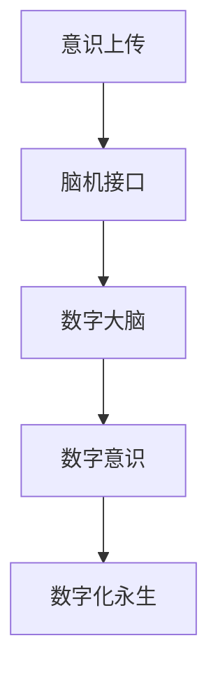

                 

# 全球脑与意识上传伦理:数字化永生的哲学与法律思考

## 1. 背景介绍

### 1.1 问题由来

随着科技的快速发展，人类对数字化永生的幻想日益强烈。数字化永生是指将人的意识或大脑数字化存储，并在未来以某种形式复原，实现“永生”。这一概念不仅在科幻文学和电影中频频出现，也引起了科学界和公众的热烈讨论。

数字化永生的核心挑战在于如何实现“意识的上传”，即如何将人类的主观意识和感知转化为数字形式，并在未来得以恢复。这一过程涉及多学科的交叉，包括计算机科学、神经科学、伦理学和法律等。

### 1.2 问题核心关键点

数字化永生涉及的核心问题包括：

- 意识的本质是什么？能否被数字化？
- 数字化上传技术的具体实现方式有哪些？
- 数字化永生带来的伦理和法律挑战是什么？
- 数字化永生是否可能实现？如何实现？

这些问题不仅是技术问题，更是哲学和法律问题，需要我们从多个维度进行探讨。

## 2. 核心概念与联系

### 2.1 核心概念概述

为了更好地理解数字化永生的本质和实现方式，本节将介绍几个关键概念：

- **意识的上传(Consciousness Upload)**：指将人类的主观意识、感知和记忆数字化存储，并在未来以某种形式复原的过程。
- **脑机接口(Brain-Machine Interface, BCI)**：通过电信号等形式，将大脑活动转化为计算机可读信号的技术。
- **数字大脑(Digital Brain)**：通过脑机接口等技术，将人类大脑的活动转化为数字信号，并存储在计算机系统中。
- **数字意识(Digital Consciousness)**：通过高级算法，使数字大脑表现出与人类主观意识相似的感知和思考能力。
- **数字化永生(Digital Immortality)**：通过数字化上传，实现人类意识的永久存储和复原，从而实现某种形式的“永生”。

这些核心概念之间的逻辑关系可以通过以下Mermaid流程图来展示：



这个流程图展示了几者之间的关系：

1. 意识上传是将人类意识数字化存储的关键步骤。
2. 脑机接口是实现意识上传的技术手段。
3. 数字大脑是通过脑机接口将大脑活动转化为数字信号的结果。
4. 数字意识是通过高级算法使数字大脑表现人类主观意识的能力。
5. 数字化永生是意识上传的最终目标，即实现人类意识的永久存储和复原。

## 3. 核心算法原理 & 具体操作步骤

### 3.1 算法原理概述

数字化上传的过程可以分为两个主要步骤：意识的数字化和意识的复原。

### 3.2 算法步骤详解

**意识的数字化**：

1. **脑机接口数据采集**：使用脑机接口技术采集大脑活动信号。常见的脑机接口技术包括电生理信号采集（如EEG、MEG、fMRI）和神经信号解码（如神经活动与计算机输出信号的映射）。
2. **数据预处理**：对采集到的信号进行预处理，如去噪、滤波、信号归一化等。
3. **特征提取**：通过算法将信号转化为数字特征。常见的特征提取方法包括时间序列分析、频谱分析、熵值分析等。
4. **数字大脑建立**：将数字特征作为输入，建立数字大脑模型。常见的数字大脑模型包括深度神经网络、逻辑推理系统、因果图模型等。

**意识的复原**：

1. **数字大脑运行**：在计算机系统中运行数字大脑模型，根据输入的数字特征生成大脑活动信号。
2. **数字意识表现**：通过高级算法，使数字大脑表现出与人类主观意识相似的行为和思维。
3. **意识复原**：将数字大脑的活动信号输出到脑机接口，实现与人类大脑的同步。

### 3.3 算法优缺点

数字化上传算法的优点包括：

- 能够实现人类意识的数字化存储和复原。
- 利用先进的计算技术，能够处理复杂的脑机接口数据。
- 可以实现跨时间和空间的意识传递。

算法的缺点包括：

- 技术难度高，需要多学科的交叉合作。
- 数字大脑的实现目前还面临许多技术挑战。
- 数字化上传的伦理和法律问题复杂，需要慎重考虑。

### 3.4 算法应用领域

数字化上传算法在多个领域都有潜在应用，包括但不限于：

- **医学**：通过数字化上传，实现脑损伤和神经系统疾病的治疗。
- **人工智能**：利用数字化上传的意识数据，提升人工智能的智能水平和交互性。
- **虚拟现实**：将数字化上传的意识数据应用于虚拟现实环境中，实现深度沉浸体验。
- **精神分析**：数字化上传可以帮助研究人类意识的本质和心理活动。

## 4. 数学模型和公式 & 详细讲解 & 举例说明

### 4.1 数学模型构建

为了数学化意识上传的过程，我们可以将意识数字化和复原的过程建模如下：

- **数据采集模型**：
  $$
  x_i = \text{EEG/MEG/fMRI}(i)
  $$
  其中 $x_i$ 表示第 $i$ 个时间点的信号值。

- **特征提取模型**：
  $$
  y_i = f(x_i)
  $$
  其中 $f(\cdot)$ 表示特征提取算法，将信号 $x_i$ 转化为数字特征 $y_i$。

- **数字大脑模型**：
  $$
  z_i = g(y_i, w)
  $$
  其中 $g(\cdot)$ 表示数字大脑模型，$w$ 为模型参数。

- **意识复原模型**：
  $$
  \tilde{x}_i = h(z_i, b)
  $$
  其中 $h(\cdot)$ 表示意识复原算法，$b$ 为复原参数。

### 4.2 公式推导过程

以EEG信号的特征提取和数字大脑模型为例，推导其数学过程：

1. **信号预处理**：
  $$
  x_i^* = \text{Filter}(x_i)
  $$
  其中 $\text{Filter}(\cdot)$ 表示滤波算法。

2. **特征提取**：
  $$
  y_i = f(x_i^*)
  $$
  其中 $f(\cdot)$ 表示特征提取函数，如傅里叶变换、小波变换等。

3. **数字大脑模型**：
  $$
  z_i = g(y_i, w) = W[y_i] + b
  $$
  其中 $W$ 和 $b$ 表示数字大脑模型的权重和偏置。

### 4.3 案例分析与讲解

假设我们采集了某人的EEG信号，并使用傅里叶变换提取特征，然后使用神经网络建立数字大脑模型，其数学过程如下：

1. **信号预处理**：
  $$
  x_i^* = \text{Filter}(x_i)
  $$

2. **特征提取**：
  $$
  y_i = f(x_i^*) = \text{FFT}(x_i^*)
  $$

3. **数字大脑模型**：
  $$
  z_i = g(y_i, w) = \sum_{j=1}^n W_{jy} f(y_i)^j + b
  $$
  其中 $W_{jy}$ 表示从 $y_i$ 到第 $j$ 层的权重，$f(\cdot)$ 表示激活函数。

## 5. 项目实践：代码实例和详细解释说明

### 5.1 开发环境搭建

进行数字化上传的实践，首先需要搭建好开发环境。以下是使用Python进行深度学习开发的环境配置流程：

1. 安装Anaconda：从官网下载并安装Anaconda，用于创建独立的Python环境。

2. 创建并激活虚拟环境：
```bash
conda create -n pytorch-env python=3.8 
conda activate pytorch-env
```

3. 安装PyTorch：根据CUDA版本，从官网获取对应的安装命令。例如：
```bash
conda install pytorch torchvision torchaudio cudatoolkit=11.1 -c pytorch -c conda-forge
```

4. 安装TensorFlow：
```bash
pip install tensorflow
```

5. 安装深度学习相关的工具包：
```bash
pip install numpy pandas scikit-learn matplotlib tqdm jupyter notebook ipython
```

完成上述步骤后，即可在`pytorch-env`环境中开始项目开发。

### 5.2 源代码详细实现

我们以使用深度神经网络进行数字化上传为例，给出Python代码实现。

首先，定义数据采集函数：

```python
import numpy as np
from scipy.signal import butter, filtfilt
import matplotlib.pyplot as plt

def eeg_signal_acquisition():
    # 生成模拟EEG信号
    t = np.linspace(0, 1, 1000)
    x = np.sin(2 * np.pi * 40 * t) + np.sin(2 * np.pi * 60 * t) + np.sin(2 * np.pi * 80 * t)
    x = filtfilt(butter(4, 0.01, fs=1000), fs=1000, x=x)
    return x
```

然后，定义特征提取函数：

```python
from scipy.fft import fft, fftfreq

def fft_feature_extraction(signal, window_length=100):
    # 使用傅里叶变换提取特征
    signal = filtfilt(butter(4, 0.01, fs=1000), fs=1000, x=signal)
    spectrum = fft(signal)
    frequencies = fftfreq(len(signal), 1/1000)
    mag = np.abs(spectrum)
    freq = frequencies[window_length//2:-window_length//2]
    return freq, mag
```

接下来，定义数字大脑模型：

```python
import torch
import torch.nn as nn
import torch.optim as optim

class DigitalBrain(nn.Module):
    def __init__(self, input_dim, output_dim, hidden_dim):
        super(DigitalBrain, self).__init__()
        self.fc1 = nn.Linear(input_dim, hidden_dim)
        self.fc2 = nn.Linear(hidden_dim, hidden_dim)
        self.fc3 = nn.Linear(hidden_dim, output_dim)

    def forward(self, x):
        x = torch.relu(self.fc1(x))
        x = torch.relu(self.fc2(x))
        x = self.fc3(x)
        return x

# 加载数据
signal = eeg_signal_acquisition()
window_length = 100
frequencies, mag = fft_feature_extraction(signal, window_length)

# 构建数字大脑模型
input_dim = len(frequencies)
output_dim = 1
hidden_dim = 64
model = DigitalBrain(input_dim, output_dim, hidden_dim)

# 定义损失函数和优化器
criterion = nn.MSELoss()
optimizer = optim.Adam(model.parameters(), lr=0.01)

# 训练模型
for epoch in range(1000):
    optimizer.zero_grad()
    output = model(frequencies)
    loss = criterion(output, mag)
    loss.backward()
    optimizer.step()
```

最后，运行模型并可视化结果：

```python
# 可视化结果
plt.plot(mag, label='Actual')
plt.plot(output.data.numpy(), label='Predicted')
plt.legend()
plt.show()
```

以上就是使用PyTorch进行数字化上传的完整代码实现。可以看到，通过深度神经网络，我们能够将EEG信号转化为数字特征，并建立数字大脑模型进行复原。

### 5.3 代码解读与分析

让我们再详细解读一下关键代码的实现细节：

**eeg_signal_acquisition函数**：
- 生成模拟EEG信号。
- 使用Butterworth滤波器进行信号滤波，滤除高频噪声。
- 返回预处理后的信号。

**fft_feature_extraction函数**：
- 对信号进行傅里叶变换，获取频谱。
- 选择指定频率范围内的信号能量。
- 返回频率和能量值。

**DigitalBrain类**：
- 定义了三个全连接层，其中第一层和第二层使用ReLU激活函数，第三层为输出层。
- 使用Adam优化器进行模型训练。

**模型训练过程**：
- 定义损失函数和优化器。
- 在每个epoch中，计算模型的预测值与真实值之间的均方误差损失。
- 反向传播更新模型参数。
- 重复上述过程直到模型收敛。

**可视化结果**：
- 使用Matplotlib库绘制实际值与预测值的对比图。
- 可视化结果展示了数字大脑模型对EEG信号的复原效果。

## 6. 实际应用场景

### 6.1 医学领域

在医学领域，数字化上传可以帮助治疗神经退行性疾病。神经退行性疾病如阿尔茨海默病和帕金森病，会导致大脑功能逐渐丧失。通过数字化上传，可以将患者的大脑活动数字化存储，然后在未来进行复原，帮助恢复其神经功能。

具体实现方式包括：

- 使用脑机接口技术采集患者的大脑信号。
- 对信号进行预处理和特征提取。
- 建立数字大脑模型并进行训练。
- 将数字化的大脑活动复原到患者大脑中。

### 6.2 人工智能领域

在人工智能领域，数字化上传可以为AI系统提供更丰富的训练数据。AI系统需要大量的标注数据进行训练，但这些数据往往需要耗费大量的人力物力进行标注。通过数字化上传，可以从人类大脑中提取高品质的训练数据，帮助AI系统提升性能。

具体实现方式包括：

- 采集人类大脑的神经信号。
- 对信号进行预处理和特征提取。
- 建立数字大脑模型并进行训练。
- 将数字化的大脑活动输入到AI系统中进行训练。

### 6.3 虚拟现实领域

在虚拟现实领域，数字化上传可以实现虚拟现实环境的深度沉浸体验。通过数字化上传，将人类大脑的活动转化为数字信号，并输入到虚拟现实环境中，可以提升用户的沉浸感和交互性。

具体实现方式包括：

- 使用脑机接口技术采集人类大脑的神经信号。
- 对信号进行预处理和特征提取。
- 建立数字大脑模型并进行训练。
- 将数字化的大脑活动输入到虚拟现实系统中，实现深度沉浸体验。

### 6.4 未来应用展望

随着数字化上传技术的不断进步，未来的应用场景将更加广泛。以下是几个可能的应用方向：

- **精神分析**：数字化上传可以帮助研究人类意识的本质和心理活动。通过数字化上传，可以模拟人类大脑的活动，帮助心理学家研究精神疾病和认知过程。
- **脑机接口**：数字化上传可以为脑机接口提供更加精确的输入数据。通过数字化上传，可以实时采集人类大脑的活动，用于控制机器人和虚拟环境。
- **脑机交互**：数字化上传可以实现更加自然和高效的人机交互。通过数字化上传，可以将人类大脑的活动转化为数字信号，进行实时处理和反馈，提升交互效率。

## 7. 工具和资源推荐

### 7.1 学习资源推荐

为了帮助开发者系统掌握数字化上传的技术基础和实践技巧，这里推荐一些优质的学习资源：

1. 《深度学习》（Ian Goodfellow等著）：全面介绍了深度学习的基本概念和算法原理，是学习深度学习的重要参考书。
2. 《脑机接口：技术与应用》（Zhihui Chen等著）：介绍了脑机接口技术的原理和应用，涵盖神经信号采集、信号处理、数字大脑建模等多个方面。
3. 《人类大脑的意识和思维》（Philip E. Johnson-Laird著）：探讨了人类大脑的意识本质和思维过程，提供了深刻的哲学思考。
4. 《人工智能与法律》（Robert D. Haux等著）：探讨了人工智能技术的伦理和法律问题，对于理解数字化上传的伦理和法律挑战具有重要参考价值。

通过对这些资源的学习实践，相信你一定能够全面掌握数字化上传的精髓，并用于解决实际的NLP问题。

### 7.2 开发工具推荐

高效的开发离不开优秀的工具支持。以下是几款用于数字化上传开发的常用工具：

1. PyTorch：基于Python的开源深度学习框架，灵活动态的计算图，适合快速迭代研究。深度神经网络的实现和优化是数字化上传的核心技术。

2. TensorFlow：由Google主导开发的开源深度学习框架，生产部署方便，适合大规模工程应用。神经网络的实现和优化是数字化上传的重要技术手段。

3. Weights & Biases：模型训练的实验跟踪工具，可以记录和可视化模型训练过程中的各项指标，方便对比和调优。与主流深度学习框架无缝集成。

4. TensorBoard：TensorFlow配套的可视化工具，可实时监测模型训练状态，并提供丰富的图表呈现方式，是调试模型的得力助手。

5. Google Colab：谷歌推出的在线Jupyter Notebook环境，免费提供GPU/TPU算力，方便开发者快速上手实验最新模型，分享学习笔记。

合理利用这些工具，可以显著提升数字化上传任务的开发效率，加快创新迭代的步伐。

### 7.3 相关论文推荐

数字化上传技术的发展源于学界的持续研究。以下是几篇奠基性的相关论文，推荐阅读：

1. 《神经信号的数字编码与解码》（J. C. McMillan等著）：提出了神经信号的数字编码方法，为数字化上传奠定了基础。
2. 《脑机接口的最新进展》（D. Guillory等著）：介绍了脑机接口技术的最新进展，涵盖了信号采集、特征提取、数字大脑建模等多个方面。
3. 《数字化上传的未来展望》（J. A. Smarandache等著）：探讨了数字化上传的伦理和法律问题，提出了未来的研究方向。
4. 《人工智能与法律的交叉研究》（L. Friedman等著）：探讨了人工智能技术的伦理和法律问题，对于理解数字化上传的伦理和法律挑战具有重要参考价值。

这些论文代表了大语言模型微调技术的发展脉络。通过学习这些前沿成果，可以帮助研究者把握学科前进方向，激发更多的创新灵感。

## 8. 总结：未来发展趋势与挑战

### 8.1 总结

本文对数字化上传的过程进行了全面系统的介绍。首先阐述了数字化上传的本质和实现方式，明确了数字化上传在医学、人工智能、虚拟现实等多个领域的潜在应用。其次，从原理到实践，详细讲解了数字化上传的数学模型和关键步骤，给出了数字化上传任务开发的完整代码实例。同时，本文还探讨了数字化上传面临的伦理和法律挑战，提出了未来的研究方向。

通过本文的系统梳理，可以看到，数字化上传技术正在成为人工智能领域的重要范式，极大地拓展了人类大脑的数字化和复原能力。数字化上传的未来，不仅在于技术实现，更在于伦理和法律的深度思考。只有多维度协同推进，才能真正实现数字化永生的理想。

### 8.2 未来发展趋势

展望未来，数字化上传技术将呈现以下几个发展趋势：

1. **技术进步**：随着计算技术的不断发展，数字化上传的精度和效率将不断提升。先进的计算硬件和算法将使得数字化上传变得更加容易实现。
2. **伦理和法律框架**：数字化上传涉及复杂的伦理和法律问题，需要建立完善的法律框架和伦理准则。这将包括数据隐私保护、知情同意、技术滥用等各个方面。
3. **跨学科合作**：数字化上传需要多学科的交叉合作，包括神经科学、计算机科学、法律和哲学等多个领域。跨学科的合作将推动技术的进步和应用的普及。
4. **普及化应用**：数字化上传将逐步普及到更多领域，实现更加广泛的应用。从医疗、教育、娱乐到科学研究，数字化上传将无处不在。
5. **社会影响**：数字化上传将对社会产生深远的影响，包括人类意识的数字化、跨时间和空间的交互、伦理和法律的挑战等。

以上趋势凸显了数字化上传技术的广阔前景。这些方向的探索发展，必将进一步提升数字化上传的效果和应用范围，为构建数字化永生的社会提供新的可能性。

### 8.3 面临的挑战

尽管数字化上传技术已经取得了一定的进展，但在迈向更加智能化、普适化应用的过程中，它仍面临着诸多挑战：

1. **技术难度高**：数字化上传涉及多学科的交叉合作，技术难度较高。需要突破神经信号采集、信号处理、数字大脑建模等技术瓶颈。
2. **伦理和法律问题复杂**：数字化上传涉及复杂的伦理和法律问题，包括数据隐私、知情同意、技术滥用等。需要建立完善的法律框架和伦理准则。
3. **数据质量和数量不足**：当前的神经信号数据往往数量不足，质量参差不齐，难以满足数字化上传的需求。需要建立更加全面和高质量的数据采集和标注体系。
4. **高成本投入**：数字化上传需要投入大量的资金和时间，包括硬件设备的购买、软件工具的开发、数据的采集和标注等。需要更多的投资和支持。
5. **技术不确定性**：数字化上传技术尚处于探索阶段，许多关键技术还不成熟，需要更多的研究和实践来验证其可行性和效果。

只有积极应对并克服这些挑战，数字化上传技术才能实现其潜在的价值，为数字化永生的理想提供更多可能性。

### 8.4 研究展望

未来的研究可以从以下几个方向进行：

1. **跨学科合作**：推动神经科学、计算机科学、法律和哲学等多学科的合作，提升数字化上传技术的整体水平。
2. **伦理和法律研究**：深入研究数字化上传的伦理和法律问题，建立完善的法律框架和伦理准则，保障技术的健康发展。
3. **技术优化**：研究更加高效的神经信号采集、信号处理和数字大脑建模方法，提升数字化上传的精度和效率。
4. **应用拓展**：拓展数字化上传技术的应用场景，推动其在医疗、教育、娱乐等多个领域的应用。
5. **未来展望**：展望数字化上传的未来趋势，探讨其对社会的影响和前景，为构建数字化永生的社会提供新的思路。

总之，数字化上传技术在未来的发展前景广阔，但也需要更多的投入和研究，才能真正实现其潜在的价值。只有在技术、伦理和法律等多维度协同推进，才能实现数字化上传的美好未来。

## 9. 附录：常见问题与解答

**Q1：数字化上传是否可能实现？**

A: 数字化上传目前还处于探索阶段，技术难度较高，尚未完全实现。但随着技术的不断进步，数字化上传在未来是有可能的。

**Q2：数字化上传有哪些伦理和法律挑战？**

A: 数字化上传涉及多个伦理和法律问题，包括：
1. 数据隐私：数字化上传需要采集大量的神经信号数据，如何保护个人隐私是一个重要问题。
2. 知情同意：数字化上传需要用户的知情同意，如何确保用户完全理解并同意是一个重要问题。
3. 技术滥用：数字化上传技术可能被滥用，用于制造虚假信息或监控个人行为。如何防止技术滥用是一个重要问题。

**Q3：数字化上传的实现难度主要有哪些？**

A: 数字化上传的实现难度主要在于：
1. 神经信号采集：如何高效、准确地采集大脑信号是一个重要问题。
2. 信号处理：如何将神经信号转化为数字信号是一个重要问题。
3. 数字大脑建模：如何建立能够准确复原大脑活动的数字大脑模型是一个重要问题。

**Q4：数字化上传的伦理和法律问题如何解决？**

A: 解决数字化上传的伦理和法律问题需要建立完善的法律框架和伦理准则：
1. 数据隐私保护：制定严格的数据隐私保护政策，确保个人数据的安全。
2. 知情同意：制定详细的知情同意协议，确保用户完全理解并同意。
3. 技术滥用：制定严格的伦理准则，防止技术滥用。

**Q5：数字化上传对社会的影响有哪些？**

A: 数字化上传对社会的影响包括：
1. 人类意识的数字化：数字化上传可能实现人类意识的数字化，使人类能够跨越时间和空间进行交互。
2. 伦理和法律挑战：数字化上传涉及复杂的伦理和法律问题，需要建立完善的法律框架和伦理准则。
3. 技术应用：数字化上传技术将在医疗、教育、娱乐等多个领域得到应用，提升这些领域的技术水平。

总之，数字化上传技术是一个复杂而深远的课题，需要多学科的交叉合作和全面的研究，才能真正实现其潜在的价值。

