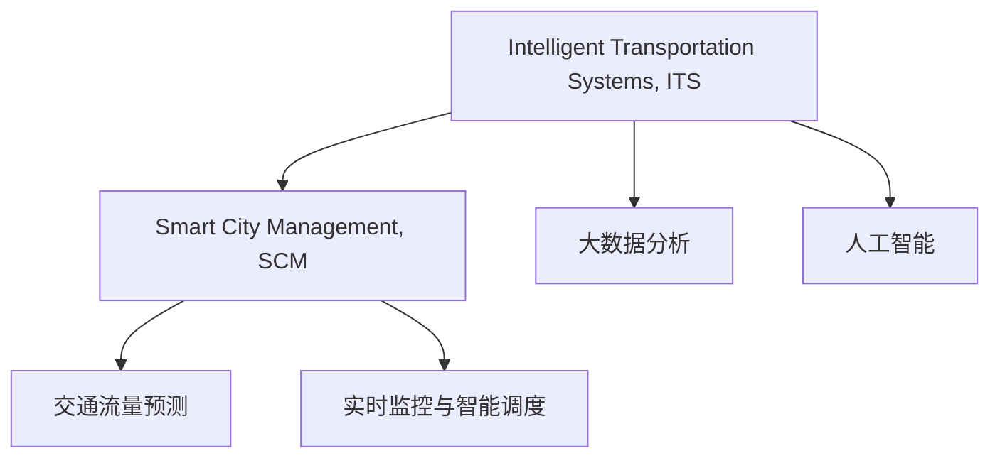

                 

# 全球脑与智慧交通:数字化城市管理的交通优化

> 关键词：智慧交通,数字化城市管理,交通优化,城市智能,大数据分析,人工智能,交通流量预测,实时监控,智能调度

## 1. 背景介绍

### 1.1 问题由来
随着城市化进程的不断推进，全球许多城市面临交通拥堵、环境污染、安全事故等诸多挑战。这些问题的解决需要依赖数字化、智能化手段，通过大数据分析、人工智能等技术，实现对交通流的实时监控、智能调度，提升城市交通管理的效率和安全性。

近年来，智慧交通系统（Intelligent Transportation Systems, ITS）的概念逐渐兴起，它利用互联网、物联网、大数据等技术手段，对交通流进行实时监控、预测、优化，从而实现交通资源的合理配置。智慧交通不仅能缓解城市交通压力，还能提升城市运行效率，减少能源消耗和环境污染。

在智慧交通的构建过程中，数字化城市管理扮演了重要角色。数字化城市管理（Smart City Management, SCM）通过数字化手段，整合城市各类数据资源，构建统一的城市管理平台，为智慧交通系统提供数据支撑。城市智能是智慧交通的核心，它能够根据实时数据，自动优化交通流，提升城市交通运行的智能化水平。

### 1.2 问题核心关键点
智慧交通与数字化城市管理的核心关键点在于：
- **实时数据收集与处理**：通过物联网设备、摄像头、传感器等手段，实时采集交通流量、天气、道路状况等信息。
- **数据整合与分析**：将各类数据整合至城市管理平台，利用大数据、机器学习等技术，进行交通流量预测、路径规划等分析。
- **智能决策与控制**：基于分析结果，进行智能调度、信号控制、交通管控等决策，实现交通流的优化。
- **人机协同与用户反馈**：借助人工智能算法，结合驾驶员、行人的反馈，实时调整交通控制策略，提升交通管理效果。

## 2. 核心概念与联系

### 2.1 核心概念概述

为了更好地理解智慧交通与数字化城市管理的实现原理，本节将介绍几个密切相关的核心概念：

- **智慧交通（Intelligent Transportation Systems, ITS）**：通过传感器、智能设备和数据分析技术，实时监控交通状况，智能调控交通信号，提升交通效率和安全性的系统。
- **数字化城市管理（Smart City Management, SCM）**：利用数字化手段，整合城市各类数据资源，构建统一的城市管理平台，提升城市治理效率和质量。
- **大数据分析**：利用大数据技术，从海量数据中提取有价值的信息，进行模式识别和趋势预测，为决策提供支持。
- **人工智能**：利用机器学习、深度学习等技术，实现自动化、智能化决策和控制，提升系统响应速度和准确性。
- **交通流量预测**：基于历史和实时数据，利用时间序列分析、回归模型等方法，预测未来交通流量，为交通控制提供依据。
- **实时监控与智能调度**：通过传感器、摄像头等设备，实时监控交通状况，利用智能算法进行动态调整，优化交通流。

这些核心概念之间的逻辑关系可以通过以下Mermaid流程图来展示：



这个流程图展示了智慧交通和数字化城市管理系统的核心组件和关键流程：

1. 智慧交通系统实时监控交通状况，通过传感器、智能设备等手段获取数据。
2. 数字化城市管理系统整合各类数据资源，构建统一的管理平台。
3. 大数据分析技术从海量数据中提取有价值的信息，支持决策和预测。
4. 人工智能技术实现自动化、智能化决策，优化交通流。

这些核心概念共同构成了智慧交通和数字化城市管理的实施框架，有助于提升城市交通管理的智能化水平。

## 3. 核心算法原理 & 具体操作步骤
### 3.1 算法原理概述

智慧交通与数字化城市管理的核心算法原理涉及大数据分析、人工智能、机器学习等多个领域，其核心思想是通过实时数据采集与处理，构建城市交通模型，实现对交通流的预测和优化。

智慧交通和数字化城市管理的算法流程主要包括以下几个步骤：

1. **数据采集与预处理**：通过传感器、摄像头等设备，采集交通流量、道路状况、天气信息等数据。
2. **数据整合与分析**：将各类数据整合至城市管理平台，利用大数据分析技术进行交通流量预测、路径规划等分析。
3. **模型构建与训练**：基于整合后的数据，构建交通模型，利用机器学习算法进行训练，提升模型预测精度。
4. **智能调度与控制**：根据模型预测结果，进行智能调度、信号控制等决策，优化交通流。
5. **实时监控与反馈**：利用实时监控设备，监控交通状况，结合人工智能算法，动态调整交通控制策略。

### 3.2 算法步骤详解

智慧交通和数字化城市管理的算法步骤较为复杂，下面以交通流量预测为例，详细讲解其核心算法步骤。

**Step 1: 数据采集与预处理**
- **传感器与摄像头**：部署于道路、桥梁、路口等位置，实时采集交通流量、道路状况、车辆类型等数据。
- **GPS与车载设备**：获取车辆位置、速度、方向等动态数据。
- **数据清洗与归一化**：去除异常值、缺失值，对数据进行归一化处理，以便后续分析。

**Step 2: 数据整合与分析**
- **数据整合**：将各类数据整合至城市管理平台，形成统一的数据集。
- **特征提取**：选择关键特征，如时间、天气、车辆类型等，用于建立预测模型。
- **数据可视化**：利用数据可视化工具，展示交通流量变化趋势，便于观察和分析。

**Step 3: 模型构建与训练**
- **选择模型**：基于历史数据，选择适合的模型进行交通流量预测，如ARIMA、LSTM等。
- **特征工程**：设计合适的特征，如季节性、周期性特征，提升模型性能。
- **模型训练**：利用历史数据对模型进行训练，调整模型参数，提升预测精度。
- **模型验证**：在验证集上评估模型性能，进行模型优化。

**Step 4: 智能调度与控制**
- **路径规划**：根据交通流量预测结果，规划最优路径，减少拥堵。
- **信号控制**：动态调整交通信号，根据实时流量，优化信号灯周期。
- **紧急调度**：对于突发事件（如事故、道路施工），进行紧急调度，确保道路通行。

**Step 5: 实时监控与反馈**
- **实时监控**：利用摄像头、传感器等设备，实时监控交通状况，获取实时数据。
- **反馈机制**：将实时数据反馈至模型，动态调整预测结果，优化交通流。
- **人机协同**：结合驾驶员、行人的反馈，实时调整交通控制策略，提升交通管理效果。

### 3.3 算法优缺点

智慧交通与数字化城市管理系统的核心算法具有以下优点：
- **实时性强**：通过实时数据采集与处理，能够迅速响应交通状况变化。
- **预测精度高**：利用大数据分析、机器学习等技术，能够准确预测交通流量，提供可靠的决策依据。
- **智能化程度高**：结合人工智能算法，实现自动化、智能化调度，提升交通管理效率。

同时，该算法也存在一定的局限性：
- **数据质量依赖**：算法的预测精度依赖于数据质量，数据缺失或不准确会影响预测结果。
- **模型复杂度高**：构建复杂的模型需要大量计算资源，模型优化较为困难。
- **反馈机制复杂**：实时监控和反馈机制需要大量的传感器和设备，建设和维护成本较高。
- **安全风险**：智能算法可能存在漏洞，遭受网络攻击或数据泄露风险。

尽管存在这些局限性，但就目前而言，智慧交通与数字化城市管理系统的算法仍是目前城市交通管理的主流方法，在实际应用中取得了显著效果。

### 3.4 算法应用领域

智慧交通与数字化城市管理系统的核心算法广泛应用于以下领域：

- **城市交通规划**：通过实时数据和预测模型，优化交通流，缓解交通拥堵。
- **交通安全管理**：利用智能监控和数据分析，预防交通事故，提升交通安全水平。
- **环境污染控制**：通过实时监控和数据整合，减少交通污染，改善城市环境。
- **公共交通优化**：结合智能调度算法，提升公交、地铁等公共交通工具的运行效率。
- **智能停车管理**：利用智能设备和数据分析，优化停车资源配置，减少停车难问题。
- **智慧物流管理**：通过实时监控和路径规划，提升物流运输效率，减少物流成本。

## 4. 数学模型和公式 & 详细讲解  
### 4.1 数学模型构建

智慧交通与数字化城市管理系统涉及的数学模型主要基于统计学、时间序列分析、机器学习等方法构建。以下以交通流量预测为例，详细讲解其数学模型构建过程。

**交通流量预测模型**：
- **ARIMA模型**：自回归整合滑动平均模型（Autoregressive Integrated Moving Average），用于时间序列数据预测。
- **LSTM模型**：长短时记忆网络（Long Short-Term Memory），用于深度学习时间序列数据预测。

### 4.2 公式推导过程

#### 4.2.1 ARIMA模型

ARIMA模型基于自回归、差分、移动平均等统计方法，用于时间序列数据预测。其基本形式如下：

$$
ARIMA(p, d, q) = \sum_{i=1}^{p} \alpha_i B^i X_t + \sum_{j=1}^{q} \beta_j \Delta^j X_t + \theta_0 + \theta_1 \Delta X_t + \epsilon_t
$$

其中：
- $p$ 为自回归阶数，$d$ 为差分阶数，$q$ 为移动平均阶数。
- $\alpha_i$ 为自回归系数，$\beta_j$ 为移动平均系数。
- $\theta_0, \theta_1$ 为差分系数。
- $\epsilon_t$ 为误差项。

ARIMA模型的推导过程较为复杂，涉及差分、自回归、移动平均等统计方法。以下是简化的推导过程：

1. **数据差分**：对原始时间序列 $X_t$ 进行差分，得到 $D(X_t)$。
2. **自回归模型**：将差分后的序列 $D(X_t)$ 进行自回归，得到 $AR(p)$。
3. **移动平均模型**：对自回归模型 $AR(p)$ 进行移动平均，得到 $MA(q)$。
4. **模型整合**：将自回归和移动平均模型整合，得到 $ARIMA(p, d, q)$。

ARIMA模型的参数估计和预测过程涉及复杂的统计推导和计算，以下以LSTM模型为例，进行详细讲解。

#### 4.2.2 LSTM模型

LSTM模型是一种深度学习模型，用于处理时间序列数据。其基本形式如下：

$$
LSTM_t = \sigma(W_{f} \cdot [X_t, h_{t-1}] + b_f) \odot \tanh(W_{g} \cdot [X_t, h_{t-1}] + b_g)
$$

其中：
- $X_t$ 为时间序列数据。
- $h_{t-1}$ 为前一时刻的隐藏状态。
- $\sigma$ 为激活函数，通常使用Sigmoid。
- $W_{f}, W_{g}$ 为权重矩阵。
- $b_f, b_g$ 为偏置向量。

LSTM模型的推导过程涉及神经网络的知识，以下是简化的推导过程：

1. **输入层**：将时间序列数据 $X_t$ 输入至网络，得到输入向量 $Z_t$。
2. **遗忘门**：通过 sigmoid 激活函数，计算遗忘门 $\sigma(W_{f} \cdot [X_t, h_{t-1}] + b_f)$，决定是否遗忘前一时刻的信息。
3. **更新门**：通过 tanh 激活函数，计算更新门 $\tanh(W_{g} \cdot [X_t, h_{t-1}] + b_g)$，决定是否更新当前信息。
4. **隐藏层**：结合遗忘门和更新门的结果，得到当前时刻的隐藏状态 $h_t$。

ARIMA和LSTM模型均需要大量的数据和计算资源进行训练和预测。在实际应用中，需要根据具体任务和数据特点选择合适的模型。

### 4.3 案例分析与讲解

**案例分析**：

假设某城市主要路口的交通流量数据如下表所示：

| 时间       | 交通流量 |
| ---------- | ------- |
| 8:00 AM    | 2000    |
| 8:30 AM    | 3000    |
| 9:00 AM    | 3500    |
| 9:30 AM    | 4000    |
| 10:00 AM   | 4200    |
| ...        | ...     |

该表展示了每日不同时刻的交通流量变化情况。

**分析过程**：

1. **数据预处理**：将数据进行归一化处理，得到归一化后的交通流量数据 $X_t$。
2. **模型选择**：选择ARIMA模型进行交通流量预测。
3. **模型训练**：利用归一化后的数据对ARIMA模型进行训练，调整模型参数，提升预测精度。
4. **模型验证**：在验证集上评估模型性能，进行模型优化。
5. **模型预测**：利用训练好的模型对未来交通流量进行预测，得到预测结果。

通过上述分析过程，可以构建一个基于ARIMA模型的交通流量预测系统，提升城市交通管理的智能化水平。

## 5. 项目实践：代码实例和详细解释说明
### 5.1 开发环境搭建

在进行智慧交通和数字化城市管理系统开发前，需要准备好开发环境。以下是使用Python进行TensorFlow开发的开发环境配置流程：

1. 安装Anaconda：从官网下载并安装Anaconda，用于创建独立的Python环境。

2. 创建并激活虚拟环境：
```bash
conda create -n pytorch-env python=3.8 
conda activate pytorch-env
```

3. 安装TensorFlow：根据CUDA版本，从官网获取对应的安装命令。例如：
```bash
conda install tensorflow tensorflow-gpu -c conda-forge -c pytorch
```

4. 安装各类工具包：
```bash
pip install numpy pandas scikit-learn matplotlib tqdm jupyter notebook ipython
```

完成上述步骤后，即可在`pytorch-env`环境中开始智慧交通和数字化城市管理系统的开发。

### 5.2 源代码详细实现

这里我们以交通流量预测为例，给出使用TensorFlow对LSTM模型进行开发的PyTorch代码实现。

首先，定义数据处理函数：

```python
import tensorflow as tf
from tensorflow.keras.models import Sequential
from tensorflow.keras.layers import LSTM, Dense
from tensorflow.keras.optimizers import Adam
from sklearn.preprocessing import MinMaxScaler

# 数据预处理函数
def preprocess_data(data):
    scaler = MinMaxScaler(feature_range=(0, 1))
    scaled_data = scaler.fit_transform(data)
    return scaled_data

# 数据划分函数
def train_test_split(data, split_ratio):
    train_size = int(len(data) * split_ratio)
    train_data, test_data = data[:train_size], data[train_size:]
    return train_data, test_data

# 构建LSTM模型
def build_lstm_model(input_shape):
    model = Sequential()
    model.add(LSTM(units=50, return_sequences=True, input_shape=input_shape))
    model.add(LSTM(units=50))
    model.add(Dense(units=1))
    model.compile(optimizer=Adam(learning_rate=0.001), loss='mse')
    return model

# 训练模型
def train_model(model, train_data, test_data, epochs=100):
    history = model.fit(train_data, train_data[:, -1], epochs=epochs, validation_data=(test_data, test_data[:, -1]), verbose=2)
    return history
```

然后，定义数据加载和模型训练函数：

```python
# 加载数据
def load_data(data_file, split_ratio=0.8):
    data = pd.read_csv(data_file)
    train_data, test_data = train_test_split(data, split_ratio)
    return train_data, test_data

# 模型训练与评估
def train_and_evaluate(model, train_data, test_data, epochs=100):
    history = train_model(model, train_data, test_data, epochs=epochs)
    print('Training Loss:', history.history['loss'])
    print('Testing Loss:', model.evaluate(test_data, test_data[:, -1]))
```

最后，启动训练流程并在测试集上评估：

```python
# 加载数据
train_data, test_data = load_data('traffic_data.csv', split_ratio=0.8)

# 构建模型
input_shape = (train_data.shape[1], train_data.shape[2])
model = build_lstm_model(input_shape)

# 训练模型
history = train_model(model, train_data, test_data, epochs=100)

# 评估模型
train_and_evaluate(model, train_data, test_data, epochs=100)
```

以上就是使用TensorFlow对LSTM模型进行交通流量预测的完整代码实现。可以看到，利用TensorFlow的深度学习框架，我们可以快速构建和训练交通流量预测模型。

### 5.3 代码解读与分析

让我们再详细解读一下关键代码的实现细节：

**preprocess_data函数**：
- **功能**：对原始数据进行归一化处理。
- **实现**：使用MinMaxScaler对数据进行归一化，确保数据在[0, 1]范围内。

**train_test_split函数**：
- **功能**：将数据划分为训练集和测试集。
- **实现**：根据指定的split_ratio，将数据按比例划分为训练集和测试集。

**build_lstm_model函数**：
- **功能**：构建LSTM模型。
- **实现**：使用Sequential模型，依次添加LSTM层、全连接层，编译模型。

**train_model函数**：
- **功能**：训练模型。
- **实现**：利用fit方法进行模型训练，记录训练过程和验证结果。

**load_data函数**：
- **功能**：加载数据集。
- **实现**：读取CSV文件，按比例划分为训练集和测试集。

**train_and_evaluate函数**：
- **功能**：训练和评估模型。
- **实现**：调用train_model函数训练模型，并打印训练和测试损失。

通过上述代码，可以看到TensorFlow库提供的深度学习模型和优化算法，可以方便地实现交通流量预测系统的开发。TensorFlow不仅具有强大的计算能力，还提供了丰富的API接口，支持多种深度学习模型的构建和训练。

当然，实际的智慧交通和数字化城市管理系统开发还需要考虑更多因素，如模型评估、异常检测、系统集成等。但核心的交通流量预测算法基本与此类似。

## 6. 实际应用场景
### 6.1 智能交通系统

智慧交通和数字化城市管理系统在智能交通系统中有着广泛的应用。智能交通系统通过实时监控和智能调度，能够有效缓解交通拥堵，提升交通效率。

例如，在城市主要路口部署传感器、摄像头等设备，实时采集交通流量、车辆类型、速度等数据。利用交通流量预测模型，预测未来交通流量，进行智能调度，优化信号灯周期，减少交通拥堵。对于突发事件（如事故、道路施工），系统能够及时响应，调整交通流向，确保道路通行。

### 6.2 交通流量监测与分析

智慧交通和数字化城市管理系统在交通流量监测与分析中同样发挥着重要作用。通过对交通流量数据的实时采集和分析，能够及时发现交通异常，进行预警和调度。

例如，在交通流量较大的时间段，系统能够自动分析交通流向和流量变化，预测可能的拥堵点，提前采取措施。对于交通事故、道路施工等突发事件，系统能够及时响应，调整交通流，减少事故发生率，提升交通安全性。

### 6.3 智能公交系统

智慧交通和数字化城市管理系统在智能公交系统中也有重要应用。通过实时监控和智能调度，能够提高公交车的运行效率，提升乘客体验。

例如，利用公交车辆GPS数据，实时监控车辆位置和运行状态。通过交通流量预测模型，预测公交车到达目的地的时间，调整公交车的发车频率和路线，减少等待时间，提升公交服务质量。同时，系统能够根据乘客需求，动态调整公交线路，满足乘客出行需求。

### 6.4 未来应用展望

随着智慧交通和数字化城市管理系统的不断发展，未来将在更多领域得到应用，为城市治理带来新的变革。

在智慧医疗领域，通过实时监控和数据分析，能够优化医疗资源配置，提升医疗服务效率。在智能教育领域，系统能够动态调整教学资源，提升教学效果。在智慧农业领域，通过实时监控和数据分析，能够优化农业生产，提升农产品质量。

此外，在智慧能源、智能制造、智能家居等多个领域，智慧交通和数字化城市管理系统都将发挥重要作用，推动各行业的数字化转型升级。相信伴随技术的不断进步，智慧交通和数字化城市管理系统将为城市治理带来更大的创新和突破。

## 7. 工具和资源推荐
### 7.1 学习资源推荐

为了帮助开发者系统掌握智慧交通与数字化城市管理系统的理论基础和实践技巧，这里推荐一些优质的学习资源：

1. 《智慧交通系统》系列博文：由智慧交通领域专家撰写，深入浅出地介绍了智慧交通系统的构建方法、核心算法等。

2. 《数字化城市管理》课程：清华大学开设的智慧城市管理课程，涵盖城市智能、大数据分析等核心内容。

3. 《深度学习与人工智能》书籍：深度学习领域的经典教材，系统介绍了深度学习的基本原理和应用。

4. HuggingFace官方文档：深度学习库TensorFlow的官方文档，提供了丰富的深度学习模型和优化算法。

5. OpenData Science社区：大数据、机器学习等领域的开源社区，提供了大量的学习资源和代码示例。

通过对这些资源的学习实践，相信你一定能够快速掌握智慧交通与数字化城市管理系统的实现原理，并用于解决实际的智慧交通问题。

### 7.2 开发工具推荐

高效的开发离不开优秀的工具支持。以下是几款用于智慧交通和数字化城市管理系统开发的常用工具：

1. TensorFlow：由Google主导开发的深度学习框架，支持多种深度学习模型的构建和训练，适合大规模工程应用。

2. PyTorch：基于Python的开源深度学习框架，灵活的计算图和丰富的API接口，适合快速迭代研究。

3. Jupyter Notebook：交互式的笔记本环境，支持Python、R等多种语言，便于代码调试和文档编写。

4. Matplotlib：Python数据可视化库，用于绘制图表、可视化结果。

5. Pandas：Python数据分析库，支持数据清洗、处理、分析等操作。

6. TensorBoard：TensorFlow配套的可视化工具，实时监测模型训练状态，并提供丰富的图表呈现方式。

合理利用这些工具，可以显著提升智慧交通和数字化城市管理系统的开发效率，加快创新迭代的步伐。

### 7.3 相关论文推荐

智慧交通与数字化城市管理系统的发展源于学界的持续研究。以下是几篇奠基性的相关论文，推荐阅读：

1. 《交通流量预测方法研究》：介绍了多种时间序列预测模型，如ARIMA、LSTM等，并对比了不同模型的预测效果。

2. 《智能交通系统的设计与实现》：系统介绍了智能交通系统的构建方法，涵盖了传感器、监控设备、数据分析等核心技术。

3. 《城市智能管理系统的设计与实现》：介绍了城市智能管理系统的构建方法，涵盖了数据采集、数据整合、数据分析等核心技术。

4. 《深度学习在交通流量预测中的应用》：介绍了深度学习模型在交通流量预测中的应用，并对比了不同深度学习模型的性能。

5. 《城市交通大数据分析与可视化》：介绍了大数据分析技术在城市交通管理中的应用，并提供了实际案例和可视化结果。

这些论文代表了大数据和深度学习在智慧交通和数字化城市管理系统中的应用趋势，对于深入理解智慧交通技术具有重要的参考价值。

## 8. 总结：未来发展趋势与挑战

### 8.1 总结

本文对智慧交通与数字化城市管理系统的实现原理进行了全面系统的介绍。首先阐述了智慧交通和数字化城市管理系统的研究背景和意义，明确了其核心算法和关键步骤。其次，从原理到实践，详细讲解了交通流量预测模型的核心算法步骤，给出了智慧交通和数字化城市管理系统的代码实现。同时，本文还广泛探讨了智慧交通和数字化城市管理系统在智能交通、交通流量监测、智能公交等多个场景中的应用，展示了其广泛的应用前景。

通过本文的系统梳理，可以看到，智慧交通和数字化城市管理系统已经在大规模城市管理中发挥了重要作用，显著提升了城市交通管理的智能化水平。未来，伴随技术的不断进步，智慧交通和数字化城市管理系统将在更多领域得到应用，为城市治理带来更大的创新和突破。

### 8.2 未来发展趋势

展望未来，智慧交通和数字化城市管理系统的未来发展趋势主要包括以下几个方面：

1. **智能化程度提升**：通过引入更先进的机器学习和深度学习技术，提升智慧交通和数字化城市管理系统的智能化水平。利用自动驾驶、无人机等技术，实现更高级别的智能化交通管理。

2. **数据整合与分析**：未来将整合更多的数据源，如视频监控、天气数据、GPS数据等，提升数据的质量和丰富度，为智慧交通和数字化城市管理提供更全面的数据支撑。

3. **实时性和动态性增强**：未来将通过5G、物联网等技术，实现更快速的数据采集和传输，提升实时性和动态性，满足实时监控和智能调度的需求。

4. **多模态融合**：未来将引入视觉、语音等多模态数据，实现更全面的交通监测和分析，提升智慧交通和数字化城市管理系统的感知能力。

5. **人机协同与用户反馈**：未来将引入更多的人机交互技术，如智能助理、聊天机器人等，结合用户反馈，动态调整交通控制策略，提升用户体验。

6. **生态系统建设**：未来将构建更完善的生态系统，包括标准规范、安全防护、服务接口等，为智慧交通和数字化城市管理系统提供更广泛的应用场景。

以上趋势凸显了智慧交通和数字化城市管理系统的广阔前景，为未来城市治理提供了新的思路和技术路径。

### 8.3 面临的挑战

尽管智慧交通和数字化城市管理系统已经取得了显著成果，但在迈向更加智能化、普适化应用的过程中，仍面临诸多挑战：

1. **数据安全与隐私**：智慧交通和数字化城市管理系统的数据涉及隐私和敏感信息，数据安全问题亟需解决。如何保护数据隐私，防止数据泄露，将是未来重要的研究课题。

2. **计算资源与成本**：智慧交通和数字化城市管理系统需要大量的计算资源，如何在有限的计算资源下，提升模型的性能和效率，将是重要的优化方向。

3. **算法复杂性**：智慧交通和数字化城市管理系统的算法复杂度较高，如何在不增加复杂度的前提下，提升算法的精度和稳定性，将是重要的优化方向。

4. **模型泛化能力**：智慧交通和数字化城市管理系统的模型泛化能力有限，如何在不同环境和场景下，保持模型的稳定性和预测精度，将是重要的研究课题。

5. **系统集成与协作**：智慧交通和数字化城市管理系统的建设需要多部门、多系统的协同工作，如何在不同的系统和平台间实现数据共享和协作，将是重要的优化方向。

6. **法规与伦理**：智慧交通和数字化城市管理系统涉及复杂的法规和伦理问题，如何在法律法规的框架下，保证系统的公正性和公平性，将是重要的研究课题。

正视智慧交通和数字化城市管理系统面临的这些挑战，积极应对并寻求突破，将是大规模城市管理迈向成熟的重要保障。

### 8.4 研究展望

面对智慧交通和数字化城市管理系统的挑战，未来的研究需要在以下几个方面寻求新的突破：

1. **数据安全与隐私保护**：引入数据加密、匿名化等技术，保护用户隐私，防止数据泄露。

2. **计算资源优化**：开发更高效的数据处理方法，如分布式计算、模型压缩等技术，优化计算资源，降低成本。

3. **算法优化与高效模型**：开发更高效、更稳定的算法，提升智慧交通和数字化城市管理系统的预测精度和实时性。

4. **多模态融合与智能感知**：引入视觉、语音等多模态数据，提升智慧交通和数字化城市管理系统的感知能力，实现更全面的交通监测和分析。

5. **人机协同与用户反馈**：引入智能助理、聊天机器人等技术，结合用户反馈，动态调整交通控制策略，提升用户体验。

6. **法规与伦理研究**：在法律法规的框架下，进行公平性、透明性、责任归属等方面的研究，确保系统的公正性和公平性。

这些研究方向的探索，必将引领智慧交通和数字化城市管理系统迈向更高的台阶，为城市治理带来更大的创新和突破。面向未来，智慧交通和数字化城市管理系统需要与其他人工智能技术进行更深入的融合，如知识表示、因果推理、强化学习等，多路径协同发力，共同推动自然语言理解和智能交互系统的进步。只有勇于创新、敢于突破，才能不断拓展智慧交通系统的边界，让智能技术更好地造福人类社会。

## 9. 附录：常见问题与解答

**Q1：智慧交通和数字化城市管理系统需要哪些关键技术？**

A: 智慧交通和数字化城市管理系统需要以下关键技术：

1. **大数据分析**：利用大数据技术，从海量数据中提取有价值的信息，进行模式识别和趋势预测。
2. **深度学习与机器学习**：利用深度学习、机器学习等技术，实现自动化、智能化决策和控制。
3. **物联网与传感器技术**：通过传感器、摄像头等设备，实时采集交通流量、车辆类型等数据。
4. **实时监控与智能调度**：利用智能算法，结合实时监控设备，进行动态调整，优化交通流。
5. **交通流量预测**：基于历史和实时数据，利用时间序列分析、回归模型等方法，预测未来交通流量。

这些技术共同构成了智慧交通和数字化城市管理系统的技术基础，为城市交通管理的智能化提供了有力支撑。

**Q2：如何构建高效的交通流量预测模型？**

A: 构建高效的交通流量预测模型需要考虑以下几个方面：

1. **数据预处理**：对原始数据进行清洗、归一化处理，去除异常值、缺失值，确保数据质量。
2. **模型选择**：选择适合的模型，如ARIMA、LSTM等，根据数据特点选择合适的模型。
3. **特征工程**：设计合适的特征，如季节性、周期性特征，提升模型性能。
4. **模型训练**：利用历史数据对模型进行训练，调整模型参数，提升预测精度。
5. **模型验证**：在验证集上评估模型性能，进行模型优化。

通过以上步骤，可以构建一个高效的交通流量预测模型，提升城市交通管理的智能化水平。

**Q3：智慧交通和数字化城市管理系统面临哪些挑战？**

A: 智慧交通和数字化城市管理系统面临以下挑战：

1. **数据安全与隐私**：数据涉及隐私和敏感信息，数据安全问题亟需解决。
2. **计算资源与成本**：系统需要大量的计算资源，如何在有限的计算资源下，提升模型的性能和效率。
3. **算法复杂性**：算法复杂度较高，如何在不增加复杂度的前提下，提升算法的精度和稳定性。
4. **模型泛化能力**：模型泛化能力有限，如何在不同环境和场景下，保持模型的稳定性和预测精度。
5. **系统集成与协作**：系统需要多部门、多系统的协同工作，如何在不同的系统和平台间实现数据共享和协作。
6. **法规与伦理**：涉及复杂的法规和伦理问题，如何在法律法规的框架下，保证系统的公正性和公平性。

正视这些挑战，积极应对并寻求突破，将是大规模城市管理迈向成熟的重要保障。

**Q4：如何提高智慧交通和数字化城市管理系统的智能化水平？**

A: 提高智慧交通和数字化城市管理系统的智能化水平需要考虑以下几个方面：

1. **引入更先进的机器学习和深度学习技术**：利用自动驾驶、无人机等技术，实现更高级别的智能化交通管理。
2. **整合更多的数据源**：整合更多的数据源，如视频监控、天气数据、GPS数据等，提升数据的质量和丰富度。
3. **实时性和动态性增强**：通过5G、物联网等技术，实现更快速的数据采集和传输，提升实时性和动态性。
4. **多模态融合**：引入视觉、语音等多模态数据，实现更全面的交通监测和分析。
5. **人机协同与用户反馈**：引入智能助理、聊天机器人等技术，结合用户反馈，动态调整交通控制策略。
6. **生态系统建设**：构建更完善的生态系统，包括标准规范、安全防护、服务接口等。

通过以上措施，可以显著提升智慧交通和数字化城市管理系统的智能化水平，为城市治理带来更大的创新和突破。

---

作者：禅与计算机程序设计艺术 / Zen and the Art of Computer Programming

