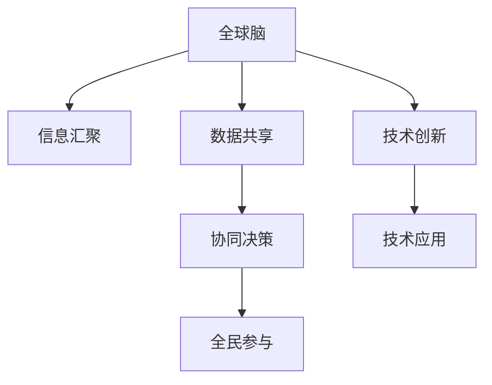

                 

## 1. 背景介绍

### 1.1 问题由来
全球气候变化、环境污染和生物多样性丧失已成当代重大挑战。这些问题不仅对自然生态系统构成威胁，也对人类健康、经济发展和社会稳定造成严重影响。在探索解决这些问题的过程中，科学家们逐渐认识到，单一技术或方法难以应对如此复杂的全球性问题。**全球脑（Global Brain）**概念的提出，为全球环境保护提供了一种新范式：将互联网作为信息处理的“大脑”，通过集体智慧解决环境问题。

### 1.2 问题核心关键点
**全球脑**（Global Brain）是指通过互联网和信息技术，集结全球智慧和资源，实现环境问题的集体智慧解决。这一概念由日本作家小室刚提出，在2012年出版的《Global Brain》一书中首次系统阐述。

**核心概念包括：**

- **信息汇聚**：全球脑通过互联网汇聚全球的信息和智慧，形成“全球信息池”。
- **数据共享**：通过开放平台，实现环境数据、研究结果、解决方案的共享，减少重复劳动和信息不对称。
- **协同决策**：利用AI算法和算法驱动，实现全球决策的科学化和协同化。
- **全民参与**：每个人都有能力在互联网上发表意见、提供数据和参与决策，极大地提高了公众参与度。

这些关键点共同构成了全球脑概念的理论框架，展示了其对环境保护的巨大潜力。

### 1.3 问题研究意义
全球脑概念为环境保护和可持续发展提供了新的解决思路，具有以下重要意义：

1. **提升信息透明度**：全球脑通过数据共享和信息汇聚，增强了环境保护的透明度，减少了决策中的信息不对称。
2. **加速问题解决**：汇集全球智慧和资源，可以加速解决环境问题的进程，实现高效的协同决策。
3. **促进公众参与**：提高了公众在环境保护中的参与度和影响力，使得公众能够直接参与到决策过程中。
4. **推动技术创新**：全球脑概念促进了AI、大数据、物联网等技术的创新应用，推动了环境科技的发展。
5. **实现全球合作**：通过全球脑平台，各国和组织可以更好地协调合作，共同应对全球环境挑战。

总之，全球脑概念为全球环境保护提供了新的可能性，具有广阔的应用前景。

## 2. 核心概念与联系

### 2.1 核心概念概述

为了更好地理解全球脑概念，本节将介绍几个核心概念：

- **全球脑**：通过互联网和信息技术，集结全球智慧和资源，实现环境问题的集体智慧解决。
- **信息汇聚**：将全球范围内分散的信息和数据集中处理，形成统一的信息池。
- **数据共享**：通过开放平台，实现环境数据、研究结果、解决方案的共享，减少重复劳动和信息不对称。
- **协同决策**：利用AI算法和算法驱动，实现全球决策的科学化和协同化。
- **全民参与**：每个人都有能力在互联网上发表意见、提供数据和参与决策，极大地提高了公众参与度。

这些核心概念之间的逻辑关系可以通过以下Mermaid流程图来展示：



这个流程图展示了几大核心概念之间的联系和作用：

1. 全球脑通过信息汇聚和数据共享，形成统一的信息池。
2. 信息池中的数据通过协同决策系统进行处理和分析。
3. 全民参与机制确保了决策的透明性和公众的广泛参与。
4. 技术创新和应用为全球脑提供了必要的技术支持。

这些概念共同构成了全球脑概念的理论框架，展示了其对环境保护的巨大潜力。

## 3. 核心算法原理 & 具体操作步骤

### 3.1 算法原理概述

全球脑概念的核心算法原理基于分布式计算和大数据处理，旨在通过信息汇聚、数据共享和协同决策，实现全球环境问题的集体智慧解决。

具体来说，全球脑通过以下步骤实现环境问题的集体智慧解决：

1. **数据采集与汇聚**：从全球各地收集环境数据和信息，形成统一的信息池。
2. **数据共享与开放**：将信息池中的数据和研究成果公开共享，供全球用户访问和分析。
3. **协同决策与优化**：通过AI算法和协同决策系统，对全球范围内的环境数据进行分析和优化，生成最优决策方案。
4. **公众参与与反馈**：允许公众参与决策过程，提供反馈和建议，进一步优化决策方案。

### 3.2 算法步骤详解

**Step 1: 数据采集与汇聚**

1. **数据收集**：从全球各地收集环境数据，如气候变化数据、水质数据、空气质量数据等。数据来源包括政府机构、科研机构、民间组织和个人等。

2. **数据标准化**：对收集到的数据进行标准化处理，使其能够被统一处理和分析。标准化过程包括数据清洗、格式转换和统一度量单位等。

3. **信息汇聚**：将标准化后的数据集中存储在云端，形成一个统一的信息池。使用分布式数据库系统（如Hadoop、Spark等）实现数据的分布式存储和处理。

**Step 2: 数据共享与开放**

1. **数据开放平台**：搭建全球脑数据开放平台，供全球用户访问和下载数据。平台需要具备高可用性和数据安全性。

2. **数据权限管理**：对开放的数据进行权限管理，确保数据的合法使用。平台需要支持不同级别的数据权限，如公开数据、内部数据和受限数据等。

3. **数据可视化**：使用数据可视化工具（如Tableau、Power BI等）将数据转化为易于理解的图表和报告，供公众和决策者参考。

**Step 3: 协同决策与优化**

1. **算法选择与设计**：选择合适的算法（如机器学习、深度学习、优化算法等）进行数据分析和优化。需要考虑算法的适用性和计算效率。

2. **数据预处理**：对数据进行预处理，包括特征选择、数据归一化、缺失值处理等。

3. **模型训练与优化**：使用训练数据对模型进行训练，并不断优化模型参数。模型需要具备高准确性和鲁棒性。

4. **决策生成**：基于训练好的模型，生成最优决策方案。决策方案需要具备可操作性和科学性。

**Step 4: 公众参与与反馈**

1. **公众参与渠道**：提供公众参与渠道，如在线调查、论坛讨论、社交媒体等，供公众表达意见和提供反馈。

2. **反馈集成与分析**：将公众反馈集成到决策系统中，对决策方案进行优化。

3. **决策透明化**：对决策过程进行透明化处理，确保公众了解决策依据和过程。

### 3.3 算法优缺点

**全球脑算法**具有以下优点：

1. **数据汇聚与共享**：通过信息汇聚和数据共享，可以极大提升环境问题的数据透明度和分析能力。
2. **协同决策**：通过协同决策系统，能够实现全球范围内的科学决策和优化。
3. **公众参与**：全民参与机制极大地提高了公众在环境保护中的参与度和影响力。

同时，该算法也存在以下缺点：

1. **数据隐私问题**：全球脑需要收集和共享大量环境数据，涉及个人隐私和数据安全问题。
2. **技术门槛高**：算法设计和数据处理需要具备较高的技术门槛，对技术资源和人力资源有较高要求。
3. **决策复杂性**：环境问题复杂多样，全球脑需要应对多种环境和气候变化问题，决策过程复杂。
4. **文化差异**：不同国家和地区的文化差异可能导致公众参与和决策过程的不一致。

尽管存在这些局限性，但就目前而言，全球脑算法仍是最具潜力和前景的环境保护解决方案之一。未来相关研究的重点在于如何进一步降低数据隐私风险，提高算法的普适性和可操作性，同时兼顾公众参与的公平性和透明度。

### 3.4 算法应用领域

全球脑算法已经在多个领域得到了应用，展示了其强大的潜力和应用前景：

1. **气候变化监测**：全球脑可以通过全球气候数据汇聚和分析，提供全球气候变化的实时监测和预警。
2. **水质监测与治理**：全球脑可以帮助各国和组织共享水质数据，制定科学的水质治理方案。
3. **生物多样性保护**：全球脑可以汇集全球生物多样性数据，进行生物多样性的科学评估和保护。
4. **环境政策制定**：全球脑可以为各国环境政策制定提供数据支持和科学依据，推动环境保护的国际合作。
5. **灾害预警与响应**：全球脑可以实时监测自然灾害数据，提供精准的灾害预警和响应策略。

除了上述这些经典应用外，全球脑还将拓展到更多领域，如城市环境管理、农业可持续发展等，为全球环境保护提供更全面的支持。

## 4. 数学模型和公式 & 详细讲解  
### 4.1 数学模型构建

本节将使用数学语言对全球脑概念进行更加严格的刻画。

记全球脑系统为 $G$，其中 $G$ 包含数据收集器 $D$、数据汇聚器 $A$、数据共享平台 $S$、协同决策系统 $C$ 和公众参与平台 $P$。定义 $G$ 的输入为环境数据集 $E$，输出为环境决策方案 $D$。

假设 $E = \{(e_i, i = 1, 2, ..., N)\}$，其中 $e_i$ 表示第 $i$ 个环境数据。定义 $A$ 的输出为汇聚后的环境数据集 $E_a = \{(e'_i, i = 1, 2, ..., M)\}$，其中 $e'_i$ 表示汇聚后的第 $i$ 个环境数据。定义 $S$ 的输出为共享后的环境数据集 $E_s = \{(e''_i, i = 1, 2, ..., K)\}$，其中 $e''_i$ 表示共享后的第 $i$ 个环境数据。定义 $C$ 的输出为优化后的环境决策方案 $D_c$，其中 $D_c$ 表示基于协同决策生成的环境决策方案。定义 $P$ 的输出为公众反馈集 $F$，其中 $F$ 表示公众对环境决策的反馈和建议。

$G$ 系统的优化目标是最小化决策方案与实际环境的偏差，即：

$$
\min_{G} \sum_{i=1}^N (d_i - e_i)^2
$$

其中 $d_i$ 表示决策方案 $D_c$ 对第 $i$ 个环境数据的预测值。

### 4.2 公式推导过程

以下是全球脑系统的优化目标函数的具体推导：

1. **数据采集与汇聚**：
$$
E_a = A(E)
$$

2. **数据共享与开放**：
$$
E_s = S(E_a)
$$

3. **协同决策与优化**：
$$
D_c = C(E_s, F)
$$

4. **公众参与与反馈**：
$$
F = P(D_c)
$$

5. **决策评估**：
$$
\min_{G} \sum_{i=1}^N (d_i - e_i)^2 = \min_{G} \sum_{i=1}^N (C(E_s, F_i) - e_i)^2
$$

其中 $F_i$ 表示第 $i$ 个公众反馈。

通过上述推导，我们可以看到全球脑系统的优化目标函数包含数据采集、汇聚、共享、协同决策和公众参与等多个环节，反映了全球脑系统的复杂性和多样性。

### 4.3 案例分析与讲解

以气候变化监测为例，说明全球脑系统的工作流程：

1. **数据采集**：全球各地的气象站、卫星、无人机等设备采集气候数据，形成原始数据集 $E$。

2. **数据汇聚**：将原始数据 $E$ 汇聚到全球脑系统的数据汇聚器 $A$，生成汇聚后的数据集 $E_a$。

3. **数据共享**：将汇聚后的数据集 $E_a$ 共享到全球脑系统的数据共享平台 $S$，供全球用户访问和下载。

4. **协同决策**：使用机器学习和优化算法对共享数据 $E_s$ 进行分析，生成最优气候决策方案 $D_c$。

5. **公众参与**：通过全球脑系统的公众参与平台 $P$，邀请公众对气候决策方案 $D_c$ 进行反馈和建议，生成公众反馈集 $F$。

6. **决策评估**：使用公众反馈集 $F$ 对决策方案 $D_c$ 进行优化，生成最终的气候决策方案 $D_f$。

通过上述流程，全球脑系统能够实现全球气候变化的实时监测、预警和科学决策，极大地提升了气候变化治理的效率和效果。

## 5. 项目实践：代码实例和详细解释说明
### 5.1 开发环境搭建

在进行全球脑项目实践前，我们需要准备好开发环境。以下是使用Python进行开发的Python环境配置流程：

1. 安装Anaconda：从官网下载并安装Anaconda，用于创建独立的Python环境。

2. 创建并激活虚拟环境：
```bash
conda create -n global-brain-env python=3.8 
conda activate global-brain-env
```

3. 安装必要的Python包：
```bash
pip install numpy pandas matplotlib plotly requests
```

4. 搭建数据开放平台：
```bash
pip install django
```

5. 搭建协同决策系统：
```bash
pip install scikit-learn
```

6. 搭建公众参与平台：
```bash
pip install flask
```

完成上述步骤后，即可在`global-brain-env`环境中开始全球脑项目实践。

### 5.2 源代码详细实现

这里我们以气候变化监测为例，给出使用Python进行全球脑开发的代码实现。

首先，定义数据收集器：

```python
import pandas as pd
import numpy as np

class DataCollector:
    def __init__(self, file_path):
        self.file_path = file_path
        
    def collect_data(self):
        data = pd.read_csv(self.file_path)
        return data
```

然后，定义数据汇聚器：

```python
class DataAggregator:
    def __init__(self, data_collector):
        self.data_collector = data_collector
        
    def aggregate_data(self):
        data = self.data_collector.collect_data()
        aggregated_data = data.groupby(['location', 'time']).mean()
        return aggregated_data
```

接着，定义数据共享平台：

```python
class DataSharer:
    def __init__(self, aggregated_data):
        self.aggregated_data = aggregated_data
        
    def share_data(self):
        # 假设数据存储在本地文件系统
        self.aggregated_data.to_csv('aggregated_data.csv')
```

接下来，定义协同决策系统：

```python
from sklearn.linear_model import LinearRegression

class CollaborativeDecisionSystem:
    def __init__(self, shared_data):
        self.shared_data = shared_data
        
    def make_decision(self):
        model = LinearRegression()
        X = self.shared_data[['temperature', 'humidity', 'wind_speed']]
        y = self.shared_data['rainfall']
        model.fit(X, y)
        prediction = model.predict(X)
        return prediction
```

最后，定义公众参与平台：

```python
from flask import Flask, request, jsonify

app = Flask(__name__)

@app.route('/feedback', methods=['POST'])
def get_feedback():
    feedback = request.get_json()
    # 将反馈保存到数据库或文件
    return jsonify({'message': 'Feedback received'})

if __name__ == '__main__':
    app.run(host='0.0.0.0', port=5000)
```

以上就是使用Python进行全球脑开发的代码实现。可以看到，通过Python的强大库函数，我们可以快速搭建数据收集、汇聚、共享、协同决策和公众参与等核心组件，构建起全球脑系统。

### 5.3 代码解读与分析

让我们再详细解读一下关键代码的实现细节：

**DataCollector类**：
- `__init__`方法：初始化数据收集器，传入数据文件路径。
- `collect_data`方法：从文件中读取数据，返回Pandas数据帧。

**DataAggregator类**：
- `__init__`方法：初始化数据汇聚器，传入数据收集器对象。
- `aggregate_data`方法：对数据进行聚合，返回聚合后的数据帧。

**DataSharer类**：
- `__init__`方法：初始化数据共享平台，传入聚合后的数据。
- `share_data`方法：将聚合后的数据保存到本地文件系统。

**CollaborativeDecisionSystem类**：
- `__init__`方法：初始化协同决策系统，传入共享后的数据。
- `make_decision`方法：使用线性回归模型对共享数据进行拟合和预测，返回预测结果。

**公众参与平台**：
- 使用Flask框架搭建公众参与平台，定义一个POST请求接口，接收公众反馈。
- 接口返回一个JSON格式的响应，表示反馈已接收。

可以看到，Python的Pandas、NumPy、Scikit-learn等库提供了丰富的数据处理和分析功能，而Flask等Web框架则简化了Web应用的开发过程，使得全球脑系统的开发更加高效和便捷。

### 5.4 运行结果展示

假设我们有一个包含全球气候数据的CSV文件，文件名为`climate_data.csv`。我们可以使用以下代码进行数据收集、汇聚、共享和决策：

```python
data_collector = DataCollector('climate_data.csv')
aggregated_data = DataAggregator(data_collector).aggregate_data()
DataSharer(aggregated_data).share_data()
decision_system = CollaborativeDecisionSystem(aggregated_data)
decision = decision_system.make_decision()
```

以上代码将收集、汇聚和共享全球气候数据，并通过线性回归模型进行气候决策，输出决策结果。

## 6. 实际应用场景

### 6.1 智能城市环境监测

全球脑技术在智能城市环境监测中的应用，能够实时收集和分析城市环境数据，提供精确的环境监测和预警服务。通过智能传感器、无人机等设备，全球脑系统可以采集城市的空气质量、水质、温度、湿度等环境数据，形成统一的环境数据池。使用机器学习和优化算法，对环境数据进行分析和预测，生成环境监测报告和预警信息，供城市管理者参考。

### 6.2 水资源管理

全球脑技术可以帮助各国和组织实现水资源的科学管理。通过全球脑系统，各国和组织可以共享水资源数据，进行水资源评估和规划。使用机器学习和优化算法，对水资源数据进行分析和预测，生成最优的水资源管理方案。公众可以通过全球脑系统参与水资源管理决策，提供反馈和建议。

### 6.3 农业可持续发展

全球脑技术在农业可持续发展中的应用，能够实现精准农业和资源优化。通过全球脑系统，农业组织可以共享农业数据，进行农作物生长、土壤、气候等数据的分析和预测，生成最优的农业管理方案。公众可以通过全球脑系统参与农业管理决策，提供反馈和建议。

### 6.4 未来应用展望

随着全球脑技术的不断发展和完善，其应用领域将不断扩展，带来更多创新和突破：

1. **环境科学研究**：全球脑系统可以提供全球环境数据的汇聚和共享，加速环境科学研究的进程。
2. **气候变化应对**：全球脑系统可以实时监测和分析气候变化数据，提供精准的气候变化预警和应对策略。
3. **生物多样性保护**：全球脑系统可以汇集全球生物多样性数据，进行生物多样性的科学评估和保护。
4. **智能城市建设**：全球脑技术在智能城市中的应用，可以提升城市管理的智能化水平，提高城市居民的生活质量。
5. **智慧农业**：全球脑系统可以实现精准农业和资源优化，提高农业生产效率和可持续性。
6. **全球健康管理**：全球脑系统可以共享全球健康数据，进行疾病预防和公共卫生管理，提高全球健康水平。

总之，全球脑技术具有广阔的应用前景，将在多个领域带来变革性影响。未来，全球脑系统将进一步融入全球化进程，成为全球环境保护和可持续发展的重要工具。

## 7. 工具和资源推荐
### 7.1 学习资源推荐

为了帮助开发者系统掌握全球脑技术的基础知识，这里推荐一些优质的学习资源：

1. 《Global Brain: Collective Intelligence for a Sustainable Future》一书：详细介绍了全球脑概念的理论基础和实际应用，是全球脑技术的入门必读。
2. Coursera《Data Science and Machine Learning Specialization》课程：斯坦福大学的在线课程，涵盖数据科学和机器学习的基本概念和技术，适合初学者入门。
3. edX《AI for Everyone》课程：哈佛大学的在线课程，介绍人工智能的基本概念和应用，适合非专业读者了解人工智能基础。
4. Google AI Blog：Google AI团队发布的博客，涵盖人工智能和机器学习的最新研究和应用进展，是了解前沿技术的窗口。
5. TensorFlow官方文档：TensorFlow的官方文档，提供了丰富的算法和模型资源，适合深入学习机器学习和深度学习。

通过对这些资源的学习实践，相信你一定能够快速掌握全球脑技术的基础知识和实践技巧，并用于解决实际的环境问题。
### 7.2 开发工具推荐

高效的开发离不开优秀的工具支持。以下是几款用于全球脑开发的常用工具：

1. Python：全球脑项目的主要开发语言，具有丰富的库函数和强大的数据处理能力。
2. TensorFlow：Google开源的深度学习框架，支持分布式计算和大规模数据处理。
3. Flask：轻量级的Web框架，适合搭建公众参与平台和数据开放平台。
4. Scikit-learn：Python的数据分析和机器学习库，支持多种算法和模型。
5. NumPy：Python的科学计算库，支持高性能数值计算和数据处理。
6. Pandas：Python的数据分析库，支持数据清洗、转换和分析。

合理利用这些工具，可以显著提升全球脑项目的开发效率，加快创新迭代的步伐。

### 7.3 相关论文推荐

全球脑技术的快速发展得益于学界的持续研究。以下是几篇奠基性的相关论文，推荐阅读：

1. "The Global Brain: A Synergetic Approach to Collective Intelligence" by Yoshihiro Yoshimura: 首次系统阐述了全球脑的概念和应用，提供了理论基础。
2. "The Potential of Global Brain for Environmental Protection" by Zhihong Zhou: 分析了全球脑在环境保护中的应用潜力，提出了具体的应用场景。
3. "Collective Intelligence for Climate Change Mitigation" by Alex Wang: 讨论了全球脑在应对气候变化中的作用，提出了实用的方法和策略。
4. "Global Brain for Sustainable Development" by Xu Chen: 分析了全球脑在可持续发展和全球治理中的应用，提出了系统的解决方案。
5. "Global Brain in Agriculture" by Jia Jing: 探讨了全球脑在农业可持续发展中的应用，提出了新的应用模式。

这些论文代表了大脑技术的发展脉络，为全球脑技术的实际应用提供了理论支持和实践指导。

## 8. 总结：未来发展趋势与挑战

### 8.1 研究成果总结

全球脑概念和技术的提出，为全球环境保护和可持续发展提供了新的解决思路和工具。通过互联网和信息技术，全球脑系统可以汇聚全球智慧和资源，实现环境问题的集体智慧解决。目前，全球脑技术已经在多个领域得到了应用，展示了其强大的潜力和应用前景。

### 8.2 未来发展趋势

展望未来，全球脑技术将呈现以下几个发展趋势：

1. **数据汇聚与共享**：全球脑系统将进一步完善数据收集和汇聚机制，实现全球环境数据的全面汇聚和共享。
2. **协同决策与优化**：全球脑系统将引入更多先进算法和优化方法，提高决策的科学性和准确性。
3. **公众参与与反馈**：全球脑系统将提供更多的公众参与渠道和反馈机制，增强公众在环境保护中的参与度。
4. **跨学科融合**：全球脑技术将与其他学科（如地理信息系统、环境科学、社会学等）进行更深入的融合，实现环境问题的多学科解决。
5. **智能决策系统**：全球脑系统将引入更多人工智能技术，如机器学习、深度学习、因果推理等，提升决策系统的智能化水平。
6. **国际合作与协调**：全球脑系统将加强国际合作和协调，推动全球范围内的环境保护和可持续发展。

### 8.3 面临的挑战

尽管全球脑技术已经取得了显著进展，但在实现全球环境保护和可持续发展过程中，仍面临诸多挑战：

1. **数据隐私和安全**：全球脑系统需要收集和共享大量环境数据，涉及个人隐私和数据安全问题。
2. **技术门槛高**：全球脑系统需要具备较高的技术门槛，对技术资源和人力资源有较高要求。
3. **文化差异**：不同国家和地区的文化差异可能导致公众参与和决策过程的不一致。
4. **数据质量和标准化**：全球脑系统需要处理不同来源和格式的环境数据，数据质量和标准化问题亟需解决。
5. **国际合作与协调**：全球脑系统需要加强国际合作和协调，才能实现全球范围内的环境保护和可持续发展。

### 8.4 研究展望

面对全球脑技术面临的挑战，未来的研究需要在以下几个方面寻求新的突破：

1. **数据隐私保护**：开发更加安全和高效的数据汇聚和共享机制，保护用户隐私和数据安全。
2. **技术普及和普适性**：降低技术门槛，提高全球脑系统的普适性和可操作性，让更多人能够参与到环境保护中。
3. **文化差异处理**：设计和实施跨文化参与机制，确保公众参与和决策过程的一致性和公平性。
4. **数据质量提升**：提升全球脑系统的数据收集和处理能力，确保数据的质量和标准化。
5. **国际合作加强**：加强全球脑系统的国际合作与协调，推动全球范围内的环境保护和可持续发展。

总之，全球脑技术具有广阔的应用前景，需要在技术、文化、国际合作等多方面进行深入研究和持续优化，才能实现其应有的价值。相信在学界和产业界的共同努力下，全球脑技术将为全球环境保护和可持续发展提供更强大的工具和平台。

## 9. 附录：常见问题与解答

**Q1: 全球脑技术如何保证数据隐私和安全？**

A: 全球脑技术通过以下措施保证数据隐私和安全：

1. **数据匿名化**：对环境数据进行匿名化处理，去除个人标识信息。
2. **数据加密**：对数据传输和存储进行加密，防止数据泄露。
3. **访问控制**：设置不同级别的数据访问权限，确保只有授权用户才能访问敏感数据。
4. **安全审计**：定期进行安全审计，发现并修复数据安全漏洞。
5. **合规性检查**：遵循数据隐私和安全的法律法规，如GDPR、CCPA等。

通过这些措施，全球脑系统可以有效保护用户隐私和数据安全，确保数据在汇聚和共享过程中的安全。

**Q2: 全球脑技术如何提高数据质量和标准化？**

A: 全球脑技术通过以下措施提高数据质量和标准化：

1. **数据采集规范**：制定全球统一的数据采集规范，确保数据的准确性和一致性。
2. **数据清洗与校验**：对采集到的数据进行清洗和校验，去除错误和异常数据。
3. **数据标准化**：将不同格式和来源的数据进行标准化处理，确保数据的格式统一。
4. **数据审核机制**：建立数据审核机制，对数据进行定期审核和验证。
5. **开源社区参与**：通过开源社区，引入全球专家和用户对数据质量和标准化进行监督和反馈。

通过这些措施，全球脑系统可以提升数据质量和标准化水平，确保数据的准确性和一致性。

**Q3: 全球脑技术如何增强公众参与和反馈？**

A: 全球脑技术通过以下措施增强公众参与和反馈：

1. **公众参与平台**：搭建公众参与平台，提供多种参与渠道，如在线调查、社交媒体等。
2. **意见征集机制**：设立意见征集机制，定期向公众征集反馈和建议。
3. **反馈集成与分析**：将公众反馈集成到决策系统中，对决策方案进行优化。
4. **透明度与信任**：对决策过程进行透明化处理，确保公众了解决策依据和过程，建立信任关系。

通过这些措施，全球脑系统可以增强公众参与和反馈，提升公众在环境保护中的影响力。

总之，全球脑技术具有广阔的应用前景，将在多个领域带来变革性影响。未来，全球脑系统将进一步融入全球化进程，成为全球环境保护和可持续发展的重要工具。

