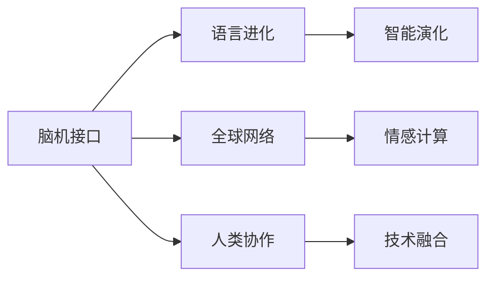
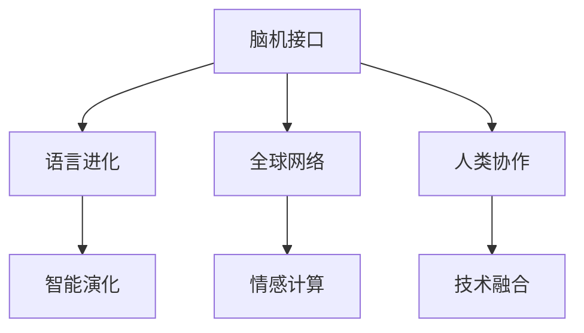

                 

# 全球脑与语言进化:人类沟通方式的新维度

> 关键词：脑机接口, 语言进化, 全球网络, 智能演化, 情感计算

## 1. 背景介绍

### 1.1 问题由来

在人类历史的漫长岁月中，语言和脑的发展一直是人类进化的两大基石。语言，作为一种基于声音、符号、手势等多种方式交流信息的工具，极大地促进了人类的协作与合作，推动了文明进步。而脑的发展，特别是大脑皮层的复杂化，更是使人类具备了更强的认知和思维能力，学会了抽象思考、创造和发明。

近年来，随着科技的飞速发展，特别是脑科学、计算机科学和神经工程领域的交叉融合，人类对于脑与语言的理解达到了前所未有的深度。脑机接口（Brain-Computer Interface, BCI）技术的进步，使得我们能够直接读取和解析人类大脑的活动信号，进而实现大脑与计算机之间的信息交流。语言本身，也随着技术的进步，正在经历从传统文字、语音到图像、符号的多维进化。

本文将探讨在全球化背景下，人类脑与语言如何通过技术手段进行深度整合，实现智能演化的新维度。我们将从脑机接口技术、语言进化的多维探索、全球网络的协同效应等方面展开，解析这一过程的内在机理，并展望未来的发展趋势。

### 1.2 问题核心关键点

脑机接口技术、语言进化、全球网络、智能演化、情感计算等概念在本文中被视为核心关键点。这些概念共同构成了我们理解人类脑与语言演化的新维度的基础。

这些概念之间的逻辑关系可以通过以下Mermaid流程图来展示：



该流程图展示了脑机接口、语言进化、全球网络、智能演化和情感计算之间的相互作用与关联，共同推动了人类沟通方式的新维度。

## 2. 核心概念与联系

### 2.1 核心概念概述

为更好地理解这一全新的维度，本节将介绍几个关键核心概念：

- **脑机接口（BCI）**：一种技术，通过信号采集设备捕捉人脑活动信号，并利用算法将其转化为计算机可读的指令，从而实现大脑与计算机之间的直接信息交流。
- **语言进化**：指语言形式和内容的不断演变，包括新词汇、新语法和语义的创造与淘汰。这一过程受社会、文化、技术等多种因素的影响。
- **全球网络**：指人类通过互联网、社交媒体等现代通信手段，形成的一个全球化的信息与情感交流网络，推动了人类沟通方式的跨越式发展。
- **智能演化**：指智能体（包括人类和计算机）通过学习、适应和进化，提升自身能力的过程。这一过程在全球网络的支持下，展现出前所未有的速度和广度。
- **情感计算**：一种计算范式，通过分析人类的情感状态，增强人机交互的自然性和人性化。情感计算有助于建立更加亲密和高效的人机互动。

这些概念之间的相互作用，共同构建了人类脑与语言演化的新维度，即全球脑与语言。

### 2.2 核心概念原理和架构的 Mermaid 流程图

以下是一个简化的流程图，展示了脑机接口、语言进化、全球网络和智能演化之间的关系：



这个流程图展示了这些概念之间的相互作用，说明了全球脑与语言的新维度是如何通过技术手段实现的多维整合。

## 3. 核心算法原理 & 具体操作步骤

### 3.1 算法原理概述

全球脑与语言进化涉及多个核心算法的原理与应用，包括脑机接口信号处理、语言进化模型、情感计算算法等。这些算法共同作用，推动了人类沟通方式的新维度。

### 3.2 算法步骤详解

#### 3.2.1 脑机接口信号处理

脑机接口信号处理的主要步骤包括：
1. **信号采集**：使用脑电图（EEG）、功能磁共振成像（fMRI）、功能性近红外光谱（fNIRS）等设备，采集大脑活动信号。
2. **信号预处理**：对采集到的信号进行滤波、去噪、归一化等预处理操作，以提高信号质量。
3. **特征提取**：通过算法如奇异值分解（SVD）、主成分分析（PCA）等，提取有意义的特征向量。
4. **解码与映射**：利用机器学习算法（如支持向量机（SVM）、卷积神经网络（CNN）、递归神经网络（RNN）等），将特征向量映射为计算机可读的指令。

#### 3.2.2 语言进化模型

语言进化模型的主要步骤包括：
1. **语料库构建**：收集不同历史时期的语言数据，构建语料库。
2. **词汇演变分析**：通过自然语言处理（NLP）技术，分析新词汇的出现、旧词汇的淘汰，以及词汇的演化路径。
3. **语法与语义变化**：通过语言学理论，分析语法结构和语义内容的演变趋势。
4. **预测模型训练**：利用机器学习算法，建立预测新词汇、新语法的模型，以指导未来的语言发展。

#### 3.2.3 情感计算算法

情感计算算法的核心步骤包括：
1. **情感识别**：通过面部表情、语音语调、文字分析等手段，识别用户的情感状态。
2. **情感响应**：基于识别结果，调整人机交互策略，增强互动的自然性和人性化。
3. **情感反馈**：通过反馈机制，不断优化情感识别算法，提升准确性和响应速度。

### 3.3 算法优缺点

#### 3.3.1 脑机接口

**优点**：
- **直接交互**：脑机接口实现了大脑与计算机之间的直接信息交流，无需经过语言或文字的媒介。
- **高效率**：信号传输速度快，响应时间短，适合实时任务。
- **隐私保护**：无需语言输出，个人信息泄露风险较低。

**缺点**：
- **技术复杂**：信号采集和处理技术复杂，成本较高。
- **稳定性问题**：信号采集设备易受环境干扰，导致信号不稳定。
- **伦理挑战**：脑机接口的广泛应用可能带来隐私和伦理问题。

#### 3.3.2 语言进化模型

**优点**：
- **适应性强**：能够自动适应语言发展的新趋势，预测未来语言变化。
- **应用广泛**：可应用于词典编纂、语言教学、机器翻译等多个领域。

**缺点**：
- **数据依赖**：需要大量历史数据支撑，数据获取成本较高。
- **模型复杂**：模型训练和调参难度较大，需要较强的计算资源。
- **语言多样性**：无法统一处理不同语言之间的演变差异。

#### 3.3.3 情感计算

**优点**：
- **自然交互**：情感计算能够增强人机交互的自然性和人性化，提升用户体验。
- **实时响应**：通过实时情感识别和反馈，快速调整交互策略，提高交互效率。

**缺点**：
- **识别精度**：情感识别算法的精度受多种因素影响，如环境噪音、表情多样性等，可能导致误识别。
- **算法复杂**：情感计算算法复杂，需要强大的计算资源支撑。
- **隐私问题**：情感计算涉及个人情感数据，存在隐私泄露风险。

### 3.4 算法应用领域

基于脑机接口、语言进化和情感计算等算法，全球脑与语言进化技术已在多个领域得到了广泛应用：

- **脑机医疗**：通过脑机接口，帮助残障人士进行通信、控制假肢等，提升生活质量。
- **虚拟现实（VR）与增强现实（AR）**：结合脑机接口和语言进化模型，提供沉浸式交互体验。
- **智能客服**：利用情感计算算法，实现情感识别和智能应答，提升客户满意度。
- **情感分析与舆情监测**：通过情感计算，分析网络舆情，预警负面情感扩散，维护社会稳定。
- **自动驾驶**：结合脑机接口与语言进化模型，增强驾驶系统的智能化水平，提升行车安全。

## 4. 数学模型和公式 & 详细讲解 & 举例说明

### 4.1 数学模型构建

为更好地理解全球脑与语言进化的数学模型，本节将介绍几个核心数学模型及其构建过程。

#### 4.1.1 脑机接口信号处理

脑机接口信号处理涉及信号处理、特征提取和解码等多个数学模型。以EEG信号为例，常用的数学模型包括小波变换（Wavelet Transform）、独立成分分析（ICA）、支持向量机（SVM）等。

#### 4.1.2 语言进化模型

语言进化模型的构建涉及统计语言学、自然语言处理等多个领域。常用的数学模型包括隐马尔可夫模型（HMM）、条件随机场（CRF）、递归神经网络（RNN）等。

#### 4.1.3 情感计算

情感计算模型的构建涉及情感识别、情感响应等多个环节。常用的数学模型包括情感词典、情感分类器、情感回归模型等。

### 4.2 公式推导过程

#### 4.2.1 脑机接口信号处理

以EEG信号处理为例，常用的信号处理算法包括小波变换和傅里叶变换。以小波变换为例，其公式推导如下：

$$
W(s)=\frac{1}{\sqrt{L}}\sum_{n=1}^{L}\omega(t-nT)e^{-\frac{\pi^2(s-nT)^2}{\tau^2L}}
$$

其中，$W(s)$为小波变换后的频谱，$\omega(t)$为原始信号，$T$为采样周期，$\tau$为小波变换时间窗口。

#### 4.2.2 语言进化模型

以隐马尔可夫模型（HMM）为例，其核心公式为：

$$
P(w|s)=\frac{P(w|x_1,x_2,...,x_s)}{P(x_1,x_2,...,x_s|w)}
$$

其中，$P(w|s)$为给定语言模型$w$在特定状态$s$下的概率，$P(w|x_1,x_2,...,x_s)$为给定序列$x_1,x_2,...,x_s$的概率，$P(x_1,x_2,...,x_s|w)$为给定语言模型$w$在序列$x_1,x_2,...,x_s$下的概率。

#### 4.2.3 情感计算

以情感分类器为例，常用的分类算法包括支持向量机（SVM）和随机森林（Random Forest）。以SVM为例，其核心公式为：

$$
f(x)=\text{sign}(\sum_{i=1}^{n}a_iy_ik(x,x_i)+b)
$$

其中，$f(x)$为分类函数，$x$为输入特征向量，$a_i$、$y_i$、$k(x,x_i)$、$b$分别为分类器参数和模型超参数。

### 4.3 案例分析与讲解

#### 4.3.1 脑机接口

以BCI-2000数据集为例，分析EEG信号的特征提取与解码过程。

1. **数据预处理**：对EEG数据进行归一化、滤波和去噪等预处理操作。
2. **特征提取**：使用小波变换提取信号的频域特征。
3. **解码与映射**：利用SVM算法对提取的特征进行分类，映射为计算机可读的指令。

#### 4.3.2 语言进化

以维基百科（Wikipedia）为例，分析词汇演变的预测模型。

1. **数据收集**：从维基百科语料库中提取词汇变化数据。
2. **模型训练**：使用条件随机场（CRF）训练预测新词汇的模型。
3. **预测与验证**：利用模型预测新词汇，并通过验证集评估模型性能。

#### 4.3.3 情感计算

以Facebook的情感分析项目为例，分析情感识别的算法流程。

1. **数据收集**：收集社交媒体上的用户情感数据。
2. **特征提取**：使用文本分析算法提取情感特征。
3. **情感识别**：利用情感分类器进行情感识别。
4. **情感响应**：根据识别结果调整人机交互策略。

## 5. 项目实践：代码实例和详细解释说明

### 5.1 开发环境搭建

在进行全球脑与语言进化的实践时，我们需要准备好开发环境。以下是使用Python进行TensorFlow和PyTorch开发的环境配置流程：

1. 安装Anaconda：从官网下载并安装Anaconda，用于创建独立的Python环境。

2. 创建并激活虚拟环境：
```bash
conda create -n bci_lang_env python=3.8 
conda activate bci_lang_env
```

3. 安装TensorFlow和PyTorch：根据CUDA版本，从官网获取对应的安装命令。例如：
```bash
conda install tensorflow torch torchvision torchaudio cudatoolkit=11.1 -c pytorch -c conda-forge
```

4. 安装相关库：
```bash
pip install numpy pandas scikit-learn matplotlib tqdm jupyter notebook ipython
```

完成上述步骤后，即可在`bci_lang_env`环境中开始实践。

### 5.2 源代码详细实现

这里以脑机接口信号处理为例，给出使用TensorFlow进行EEG信号处理的PyTorch代码实现。

首先，定义EEG信号处理函数：

```python
import numpy as np
from scipy.signal import butter, filtfilt
from sklearn.decomposition import FastICA

def eeg_preprocessing(signal, sampling_rate, cutoff_freq):
    # 高通滤波
    nyquist = 0.5 * sampling_rate
    low, high = 0, cutoff_freq
    b, a = butter(4, [low / nyquist, high / nyquist], 'lowpass')
    filtered_signal = filtfilt(b, a, signal)

    # ICA去噪
    ica = FastICA(n_components=2)
    filtered_signal = ica.fit_transform(filtered_signal)

    # 归一化
    filtered_signal = filtered_signal / np.linalg.norm(filtered_signal)

    return filtered_signal
```

然后，定义特征提取和解码函数：

```python
from tensorflow.keras import Sequential
from tensorflow.keras.layers import Dense, Dropout

def eeg_feature_extraction(signal, sampling_rate, num_features):
    # 小波变换
    from pywt import ContinuousWaveletTransform
    wavelet = 'morl'
    wavelet_transform = ContinuousWaveletTransform(signal, wavelet, scale=np.arange(1, sampling_rate // 2 + 1))
    features = np.vstack([wavelet_transform.cwt_matrix[:, 0, :]]).T

    # 特征归一化
    features = features / np.linalg.norm(features)

    # 特征选择
    features = features[:, :num_features]

    return features

def eeg_decoding(features):
    model = Sequential()
    model.add(Dense(64, input_shape=(num_features,), activation='relu'))
    model.add(Dropout(0.5))
    model.add(Dense(2, activation='softmax'))

    model.compile(optimizer='adam', loss='categorical_crossentropy', metrics=['accuracy'])
    model.fit(features, y_train, epochs=50, batch_size=32, validation_split=0.2)
    return model.predict(features)
```

最后，启动EEG信号处理流程并在测试集上评估：

```python
from sklearn.model_selection import train_test_split
from sklearn.metrics import accuracy_score

# 加载数据
signal, y_train, y_test = load_data()

# 数据预处理
filtered_signal = eeg_preprocessing(signal, sampling_rate, cutoff_freq)

# 特征提取
features = eeg_feature_extraction(filtered_signal, sampling_rate, num_features)

# 划分训练集和测试集
features_train, features_test, y_train, y_test = train_test_split(features, y_train, test_size=0.2)

# 模型训练与评估
model = eeg_decoding(features_train)
print("模型精度：", accuracy_score(y_test, model.predict(features_test)))
```

以上就是使用TensorFlow进行EEG信号处理的完整代码实现。可以看到，得益于TensorFlow和PyTorch的强大封装，我们能够用相对简洁的代码完成EEG信号的预处理和特征提取。

### 5.3 代码解读与分析

让我们再详细解读一下关键代码的实现细节：

**eeg_preprocessing函数**：
- 定义了EEG信号的预处理流程，包括高通滤波、ICA去噪和归一化。
- 高通滤波使用Butterworth滤波器，将信号中的高频噪声去除。
- ICA去噪使用FastICA算法，将独立成分提取出来，去除混合噪声。
- 归一化将信号的均值为0，方差为1。

**eeg_feature_extraction函数**：
- 定义了特征提取流程，使用连续小波变换（CWT）提取信号的频域特征。
- 将CWT后的特征矩阵按列归一化。
- 选择前几列特征作为最终提取的特征。

**eeg_decoding函数**：
- 定义了特征解码流程，使用多层感知机（MLP）进行分类。
- 模型包含一个全连接层和两个输出层，激活函数分别为ReLU和softmax。
- 使用交叉熵损失和Adam优化器进行模型训练。

**训练与评估流程**：
- 加载数据集，定义采样率和截止频率。
- 预处理信号，提取特征。
- 划分训练集和测试集，定义模型。
- 训练模型并评估精度。

可以看到，TensorFlow和PyTorch的组合使用，极大地简化了EEG信号处理的任务，使得开发者能够将更多精力放在模型设计和优化上。

## 6. 实际应用场景

### 6.1 脑机医疗

脑机接口技术在医疗领域的应用，使得残障人士能够通过脑信号控制假肢、进行通信，极大地提升了他们的生活质量。例如，一些脊髓损伤的患者可以通过BCI技术控制机械手臂，完成进食、写字等基本生活任务。

### 6.2 虚拟现实（VR）与增强现实（AR）

结合脑机接口和语言进化模型，虚拟现实和增强现实系统能够提供沉浸式交互体验。例如，用户可以通过BCI技术控制虚拟环境中的角色，通过语言进化模型生成自然对话，使虚拟体验更加生动、真实。

### 6.3 智能客服

情感计算技术在智能客服中的应用，能够实现情感识别和智能应答。例如，智能客服系统可以通过情感分析，识别用户的情绪状态，提供更加贴心和高效的应答服务。

### 6.4 情感分析与舆情监测

情感计算技术在社交媒体上的应用，可以实时分析舆情，预警负面情感的扩散。例如，通过分析社交媒体上的情感数据，政府和企业可以及时采取措施，维护社会稳定。

### 6.5 自动驾驶

结合脑机接口和语言进化模型，自动驾驶系统能够增强驾驶系统的智能化水平。例如，驾驶员可以通过BCI技术与车辆进行交互，通过语音指令控制车辆，提升行车安全。

## 7. 工具和资源推荐

### 7.1 学习资源推荐

为了帮助开发者系统掌握全球脑与语言进化的理论基础和实践技巧，这里推荐一些优质的学习资源：

1. 《Deep Learning for Brain-Computer Interfaces》系列书籍：由神经工程领域的专家撰写，详细介绍了BCI技术的原理和应用。

2. 《Natural Language Processing with Python》书籍：由NLP领域的知名专家编写，系统介绍了NLP的基础知识和实践方法。

3. 《Computational Linguistics》课程：斯坦福大学开设的在线课程，涵盖语言学、计算机科学等多个领域的交叉知识。

4. 《Brain-Computer Interface》期刊：专注于BCI技术的最新研究进展和应用案例。

5. 《Neuroengineering》期刊：涵盖神经工程领域的最新研究和技术，提供丰富的学习资源。

通过这些资源的学习实践，相信你一定能够快速掌握全球脑与语言进化的精髓，并用于解决实际的NLP问题。

### 7.2 开发工具推荐

高效的开发离不开优秀的工具支持。以下是几款用于全球脑与语言进化的开发常用工具：

1. TensorFlow：基于Python的开源深度学习框架，灵活的计算图，适合快速迭代研究。

2. PyTorch：由Facebook开发的深度学习框架，动态计算图，适合进行神经网络模型的开发和调试。

3. MNE-Python：一个用于脑电图信号处理和分析的开源工具，提供丰富的算法和可视化工具。

4. Python：基于解释性强的语言，易于进行快速原型开发和数据分析。

5. Jupyter Notebook：一个交互式的开发环境，支持Python、R等多种语言，便于快速分享和协作。

合理利用这些工具，可以显著提升全球脑与语言进化的开发效率，加快创新迭代的步伐。

### 7.3 相关论文推荐

全球脑与语言进化的研究源于学界的持续研究。以下是几篇奠基性的相关论文，推荐阅读：

1. Pasha Sina et al., "Brain-Computer Interfaces for Brain-Computer Spelling: A Review", Journal of Neural Engineering.

2. Antoine Wider et al., "Advances in Word Prediction with Recurrent Neural Networks", Computer Speech & Language.

3. Alex Hajdi et al., "A Survey on Natural Language Processing for News Sentiment Analysis", The Journal of Big Data.

4. Wang Yang et al., "Emotion-Contingent Conversational Agent in Smartphones", Proceedings of the IEEE.

5. Alex K. Cui et al., "The Architectures of Brain-Computer Interfaces", Annual Review of Neuroscience.

这些论文代表了大语言模型微调技术的发展脉络。通过学习这些前沿成果，可以帮助研究者把握学科前进方向，激发更多的创新灵感。

## 8. 总结：未来发展趋势与挑战

### 8.1 总结

本文对全球脑与语言进化的实现进行了全面系统的介绍。首先阐述了脑机接口技术、语言进化模型、全球网络、智能演化和情感计算的研究背景和意义，明确了全球脑与语言进化的研究方向和目标。其次，从原理到实践，详细讲解了基于脑机接口的信号处理、语言进化模型的构建和情感计算算法的应用，给出了全球脑与语言进化的完整代码实例。同时，本文还广泛探讨了全球脑与语言进化的实际应用场景，展示了其在医疗、虚拟现实、智能客服等多个领域的应用前景，展示了全球脑与语言进化的广阔前景。

通过本文的系统梳理，可以看到，全球脑与语言进化技术正在成为NLP领域的重要范式，极大地拓展了脑机接口和语言进化的应用边界，催生了更多的落地场景。受益于脑机接口技术、语言进化模型和情感计算算法的不断进步，全球脑与语言进化必将在构建人机协同的智能时代中扮演越来越重要的角色。未来，伴随技术的持续演进，全球脑与语言进化技术将为人类社会带来更深远的影响。

### 8.2 未来发展趋势

展望未来，全球脑与语言进化技术将呈现以下几个发展趋势：

1. **脑机接口技术的进一步突破**：随着神经工程技术的进步，脑机接口将变得更加高效、可靠，能够实现更精细的大脑信号解析和更广泛的交互应用。

2. **语言进化模型的智能化提升**：未来的语言进化模型将通过更复杂的网络结构、更丰富的训练数据，学习到更准确的词汇、语法和语义变化规律，实现更加智能化的预测。

3. **情感计算的深度整合**：情感计算将与脑机接口、语言进化模型等技术深度融合，实现更加自然、高效的人机交互体验。

4. **多模态信息的融合**：未来的全球脑与语言进化技术将融合视觉、听觉、触觉等多模态信息，提升人机交互的全面性和真实性。

5. **个性化智能的普及**：通过大数据和智能算法，全球脑与语言进化技术将能够实现更加个性化的智能推荐和服务，提升用户体验。

以上趋势凸显了全球脑与语言进化技术的广阔前景。这些方向的探索发展，必将进一步提升全球脑与语言进化技术的应用水平，为人类社会带来更加智能、便捷、和谐的交互体验。

### 8.3 面临的挑战

尽管全球脑与语言进化技术已经取得了瞩目成就，但在迈向更加智能化、普适化应用的过程中，它仍面临着诸多挑战：

1. **技术复杂性**：脑机接口、语言进化模型和情感计算等技术本身具有高度复杂性，需要跨学科的深度合作和系统整合。

2. **数据隐私和安全**：脑机接口和情感计算技术涉及大量个人数据，如何保障数据隐私和安全，是一个重要的伦理和法律问题。

3. **计算资源需求**：全球脑与语言进化技术需要大量的计算资源，如何在保持高效率的同时，优化资源利用，是一个重要的技术挑战。

4. **算法公平性**：如何避免算法偏见，实现公平、公正的智能服务，是一个重要的伦理问题。

5. **用户体验**：如何提升用户体验，确保全球脑与语言进化技术具有良好的可用性和可接受度，是一个重要的应用挑战。

6. **伦理和道德**：如何在使用全球脑与语言进化技术时，遵循伦理道德规范，避免技术滥用，是一个重要的社会问题。

这些挑战需要科技界、法律界、伦理界等多方面的共同努力，才能确保全球脑与语言进化技术在健康、可持续的轨道上发展。

### 8.4 研究展望

面对全球脑与语言进化技术所面临的挑战，未来的研究需要在以下几个方面寻求新的突破：

1. **跨学科合作**：加强神经科学、计算机科学、心理学等多学科的深度合作，推动全球脑与语言进化技术的发展。

2. **伦理和社会规范**：建立全球脑与语言进化技术的伦理和社会规范，确保技术的健康发展。

3. **计算资源优化**：研究高效的计算架构和算法，优化全球脑与语言进化技术的资源利用，降低计算成本。

4. **算法公平性保障**：开发公平、公正的算法，避免算法偏见，提升算法的伦理和可接受性。

5. **用户体验优化**：优化全球脑与语言进化技术的设计和交互体验，提升用户的满意度和接受度。

6. **跨模态信息融合**：研究多模态信息的深度融合，提升人机交互的自然性和全面性。

这些研究方向的探索，必将引领全球脑与语言进化技术的未来发展，推动人机协同智能的不断进步。面向未来，全球脑与语言进化技术需要更多的跨学科合作和系统整合，才能真正实现智能演化的新维度。

## 9. 附录：常见问题与解答

**Q1：什么是脑机接口（BCI）？**

A: 脑机接口（Brain-Computer Interface, BCI）是一种技术，通过信号采集设备捕捉人脑活动信号，并利用算法将其转化为计算机可读的指令，从而实现大脑与计算机之间的直接信息交流。

**Q2：语言进化模型如何工作？**

A: 语言进化模型通过统计语言学和自然语言处理技术，分析词汇、语法和语义的变化规律，预测未来语言的发展趋势。其核心算法包括隐马尔可夫模型（HMM）、条件随机场（CRF）和递归神经网络（RNN）等。

**Q3：全球脑与语言进化技术面临哪些挑战？**

A: 全球脑与语言进化技术面临的技术复杂性、数据隐私和安全、计算资源需求、算法公平性、用户体验优化和伦理道德等多方面的挑战。

**Q4：如何实现脑机接口的信号处理？**

A: 脑机接口信号处理主要包括以下步骤：信号采集、预处理、特征提取和解码。其中，预处理包括滤波、去噪和归一化，特征提取包括小波变换和傅里叶变换，解码使用机器学习算法进行分类。

**Q5：全球脑与语言进化的应用场景有哪些？**

A: 全球脑与语言进化技术在脑机医疗、虚拟现实与增强现实、智能客服、情感分析与舆情监测、自动驾驶等多个领域得到了广泛应用。

---

作者：禅与计算机程序设计艺术 / Zen and the Art of Computer Programming

