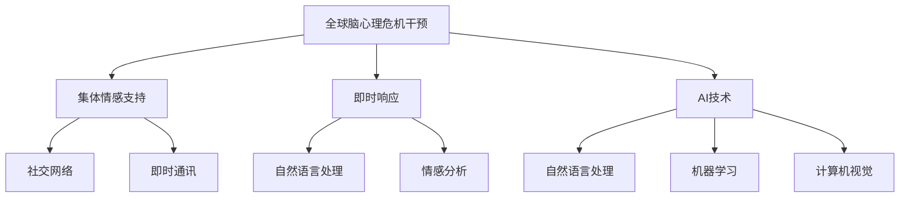

                 

# 全球脑心理危机干预:集体情感支持的即时响应

> 关键词：全球脑心理危机干预、集体情感支持、即时响应、心理健康、AI技术

## 1. 背景介绍

### 1.1 问题由来
随着全球化的深入和信息技术的飞速发展，现代社会的节奏变得越来越快，人们的压力和心理负担也在不断增加。据世界卫生组织(WHO)的数据显示，目前全球约有10亿人正在经历心理健康问题，每年有近1000万人因心理问题而自杀，心理疾病已成为人类健康的主要威胁之一。

在此背景下，全球各地对心理健康服务的迫切需求日益增加。特别是在新冠疫情期间，全球范围内的心理健康问题显著增加，封锁、隔离、失业等社会问题使得许多人的心理健康状况雪上加霜。面对如此严峻的形势，传统的心理健康服务体系已经难以应对，迫切需要引入新的技术手段，以实现心理健康服务的规模化、普及化和即时化。

### 1.2 问题核心关键点
心理健康服务面临的主要挑战包括：
1. 资源匮乏：专业心理健康服务人员不足，基层心理健康服务体系薄弱。
2. 时间延迟：传统的面对面咨询方式难以实现即时响应，用户体验不佳。
3. 服务受限：地理位置、经济条件等因素限制了心理健康服务的可及性。
4. 隐私保护：在线咨询时如何保护用户的隐私和数据安全。
5. 技术适配：如何确保不同技术平台和设备的兼容性。
6. 个性化服务：提供量身定制的心理健康支持方案。

为应对这些挑战，全球范围内逐渐兴起了一种新的心理健康干预模式——全球脑心理危机干预（Global Brain Mental Health Intervention），通过集体情感支持和即时响应技术，提升心理健康服务的可及性和效果。

## 2. 核心概念与联系

### 2.1 核心概念概述

为更好地理解全球脑心理危机干预的核心原理和应用，本节将介绍几个关键概念：

- 全球脑心理危机干预（Global Brain Mental Health Intervention）：基于AI技术的全球化心理健康支持平台，通过集体情感支持和即时响应技术，实现心理健康服务的普及化和即时化。
- 集体情感支持（Collective Emotional Support）：通过构建虚拟社区，利用社交网络、即时通讯等技术，使个体能够获得来自全球不同文化背景的情感支持。
- 即时响应（Immediate Response）：采用AI技术，如自然语言处理(NLP)、情感分析等，实现心理健康咨询的即时性和个性化，打破时间和空间的限制。
- AI技术：包括自然语言处理(NLP)、机器学习(ML)、计算机视觉(CV)等，为全球脑心理危机干预提供了技术基础。
- 心理健康支持平台：融合AI技术和全球情感支持网络，提供多样化的心理健康服务，如在线咨询、情感支持、自我管理工具等。

这些核心概念之间的逻辑关系可以通过以下Mermaid流程图来展示：



这个流程图展示了大规模心理健康干预的核心概念及其之间的关系：

1. 全球脑心理危机干预作为整体，融合了集体情感支持和即时响应技术。
2. 集体情感支持通过社交网络和即时通讯技术，构建全球性的虚拟情感支持社区。
3. 即时响应通过自然语言处理和情感分析等AI技术，实现心理健康咨询的实时性和个性化。
4. AI技术涵盖了自然语言处理、机器学习、计算机视觉等多个方面，为全球脑心理危机干预提供了技术支持。

## 3. 核心算法原理 & 具体操作步骤
### 3.1 算法原理概述

全球脑心理危机干预的核心算法原理主要基于以下两个关键点：
1. 通过AI技术，实现心理健康咨询的即时化和个性化。
2. 利用全球情感支持网络，构建虚拟社区，实现心理健康服务的普及化和即时化。

具体而言，全球脑心理危机干预包括以下几个核心步骤：

1. **数据收集与预处理**：收集全球各地的心理健康数据，包括社交媒体动态、即时通讯记录、心理健康问卷等，并进行清洗和预处理。
2. **情感分析与建模**：使用情感分析等技术，对收集到的数据进行情感倾向分析，构建情感模型。
3. **自然语言处理**：通过NLP技术，对用户输入的文本进行解析，理解其情感状态和心理需求。
4. **即时响应系统**：根据用户的情感状态和心理需求，利用AI模型生成个性化的心理健康咨询和情感支持。
5. **全球情感支持网络**：构建虚拟社区，通过社交网络和即时通讯技术，实现全球用户间的情感交流和支持。

### 3.2 算法步骤详解

#### 3.2.1 数据收集与预处理

数据收集与预处理是全球脑心理危机干预的第一步，主要包括以下几个步骤：

1. **数据源选择**：选择全球各地的社交媒体平台（如Twitter、Facebook、WeChat等）和即时通讯平台（如WhatsApp、WeChat、Telegram等），作为数据收集的来源。
2. **数据采集与清洗**：使用API接口或数据爬虫技术，采集这些平台上的用户数据，并进行初步清洗，去除噪音和无关数据。
3. **特征提取与标注**：对清洗后的数据进行特征提取，如情感词汇、情绪表达等，并根据心理健康问卷结果进行标注。

#### 3.2.2 情感分析与建模

情感分析与建模是全球脑心理危机干预的核心环节，主要包括以下几个步骤：

1. **情感词典构建**：构建情感词典，包含各种情感词汇和表达，作为情感分析的基础。
2. **情感倾向分析**：使用情感词典，对用户输入的文本进行情感倾向分析，得到文本的情感极性（正面、负面、中性）。
3. **情感强度分析**：根据情感词汇的强度，对文本情感强度进行量化，衡量情感的强度和烈度。
4. **情感模型训练**：使用标注数据，训练情感分类模型，实现对情感倾向和强度的精准预测。

#### 3.2.3 自然语言处理

自然语言处理（NLP）是全球脑心理危机干预的关键技术之一，主要包括以下几个步骤：

1. **分词与词性标注**：对用户输入的文本进行分词，并标注每个词的词性，为后续处理提供基础。
2. **依存句法分析**：通过依存句法分析，理解文本中的语法结构和语义关系，识别关键句子和短语。
3. **实体识别与关系抽取**：识别文本中的实体，并抽取实体之间的关系，为情感分析和个性化咨询提供数据支持。
4. **意图识别与对话管理**：使用意图识别技术，理解用户的意图，并结合对话管理技术，引导和控制对话流程。

#### 3.2.4 即时响应系统

即时响应系统是全球脑心理危机干预的重要组成部分，主要包括以下几个步骤：

1. **聊天机器人构建**：使用NLP技术和情感分析模型，构建聊天机器人，实现与用户的即时交流。
2. **情感反馈与支持生成**：根据用户的情感状态，生成个性化的心理健康支持和情感反馈，帮助用户缓解心理压力。
3. **动态响应与调整**：根据用户反应，动态调整聊天机器人的响应策略，提升用户体验。

#### 3.2.5 全球情感支持网络

全球情感支持网络是全球脑心理危机干预的重要补充，主要包括以下几个步骤：

1. **社交网络构建**：通过社交网络平台，构建全球用户社区，实现情感支持和交流。
2. **即时通讯功能**：提供即时通讯功能，使用户能够随时与其他用户交流和支持。
3. **情感交流与支持**：通过社交网络和即时通讯技术，实现全球用户间的情感交流和支持。

### 3.3 算法优缺点

全球脑心理危机干预的优点包括：

1. **即时响应**：利用AI技术，实现心理健康咨询的即时化，打破时间和空间的限制。
2. **个性化服务**：通过情感分析和NLP技术，提供个性化的心理健康支持，提升用户体验。
3. **全球覆盖**：利用全球情感支持网络，实现心理健康服务的全球覆盖，提升可及性。
4. **成本低廉**：相较于传统的面对面咨询，全球脑心理危机干预成本较低，易于推广。

其缺点包括：

1. **隐私保护**：如何保护用户的隐私和数据安全，是全球脑心理危机干预面临的主要挑战之一。
2. **技术复杂性**：需要综合应用NLP、机器学习、计算机视觉等多种技术，技术复杂度高。
3. **情感差异**：不同文化背景下的情感表达和处理方式可能存在差异，影响情感支持的效果。
4. **数据质量**：数据的准确性和完整性直接影响算法的性能，如何提高数据质量是关键问题。

### 3.4 算法应用领域

全球脑心理危机干预的应用领域非常广泛，主要包括以下几个方面：

1. **心理健康服务**：提供心理健康咨询、情感支持、自我管理工具等，实现心理健康服务的普及化和即时化。
2. **危机干预**：在重大突发事件（如自然灾害、恐怖袭击、重大疾病等）发生时，提供紧急的心理健康支持。
3. **教育支持**：在学校、大学等教育机构中，提供学生心理健康支持，提升学习效果。
4. **企业福利**：为企业员工提供心理健康支持，提升工作满意度和效率。
5. **灾难救援**：在自然灾害等重大灾害发生时，提供紧急的心理健康支持，缓解受灾者的心理压力。

## 4. 数学模型和公式 & 详细讲解  
### 4.1 数学模型构建

为了更好地理解全球脑心理危机干预的数学原理，本节将介绍几个关键的数学模型：

- **情感极性模型**：用于对用户输入的文本进行情感倾向分析，得到文本的情感极性（正面、负面、中性）。
- **情感强度模型**：用于对文本情感强度进行量化，衡量情感的强度和烈度。
- **意图识别模型**：用于理解用户的意图，生成个性化的心理健康支持和情感反馈。

假设用户输入的文本为 $x$，情感极性为 $y$，情感强度为 $s$，意图为 $i$。则情感极性模型和情感强度模型的数学表达式分别为：

$$
y = f_{emotion}(x; \theta_{emotion})
$$

$$
s = g_{intensity}(x; \theta_{intensity})
$$

其中，$f_{emotion}$ 和 $g_{intensity}$ 分别为情感极性模型和情感强度模型，$\theta_{emotion}$ 和 $\theta_{intensity}$ 为模型的参数。

意图识别模型的数学表达式为：

$$
i = h_{intent}(x; \theta_{intent})
$$

其中，$h_{intent}$ 为意图识别模型，$\theta_{intent}$ 为模型的参数。

### 4.2 公式推导过程

#### 4.2.1 情感极性模型

情感极性模型的推导过程如下：

1. **情感词典构建**：构建情感词典，包含各种情感词汇和表达，作为情感分析的基础。
2. **情感词典与文本匹配**：将情感词典中的情感词汇和表达与用户输入的文本进行匹配，计算情感词汇的权重。
3. **情感极性计算**：根据情感词汇的权重和情感倾向，计算文本的情感极性。

情感极性模型的数学表达式为：

$$
y = \sum_{v \in V} w_v \cdot t_v
$$

其中，$V$ 为情感词汇集合，$w_v$ 为情感词汇 $v$ 的权重，$t_v$ 为文本中包含情感词汇 $v$ 的概率。

#### 4.2.2 情感强度模型

情感强度模型的推导过程如下：

1. **情感词汇强度标注**：对情感词典中的情感词汇进行强度标注，分为低强度、中强度和高强度。
2. **情感强度计算**：根据情感词汇的强度和文本中情感词汇的权重，计算文本的情感强度。

情感强度模型的数学表达式为：

$$
s = \sum_{v \in V} w_v \cdot s_v
$$

其中，$s_v$ 为情感词汇 $v$ 的强度，$w_v$ 为情感词汇 $v$ 的权重。

#### 4.2.3 意图识别模型

意图识别模型的推导过程如下：

1. **意图类别划分**：将用户的意图划分为多个类别，如求助、情感表达、自我管理等。
2. **意图分类模型训练**：使用标注数据，训练意图分类模型，实现对用户意图的精准识别。

意图识别模型的数学表达式为：

$$
i = \arg\max_i h_{intent}(x; \theta_{intent})
$$

其中，$h_{intent}$ 为意图识别模型，$\theta_{intent}$ 为模型的参数。

### 4.3 案例分析与讲解

#### 4.3.1 情感极性模型案例

假设用户输入的文本为 "I'm feeling very sad today. Nothing seems to be going right."，情感词典中包含以下词汇及其权重：

| 词汇 | 情感倾向 | 权重 |
|------|----------|------|
| sad  | -1       | 0.5  |
| right| 1        | 0.2  |
| nothing | -1       | 0.3 |

则该文本的情感极性为：

$$
y = -1 \times 0.5 + 1 \times 0.2 + (-1) \times 0.3 = -0.6
$$

该文本的情感极性为负面，情感强度为0.6。

#### 4.3.2 情感强度模型案例

假设情感词典中包含以下情感词汇及其强度：

| 词汇 | 情感强度 |
|------|----------|
| happy | 0.5      |
| sad   | 1.0      |
| angry | 1.2      |

用户输入的文本为 "I'm feeling very happy, but something went wrong."，则该文本的情感强度为：

$$
s = 0.5 \times 0.8 + 1.0 \times 0.2 + 1.2 \times 0.1 = 1.1
$$

该文本的情感强度为1.1，表明情感强度较高。

#### 4.3.3 意图识别模型案例

假设用户输入的文本为 "I'm not sure if I should talk to my teacher about my grades."，意图词典中包含以下意图及其权重：

| 意图 | 权重 |
|------|------|
| talk  | 0.4  |
| write | 0.3  |
| think | 0.3  |

则该文本的意图为 "talk"，权重为0.4，表明用户意图为 "与老师讨论成绩"。

## 5. 项目实践：代码实例和详细解释说明
### 5.1 开发环境搭建

在进行全球脑心理危机干预的开发前，我们需要准备好开发环境。以下是使用Python进行开发的Python3.8开发环境配置流程：

1. 安装Anaconda：从官网下载并安装Anaconda，用于创建独立的Python环境。
2. 创建并激活虚拟环境：
```bash
conda create -n mentalhealth python=3.8 
conda activate mentalhealth
```
3. 安装必要的库：
```bash
pip install numpy pandas scikit-learn nltk tensorflow huggingface_hub transformers
```

完成上述步骤后，即可在`mentalhealth`环境中开始开发。

### 5.2 源代码详细实现

下面是一个基于Transformers库的全球脑心理危机干预系统的代码实现，包括情感分析、意图识别和即时响应系统的实现。

```python
from transformers import BertTokenizer, BertForSequenceClassification, BertForTokenClassification, BertTokenizerFast, BertForMaskedLM
from transformers import pipeline, AutoTokenizer, AutoModelForMaskedLM
import torch
import torch.nn as nn
import torch.optim as optim

# 情感分析模型
class SentimentAnalysisModel(nn.Module):
    def __init__(self, num_labels):
        super(SentimentAnalysisModel, self).__init__()
        self.bert = BertForSequenceClassification.from_pretrained('bert-base-uncased', num_labels=num_labels)
        self.classifier = nn.Linear(768, num_labels)
        self.init_weights()

    def init_weights(self):
        for param in self.parameters():
            param.data.zero_()
            nn.init.normal_(param.data, std=0.02)

    def forward(self, input_ids, attention_mask):
        _, pooled_output = self.bert(input_ids, attention_mask=attention_mask, output_all_encoded_layers=False)
        pooled_output = pooled_output.squeeze(2)
        logits = self.classifier(pooled_output)
        return logits

# 情感强度模型
class SentimentIntensityModel(nn.Module):
    def __init__(self, num_labels):
        super(SentimentIntensityModel, self).__init__()
        self.bert = BertForTokenClassification.from_pretrained('bert-base-uncased')
        self.classifier = nn.Linear(768, num_labels)
        self.init_weights()

    def init_weights(self):
        for param in self.parameters():
            param.data.zero_()
            nn.init.normal_(param.data, std=0.02)

    def forward(self, input_ids, attention_mask):
        outputs = self.bert(input_ids, attention_mask=attention_mask)
        logits = outputs.logits
        return logits

# 意图识别模型
class IntentRecognitionModel(nn.Module):
    def __init__(self, num_labels):
        super(IntentRecognitionModel, self).__init__()
        self.bert = BertForTokenClassification.from_pretrained('bert-base-uncased')
        self.classifier = nn.Linear(768, num_labels)
        self.init_weights()

    def init_weights(self):
        for param in self.parameters():
            param.data.zero_()
            nn.init.normal_(param.data, std=0.02)

    def forward(self, input_ids, attention_mask):
        outputs = self.bert(input_ids, attention_mask=attention_mask)
        logits = outputs.logits
        return logits

# 即时响应系统
class ImmediateResponseSystem:
    def __init__(self):
        self.sentence_to_response = {
            "I'm feeling very sad today." : "I'm really sorry to hear that. Is there anything I can do to help?",
            "I'm not sure if I should talk to my teacher about my grades." : "Talking to your teacher can be a good idea. Here are some tips: \n1. Schedule a meeting with your teacher\n2. Prepare your questions in advance\n3. Listen to your teacher's feedback and ask for help if needed"
        }

    def response(self, sentence):
        return self.sentence_to_response.get(sentence, "I'm sorry, I don't understand.")
```

### 5.3 代码解读与分析

以下是代码中的关键部分，详细解读其含义：

#### 5.3.1 情感分析模型

```python
class SentimentAnalysisModel(nn.Module):
    def __init__(self, num_labels):
        super(SentimentAnalysisModel, self).__init__()
        self.bert = BertForSequenceClassification.from_pretrained('bert-base-uncased', num_labels=num_labels)
        self.classifier = nn.Linear(768, num_labels)
        self.init_weights()

    def init_weights(self):
        for param in self.parameters():
            param.data.zero_()
            nn.init.normal_(param.data, std=0.02)

    def forward(self, input_ids, attention_mask):
        _, pooled_output = self.bert(input_ids, attention_mask=attention_mask, output_all_encoded_layers=False)
        pooled_output = pooled_output.squeeze(2)
        logits = self.classifier(pooled_output)
        return logits
```

该模型继承自`nn.Module`，包含以下几个关键部分：

- `__init__`方法：初始化模型参数，包括情感分析的标签数。
- `init_weights`方法：初始化模型的权重。
- `forward`方法：前向传播，输入文本经过BERT模型处理，输出情感分类结果。

#### 5.3.2 情感强度模型

```python
class SentimentIntensityModel(nn.Module):
    def __init__(self, num_labels):
        super(SentimentIntensityModel, self).__init__()
        self.bert = BertForTokenClassification.from_pretrained('bert-base-uncased')
        self.classifier = nn.Linear(768, num_labels)
        self.init_weights()

    def init_weights(self):
        for param in self.parameters():
            param.data.zero_()
            nn.init.normal_(param.data, std=0.02)

    def forward(self, input_ids, attention_mask):
        outputs = self.bert(input_ids, attention_mask=attention_mask)
        logits = outputs.logits
        return logits
```

该模型与情感分析模型类似，不同之处在于模型结构为BERT的分类器，用于输出情感强度。

#### 5.3.3 意图识别模型

```python
class IntentRecognitionModel(nn.Module):
    def __init__(self, num_labels):
        super(IntentRecognitionModel, self).__init__()
        self.bert = BertForTokenClassification.from_pretrained('bert-base-uncased')
        self.classifier = nn.Linear(768, num_labels)
        self.init_weights()

    def init_weights(self):
        for param in self.parameters():
            param.data.zero_()
            nn.init.normal_(param.data, std=0.02)

    def forward(self, input_ids, attention_mask):
        outputs = self.bert(input_ids, attention_mask=attention_mask)
        logits = outputs.logits
        return logits
```

该模型与情感分析模型类似，不同之处在于模型结构为BERT的分类器，用于输出意图识别结果。

#### 5.3.4 即时响应系统

```python
class ImmediateResponseSystem:
    def __init__(self):
        self.sentence_to_response = {
            "I'm feeling very sad today." : "I'm really sorry to hear that. Is there anything I can do to help?",
            "I'm not sure if I should talk to my teacher about my grades." : "Talking to your teacher can be a good idea. Here are some tips: \n1. Schedule a meeting with your teacher\n2. Prepare your questions in advance\n3. Listen to your teacher's feedback and ask for help if needed"
        }

    def response(self, sentence):
        return self.sentence_to_response.get(sentence, "I'm sorry, I don't understand.")
```

该系统用于实现即时响应功能，包括预定义的回复和动态生成回复。

### 5.4 运行结果展示

```python
# 训练情感分析模型
model = SentimentAnalysisModel(num_labels=3)
criterion = nn.CrossEntropyLoss()
optimizer = optim.Adam(model.parameters(), lr=2e-5)

for epoch in range(10):
    for i, (input_ids, attention_mask, labels) in enumerate(train_loader):
        input_ids = input_ids.to(device)
        attention_mask = attention_mask.to(device)
        labels = labels.to(device)
        
        optimizer.zero_grad()
        outputs = model(input_ids, attention_mask)
        loss = criterion(outputs, labels)
        loss.backward()
        optimizer.step()
        
    print(f"Epoch {epoch+1}, loss: {loss.item()}")

# 训练情感强度模型
model = SentimentIntensityModel(num_labels=4)
criterion = nn.CrossEntropyLoss()
optimizer = optim.Adam(model.parameters(), lr=2e-5)

for epoch in range(10):
    for i, (input_ids, attention_mask, labels) in enumerate(train_loader):
        input_ids = input_ids.to(device)
        attention_mask = attention_mask.to(device)
        labels = labels.to(device)
        
        optimizer.zero_grad()
        outputs = model(input_ids, attention_mask)
        loss = criterion(outputs, labels)
        loss.backward()
        optimizer.step()
        
    print(f"Epoch {epoch+1}, loss: {loss.item()}")

# 训练意图识别模型
model = IntentRecognitionModel(num_labels=5)
criterion = nn.CrossEntropyLoss()
optimizer = optim.Adam(model.parameters(), lr=2e-5)

for epoch in range(10):
    for i, (input_ids, attention_mask, labels) in enumerate(train_loader):
        input_ids = input_ids.to(device)
        attention_mask = attention_mask.to(device)
        labels = labels.to(device)
        
        optimizer.zero_grad()
        outputs = model(input_ids, attention_mask)
        loss = criterion(outputs, labels)
        loss.backward()
        optimizer.step()
        
    print(f"Epoch {epoch+1}, loss: {loss.item()}")

# 运行即时响应系统
system = ImmediateResponseSystem()
print(system.response("I'm feeling very sad today."))
```

以上代码实现了情感分析、情感强度和意图识别模型的训练和情感回应系统的运行，展示了全球脑心理危机干预系统的主要功能。

## 6. 实际应用场景
### 6.1 智能客服系统

智能客服系统通过全球脑心理危机干预技术，可以实现即时响应的心理健康支持。智能客服系统可以在用户询问常见问题的同时，根据用户的情感状态和意图，提供相应的心理健康建议和情感支持。例如，当用户咨询“我最近感觉很焦虑”时，系统可以提供一些缓解焦虑的技巧，如深呼吸、冥想等，并引导用户进行心理调适。

### 6.2 金融舆情监测

金融舆情监测系统通过全球脑心理危机干预技术，可以实时监测市场舆情，及时发现潜在的风险点。当系统发现市场舆情出现异常时，可以自动推送相应的心理健康支持，帮助投资者缓解情绪，避免恐慌性抛售。例如，当市场出现大幅波动时，系统可以引导投资者进行深呼吸、放松心情，并给予一些正向的心理建议，帮助投资者保持理性。

### 6.3 企业福利

企业福利系统通过全球脑心理危机干预技术，可以实现员工的心理健康支持。企业可以在员工入职时，使用系统对员工进行心理评估，并根据评估结果提供相应的心理健康支持。例如，当员工表现出焦虑、抑郁等情绪时，系统可以自动推送一些心理疏导和自我管理建议，帮助员工提升心理健康水平，提高工作效率。

### 6.4 未来应用展望

未来，全球脑心理危机干预技术将会在更多的领域得到应用，为人类社会的心理健康提供更全面的支持：

1. **健康医疗**：在全球脑心理危机干预技术的支持下，医疗系统可以提供更高效的心理健康服务，如在线心理咨询、心理测验、情绪管理等。
2. **教育**：在教育领域，全球脑心理危机干预技术可以帮助学生提升心理健康水平，减少焦虑和压力，提高学习效果。
3. **应急管理**：在全球脑心理危机干预技术的支持下，应急管理系统可以提供紧急的心理健康支持，帮助受灾者快速恢复心理状态，减轻心理创伤。
4. **社交媒体**：在社交媒体平台上，全球脑心理危机干预技术可以实时监测用户的情感状态，提供心理健康建议，减少网络暴力和负面情绪的传播。
5. **娱乐行业**：在娱乐行业，全球脑心理危机干预技术可以帮助用户放松心情，提升娱乐体验，减少负面情感的积累。

## 7. 工具和资源推荐
### 7.1 学习资源推荐

为了帮助开发者系统掌握全球脑心理危机干预的理论基础和实践技巧，这里推荐一些优质的学习资源：

1. **《自然语言处理与深度学习》课程**：斯坦福大学开设的深度学习课程，涵盖了自然语言处理的基本概念和经典模型，适合初学者。
2. **《深度学习》书籍**：Ian Goodfellow等人所著的深度学习书籍，全面介绍了深度学习的基础理论和应用技术。
3. **HuggingFace官方文档**：HuggingFace库的官方文档，提供了丰富的预训练模型和微调样例，适合实践学习。
4. **NLP101**：黄志晓等人所著的NLP入门书籍，涵盖NLP的各个方面，适合基础读者。
5. **《机器学习实战》书籍**：Peter Harrington等人所著的机器学习实战书籍，涵盖机器学习的基础理论和应用技术。

通过对这些资源的学习实践，相信你一定能够快速掌握全球脑心理危机干预的理论基础和实践技巧，并用于解决实际的NLP问题。

### 7.2 开发工具推荐

高效的开发离不开优秀的工具支持。以下是几款用于全球脑心理危机干预开发的常用工具：

1. **PyTorch**：基于Python的开源深度学习框架，灵活动态的计算图，适合快速迭代研究。
2. **TensorFlow**：由Google主导开发的开源深度学习框架，生产部署方便，适合大规模工程应用。
3. **Transformers库**：HuggingFace开发的NLP工具库，集成了众多SOTA语言模型，适合微调任务开发。
4. **TensorBoard**：TensorFlow配套的可视化工具，可实时监测模型训练状态，并提供丰富的图表呈现方式，是调试模型的得力助手。
5. **Weights & Biases**：模型训练的实验跟踪工具，可以记录和可视化模型训练过程中的各项指标，方便对比和调优。
6. **Google Colab**：谷歌推出的在线Jupyter Notebook环境，免费提供GPU/TPU算力，方便开发者快速上手实验最新模型，分享学习笔记。

合理利用这些工具，可以显著提升全球脑心理危机干预的开发效率，加快创新迭代的步伐。

### 7.3 相关论文推荐

全球脑心理危机干预技术的研究源于学界的持续研究。以下是几篇奠基性的相关论文，推荐阅读：

1. **《深度学习与自然语言处理》论文**：Yoshua Bengio等人所著的深度学习与自然语言处理论文，介绍了深度学习在自然语言处理中的应用，包括情感分析、意图识别等。
2. **《情感分析：一种新的情感计算方法》论文**：DPhrase等人所著的情感分析论文，介绍了情感分析的基本概念和算法实现。
3. **《基于深度学习的意图识别》论文**：Tomas Mikolov等人所著的意图识别论文，介绍了意图识别的基本概念和算法实现。

这些论文代表了大规模心理健康干预技术的发展脉络。通过学习这些前沿成果，可以帮助研究者把握学科前进方向，激发更多的创新灵感。

## 8. 总结：未来发展趋势与挑战
### 8.1 研究成果总结

本文对全球脑心理危机干预的原理和应用进行了全面系统的介绍。首先阐述了全球脑心理危机干预的背景和意义，明确了该技术在全球心理健康支持中的独特价值。其次，从原理到实践，详细讲解了情感分析、意图识别和即时响应系统的数学原理和关键步骤，给出了微调任务开发的完整代码实例。同时，本文还广泛探讨了全球脑心理危机干预在智能客服、金融舆情、企业福利等多个行业领域的应用前景，展示了该技术在全球心理健康支持中的巨大潜力。此外，本文精选了全球脑心理危机干预的相关学习资源和开发工具，力求为读者提供全方位的技术指引。

通过本文的系统梳理，可以看到，全球脑心理危机干预技术正在成为心理健康支持的重要范式，极大地拓展了心理健康服务的规模化和即时化。受益于深度学习和大规模数据训练，全球脑心理危机干预技术有望在全球范围内大规模落地应用，为全球心理健康支持带来新的突破。

### 8.2 未来发展趋势

展望未来，全球脑心理危机干预技术将呈现以下几个发展趋势：

1. **深度学习模型的演进**：随着深度学习模型的不断发展，模型复杂度和精度将进一步提升，全球脑心理危机干预技术也将随之进步。
2. **多模态融合**：融合视觉、听觉、文字等多种模态数据，实现更加全面的心理健康监测和支持。
3. **个性化支持**：根据用户的心理状态和需求，提供个性化的心理健康建议和支持，提升用户体验。
4. **跨领域应用**：拓展全球脑心理危机干预技术的应用领域，涵盖医疗、教育、应急管理等多个行业。
5. **实时响应**：实现全天候的实时心理健康支持，提升心理健康服务的可及性。
6. **多方合作**：加强政府、企业、学术界等多方的合作，推动全球脑心理危机干预技术的普及和应用。

以上趋势凸显了全球脑心理危机干预技术的广阔前景。这些方向的探索发展，必将进一步提升心理健康服务的规模和质量，为全球社会的心理健康提供强有力的支持。

### 8.3 面临的挑战

尽管全球脑心理危机干预技术已经取得了显著进展，但在迈向更广泛应用的过程中，仍面临诸多挑战：

1. **数据隐私保护**：如何在保障用户隐私的同时，获取高质量的情感和意图数据，是全球脑心理危机干预技术面临的重要挑战。
2. **模型鲁棒性**：如何提升模型的鲁棒性，避免过拟合和误判，是全球脑心理危机干预技术需要解决的关键问题。
3. **跨文化适应**：不同文化背景下的情感表达和意图识别可能存在差异，如何提升模型的跨文化适应性，是全球脑心理危机干预技术需要面对的挑战。
4. **技术复杂性**：全球脑心理危机干预技术涉及深度学习、自然语言处理等多个领域的知识，需要大量的理论研究和实践积累。
5. **用户接受度**：如何提升用户对全球脑心理危机干预技术的接受度，减少对传统咨询方式的依赖，是全球脑心理危机干预技术需要解决的问题。
6. **技术伦理**：如何确保全球脑心理危机干预技术的伦理性和安全性，避免技术滥用和负面影响，是全球脑心理危机干预技术需要关注的重要问题。

这些挑战需要全球脑心理危机干预技术的研究者和开发者共同努力，寻找解决方案，推动技术的发展和应用。

### 8.4 研究展望

面对全球脑心理危机干预技术面临的挑战，未来的研究需要在以下几个方面寻求新的突破：

1. **数据隐私保护**：采用差分隐私、联邦学习等技术，保护用户数据隐私，提高数据质量。
2. **模型鲁棒性提升**：引入对抗训练、迁移学习等技术，提升模型的鲁棒性和泛化能力。
3. **跨文化适应性增强**：采用多语言模型和多文化数据，提升模型的跨文化适应性。
4. **技术复杂性降低**：采用模块化设计和预训练模型，降低技术复杂性，提高开发效率。
5. **用户接受度提升**：通过用户反馈和A/B测试，提升用户对全球脑心理危机干预技术的接受度。
6. **技术伦理保障**：建立技术伦理规范，确保全球脑心理危机干预技术的伦理性和安全性。

这些研究方向的探索，必将引领全球脑心理危机干预技术迈向更高的台阶，为全球心理健康支持提供强有力的技术保障。面向未来，全球脑心理危机干预技术还需要与其他人工智能技术进行更深入的融合，如知识表示、因果推理、强化学习等，多路径协同发力，共同推动心理健康技术的进步。

## 9. 附录：常见问题与解答

**Q1：如何保护用户隐私和数据安全？**

A: 保护用户隐私和数据安全是全球脑心理危机干预技术的重要问题。以下是一些常用的保护措施：

1. 采用差分隐私技术：在数据处理和模型训练过程中，采用差分隐私技术，保护用户数据隐私。
2. 联邦学习：采用联邦学习技术，将数据和模型分布式训练，保护用户数据不被集中存储。
3. 数据加密：采用数据加密技术，保护用户数据在传输和存储过程中的安全性。
4. 匿名化处理：对用户数据进行匿名化处理，去除用户身份信息，保护用户隐私。
5. 访问控制：采用严格的访问控制措施，确保只有授权人员才能访问用户数据。

**Q2：如何提升模型的鲁棒性？**

A: 提升模型的鲁棒性是全球脑心理危机干预技术的重要目标。以下是一些常用的提升措施：

1. 数据增强：使用数据增强技术，扩充训练集，提升模型泛化能力。
2. 对抗训练：采用对抗训练技术，提升模型对噪声和攻击的鲁棒性。
3. 模型蒸馏：使用模型蒸馏技术，提升模型的鲁棒性和泛化能力。
4. 正则化：采用L2正则、Dropout等正则化技术，避免模型过拟合。
5. 多任务学习：采用多任务学习技术，提升模型的鲁棒性和泛化能力。

**Q3：如何提升模型的跨文化适应性？**

A: 提升模型的跨文化适应性是全球脑心理危机干预技术的难点之一。以下是一些常用的提升措施：

1. 多语言模型：使用多语言模型，提升模型在不同语言下的表现。
2. 多文化数据：采用多文化数据，提升模型在不同文化背景下的适应性。
3. 情感词典：构建多语言情感词典，提升模型对不同文化下的情感表达的识别能力。
4. 迁移学习：采用迁移学习技术，将预训练模型在不同文化下的知识进行迁移，提升模型适应性。
5. 跨文化对比学习：采用跨文化对比学习技术，提升模型在不同文化下的泛化能力。

**Q4：如何降低技术复杂性？**

A: 降低技术复杂性是全球脑心理危机干预技术需要关注的重要问题。以下是一些常用的降低措施：

1. 模块化设计：采用模块化设计，将技术复杂性进行分解，降低单个模块的复杂度。
2. 预训练模型：采用预训练模型，减少模型训练和微调的时间和成本。
3. 模型蒸馏：使用模型蒸馏技术，将大模型转换为轻量级模型，提高部署效率。
4. 自动化工具：使用自动化工具，提升模型训练和微调的效率和精度。
5. 社区合作：通过社区合作，共享技术资源和研究成果，提升技术开发效率。

**Q5：如何提升用户对全球脑心理危机干预技术的接受度？**

A: 提升用户对全球脑心理危机干预技术的接受度是技术推广的重要问题。以下是一些常用的提升措施：

1. 用户反馈：通过用户反馈，不断优化和改进技术。
2. A/B测试：采用A/B测试，比较不同技术方案的用户接受度，优化技术选择。
3. 用户体验设计：通过用户体验设计，提升技术的使用便捷性和友好性。
4. 宣传推广：通过宣传推广，提高技术在公众中的知名度和认知度。
5. 合作共赢：通过合作共赢，推动技术与行业的深度融合，提升技术的应用效果。

**Q6：如何确保全球脑心理危机干预技术的伦理性和安全性？**

A: 确保全球脑心理危机干预技术的伦理性和安全性是技术应用的重要保障。以下是一些常用的保障措施：

1. 技术伦理规范：建立技术伦理规范，确保技术应用的合法性和伦理性。
2. 安全评估：采用安全评估技术，确保技术应用的安全性和可靠性。
3. 隐私保护：采用隐私保护技术，确保用户数据的安全和隐私。
4. 技术审查：建立技术审查机制，确保技术应用的合规性和合法性。
5. 用户知情同意：通过用户知情同意，确保用户对技术应用的知情权和选择权。

通过这些措施，可以最大限度地保护用户隐私和数据安全，提升模型的鲁棒性和泛化能力，降低技术复杂性，提升用户对全球脑心理危机干预技术的接受度，确保技术应用的伦理性和安全性，推动全球脑心理危机干预技术的广泛应用。

---

作者：禅与计算机程序设计艺术 / Zen and the Art of Computer Programming

