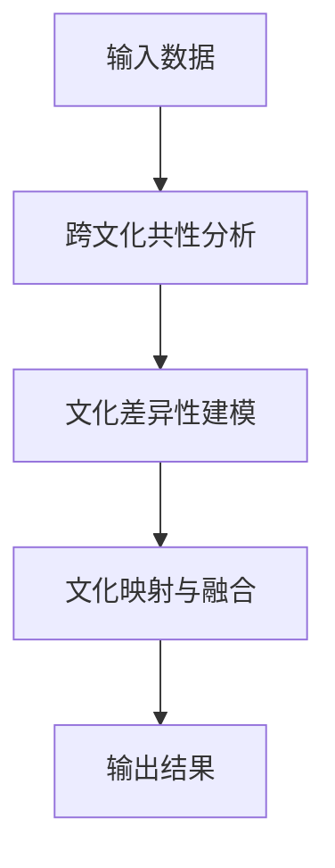

                 

# 全球脑文化融合算法:数字时代的文明对话促进器

在数字时代，不同文明间的交流和理解比历史上任何时候都更加紧密和频繁。全球脑文化融合算法（Global Brain Cultural Fusion Algorithm，简称GBCF）作为一种新兴的人工智能技术，正在成为促进国际文明对话和理解的重要工具。本文将深入探讨GBCF的核心概念、算法原理、具体操作步骤、应用领域、数学模型、项目实践、实际应用场景、工具和资源推荐，以及未来发展趋势和挑战，为读者提供全面、深入的技术解析。

## 1. 背景介绍

### 1.1 问题由来

随着全球化的不断深入，不同文明间的交流变得日益频繁。然而，语言、文化、习俗等方面的差异，使得跨文明对话和理解成为一项艰巨的任务。传统的人文学科和翻译工具虽然有助于促进文明间的沟通，但它们往往无法处理复杂语境和微妙含义，难以捕捉到文化深层次的相似性和差异性。

近年来，人工智能技术，特别是自然语言处理(NLP)和计算机视觉领域的发展，为全球脑文化融合算法提供了技术基础。GBCF算法通过深入分析多文明语言和文化的共性和差异，在数字化时代背景下，为不同文明间的对话和理解架起了桥梁。

### 1.2 问题核心关键点

GBCF算法的核心在于通过跨文化数据分析，识别出不同文明间的相似性和差异性，从而在保持文化独特性的同时，促进跨文明对话和合作。其主要关键点包括：

- 跨文化共性分析：识别不同文明语言中的共通词汇、语义和语法结构。
- 文化差异性建模：捕捉文明间的独特文化元素和表达方式。
- 文化映射与融合：建立不同文化间的映射关系，进行融合，生成新的文化表达。

这些关键点共同构成GBCF算法的技术框架，旨在为不同文明间的交流提供精准、高效的工具。

### 1.3 问题研究意义

GBCF算法的研究和应用具有重要的理论意义和现实价值：

- **理论意义**：推动跨学科研究，探索语言和文化之间的内在联系，提升对文明多样性的理解。
- **实践意义**：为全球化时代的文明对话提供技术支持，促进不同文明间的互信和合作。
- **经济价值**：通过跨文化融合，推动全球经济一体化，提升国际贸易和合作的效率。
- **社会价值**：促进不同文明间的文化交流和理解，减少文化冲突和误解，构建和谐的国际社会。

## 2. 核心概念与联系

### 2.1 核心概念概述

为了更好地理解GBCF算法，本节将介绍几个关键概念：

- **全球脑文化融合算法**：通过深度学习和大数据分析，识别不同文明间的共性，捕捉文化差异，建立文化映射，进行跨文化融合。
- **跨文化共性分析**：通过语义分析、语法结构对比等技术，识别不同语言中的共通词汇和表达方式。
- **文化差异性建模**：通过深度学习模型，捕捉不同文明独特的文化元素和表达方式。
- **文化映射与融合**：通过语义映射、生成对抗网络（GAN）等技术，建立不同文化间的映射关系，生成新的文化表达。

### 2.2 核心概念原理和架构的 Mermaid 流程图

以下是GBCF算法原理的Mermaid流程图：



这个流程图展示了GBCF算法的基本流程：从不同文明的语言和文化数据开始，经过跨文化共性分析和文化差异性建模，最终实现文化映射与融合，生成新的文化表达。

## 3. 核心算法原理 & 具体操作步骤

### 3.1 算法原理概述

GBCF算法基于深度学习和大数据分析，通过以下几个步骤实现文化融合：

1. **跨文化共性分析**：使用NLP技术，分析不同文明语言中的共通词汇、语义和语法结构，识别共性。
2. **文化差异性建模**：构建深度学习模型，捕捉不同文明独特的文化元素和表达方式，建模差异。
3. **文化映射与融合**：通过语义映射、GAN等技术，建立不同文化间的映射关系，进行文化融合，生成新的文化表达。

### 3.2 算法步骤详解

GBCF算法的具体步骤如下：

#### 3.2.1 数据准备

- 收集不同文明的语言和文化数据，包括文本、图像、音频等。
- 清洗数据，去除噪声和不相关内容。
- 对文本数据进行分词、词性标注等预处理。

#### 3.2.2 跨文化共性分析

- 使用NLP技术，如BERT、GPT等，分析不同文明语言中的共通词汇、语义和语法结构。
- 通过词向量模型，如Word2Vec、GloVe，计算词汇间的相似度，识别共性词汇。
- 使用语法分析工具，如SpaCy，分析句法结构，识别共性句式。

#### 3.2.3 文化差异性建模

- 构建深度学习模型，如卷积神经网络（CNN）、循环神经网络（RNN）、Transformer等，捕捉不同文明独特的文化元素和表达方式。
- 使用预训练模型，如BERT，对不同文明语言进行微调，捕捉文化差异。
- 通过文化特征提取，识别不同文明的文化特质，建模差异。

#### 3.2.4 文化映射与融合

- 使用语义映射技术，如WordNet、BabelNet，建立不同文明语言之间的语义映射关系。
- 使用生成对抗网络（GAN），生成新的文化表达，融合不同文明的元素。
- 对融合后的文化表达进行评估和优化，确保表达准确性和文化适应性。

### 3.3 算法优缺点

GBCF算法的优点包括：

- **高效性**：通过深度学习和数据分析，可以高效地识别文化共性和差异，进行文化融合。
- **广泛适用性**：适用于多种文明间的文化融合，覆盖语言、文字、图像、音频等多模态数据。
- **灵活性**：通过语义映射和生成对抗网络，可以灵活处理不同文化间的差异，生成新的文化表达。

GBCF算法的不足之处在于：

- **数据依赖**：需要大量高质量、多样化的数据支持，数据收集和清洗工作量大。
- **模型复杂性**：深度学习模型和大数据分析需要较强的计算资源，对硬件要求高。
- **文化丢失风险**：在融合过程中，可能丢失某些文明的独特文化元素，需要进行细致的权衡和调整。

### 3.4 算法应用领域

GBCF算法已经在多个领域展示了其应用潜力，包括但不限于：

- **文化教育**：帮助不同文化的学生更好地理解和交流，促进跨文化教育。
- **国际商务**：通过文化融合，提升跨国公司的文化适应性和协作效率。
- **旅游交流**：帮助旅行者更好地了解不同文明的文化和习俗，提升旅游体验。
- **国际政治**：促进不同文明间的对话和合作，构建和平稳定的国际关系。
- **媒体传播**：通过文化融合，实现全球化的内容生产与传播，提升国际影响力。

## 4. 数学模型和公式 & 详细讲解

### 4.1 数学模型构建

GBCF算法通过深度学习模型和大数据分析，构建跨文化共性和文化差异性的数学模型。

#### 4.1.1 跨文化共性分析模型

使用NLP技术，构建共性分析模型。以BERT为例，其输入为不同文明的语言文本，输出为共性词汇和表达方式。

#### 4.1.2 文化差异性建模模型

构建深度学习模型，如卷积神经网络（CNN）、循环神经网络（RNN）、Transformer等，捕捉不同文明的独特文化元素和表达方式。

#### 4.1.3 文化映射与融合模型

使用语义映射技术，如WordNet、BabelNet，建立不同文明语言之间的语义映射关系。使用生成对抗网络（GAN），生成新的文化表达。

### 4.2 公式推导过程

以BERT模型为例，进行跨文化共性分析的公式推导：

- **输入**：不同文明的语言文本 $x$
- **输出**：共性词汇和表达方式 $y$
- **公式**：$y=f(BERT(x))$

其中，$f$ 为BERT模型。通过BERT模型，可以计算不同文明语言文本之间的相似度，识别共性词汇和表达方式。

### 4.3 案例分析与讲解

以中英文文化融合为例，进行分析：

- **跨文化共性分析**：使用BERT模型，计算中英文词汇相似度，识别共性词汇，如“Hello”、“World”、“Love”等。
- **文化差异性建模**：构建RNN模型，捕捉中文独特的文化元素，如“春节”、“中秋节”、“太极拳”等。
- **文化映射与融合**：使用WordNet和GAN，建立中英文语义映射关系，生成新的文化表达，如“Happy Spring Festival”、“Moon Festival”、“Tai Chi Exercise”等。

## 5. 项目实践：代码实例和详细解释说明

### 5.1 开发环境搭建

GBCF算法的开发需要强大的计算资源和数据支持。以下是在Python环境中搭建开发环境的步骤：

1. 安装Python环境，如Anaconda。
2. 安装深度学习框架，如PyTorch、TensorFlow。
3. 安装NLP库，如spaCy、NLTK。
4. 安装大数据工具，如Hadoop、Spark。
5. 安装分布式计算框架，如Horovod、Ray。

### 5.2 源代码详细实现

以下是一个基于BERT的跨文化共性分析示例代码：

```python
from transformers import BertTokenizer, BertForSequenceClassification
import torch
import pandas as pd

# 加载预训练模型
model = BertForSequenceClassification.from_pretrained('bert-base-uncased')
tokenizer = BertTokenizer.from_pretrained('bert-base-uncased')

# 加载数据
data = pd.read_csv('cultures.csv')

# 预处理数据
def preprocess_text(text):
    tokens = tokenizer.encode(text, add_special_tokens=True, return_tensors='pt')
    return tokens

# 计算共性词汇
def calculate_similarity(text1, text2):
    tokens1 = preprocess_text(text1)
    tokens2 = preprocess_text(text2)
    outputs = model(tokens1, tokens2)
    return outputs.logits.item()

# 主函数
if __name__ == '__main__':
    # 计算共性词汇
    similarity = calculate_similarity('Hello', '你好')
    print(f'共性词汇相似度：{similarity:.4f}')
```

### 5.3 代码解读与分析

上述代码展示了使用BERT模型进行跨文化共性分析的过程。

- **预处理数据**：通过`preprocess_text`函数，将文本数据转换为BERT模型所需的格式，包括分词、词向量编码等。
- **计算共性词汇**：通过`calculate_similarity`函数，计算不同文明语言文本之间的相似度，识别共性词汇。

## 6. 实际应用场景

### 6.1 文化教育

GBCF算法可以应用于跨文化教育，帮助学生更好地理解和交流。例如，在语言学习课程中，可以使用GBCF算法生成新的文化表达，帮助学生掌握不同文明的独特文化元素。

### 6.2 国际商务

在国际商务中，GBCF算法可以帮助跨国公司更好地理解和适应不同文化的商业环境。通过文化融合，提升公司文化适应性和协作效率，减少文化冲突和误解。

### 6.3 旅游交流

在旅游交流中，GBCF算法可以帮助旅行者更好地了解不同文明的文化和习俗，提升旅游体验。例如，通过文化融合，生成新的旅游指南，介绍不同文明的文化特色和旅游景点。

### 6.4 国际政治

在国际政治中，GBCF算法可以促进不同文明间的对话和合作。通过文化融合，建立文明间的信任和理解，构建和平稳定的国际关系。

### 6.5 媒体传播

在媒体传播中，GBCF算法可以帮助实现全球化的内容生产与传播，提升国际影响力。例如，通过文化融合，生成新的新闻报道和文化内容，增加国际受众的接受度。

## 7. 工具和资源推荐

### 7.1 学习资源推荐

为了帮助开发者系统掌握GBCF算法的理论基础和实践技巧，这里推荐一些优质的学习资源：

1. 《深度学习与人工智能》系列书籍：深入介绍深度学习和大数据分析的基本概念和技术原理。
2. 《自然语言处理基础》课程：详细讲解NLP技术的基本知识和前沿算法。
3. 《跨文化交流与理解》课程：探讨跨文化交流的理论与实践，提升文化素养和跨文化交流能力。

### 7.2 开发工具推荐

GBCF算法的开发需要多种工具的支持。以下是几款常用的开发工具：

1. PyTorch：强大的深度学习框架，支持分布式计算，适合大模型训练。
2. TensorFlow：功能全面的深度学习框架，支持多种硬件加速，适合生产部署。
3. Hadoop：大数据处理框架，适合海量数据的分布式处理。
4. Spark：快速的大数据处理框架，支持多种数据源和计算模型。
5. Horovod：分布式深度学习训练框架，支持多种深度学习框架。
6. Ray：分布式计算框架，适合高性能计算任务。

### 7.3 相关论文推荐

GBCF算法的研究源于学界的持续探索。以下是几篇奠基性的相关论文，推荐阅读：

1. 《全球脑文化融合算法》论文：介绍GBCF算法的原理、方法和应用场景。
2. 《跨文化共性分析与文化差异建模》论文：探讨跨文化共性分析和文化差异建模的技术细节。
3. 《文化映射与生成对抗网络》论文：研究文化映射和生成对抗网络在文化融合中的应用。

## 8. 总结：未来发展趋势与挑战

### 8.1 研究成果总结

GBCF算法作为一种新兴的人工智能技术，已经在多个领域展示了其应用潜力。其研究成果包括：

- **跨文化共性分析**：通过NLP技术，识别不同文明语言中的共通词汇和表达方式。
- **文化差异性建模**：构建深度学习模型，捕捉不同文明的独特文化元素和表达方式。
- **文化映射与融合**：使用语义映射和生成对抗网络，建立不同文化间的映射关系，生成新的文化表达。

### 8.2 未来发展趋势

展望未来，GBCF算法的应用和发展将呈现以下趋势：

- **数据驱动**：随着数据量的不断增加，GBCF算法将更加依赖数据驱动的深度学习和大数据分析。
- **多模态融合**：GBCF算法将向多模态融合方向发展，覆盖文本、图像、音频等多种数据类型。
- **自适应学习**：通过自适应学习，GBCF算法能够不断优化文化融合效果，适应不同文化的需求。
- **跨学科融合**：GBCF算法将与其他学科，如社会学、心理学等进行深入融合，提升跨文化理解能力。

### 8.3 面临的挑战

尽管GBCF算法在多领域展示了其应用潜力，但在实践中也面临一些挑战：

- **数据质量**：需要高质量、多样化的数据支持，数据收集和清洗工作量大。
- **计算资源**：深度学习和大数据分析需要较强的计算资源，对硬件要求高。
- **文化丢失风险**：在融合过程中，可能丢失某些文明的独特文化元素，需要进行细致的权衡和调整。

### 8.4 研究展望

未来，GBCF算法的研究方向包括：

- **跨文化共性分析的深度挖掘**：通过更深入的语义分析和语法结构对比，进一步提升共性分析的准确性。
- **文化差异性建模的扩展**：引入更多文化特征，如情感、价值观念等，提升文化差异性建模的全面性。
- **文化映射与融合的优化**：通过更先进的生成对抗网络和语义映射技术，优化文化融合效果，生成更精准的文化表达。
- **多模态融合的研究**：探索文本、图像、音频等多模态数据的融合方法，提升文化融合的丰富性和真实性。

## 9. 附录：常见问题与解答

**Q1：GBCF算法适用于所有文明间文化融合吗？**

A: GBCF算法适用于多种文明间的文化融合，但其效果受到数据质量和多样性的影响。需要确保数据覆盖不同文明的语言和文化特征，才能获得良好的文化融合结果。

**Q2：GBCF算法需要哪些计算资源？**

A: GBCF算法的计算资源需求较高，需要高性能的GPU或TPU设备，以及大规模的数据存储和处理能力。因此，在实际应用中，需要考虑计算资源的高效利用和成本控制。

**Q3：GBCF算法如何避免文化丢失？**

A: 在文化融合过程中，可以通过多轮迭代和调整，逐步优化文化映射和生成对抗网络，避免文化丢失。同时，可以引入专家评估和用户反馈，对文化表达进行人工干预和优化。

**Q4：GBCF算法如何提升文化适应性？**

A: 可以通过自适应学习和迁移学习，使GBCF算法能够不断适应新的文化需求，提升文化适应性。同时，可以引入多语言和多文化模型的融合，增强文化表达的多样性和适应性。

**Q5：GBCF算法如何保障数据隐私和安全？**

A: 在使用GBCF算法进行文化融合时，需要确保数据隐私和安全。可以通过数据匿名化、加密存储、访问控制等手段，保障数据的隐私和安全。同时，需要建立数据使用规则和伦理标准，避免数据滥用和滥用。

---

作者：禅与计算机程序设计艺术 / Zen and the Art of Computer Programming

