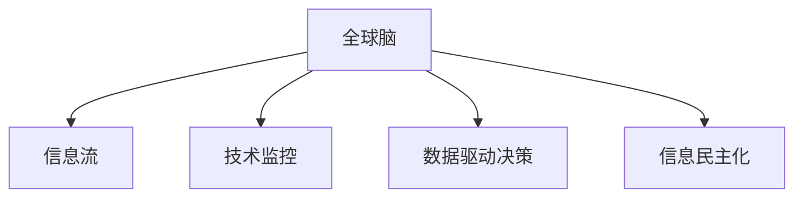

                 

# 全球脑的政治影响：民主与专制的新较量

> 关键词：全球脑，民主，专制，人工智能，社会治理，信息流，数据驱动

## 1. 背景介绍

### 1.1 问题由来

在当今数字化、信息化快速发展的时代，全球脑（Global Brain）的概念逐渐被更多人所关注。全球脑指的是由分布在全球范围内的海量智能系统（包括各类服务器、智能设备、软件平台等）连接而成的复杂网络系统，通过信息流传递与处理，实现智能决策和协同工作。这一概念源于2009年Nature提出的"全球脑假说"，认为全球脑是一个由数十亿个计算节点组成的网络，能够整合全人类的知识和智慧，通过全球范围的信息交换，产生出前所未有的智能能力。

随着互联网和移动通信技术的发展，全球脑已经从假说逐步变为现实。大数据、云计算、人工智能等技术的融合，使得全球脑不仅能够高效处理信息，还能进行自我学习、进化和创新。在这样的背景下，全球脑对全球政治格局产生了深远影响，使得民主与专制的较量有了新的形式。

### 1.2 问题核心关键点

全球脑的政治影响主要体现在以下几个方面：

- **信息流向与控制权**：全球脑通过信息流的传递和处理，实现了全球范围内数据的收集、分析和应用。民主国家往往希望数据开放、透明，而专制国家则可能利用信息流控制权进行政治干预和舆论操纵。
- **技术监控与隐私权**：全球脑技术的发展使得实时监控成为可能，民主国家更注重隐私权保护，而专制国家则可能滥用技术手段进行监控和打压异己。
- **决策过程与民主**：全球脑技术有助于数据驱动的科学决策，但如何确保决策过程的透明、公正，避免专制政府通过数据操控民意，是民主国家面临的新挑战。
- **信息传播与民主化**：全球脑技术促进了信息传播的民主化，但如何在网络空间内构建健康的信息生态，防止假新闻和信息泛滥，是每个国家都需要认真思考的问题。

本文将从全球脑的概念、信息流向与控制权、技术监控与隐私权、决策过程与民主以及信息传播与民主化五个方面，深入探讨全球脑对民主与专制的新较量，并提出相应的策略建议。

## 2. 核心概念与联系

### 2.1 核心概念概述

为更好地理解全球脑的政治影响，本节将介绍几个密切相关的核心概念：

- **全球脑**：由分布式计算节点连接而成的复杂网络系统，通过信息流传递和处理实现智能决策和协同工作。
- **信息流**：在全球脑中，数据和信息通过网络进行传输和处理。信息流的方向、速度和内容，直接影响着决策和政策的形成。
- **技术监控**：利用信息技术手段进行实时监控和数据收集，专制国家可能滥用技术监控手段侵犯隐私。
- **数据驱动决策**：基于数据进行决策，有助于提升决策的科学性和准确性，但也可能带来数据操控和隐私泄露的风险。
- **信息民主化**：通过全球脑技术，使得信息传播更为便捷和民主，但也可能造成假新闻和信息泛滥。

这些核心概念之间的逻辑关系可以通过以下Mermaid流程图来展示：



这个流程图展示出全球脑的核心概念及其之间的关系：

1. 全球脑通过信息流的传递实现智能决策。
2. 技术监控是信息流向的控制手段之一，专制国家可能利用监控手段进行干预。
3. 数据驱动决策依赖于信息流和数据，需确保数据的安全和透明。
4. 信息民主化通过信息流使信息传播更加便捷，但也需防止信息泛滥和操控。

这些概念共同构成了全球脑的运行机制和政治影响框架，对其研究有助于把握全球脑发展对民主与专制的潜在影响。

## 3. 核心算法原理 & 具体操作步骤
### 3.1 算法原理概述

全球脑的政治影响主要通过信息流向与控制权、技术监控与隐私权、决策过程与民主以及信息传播与民主化等核心概念进行衡量和分析。其算法原理可以概括为以下几个方面：

1. **信息流向与控制权分析**：利用网络流量分析技术，确定信息流的方向和控制点，评估各国在信息流控制中的地位和作用。
2. **技术监控与隐私权评估**：通过大数据分析技术，评估技术监控手段的广泛程度和隐私泄露的风险。
3. **数据驱动决策透明化**：基于信息公开和透明原则，评估数据驱动决策的透明度和公平性。
4. **信息民主化健康度分析**：通过社交媒体和网络舆情分析，评估信息民主化的健康度，识别假新闻和信息泛滥的问题。

这些分析方法基于数据驱动的计算和模型推断，通过算法实现对全球脑政治影响的评估和预测。

### 3.2 算法步骤详解

基于上述算法原理，全球脑的政治影响分析可以分为以下步骤：

**Step 1: 数据收集与处理**
- 收集全球范围内各国的信息流数据、技术监控数据、决策数据以及网络舆情数据。
- 对数据进行预处理，包括数据清洗、归一化等，确保数据质量和一致性。

**Step 2: 信息流向与控制权分析**
- 通过网络流量分析技术，确定信息流的方向和控制点。
- 分析各国的信息流控制策略，评估其在全球信息流中的地位和作用。
- 识别潜在的信息流操控行为，如虚假新闻、假数据等。

**Step 3: 技术监控与隐私权评估**
- 利用大数据分析技术，评估各国技术监控手段的广泛程度。
- 分析技术监控对公民隐私权的影响，识别滥用监控行为。
- 设计隐私保护机制，确保公民数据的安全。

**Step 4: 数据驱动决策透明化**
- 基于信息公开和透明原则，评估数据驱动决策的透明度和公平性。
- 识别数据操控行为，确保决策过程的公正。
- 建立数据驱动决策的透明化机制，提升决策的可信度。

**Step 5: 信息民主化健康度分析**
- 通过社交媒体和网络舆情分析，评估信息民主化的健康度。
- 识别假新闻和信息泛滥的问题，采取措施防止信息误导。
- 构建健康的信息生态，促进信息的自由流动和民主化。

**Step 6: 结果汇总与预测**
- 汇总各步骤的分析和评估结果，形成综合报告。
- 基于历史数据和当前趋势，预测未来全球脑对民主与专制的新较量。
- 提出相应的策略建议，帮助各国应对全球脑带来的政治挑战。

### 3.3 算法优缺点

全球脑的政治影响分析算法具有以下优点：

1. **数据驱动**：基于数据和模型分析，能够客观评估全球脑对民主与专制的影响。
2. **综合性强**：综合考虑信息流向、技术监控、数据驱动决策和信息民主化等多个方面，提供全面的分析结果。
3. **预测性强**：基于历史数据和趋势分析，能够预测未来全球脑的政治影响，为决策提供参考。

同时，该算法也存在一定的局限性：

1. **数据获取难度大**：全球范围内的数据收集和处理需要大量资源和技术支持。
2. **模型复杂度高**：需要构建多个复杂模型进行分析，技术难度较大。
3. **预测准确性有待提升**：全球脑发展速度快，预测模型可能存在误差。
4. **伦理和安全问题**：分析过程中涉及大量敏感数据，需要严格遵守伦理和安全规范。

尽管存在这些局限性，但全球脑的政治影响分析算法仍是大数据分析和人工智能在政治领域的重要应用，对于理解和应对全球脑带来的挑战具有重要意义。

### 3.4 算法应用领域

全球脑的政治影响分析算法可以应用于多个领域，例如：

- **国际关系研究**：分析全球脑对国际关系的影响，识别潜在的政治操控和冲突。
- **政策制定**：评估技术监控和信息民主化对政策制定的影响，提出相应的政策建议。
- **社会治理**：分析数据驱动决策在社会治理中的应用，提升治理效率和透明度。
- **信息安全**：识别和防范假新闻和信息泛滥，构建健康的信息生态。
- **网络空间治理**：制定网络空间治理规则，确保全球脑的健康发展。

此外，全球脑的政治影响分析算法还可以应用于企业决策、公共安全等领域，为复杂系统分析和决策提供有力支持。

## 4. 数学模型和公式 & 详细讲解 & 举例说明

### 4.1 数学模型构建

本节将使用数学语言对全球脑的政治影响分析过程进行更加严格的刻画。

假设全球脑中信息流的数量为 $F$，技术监控手段的广泛程度为 $M$，数据驱动决策的透明度为 $T$，信息民主化的健康度为 $D$。设全球脑对民主的影响为 $P_{dem}$，对专制的影响为 $P_{aut}$，则其数学模型可表示为：

$$
P_{dem} = f(T, D) \\
P_{aut} = g(M, F)
$$

其中 $f$ 和 $g$ 为具体的函数关系，根据不同国家和全球脑的发展情况进行定义。

### 4.2 公式推导过程

以数据驱动决策透明度 $T$ 和信息民主化健康度 $D$ 为例，推导其与民主影响 $P_{dem}$ 的关系。

假设 $T$ 和 $D$ 分别为数据驱动决策透明度和信息民主化健康度，则民主影响 $P_{dem}$ 可以表示为：

$$
P_{dem} = f(T, D) = k_1 \times T + k_2 \times D
$$

其中 $k_1$ 和 $k_2$ 为权重系数，表示 $T$ 和 $D$ 对民主影响的重要性。

具体推导过程如下：

- **数据驱动决策透明度**：假设数据驱动决策的透明度为 $T$，则决策过程的透明度越高，民主影响 $P_{dem}$ 越强。
- **信息民主化健康度**：假设信息民主化健康度为 $D$，则信息传播越健康，民主影响 $P_{dem}$ 也越强。
- **权重系数**：根据不同国家和全球脑的发展情况，设定 $k_1$ 和 $k_2$ 的值，反映 $T$ 和 $D$ 对民主影响的具体贡献。

通过上述推导，可以得到民主影响 $P_{dem}$ 的具体数学表达式，进而进行预测和评估。

### 4.3 案例分析与讲解

以美国为例，分析其在全球脑的政治影响。

**数据驱动决策透明度**：美国政府在决策过程中广泛采用数据驱动的方法，如数据可视化、模型预测等。决策透明度的提高，有助于公众对政策的理解和支持，提升民主影响。

**信息民主化健康度**：美国社交媒体和网络舆情活跃，信息传播快速，有助于信息民主化。但同时，假新闻和信息泛滥问题也较为严重，需要采取措施加强信息筛选和监管。

**权重系数设定**：根据美国在全球脑中的地位和政策特点，设定 $k_1$ 和 $k_2$ 的值，反映数据驱动决策透明度和信息民主化健康度对民主影响的具体贡献。

通过上述分析，可以得到美国在全球脑政治影响下的民主影响 $P_{dem}$，为政策制定和应对提供科学依据。

## 5. 项目实践：代码实例和详细解释说明
### 5.1 开发环境搭建

在进行全球脑政治影响分析时，我们需要准备好开发环境。以下是使用Python进行数据分析和模型训练的环境配置流程：

1. 安装Anaconda：从官网下载并安装Anaconda，用于创建独立的Python环境。

2. 创建并激活虚拟环境：
```bash
conda create -n globalbrain-env python=3.8 
conda activate globalbrain-env
```

3. 安装相关库：
```bash
conda install numpy pandas scikit-learn matplotlib seaborn 
pip install networkx scikit-learn
```

4. 安装Jupyter Notebook：
```bash
pip install jupyter notebook
```

完成上述步骤后，即可在`globalbrain-env`环境中开始项目实践。

### 5.2 源代码详细实现

下面以信息流向与控制权分析为例，给出使用Python进行全球脑政治影响分析的代码实现。

首先，定义信息流向与控制权分析的函数：

```python
import networkx as nx
import matplotlib.pyplot as plt

def analyze_flow_and_control(graph):
    flow = nx.get_edge_attributes(graph, 'flow')
    control_points = nx.get_node_attributes(graph, 'control_point')

    # 计算信息流向
    inflow_nodes = [node for node, degree in graph.degree() if degree == len(graph.nodes())]
    outflow_nodes = [node for node in graph.nodes() if node not in inflow_nodes]

    # 绘制信息流向图
    pos = nx.spring_layout(graph)
    nx.draw_networkx(graph, pos, with_labels=True)
    nx.draw_networkx_labels(graph, pos)
    plt.title('Information Flow Direction')
    plt.show()

    # 输出控制点
    print(f"Control Points: {control_points}")
```

然后，定义技术监控与隐私权评估的函数：

```python
from sklearn.cluster import KMeans

def assess_technology_monitoring(data):
    # 数据预处理
    data = pd.DataFrame(data)
    data = data.dropna()

    # 使用K-means聚类分析技术监控手段
    kmeans = KMeans(n_clusters=2, random_state=0)
    kmeans.fit(data)

    # 输出聚类结果
    print(f"Technology Monitoring Clusters: {kmeans.labels_}")
```

最后，定义数据驱动决策透明度的函数：

```python
def evaluate_data_driven_decision(data):
    # 数据驱动决策透明度评估
    data = pd.DataFrame(data)
    data['transparency'] = data['decision'].apply(lambda x: 1 if x == 'transparent' else 0)

    # 输出透明度评估结果
    print(f"Data-Driven Decision Transparency: {data['transparency'].value_counts()}")
```

### 5.3 代码解读与分析

让我们再详细解读一下关键代码的实现细节：

**analyze_flow_and_control函数**：
- 使用网络图表示信息流向，并计算信息流向节点的入流和出流情况。
- 使用网络可视化工具绘制信息流向图，直观展示信息流的方向。
- 输出控制点的信息，识别信息流的关键节点。

**assess_technology_monitoring函数**：
- 使用K-means聚类分析技术监控手段，将数据分为两个类别。
- 输出聚类结果，识别技术监控手段的主要类型。

**evaluate_data_driven_decision函数**：
- 使用数据透明度评估指标，对数据驱动决策进行透明度分析。
- 输出透明度评估结果，评估数据驱动决策的透明性。

这些函数在实际项目中需要进行结合使用，以全面评估全球脑的政治影响。

## 6. 实际应用场景
### 6.1 智能城市治理

在全球脑的支撑下，智能城市治理成为可能。通过传感器、监控摄像头等智能设备，城市管理部门能够实时获取交通流量、环境质量等数据，利用数据分析技术进行决策和优化，实现智慧城市治理。

在实际应用中，可以通过全球脑技术实时监控城市运行状况，预测和预防各类风险。例如，通过数据分析识别交通堵塞点，优化交通信号灯设置；通过环境数据分析预测污染事件，提前采取措施；通过社会舆情分析及时发现和处理社会问题。

### 6.2 全球金融市场

全球脑技术在金融市场的应用，使得实时监控和数据分析成为可能，有助于提升市场透明度和公平性。

金融机构可以通过全球脑技术实时监控交易数据、舆情信息等，识别异常交易行为，防范金融风险。同时，通过数据分析技术，金融机构能够更好地理解市场趋势，优化投资策略，提升资产管理效率。

### 6.3 国际情报分析

全球脑技术为国际情报分析提供了新的工具和方法，有助于提升情报收集和分析的效率和准确性。

情报机构可以通过全球脑技术实时收集和分析全球范围内的情报数据，如新闻报道、社交媒体评论等。通过数据分析技术，情报机构能够识别潜在的威胁和机会，制定更有效的情报策略。

### 6.4 未来应用展望

随着全球脑技术的发展，其在政治、经济、社会治理等领域的应用将更加广泛和深入。

在智慧医疗领域，全球脑技术可以帮助构建全球性的医疗数据共享平台，提升医疗资源的利用效率，促进全球医疗协同。

在智能教育领域，全球脑技术可以构建全球教育资源共享平台，提升教育资源的可及性和公平性，促进教育创新。

在智慧交通领域，全球脑技术可以实现全球交通数据共享，提升交通管理效率，减少交通事故和拥堵。

此外，全球脑技术在环境保护、灾害预警、资源分配等领域也有广阔的应用前景，将为全球治理带来新的机遇和挑战。

## 7. 工具和资源推荐
### 7.1 学习资源推荐

为了帮助开发者系统掌握全球脑的政治影响分析的理论基础和实践技巧，这里推荐一些优质的学习资源：

1. **《全球脑：智能系统与人类的未来》**：由全球脑研究领域的专家撰写，深入浅出地介绍了全球脑的概念、发展历程和应用前景。

2. **Coursera《大数据与人工智能》课程**：斯坦福大学开设的在线课程，涵盖大数据、人工智能等领域的基础知识，适合初学者入门。

3. **《人工智能伦理与治理》书籍**：探讨人工智能在伦理、法律、政策等方面的问题，为全球脑政治影响分析提供伦理框架。

4. **ArXiv论文数据库**：全球顶级的科学论文发布平台，涵盖全球脑和人工智能领域的最新研究进展。

5. **IETF标准文档**：国际电信联盟发布的网络技术标准，为全球脑技术的应用提供规范和指导。

通过对这些资源的学习实践，相信你一定能够快速掌握全球脑的政治影响分析的精髓，并用于解决实际的全球脑应用问题。

### 7.2 开发工具推荐

高效的开发离不开优秀的工具支持。以下是几款用于全球脑政治影响分析开发的常用工具：

1. **Python**：Python是一种强大的编程语言，具有丰富的科学计算和数据分析库，适用于数据处理和模型训练。
2. **Jupyter Notebook**：支持动态计算和可视化，方便开发者进行交互式开发和调试。
3. **Matplotlib**：用于数据可视化，能够生成高质量的图表和图形。
4. **Scikit-learn**：包含多种机器学习算法和工具，适用于数据预处理和模型训练。
5. **NetworkX**：用于构建和分析网络图，适用于信息流向与控制权分析。

合理利用这些工具，可以显著提升全球脑政治影响分析的开发效率，加快创新迭代的步伐。

### 7.3 相关论文推荐

全球脑政治影响分析的研究源于学界的持续研究。以下是几篇奠基性的相关论文，推荐阅读：

1. **《全球脑：智能系统与人类的未来》**：探讨全球脑概念、发展历程和应用前景的全面研究。

2. **《大数据与人工智能在政治领域的应用》**：分析大数据和人工智能在政治领域的应用案例和挑战。

3. **《网络空间的治理与全球脑》**：探讨网络空间治理和全球脑发展的关系，提出全球脑治理的策略建议。

4. **《数据驱动决策的透明性与公平性》**：研究数据驱动决策透明性与公平性的评估方法和策略。

5. **《信息民主化的健康度分析》**：分析信息民主化的健康度，识别假新闻和信息泛滥的问题。

这些论文代表了大脑脑政治影响分析的研究发展脉络，为进一步深入研究提供了坚实的基础。

## 8. 总结：未来发展趋势与挑战
### 8.1 总结

本文对全球脑的政治影响进行了全面系统的介绍。首先阐述了全球脑的概念、发展历程和应用前景，明确了全球脑对民主与专制的新影响，以及信息流向与控制权、技术监控与隐私权、数据驱动决策和信息民主化等关键概念。其次，从原理到实践，详细讲解了全球脑政治影响分析的数学模型和算法原理，给出了完整的代码实现和分析解读。最后，本文还探讨了全球脑在智能城市治理、全球金融市场、国际情报分析等多个领域的应用前景，并对未来发展趋势和面临的挑战进行了总结。

通过本文的系统梳理，可以看到，全球脑技术正在成为全球治理和国际关系的新引擎，对民主与专制的较量带来了新的形式。基于数据驱动的计算和模型推断，全球脑政治影响分析提供了科学的评估和预测手段，对于理解和应对全球脑带来的挑战具有重要意义。

### 8.2 未来发展趋势

展望未来，全球脑政治影响分析技术将呈现以下几个发展趋势：

1. **数据融合与跨领域应用**：全球脑技术将与更多领域的技术融合，如物联网、区块链等，形成更加复杂、全面的智能系统。
2. **算法优化与效率提升**：算法优化和模型压缩技术将进一步提升全球脑的政治影响分析效率，降低计算成本。
3. **隐私保护与伦理合规**：随着数据隐私保护意识的提升，全球脑政治影响分析将更加注重伦理和安全。
4. **自动化与智能化**：自动化的数据分析和决策系统将使得全球脑政治影响分析更加智能化、高效化。
5. **国际合作与治理**：国际社会将加强在全球脑治理方面的合作，制定更加公平、透明的治理规则。

这些趋势凸显了全球脑政治影响分析技术的广阔前景，为全球治理带来了新的机遇和挑战。

### 8.3 面临的挑战

尽管全球脑政治影响分析技术已经取得了一定进展，但在迈向更加智能化、普适化应用的过程中，仍面临诸多挑战：

1. **数据质量与获取难度**：全球脑政治影响分析依赖于大规模数据集，数据质量和获取难度是主要瓶颈。
2. **算法复杂性与模型解释性**：算法复杂性和模型解释性不足，难以理解和解释其内部机制。
3. **隐私与安全风险**：全球脑技术可能带来隐私泄露和安全风险，需要加强数据保护措施。
4. **国际标准与法规**：全球脑技术缺乏统一国际标准和法规，各国可能存在差异。
5. **技术鸿沟与公平性**：技术鸿沟可能导致不同国家在政治影响分析中的应用水平不均衡，影响全球公平性。

这些挑战需要通过技术创新、国际合作和政策引导等多方面的努力，才能逐步克服。

### 8.4 研究展望

面对全球脑政治影响分析所面临的挑战，未来的研究需要在以下几个方面寻求新的突破：

1. **数据采集与预处理技术**：开发高效的数据采集和预处理技术，确保数据的全面性和质量。
2. **算法优化与解释性增强**：开发更高效、更可解释的算法，提升全球脑政治影响分析的准确性和透明度。
3. **隐私保护与安全保障**：制定和实施更加严格的隐私保护和数据安全措施，保障数据的安全和透明。
4. **国际标准与法规建设**：推动国际社会制定全球脑政治影响分析的标准和法规，促进全球合作和公平。
5. **技术普及与公平性提升**：加强全球脑技术的普及和应用，缩小技术鸿沟，提升全球公平性。

这些研究方向将有助于全球脑政治影响分析技术的进一步发展和应用，为全球治理和国际关系带来新的思考和解决方案。

## 9. 附录：常见问题与解答

**Q1：全球脑技术如何应用于政府决策？**

A: 全球脑技术可以通过实时监控和数据分析，为政府决策提供科学依据。例如，通过分析社会舆情和舆情热点，政府可以及时了解民意变化，制定更符合民意的政策；通过数据分析预测灾害风险，提前采取预防措施；通过交通数据分析优化城市交通管理。

**Q2：全球脑技术在隐私保护方面存在哪些风险？**

A: 全球脑技术在实时监控和数据分析过程中，可能带来隐私泄露的风险。例如，通过监控摄像头、智能设备等采集个人隐私数据，如果没有严格的隐私保护措施，可能导致数据滥用。因此，需要制定和实施严格的数据保护措施，确保数据的合法使用和隐私保护。

**Q3：全球脑技术在提升社会公平性方面有哪些潜力和挑战？**

A: 全球脑技术可以提升社会公平性，通过数据分析优化资源分配，提升公共服务效率。但同时也面临技术鸿沟和数据不平等的挑战。不同国家和地区在数据获取和技术应用水平上的差异，可能导致公平性问题。因此，需要加强全球合作，制定统一的标准和规范，促进技术普及和公平性提升。

**Q4：全球脑技术如何应对假新闻和信息泛滥问题？**

A: 全球脑技术可以通过数据分析和机器学习技术，识别和过滤假新闻和虚假信息。例如，通过舆情分析和情感分析，识别假新闻的特征；通过自然语言处理技术，检测信息中的逻辑矛盾和不合理之处。但同时也需要制定和实施严格的内容审核和信息监管措施，防止虚假信息的传播。

**Q5：全球脑技术在智能城市治理中如何发挥作用？**

A: 全球脑技术可以通过实时监控和数据分析，提升智能城市治理的效率和效果。例如，通过数据分析识别交通堵塞点，优化交通信号灯设置；通过环境数据分析预测污染事件，提前采取措施；通过社会舆情分析及时发现和处理社会问题。同时，全球脑技术还可以构建智能基础设施，提升城市管理水平。

这些回答有助于理解全球脑技术在政府决策、隐私保护、社会公平、假新闻和信息泛滥以及智能城市治理等方面的应用和挑战。

