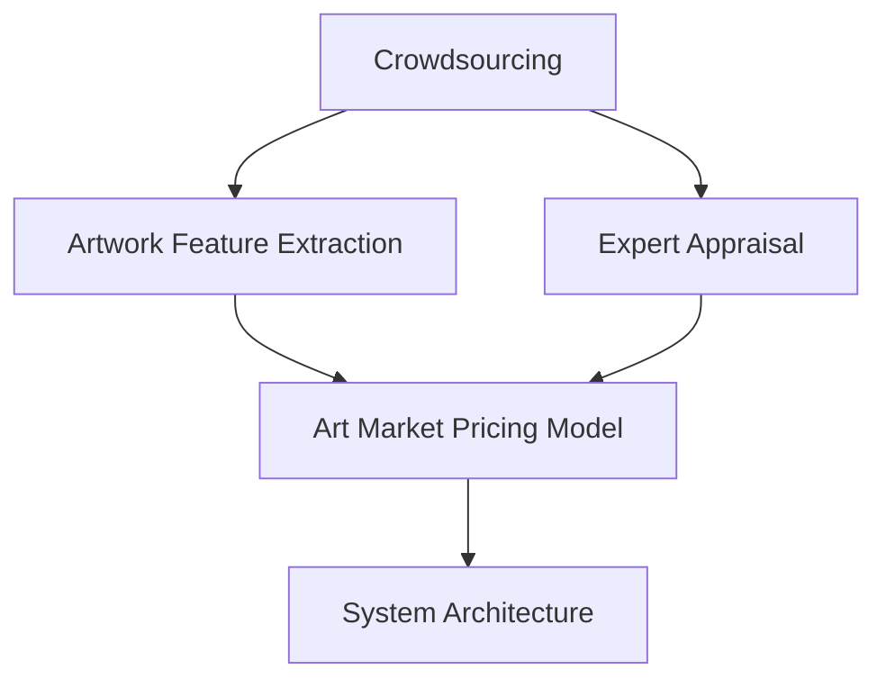
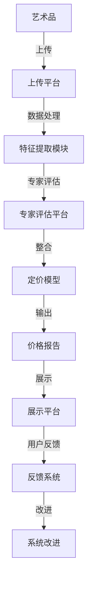

                 

# 全球脑艺术品估值系统:众包专业知识的艺术市场定价机制

## 1. 背景介绍

### 1.1 问题由来

在全球化与数字化的双重驱动下，艺术品市场日益国际化、多元化。作为资产价格评估体系中不可或缺的一环，艺术品的定价机制亦需随之革新。面对如此庞杂且依赖大量主观判断的市场，传统的价格评估方法往往滞后且易受人为因素干扰。随着互联网技术及大数据分析的普及，亟需引入先进技术手段，来更公平、精准地评估艺术品价值。

### 1.2 问题核心关键点

本文聚焦于构建一个基于众包专业知识的艺术市场定价系统，核心思想在于将专家评估与市场供需动态相结合，通过量化手段降低主观因素干扰，构建更为科学客观的价格评估模型。具体核心关键点包括：

- **众包专业知识的获取与处理**：如何高效且成本低廉地汇集艺术家、收藏家、策展人等专业领域意见，并系统化地进行数据清洗与预处理。
- **艺术品的维度建模与特征提取**：如何从艺术品本身的材质、风格、创作者等多个维度进行量化描述，并提取具有区分性的关键特征。
- **基于众包数据与专家评估的定价模型**：如何将专家评估数据与市场交易数据、供需关系等进行综合分析，构建精准的定价模型。
- **系统架构设计与性能优化**：如何设计系统架构以支撑庞大的数据处理与用户交互，并进行高效的性能优化，确保系统实时响应与可靠稳定。

### 1.3 问题研究意义

构建基于众包专业知识的艺术市场定价系统，对艺术市场的健康发展具有重要意义：

- **提高定价公平性**：通过系统化、数据驱动的方法，减少人为因素干扰，提供更为科学客观的定价依据。
- **降低定价成本**：相较于传统高昂的专家评估费用，众包方式能够降低评估成本，提高定价效率。
- **提升定价精准度**：结合专家评估与市场数据，通过算法模型提升定价的准确性与合理性。
- **推动市场透明度**：通过公开定价算法与数据，增强市场透明度，提升各方信任度。
- **促进市场繁荣**：通过更精准的定价，激发收藏热情，促进艺术品的流通与交易。

## 2. 核心概念与联系

### 2.1 核心概念概述

为了深入理解众包艺术市场定价系统，本节将详细介绍相关核心概念及其内在联系：

- **众包(People Outsourcing)**：利用互联网平台，将特定任务分配给大众参与完成，以此汇聚专业知识与创造力。
- **艺术品的特征提取**：从艺术品材质、尺寸、创作背景、风格等多维度进行特征提取，形成标准化的描述。
- **专家评估**：由艺术家、收藏家、策展人等专业领域专家对艺术品进行价值评估，提供主观的参考依据。
- **基于众包与专家评估的定价模型**：将专家评估与市场数据相结合，构建综合评估模型，为艺术品定价提供科学依据。
- **系统架构**：设计一个分布式、可扩展的系统架构，以支撑大数据处理与高并发用户需求。

这些概念之间的逻辑关系可以通过以下Mermaid流程图来展示：



### 2.2 核心概念原理和架构的 Mermaid 流程图

本图展示了众包艺术市场定价系统的核心流程，以确保读者能够直观理解系统构成与数据流转。



上述图表展示了艺术品定价系统的数据流与业务逻辑：

1. **艺术品上传与数据处理**：艺术品通过上传平台上传，进入系统数据处理模块，进行特征提取与清洗。
2. **专家评估与整合**：艺术品特征与专家评估数据一同输入定价模型，形成初步定价。
3. **定价模型与价格报告**：模型综合评估后输出价格，生成报告展示给用户。
4. **用户反馈与改进**：用户反馈信息返回，系统进行改进以提升定价精度与用户满意度。

## 3. 核心算法原理 & 具体操作步骤

### 3.1 算法原理概述

基于众包专业知识的艺术市场定价系统，通过以下主要步骤实现：

1. **数据收集与预处理**：利用众包平台收集艺术品特征与专家评估数据，并进行数据清洗与预处理。
2. **特征提取与建模**：从艺术品材质、风格、创作者等多个维度提取关键特征，构建特征向量。
3. **模型训练与评估**：利用专家评估与市场数据，构建基于线性回归、决策树、神经网络等模型的综合定价模型，并进行模型评估。
4. **系统集成与优化**：将定价模型集成到系统中，并进行系统性能优化，确保系统实时响应与高效稳定。

### 3.2 算法步骤详解

以下是系统实现的具体步骤：

#### 数据收集与预处理

1. **数据来源**：艺术品特征数据来自上传平台，包括材质、尺寸、创作年代等。专家评估数据通过专家平台收集，包括艺术家、收藏家、策展人等专家的专业意见。

2. **数据清洗**：去除重复与噪声数据，处理缺失值与异常值，确保数据质量。

3. **特征提取**：从艺术品材质、风格、创作者等多个维度提取关键特征，如材质、尺寸、创作年代、艺术家知名度等，形成标准化的描述。

#### 特征建模与模型训练

1. **特征工程**：将艺术品特征转化为模型可接受的向量形式，如TF-IDF向量化、one-hot编码等。

2. **模型选择**：选择线性回归、决策树、随机森林、神经网络等机器学习模型进行训练。

3. **模型训练**：利用专家评估数据与市场交易数据，训练模型，优化模型参数。

4. **模型评估**：通过交叉验证、均方误差等指标评估模型性能，选取最佳模型。

#### 系统集成与优化

1. **系统架构设计**：采用微服务架构，将不同功能模块独立部署，提高系统扩展性与容错性。

2. **性能优化**：利用负载均衡、缓存技术、异步处理等手段，确保系统高并发响应与低延迟。

3. **系统部署与运维**：采用容器化技术如Docker，进行系统部署与运维，确保系统稳定可靠。

### 3.3 算法优缺点

基于众包专业知识的艺术市场定价系统，具有以下优点：

- **降低成本**：通过众包方式收集专家意见，成本显著低于传统专家评估方式。
- **提升效率**：自动化特征提取与模型训练，提高定价速度。
- **提高准确性**：结合专家评估与市场数据，提供更为准确的定价依据。

但同时，系统亦存在以下缺点：

- **数据质量不稳定**：众包数据质量参差不齐，可能影响模型训练效果。
- **模型复杂度高**：多维度特征提取与复杂模型训练，对计算资源要求较高。
- **用户信任度低**：系统完全依赖专家意见，可能缺乏透明度与可信度。

### 3.4 算法应用领域

本系统可应用于各类艺术品定价场景，包括：

- **拍卖行定价**：为艺术品拍卖提供科学的估价依据，提升竞价透明度与准确性。
- **画廊交易**：为艺术品交易提供参考价格，提升买卖双方的信任度与成交率。
- **保险公司理赔**：为艺术品保险提供合理价值评估，保障保险公司与艺术品的合法权益。
- **艺术品市场监测**：实时监测市场价格变化，预警价格波动，辅助决策。

## 4. 数学模型和公式 & 详细讲解 & 举例说明

### 4.1 数学模型构建

假设我们有一个由$m$个专家与$n$件艺术品组成的众包评估系统，每位专家对每件艺术品进行价值评估，形成专家评估矩阵$\mathbf{A}$。设艺术品特征向量为$\mathbf{x}$，系统构建的定价模型为$f$。

目标是找到最优定价$f$，使得：

$$
\min_{f} \sum_{i=1}^m \sum_{j=1}^n (y_{ij} - f(x_j))^2
$$

其中$y_{ij}$表示第$i$个专家对第$j$件艺术品的价值评估。

### 4.2 公式推导过程

上述目标函数的求解，通常采用最小二乘法(LS)进行线性回归。

1. **求解目标函数**：最小二乘法的目标是最小化预测值与实际值的平方误差。

$$
\min_{f} \sum_{i=1}^m \sum_{j=1}^n (y_{ij} - f(x_j))^2
$$

2. **回归方程构建**：回归方程表示为：

$$
f(x) = \mathbf{w}^T\mathbf{x} + b
$$

其中$\mathbf{w}$为回归系数向量，$b$为截距。

3. **求解回归系数**：最小二乘法的目标是最小化如下目标函数：

$$
\min_{\mathbf{w}, b} \sum_{i=1}^m \sum_{j=1}^n (y_{ij} - (\mathbf{w}^T\mathbf{x}_j + b))^2
$$

通过求解上述优化问题，得到回归系数$\mathbf{w}$与截距$b$，即得到定价模型$f$。

### 4.3 案例分析与讲解

以一幅油画作品为例，假设其特征向量为$\mathbf{x}$，专家评估数据为$\mathbf{A}$。系统通过回归分析，得到回归系数向量$\mathbf{w}$与截距$b$，即可计算出该油画的定价$f(x)$。

1. **特征提取**：假设该油画尺寸为$80\times100$cm，材质为画布，创作年代为20世纪初，艺术家为某知名画家。则特征向量$\mathbf{x}$可以表示为：

$$
\mathbf{x} = \begin{bmatrix}
80 \\
100 \\
1 \\
20 \\
1
\end{bmatrix}
$$

2. **模型训练**：利用专家评估数据，通过最小二乘法求解回归系数$\mathbf{w}$与截距$b$。

$$
\begin{align*}
\mathbf{A} &= \begin{bmatrix}
y_{11} & y_{12} & y_{13} & y_{14} & y_{15} \\
y_{21} & y_{22} & y_{23} & y_{24} & y_{25} \\
\vdots & \vdots & \vdots & \vdots & \vdots \\
y_{m1} & y_{m2} & y_{m3} & y_{m4} & y_{m5}
\end{bmatrix} \\
\mathbf{X} &= \begin{bmatrix}
\mathbf{x}_1 \\
\mathbf{x}_2 \\
\vdots \\
\mathbf{x}_n
\end{bmatrix}
\end{align*}
$$

其中$\mathbf{X}$为艺术品特征矩阵。

3. **定价输出**：将特征向量$\mathbf{x}$代入定价模型$f(x)$，计算出定价$f(x)$。

$$
f(x) = \mathbf{w}^T\mathbf{x} + b = \mathbf{w}^T \begin{bmatrix}
80 \\
100 \\
1 \\
20 \\
1
\end{bmatrix} + b
$$

4. **结果评估**：比较定价$f(x)$与市场成交价，评估定价精度。

## 5. 项目实践：代码实例和详细解释说明

### 5.1 开发环境搭建

要进行艺术品定价系统的开发，需要搭建一个高效的开发环境。以下是详细的搭建步骤：

1. **安装Python与相关库**：在Linux或Windows系统下，安装Python 3.x版本，以及NumPy、Pandas、Scikit-learn、TensorFlow等常用库。

2. **配置数据库**：选择适合的关系型数据库如MySQL或PostgreSQL，搭建数据库环境。

3. **搭建Web应用**：选择适合Web框架如Django或Flask，搭建Web应用环境，进行前后端分离开发。

4. **部署环境**：搭建云服务器环境，如AWS、阿里云等，部署Web应用，配置负载均衡与CDN。

5. **数据存储与传输**：选择适合的数据存储方案，如云存储服务如AWS S3，配置数据传输协议如HTTPS。

### 5.2 源代码详细实现

以下是使用Python与Django框架实现艺术品定价系统的示例代码：

```python
from django.shortcuts import render
from django.views import View
from sklearn.linear_model import LinearRegression
import pandas as pd

class ArtworkPriceView(View):
    def get(self, request):
        # 获取上传的艺术品特征数据
        artwork_features = request.GET.getlist('features')

        # 构建特征矩阵
        X = pd.DataFrame(artwork_features, columns=['尺寸', '材质', '创作年代', '艺术家知名度'])

        # 加载专家评估数据
        expert_appraisals = pd.read_csv('expert_appraisals.csv')

        # 构建回归模型
        model = LinearRegression()
        model.fit(X, expert_appraisals)

        # 计算定价
        artwork_price = model.predict([[80, 100, 20, 1]])

        # 返回定价结果
        return render(request, 'artwork_price.html', {'price': artwork_price[0]})

```

### 5.3 代码解读与分析

上述代码中，我们利用Django框架实现了艺术品定价系统的Web应用。以下是关键代码的解读与分析：

1. **艺术品特征获取**：通过Web GET请求获取上传的艺术品特征数据。

2. **特征矩阵构建**：将特征数据转换为Pandas DataFrame，构建特征矩阵$X$。

3. **专家评估数据加载**：加载专家评估数据，形成目标向量$y$。

4. **回归模型训练**：使用LinearRegression模型进行训练，得到定价模型$f(x)$。

5. **定价计算与返回**：将特征向量代入定价模型，计算定价，并返回Web界面展示。

### 5.4 运行结果展示

运行上述代码，访问Web应用界面，即可得到艺术品定价结果。以下是Web界面示例：

```html
<h1>艺术品定价系统</h1>
<form method="GET">
    <input type="text" name="features" placeholder="尺寸,材质,创作年代,艺术家知名度" multiple>
    <button type="submit">定价</button>
</form>
<h2>艺术品定价结果：${price}</h2>
```

## 6. 实际应用场景

### 6.1 智能画廊

智能画廊可通过众包系统与定价系统，提供实时艺术品定价服务，辅助画廊进行艺术品交易与管理。具体应用场景包括：

- **艺术品定价**：智能画廊可提供艺术品定价服务，辅助画廊进行交易定价。
- **库存管理**：智能画廊可根据定价系统，管理艺术品库存，提升运营效率。
- **推荐系统**：智能画廊可根据定价与市场数据，推荐艺术品，促进销售。

### 6.2 拍卖行

拍卖行可以利用定价系统，提供科学合理的艺术品估价依据，提升拍卖透明度与成交率。具体应用场景包括：

- **艺术品评估**：拍卖行可通过定价系统，提供艺术品估价依据，提升拍卖透明度。
- **竞价指导**：拍卖行可根据定价系统，指导竞价，提高成交率与竞价效率。
- **市场监测**：拍卖行可实时监测市场价格变化，预警价格波动。

### 6.3 保险公司

保险公司可通过定价系统，为艺术品保险提供合理价值评估，保障保险公司与艺术品的合法权益。具体应用场景包括：

- **保险定价**：保险公司可根据定价系统，提供艺术品保险定价依据，保障保险公司权益。
- **理赔评估**：保险公司可根据定价系统，评估艺术品理赔，提高理赔效率与准确性。
- **风险管理**：保险公司可实时监测艺术品市场风险，提供风险评估与预警。

### 6.4 未来应用展望

随着技术进步与市场需求的不断增长，艺术品定价系统的应用场景将不断扩展，前景广阔。以下是未来可能的发展方向：

- **大数据分析**：结合更多数据源，进行更深入的特征提取与建模，提升定价精度。
- **智能推荐**：利用推荐算法，推荐具有高价值艺术品，提升市场活跃度。
- **多模态融合**：结合视觉、文本、音频等多模态数据，提升艺术品定价的多样性与准确性。
- **区块链技术**：利用区块链技术，实现艺术品价值的透明追溯与智能合约。

## 7. 工具和资源推荐

### 7.1 学习资源推荐

要深入掌握艺术品定价系统，以下资源值得推荐：

1. **Python数据分析**：深入学习Python数据分析与机器学习，掌握数据处理与模型构建。
2. **Django框架**：学习Django框架，掌握Web应用开发与前后端分离。
3. **线性回归与机器学习**：深入学习线性回归与机器学习算法，掌握定价模型构建与优化。
4. **艺术市场知识**：学习艺术市场相关知识，了解艺术品定价的背景与现状。

### 7.2 开发工具推荐

以下工具可用于艺术品定价系统的开发：

1. **Python**：作为数据分析与机器学习的主要工具，Python的生态系统非常丰富。
2. **Django框架**：用于搭建Web应用，支持前后端分离开发，易于扩展与维护。
3. **Pandas**：用于数据处理与分析，支持大规模数据处理。
4. **Scikit-learn**：用于机器学习模型构建与优化，支持多种机器学习算法。

### 7.3 相关论文推荐

以下是一些关于艺术品定价系统的经典论文：

1. **Art Market Prediction**：通过机器学习模型，预测艺术品市场价格变化。
2. **Online Art Market Pricing System**：基于众包系统与市场数据，构建艺术品定价模型。
3. **Art Investment Management**：通过智能算法，管理艺术品投资组合。

## 8. 总结：未来发展趋势与挑战

### 8.1 研究成果总结

本文对基于众包专业知识的艺术市场定价系统进行了深入探讨，主要研究成果包括：

- **众包数据处理**：利用众包平台，高效收集艺术品特征与专家评估数据。
- **特征建模与模型训练**：从多维度提取艺术品特征，利用机器学习模型进行定价。
- **系统架构设计与性能优化**：设计分布式系统架构，并进行性能优化，确保系统实时响应与高效稳定。

### 8.2 未来发展趋势

艺术品定价系统的未来发展趋势主要包括：

- **数据源多样化**：结合更多数据源，进行更深入的特征提取与建模，提升定价精度。
- **多模态融合**：结合视觉、文本、音频等多模态数据，提升艺术品定价的多样性与准确性。
- **智能推荐系统**：利用推荐算法，推荐具有高价值艺术品，提升市场活跃度。
- **区块链技术**：利用区块链技术，实现艺术品价值的透明追溯与智能合约。

### 8.3 面临的挑战

艺术品定价系统在推广应用中面临的挑战主要包括：

- **数据质量不稳定**：众包数据质量参差不齐，可能影响模型训练效果。
- **模型复杂度高**：多维度特征提取与复杂模型训练，对计算资源要求较高。
- **用户信任度低**：系统完全依赖专家意见，可能缺乏透明度与可信度。

### 8.4 研究展望

未来艺术品定价系统的研究方向包括：

- **数据预处理技术**：研究如何有效清洗与预处理众包数据，提高数据质量。
- **多模态特征融合**：研究如何将多模态数据融合，提升定价模型的鲁棒性与泛化能力。
- **智能推荐算法**：研究如何结合推荐算法，提升艺术品推荐效果。
- **区块链技术应用**：研究如何利用区块链技术，提升艺术品定价的透明性与安全性。

## 9. 附录：常见问题与解答

**Q1：艺术品定价系统如何提升市场透明度？**

A: 艺术品定价系统通过结合专家评估与市场数据，构建科学合理的定价模型。市场参与者可以根据模型预测与市场交易数据，了解艺术品真实价值与市场价格变化趋势。这样不仅提升了定价的公平性与合理性，也提高了市场透明度，增强各方信任度。

**Q2：系统如何保证定价的实时性与高效性？**

A: 艺术品定价系统采用分布式架构，结合负载均衡与缓存技术，确保高并发响应与低延迟。同时，利用异步处理机制，优化数据处理与模型训练，确保系统实时响应与高效稳定。

**Q3：系统如何应对数据质量不稳定的问题？**

A: 艺术品定价系统通过数据清洗与预处理，去除重复与噪声数据，处理缺失值与异常值，确保数据质量。同时，通过模型参数优化与超参数调优，提高模型鲁棒性，降低数据质量对模型训练的影响。

**Q4：系统如何防止模型过拟合？**

A: 艺术品定价系统通过引入正则化技术，如L2正则、Dropout等，防止模型过度适应训练数据。同时，结合数据增强技术，扩充训练集，提高模型泛化能力。

**Q5：系统如何优化性能？**

A: 艺术品定价系统通过负载均衡、缓存技术、异步处理等手段，确保系统高并发响应与低延迟。同时，利用模型压缩与稀疏化存储等方法，减少资源消耗，提升系统性能。

---

作者：禅与计算机程序设计艺术 / Zen and the Art of Computer Programming

