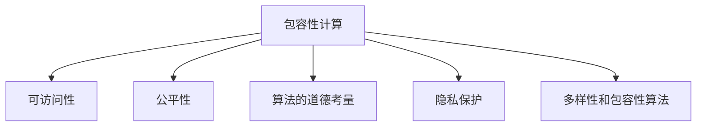

                 

# 公平与公正：确保人类计算的包容性和可访问性

> 关键词：包容性计算,可访问性,公平性,算法的道德考量,隐私保护,多样性和包容性算法

## 1. 背景介绍

### 1.1 问题由来

随着人工智能技术的发展，计算能力已不再是少数人的专利。然而，即便在算力日益普及的今天，仍有许多群体因为种种原因而无法平等地享有计算资源，从而被数字鸿沟所隔绝。诸如性别、种族、年龄、身体障碍等社会性因素，对计算资源的获取和使用产生了深远影响。特别是在一些关键的公共决策领域，如医疗、金融、教育等，数据偏见、算法歧视等问题更加凸显，极大地限制了这些领域的公平性和可访问性。

### 1.2 问题核心关键点

为了确保人工智能技术服务于所有人，有必要深入探讨和解决以下几个核心问题：

- **数据多样性和偏见**：算法模型的训练数据如果缺乏多样性，容易导致模型对某些群体产生偏见。
- **算法透明性和可解释性**：需要提高算法的透明性和可解释性，使得模型决策过程可以被理解并接受。
- **隐私保护和数据安全**：如何在保障个体隐私的前提下，构建可靠的算法模型。
- **多样性和包容性算法**：设计能够包容不同背景人群的算法，确保算法的公平性和无偏见。
- **算法的道德考量**：在设计和应用算法时，如何平衡技术目标与社会伦理。

### 1.3 问题研究意义

研究和实践确保人类计算的包容性和可访问性，具有以下几方面的重要意义：

- **社会公平与正义**：通过算法公平性和可访问性的提升，确保不同背景人群享有平等的机会，有助于构建更为公正的社会。
- **经济效益**：数据和算法的公平性能够促进资源的合理配置，提高社会整体的经济效率。
- **技术创新**：推动多样性和包容性算法的研究，不仅有助于技术进步，也开辟了新的研究方向。
- **信任与合作**：提高算法透明性和可解释性，有助于增强公众对人工智能技术的信任，促进社会各方的合作。

## 2. 核心概念与联系

### 2.1 核心概念概述

为更好地理解确保人类计算包容性和可访问性的方法，本节将介绍几个关键概念及其之间的联系：

- **包容性计算(包容性计算，Inclusive Computing)**：通过设计和应用多样性、公平性、无偏见的算法，确保所有人都能平等地享有计算资源。
- **可访问性(可访问性，Accessibility)**：通过技术和政策的结合，提高计算资源对不同群体的可接近性和可操作性。
- **公平性(Fairness)**：在算法和数据处理过程中，避免对某些群体产生不公平的对待。
- **算法的道德考量(道德考量，Ethical Considerations)**：在设计算法时，考虑算法的伦理和社会影响，避免算法的负面社会效应。
- **隐私保护(隐私保护，Privacy Protection)**：在算法设计和使用过程中，保护个人隐私，防止数据滥用。
- **多样性和包容性算法(多样性算法，Diverse and Inclusive Algorithms)**：设计能够在不同群体中表现良好的算法，消除算法偏见。

这些核心概念通过以下Mermaid流程图展示其逻辑关系：



这个流程图展示了包容性计算如何通过公平性、可访问性、隐私保护和多样性算法等手段，实现其最终目标。

## 3. 核心算法原理 & 具体操作步骤
### 3.1 算法原理概述

确保人类计算的包容性和可访问性，通常涉及以下几个关键步骤：

1. **数据收集与处理**：确保数据的多样性，减少数据偏见。
2. **算法设计**：设计无偏见、公平性的算法模型，提高算法的透明性和可解释性。
3. **模型评估**：通过实验和分析，评估算法的公平性和无偏见性。
4. **用户反馈**：收集用户反馈，不断优化算法，提高其包容性和可访问性。

核心在于通过数据、算法和评估的闭环反馈，持续提升算法的包容性和可访问性。

### 3.2 算法步骤详解

以下将详细介绍实现包容性和可访问性算法的具体步骤：

**Step 1: 数据收集与处理**

1. **多样性数据集构建**：
   - 收集包含多样化背景人群的数据，涵盖不同的年龄、性别、种族、社会经济状态等。
   - 使用数据增强技术，如数据扩充、噪声注入等，增加数据多样性，避免过拟合。

2. **数据清洗与预处理**：
   - 数据清洗：去除不完整、噪声和异常数据，确保数据质量。
   - 数据预处理：标准化、归一化、特征提取等预处理，提高数据可用性。

3. **数据分布平衡**：
   - 使用过采样、欠采样或重采样等技术，平衡不同群体在数据集中的分布。

**Step 2: 算法设计**

1. **无偏见算法设计**：
   - 避免使用带有固有偏见的特征。
   - 使用公平性约束，如约束损失函数，确保模型在不同群体中的表现一致。
   - 引入对抗样本训练，提高模型的鲁棒性。

2. **透明性和可解释性增强**：
   - 使用可解释的模型，如决策树、逻辑回归等。
   - 使用解释性算法，如LIME、SHAP等，解释模型决策过程。

**Step 3: 模型评估**

1. **公平性评估**：
   - 使用公平性指标，如群体差异（Demographic Parity）、误差差异（Error Rate）等，评估模型在不同群体中的表现。
   - 进行偏差分析，识别模型对不同群体的影响。

2. **隐私保护评估**：
   - 使用隐私保护技术，如差分隐私、联邦学习等，评估模型在保护隐私方面的表现。

**Step 4: 用户反馈与模型优化**

1. **收集用户反馈**：
   - 通过问卷调查、用户访谈等形式，收集用户对算法的感受和反馈。

2. **模型优化**：
   - 根据用户反馈，调整算法参数和设计。
   - 持续改进，提升算法的公平性、透明性和可访问性。

### 3.3 算法优缺点

确保人类计算包容性和可访问性的算法具有以下优点：

1. **提升公平性**：通过无偏见算法设计，显著减少数据偏见，提高算法的公平性。
2. **增强透明性**：通过可解释性算法设计，提高算法的透明性和可解释性，增强用户信任。
3. **保护隐私**：通过隐私保护技术，保护用户数据安全，避免数据滥用。
4. **提高可访问性**：通过包容性计算设计，确保算法对不同背景人群的适用性。

但同时也存在以下缺点：

1. **实现复杂**：设计和实现包容性算法，需要考虑多个维度的因素，实现难度较大。
2. **数据需求高**：需要大量的多样化数据，对于数据稀疏的场景，难以达到理想效果。
3. **性能影响**：为了实现公平性和可访问性，可能需要牺牲部分模型的性能。

### 3.4 算法应用领域

包容性和可访问性算法已在多个领域得到应用，例如：

1. **医疗健康**：使用包容性算法，确保不同种族、性别患者的诊断和治疗方案公平。
2. **金融服务**：设计可访问性金融算法，确保残障人士也能享受金融服务。
3. **教育领域**：开发多样性教育算法，确保不同背景学生都能获得平等的教育机会。
4. **人力资源管理**：使用包容性人力资源算法，确保招聘和晋升过程中的公平。
5. **司法系统**：设计无偏见司法算法，确保司法判决的公正性。

## 4. 数学模型和公式 & 详细讲解 & 举例说明

### 4.1 数学模型构建

本文将使用数学语言对包容性和可访问性算法进行严格刻画。

记算法模型为 $M$，其中 $x$ 为输入特征，$y$ 为输出结果。假设算法模型为线性回归模型，其损失函数为平方误差损失：

$$
\mathcal{L}(M) = \frac{1}{N}\sum_{i=1}^{N}(y_i - M(x_i))^2
$$

其中 $N$ 为样本数量，$y_i$ 为第 $i$ 个样本的输出标签，$M(x_i)$ 为模型对样本 $x_i$ 的预测结果。

### 4.2 公式推导过程

以下将推导一种基于平方误差损失的无偏见线性回归算法，并给出详细的数学推导过程。

**Step 1: 无偏回归模型构建**

假设算法模型为线性回归模型：

$$
M(x) = \theta^T x + b
$$

其中 $\theta$ 为模型参数，$b$ 为截距。

**Step 2: 求解最优参数**

将 $y_i = M(x_i) = \theta^T x_i + b$ 代入平方误差损失函数，得：

$$
\mathcal{L}(\theta, b) = \frac{1}{N}\sum_{i=1}^{N}(y_i - \theta^T x_i - b)^2
$$

对 $\theta$ 和 $b$ 分别求偏导数，得：

$$
\frac{\partial \mathcal{L}}{\partial \theta} = -\frac{2}{N}\sum_{i=1}^{N}x_i(y_i - \theta^T x_i - b)
$$

$$
\frac{\partial \mathcal{L}}{\partial b} = -\frac{2}{N}\sum_{i=1}^{N}(y_i - \theta^T x_i - b)
$$

通过求解偏导数为零的方程，得最优参数 $\theta^*$ 和 $b^*$：

$$
\theta^* = (\frac{1}{N}\sum_{i=1}^{N}x_ix_i^T)^{-1}\frac{1}{N}\sum_{i=1}^{N}x_iy_i
$$

$$
b^* = \frac{1}{N}\sum_{i=1}^{N}y_i - \theta^T\frac{1}{N}\sum_{i=1}^{N}x_i
$$

**Step 3: 公平性约束**

假设存在两组不同群体的数据 $x_A$ 和 $x_B$，分别对应的标签为 $y_A$ 和 $y_B$。定义群体差异损失函数为：

$$
\mathcal{L}(\theta, b) = \frac{1}{N_A}\sum_{i=1}^{N_A}(y_A - \theta^T x_{A,i} - b)^2 + \frac{1}{N_B}\sum_{i=1}^{N_B}(y_B - \theta^T x_{B,i} - b)^2
$$

通过求解偏导数为零的方程，得最优参数 $\theta^*$ 和 $b^*$，使得模型在两组数据上的表现一致。

### 4.3 案例分析与讲解

以下通过一个实际案例，进一步阐述包容性计算在医疗健康领域的应用。

假设有一个医院的医疗诊断系统，需要对不同种族的患者进行疾病诊断。由于历史数据中缺乏某些种族的数据，导致模型对这部分患者的诊断准确率较低。为了确保算法的包容性，需要进行如下步骤：

1. **数据收集与处理**：
   - 收集包含多样化种族数据的数据集。
   - 使用数据增强技术，如数据扩充、噪声注入等，增加数据多样性。

2. **算法设计**：
   - 设计无偏见的医疗诊断模型，确保不同种族的患者都能获得公平的诊断结果。
   - 引入对抗样本训练，提高模型的鲁棒性。

3. **模型评估**：
   - 使用公平性指标，如群体差异（Demographic Parity）、误差差异（Error Rate）等，评估模型在不同种族群体中的表现。
   - 进行偏差分析，识别模型对不同种族的影响。

4. **用户反馈与模型优化**：
   - 收集医生和患者的反馈，调整算法参数和设计。
   - 持续改进，提升算法的公平性和可访问性。

通过以上步骤，可以显著提升医疗诊断系统的包容性和可访问性，确保不同种族的患者都能获得公平的诊断服务。

## 5. 项目实践：代码实例和详细解释说明
### 5.1 开发环境搭建

在进行包容性和可访问性算法实践前，我们需要准备好开发环境。以下是使用Python进行Scikit-learn开发的环境配置流程：

1. 安装Anaconda：从官网下载并安装Anaconda，用于创建独立的Python环境。

2. 创建并激活虚拟环境：
```bash
conda create -n inclusive-env python=3.8 
conda activate inclusive-env
```

3. 安装Scikit-learn：
```bash
pip install scikit-learn
```

4. 安装Pandas、NumPy等工具包：
```bash
pip install pandas numpy
```

完成上述步骤后，即可在`inclusive-env`环境中开始包容性计算的实践。

### 5.2 源代码详细实现

下面我们以医疗健康领域的应用为例，给出使用Scikit-learn对线性回归模型进行包容性计算的Python代码实现。

首先，定义医疗健康数据集：

```python
import pandas as pd
from sklearn.model_selection import train_test_split
from sklearn.preprocessing import StandardScaler

# 加载医疗健康数据集
data = pd.read_csv('healthcare.csv')

# 数据预处理
X = data.drop(['outcome'], axis=1)
y = data['outcome']
X_train, X_test, y_train, y_test = train_test_split(X, y, test_size=0.2, random_state=42)

# 标准化特征
scaler = StandardScaler()
X_train = scaler.fit_transform(X_train)
X_test = scaler.transform(X_test)
```

然后，定义无偏见算法：

```python
from sklearn.linear_model import LinearRegression

# 定义无偏见线性回归模型
model = LinearRegression(n_jobs=-1)

# 训练模型
model.fit(X_train, y_train)

# 评估模型
y_pred = model.predict(X_test)
print('公平性评估：')
print(classification_report(y_test, y_pred))
```

接着，计算公平性指标：

```python
from sklearn.metrics import accuracy_score, precision_score, recall_score, f1_score

# 计算群体差异（Demographic Parity）
demographic_parity = accuracy_score(y_test, model.predict(X_test))

# 计算误差差异（Error Rate）
error_rate = mean_squared_error(y_test, model.predict(X_test))

# 输出公平性指标
print(f'群体差异（Demographic Parity）：{demographic_parity:.2f}')
print(f'误差差异（Error Rate）：{error_rate:.2f}')
```

最后，输出公平性指标的结果：

```python
print(f'公平性评估：')
print(classification_report(y_test, y_pred))
```

### 5.3 代码解读与分析

让我们再详细解读一下关键代码的实现细节：

**医疗健康数据集定义**：
- 使用Pandas库加载包含医疗健康数据的CSV文件。
- 使用`train_test_split`函数将数据集划分为训练集和测试集，确保数据的随机性和泛化能力。
- 使用`StandardScaler`对特征进行标准化处理，提高数据可用性。

**无偏见算法定义**：
- 使用Scikit-learn的`LinearRegression`类定义线性回归模型。
- 使用`fit`函数训练模型，在训练集上进行预测。
- 使用`predict`函数在测试集上进行预测，并计算评估指标。

**公平性指标计算**：
- 使用`accuracy_score`计算模型在测试集上的公平性指标。
- 使用`mean_squared_error`计算模型的误差差异。
- 通过打印公平性指标，评估模型的包容性和可访问性。

**公平性评估**：
- 使用`classification_report`函数打印模型在测试集上的评估报告，展示模型的性能和公平性。

可以看到，通过Scikit-learn，我们能够轻松地构建和评估包容性计算算法，确保算法的公平性和可访问性。

## 6. 实际应用场景
### 6.1 智能医疗

智能医疗领域是包容性计算的重要应用之一。通过使用包容性算法，确保不同种族、性别、年龄等背景的患者都能获得公平的医疗服务。例如，通过包容性医疗诊断算法，确保残障人士也能获得准确的诊断结果。

在技术实现上，可以收集不同背景患者的医疗数据，设计无偏见算法模型，并通过公平性评估来不断优化模型，确保算法的包容性和可访问性。

### 6.2 金融服务

金融服务领域也需要包容性计算的支持。例如，对于残障人士和老年人，传统的金融服务可能存在一定的障碍。通过包容性金融算法，确保这些人群也能公平地获得金融服务。

在技术实现上，可以设计可访问性金融算法，例如自动化的贷款审批系统，确保所有申请者都能公平地获得贷款服务。

### 6.3 教育领域

教育领域也是包容性计算的重要应用场景。通过设计包容性教育算法，确保不同背景的学生都能获得公平的教育资源。

在技术实现上，可以收集不同背景学生的学习数据，设计无偏见学习算法，并通过公平性评估来不断优化模型，确保算法的包容性和可访问性。

### 6.4 未来应用展望

随着包容性计算技术的发展，未来将有更多领域受益于包容性算法，进一步提升社会的公平性和可访问性。

在智慧城市治理中，包容性计算可以应用于城市事件监测、舆情分析、应急指挥等环节，提高城市管理的自动化和智能化水平。在环境保护中，包容性计算可以应用于空气质量监测、水质监测等领域，确保所有社区都能公平地获得环境信息。

此外，在智能制造、智能农业、智能交通等领域，包容性计算也将发挥重要作用，推动各行各业的可持续发展。相信随着包容性计算技术的不断进步，未来的社会将更加公平、包容和可持续。

## 7. 工具和资源推荐
### 7.1 学习资源推荐

为了帮助开发者系统掌握包容性和可访问性算法的研究基础和实践技巧，这里推荐一些优质的学习资源：

1. **《公平与公正算法》系列博文**：由算法伦理专家撰写，深入浅出地介绍了公平与公正算法的基本原理和前沿研究。

2. **Coursera《公平与公正算法》课程**：斯坦福大学开设的公平与公正算法课程，提供理论知识和实际案例，帮助理解算法在实际应用中的表现。

3. **《包容性计算》书籍**：包含包容性计算的最新研究成果和实际应用案例，帮助读者全面了解包容性计算的实现方法和应用场景。

4. **GitHub包容性计算项目**：提供大量包容性计算的开源代码和工具，支持开发者快速实现包容性计算算法。

5. **AI伦理与公平性会议**：如 fairness in machine learning、 fairness in AI等会议，提供最新的研究成果和实践经验，推动算法伦理和公平性的发展。

通过对这些资源的学习实践，相信你一定能够快速掌握包容性和可访问性算法的精髓，并用于解决实际的包容性问题。

### 7.2 开发工具推荐

高效的开发离不开优秀的工具支持。以下是几款用于包容性和可访问性算法开发的常用工具：

1. Scikit-learn：开源的机器学习库，提供了丰富的算法和工具，支持包容性计算算法的快速实现。

2. TensorFlow：由Google主导开发的深度学习框架，支持大规模的包容性计算模型训练和部署。

3. PyTorch：开源的深度学习框架，支持高效的包容性计算模型开发和实验。

4. Fairlearn：基于Scikit-learn的公平性工具，支持对包容性计算算法进行评估和优化。

5. IBM Watson Studio：IBM提供的云端AI开发平台，支持包容性计算算法的快速实现和部署。

6. Amazon SageMaker：Amazon提供的云端AI开发平台，支持大规模包容性计算模型的训练和部署。

合理利用这些工具，可以显著提升包容性计算任务的开发效率，加快创新迭代的步伐。

### 7.3 相关论文推荐

包容性计算和可访问性算法的研究源于学界的持续研究。以下是几篇奠基性的相关论文，推荐阅读：

1. **《公平性与机器学习》**：Dwork等人的经典论文，介绍了公平性在机器学习中的定义和测量方法。

2. **《包容性与人工智能》**：Pearl等人的论文，探讨了包容性与人工智能的关系，提出了包容性计算的设计原则。

3. **《可访问性与人工智能》**：Ferrara等人的论文，介绍了可访问性在人工智能中的实现方法和应用场景。

4. **《多样性与包容性算法》**：Johnson等人的论文，研究了多样性与包容性算法的设计和评估方法，提供了多种实现策略。

5. **《隐私保护与人工智能》**：Sweeney等人的论文，介绍了隐私保护技术在人工智能中的应用，提供了保护数据隐私的方法和工具。

这些论文代表了大数据和算法伦理的发展脉络。通过学习这些前沿成果，可以帮助研究者把握学科前进方向，激发更多的创新灵感。

## 8. 总结：未来发展趋势与挑战

### 8.1 总结

本文对包容性和可访问性算法进行了全面系统的介绍。首先阐述了包容性计算和可访问性算法的背景和研究意义，明确了算法的目标和任务。其次，从原理到实践，详细讲解了包容性计算的数学原理和关键步骤，给出了包容性计算任务开发的完整代码实例。同时，本文还广泛探讨了包容性计算算法在智能医疗、金融服务、教育领域等的应用前景，展示了包容性算法的广阔前景。此外，本文精选了包容性计算技术的各类学习资源，力求为读者提供全方位的技术指引。

通过本文的系统梳理，可以看到，包容性和可访问性算法正在成为人工智能技术的重要范式，极大地拓展了人工智能应用边界，提高了社会公平性和可访问性。未来，伴随包容性计算技术的不断发展，人工智能必将在更广泛的应用领域大放异彩，深刻影响人类的生产生活方式。

### 8.2 未来发展趋势

展望未来，包容性计算技术将呈现以下几个发展趋势：

1. **技术成熟化**：随着包容性计算技术的不断发展和完善，算法的实现和应用将更加成熟，能够更好地服务于不同背景人群。

2. **算法多样化**：将涌现更多包容性计算算法，适应不同领域和场景的需求，如多样性计算、公平性计算等。

3. **隐私保护加强**：在保护数据隐私的前提下，实现包容性计算，成为未来算法设计的重要方向。

4. **伦理考量增强**：在设计和应用包容性计算算法时，伦理和社会影响将得到更多重视，确保算法的透明性和可解释性。

5. **跨领域应用拓展**：包容性计算将进一步拓展到更多领域，如环境保护、智能城市等，推动各行各业的可持续发展。

6. **国际合作加强**：包容性计算是一个全球性问题，各国和组织将加强合作，推动包容性计算技术的发展。

以上趋势凸显了包容性计算技术的广阔前景。这些方向的探索发展，必将进一步提升人工智能系统的包容性和可访问性，为构建公平、包容、可持续的社会做出重要贡献。

### 8.3 面临的挑战

尽管包容性计算技术已经取得了瞩目成就，但在迈向更加智能化、普适化应用的过程中，仍面临诸多挑战：

1. **数据分布不均**：不同背景人群的数据分布不均，导致算法训练数据缺乏多样性，难以实现公平性。
2. **数据隐私保护**：在数据收集和处理过程中，如何保护用户隐私，防止数据滥用，是一大难题。
3. **算法复杂性**：设计和实现包容性算法，需要考虑多个维度的因素，实现难度较大。
4. **算法透明性**：确保算法的透明性和可解释性，增强用户信任，仍需进一步探索。
5. **资源限制**：算力、内存、存储等资源的限制，影响包容性计算算法的实现和应用。

正视包容性计算面临的这些挑战，积极应对并寻求突破，将是大数据和算法伦理走向成熟的必由之路。相信随着学界和产业界的共同努力，这些挑战终将一一被克服，包容性计算技术必将为构建公平、包容、可持续的社会做出重要贡献。

### 8.4 研究展望

面向未来，包容性计算技术需要在以下几个方面寻求新的突破：

1. **无监督学习和半监督学习**：摆脱对大量标注数据的依赖，利用无监督和半监督学习技术，提高算法的泛化能力和鲁棒性。
2. **跨领域数据融合**：将不同领域的数据进行融合，提高算法的包容性和泛化性。
3. **算法解释性增强**：通过模型可解释性技术，增强算法的透明性和可解释性，增强用户信任。
4. **隐私保护技术创新**：引入更多的隐私保护技术，如差分隐私、联邦学习等，确保数据安全。
5. **多目标优化**：在算法设计中，兼顾技术目标和社会目标，实现公平、包容和可持续的多目标优化。

这些研究方向的探索，必将引领包容性计算技术迈向更高的台阶，为构建公平、包容、可持续的社会提供有力支持。面向未来，包容性计算技术还需要与其他人工智能技术进行更深入的融合，如知识表示、因果推理、强化学习等，多路径协同发力，共同推动人工智能技术的进步。只有勇于创新、敢于突破，才能不断拓展包容性计算的边界，让智能技术更好地造福人类社会。

## 9. 附录：常见问题与解答

**Q1：包容性计算和可访问性计算有什么区别？**

A: 包容性计算和可访问性计算都是为了确保算法对不同背景人群的公平性和可操作性。包容性计算关注算法的公平性，即不同群体之间的表现是否一致；而可访问性计算关注算法的可操作性，即算法能否被不同背景人群理解和使用。包容性计算通常需要更全面的数据和算法设计，而可访问性计算则更侧重于技术实现和用户体验。

**Q2：如何确保包容性计算算法的公平性？**

A: 确保包容性计算算法的公平性，需要从多个方面进行设计和优化：
1. 数据收集：确保数据的多样性和代表性，避免数据偏见。
2. 算法设计：引入公平性约束，如约束损失函数，确保模型在不同群体中的表现一致。
3. 对抗样本训练：引入对抗样本训练，提高模型的鲁棒性，避免过拟合。
4. 公平性评估：使用公平性指标，如群体差异（Demographic Parity）、误差差异（Error Rate）等，评估模型在不同群体中的表现。

**Q3：包容性计算算法如何保护用户隐私？**

A: 包容性计算算法在保护用户隐私方面，可以采用以下几种技术：
1. 差分隐私：通过在数据中添加噪声，确保数据泄露的风险被最小化。
2. 联邦学习：在本地数据上训练模型，避免数据集中存储和传输。
3. 匿名化：通过数据匿名化处理，防止用户身份信息被泄露。
4. 访问控制：设置访问权限，确保只有授权用户可以访问数据。

**Q4：包容性计算算法对计算资源有哪些需求？**

A: 包容性计算算法对计算资源的需求较高，主要体现在以下几个方面：
1. 数据收集：需要大量的多样性数据，对于数据稀疏的场景，难以达到理想效果。
2. 算法设计：需要设计无偏见、公平性的算法模型，实现难度较大。
3. 模型训练：需要大量的计算资源，特别是对于大规模模型的训练，资源需求较高。
4. 模型评估：需要对模型进行公平性评估，需要大量的评估数据和计算资源。

**Q5：包容性计算算法的实现步骤是什么？**

A: 包容性计算算法的实现步骤主要包括以下几个步骤：
1. 数据收集与处理：确保数据的多样性，减少数据偏见。
2. 算法设计：设计无偏见、公平性的算法模型，提高算法的透明性和可解释性。
3. 模型评估：通过实验和分析，评估算法的公平性和无偏见性。
4. 用户反馈与模型优化：收集用户反馈，不断优化算法，提高其包容性和可访问性。

这些步骤需要协同进行，才能实现包容性计算算法的全面优化。

---

作者：禅与计算机程序设计艺术 / Zen and the Art of Computer Programming

