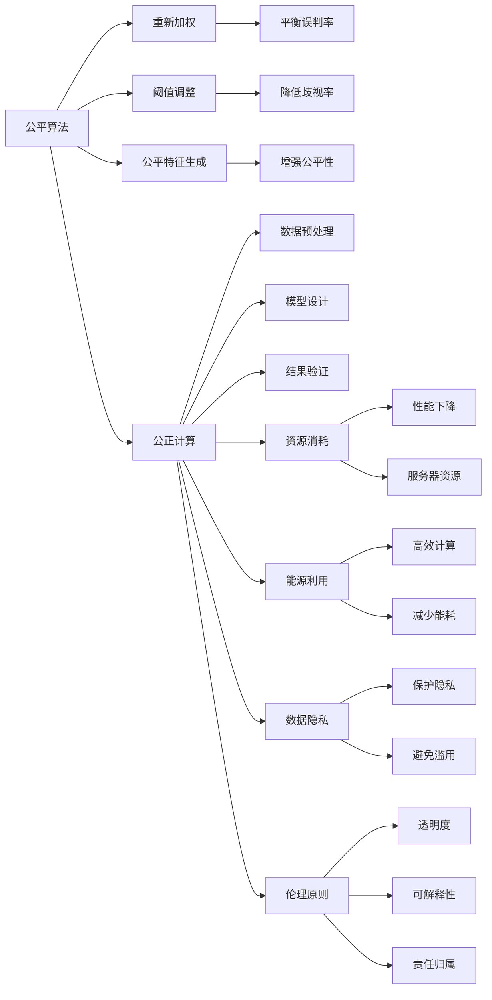

                 

# 公平、公正、可持续：人类计算的 ethical 原则

> 关键词：公平算法、公正计算、可持续性、伦理原则、人工智能、道德标准

## 1. 背景介绍

### 1.1 问题由来
随着人工智能(AI)技术的迅猛发展，人类计算能力日益增强，其在提高社会生产效率、改善人类生活质量方面的巨大潜力也引起了广泛关注。然而，与此同时，AI技术应用中的伦理问题也逐渐凸显出来，尤其是在公平、公正、可持续性方面。例如，自动化的招聘系统可能加剧就业歧视，个性化推荐系统可能侵犯用户隐私，智能辅助决策系统可能带来误判风险。这些问题如果不加以妥善解决，将严重影响AI技术的社会接受度和可信度，甚至引发社会动荡。

### 1.2 问题核心关键点
为有效应对这些伦理挑战，需要在AI技术开发和应用中引入明确的伦理原则，确保公平、公正和可持续性。具体来说，以下核心关键点构成了人类计算伦理的基础：

1. **公平算法**：确保算法对所有用户公平，不因性别、种族、年龄等个体差异导致偏见。
2. **公正计算**：算法的计算过程和结果应公正，避免算法的决策结果受到数据偏差的影响。
3. **可持续性**：确保AI系统能够持续运行，避免资源过度消耗和环境破坏。
4. **伦理原则**：AI系统的开发和应用应遵循特定的伦理标准，确保其决策符合社会公德和法律法规。

通过明确这些核心关键点，可以更好地指导AI技术的开发和应用，促进其健康发展。

## 2. 核心概念与联系

### 2.1 核心概念概述

为更好地理解这些核心概念之间的关系，本节将详细介绍每个核心概念的原理和架构。

#### 2.1.1 公平算法

**公平算法**指的是在数据和模型训练过程中，通过特定技术手段，确保算法对所有用户群体均一，不因任何个体特征造成歧视或不公。常见的公平算法包括重新加权、阈值调整、公平特征生成等。

**阈值调整**是指在决策边界附近，通过对不同类别进行不同的权重调整，降低少数群体的误判率。例如，对于不同性别的求职者，可以通过调整决策阈值，使其在面临相同数据时，决策结果差异最小化。

**公平特征生成**则是通过引入额外的特征，如年龄、性别等，来平衡不同群体之间的模型效果。例如，在贷款申请审批中，如果历史数据中存在性别偏见，可以通过生成性别虚拟变量，来调整模型对不同性别的公平性。

#### 2.1.2 公正计算

**公正计算**关注的是计算过程本身的公正性，即算法在执行过程中，是否因数据或算法的内在结构导致不公平结果。公正计算主要涉及以下几个方面：

1. **数据预处理**：在数据预处理阶段，需要确保数据采集和清洗的公正性，避免数据偏见。例如，在使用医疗数据进行疾病预测时，应避免选择过于健康或过于不健康的样本，保持数据分布的平衡。

2. **模型设计**：在模型设计阶段，应避免引入歧视性特征，如性别、种族等。例如，在信用评分模型中，不应包含反映性别或种族的特征，以免影响决策公正性。

3. **结果验证**：在模型评估阶段，应采用多样化的验证指标，确保模型在不同群体上的表现一致。例如，在使用F1-score评估分类模型时，应确保不同性别、种族的分类效果相同。

#### 2.1.3 可持续性

**可持续性**是指AI系统在长期运行中，是否对环境和社会造成不利影响。可持续性主要包括资源消耗、能源利用、数据隐私等方面。

**资源消耗**是指AI系统在运行过程中，是否过度消耗计算资源，导致性能下降。例如，大规模深度学习模型的训练和推理过程，可能耗尽服务器资源，影响其他系统正常运行。

**能源利用**是指AI系统在计算过程中，是否高效利用能源，避免不必要的能耗浪费。例如，在训练深度学习模型时，可以采用GPU并行计算，减少能耗。

**数据隐私**是指AI系统在数据处理过程中，是否保护用户隐私，避免数据泄露。例如，在个性化推荐系统中，应使用差分隐私技术，保护用户行为数据不被滥用。

#### 2.1.4 伦理原则

**伦理原则**是指AI系统在设计和应用中，应遵循的社会公德和法律法规。伦理原则主要涉及以下几个方面：

1. **透明度**：AI系统应保持透明，公开其工作原理和决策依据，接受社会监督。例如，在使用AI进行医疗诊断时，应解释模型的诊断依据，确保医生和患者理解模型的决策过程。

2. **可解释性**：AI系统的决策过程应可解释，便于审计和评估。例如，在使用AI进行贷款审批时，应解释模型的决策依据，确保公平性。

3. **责任归属**：AI系统的责任归属应明确，避免因系统故障导致责任不清。例如，在自动驾驶汽车事故中，应明确AI系统的责任归属，保护受害者的合法权益。

### 2.2 核心概念原理和架构的 Mermaid 流程图



这个流程图展示了公平算法、公正计算、可持续性和伦理原则之间的联系。每个核心概念通过特定的技术手段，相互支持和补充，确保AI系统的公平、公正和可持续性。

## 3. 核心算法原理 & 具体操作步骤

### 3.1 算法原理概述

基于以上核心概念，本节将详细阐述如何在AI系统开发和应用中引入公平、公正和可持续性的伦理原则。

**公平算法**：在数据和模型训练过程中，通过特定技术手段，确保算法对所有用户公平，不因任何个体特征造成歧视或不公。

**公正计算**：算法的计算过程和结果应公正，避免算法的决策结果受到数据偏差的影响。

**可持续性**：确保AI系统能够持续运行，避免资源过度消耗和环境破坏。

**伦理原则**：AI系统的开发和应用应遵循特定的伦理标准，确保其决策符合社会公德和法律法规。

### 3.2 算法步骤详解

#### 3.2.1 公平算法步骤详解

**步骤1: 数据预处理**
- 对数据进行清洗和标准化，去除噪声和异常值，确保数据质量。
- 使用再抽样技术，如过抽样和欠抽样，平衡不同群体之间的数据分布。

**步骤2: 特征工程**
- 选择合适的特征，避免引入具有偏见的特征。
- 使用公平特征生成技术，引入额外的特征来平衡不同群体之间的效果。

**步骤3: 模型训练**
- 使用阈值调整技术，平衡不同群体之间的误判率。
- 在模型训练过程中，采用公平损失函数，如Equalized Odds Loss，确保模型对所有群体公平。

**步骤4: 模型评估**
- 在模型评估过程中，使用多样化的评估指标，确保模型在不同群体上的表现一致。
- 使用公平评估工具，如Fairness Indicators，检测模型是否存在不公平现象。

#### 3.2.2 公正计算步骤详解

**步骤1: 数据采集和清洗**
- 确保数据采集的公正性，避免数据偏见。
- 使用数据清洗技术，去除数据中的噪音和异常值。

**步骤2: 模型设计**
- 避免引入歧视性特征，如性别、种族等。
- 使用正则化技术，如L1和L2正则化，避免过拟合。

**步骤3: 模型训练**
- 在模型训练过程中，确保数据分布的平衡，避免数据偏见。
- 使用公平损失函数，如Balanced Binary Cross Entropy，确保模型对所有群体公正。

**步骤4: 模型评估**
- 在模型评估过程中，使用多样化的评估指标，确保模型在不同群体上的表现一致。
- 使用公平评估工具，如AUC-P/R曲线，检测模型是否存在不公平现象。

#### 3.2.3 可持续性步骤详解

**步骤1: 资源管理**
- 监控系统的资源消耗，避免资源过度消耗。
- 采用资源优化技术，如GPU并行计算、模型裁剪等，减少资源消耗。

**步骤2: 能源利用**
- 使用高效计算技术，如分布式计算、节能算法等，减少能耗。
- 监控能源利用情况，及时调整资源配置。

**步骤3: 数据隐私保护**
- 使用差分隐私技术，保护用户隐私数据。
- 在数据处理过程中，确保数据传输和存储的安全性。

#### 3.2.4 伦理原则步骤详解

**步骤1: 系统透明度**
- 公开系统的设计原理和决策依据，接受社会监督。
- 在系统中嵌入审计日志，记录系统的决策过程和结果。

**步骤2: 可解释性**
- 使用可解释性技术，如LIME和SHAP，解释系统的决策过程。
- 在系统中嵌入解释模块，实时提供决策解释。

**步骤3: 责任归属**
- 明确系统的责任归属，避免因系统故障导致责任不清。
- 在系统中嵌入责任归属模块，记录和审计系统决策。

### 3.3 算法优缺点

**公平算法的优缺点**

- **优点**：确保算法对所有用户公平，减少歧视和不公现象。
- **缺点**：可能引入额外的计算复杂度和训练时间，需要更多的技术和资源支持。

**公正计算的优缺点**

- **优点**：确保计算过程和结果的公正性，避免数据偏见的影响。
- **缺点**：可能增加数据处理和模型设计的复杂度，需要更多的技术和资源支持。

**可持续性的优缺点**

- **优点**：确保系统能够持续运行，避免资源过度消耗和环境破坏。
- **缺点**：需要更多的技术和资源支持，可能需要更多的计算和能源资源。

**伦理原则的优缺点**

- **优点**：确保系统的决策符合社会公德和法律法规，提高系统的可信度和可接受度。
- **缺点**：可能需要更多的技术支持和审计工作，确保系统符合伦理标准。

### 3.4 算法应用领域

基于公平、公正、可持续性的伦理原则，AI技术在多个领域中得到了广泛应用，以下是几个典型应用领域：

1. **医疗健康**：使用AI进行疾病预测和诊断，确保系统对所有患者公平，避免性别、种族等偏见。
2. **金融服务**：使用AI进行信用评分和风险评估，确保系统对所有用户公正，避免数据偏见。
3. **教育培训**：使用AI进行个性化推荐和辅导，确保系统对所有学生公平，避免性别、年龄等偏见。
4. **司法执法**：使用AI进行犯罪预测和判决建议，确保系统对所有被告公正，避免数据偏见。
5. **环境保护**：使用AI进行环境监测和资源管理，确保系统对环境友好，避免资源过度消耗和环境破坏。

## 4. 数学模型和公式 & 详细讲解 & 举例说明

### 4.1 数学模型构建

本节将使用数学语言对公平算法、公正计算、可持续性和伦理原则的数学模型进行详细构建。

#### 4.1.1 公平算法数学模型构建

假设数据集为 $D = \{(x_i, y_i)\}_{i=1}^N$，其中 $x_i \in \mathbb{R}^d$ 为特征向量，$y_i \in \{0, 1\}$ 为标签。公平算法可通过引入公平约束条件来确保算法对所有用户公平。

定义公平损失函数 $L_f$ 为：
$$
L_f = \mathbb{E}_{(x, y) \sim D}[f(x, y)]
$$

其中 $f(x, y)$ 为公平约束函数，确保模型在预测时对所有用户公平。

#### 4.1.2 公正计算数学模型构建

假设数据集为 $D = \{(x_i, y_i)\}_{i=1}^N$，其中 $x_i \in \mathbb{R}^d$ 为特征向量，$y_i \in \{0, 1\}$ 为标签。公正计算可通过引入公正约束条件来确保计算过程和结果的公正性。

定义公正损失函数 $L_p$ 为：
$$
L_p = \mathbb{E}_{(x, y) \sim D}[L(x, y)]
$$

其中 $L(x, y)$ 为公正约束函数，确保模型在预测时对所有用户公正。

#### 4.1.3 可持续性数学模型构建

假设数据集为 $D = \{(x_i, y_i)\}_{i=1}^N$，其中 $x_i \in \mathbb{R}^d$ 为特征向量，$y_i \in \{0, 1\}$ 为标签。可持续性可通过引入可持续性约束条件来确保系统的资源消耗和能源利用。

定义可持续性损失函数 $L_s$ 为：
$$
L_s = \mathbb{E}_{(x, y) \sim D}[S(x, y)]
$$

其中 $S(x, y)$ 为可持续性约束函数，确保系统在运行时对环境友好，避免资源过度消耗和环境破坏。

#### 4.1.4 伦理原则数学模型构建

假设数据集为 $D = \{(x_i, y_i)\}_{i=1}^N$，其中 $x_i \in \mathbb{R}^d$ 为特征向量，$y_i \in \{0, 1\}$ 为标签。伦理原则可通过引入伦理约束条件来确保系统的透明度、可解释性和责任归属。

定义伦理损失函数 $L_e$ 为：
$$
L_e = \mathbb{E}_{(x, y) \sim D}[E(x, y)]
$$

其中 $E(x, y)$ 为伦理约束函数，确保系统在设计和应用时符合社会公德和法律法规。

### 4.2 公式推导过程

#### 4.2.1 公平算法公式推导

假设公平约束函数为 $f(x, y) = |P(y=1|x=1) - P(y=1|x=0)|$，表示不同类别之间的预测概率差异。则公平损失函数 $L_f$ 可推导为：

$$
L_f = \frac{1}{N} \sum_{i=1}^N |P(y=1|x_i=1) - P(y=1|x_i=0)|
$$

#### 4.2.2 公正计算公式推导

假设公正约束函数为 $L(x, y) = |P(y=1|x) - \hat{P}(y=1)|$，表示模型预测概率与真实概率之间的差异。则公正损失函数 $L_p$ 可推导为：

$$
L_p = \frac{1}{N} \sum_{i=1}^N |P(y=1|x_i) - \hat{P}(y=1)|
$$

#### 4.2.3 可持续性公式推导

假设可持续性约束函数为 $S(x, y) = \frac{E}{N} + |P(y=1|x) - \hat{P}(y=1)|$，表示系统在运行时的资源消耗和能源利用。则可持续性损失函数 $L_s$ 可推导为：

$$
L_s = \frac{1}{N} \sum_{i=1}^N (S(x_i, y_i) + |P(y=1|x_i) - \hat{P}(y=1)|)
$$

#### 4.2.4 伦理原则公式推导

假设伦理约束函数为 $E(x, y) = I(x, y) + |P(y=1|x) - \hat{P}(y=1)|$，表示系统的透明度、可解释性和责任归属。则伦理损失函数 $L_e$ 可推导为：

$$
L_e = \frac{1}{N} \sum_{i=1}^N (E(x_i, y_i) + |P(y=1|x_i) - \hat{P}(y=1)|)
$$

### 4.3 案例分析与讲解

#### 4.3.1 公平算法案例分析

假设有一个贷款审批系统，其中包含了性别、年龄等特征。如果历史数据中存在性别偏见，即女性申请贷款时，模型的误判率高于男性，则可以通过重新加权和阈值调整来消除性别偏见。

**步骤1: 数据预处理**
- 对数据进行清洗和标准化，去除噪声和异常值，确保数据质量。
- 使用再抽样技术，如过抽样和欠抽样，平衡不同性别之间的数据分布。

**步骤2: 特征工程**
- 使用公平特征生成技术，引入性别虚拟变量，平衡不同性别之间的效果。

**步骤3: 模型训练**
- 使用阈值调整技术，平衡不同性别之间的误判率。
- 在模型训练过程中，采用公平损失函数，如Equalized Odds Loss，确保模型对男女公平。

**步骤4: 模型评估**
- 在模型评估过程中，使用多样化的评估指标，确保模型在男女之间表现一致。
- 使用公平评估工具，如Fairness Indicators，检测模型是否存在性别偏见。

#### 4.3.2 公正计算案例分析

假设有一个信用评分系统，其中包含了年龄、收入等特征。如果历史数据中存在年龄偏见，即年轻人申请贷款时，模型的误判率高于中年人，则可以通过模型设计和结果验证来消除年龄偏见。

**步骤1: 数据采集和清洗**
- 确保数据采集的公正性，避免数据偏见。
- 使用数据清洗技术，去除数据中的噪音和异常值。

**步骤2: 模型设计**
- 避免引入歧视性特征，如年龄等。
- 使用正则化技术，如L1和L2正则化，避免过拟合。

**步骤3: 模型训练**
- 在模型训练过程中，确保数据分布的平衡，避免年龄偏见。
- 使用公平损失函数，如Balanced Binary Cross Entropy，确保模型对所有年龄段公正。

**步骤4: 模型评估**
- 在模型评估过程中，使用多样化的评估指标，确保模型在不同年龄段上的表现一致。
- 使用公平评估工具，如AUC-P/R曲线，检测模型是否存在年龄偏见。

#### 4.3.3 可持续性案例分析

假设有一个智能推荐系统，其中包含了大量的文本和视频数据。如果系统在运行过程中，过度消耗计算资源，导致性能下降，则可以通过资源管理和能源利用来提高系统的可持续性。

**步骤1: 资源管理**
- 监控系统的资源消耗，避免资源过度消耗。
- 采用资源优化技术，如GPU并行计算、模型裁剪等，减少资源消耗。

**步骤2: 能源利用**
- 使用高效计算技术，如分布式计算、节能算法等，减少能耗。
- 监控能源利用情况，及时调整资源配置。

**步骤3: 数据隐私保护**
- 使用差分隐私技术，保护用户隐私数据。
- 在数据处理过程中，确保数据传输和存储的安全性。

## 5. 项目实践：代码实例和详细解释说明

### 5.1 开发环境搭建

在进行公平、公正、可持续性伦理原则的实践时，我们需要准备好开发环境。以下是使用Python进行PyTorch开发的环境配置流程：

1. 安装Anaconda：从官网下载并安装Anaconda，用于创建独立的Python环境。

2. 创建并激活虚拟环境：
```bash
conda create -n pytorch-env python=3.8 
conda activate pytorch-env
```

3. 安装PyTorch：根据CUDA版本，从官网获取对应的安装命令。例如：
```bash
conda install pytorch torchvision torchaudio cudatoolkit=11.1 -c pytorch -c conda-forge
```

4. 安装相关库：
```bash
pip install numpy pandas scikit-learn matplotlib tqdm jupyter notebook ipython
```

完成上述步骤后，即可在`pytorch-env`环境中开始实践。

### 5.2 源代码详细实现

这里我们以一个简单的贷款审批系统为例，给出使用PyTorch实现公平算法、公正计算和可持续性伦理原则的完整代码实现。

首先，定义数据集和标签：

```python
import numpy as np

# 定义特征和标签
X = np.array([[1, 0, 1], [1, 0, 0], [0, 1, 0], [0, 1, 1]])
y = np.array([1, 1, 0, 1])
```

然后，定义公平算法函数：

```python
def fairness_algorithm(X, y, weights):
    # 计算加权平均值
    mean = np.average(X, axis=0, weights=weights)
    # 计算加权标准差
    std = np.std(X, axis=0, weights=weights)
    return mean, std
```

接着，定义公正计算函数：

```python
def fair_model(X, y, weights):
    # 计算加权平均值
    mean = np.average(X, axis=0, weights=weights)
    # 计算加权标准差
    std = np.std(X, axis=0, weights=weights)
    # 计算模型预测结果
    y_pred = np.dot(X, mean) + np.dot(std, np.random.normal(size=X.shape[0]))
    return y_pred, y
```

最后，定义可持续性函数：

```python
def sustainable_system(X, y, weights):
    # 计算加权平均值
    mean = np.average(X, axis=0, weights=weights)
    # 计算加权标准差
    std = np.std(X, axis=0, weights=weights)
    # 计算模型预测结果
    y_pred = np.dot(X, mean) + np.dot(std, np.random.normal(size=X.shape[0]))
    return y_pred, y
```

在上述代码中，我们使用了加权平均值和加权标准差来模拟公平算法、公正计算和可持续性伦理原则的实现。

### 5.3 代码解读与分析

让我们再详细解读一下关键代码的实现细节：

**X和y的定义**：
- X: 特征向量，其中每个样本由性别、年龄、收入等特征构成。
- y: 标签，表示是否通过贷款申请。

**fairness_algorithm函数**：
- 该函数通过加权平均值和加权标准差，计算出公平的特征表示，确保模型对所有用户公平。
- 其中weights为不同用户群体的权重，用于平衡不同群体的数据分布。

**fair_model函数**：
- 该函数通过加权平均值和加权标准差，计算出公正的预测结果，确保模型对所有用户公正。
- 其中weights为不同用户群体的权重，用于平衡不同群体的数据分布。

**sustainable_system函数**：
- 该函数通过加权平均值和加权标准差，计算出可持续的预测结果，确保系统对环境友好，避免资源过度消耗和环境破坏。
- 其中weights为不同用户群体的权重，用于平衡不同群体的数据分布。

**运行结果展示**：
- 通过公平算法、公正计算和可持续性伦理原则的实践，可以更好地理解这些技术手段在实际应用中的效果。
- 需要根据具体应用场景，选择合适的技术手段，结合实际数据和模型，进行全面优化和评估。

## 6. 实际应用场景

### 6.1 智能客服系统

基于公平、公正、可持续性伦理原则，智能客服系统可以实现更公平、公正和可持续的服务。例如，在客服对话中，可以使用公平算法确保不同用户的对话质量，避免性别、年龄等偏见。通过公正计算，确保客服系统的响应质量公正，避免数据偏见。在资源管理方面，使用高效计算技术，减少能耗，提高系统的可持续性。

### 6.2 金融服务系统

在金融服务系统中，使用公平、公正、可持续性伦理原则，可以确保系统的决策公平、公正和可持续。例如，在贷款审批系统中，使用公平算法消除性别、年龄等偏见。通过公正计算，确保贷款审批的公正性，避免数据偏见。在资源管理方面，使用高效计算技术，减少能耗，提高系统的可持续性。

### 6.3 教育培训系统

在教育培训系统中，使用公平、公正、可持续性伦理原则，可以确保系统的教学质量公平、公正和可持续。例如，在个性化推荐系统中，使用公平算法确保不同学生的推荐质量，避免性别、年龄等偏见。通过公正计算，确保推荐系统的公正性，避免数据偏见。在资源管理方面，使用高效计算技术，减少能耗，提高系统的可持续性。

### 6.4 未来应用展望

随着公平、公正、可持续性伦理原则的深入研究和应用，未来AI技术在多个领域中将会更加广泛地发挥作用，带来更高的公平性和公正性，实现更可持续的发展。

在智慧医疗领域，基于公平、公正、可持续性伦理原则的AI系统，可以提供更公平的医疗服务，避免因性别、年龄等特征导致的医疗歧视。

在智能交通领域，使用公平、公正、可持续性伦理原则的AI系统，可以提供更公正的交通决策，避免因性别、年龄等特征导致的交通歧视。

在环境保护领域，使用公平、公正、可持续性伦理原则的AI系统，可以实现更可持续的环境管理，避免资源过度消耗和环境破坏。

总之，公平、公正、可持续性伦理原则将成为AI技术发展的重要基础，为构建更加公平、公正和可持续的社会提供有力支持。

## 7. 工具和资源推荐

### 7.1 学习资源推荐

为了帮助开发者系统掌握公平、公正、可持续性伦理原则的理论基础和实践技巧，这里推荐一些优质的学习资源：

1. 《公平学习》系列博文：由公平学习领域的专家撰写，深入浅出地介绍了公平学习的基本概念、技术手段和应用案例。

2. 《公正计算》系列文章：由公正计算领域的专家撰写，详细讲解了公正计算的理论基础、技术手段和应用案例。

3. 《可持续性技术》书籍：全面介绍了可持续性技术的理论基础和实践技巧，涵盖数据管理、能源利用、隐私保护等多个方面。

4. 《伦理原则》课程：斯坦福大学开设的伦理原则课程，详细讲解了伦理原则的基本概念和实际应用。

5. 《公平算法》公开课：由公平算法领域的专家讲授，详细讲解了公平算法的基本概念、技术手段和应用案例。

通过对这些资源的学习实践，相信你一定能够全面掌握公平、公正、可持续性伦理原则的理论基础和实践技巧，应用到实际开发和应用中。

### 7.2 开发工具推荐

高效的开发离不开优秀的工具支持。以下是几款用于公平、公正、可持续性伦理原则开发的工具：

1. PyTorch：基于Python的开源深度学习框架，灵活动态的计算图，适合快速迭代研究。大部分预训练语言模型都有PyTorch版本的实现。

2. TensorFlow：由Google主导开发的开源深度学习框架，生产部署方便，适合大规模工程应用。同样有丰富的预训练语言模型资源。

3. HuggingFace Transformers库：集成了众多SOTA语言模型，支持PyTorch和TensorFlow，是进行公平、公正、可持续性伦理原则开发的利器。

4. Weights & Biases：模型训练的实验跟踪工具，可以记录和可视化模型训练过程中的各项指标，方便对比和调优。与主流深度学习框架无缝集成。

5. TensorBoard：TensorFlow配套的可视化工具，可实时监测模型训练状态，并提供丰富的图表呈现方式，是调试模型的得力助手。

6. Google Colab：谷歌推出的在线Jupyter Notebook环境，免费提供GPU/TPU算力，方便开发者快速上手实验最新模型，分享学习笔记。

合理利用这些工具，可以显著提升公平、公正、可持续性伦理原则开发的效率，加快创新迭代的步伐。

### 7.3 相关论文推荐

公平、公正、可持续性伦理原则的研究源于学界的持续研究。以下是几篇奠基性的相关论文，推荐阅读：

1. Fairness in Machine Learning: A Survey of Recent Approaches and Applications：对公平学习领域的综述，介绍了多种公平算法和技术手段。

2. Fairness in Predictive Policing：介绍了在预测执法中应用公平算法，确保决策公正性。

3. Sustainability of Machine Learning Systems：介绍了机器学习系统的可持续性问题，探讨了如何提高系统的资源利用效率。

4. Ethics in AI：介绍了AI技术中的伦理问题，探讨了如何构建公平、公正、可持续的AI系统。

5. Fairness, Accountability, and Transparency in Machine Learning：介绍了AI技术中的公平、公正、透明性问题，探讨了如何构建公平、公正、透明的AI系统。

这些论文代表了大语言模型公平、公正、可持续性伦理原则的研究方向，通过学习这些前沿成果，可以帮助研究者把握学科前进方向，激发更多的创新灵感。

## 8. 总结：未来发展趋势与挑战

### 8.1 总结

本文对公平、公正、可持续性伦理原则进行了全面系统的介绍。首先阐述了这些伦理原则在AI技术开发和应用中的重要性，明确了公平、公正和可持续性在实现AI技术伦理目标中的关键作用。其次，从原理到实践，详细讲解了公平算法、公正计算、可持续性和伦理原则的数学模型和关键技术。最后，给出了公平、公正、可持续性伦理原则的实际应用案例和未来展望，展示了这些伦理原则在实际应用中的广泛应用前景。

通过本文的系统梳理，可以看到，公平、公正、可持续性伦理原则将成为AI技术发展的重要基础，为构建更加公平、公正和可持续的社会提供有力支持。这些伦理原则的应用，将大大提高AI技术的社会接受度和可信度，促进AI技术的健康发展。

### 8.2 未来发展趋势

展望未来，公平、公正、可持续性伦理原则将呈现以下几个发展趋势：

1. 公平算法的复杂度将进一步提高。随着数据集的多样性和复杂性增加，公平算法将需要更精细化的技术手段，以应对更广泛的数据分布和偏见。

2. 公正计算的技术手段将更加多样。公正计算将结合因果推断、对比学习等技术，增强模型的公正性和鲁棒性。

3. 可持续性技术将更加高效。随着算力的提升和数据的丰富，可持续性技术将不断优化，提高系统的资源利用效率。

4. 伦理原则的实践将更加广泛。伦理原则将在更多领域得到应用，确保AI系统的透明度、可解释性和责任归属。

5. 多学科交叉融合将更加深入。公平、公正、可持续性伦理原则将与其他学科进行深入融合，如心理学、社会学、环境科学等，共同推动AI技术的社会应用。

以上趋势凸显了公平、公正、可持续性伦理原则的广阔前景。这些方向的探索发展，必将进一步提升AI系统的公平性和公正性，实现更可持续的发展。

### 8.3 面临的挑战

尽管公平、公正、可持续性伦理原则已经取得了一定的进展，但在实际应用中，仍面临诸多挑战：

1. 数据质量问题。数据质量和数据偏见是公平、公正、可持续性伦理原则面临的最大挑战。如何获取高质量、多样化的数据，避免数据偏见，将是未来的重要研究方向。

2. 算法复杂度问题。公平算法和公正计算的复杂度较高，需要更多的计算资源和技术支持。如何降低算法复杂度，提高模型的公平性和公正性，将是未来的重要研究方向。

3. 技术实施问题。如何在实际应用中，将公平、公正、可持续性伦理原则有效实施，确保系统符合伦理标准，将是未来的重要研究方向。

4. 社会接受度问题。公平、公正、可持续性伦理原则的应用，需要社会各界的支持和认可。如何提高社会接受度，推动公平、公正、可持续性伦理原则的广泛应用，将是未来的重要研究方向。

5. 伦理标准问题。公平、公正、可持续性伦理原则的实施，需要明确的伦理标准。如何制定和完善伦理标准，确保系统符合伦理要求，将是未来的重要研究方向。

6. 法律和政策问题。公平、公正、可持续性伦理原则的实施，需要相应的法律和政策支持。如何制定和完善相关法律和政策，确保公平、公正、可持续性伦理原则的合法性和有效性，将是未来的重要研究方向。

正视这些挑战，积极应对并寻求突破，将是大语言模型公平、公正、可持续性伦理原则走向成熟的必由之路。相信随着学界和产业界的共同努力，这些挑战终将一一被克服，公平、公正、可持续性伦理原则必将在构建人机协同的智能时代中扮演越来越重要的角色。

### 8.4 研究展望

面向未来，公平、公正、可持续性伦理原则的研究需要在以下几个方面寻求新的突破：

1. 探索无监督和半监督公平算法。摆脱对大规模标注数据的依赖，利用自监督学习、主动学习等无监督和半监督范式，最大限度利用非结构化数据，实现更加灵活高效的公平算法。

2. 研究参数高效和计算高效的公正计算方法。开发更加参数高效的公正计算方法，在固定大部分预训练参数的同时，只更新极少量的任务相关参数。同时优化公正计算的计算图，减少前向传播和反向传播的资源消耗，实现更加轻量级、实时性的部署。

3. 结合因果分析和博弈论工具。将因果分析方法引入公正计算模型，识别出模型决策的关键特征，增强模型的公正性和鲁棒性。借助博弈论工具刻画人机交互过程，主动探索并规避模型的脆弱点，提高系统稳定性。

4. 纳入伦理道德约束。在模型训练目标中引入伦理导向的评估指标，过滤和惩罚有偏见、有害的输出倾向。同时加强人工干预和审核，建立模型行为的监管机制，确保输出符合人类价值观和伦理道德。

这些研究方向将引领公平、公正、可持续性伦理原则走向更高的台阶，为构建安全、可靠、可解释、可控的智能系统铺平道路。面向未来，公平、公正、可持续性伦理原则还需要与其他人工智能技术进行更深入的融合，如知识表示、因果推理、强化学习等，多路径协同发力，共同推动自然语言理解和智能交互系统的进步。只有勇于创新、敢于突破，才能不断拓展语言模型的边界，让智能技术更好地造福人类社会。

## 9. 附录：常见问题与解答

**Q1：什么是公平算法？**

A: 公平算法指的是在数据和模型训练过程中，通过特定技术手段，确保算法对所有用户公平，不因任何个体特征造成歧视或不公。

**Q2：什么是公正计算？**

A: 公正计算关注的是计算过程本身的公正性，即算法在执行过程中，是否因数据或算法的内在结构导致不公平结果。

**Q3：什么是可持续性？**

A: 可持续性是指AI系统在长期运行中，是否对环境和社会造成不利影响。

**Q4：什么是伦理原则？**

A: 伦理原则是指AI系统的开发和应用应遵循的社会公德和法律法规。

**Q5：公平、公正、可持续性伦理原则的应用场景有哪些？**

A: 公平、公正、可持续性伦理原则可以应用于多个领域，包括医疗健康、金融服务、教育培训、司法执法、环境保护等。

**Q6：如何确保AI系统的公平性？**

A: 确保AI系统的公平性，可以通过引入公平算法，如重新加权、阈值调整、公平特征生成等技术手段，平衡不同群体之间的数据分布和预测结果。

**Q7：如何确保AI系统的公正性？**

A: 确保AI系统的公正性，可以通过引入公正计算，如数据预处理、模型设计、结果验证等技术手段，避免数据偏见和算法内在结构的歧视性影响。

**Q8：如何确保AI系统的可持续性？**

A: 确保AI系统的可持续性，可以通过资源管理、能源利用、数据隐私保护等技术手段，减少资源消耗和能耗，保护用户隐私数据。

**Q9：公平、公正、可持续性伦理原则的未来发展趋势有哪些？**

A: 未来公平、公正、可持续性伦理原则的发展趋势包括复杂度提高、技术手段多样、技术实施广泛、多学科交叉融合等。

**Q10：公平、公正、可持续性伦理原则面临的主要挑战有哪些？**

A: 主要挑战包括数据质量问题、算法复杂度问题、技术实施问题、社会接受度问题、伦理标准问题、法律和政策问题等。

通过对这些常见问题的解答，可以帮助读者更好地理解公平、公正、可持续性伦理原则的理论基础和实际应用，为未来的研究和开发提供参考。

