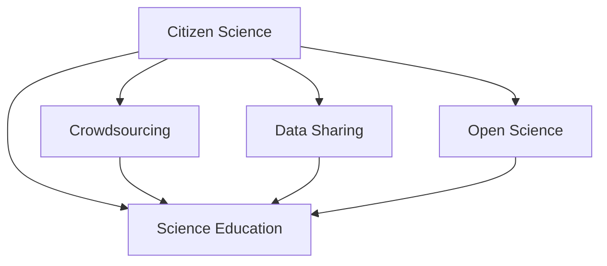

                 

# 公民科学：公众参与科学研究的新模式

## 1. 背景介绍

### 1.1 问题由来

随着科技的飞速发展，科学研究的领域和复杂度不断增加，传统的科研模式已难以满足日益增长的需求。研究资源的有限性和全球化的科学挑战要求我们寻找新的科学研究模式。公民科学（Citizen Science）是一种公众参与科研的模式，它不仅拓宽了科学研究的边界，也为公众提供了参与科研的机会，增强了公众的科学素养和科技感。

### 1.2 问题核心关键点

公民科学的核心在于利用非专业人士的广泛参与和多样化视角，共同解决复杂的科学问题。这种模式使得科学研究的范围和深度得到了极大的拓展，同时也为公众提供了直接参与和了解科学的机会，提升了科学教育和科学普及的普及程度。

### 1.3 问题研究意义

公民科学的研究意义在于其能够调动公众的积极性，利用分布式计算和数据收集的能力，加速科学研究进程，同时提升公众的科学素养和参与感，对于推动科学研究向更开放、更协作的方向发展具有重要的推动作用。

## 2. 核心概念与联系

### 2.1 核心概念概述

为更好地理解公民科学的模式和机制，本节将介绍几个密切相关的核心概念：

- 公民科学（Citizen Science）：公众参与科研的一种模式，让非专业人士在科研过程中发挥作用，获取科学数据和观察结果。
- 众包（Crowdsourcing）：通过网络平台收集和利用大众的劳动力或知识，以较低成本实现大规模数据处理和分析。
- 数据共享（Data Sharing）：科研机构或项目团队将数据公开分享，供其他研究者使用，以推动科学研究的透明度和协作性。
- 开放科学（Open Science）：科研流程的透明化、数据开放、科研成果的共享和再利用，提升科学研究的公信力和影响力。
- 科学教育（Science Education）：通过各种教育手段和平台，提升公众的科学素养和参与科研的能力。

这些核心概念共同构成了公民科学的理论框架，提供了研究工具和实践指导，使公众能够有效参与科学研究的各个环节。

### 2.2 核心概念原理和架构的 Mermaid 流程图



这个流程图展示了公民科学与相关概念之间的逻辑关系：

1. 公民科学通过众包获取数据，通过数据共享提升透明度，并通过开放科学促进知识传播和合作。
2. 公民科学在提高公众科学素养的同时，也为科学教育提供了实践平台和素材。
3. 公民科学与科研、教育、数据共享和开放科学等多方面密切联系，形成了一个闭环的研究和普及体系。

## 3. 核心算法原理 & 具体操作步骤
### 3.1 算法原理概述

公民科学的核心算法原理主要基于数据驱动和网络协作的理念，通过以下几个步骤实现公众参与科研：

1. **任务分解与设计**：将科研任务细分为可执行的小任务，设计合适的数据收集和分析流程。
2. **任务分发**：通过网络平台将任务分发给志愿者，并提供必要的工具和指导。
3. **数据提交与审核**：志愿者提交数据和观察结果，科研团队进行审核和反馈。
4. **数据分析与发布**：对收集到的数据进行综合分析，将结果发布在开放平台上。
5. **知识共享与传播**：通过开放科学的方式，将研究过程和结果分享至全球科研界。

### 3.2 算法步骤详解

以下是公民科学的基本操作步骤：

1. **任务选择与设计**：
   - 确定研究目标和科研任务，如生物多样性监测、天气数据收集等。
   - 设计具体的任务和执行方案，如使用何种设备、记录哪些数据、如何提交结果等。

2. **任务分发与执行**：
   - 选择合适的平台（如Zooniverse、Citizen Science Project等），发布任务和所需材料。
   - 通过邮件、社交媒体等方式通知公众参与，提供详细的任务说明和操作指南。
   - 设置激励机制，如奖励、证书、科普知识等，吸引公众参与。

3. **数据收集与提交**：
   - 志愿者使用指定设备和方法收集数据，如拍照、观察、记录等。
   - 志愿者在线提交数据和观察结果，并通过平台提供的工具进行验证和修正。

4. **数据审核与反馈**：
   - 科研团队对志愿者提交的数据进行审核，确保数据的准确性和完整性。
   - 提供反馈和建议，对存在的问题进行纠正和改进。

5. **数据分析与发布**：
   - 对收集到的数据进行统计分析，得出研究结论。
   - 将研究结果和数据集公开分享，供其他研究者复现和使用。

6. **知识传播与教育**：
   - 通过开放科学平台（如ResearchGate、arXiv等），将研究结果公开发布。
   - 利用科普文章、视频、讲座等形式，普及科学知识，提高公众科学素养。

### 3.3 算法优缺点

公民科学具有以下优点：

- **广泛性**：利用大众的智慧和劳动力，可以覆盖更多地域和时间，获取海量数据。
- **低成本**：众包方式降低了传统科研中设备和人力成本，提高了科研效率。
- **公众参与**：提升了公众的科学素养和科研兴趣，推动了科学教育。
- **透明性**：开放的数据和研究过程增强了科研的可信度和透明度。

同时，公民科学也存在以下缺点：

- **数据质量参差不齐**：志愿者数据的准确性和一致性可能较差，需要科研团队进行大量审核工作。
- **激励机制不够完善**：缺乏持续有效的激励机制，可能导致志愿者流失。
- **研究结果受限于参与者**：结果可能受公众参与度的影响，质量受限。
- **科研目标和流程设计复杂**：需要精心设计任务，确保任务的可行性和可执行性。

### 3.4 算法应用领域

公民科学的应用领域广泛，涵盖自然科学、社会科学等多个学科。具体应用包括但不限于：

- 环境监测：如生物多样性调查、气候变化监测等。通过公众参与收集环境数据，提升监测精度。
- 天文学：如星系观测、天体物理数据记录等。利用天文爱好者的望远镜收集数据，扩大观测覆盖。
- 社会科学：如城市交通流量统计、犯罪数据记录等。通过公众参与收集社会科学数据，提升研究广度和深度。
- 公共健康：如传染病传播监测、疫苗效果评估等。利用社区健康志愿者收集数据，提升公共卫生应对能力。

这些应用表明，公民科学不仅在科学研究中有着广泛的应用，也为社会公共管理提供了新的手段和视角。

## 4. 数学模型和公式 & 详细讲解 & 举例说明
### 4.1 数学模型构建

假设某公民科学项目收集到 $N$ 个数据点 $(x_1, y_1), (x_2, y_2), \ldots, (x_N, y_N)$，其中 $x$ 是观测数据，$y$ 是分类标签。模型的目标是建立一个分类器 $f(x)$，使得 $f(x)$ 能够根据观测数据 $x$ 预测出相应的分类标签 $y$。

### 4.2 公式推导过程

假设使用随机森林（Random Forest）作为分类器，模型的目标是最小化预测误差：

$$
\min_{f} \sum_{i=1}^N \mathbf{1}_{y_i \neq f(x_i)}
$$

其中 $\mathbf{1}_{y_i \neq f(x_i)}$ 为0-1损失函数，表示预测错误时的损失值。

### 4.3 案例分析与讲解

以生物多样性监测项目为例，该项目收集了志愿者在自然保护区观察到的鸟类物种数据。通过对这些数据进行统计分析，可以得出该区域内鸟类的分布情况和种类变化趋势。

具体步骤如下：

1. **数据准备**：
   - 收集志愿者记录的鸟类观测数据，如鸟类名称、数量、出现频率等。
   - 进行数据清洗，去除噪声和异常值，确保数据的准确性。

2. **模型选择**：
   - 选择随机森林作为分类模型，以处理高维数据和样本不平衡问题。
   - 确定模型参数，如树的数量、树的深度等，以确保模型性能。

3. **训练与验证**：
   - 使用部分数据作为训练集，剩余数据作为验证集，评估模型的预测准确率。
   - 根据验证集的结果，调整模型参数，优化模型性能。

4. **结果发布与分享**：
   - 将模型训练结果和鸟类数据公开分享，供其他研究者使用。
   - 撰写科普文章，向公众普及生物多样性保护知识。

## 5. 项目实践：代码实例和详细解释说明
### 5.1 开发环境搭建

以下是使用Python进行Crowdsourcing项目开发的开发环境配置流程：

1. 安装Anaconda：从官网下载并安装Anaconda，用于创建独立的Python环境。

2. 创建并激活虚拟环境：
```bash
conda create -n crowdsourcing python=3.8 
conda activate crowdsourcing
```

3. 安装相关库：
```bash
conda install pandas numpy matplotlib plotly
```

完成上述步骤后，即可在`crowdsourcing-env`环境中开始开发。

### 5.2 源代码详细实现

以下是使用Plotly库展示公众参与数据的示例代码：

```python
import plotly.express as px
import pandas as pd

# 读取数据
data = pd.read_csv('data.csv')

# 数据清洗
data = data.dropna()

# 数据可视化
fig = px.histogram(data, x='bird_species', color='observation_date')
fig.show()
```

该代码使用了Plotly库进行数据可视化，展示不同鸟类在不同日期的观测次数。

### 5.3 代码解读与分析

代码主要实现了以下功能：

- **数据读取**：使用Pandas库读取CSV格式的数据文件。
- **数据清洗**：通过dropna方法去除缺失数据。
- **数据可视化**：使用Plotly库绘制不同鸟类在不同日期的观测次数的直方图。

## 6. 实际应用场景
### 6.1 环境监测

以生物多样性监测为例，公民科学项目可以通过志愿者在自然保护区内的鸟类观测数据，实时监测区域内的鸟类分布情况和变化趋势。这些数据对于保护区的管理和生物多样性研究具有重要意义。

### 6.2 公共健康

在公共卫生领域，公民科学项目可以收集志愿者在社区内对传染病传播的观察数据，实时监测疫情动态，辅助公共卫生决策。例如，通过社区健康志愿者记录家庭成员的健康状况和疫苗接种情况，可以及时发现潜在风险和传染病扩散趋势。

### 6.3 天文学

天文学领域的公民科学项目，如Galaxy Zoo，利用志愿者对遥远星系图像的分类和标注，帮助天文学家识别和分类不同类别的星系，提高天文学研究的精度和效率。

### 6.4 未来应用展望

未来，公民科学在科学研究中的应用将更加广泛和深入，其发展趋势主要体现在以下几个方面：

1. **跨学科融合**：公民科学将与更多学科领域交叉融合，如地质学、气象学等，提供更丰富的科学数据和研究视角。
2. **数据质量提升**：随着参与者技术水平的提高和工具的优化，数据的质量和一致性将逐步提升，减少人工审核的负担。
3. **激励机制创新**：更加多样化的激励机制，如科研机会、学术认可等，将吸引更多公众参与。
4. **开放平台建设**：建立更多开放平台，提供标准化的数据接口和协作工具，提高科研合作效率。

## 7. 工具和资源推荐
### 7.1 学习资源推荐

为了帮助开发者系统掌握公民科学的模式和机制，这里推荐一些优质的学习资源：

1. 《Crowdsourcing for Science》书籍：介绍公民科学的理论基础、实际案例和应用策略，适合研究者和项目管理者阅读。

2. Zooniverse平台：提供丰富的公众科学项目，涵盖环境监测、天文学、社会科学等多个领域，是实践和了解公民科学的最佳平台。

3. Ecosphere项目：由全球环境监测网络支持的公民科学项目，专注于生物多样性监测和生态系统研究，是参与环境科学研究的理想平台。

4. SciStarter网站：提供大量的公众科学项目，涵盖各类科学研究，适合新手快速入门。

通过这些资源的学习实践，相信你一定能够系统掌握公民科学的模式和机制，并用于解决实际的科学问题。

### 7.2 开发工具推荐

高效的开发离不开优秀的工具支持。以下是几款用于公民科学开发的常用工具：

1. Plotly：用于数据可视化的开源库，支持Python、R等多种语言，适合公众科学数据展示和分析。
2. Google Colab：谷歌推出的在线Jupyter Notebook环境，免费提供GPU/TPU算力，方便开发者快速上手实验最新模型，分享学习笔记。
3. Open Science Framework（OSF）：开放科学项目管理和数据共享平台，提供项目协作和成果发布功能。
4. GitHub：代码托管和版本控制平台，支持团队协作和开源代码共享。
5. Zotero：文献管理和引用工具，方便研究者管理和引用公开的科学论文。

合理利用这些工具，可以显著提升公民科学项目的开发效率，加快创新迭代的步伐。

### 7.3 相关论文推荐

公民科学的研究方向已经涉及诸多领域，以下是几篇奠基性的相关论文，推荐阅读：

1. Emmert et al. (2007)《Crowdsourcing the Science of Citizen Science》：介绍了公民科学的概念、应用和发展历程。
2. Sixsmith et al. (2011)《Crowdsourcing in Ecology and Evolutionary Biology》：探讨了公民科学在生态学和进化生物学中的应用和前景。
3. Bonney et al. (2010)《Crowdsourcing in Biological and Environmental Science》：总结了公民科学在生物和环境科学中的应用实例和效果。
4. Müller et al. (2018)《Crowdsourcing for Science: A Survey》：对公民科学的方法、工具和挑战进行了全面综述。
5. Pascual et al. (2014)《Crowdsourcing to Combat Cholera in Africa》：展示了一个利用公民科学对抗非洲霍乱的成功案例，具有现实意义。

这些论文代表了大科学时代公民科学的发展脉络。通过学习这些前沿成果，可以帮助研究者把握学科前进方向，激发更多的创新灵感。

## 8. 总结：未来发展趋势与挑战
### 8.1 总结

本文对公民科学的模式和机制进行了全面系统的介绍。首先阐述了公民科学的背景和研究意义，明确了公民科学在提升公众参与和科学普及方面的重要价值。其次，从理论到实践，详细讲解了公民科学的基本操作步骤和关键技术，给出了具体项目开发的完整代码实例。同时，本文还广泛探讨了公民科学在环境监测、公共健康、天文学等多个领域的应用前景，展示了公民科学的广泛应用和巨大潜力。

通过本文的系统梳理，可以看到，公民科学为公众参与科研提供了新模式，极大地拓展了科研的边界，加速了科学研究的进程，同时也推动了科学教育和公众科学素养的提升。公民科学的研究方向还将随着科技的发展和社会的进步而不断拓展，为科学研究和技术进步注入新的活力。

### 8.2 未来发展趋势

展望未来，公民科学的趋势将呈现以下几个方向：

1. **数据驱动**：更多依赖数据驱动和机器学习算法，提高数据分析的精度和效率。
2. **跨领域合作**：公民科学将与更多学科领域交叉融合，提供更丰富的科学数据和研究视角。
3. **激励机制创新**：建立多样化的激励机制，吸引更多公众参与，提升数据质量和研究效果。
4. **开放平台建设**：建立更多开放平台，提供标准化的数据接口和协作工具，提高科研合作效率。
5. **知识共享与传播**：通过开放科学平台，促进知识共享和传播，提升科研透明度和公信力。

这些趋势将使公民科学进入更加成熟和规范的发展阶段，为科学研究和技术应用注入新的活力。

### 8.3 面临的挑战

尽管公民科学在科学研究中具有重要的应用价值，但在实际应用中也面临诸多挑战：

1. **数据质量控制**：数据质量参差不齐，需要科研团队进行大量审核和修正，增加工作量。
2. **激励机制不足**：缺乏持续有效的激励机制，可能导致志愿者流失。
3. **技术门槛**：部分公众参与者可能缺乏必要的技术知识，影响数据收集和分析的准确性。
4. **项目管理**：公民科学项目需要精心设计和组织，确保任务可行性和数据可靠性。

这些挑战需要通过技术创新和项目管理改进加以克服，以充分发挥公民科学的优势，推动科学研究的普及和发展。

### 8.4 研究展望

面对公民科学面临的挑战，未来的研究需要在以下几个方面寻求新的突破：

1. **数据清洗与预处理**：开发更高效的数据清洗和预处理算法，减少人工审核的负担。
2. **算法优化与集成**：引入机器学习算法，优化数据处理和分析流程，提升研究精度。
3. **用户教育与培训**：提供更多的教育和培训资源，提升公众参与者的技术水平和科研兴趣。
4. **项目管理优化**：建立标准化和规范化的项目管理流程，提高项目执行效率。

这些研究方向的探索将引领公民科学向更高层次发展，为公众参与科研提供更广阔的平台和更多的可能性。

## 9. 附录：常见问题与解答

**Q1：公民科学如何与传统科研模式结合？**

A: 公民科学可以作为传统科研的补充，提供大量数据和多样化的视角，帮助科研团队验证和完善研究成果。同时，公民科学项目可以借鉴传统科研的流程和方法，提升项目的科学性和规范性。

**Q2：公民科学在科研中是否存在偏见和误差？**

A: 公民科学项目可能存在参与者偏差和数据误差，需要科研团队进行科学设计和审核。通过多轮审核和数据校验，可以降低误差和偏差的风险，提升研究质量。

**Q3：公民科学如何保护参与者的隐私和数据安全？**

A: 公民科学项目需要确保数据匿名化和加密存储，防止参与者隐私泄露。同时，需要建立严格的数据访问和共享规则，确保数据安全和合规性。

**Q4：公民科学如何应对数据量大、噪声多的情况？**

A: 可以通过数据清洗和预处理，去除噪声和异常值，确保数据的准确性和一致性。同时，引入机器学习算法，提高数据分析和处理的精度。

**Q5：公民科学在实际应用中需要注意哪些问题？**

A: 公民科学需要建立明确的激励机制，确保志愿者的持续参与。同时，需要加强项目管理，确保任务可行性和数据可靠性。此外，还需要对参与者进行教育和培训，提升其科学素养和研究兴趣。

通过不断改进和优化，公民科学必将在科学研究中发挥更大的作用，推动科学技术的普及和发展。总有一天，公民科学将成为科学研究的常态，为人类社会带来更多智慧和进步。

---

作者：禅与计算机程序设计艺术 / Zen and the Art of Computer Programming

