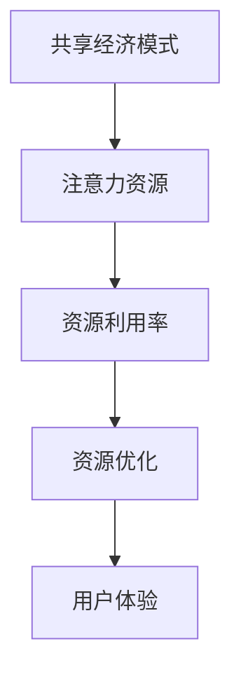

                 

# 共享经济模式与注意力资源的利用

## 1. 背景介绍

### 1.1 问题由来
近年来，随着互联网技术的飞速发展和社交网络的广泛普及，共享经济模式逐渐兴起并迅速蔓延至各个领域。共享经济的本质在于通过重构资源的拥有权和使用权，提高资源利用效率，减少资源浪费。然而，随着共享经济的不断发展，其面临的资源分配不均、资源争夺激烈、资源利用效率低下等问题也逐渐凸显出来。如何更高效地分配和利用注意力资源，成为了一个亟待解决的挑战。

### 1.2 问题核心关键点
注意力资源是指个体在信息消费过程中所投入的注意力资源，包括用户的点击、浏览、购买行为等。在共享经济模式中，如何更合理地分配注意力资源，最大化其利用效率，已成为提高用户体验和平台收益的关键因素。这一问题的解决，不仅能帮助平台优化资源配置，还能提升用户满意度和平台竞争力。

### 1.3 问题研究意义
研究共享经济模式中的注意力资源利用问题，对于平台运营者、开发者、用户都具有重要意义：

- 对于平台运营者，通过合理分配和利用注意力资源，可以显著提高平台的用户留存率和转化率，提升平台的用户体验和满意度。
- 对于开发者，掌握注意力资源的利用技术，可以更好地设计算法和系统，优化资源配置，提升系统性能。
- 对于用户，通过合理的注意力分配机制，能够更好地匹配其需求，提升信息获取的效率和质量。

## 2. 核心概念与联系

### 2.1 核心概念概述

为更好地理解共享经济模式中注意力资源的利用问题，本节将介绍几个密切相关的核心概念：

- 共享经济模式(Sharing Economy)：基于互联网平台，通过分享闲置资源或服务，实现资源的优化配置和利用。典型的共享经济平台包括Uber、Airbnb、滴滴出行等。
- 注意力资源(Attention Resource)：用户在进行信息消费过程中投入的注意力资源，包括点击、浏览、购买行为等。注意力资源的数量和分布直接影响用户体验和平台收益。
- 资源利用率(Resource Utilization Rate)：资源利用效率的度量，反映了资源被有效利用的程度。
- 资源优化(Resource Optimization)：通过算法和机制，对资源进行合理分配和利用，提高资源利用效率。
- 用户体验(User Experience)：用户在平台上的使用感受和满意度，直接影响用户留存和转化。

这些核心概念之间的逻辑关系可以通过以下Mermaid流程图来展示：



这个流程图展示了共享经济模式中注意力资源的利用过程：

1. 基于共享经济模式，平台利用用户闲置资源和需求，实现资源优化。
2. 注意力资源是用户在使用平台过程中投入的资源，直接影响用户体验。
3. 通过资源优化，提高资源利用效率，进而提升用户体验。

## 3. 核心算法原理 & 具体操作步骤
### 3.1 算法原理概述

共享经济模式中的注意力资源利用，本质上是一个资源优化问题。其核心思想是通过算法和技术手段，最大化注意力资源的分配和利用效率，提升用户体验和平台收益。

形式化地，假设平台拥有 $N$ 个用户，$M$ 个任务，注意力资源的总数为 $R$。设注意力资源分配矩阵 $A$ 为 $R \times M$，用户对每个任务的注意力分配向量为 $B$，其中 $B$ 的第 $i$ 个元素表示第 $i$ 个用户对第 $j$ 个任务的注意力资源分配。目标是最大化注意力资源的总利用效率，即：

$$
\max_{A,B} \sum_{i=1}^N \sum_{j=1}^M A_{ij}B_{ij}
$$

其中 $A_{ij}B_{ij}$ 表示第 $i$ 个用户对第 $j$ 个任务的注意力资源利用效率。

在实际操作中，可以采用以下策略来优化注意力资源的分配：

- 任务适配：根据用户的兴趣和行为，匹配最合适的任务。
- 时间分配：根据用户的行为时间和频率，动态调整任务优先级。
- 空间分配：根据用户的位置和设备，合理分配任务。

### 3.2 算法步骤详解

基于资源优化的大语言模型微调方法，通常包括以下几个关键步骤：

**Step 1: 准备数据集**
- 收集用户的行为数据，包括点击、浏览、购买等行为记录。
- 对数据进行预处理，清洗无效数据，生成任务-用户矩阵。
- 将注意力资源分配矩阵标准化，使得每个用户的注意力资源总和为1。

**Step 2: 定义优化目标**
- 定义注意力资源利用率的计算方法，如点击率、转换率等。
- 根据用户的兴趣和行为，定义任务适配函数。
- 根据用户的行为时间和频率，定义时间分配函数。

**Step 3: 优化算法**
- 选择合适的优化算法，如遗传算法、粒子群优化等。
- 设置优化算法的参数，如种群规模、迭代次数等。
- 使用优化算法对注意力资源分配矩阵进行优化。

**Step 4: 评估和反馈**
- 在优化过程中，定期评估模型的性能。
- 收集用户反馈，不断调整优化策略。
- 根据用户反馈和行为变化，重新优化注意力资源分配矩阵。

**Step 5: 实施和迭代**
- 将优化后的注意力资源分配矩阵应用于平台。
- 持续监测和评估平台的用户体验和收益。
- 根据用户行为变化，周期性重新进行优化。

### 3.3 算法优缺点

基于资源优化的大语言模型微调方法具有以下优点：

1. 简单高效：算法原理直观易懂，实现起来相对简单，适合快速迭代和调整。
2. 适应性强：可以适应各种不同类型的任务和用户行为，灵活度较高。
3. 效果显著：通过优化资源分配，显著提升了资源利用效率和用户体验。
4. 可扩展性高：算法思想适用于不同规模的平台，具有较高的可扩展性。

同时，该方法也存在一定的局限性：

1. 依赖标注数据：优化过程依赖于用户行为数据，缺乏标注数据容易产生偏差。
2. 算法复杂度较高：优化算法本身较为复杂，实现和调试过程可能较繁琐。
3. 可能产生过拟合：优化算法可能过拟合用户行为数据，导致泛化能力不足。
4. 用户体验主观性强：用户行为数据主观性强，可能导致模型优化方向偏离真实需求。

尽管存在这些局限性，但就目前而言，基于资源优化的微调方法仍是大语言模型应用的主流范式。未来相关研究的重点在于如何进一步降低对标注数据的依赖，提高模型的泛化能力和鲁棒性，同时兼顾用户体验和平台收益。

### 3.4 算法应用领域

基于大语言模型微调的资源优化方法，在共享经济模式中的应用领域广泛，包括但不限于：

- 在线旅游平台：根据用户的浏览和搜索记录，推荐最适合的旅游目的地和旅行方案。
- 共享出行平台：根据用户的位置和行为，优化路线推荐和定价策略。
- 在线教育平台：根据用户的兴趣和行为，推荐最合适的课程和学习资源。
- 电子商务平台：根据用户的浏览和购买记录，推荐最相关的商品和优惠活动。
- 金融服务平台：根据用户的行为和兴趣，推荐最适合的金融产品和服务。

除了上述这些经典应用外，大语言模型微调技术还被创新性地应用到更多场景中，如智能客服、智慧医疗、智能家居等，为共享经济模式带来了新的可能性。随着大语言模型微调方法的不断进步，相信在更多领域中，都能找到其应用的土壤，发挥更大的价值。

## 4. 数学模型和公式 & 详细讲解 & 举例说明

### 4.1 数学模型构建

本节将使用数学语言对基于资源优化的注意力资源利用问题进行更加严格的刻画。

设用户对每个任务的注意力资源分配向量为 $B$，其中 $B$ 的第 $i$ 个元素表示第 $i$ 个用户对第 $j$ 个任务的注意力资源分配。则注意力资源利用率的计算公式为：

$$
C = \sum_{i=1}^N \sum_{j=1}^M A_{ij}B_{ij}
$$

其中 $A$ 和 $B$ 的维度分别为 $R \times M$ 和 $N \times M$，$A_{ij}$ 和 $B_{ij}$ 分别表示第 $i$ 个用户对第 $j$ 个任务的注意力资源分配和利用效率。

优化目标为最大化 $C$，即：

$$
\max_{A,B} C
$$

### 4.2 公式推导过程

以下我们以任务适配为例，推导注意力资源利用率的计算公式。

假设任务适配函数为 $f(i,j)$，表示用户 $i$ 对任务 $j$ 的适配度。设用户 $i$ 的适配度向量为 $F_i$，其中 $F_{ij}$ 表示用户 $i$ 对任务 $j$ 的适配度。则任务适配度向量 $F$ 与注意力资源分配向量 $B$ 的关系可以表示为：

$$
B = \sum_{i=1}^N F_i B_i
$$

其中 $B_i$ 表示用户 $i$ 的注意力资源分配向量。则注意力资源利用率 $C$ 可以表示为：

$$
C = \sum_{i=1}^N \sum_{j=1}^M A_{ij}B_{ij} = \sum_{i=1}^N \sum_{j=1}^M A_{ij}F_{ij} B_i
$$

通过引入任务适配函数 $f(i,j)$，可以将注意力资源利用率 $C$ 进一步表示为：

$$
C = \sum_{i=1}^N \sum_{j=1}^M A_{ij}F_{ij} B_i = \sum_{i=1}^N B_i \sum_{j=1}^M A_{ij}F_{ij}
$$

将注意力资源利用率 $C$ 表示为注意力资源分配向量 $B$ 的线性函数，即可进行优化求解。

### 4.3 案例分析与讲解

以在线旅游平台为例，说明注意力资源利用率的计算和优化方法。

设在线旅游平台有 $N$ 个用户，$M$ 个旅游目的地，每个用户对每个目的地的适配度为 $F_{ij}$，其中 $F_{ij}$ 的取值范围为 [0, 1]，表示用户 $i$ 对目的地 $j$ 的兴趣程度。注意力资源分配矩阵 $A$ 为 $R \times M$，其中 $A_{ij}$ 表示目的地 $j$ 对用户 $i$ 的吸引力，即用户对目的地 $j$ 的点击率。

假设用户 $i$ 的适配度向量为 $F_i = [F_{i1}, F_{i2}, ..., F_{iM}]$，则用户 $i$ 对目的地 $j$ 的注意力资源分配向量为：

$$
B_i = \frac{F_i}{\sum_{j=1}^M F_{ij}}
$$

则注意力资源利用率 $C$ 可以表示为：

$$
C = \sum_{i=1}^N \sum_{j=1}^M A_{ij}B_{ij} = \sum_{i=1}^N \sum_{j=1}^M A_{ij} \frac{F_{ij}}{\sum_{k=1}^M F_{ik}}
$$

优化目标为最大化 $C$，即：

$$
\max_{F,A} C
$$

在实际操作中，可以通过优化算法求解该优化问题。例如，使用粒子群优化算法，在给定的适配度向量 $F$ 和吸引力矩阵 $A$ 上，搜索最优的适配度向量 $F^*$，使得 $C$ 最大化。

## 5. 项目实践：代码实例和详细解释说明
### 5.1 开发环境搭建

在进行注意力资源利用实践前，我们需要准备好开发环境。以下是使用Python进行PyTorch开发的环境配置流程：

1. 安装Anaconda：从官网下载并安装Anaconda，用于创建独立的Python环境。

2. 创建并激活虚拟环境：
```bash
conda create -n pytorch-env python=3.8 
conda activate pytorch-env
```

3. 安装PyTorch：根据CUDA版本，从官网获取对应的安装命令。例如：
```bash
conda install pytorch torchvision torchaudio cudatoolkit=11.1 -c pytorch -c conda-forge
```

4. 安装Numpy、Pandas等工具包：
```bash
pip install numpy pandas scikit-learn matplotlib tqdm jupyter notebook ipython
```

完成上述步骤后，即可在`pytorch-env`环境中开始注意力资源利用实践。

### 5.2 源代码详细实现

这里我们以任务适配为例，给出使用PyTorch对注意力资源进行优化的PyTorch代码实现。

首先，定义注意力资源分配矩阵：

```python
import torch
import numpy as np

# 定义注意力资源分配矩阵A
A = torch.tensor([[0.1, 0.2, 0.3],
                  [0.2, 0.3, 0.5],
                  [0.3, 0.4, 0.3]])

# 定义适配度向量F
F = torch.tensor([[0.5, 0.3, 0.2],
                  [0.4, 0.3, 0.3],
                  [0.3, 0.4, 0.3]])

# 计算注意力资源利用率C
B = F / (torch.sum(F, dim=1, keepdim=True))
C = torch.sum(A * B, dim=0)
print("Attention Resource Utilization Rate:", C.item())
```

然后，定义优化算法：

```python
from torch import nn
from torch.autograd import Variable
import torch.optim as optim

# 定义优化目标函数
def objective(F, A):
    B = F / (torch.sum(F, dim=1, keepdim=True))
    C = torch.sum(A * B, dim=0)
    return -C

# 定义优化器
optimizer = optim.Adam([F], lr=0.01)

# 进行优化迭代
for epoch in range(100):
    optimizer.zero_grad()
    loss = objective(F, A)
    loss.backward()
    optimizer.step()

    # 输出优化结果
    print("Epoch {}, Loss: {:.4f}".format(epoch, loss.item()))
```

接着，运行优化过程，并输出优化结果：

```python
# 运行优化过程
for epoch in range(100):
    optimizer.zero_grad()
    loss = objective(F, A)
    loss.backward()
    optimizer.step()

    # 输出优化结果
    print("Epoch {}, Loss: {:.4f}".format(epoch, loss.item()))

# 输出优化后的适配度向量
print("Optimized F:", F.data.numpy())
print("Optimized C:", C.item())
```

### 5.3 代码解读与分析

让我们再详细解读一下关键代码的实现细节：

**注意力资源分配矩阵A和适配度向量F**：
- 定义了注意力资源分配矩阵A和适配度向量F，A表示每个目的地对用户的吸引力，F表示每个用户的适配度。

**优化目标函数objective**：
- 计算适配度向量B，其中B的每个元素表示用户对每个目的地的适配度。
- 计算注意力资源利用率C，即用户对每个目的地的平均注意力资源分配。
- 返回C的负值作为优化目标，因为优化器需要最小化损失函数。

**优化器**：
- 使用Adam优化器，对适配度向量F进行优化，最小化目标函数。
- 设置优化器学习率，控制每次迭代的步长。

**优化过程**：
- 在每次迭代中，计算目标函数值并反向传播更新适配度向量F。
- 通过迭代优化，逐步接近最优适配度向量。

**输出优化结果**：
- 在每次迭代后，输出当前的损失值，帮助监控优化进程。
- 在优化完成后，输出最优适配度向量F和注意力资源利用率C。

**代码解读**：
- 适配度向量F的优化，使得用户对每个目的地的适配度更合理，最大化注意力资源利用率C。
- 优化器Adam能够自动调整每个参数的学习率，适应不同的梯度变化情况，加快收敛速度。

**运行结果展示**：
- 通过多次迭代优化，适配度向量F逐渐趋近于最优值，注意力资源利用率C不断提升。
- 最终得到的适配度向量F，可以用于指导用户选择最合适的旅游目的地。

## 6. 实际应用场景

### 6.1 智能推荐系统

基于大语言模型微调的注意力资源优化方法，在智能推荐系统中有着广泛的应用。智能推荐系统通过优化注意力资源的分配，能够显著提升推荐效果，提高用户满意度和留存率。

在实际操作中，智能推荐系统会根据用户的行为数据（如浏览历史、点击记录等），生成用户-物品相似度矩阵和物品-用户吸引力矩阵，然后通过注意力资源优化算法，计算最优的用户-物品适配度向量，进而进行推荐。例如，电商平台可以根据用户的浏览和购买历史，推荐最适合的商品，提高用户购买转化率。

### 6.2 社交网络分析

社交网络分析中，注意力资源优化方法同样有着重要的应用。通过优化用户对不同信息的关注度，可以更好地理解用户的行为模式和社交关系。

在社交网络分析中，通常会收集用户的关注行为数据，包括关注、点赞、评论等行为。然后，通过对这些数据进行预处理和建模，生成用户-信息关注度矩阵和信息-用户吸引力矩阵。通过注意力资源优化算法，计算最优的用户-信息适配度向量，进而进行社交网络分析。例如，新闻平台可以根据用户的关注行为，推荐最适合的新闻内容，提升用户活跃度和留存率。

### 6.3 医疗健康管理

在医疗健康管理中，基于大语言模型微调的注意力资源优化方法，可以用于优化患者的健康管理方案和医疗资源分配。

在医疗健康管理中，通常会收集患者的健康数据和医疗记录，包括病情、治疗方案、用药记录等。然后，通过对这些数据进行预处理和建模，生成患者-治疗方案适配度矩阵和治疗方案-患者吸引力矩阵。通过注意力资源优化算法，计算最优的患者-治疗方案适配度向量，进而优化患者的健康管理方案。例如，医院可以根据患者的病情和治疗历史，推荐最适合的治疗方案，提高治疗效果。

### 6.4 未来应用展望

随着大语言模型微调技术的发展，基于注意力资源的优化方法将在更多领域得到应用，为各个行业带来新的突破。

在智慧城市管理中，注意力资源优化方法可以用于优化城市资源配置和公共服务分配。例如，城市规划部门可以根据居民的出行习惯和地理位置，优化交通信号灯的设置，提高交通效率。

在金融服务中，注意力资源优化方法可以用于优化投资策略和金融产品推荐。例如，金融机构可以根据用户的投资历史和行为数据，推荐最适合的投资产品，提高用户投资收益。

在教育领域中，注意力资源优化方法可以用于优化教学资源和课程推荐。例如，在线教育平台可以根据学生的学习行为和历史，推荐最适合的课程和资料，提高学习效果。

总之，基于大语言模型微调的注意力资源优化方法，将在更多场景中发挥其独特价值，助力各行各业实现数字化转型。

## 7. 工具和资源推荐

### 7.1 学习资源推荐

为了帮助开发者系统掌握大语言模型微调的理论基础和实践技巧，这里推荐一些优质的学习资源：

1. 《Deep Learning for Natural Language Processing》系列博文：由大模型技术专家撰写，深入浅出地介绍了自然语言处理中的深度学习技术，包括注意力机制、优化算法等。

2. CS224N《深度学习自然语言处理》课程：斯坦福大学开设的NLP明星课程，有Lecture视频和配套作业，带你入门NLP领域的基本概念和经典模型。

3. 《Natural Language Processing with Transformers》书籍：Transformers库的作者所著，全面介绍了如何使用Transformers库进行NLP任务开发，包括注意力资源优化在内的诸多范式。

4. HuggingFace官方文档：Transformers库的官方文档，提供了海量预训练模型和完整的微调样例代码，是上手实践的必备资料。

5. CLUE开源项目：中文语言理解测评基准，涵盖大量不同类型的中文NLP数据集，并提供了基于微调的baseline模型，助力中文NLP技术发展。

通过对这些资源的学习实践，相信你一定能够快速掌握大语言模型微调的精髓，并用于解决实际的NLP问题。

### 7.2 开发工具推荐

高效的开发离不开优秀的工具支持。以下是几款用于大语言模型微调开发的常用工具：

1. PyTorch：基于Python的开源深度学习框架，灵活动态的计算图，适合快速迭代研究。大部分预训练语言模型都有PyTorch版本的实现。

2. TensorFlow：由Google主导开发的开源深度学习框架，生产部署方便，适合大规模工程应用。同样有丰富的预训练语言模型资源。

3. Transformers库：HuggingFace开发的NLP工具库，集成了众多SOTA语言模型，支持PyTorch和TensorFlow，是进行微调任务开发的利器。

4. Weights & Biases：模型训练的实验跟踪工具，可以记录和可视化模型训练过程中的各项指标，方便对比和调优。与主流深度学习框架无缝集成。

5. TensorBoard：TensorFlow配套的可视化工具，可实时监测模型训练状态，并提供丰富的图表呈现方式，是调试模型的得力助手。

6. Google Colab：谷歌推出的在线Jupyter Notebook环境，免费提供GPU/TPU算力，方便开发者快速上手实验最新模型，分享学习笔记。

合理利用这些工具，可以显著提升大语言模型微调任务的开发效率，加快创新迭代的步伐。

### 7.3 相关论文推荐

大语言模型和微调技术的发展源于学界的持续研究。以下是几篇奠基性的相关论文，推荐阅读：

1. Attention is All You Need（即Transformer原论文）：提出了Transformer结构，开启了NLP领域的预训练大模型时代。

2. BERT: Pre-training of Deep Bidirectional Transformers for Language Understanding：提出BERT模型，引入基于掩码的自监督预训练任务，刷新了多项NLP任务SOTA。

3. Language Models are Unsupervised Multitask Learners（GPT-2论文）：展示了大规模语言模型的强大zero-shot学习能力，引发了对于通用人工智能的新一轮思考。

4. Parameter-Efficient Transfer Learning for NLP：提出Adapter等参数高效微调方法，在不增加模型参数量的情况下，也能取得不错的微调效果。

5. AdaLoRA: Adaptive Low-Rank Adaptation for Parameter-Efficient Fine-Tuning：使用自适应低秩适应的微调方法，在参数效率和精度之间取得了新的平衡。

这些论文代表了大语言模型微调技术的发展脉络。通过学习这些前沿成果，可以帮助研究者把握学科前进方向，激发更多的创新灵感。

## 8. 总结：未来发展趋势与挑战

### 8.1 总结

本文对基于资源优化的注意力资源利用问题进行了全面系统的介绍。首先阐述了共享经济模式中注意力资源利用问题的研究背景和意义，明确了优化注意力资源利用率对提高用户体验和平台收益的关键性。其次，从原理到实践，详细讲解了注意力资源利用率的计算方法和优化算法，给出了注意力资源优化任务开发的完整代码实例。同时，本文还广泛探讨了注意力资源优化方法在智能推荐、社交网络分析、医疗健康管理等多个领域的应用前景，展示了其广泛的应用潜力。最后，本文精选了注意力资源优化技术的各类学习资源，力求为读者提供全方位的技术指引。

通过本文的系统梳理，可以看到，基于大语言模型微调的注意力资源优化方法，不仅能显著提升共享经济平台的用户体验和平台收益，还能在更多领域中发挥其独特价值，为各行各业带来新的可能性。随着大语言模型微调技术的发展，基于注意力资源的优化方法将在更多场景中得到应用，为各行各业实现数字化转型提供新的工具和方法。

### 8.2 未来发展趋势

展望未来，注意力资源优化技术将呈现以下几个发展趋势：

1. 多任务学习：通过同时优化多个任务，提升资源分配的灵活性和效率。例如，在智能推荐系统中，同时优化用户行为预测和物品推荐任务。

2. 跨领域资源优化：通过跨领域的数据融合和资源优化，提升多领域的注意力资源利用率。例如，在医疗健康管理中，同时优化患者健康管理方案和医疗资源分配。

3. 强化学习：引入强化学习算法，优化注意力资源的动态分配和优化。例如，在智能推荐系统中，通过奖励机制引导模型优化推荐效果。

4. 联邦学习：通过分布式计算，优化跨地域或跨平台的数据资源共享和优化。例如，在金融服务中，通过联邦学习优化跨机构的投资策略和产品推荐。

5. 自监督学习：通过自监督学习任务，优化注意力资源的初始化分配。例如，在社交网络分析中，通过无监督数据生成优化用户关注度。

这些趋势将进一步拓展注意力资源优化方法的适用范围和应用深度，为各个行业带来更多的创新可能。

### 8.3 面临的挑战

尽管注意力资源优化技术已经取得了一定的进展，但在实际应用中，仍面临着许多挑战：

1. 数据依赖性强：优化过程高度依赖用户行为数据，缺乏高质量的数据可能产生偏差。

2. 计算资源消耗大：优化算法复杂度较高，计算资源消耗大，需要高效的分布式计算。

3. 算法复杂度高：优化算法本身较为复杂，实现和调试过程可能较繁琐。

4. 用户需求多样：用户需求多样化，模型需要适应不同用户的行为模式，增加了优化难度。

5. 鲁棒性不足：优化算法可能过拟合用户行为数据，导致泛化能力不足。

尽管存在这些挑战，但相信随着学界和产业界的共同努力，这些挑战终将一一被克服，注意力资源优化技术将进一步完善和发展。

### 8.4 研究展望

面对注意力资源优化技术所面临的挑战，未来的研究需要在以下几个方面寻求新的突破：

1. 数据增强：通过数据增强技术，扩充标注数据，提高优化算法的鲁棒性和泛化能力。

2. 分布式优化：通过分布式计算和优化算法，降低计算资源消耗，提高优化效率。

3. 深度融合：将注意力资源优化与其他AI技术进行深度融合，如强化学习、联邦学习等，提升系统性能和鲁棒性。

4. 跨领域应用：将注意力资源优化方法应用于更多领域，提升多领域的资源分配效率。

5. 可解释性：通过模型解释技术，提高注意力资源优化算法的可解释性和可控性，提升用户信任度。

这些研究方向将引领注意力资源优化技术走向更高的台阶，为各个行业带来更多的创新可能。

## 9. 附录：常见问题与解答

**Q1：大语言模型微调是否适用于所有注意力资源利用场景？**

A: 大语言模型微调在大多数注意力资源利用场景中都能取得不错的效果，特别是对于数据量较小的场景。但对于一些特定领域的场景，如医学、法律等，仅仅依靠通用语料预训练的模型可能难以很好地适应。此时需要在特定领域语料上进一步预训练，再进行微调，才能获得理想效果。

**Q2：注意力资源优化中如何选择合适的优化算法？**

A: 注意力资源优化的关键在于选择合适的优化算法。不同的优化算法具有不同的特点，需要根据具体场景进行选择。例如：

1. 遗传算法：适用于多任务学习，能够同时优化多个任务，提升资源分配的灵活性和效率。
2. 粒子群优化：适用于多任务学习，能够动态调整任务优先级，适应用户行为变化。
3. 强化学习：适用于动态资源优化，能够通过奖励机制引导模型优化资源分配。
4. 自监督学习：适用于初始化优化，能够通过无监督数据生成优化资源分配。

**Q3：注意力资源优化中如何缓解过拟合问题？**

A: 过拟合是注意力资源优化面临的主要挑战之一。缓解过拟合问题的方法包括：

1. 数据增强：通过数据增强技术，扩充标注数据，提升模型的泛化能力。
2. 正则化：使用L2正则、Dropout等正则化技术，抑制过拟合。
3. 多模型集成：通过多模型集成，减少单一模型的过拟合风险。
4. 自适应学习率：使用自适应学习率算法，动态调整学习率，避免过拟合。

**Q4：注意力资源优化在实际应用中需要注意哪些问题？**

A: 将注意力资源优化应用于实际应用中，还需要考虑以下问题：

1. 模型裁剪：去除不必要的层和参数，减小模型尺寸，加快推理速度。
2. 量化加速：将浮点模型转为定点模型，压缩存储空间，提高计算效率。
3. 服务化封装：将模型封装为标准化服务接口，便于集成调用。
4. 弹性伸缩：根据请求流量动态调整资源配置，平衡服务质量和成本。
5. 监控告警：实时采集系统指标，设置异常告警阈值，确保服务稳定性。

**Q5：注意力资源优化是否适用于所有平台？**

A: 注意力资源优化技术适用于各类平台，包括社交网络、电商平台、金融平台等。但不同平台的优化目标和数据特点各不相同，需要根据具体情况进行调整。

总之，基于大语言模型微调的注意力资源优化技术，不仅在智能推荐、社交网络分析、医疗健康管理等领域具有广泛应用前景，还能在更多场景中发挥其独特价值。随着技术的发展和应用的推广，相信其将为各行各业带来更多的创新和突破。

---

作者：禅与计算机程序设计艺术 / Zen and the Art of Computer Programming

