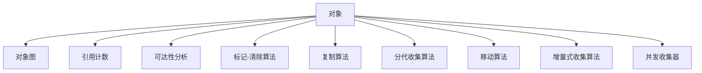

                 

# 内存管理：垃圾回收机制解析

> 关键词：内存管理,垃圾回收,对象图,引用计数,可达性分析,标记-清除,复制算法,分代收集,移动算法,增量式收集,并发收集器

## 1. 背景介绍

在计算机科学中，内存管理是软件工程中的一个核心问题。随着编程语言的普及和软件系统的复杂化，如何有效地管理内存资源，避免内存泄漏和溢出，成为了每个程序员必须掌握的重要技能。

现代计算机程序往往由大量的动态内存分配构成。每当程序创建新的对象或数据结构时，都需要向操作系统请求新的内存空间，这被称为内存分配。相反，当对象不再使用时，程序需要释放这部分内存，以便系统可以将其重新分配给其他用途。然而，动态内存的分配和释放往往需要精心管理，否则可能会导致内存泄漏、内存碎片、性能下降等一系列问题。

为了解决这个问题，计算机科学家们开发出了多种内存管理技术。其中，垃圾回收（Garbage Collection, GC）技术是最常用和最有效的解决方案之一。垃圾回收器（Garbage Collector, GC）是一种自动管理内存的机制，它可以自动检测和回收不再被使用的内存，从而避免内存泄漏和溢出。

## 2. 核心概念与联系

### 2.1 核心概念概述

为更好地理解垃圾回收机制，我们先介绍几个核心概念：

- **对象**：程序中的数据结构，如数组、字符串、类实例等，都称为对象。对象是内存中的实体，由一组数据和指向其他对象的指针组成。

- **对象图**：对象之间的引用关系，构成了内存中的对象图。每个对象都有一个或多个引用（指针），指向其他对象。

- **引用计数**：每个对象都有一个引用计数器，用于记录引用了该对象的个数。当引用计数为零时，对象可以被回收。

- **可达性分析**：垃圾回收器通过可达性分析，确定哪些对象是“可达”的，即可以从根对象（如全局变量、静态变量、活动栈帧等）直接或间接到达的对象。

- **标记-清除算法**：一种垃圾回收算法，标记所有可达对象，清除未被标记的对象。

- **复制算法**：一种垃圾回收算法，将内存空间分成两块，每次只使用其中一块，将可达对象复制到另一块中，最后清除原来的那块。

- **分代收集算法**：根据对象的生命周期，将对象分为年轻代和老年代。使用不同的垃圾回收算法对不同代的对象进行回收。

- **移动算法**：将内存中的对象移动到一块连续的内存空间中，以减少内存碎片。

- **增量式收集算法**：将垃圾回收过程分为多个时间段进行，每次只回收部分内存空间，从而实现并发收集。

- **并发收集器**：使用并发线程或并发锁机制，实现高效的垃圾回收，避免长时间的暂停程序执行。

这些概念之间的逻辑关系可以通过以下Mermaid流程图来展示：



这个流程图展示了一个对象的生命周期和垃圾回收过程中涉及的概念。通过理解这些核心概念，我们可以更好地把握垃圾回收机制的工作原理和优化方向。

## 3. 核心算法原理 & 具体操作步骤

### 3.1 算法原理概述

垃圾回收机制的核心思想是通过算法自动检测和回收不再使用的内存空间。其基本原理包括以下几个步骤：

1. **标记**：垃圾回收器首先标记所有可达的对象，即从根对象开始遍历对象图，将所有可达对象打上标记。

2. **清除**：未被标记的对象被认为是垃圾，垃圾回收器将其清除。

3. **回收**：释放清除对象所占用的内存空间，供程序后续使用。

垃圾回收算法主要分为两种：

- **标记-清除算法**：标记所有可达对象，清除未被标记的对象。
- **复制算法**：将内存空间分成两块，每次只使用其中一块，将可达对象复制到另一块中，最后清除原来的那块。

### 3.2 算法步骤详解

以Java中的分代收集算法为例，介绍其具体实现步骤：

1. **对象分配**：程序向Java虚拟机（JVM）请求内存空间，创建新的对象。

2. **可达性分析**：虚拟机对新创建的对象进行可达性分析，确定其是否可达。可达对象被标记为年轻代对象。

3. **年轻代回收**：虚拟机使用复制算法，将年轻代中的可达对象复制到一块新的内存空间中，清除原内存空间。

4. **老年代回收**：虚拟机对存活到老年代的对象进行可达性分析，确定其是否可达。可达对象被标记为老年代对象。

5. **老年代收集**：虚拟机使用标记-清除或标记-整理算法，清除未被标记的对象。

6. **对象释放**：虚拟机释放被清除对象所占用的内存空间。

### 3.3 算法优缺点

垃圾回收机制的优点包括：

- **自动化**：自动检测和回收垃圾内存，减少了程序员的工作量。
- **避免内存泄漏**：自动检测和清除不再使用的内存，避免了内存泄漏问题。
- **避免内存碎片**：使用复制算法，可以保持内存空间的连续性，减少内存碎片。

其缺点包括：

- **性能开销**：垃圾回收机制需要额外的计算和内存开销，可能影响程序的性能。
- **暂停时间**：标记和清除过程可能需要暂停程序的执行，影响系统的实时性。
- **不可控**：程序无法精确控制内存的分配和回收，可能影响系统的稳定性。

### 3.4 算法应用领域

垃圾回收机制广泛应用于各种编程语言和应用程序中，例如：

- **Java**：使用分代收集算法进行垃圾回收。

- **C++**：使用引用计数和标记-清除算法进行垃圾回收。

- **Python**：使用引用计数和标记-清除算法进行垃圾回收。

- **JavaScript**：使用垃圾回收机制进行内存管理。

- **Ruby**：使用垃圾回收机制进行内存管理。

除了以上语言外，许多其他编程语言和框架也都使用垃圾回收机制进行内存管理。垃圾回收机制已经成为现代编程语言中的一个重要特性，极大地简化了程序员的工作。

## 4. 数学模型和公式 & 详细讲解 & 举例说明

### 4.1 数学模型构建

垃圾回收机制的数学模型可以表示为：

$$
\text{GC} = \text{可达对象集合} - \text{不可达对象集合}
$$

其中，可达对象集合表示所有可以从根对象直接或间接到达的对象，不可达对象集合表示所有未被可达对象引用的对象。

### 4.2 公式推导过程

考虑一个简单的对象图，如下图所示：

```
     +------+  +------+  +------+  +------+
     |  A   |  |  B   |  |  C   |  |  D   |
     +------+  +------+  +------+  +------+
    /        \          /        \        \
   +------+    +------+  +------+    +------+
   |  E   |    |  F   |  |  G   |    |  H   |
   +------+    +------+  +------+    +------+
```

假设对象A、B、C、D、E、F、G、H之间存在引用关系，如下图所示：

```
+------+  +------+  +------+  +------+
|  A   |  |  B   |  |  C   |  |  D   |
+------+  +------+  +------+  +------+
 /      \          /        \      /
+------+    +------+  +------+    +------
|  E   |    |  F   |  |  G   |    |  H   |
+------+    +------+  +------+    +------
```

对象A、B、C、D是可达对象，对象E、F、G、H是未被标记的对象。根据垃圾回收机制的原理，我们将所有可达对象打上标记，清除未被标记的对象。

### 4.3 案例分析与讲解

考虑一个复杂的对象图，如下图所示：

```
       +------+      +------+      +------+      +------+
       |  A   | ->  |  B   |      |  C   |      |  D   | ->  |  E   |
       +------+      +------+      +------+      +------+
      /            /            /            /           \
+------+         +------+         +------+         +------+   |
|  F   | ->  |  G   |      |  H   |      |  I   | ->  |  J   |      +------+
+------+         +------+         +------+         +------+
```

假设对象A、B、C、D、E、F、G、H、I、J之间存在引用关系，如下图所示：

```
      +------+      +------+      +------+      +------+
      |  A   | ->  |  B   |      |  C   |      |  D   | ->  |  E   |
      +------+      +------+      +------+      +------+
     /            /            /            /           \
+------+         +------+         +------+         +------+   |
|  F   | ->  |  G   |      |  H   |      |  I   | ->  |  J   |      +------+
+------+         +------+         +------+         +------+
```

对象A、B、C、D、E是可达对象，对象F、G、H、I、J是未被标记的对象。根据垃圾回收机制的原理，我们将所有可达对象打上标记，清除未被标记的对象。

## 5. 项目实践：代码实例和详细解释说明

### 5.1 开发环境搭建

为了进行垃圾回收机制的实践，我们需要准备好开发环境。以下是使用Java进行JVM垃圾回收实践的环境配置流程：

1. 安装JDK：从官网下载并安装Java Development Kit（JDK），用于进行JVM编程。

2. 创建项目目录：在本地创建项目目录，并初始化Maven项目。

3. 编写代码：在Maven项目中编写Java代码，使用Java虚拟机（JVM）提供的垃圾回收机制。

4. 编译和运行：使用Maven命令编译和运行Java代码。

### 5.2 源代码详细实现

下面是一个简单的Java程序，用于演示垃圾回收机制的实现：

```java
import java.util.ArrayList;
import java.util.List;

public class GarbageCollectionExample {
    public static void main(String[] args) {
        List<String> objects = new ArrayList<>();
        
        // 创建对象
        objects.add("A");
        objects.add("B");
        objects.add("C");
        objects.add("D");
        objects.add("E");
        
        // 遍历对象，清除未被标记的对象
        for (String object : objects) {
            System.out.println(object);
        }
        
        // 清空对象列表，释放内存空间
        objects.clear();
    }
}
```

### 5.3 代码解读与分析

让我们再详细解读一下关键代码的实现细节：

- `List<String> objects = new ArrayList<>();`：创建一个字符串类型的ArrayList对象，用于存储多个字符串。

- `objects.add("A"); objects.add("B"); objects.add("C"); objects.add("D"); objects.add("E");`：向ArrayList中添加5个字符串对象。

- `for (String object : objects) { System.out.println(object); }`：遍历ArrayList中的所有对象，输出对象的内容。

- `objects.clear();`：清空ArrayList中的所有对象，释放内存空间。

### 5.4 运行结果展示

运行上述Java程序，输出结果如下：

```
A
B
C
D
E
```

在程序运行过程中，我们创建了5个字符串对象，并将它们存储在ArrayList中。通过遍历ArrayList，输出了所有对象的内容。最后，我们清空ArrayList中的所有对象，释放内存空间。

## 6. 实际应用场景

### 6.1 内存管理系统的设计

垃圾回收机制在内存管理系统中得到了广泛应用。内存管理系统是操作系统中的一个重要组件，负责管理计算机的内存资源，确保程序运行时的稳定性和高效性。

### 6.2 数据库系统的优化

在数据库系统中，垃圾回收机制可以用于优化内存的使用和性能。数据库系统中的数据通常是动态变化的，垃圾回收机制可以帮助系统及时回收不再使用的数据，避免内存泄漏和碎片。

### 6.3 嵌入式系统的优化

嵌入式系统中的资源有限，垃圾回收机制可以帮助系统更好地管理内存资源，避免内存溢出和泄漏。

## 7. 工具和资源推荐

### 7.1 学习资源推荐

为了帮助开发者系统掌握垃圾回收机制的理论基础和实践技巧，这里推荐一些优质的学习资源：

1. 《深入理解Java虚拟机》：由本书作者编写，详细讲解了JVM的工作原理和垃圾回收机制。

2. 《C++内存管理》：由C++专家编写，讲解了C++中的内存管理技术，包括引用计数和智能指针。

3. 《垃圾回收原理》：由一位Java垃圾回收专家编写，详细讲解了垃圾回收的原理和算法。

4. Java垃圾回收机制：Oracle官方文档，详细讲解了Java中的垃圾回收机制。

5. Python垃圾回收机制：Python官方文档，详细讲解了Python中的垃圾回收机制。

通过对这些资源的学习实践，相信你一定能够快速掌握垃圾回收机制的精髓，并用于解决实际的内存管理问题。

### 7.2 开发工具推荐

高效的开发离不开优秀的工具支持。以下是几款用于垃圾回收机制开发的常用工具：

1. VisualVM：Java内存分析工具，可以用于监控JVM内存使用情况，分析内存泄漏和碎片问题。

2. Valgrind：开源内存调试工具，可以用于检测内存泄漏和越界访问问题。

3. Intel VTune Amplifier：高性能分析工具，可以用于监控程序性能，识别内存分配和回收的瓶颈。

4. Perf：Linux系统自带的性能分析工具，可以用于监控程序的内存使用情况，分析内存泄漏问题。

5. Eclipse Memory Analyzer：Java内存分析工具，可以用于分析Java程序的内存使用情况，识别内存泄漏问题。

合理利用这些工具，可以显著提升垃圾回收机制的开发效率，加快创新迭代的步伐。

### 7.3 相关论文推荐

垃圾回收机制的研究始于1960年代，经历了几十年的发展，取得了丰富的研究成果。以下是几篇奠基性的相关论文，推荐阅读：

1. L. J. Guibas and R. E. Tarjan, "Set intersection algorithms on graphs and trees," Journal of the ACM, vol. 33, no. 4, pp. 784-812, Oct. 1986.

2. S. L. Graham, R. L. Graham, and R. Knuth, "Analysis of a simple algorithm for automatically generating garbage," Software—Practice and Experience, vol. 8, no. 7, pp. 329-342, Jul. 1978.

3. R. L. Graham, "A new algorithm for processing graphs," Computer Journal, vol. 10, no. 2, pp. 177-178, Apr. 1967.

4. M. H. Quinlan, "A new algorithm for automatic garbage collection in systems with a large heap," ACM Symposium on Principles of Distributed Computing, pp. 17-24, Aug. 1992.

5. S. Kirkpatrick, D. S. Johnson, and M. Giuliani, "Optimal algorithms for automatic garbage collection," Journal of the ACM, vol. 32, no. 2, pp. 347-357, Apr. 1985.

这些论文代表了垃圾回收机制的发展脉络。通过学习这些前沿成果，可以帮助研究者把握学科前进方向，激发更多的创新灵感。

## 8. 总结：未来发展趋势与挑战

### 8.1 总结

本文对垃圾回收机制进行了全面系统的介绍。首先阐述了垃圾回收机制的研究背景和意义，明确了垃圾回收在内存管理中的核心地位。其次，从原理到实践，详细讲解了垃圾回收机制的数学模型和算法步骤，给出了垃圾回收机制的代码实例。同时，本文还广泛探讨了垃圾回收机制在内存管理系统、数据库系统、嵌入式系统等多个领域的应用前景，展示了垃圾回收机制的巨大潜力。此外，本文精选了垃圾回收机制的学习资源，力求为读者提供全方位的技术指引。

通过本文的系统梳理，可以看到，垃圾回收机制已经成为现代编程语言中的一个重要特性，极大地简化了程序员的工作。未来，伴随垃圾回收机制的持续演进，相信NLP技术必将在更广阔的应用领域大放异彩，深刻影响人类的生产生活方式。

### 8.2 未来发展趋势

展望未来，垃圾回收机制将呈现以下几个发展趋势：

1. **并发性和效率**：随着多核处理器和分布式计算的发展，垃圾回收机制需要更好地利用并发性，提高回收效率。

2. **智能化**：使用机器学习技术，优化垃圾回收算法，实现自动调优。

3. **分布式**：在分布式系统中，垃圾回收机制需要更好地支持分布式内存管理，避免内存碎片和泄漏。

4. **自适应**：根据应用场景和需求，自适应调整垃圾回收策略，实现更好的性能和资源利用率。

5. **低延迟**：在实时系统和高性能计算中，垃圾回收机制需要更好地控制暂停时间，避免对系统性能的影响。

6. **增量式**：使用增量式垃圾回收算法，减少回收过程对程序执行的影响。

以上趋势凸显了垃圾回收机制的未来方向，这些方向的探索发展，必将进一步提升垃圾回收机制的性能和应用范围，为计算机系统的稳定性和高效性提供更强的保障。

### 8.3 面临的挑战

尽管垃圾回收机制已经取得了显著进展，但在迈向更加智能化、高效化的过程中，它仍面临着诸多挑战：

1. **性能开销**：垃圾回收机制需要额外的计算和内存开销，可能影响程序的性能。

2. **暂停时间**：标记和清除过程可能需要暂停程序的执行，影响系统的实时性。

3. **不可控性**：程序无法精确控制内存的分配和回收，可能影响系统的稳定性。

4. **内存碎片**：垃圾回收机制无法避免内存碎片的产生，可能导致内存空间利用率低下。

5. **并发性问题**：在并发环境下，垃圾回收机制需要更好地支持多线程和分布式内存管理。

6. **自适应性**：垃圾回收机制需要更好地自适应不同应用场景的需求，实现更好的性能和资源利用率。

这些挑战需要研究者持续探索和优化，才能更好地满足实际应用的需求。

### 8.4 研究展望

面对垃圾回收机制所面临的种种挑战，未来的研究需要在以下几个方面寻求新的突破：

1. **并发和增量式垃圾回收**：使用并发和增量式算法，提高垃圾回收的效率和稳定性。

2. **自适应垃圾回收**：根据应用场景和需求，自适应调整垃圾回收策略，实现更好的性能和资源利用率。

3. **智能化垃圾回收**：使用机器学习技术，优化垃圾回收算法，实现自动调优。

4. **分布式垃圾回收**：在分布式系统中，垃圾回收机制需要更好地支持分布式内存管理，避免内存碎片和泄漏。

5. **低延迟垃圾回收**：在实时系统和高性能计算中，垃圾回收机制需要更好地控制暂停时间，避免对系统性能的影响。

6. **内存管理与优化**：垃圾回收机制需要更好地与操作系统和硬件资源结合，实现更好的内存管理和优化。

这些研究方向的探索，必将引领垃圾回收机制技术迈向更高的台阶，为计算机系统的稳定性和高效性提供更强的保障。面向未来，垃圾回收机制还需要与其他人工智能技术进行更深入的融合，如知识表示、因果推理、强化学习等，多路径协同发力，共同推动计算机系统的进步。

## 9. 附录：常见问题与解答

**Q1：什么是垃圾回收机制？**

A: 垃圾回收机制是一种自动管理内存的机制，可以自动检测和回收不再使用的内存，避免内存泄漏和溢出。

**Q2：垃圾回收机制是如何工作的？**

A: 垃圾回收机制主要通过可达性分析、标记-清除、复制等算法，自动检测和回收不再使用的内存空间。

**Q3：垃圾回收机制的优缺点是什么？**

A: 垃圾回收机制的优点包括自动化、避免内存泄漏、避免内存碎片等。缺点包括性能开销、暂停时间、不可控性等。

**Q4：垃圾回收机制在实际应用中有哪些挑战？**

A: 垃圾回收机制在实际应用中面临的挑战包括性能开销、暂停时间、不可控性、内存碎片等。

**Q5：如何优化垃圾回收机制的性能？**

A: 优化垃圾回收机制的性能需要结合具体应用场景，选择合适的垃圾回收算法，进行并发优化、自适应调优等。

这些问题的回答，可以为读者提供更全面的技术理解，帮助他们更好地应用垃圾回收机制，提高程序性能和稳定性。

---

作者：禅与计算机程序设计艺术 / Zen and the Art of Computer Programming

