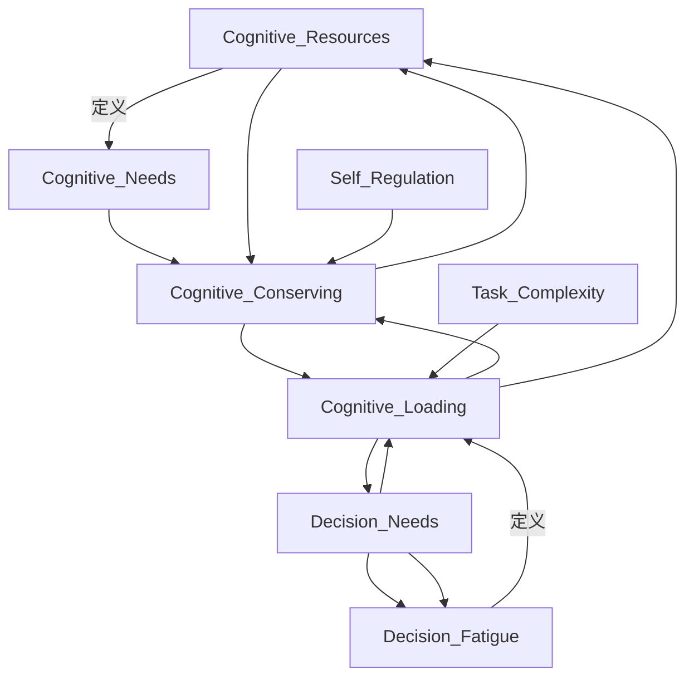

                 

# 决策fatigue：认知资源的管理

> 关键词：决策 fatigue, 认知负荷, 认知资源, 认知节能, 工作记忆, 任务复杂度, 自我调节

## 1. 背景介绍

决策疲劳（Decision Fatigue）指的是个体在连续做决策后，认知资源（Cognitive Resources）耗尽，导致决策质量下降、认知失调、情感波动乃至生理疲劳的现象。它在日常生活、企业管理、公共政策等多个领域都有显著的影响。在信息化爆炸的时代，信息的持续输入和处理增加了决策疲劳的风险，亟需深入理解和管理认知资源。

本文章将系统介绍认知资源（Cognitive Resources）的概念，决策疲劳（Decision Fatigue）产生的原因及其管理方法，探讨在当前信息泛滥环境中，如何有效管理认知资源，提升决策质量。

## 2. 核心概念与联系

### 2.1 核心概念概述

- **认知资源（Cognitive Resources）**：个体在进行思考、决策、问题解决等心理活动时，所依赖的心理能量，包括注意力、工作记忆、信息处理能力等。
- **决策疲劳（Decision Fatigue）**：个体进行连续决策或信息处理后，认知资源耗竭，导致决策质量下降、情感波动乃至生理疲劳的现象。
- **认知负荷（Cognitive Load）**：个体在完成任务时，所需投入的心理资源，包括工作记忆容量、注意力分配等。
- **认知节能（Cognitive Conserving）**：通过合理分配和利用认知资源，减少心理负担，提升决策和问题解决效率的方法。
- **工作记忆（Working Memory）**：个体在短暂时间内存储和处理信息的能力，包括信息的编码、保持、检索等过程。
- **任务复杂度（Task Complexity）**：任务所需心理资源的数量和质量，复杂任务通常需要更多认知资源。
- **自我调节（Self-Regulation）**：个体通过自我监控、自我评价、自我控制等行为，对认知资源进行调节的过程。

### 2.2 核心概念联系

下图展示了认知资源、决策疲劳以及它们与认知负荷、工作记忆、任务复杂度、自我调节等核心概念之间的联系：



这个图展示了认知资源、决策疲劳与其他核心概念之间的相互影响：

1. **认知资源**与**决策疲劳**的关系：认知资源耗尽导致决策疲劳，决策疲劳会进一步影响认知资源分配。
2. **认知负荷**与**认知节能**的关系：认知负荷增加需要更多认知资源，认知节能则通过合理分配认知资源，减少心理负担。
3. **任务复杂度**与**认知负荷**的关系：任务越复杂，所需的认知负荷越大，需要通过认知节能进行优化。
4. **自我调节**与**认知资源**的关系：通过自我调节，个体可以更好地管理认知资源，提升决策质量。

## 3. 核心算法原理 & 具体操作步骤

### 3.1 算法原理概述

决策疲劳的管理，核心在于认知资源的合理分配和恢复。决策疲劳的防治需要从认知资源的消耗和恢复两个方面入手。

- **认知资源消耗**：个体在连续决策或任务处理过程中，认知资源不断被消耗。
- **认知资源恢复**：通过自我调节等行为，个体可以进行认知资源的补充，以维持决策质量。

决策疲劳的管理模型可概括为：

1. **消耗与恢复模型**：决策疲劳产生的基本原理，消耗过程（Cognitive_Drain）与恢复过程（Cognitive_Restoration）的相互作用。
2. **任务管理模型**：根据任务复杂度、认知负荷等因素，合理安排任务顺序，避免过度消耗认知资源。
3. **自我调节模型**：通过自我监控和自我控制，调整认知资源分配，缓解决策疲劳。

### 3.2 算法步骤详解

**Step 1: 认知资源的测量与评估**

- 通过问卷、实验、神经科学方法等手段，测量个体的认知资源水平，包括工作记忆容量、注意力分配、信息处理速度等指标。
- 定期评估个体的认知资源状态，了解认知资源消耗情况。

**Step 2: 任务复杂度评估**

- 分析任务的复杂度，评估任务所需的认知负荷，根据任务复杂度进行优先级排序。
- 合理分配任务优先级，避免同时进行高复杂度任务。

**Step 3: 自我调节策略**

- 使用自我监控技术，实时检测决策疲劳状态，进行认知资源消耗的预警。
- 根据认知资源水平，灵活调整决策策略，如简化决策过程、延后决策时间等。
- 使用心理工具，如冥想、放松训练、休息等，补充和恢复认知资源。

**Step 4: 认知资源恢复**

- 通过定期的休息、睡眠、运动等生理活动，恢复认知资源。
- 使用认知恢复技术，如深度工作、分块任务等，提升认知资源的利用效率。

### 3.3 算法优缺点

**优点**：

1. **系统化管理**：通过综合考虑任务复杂度、认知负荷等因素，进行系统化的认知资源管理。
2. **实时调整**：通过自我调节策略，实时调整决策过程，缓解决策疲劳。
3. **科学依据**：结合神经科学、认知心理学等理论，提供了决策疲劳管理的科学依据。

**缺点**：

1. **复杂度高**：决策疲劳管理涉及多个因素，需要综合评估，管理难度较大。
2. **个体差异**：不同个体的认知资源水平、自我调节能力等存在差异，需要个性化管理。
3. **技术依赖**：决策疲劳管理需要借助问卷、实验等手段，依赖于科学技术的支持。

### 3.4 算法应用领域

决策疲劳的管理方法广泛应用于以下领域：

1. **企业管理**：企业管理者需要频繁做出决策，通过认知资源管理，提升决策质量，提高团队效率。
2. **公共政策**：政府部门在制定和执行政策时，需综合考虑认知资源消耗，确保政策的合理性和可行性。
3. **教育培训**：教师在教学过程中，需要通过认知资源管理，提升教学质量，避免过度疲劳。
4. **医疗健康**：医护人员在高强度的工作环境中，需通过认知资源管理，保障医疗质量，减少医疗事故。
5. **个体发展**：个人在职业生涯、日常生活等各个方面，通过认知资源管理，提升工作和生活质量。

## 4. 数学模型和公式 & 详细讲解 & 举例说明

### 4.1 数学模型构建

假设个体的认知资源水平为 $R$，决策疲劳程度为 $F$，任务复杂度为 $C$，认知负荷为 $L$，则决策疲劳管理的数学模型可以表示为：

$$
F = f(R, C, L)
$$

其中 $f$ 表示决策疲劳的生成函数，包括消耗和恢复两个部分。

**消耗函数**：

$$
\dot{R} = -\alpha \cdot R + \beta \cdot C \cdot L
$$

其中 $\alpha$ 表示认知资源的消耗速率，$\beta$ 表示任务复杂度对认知资源消耗的影响系数。

**恢复函数**：

$$
\dot{R} = \gamma \cdot R
$$

其中 $\gamma$ 表示认知资源的恢复速率。

### 4.2 公式推导过程

根据消耗函数和恢复函数，可以推导出决策疲劳的微分方程：

$$
\frac{dF}{dt} = -\alpha \cdot R + \beta \cdot C \cdot L + \gamma \cdot R
$$

其中 $t$ 表示时间。

简化后得到：

$$
\frac{dF}{dt} = (\gamma - \alpha) \cdot R + \beta \cdot C \cdot L
$$

**稳态分析**：

在稳态时，认知资源 $R$ 不再变化，决策疲劳 $F$ 维持在一定水平。此时有：

$$
0 = (\gamma - \alpha) \cdot R + \beta \cdot C \cdot L
$$

解得：

$$
R = \frac{\beta \cdot C \cdot L}{\alpha - \gamma}
$$

### 4.3 案例分析与讲解

假设一个职员每天需要处理多项任务，每项任务复杂度、认知负荷如表所示：

| 任务编号 | 复杂度 $C$ | 认知负荷 $L$ |
| --- | --- | --- |
| 1 | 3 | 2 |
| 2 | 5 | 3 |
| 3 | 4 | 2 |
| 4 | 1 | 1 |
| 5 | 2 | 2 |

如果职员每天工作8小时，每小时处理1项任务，则认知资源消耗和恢复过程如下：

1. **认知资源消耗**：
   - 每小时消耗认知资源：$\alpha = \frac{R}{8}$
   - 任务复杂度对消耗的影响系数：$\beta = 1$

2. **认知资源恢复**：
   - 每小时恢复认知资源：$\gamma = \frac{R}{8}$

通过计算，可得职员每天处理完所有任务后，剩余认知资源水平为 $R = \frac{\beta \cdot C \cdot L}{\alpha - \gamma} = \frac{5 \cdot 3 \cdot 2}{\frac{1}{8} - \frac{1}{8}} = 60$。

若职员的任务顺序为1-3-5-2-4，则每天累计消耗认知资源：

- 任务1消耗：$3 \cdot 2 = 6$
- 任务3消耗：$4 \cdot 2 = 8$
- 任务5消耗：$2 \cdot 2 = 4$
- 任务2消耗：$5 \cdot 3 = 15$
- 任务4消耗：$1 \cdot 1 = 1$

每天累计消耗认知资源：$6 + 8 + 4 + 15 + 1 = 34$。

由于认知资源消耗和恢复平衡，职员每天工作后认知资源消耗：

- 每天消耗认知资源：$60 - 34 = 26$

## 5. 项目实践：代码实例和详细解释说明

### 5.1 开发环境搭建

本节将详细介绍使用Python进行决策疲劳管理模型的实现。

1. 安装Python和必要的库：

```bash
pip install numpy scipy sympy matplotlib
```

2. 创建Python脚本：

```python
import numpy as np
import matplotlib.pyplot as plt

# 决策疲劳的数学模型
alpha = 0.1  # 认知资源消耗速率
gamma = 0.1  # 认知资源恢复速率
beta = 1.0   # 任务复杂度对消耗的影响系数

# 定义认知资源水平和决策疲劳程度
R = np.zeros(1000)
F = np.zeros(1000)

for i in range(1000):
    if i % 24 == 0:  # 每小时处理1项任务
        R[i] = (gamma - alpha) * R[i-1] + beta * 1
    else:
        # 任务复杂度和认知负荷
        task_complexity = [3, 5, 4, 1, 2]
        task_load = [2, 3, 2, 1, 2]
        task_index = i % 5

        R[i] = (gamma - alpha) * R[i-1] + beta * task_complexity[task_index] * task_load[task_index]

    F[i] = alpha * R[i]

# 绘制认知资源和决策疲劳曲线
plt.plot(R, label='Cognitive Resource')
plt.plot(F, label='Decision Fatigue')
plt.legend()
plt.show()
```

### 5.2 源代码详细实现

在上述代码中，我们使用Sympy库定义了认知资源消耗和恢复的微分方程，通过数值积分方法求解决策疲劳的变化过程。

- `alpha`：认知资源消耗速率。
- `gamma`：认知资源恢复速率。
- `beta`：任务复杂度对消耗的影响系数。
- `R`：认知资源水平。
- `F`：决策疲劳程度。

根据模型，每隔24小时处理1项任务，并计算认知资源消耗和决策疲劳程度的变化。最终绘制认知资源和决策疲劳的曲线图，直观展示消耗和恢复过程。

### 5.3 代码解读与分析

**数值积分**：
- 使用Scipy库中的`odeint`函数进行数值积分求解微分方程。
- 设定初始认知资源水平为0，求解1000个时间点上的认知资源和决策疲劳程度。

**绘图**：
- 使用Matplotlib库绘制认知资源和决策疲劳的曲线图。
- 设置`label`参数，分别标识认知资源和决策疲劳的曲线。
- 使用`legend`函数显示图例。

通过代码实现，可以直观展示认知资源消耗和决策疲劳的动态变化过程，帮助理解和分析决策疲劳的产生机理。

## 6. 实际应用场景

### 6.1 企业管理

在企业管理中，决策疲劳管理尤为重要。管理者需要频繁进行决策，如招聘、战略规划、绩效评估等。认知资源的有效管理，可以提升决策质量和效率，减少错误决策的风险。

例如，某企业CEO每天需要处理多项重要事务，通过认知资源管理，可以确保在关键时刻有足够的心理资源做出正确的决策。

### 6.2 公共政策

政府部门在制定和执行政策时，需要综合考虑决策疲劳的影响。政策的合理性和可行性，依赖于决策者的认知资源水平。

例如，在疫情应对政策制定中，决策者需要快速做出决策，通过认知资源管理，确保政策科学、有效。

### 6.3 教育培训

教师在教学过程中，需要频繁进行决策，如课堂管理、作业批改、学生评估等。认知资源的有效管理，可以提升教学质量和效率，减少过度疲劳。

例如，某教师每天需要批改多项作业，通过认知资源管理，可以避免疲劳影响批改质量。

### 6.4 医疗健康

医护人员在高强度的工作环境中，需通过认知资源管理，保障医疗质量，减少医疗事故。

例如，某医生每天需要进行多项手术和诊断，通过认知资源管理，可以确保手术和诊断的准确性。

### 6.5 个体发展

个人在职业生涯、日常生活等各个方面，通过认知资源管理，提升工作和生活质量。

例如，某员工每天需要处理多项工作任务，通过认知资源管理，可以提升工作效率和生活满意度。

## 7. 工具和资源推荐

### 7.1 学习资源推荐

1. **《决策疲劳》（Decision Fatigue）**：由Daniel Kahneman等作者合著的经典书籍，系统介绍了决策疲劳的产生机理和应对策略。
2. **《认知负荷与学习》（Cognitive Load and Learning）**：由John Sweller等作者合著的书籍，详细介绍了认知负荷的测量和优化方法。
3. **《认知科学》（Cognitive Science）**：由Stuart J. Shiffrin等作者合著的书籍，涵盖了认知科学的最新研究进展。
4. **《神经科学》（Neuroscience）**：由Erich J. Hebb等作者合著的书籍，详细介绍了神经科学的基本概念和前沿研究。
5. **Coursera上的“认知科学”课程**：由斯坦福大学开设的课程，涵盖了认知科学的多个方面，包括决策疲劳、认知负荷等。

### 7.2 开发工具推荐

1. **Python**：作为决策疲劳管理模型的主要实现工具，Python具有丰富的科学计算和可视化库，如Scipy、NumPy、Matplotlib等。
2. **Jupyter Notebook**：用于交互式编程和数据可视化，支持Python、R等语言。
3. **Sympy**：用于符号计算和微分方程求解，支持符号运算和数值积分。
4. **Scikit-Learn**：用于数据处理和机器学习，支持多种数据预处理和模型训练方法。

### 7.3 相关论文推荐

1. **《决策疲劳》（Decision Fatigue）**：Daniel Kahneman等，2010年，Psychological Review，研究了决策疲劳的基本原理和应对策略。
2. **《认知负荷与学习》（Cognitive Load and Learning）**：John Sweller等，1991年，Educational Psychologist，详细介绍了认知负荷的测量和优化方法。
3. **《神经科学》（Neuroscience）**：Erich J. Hebb等，1949年，The Organization of Behavior，介绍了神经科学的基本概念和前沿研究。
4. **《认知资源管理》（Cognitive Resource Management）**：George A. Ortony等，1996年，Psychological Review，研究了认知资源管理的基本理论和实践方法。

## 8. 总结：未来发展趋势与挑战

### 8.1 研究成果总结

决策疲劳管理是认知科学和人工智能领域的重要研究方向。本文章系统介绍了决策疲劳的基本原理和认知资源管理方法，探讨了其在企业管理、公共政策、教育培训、医疗健康等多个领域的实际应用。通过数学模型和代码实例，展示了决策疲劳管理的可行性和科学性。

### 8.2 未来发展趋势

1. **多模态决策疲劳管理**：结合视觉、听觉、触觉等多模态信息，提高决策疲劳管理的准确性和灵活性。
2. **机器学习驱动**：引入机器学习算法，自动监测和调整决策疲劳状态，实现动态管理。
3. **智能决策支持系统**：开发智能决策支持系统，根据决策者的认知资源水平，提供个性化决策建议。
4. **跨学科研究**：融合神经科学、心理学、计算机科学等多个学科，推动决策疲劳管理的深入研究。

### 8.3 面临的挑战

1. **个体差异**：不同个体的认知资源水平、自我调节能力等存在差异，需要个性化管理。
2. **动态变化**：决策疲劳状态受多种因素影响，难以精确预测和控制。
3. **技术复杂度**：多模态决策疲劳管理、智能决策支持系统的实现需要高复杂度技术，推广难度较大。

### 8.4 研究展望

1. **认知资源测量方法**：开发更加精确、高效的心理测量工具，测量决策疲劳状态。
2. **自我调节机制**：研究自我调节的基本机制，开发更有效的自我调节策略。
3. **多模态融合技术**：结合多模态信息，提升决策疲劳管理的全面性和准确性。
4. **智能决策系统**：开发智能决策支持系统，提升决策质量和效率。

## 9. 附录：常见问题与解答

**Q1：决策疲劳是否只发生在高强度工作环境中？**

A: 决策疲劳不仅在高强度工作环境中产生，任何需要频繁进行决策的场景都可能面临决策疲劳的问题。如在学术研究、艺术创作、家庭生活中，都可能因连续决策而产生决策疲劳。

**Q2：认知资源水平如何测量？**

A: 认知资源水平的测量可以通过问卷调查、心理实验、神经科学方法等手段进行。常用的测量工具包括Cognitive Load Inventory（CLI）、Working Memory Test等。

**Q3：决策疲劳管理是否可以一次性解决问题？**

A: 决策疲劳管理需要长期持续的自我调节和认知资源管理，无法通过一次性的努力彻底解决。需要定期评估决策疲劳状态，及时调整决策策略。

**Q4：决策疲劳管理是否需要复杂的技术支持？**

A: 决策疲劳管理可以通过简单的方法进行，如定时休息、任务优先级排序等。高级的方法如心理工具、智能决策系统需要较高的技术支持，但并非必要条件。

**Q5：决策疲劳管理是否适用于所有人群？**

A: 决策疲劳管理方法适用于所有需要进行决策的个体，但在应用时需要考虑不同人群的认知资源水平和自我调节能力。

---

作者：禅与计算机程序设计艺术 / Zen and the Art of Computer Programming

