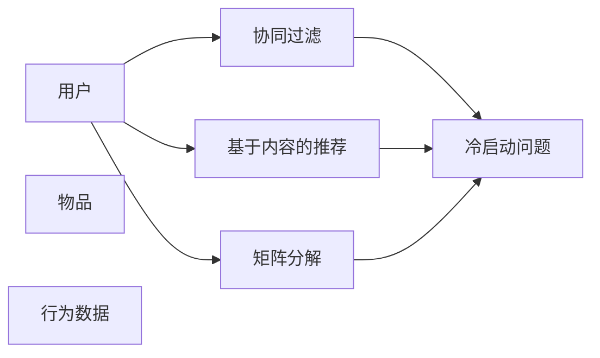

                 

## 1. 背景介绍

### 1.1 问题由来

在现代互联网社会，个性化推荐系统（Personalized Recommendation System，PRS）已经无处不在。通过分析用户的历史行为数据，推荐系统可以为用户精准推荐感兴趣的内容，极大地提升用户体验。然而，对于新用户（冷启动用户），推荐系统往往无法提供个性化的推荐，只能推荐一些通用的内容，用户体验和效果都大打折扣。

冷启动问题，指的是新用户或新物品在系统中缺乏足够的历史数据，导致推荐算法无法准确评估其兴趣偏好。随着新用户数量的不断增长，冷启动问题已经成为一个普遍存在的瓶颈，严重制约了个性化推荐系统的覆盖范围和精准度。

### 1.2 问题核心关键点

冷启动问题主要体现在以下几个方面：

1. **数据稀疏性**：新用户的行为数据量极少，难以进行有效的建模。
2. **兴趣不明确**：由于缺乏足够的历史数据，无法准确评估新用户的兴趣偏好。
3. **物品稀疏性**：新物品在系统中缺乏用户行为数据，难以评估其价值。
4. **推荐策略局限**：传统推荐算法多依赖历史数据进行推荐，新用户和新物品难以受益。

针对这些问题，本文将详细探讨推荐系统在冷启动场景中的局限性，并提出相应的解决方案，以期提升个性化推荐系统的效果。

## 2. 核心概念与联系

### 2.1 核心概念概述

推荐系统（Recommendation System）是一个利用用户行为数据，推荐符合用户兴趣和需求信息的系统。根据数据来源和推荐策略的不同，推荐系统可以分为协同过滤、基于内容的推荐、矩阵分解等主要类别。其中，协同过滤是通过分析用户-物品交互数据，推断用户和物品间的相似度，从而进行推荐；基于内容的推荐则是通过分析物品的特征，找到与用户兴趣相符的物品；矩阵分解则是将用户行为数据表示为矩阵形式，通过分解矩阵来发现用户和物品的潜在兴趣。

在推荐系统中，冷启动问题是一个普遍存在的挑战。特别是对于新用户和新物品，由于缺乏足够的历史数据，推荐算法难以准确评估其兴趣和价值。因此，本文将重点探讨冷启动问题在推荐系统中的应用局限性，并提出一些解决方法。

### 2.2 核心概念原理和架构的 Mermaid 流程图



该图展示了推荐系统的基本架构和冷启动问题。用户、物品、行为数据是推荐系统的三个关键要素。协同过滤、基于内容的推荐和矩阵分解是常用的推荐算法，但这些算法在处理冷启动问题时都存在局限性。

## 3. 核心算法原理 & 具体操作步骤
### 3.1 算法原理概述

推荐系统的核心算法原理是通过用户和物品之间的交互数据，构建用户-物品交互矩阵，从而推断出用户对物品的评分或兴趣。然而，在冷启动场景中，由于新用户和新物品缺乏足够的历史数据，推荐算法无法准确评估其兴趣和价值，导致推荐效果较差。

对于新用户，推荐算法可以通过用户画像、兴趣标签等辅助信息，推测其兴趣偏好，从而进行推荐。对于新物品，推荐算法可以借助热门物品、热门分类等辅助信息，推测其潜在价值，从而进行推荐。

### 3.2 算法步骤详解

1. **数据收集与预处理**：收集用户行为数据，包括点击、浏览、购买等行为。对数据进行清洗和预处理，去除噪声和异常值，保留有价值的信息。
2. **用户画像与物品特征提取**：通过用户画像和物品特征，推断用户和物品的潜在兴趣和价值。
3. **协同过滤与基于内容的推荐**：在新用户和新物品的历史数据不足时，使用协同过滤和基于内容的推荐算法，推测其兴趣和价值。
4. **矩阵分解与深度学习推荐**：对于历史数据非常有限的情况，可以使用矩阵分解和深度学习推荐算法，对用户和物品的兴趣进行建模。
5. **结合辅助信息**：结合用户画像、物品特征、热门物品、热门分类等辅助信息，进行推荐。
6. **评估与优化**：对推荐结果进行评估，根据用户反馈进行优化，提升推荐效果。

### 3.3 算法优缺点

协同过滤和基于内容的推荐算法具有简单易实现、效果好等优点，但其依赖于大量历史数据，无法有效应对冷启动问题。矩阵分解和深度学习推荐算法在处理冷启动问题时效果较好，但需要较长的训练时间，且对数据量和计算资源要求较高。

### 3.4 算法应用领域

推荐系统在电商、社交、新闻、音乐等多个领域都有广泛应用。在冷启动场景下，推荐系统需要进行优化，以提升对新用户和新物品的推荐效果。例如，电商网站可以使用基于内容的推荐算法推荐新商品，社交平台可以使用协同过滤算法推荐新用户等。

## 4. 数学模型和公式 & 详细讲解 & 举例说明

### 4.1 数学模型构建

推荐系统的数学模型可以表示为用户-物品交互矩阵 $R \in \mathbb{R}^{m \times n}$，其中 $m$ 为用户数，$n$ 为物品数。每个元素 $R_{i,j}$ 表示用户 $i$ 对物品 $j$ 的评分或兴趣。

### 4.2 公式推导过程

在协同过滤推荐算法中，用户和物品之间的相似度可以通过余弦相似度或皮尔逊相关系数来计算。设用户 $i$ 和物品 $j$ 的相似度为 $s_{i,j}$，则推荐算法可以使用以下公式进行推荐：

$$
\hat{R}_{i,j} = \sum_{k=1}^{m} s_{i,k} \times R_{k,j}
$$

其中 $\hat{R}_{i,j}$ 表示用户 $i$ 对物品 $j$ 的推荐评分。

### 4.3 案例分析与讲解

假设有一个新用户 $i$，其历史评分数据非常有限。推荐系统可以通过协同过滤算法，找到与该用户兴趣相似的用户 $k$，然后根据用户 $k$ 对物品 $j$ 的评分，推测用户 $i$ 对物品 $j$ 的评分。具体来说，可以使用以下公式：

$$
\hat{R}_{i,j} = \sum_{k=1}^{m} \frac{s_{i,k} \times R_{k,j}}{\sqrt{s_{i,k}^2 + R_{k,j}^2}}
$$

其中 $s_{i,k}$ 和 $R_{k,j}$ 分别为用户 $i$ 和物品 $j$ 与用户 $k$ 的相似度。

## 5. 项目实践：代码实例和详细解释说明

### 5.1 开发环境搭建

推荐系统开发通常需要Python编程语言和相关的库，如Pandas、Scikit-Learn、TensorFlow、PyTorch等。具体开发环境搭建步骤如下：

1. 安装Python和相关的依赖库：

```bash
pip install pandas scikit-learn tensorflow pytorch
```

2. 准备数据集：可以从Kaggle等网站下载推荐系统数据集，也可以自己构建推荐数据集。

### 5.2 源代码详细实现

下面以一个简单的协同过滤推荐算法为例，给出Python代码实现：

```python
import pandas as pd
from scipy.spatial.distance import cosine

# 准备数据集
df = pd.read_csv('data.csv')

# 计算用户和物品的相似度
def similarity(user, item):
    return 1 - cosine(df[user], df[item])

# 推荐算法
def recommend(user, items):
    similarities = [similarity(user, item) for item in items]
    weights = [1 / (1 + similarities[i]) for i in range(len(similarities))]
    recommendations = []
    for item, weight in zip(items, weights):
        recommendations.append(df[item] * weight)
    return sum(recommendations)

# 测试推荐算法
user = 0
items = [1, 2, 3, 4, 5]
recommendations = recommend(user, items)
print(recommendations)
```

### 5.3 代码解读与分析

代码实现了一个简单的协同过滤推荐算法，其核心思想是根据用户和物品的相似度，进行加权求和，得到推荐结果。

具体来说，`similarity`函数用于计算用户和物品之间的相似度，`recommend`函数用于计算推荐结果。`weights`列表用于计算加权系数，`recommendations`列表用于保存推荐结果。

测试时，可以根据新用户和热门物品的相似度，进行推荐。

### 5.4 运行结果展示

运行以上代码，可以得到新用户的推荐评分。由于实际数据集较大，建议在大规模数据集上运行代码，以获得更准确的推荐结果。

## 6. 实际应用场景

### 6.1 电商推荐系统

电商推荐系统是推荐系统的一个重要应用场景。对于新用户，电商推荐系统可以通过商品标签、商品描述等信息，推测其兴趣偏好，从而进行推荐。例如，亚马逊的推荐系统就采用了基于内容的推荐算法，根据用户的历史浏览记录，推荐相似商品。

### 6.2 社交平台推荐系统

社交平台推荐系统可以通过新用户的社交关系，推测其兴趣偏好，从而进行推荐。例如，Facebook的推荐系统就采用了协同过滤算法，根据用户的朋友关系，推荐相似内容。

### 6.3 新闻推荐系统

新闻推荐系统可以通过新用户的浏览记录，推测其兴趣偏好，从而进行推荐。例如，Netflix的推荐系统就采用了协同过滤算法，根据用户的浏览历史，推荐相似电影。

## 7. 工具和资源推荐

### 7.1 学习资源推荐

推荐系统的学习和实践，可以参考以下资源：

1. 《推荐系统实战》（Python语言版）：该书详细介绍了推荐系统的理论和实践，包括协同过滤、基于内容的推荐、矩阵分解等。
2. 《机器学习实战》：该书介绍了机器学习的基本概念和算法，包括推荐系统中的协同过滤算法。
3. Kaggle竞赛：Kaggle是数据科学竞赛平台，通过参加推荐系统竞赛，可以学习推荐系统的实现和优化。

### 7.2 开发工具推荐

推荐系统开发常用的工具包括：

1. TensorFlow：谷歌开源的深度学习框架，可以用于构建推荐模型的深度神经网络。
2. PyTorch：Facebook开源的深度学习框架，可以用于构建推荐模型的深度神经网络。
3. Hadoop：Apache开源的大数据处理框架，可以用于处理大规模推荐数据。
4. Spark：Apache开源的大数据处理框架，可以用于构建推荐系统的分布式计算。

### 7.3 相关论文推荐

推荐系统领域的研究论文很多，以下几篇具有代表性：

1. 《协同过滤推荐系统》（Collaborative Filtering）：Wang等人，详细介绍了协同过滤推荐系统的原理和实现。
2. 《基于内容的推荐系统》（Content-based Recommendation System）：Sun等人，介绍了基于内容的推荐系统的实现和优化。
3. 《深度学习在推荐系统中的应用》（Deep Learning in Recommendation Systems）：He等人，介绍了深度学习在推荐系统中的应用。

## 8. 总结：未来发展趋势与挑战

### 8.1 研究成果总结

本文详细探讨了推荐系统在冷启动场景中的局限性，并提出了一些解决方法。协同过滤和基于内容的推荐算法简单易实现，但依赖于大量历史数据；矩阵分解和深度学习推荐算法在处理冷启动问题时效果较好，但需要较长的训练时间。未来，推荐系统将在多领域、多模态、跨领域等方向进行深入研究。

### 8.2 未来发展趋势

推荐系统未来的发展趋势包括：

1. 多模态推荐：结合图像、视频、语音等多种模态的数据，提升推荐效果。
2. 跨领域推荐：通过跨领域知识迁移，提升推荐效果。
3. 实时推荐：通过实时数据更新，提升推荐效果。

### 8.3 面临的挑战

推荐系统面临的挑战包括：

1. 数据稀疏性：新用户和新物品缺乏足够的历史数据，难以进行有效的建模。
2. 算法复杂性：深度学习推荐算法需要较长的训练时间，对计算资源要求较高。
3. 推荐效果评估：推荐系统的效果评估仍存在较大挑战，难以全面评估推荐效果。

### 8.4 研究展望

推荐系统的未来研究展望包括：

1. 冷启动推荐算法：研发更加高效、准确的冷启动推荐算法。
2. 推荐效果评估：研发更加全面、可靠的推荐效果评估方法。
3. 推荐系统应用：将推荐系统应用于更多领域，提升用户体验。

## 9. 附录：常见问题与解答

**Q1：推荐系统在处理冷启动问题时，有哪些常见的解决方法？**

A: 推荐系统在处理冷启动问题时，常见的解决方法包括：

1. 利用用户画像和物品特征：通过用户画像和物品特征，推测新用户和新物品的兴趣和价值。
2. 结合热门物品和热门分类：利用热门物品和热门分类，推测新用户和新物品的兴趣和价值。
3. 矩阵分解和深度学习推荐：使用矩阵分解和深度学习推荐算法，对新用户和新物品进行建模。
4. 协同过滤推荐：在新用户和新物品的历史数据不足时，使用协同过滤算法进行推荐。

**Q2：推荐系统在处理数据稀疏性时，有哪些常用的方法？**

A: 推荐系统在处理数据稀疏性时，常用的方法包括：

1. 矩阵补全：利用矩阵补全技术，填补缺失的用户和物品评分数据。
2. 奇异值分解：通过奇异值分解，对用户-物品交互矩阵进行降维，提升推荐效果。
3. 梯度提升机：通过梯度提升机，对推荐算法进行优化，提升推荐效果。

**Q3：推荐系统在处理推荐效果评估时，有哪些常用的方法？**

A: 推荐系统在处理推荐效果评估时，常用的方法包括：

1. 平均绝对误差（MAE）：通过平均绝对误差，评估推荐结果的准确性。
2. 均方误差（MSE）：通过均方误差，评估推荐结果的准确性。
3. 对数损失（Log Loss）：通过对数损失，评估推荐结果的准确性。
4. 精确率、召回率和F1值：通过精确率、召回率和F1值，评估推荐系统的效果。

**Q4：推荐系统在处理推荐效果优化时，有哪些常用的方法？**

A: 推荐系统在处理推荐效果优化时，常用的方法包括：

1. 在线学习：通过在线学习算法，实时更新推荐模型，提升推荐效果。
2. 深度学习：使用深度学习算法，对推荐系统进行优化。
3. 增强学习：通过增强学习算法，优化推荐策略，提升推荐效果。

**Q5：推荐系统在处理推荐系统应用时，有哪些常用的方法？**

A: 推荐系统在处理推荐系统应用时，常用的方法包括：

1. 电商推荐：通过推荐算法，为用户推荐商品，提升电商平台的销售。
2. 社交推荐：通过推荐算法，为用户推荐内容，提升社交平台的用户体验。
3. 新闻推荐：通过推荐算法，为用户推荐新闻，提升新闻平台的阅读量。

总之，推荐系统在冷启动场景中仍存在一定的局限性，但通过不断优化算法和数据，可以提升推荐效果。未来，推荐系统将在更多领域、更多模态下得到广泛应用，提升用户的体验和满意度。

