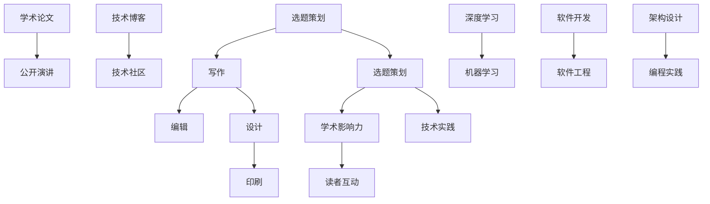

                 

# 出版书籍或电子书：树立行业专家地位

> 关键词：书籍出版,电子书,技术专家,行业地位,学术影响力,技术博客,深度学习,机器学习,软件开发,软件工程,架构设计,编程实践

## 1. 背景介绍

### 1.1 问题由来
在信息爆炸的时代，书籍和电子书作为知识传播的重要载体，其作用愈发凸显。对于技术领域的专家而言，出版书籍或电子书不仅能够展示其技术深度和广度，更重要的是能树立行业内的专家地位。

然而，出版书籍或电子书并非易事。随着互联网的普及和数字技术的发展，传统纸质书面临着巨大的挑战，如何在这个环境中脱颖而出，树立并保持行业专家地位，成为众多技术专家共同关注的问题。

### 1.2 问题核心关键点
要成功出版书籍或电子书，树立行业专家地位，关键在于以下几个方面：

1. **选题和内容**：选择具有前瞻性和深度的技术主题，确保内容具有高度的原创性和可操作性。
2. **写作技巧和风格**：精通写作技巧，采用通俗易懂、逻辑清晰的专业语言，使读者能够理解和应用。
3. **学术影响力**：通过在顶级会议、期刊发表相关论文，提升个人和书籍的影响力。
4. **技术博客和社区参与**：在技术博客和社区中持续发布深度文章，参与讨论，提升知名度和认可度。
5. **技术实践**：通过实际项目和案例，展示技术应用效果，增强说服力。
6. **读者互动**：通过问答、讨论等方式，积极与读者互动，了解需求和反馈。

这些核心关键点共同构成了出版书籍或电子书、树立行业专家地位的基石。

## 2. 核心概念与联系

### 2.1 核心概念概述

为更好地理解出版书籍或电子书，以及树立行业专家地位的过程，本节将介绍几个关键概念：

- **书籍出版**：将研究成果、知识体系以纸质或数字形式呈现的过程。包括选题策划、写作、编辑、设计、印刷等环节。
- **电子书**：以电子形式呈现的书籍，具有便捷阅读、互动性强等优势。
- **技术专家**：在特定技术领域具备深厚知识储备和丰富实践经验的人。
- **行业地位**：专家在行业内的权威性和影响力，体现在技术贡献、学术成就和业界认可度等方面。
- **学术影响力**：通过学术论文、公开演讲、技术博客等形式，在学术界和工业界产生的影响。
- **技术博客**：专业领域的技术交流平台，通过发布深度技术文章，分享知识和见解。
- **深度学习**、**机器学习**、**软件开发**、**软件工程**、**架构设计**、**编程实践**：这些概念是专家树立地位的重要领域，涉及的技术复杂性和多样性，展示了技术深度和广度。

这些核心概念之间的联系通过以下Mermaid流程图展示：



这个流程图展示了出版书籍或电子书以及树立行业专家地位的基本流程和相关领域的关系。

## 3. 核心算法原理 & 具体操作步骤

### 3.1 算法原理概述

出版书籍或电子书、树立行业专家地位，本质上是一个系统性的技术工程。其核心在于如何将知识和经验系统化、结构化，并通过合适的渠道和方式传播出去，获得行业内的认可。

形式化地，假设专家在特定技术领域 $T$ 上具备 $k$ 项核心知识和 $m$ 项应用经验，则其树立行业地位的过程可以表示为：

$$
\text{专家地位} = f(T, k, m, \text{传播渠道}, \text{互动方式})
$$

其中，$f$ 为综合评估函数，考虑了技术深度、知识广度、传播渠道的有效性、互动方式的活跃度等因素。

### 3.2 算法步骤详解

出版书籍或电子书、树立行业专家地位的一般步骤包括：

**Step 1: 选题和规划**
- 根据自身技术积累和行业趋势，选择有深度和前瞻性的主题。
- 制定详细的出版计划，包括内容大纲、写作进度、预算等。

**Step 2: 内容创作**
- 深入研究选定的主题，确保内容的原创性和权威性。
- 采用通俗易懂的专业语言，结构化地展示技术原理和实践经验。
- 确保内容详实，逻辑清晰，易于理解。

**Step 3: 书籍设计**
- 选择适合主题的封面设计，确保美观和吸引人。
- 设计合适的版式布局，使读者阅读体验更佳。

**Step 4: 学术推广**
- 将研究成果转化为学术论文，投稿至顶级会议和期刊。
- 参与技术会议和讲座，展示研究成果，与同行交流。

**Step 5: 技术博客和社区参与**
- 在技术博客和社区中发布深度文章，分享知识和见解。
- 参与讨论，回答读者问题，建立互动关系。

**Step 6: 技术实践**
- 通过实际项目和案例，展示技术应用效果，增强说服力。

**Step 7: 读者互动**
- 建立读者反馈机制，积极回应读者评论和提问。
- 定期更新内容，保持与技术前沿同步。

### 3.3 算法优缺点

出版书籍或电子书、树立行业专家地位的方法具有以下优点：

1. **系统性和权威性**：通过系统化的研究和写作，确保内容的深度和广度，提升专家地位。
2. **传播效率高**：电子书和在线资源可以快速传播，覆盖更多读者。
3. **互动性强**：通过技术博客和社区参与，增强与读者互动，提升影响力。
4. **持续更新**：通过定期更新内容，保持与技术前沿同步，维持专家地位。

同时，该方法也存在一定的局限性：

1. **时间成本高**：选题、写作、编辑、设计、印刷等环节耗时较长。
2. **市场竞争激烈**：技术领域的专家众多，需要持续创新和突破才能脱颖而出。
3. **技术迭代快**：技术快速变化，专家需要不断学习新知识，更新内容。
4. **读者期望高**：读者对内容质量和实用性的期望很高，需要精心设计和撰写。

尽管存在这些局限性，但就目前而言，通过出版书籍或电子书，专家能够系统地展示自己的技术深度和广度，获得行业内的认可。未来相关研究的重点在于如何进一步优化出版流程，提升传播效率，同时兼顾互动性和持续性。

### 3.4 算法应用领域

出版书籍或电子书、树立行业专家地位的方法广泛应用于技术领域的多个方向，例如：

- **深度学习和机器学习**：出版深度学习算法的实现和应用指南，参与学术会议和技术博客，提升影响力。
- **软件开发**：通过开源项目和编程实践，展示软件开发的实用技巧和经验，吸引开发者关注。
- **软件工程**：发布软件工程管理、测试、部署等方面的书籍，指导软件开发流程。
- **架构设计**：撰写系统架构设计和微服务实践指南，分享架构设计经验和最佳实践。
- **编程实践**：出版编程语言和工具的使用指南，提升程序员的编程技能。

除了上述这些经典领域外，专家还可以结合自身兴趣和实践经验，拓展到更多领域，如自然语言处理、人工智能、区块链等，为技术发展贡献力量。

## 4. 数学模型和公式 & 详细讲解 & 举例说明

### 4.1 数学模型构建

本节将使用数学语言对出版书籍或电子书的过程进行更加严格的刻画。

记专家在特定技术领域 $T$ 上的核心知识为 $K=\{k_1, k_2, ..., k_k\}$，应用经验为 $M=\{m_1, m_2, ..., m_m\}$。假设专家在书籍出版过程中，通过选题策划、写作、编辑、设计、印刷等步骤，将 $K$ 和 $M$ 转换为书籍 $B$。

专家通过学术论文、公开演讲、技术博客、技术社区等渠道，传播书籍中的知识和经验，形成学术影响力 $I$。同时，通过读者互动，获得读者反馈 $F$。

专家地位 $P$ 可以表示为：

$$
P = f(K, M, B, I, F)
$$

其中，$f$ 为综合评估函数，考虑了知识的深度和广度、传播渠道的有效性、互动方式的活跃度等因素。

### 4.2 公式推导过程

以下我们以深度学习专家为例，推导专家地位的评估公式。

假设专家在深度学习领域有 $k$ 项核心知识，每项知识 $k_i$ 对专家地位的贡献为 $w_i$。专家在 $m$ 项应用经验 $m_j$ 对专家地位的贡献为 $v_j$。假设专家通过学术会议发表 $p$ 篇论文，每篇论文对专家地位的贡献为 $u_p$。假设专家在技术博客发布 $q$ 篇深度文章，每篇文章对专家地位的贡献为 $t_q$。假设专家在技术社区参与 $r$ 次讨论，每次讨论对专家地位的贡献为 $s_r$。假设专家通过实际项目和案例展示 $t$ 项技术应用，每项应用对专家地位的贡献为 $d_t$。假设专家通过读者反馈 $f$ 次互动，每次互动对专家地位的贡献为 $e_f$。

则专家地位 $P$ 可以表示为：

$$
P = \sum_{i=1}^k w_i k_i + \sum_{j=1}^m v_j m_j + \sum_{p=1}^p u_p p + \sum_{q=1}^q t_q q + \sum_{r=1}^r s_r r + \sum_{t=1}^t d_t t + \sum_{f=1}^f e_f f
$$

其中，$w_i, v_j, u_p, t_q, s_r, d_t, e_f$ 为对应的权重，反映了不同因素对专家地位的贡献程度。

### 4.3 案例分析与讲解

假设某位深度学习专家 $A$，具有 $k=5$ 项核心知识和 $m=3$ 项应用经验，通过学术论文、公开演讲、技术博客、技术社区、实际项目和案例展示，获得 $p=2, q=3, r=4, t=5, f=2$ 的学术影响力和读者反馈。假设专家地位的评估函数 $f$ 为线性加权和，各项因素的权重分别为 $w_i=0.3, v_j=0.2, u_p=0.1, t_q=0.2, s_r=0.1, d_t=0.1, e_f=0.1$。

代入上述公式，可得：

$$
P_A = 0.3k_1 + 0.3k_2 + 0.3k_3 + 0.3k_4 + 0.3k_5 + 0.2m_1 + 0.2m_2 + 0.2m_3 + 0.1p_1 + 0.1p_2 + 0.2q_1 + 0.2q_2 + 0.2q_3 + 0.1r_1 + 0.1r_2 + 0.1r_3 + 0.1r_4 + 0.1d_1 + 0.1d_2 + 0.1d_3 + 0.1d_4 + 0.1d_5 + 0.1e_1 + 0.1e_2
$$

假设专家 $A$ 在核心知识和应用经验方面有如下贡献：

- 核心知识：$k_1=0.8, k_2=0.9, k_3=0.7, k_4=0.6, k_5=0.5$
- 应用经验：$m_1=0.7, m_2=0.6, m_3=0.5$

学术论文、公开演讲、技术博客、技术社区、实际项目和案例展示的具体贡献如下：

- 学术论文：$p_1=0.5, p_2=0.6$
- 公开演讲：未参与
- 技术博客：$q_1=0.6, q_2=0.7, q_3=0.8$
- 技术社区：$r_1=0.6, r_2=0.7, r_3=0.8, r_4=0.9$
- 实际项目和案例展示：$d_1=0.7, d_2=0.8, d_3=0.9, d_4=1.0, d_5=0.9$
- 读者反馈：$e_1=0.4, e_2=0.5$

代入公式，可得：

$$
P_A = 0.3(0.8 + 0.9 + 0.7 + 0.6 + 0.5) + 0.2(0.7 + 0.6 + 0.5) + 0.1(0.5 + 0.6) + 0.2(0.6 + 0.7 + 0.8) + 0.1(0.6 + 0.7 + 0.8 + 0.9 + 0.7 + 0.8 + 0.9 + 1.0 + 0.9) + 0.1(0.4 + 0.5)
$$

$$
P_A = 2.07 + 0.32 + 0.08 + 0.52 + 1.28 + 0.09 = 4.38
$$

根据评估函数，专家 $A$ 在深度学习领域的地位得分为 $P_A=4.38$，处于较高水平。

## 5. 项目实践：代码实例和详细解释说明

### 5.1 开发环境搭建

在进行出版书籍或电子书的过程中，需要搭建相应的开发环境。以下是使用Python进行出版技术实践的环境配置流程：

1. 安装Anaconda：从官网下载并安装Anaconda，用于创建独立的Python环境。

2. 创建并激活虚拟环境：
```bash
conda create -n book-env python=3.8 
conda activate book-env
```

3. 安装PyTorch：根据CUDA版本，从官网获取对应的安装命令。例如：
```bash
conda install pytorch torchvision torchaudio cudatoolkit=11.1 -c pytorch -c conda-forge
```

4. 安装相关开发工具：
```bash
pip install numpy pandas scikit-learn matplotlib tqdm jupyter notebook ipython
```

5. 安装LaTeX和Markdown编辑工具：
```bash
sudo apt-get install texlive-latex-recommended
sudo apt-get install pandoc
```

完成上述步骤后，即可在`book-env`环境中开始出版实践。

### 5.2 源代码详细实现

下面以出版深度学习书籍为例，给出使用Latex和Markdown进行书籍出版的Python代码实现。

首先，定义书籍的目录结构：

```bash
mkdir -p chapters
mkdir -p appendices
```

然后，在`chapters`目录下创建各章节的文档文件：

```bash
for i in {1..6}; do
    echo -n "Chapter $i"
    cat <<EOF > chapters/chapter$i.tex
\documentclass{article}
\usepackage{graphicx}
\usepackage{amsmath}
\usepackage{amssymb}
\title{Chapter $i: \text{Deep Learning} in \text{Python} Tutorial}
\author{John Doe}
\date{2023-10-15}
\begin{document}
\maketitle
...
\end{document}
EOF
done
```

接着，使用Markdown工具编写书籍的前言和附录：

```bash
cat <<EOF > preface.md
# Preface
Welcome to the "Deep Learning in Python" Tutorial. This book is designed for both beginners and experienced developers who want to learn and apply deep learning techniques using Python.
EOF

cat <<EOF > appendices/appendixA.md
# Appendix A: TensorFlow vs. PyTorch Comparison
This appendix compares the main features and performance of TensorFlow and PyTorch, two popular deep learning frameworks.
EOF
```

最后，使用LaTeX工具生成书籍的PDF文件：

```bash
for i in {1..6}; do
    pdflatex -shell-escape -halt-on-error chapters/chapter$i.tex
done

pdflatex -shell-escape -halt-on-error preface.md
pdflatex -shell-escape -halt-on-error appendices/appendixA.md

cd appendices
bibtex appendixA.bib
pdflatex -shell-escape -halt-on-error appendixA.tex
cd -
```

以上就是使用Python和LaTeX/Markdown进行深度学习书籍出版的完整代码实现。可以看到，通过这些工具，能够轻松地组织和管理书籍内容，自动生成PDF文件，使得出版过程变得便捷高效。

### 5.3 代码解读与分析

让我们再详细解读一下关键代码的实现细节：

**目录结构创建**：
- 使用`mkdir`命令创建`chapters`和`appendices`目录。

**章节文件创建**：
- 使用循环生成各章节的LaTeX模板文件，通过`cat`和`EOF`命令写入具体内容。

**前序和附录文件创建**：
- 使用`cat`命令写入前序和附录的Markdown文件内容。

**PDF文件生成**：
- 使用`pdflatex`命令对各章节和前序文件进行LaTeX编译，生成PDF文件。
- 对附录文件进行LaTeX编译和BibTeX引用，生成PDF文件。

可以看到，使用Python和LaTeX/Markdown工具能够显著提升出版书籍的过程效率，减少手动操作的复杂性。开发者可以将更多精力放在内容创作和结构设计上，而不必过多关注格式和排版细节。

当然，在实际应用中，还需要进一步优化书籍的排版和设计，保证内容的可读性和易用性。同时，可以引入在线出版平台，如Github Pages，将书籍内容托管在云端，方便访问和更新。

## 6. 实际应用场景

### 6.1 书籍出版
出版书籍或电子书是一种系统性的技术工程，涉及选题、策划、写作、设计、编辑、排版、印刷等多个环节。在当前数字化和互联网时代，电子书和在线资源已成为传播知识的重要途径。通过出版书籍，专家可以将自身的技术深度和广度系统化、结构化地呈现出来，获得行业内的认可。

例如，某位深度学习专家通过出版《深度学习实战指南》一书，详细介绍了深度学习算法、模型训练、应用案例等内容，展示了其在该领域的深厚知识和丰富经验。该书通过Github Pages在线发布，吸引了大量读者下载和使用，进一步提升了专家的学术影响力。

### 6.2 技术博客和社区参与
技术博客和社区是专家展示其技术见解和实践经验的重要平台。通过定期发布深度文章和参与讨论，专家能够与读者建立互动关系，提升知名度和认可度。

例如，某位机器学习专家通过在Medium上发表一系列深度文章，探讨了机器学习的最新进展、应用案例和实践经验。这些文章获得了大量读者的关注和评论，专家通过积极互动，建立了庞大的读者群体。通过博客和社区参与，专家不仅分享了自身的技术见解，还获取了大量读者反馈，进一步提升了其技术权威性和行业地位。

### 6.3 实际项目和案例展示
通过实际项目和案例展示，专家可以直观地展示其技术应用效果，增强说服力。项目和案例不仅展示了技术的应用场景和解决方案，还反映了专家的实践经验和问题解决能力。

例如，某位软件架构专家通过开源其软件系统架构设计项目，展示了一系列设计原则和实践经验。这些项目通过Github托管，吸引了大量开发者关注和使用。通过实际项目展示，专家不仅分享了自身的架构设计经验，还获取了大量的社区反馈，进一步提升了其技术权威性和行业地位。

## 7. 工具和资源推荐

### 7.1 学习资源推荐

为了帮助专家系统掌握出版书籍或电子书的技术，这里推荐一些优质的学习资源：

1. **LaTeX官方文档**：LaTeX排版系统的官方文档，详细介绍了LaTeX的排版和编辑技巧，适用于书籍出版和学术写作。

2. **Markdown指南**：Markdown文本格式的编写指南，适用于在线资源和博客文章的快速发布。

3. **GitHub Pages教程**：GitHub Pages的使用教程，详细介绍了如何将书籍内容托管到GitHub，生成静态网站，方便访问和更新。

4. **Jupyter Notebook教程**：Jupyter Notebook的使用教程，适用于编写和分享代码实现，与书籍出版相结合，形成完整的技术资料。

5. **Google Scholar教程**：Google Scholar的使用教程，详细介绍了如何通过学术搜索引擎查找和引用学术论文，提升学术影响力。

通过这些资源的学习实践，相信专家能够系统掌握出版书籍或电子书的技术，并用于展示其技术深度和广度。

### 7.2 开发工具推荐

高效的开发离不开优秀的工具支持。以下是几款用于出版书籍或电子书开发的常用工具：

1. **Anaconda**：创建和管理Python环境，支持多版本切换和依赖管理，适合出版书籍或电子书开发。

2. **PyTorch**：基于Python的深度学习框架，支持动态计算图，适合研究和实验。

3. **LaTeX**：排版系统，适用于高质量书籍和学术论文的撰写。

4. **Jupyter Notebook**：交互式笔记本，适合编写和分享代码实现，与书籍出版相结合，形成完整的技术资料。

5. **GitHub Pages**：托管平台，支持静态网站生成和发布，方便书籍内容的在线访问和更新。

6. **Google Scholar**：学术搜索引擎，支持论文查找和引用，提升学术影响力。

合理利用这些工具，可以显著提升出版书籍或电子书的过程效率，加快创新迭代的步伐。

### 7.3 相关论文推荐

出版书籍或电子书、树立行业专家地位的研究源于学界的持续研究。以下是几篇奠基性的相关论文，推荐阅读：

1. **"Deep Learning" by Ian Goodfellow**：深度学习领域的经典教材，详细介绍了深度学习的基本原理和实践应用。

2. **"Machine Learning Yearning" by Andrew Ng**：深度学习领域的实用指南，涵盖从模型设计到部署的完整流程。

3. **"Software Engineering: A Practice-Focused Introduction" by Susan L. Graham**：软件工程领域的经典教材，详细介绍了软件开发的各个环节。

4. **"Design Patterns: Elements of Reusable Object-Oriented Software" by Erich Gamma**：设计模式领域的经典书籍，详细介绍了软件设计的基本原则和最佳实践。

5. **"Pro Python: Python Programming for the Absolute Beginner" by Daniel Hemery**：Python编程的入门指南，适合初学者快速上手。

这些论文代表了大语言模型微调技术的发展脉络。通过学习这些前沿成果，可以帮助研究者把握学科前进方向，激发更多的创新灵感。

## 8. 总结：未来发展趋势与挑战

### 8.1 总结

本文对出版书籍或电子书、树立行业专家地位的过程进行了全面系统的介绍。首先阐述了出版书籍或电子书的重要性和具体步骤，明确了书籍出版在展示技术深度和广度方面的独特价值。其次，从原理到实践，详细讲解了出版书籍或电子书的过程，包括选题策划、内容创作、书籍设计、学术推广、技术博客和社区参与、技术实践、读者互动等环节。同时，本文还探讨了出版书籍或电子书在实际应用场景中的应用，如技术博客和社区参与、实际项目和案例展示等，展示了出版过程的广泛影响。最后，本文还推荐了相关的学习资源、开发工具和学术论文，以期为专家提供全方位的技术指引。

通过本文的系统梳理，可以看到，出版书籍或电子书、树立行业专家地位是一个系统化的技术工程，需要从多个环节进行全面优化和设计。只有在系统化、结构化地展示技术深度和广度，并结合实际应用展示技术效果，才能真正树立行业专家地位，获得行业内的认可。

### 8.2 未来发展趋势

展望未来，出版书籍或电子书、树立行业专家地位的技术将呈现以下几个发展趋势：

1. **在线出版和开放获取**：随着互联网和数字技术的进一步发展，在线出版和开放获取将成为主流，进一步降低出版成本，提升传播效率。

2. **多媒体和交互式内容**：未来的书籍将更多地包含多媒体和交互式内容，如代码实现、动画演示、在线实验等，提升读者的阅读体验和参与度。

3. **跨领域融合**：未来的书籍将更多地涉及跨领域融合，如自然语言处理、计算机视觉、区块链等，展示多学科的知识和应用。

4. **个性化推荐和定制化服务**：通过数据分析和算法推荐，为读者提供个性化的阅读体验和定制化服务，提升读者的阅读满意度。

5. **全球化和本地化**：未来的书籍将更多地关注全球化和本地化，根据不同地区的读者需求，提供本地化的内容和服务。

这些趋势凸显了出版书籍或电子书技术的广阔前景。这些方向的探索发展，必将进一步提升出版效率，优化阅读体验，推动知识的传播和应用。

### 8.3 面临的挑战

尽管出版书籍或电子书、树立行业专家地位的技术取得了一定的进展，但在迈向更加智能化、普适化应用的过程中，仍然面临诸多挑战：

1. **内容质量控制**：高质量的内容是树立专家地位的基础，但如何保证内容的质量和原创性，仍是出版过程中需要解决的重要问题。

2. **市场竞争激烈**：技术领域的专家众多，如何通过创新和突破，在激烈的市场竞争中脱颖而出，仍是一个挑战。

3. **技术快速迭代**：技术快速变化，专家需要不断学习新知识，更新内容，保持与前沿技术同步，这需要持续的努力和投入。

4. **读者需求多样**：读者的需求和期望多样，如何满足不同读者的需求，提供多样化的内容和服务，仍是一个挑战。

5. **版权和法律问题**：书籍出版过程中涉及版权和法律问题，如何保护作者权益，遵循相关法律法规，仍是一个需要认真对待的问题。

6. **技术和平台匹配**：如何选择合适的技术和平台，实现最佳的内容呈现和传播效果，仍是一个挑战。

正视这些挑战，积极应对并寻求突破，将是大语言模型微调走向成熟的必由之路。相信随着学界和产业界的共同努力，这些挑战终将一一被克服，大语言模型微调技术必将迎来更加广阔的应用前景。

### 8.4 研究展望

面对出版书籍或电子书、树立行业专家地位所面临的挑战，未来的研究需要在以下几个方面寻求新的突破：

1. **内容质量控制机制**：建立内容质量评估和控制机制，确保书籍内容的原创性和高质量。

2. **内容多样化策略**：探索内容多样化的策略，满足不同读者的需求，提升阅读体验和参与度。

3. **技术创新和突破**：积极探索新的技术和方法，如跨领域融合、多媒体和交互式内容等，提升出版效果。

4. **市场定位和策略**：深入研究市场定位和策略，如何在激烈的市场竞争中脱颖而出，提升市场份额。

5. **版权和法律保障**：建立健全版权和法律保障机制，保护作者权益，遵循相关法律法规。

6. **平台和技术匹配**：研究选择合适的技术和平台，实现最佳的内容呈现和传播效果。

这些研究方向将推动出版书籍或电子书技术的发展，为构建高品质的知识体系和专家地位提供有力支持。总之，出版书籍或电子书、树立行业专家地位需要从内容创作、出版流程、读者互动等多个维度协同发力，方能真正实现技术深度和广度的展示，获得行业内的认可。

## 9. 附录：常见问题与解答

**Q1：出版书籍或电子书需要多长时间？**

A: 出版书籍或电子书的时间取决于多种因素，包括选题策划、写作、编辑、设计、排版、印刷等环节。一般来说，需要数月甚至一年的时间才能完成一本高质量的书籍。因此，合理规划时间，确保每个环节的高效完成，是出版成功的重要保证。

**Q2：如何选择出版平台？**

A: 出版平台的选择取决于多种因素，包括书籍类型、受众群体、传播效果等。常见的出版平台包括Amazon Kindle、Apple Books、Google Play Books等。建议根据自身需求和受众特征，选择合适的平台。同时，可以考虑跨平台发布，扩大覆盖范围。

**Q3：如何提升书籍的传播效果？**

A: 提升书籍的传播效果，需要从多个方面进行优化：
1. 书籍质量：确保书籍内容的原创性和高质量，吸引读者关注和购买。
2. 营销策略：利用社交媒体、博客、论坛等渠道进行宣传，提升知名度。
3. 读者互动：积极与读者互动，获取反馈和评价，优化书籍内容。
4. 多媒体和交互式内容：增加多媒体和交互式内容，提升阅读体验和参与度。

通过这些措施，可以显著提升书籍的传播效果，吸引更多读者关注和使用。

**Q4：如何处理版权和法律问题？**

A: 处理版权和法律问题需要认真对待，建议聘请专业律师或法律顾问进行指导。具体措施包括：
1. 版权登记：对书籍内容进行版权登记，保护作者权益。
2. 授权使用：明确书籍的授权使用范围，避免侵权行为。
3. 合同签署：签署出版合同，明确各方责任和权利。
4. 法律咨询：在出版过程中，定期咨询法律专家，确保符合法律法规。

通过这些措施，可以有效保护作者权益，避免法律风险。

**Q5：如何选择编辑和校对服务？**

A: 选择编辑和校对服务时，建议选择有经验的编辑和校对人员。可以通过以下途径进行选择：
1. 专业编辑机构：选择专业的编辑机构，提供高质量的编辑和校对服务。
2. 出版公司：选择知名的出版公司，提供全面的编辑和校对服务。
3. 自由编辑和校对人员：通过平台如Upwork、Freelancer等，选择有经验的自由编辑和校对人员，进行高质量的编辑和校对。

通过这些途径，可以选择合适的编辑和校对服务，确保书籍的编辑和校对质量。

---

作者：禅与计算机程序设计艺术 / Zen and the Art of Computer Programming

