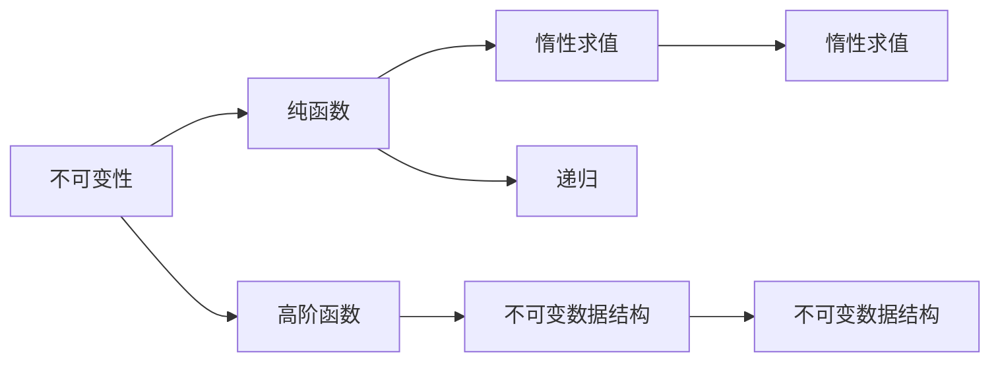

                 

# 函数式编程的思想与技术框架

> 关键词：函数式编程,高阶函数,不可变性,纯函数,不可变数据结构,惰性求值,并行计算,事件驱动编程,函数式界面

## 1. 背景介绍

函数式编程(FP)是一种编程范式，其核心思想是将计算过程视为函数调用和数据传递的过程，强调不可变性和函数的纯粹性。这种编程风格最早可以追溯到Lisp语言，随后在数学、逻辑学等领域得到了深入研究与应用，逐渐演变成现代软件开发中的一个重要方向。

函数式编程与面向过程编程(P程序)有着显著的区别：

- P程序着重于计算过程中的状态和数据的变化，而FP注重函数之间的相互关系和计算结果。
- P程序容易受到副作用（Side Effects）的影响，如I/O操作、修改数据结构等，而FP通过避免副作用来保证函数纯粹性。
- P程序的性能优化往往依赖于数据结构的合理管理和流程控制，而FP依赖于不可变性和惰性求值等特性。

函数式编程的兴起与流行，与云计算、分布式计算、大数据等技术的成熟和普及有着密切的关系。分布式计算、并行计算等需要解决的问题，如数据一致性、并行并发等问题，都是FP擅长的领域。

## 2. 核心概念与联系

### 2.1 核心概念概述

函数式编程有多个核心概念，每个概念都影响着FP的编程风格和编程逻辑。下面将简要介绍几个核心概念，并展示其间的联系：

1. **不可变性(Immutability)**：在函数式编程中，数据一旦创建，其值就不能被修改。不可变性避免了数据的意外变化，使得状态管理更加容易和可预测。

2. **纯函数(Pure Function)**：纯函数是指那些在相同输入下，总是返回相同结果的函数，不会对外部环境产生任何影响。纯函数没有副作用，也称为无状态的函数。

3. **高阶函数(Higher-Order Function)**：高阶函数是指接受函数作为参数或返回函数作为结果的函数。它可以让程序员编写更简洁、可重用的代码，以及实现函数组合。

4. **惰性求值(Lazy Evaluation)**：惰性求值是一种计算策略，在需要结果时才进行计算。它可以使程序更加高效，并且可以处理无限数据集。

5. **不可变数据结构(Immutable Data Structures)**：不可变数据结构是指那些在创建后就不能被修改的数据结构。它们在函数式编程中扮演着重要的角色。

6. **递归(Recursion)**：递归是一种计算方法，它在计算过程中不断调用自身，直到满足特定条件。在函数式编程中，递归用于实现循环和迭代过程。

这些核心概念相互支撑，共同构成了函数式编程的基石。下面，我们将通过一个简化的Mermaid流程图来展示这些概念间的联系。



### 2.2 核心概念原理和架构

为了更好地理解这些核心概念，我们将逐一深入探讨其原理和架构。

**不可变性**

不可变性是函数式编程中最重要的概念之一。不可变性通过保证数据的不可更改性，避免了状态变化的复杂性和错误。在函数式编程中，不可变数据通常被视为不可修改的常量。

**纯函数**

纯函数是指输出仅依赖于输入的函数。它没有副作用，也不会改变任何外部状态。一个典型的纯函数例子是加法函数：

$$ f(x, y) = x + y $$

这个函数无论何时被调用，只要输入参数相同，输出结果也相同。

**高阶函数**

高阶函数是指接受函数作为参数或返回函数作为结果的函数。它可以让程序员编写更简洁、可重用的代码。例如：

$$ g(f) = \lambda x . f(x)^2 $$

这个函数接受另一个函数作为参数，并返回一个平方函数。

**惰性求值**

惰性求值是一种计算策略，它只有在需要结果时才进行计算。这样可以避免不必要的计算，节省资源，并且可以处理无限数据集。例如，使用惰性求值来实现斐波那契数列：

$$ f(n) = n \leq 1 \to n + f(n-1) + f(n-2) \to \text{undefined} $$

**不可变数据结构**

不可变数据结构是指创建后无法修改的数据结构。例如，不可变列表或不可变集合。在函数式编程中，不可变数据结构常用于实现并发编程和状态不可变性。

**递归**

递归是一种计算方法，它在计算过程中不断调用自身，直到满足特定条件。递归在函数式编程中用于实现循环和迭代过程。

## 3. 核心算法原理 & 具体操作步骤

### 3.1 算法原理概述

函数式编程的核心算法原理基于函数组合和函数复用的思想。通过组合和复用函数，可以实现复杂计算过程的简洁表达和高效求解。

函数式编程的算法通常分为以下几个步骤：

1. 定义问题并分解为子问题。
2. 设计函数，将子问题抽象为函数。
3. 组合函数，将函数组合成解决方案。
4. 复用函数，将已有的函数进行复用，避免重复计算。

### 3.2 算法步骤详解

下面我们以一个简单的计数器实现为例，来演示函数式编程的算法步骤。

**Step 1: 定义问题并分解为子问题**

要实现一个计数器，我们需要定义两个函数：`inc`函数和`get`函数。`inc`函数用于增加计数器的值，`get`函数用于获取计数器的值。

**Step 2: 设计函数**

我们定义一个不可变列表作为计数器的值存储：

$$ \text{counter} = [0] $$

定义一个`inc`函数：

$$ \text{inc}(\text{counter}) = [\text{head} + 1] + \text{tail} $$

其中，`head`是计数器的头元素，`tail`是计数器的尾元素。

定义一个`get`函数：

$$ \text{get}(\text{counter}) = \text{head} $$

**Step 3: 组合函数**

我们将`inc`函数和`get`函数组合成一个完整的计数器函数：

$$ \text{counter} = [0] $$

$$ \text{next}(\text{counter}) = \text{inc}(\text{counter}) $$

$$ \text{value}(\text{counter}) = \text{get}(\text{counter}) $$

**Step 4: 复用函数**

我们使用递归的方式实现`inc`函数和`get`函数：

$$ \text{inc}([\text{head}], \text{tail}) = [\text{head} + 1] + \text{tail} $$

$$ \text{inc}([\text{head} + 1, \text{tail}_1], \text{tail}_2) = [\text{head} + 1] + \text{tail}_2 $$

$$ \text{get}([\text{head}], \text{tail}) = \text{head} $$

通过递归调用，我们可以实现计数器的所有操作。

### 3.3 算法优缺点

函数式编程有其独特的优点，但也有一定的缺点：

**优点**

1. **不可变性**：保证数据的不可变性，避免了状态变化的复杂性和错误。
2. **纯函数**：避免了副作用，使代码更加可靠和易于维护。
3. **高阶函数**：让程序员编写更简洁、可重用的代码。
4. **惰性求值**：节省资源，并且可以处理无限数据集。
5. **不可变数据结构**：易于并发编程和状态不可变性。
6. **递归**：实现循环和迭代过程。

**缺点**

1. **学习曲线陡峭**：函数式编程需要掌握许多新的概念和方法。
2. **性能问题**：由于递归和不可变性，函数式编程的性能可能会比面向过程编程差。
3. **资源消耗**：递归调用可能会导致栈溢出，不可变性可能会导致内存消耗大。
4. **代码冗长**：函数式编程需要定义大量的函数和组合，代码可能会比较冗长。

### 3.4 算法应用领域

函数式编程在多个领域中都有广泛的应用：

1. **并发编程**：函数式编程的不可变性和惰性求值，使得并发编程更加简单和安全。
2. **分布式计算**：函数式编程的分而治之思想，使得分布式计算更加高效和易于实现。
3. **大数据处理**：函数式编程的不可变性和惰性求值，使得大数据处理更加高效和灵活。
4. **函数式界面**：函数式编程的函数组合和函数复用思想，使得函数式界面更加简洁和易于实现。
5. **事件驱动编程**：函数式编程的不可变性和惰性求值，使得事件驱动编程更加高效和可靠。

## 4. 数学模型和公式 & 详细讲解 & 举例说明

### 4.1 数学模型构建

函数式编程的数学模型通常基于函数组合和函数复用的思想。我们可以通过数学模型来理解函数式编程的基本原理。

**不可变性**

在函数式编程中，数据一旦创建，其值就不能被修改。不可变性可以通过以下数学模型来描述：

$$ \text{data} \equiv \text{data} $$

**纯函数**

纯函数是指在相同输入下，总是返回相同结果的函数。纯函数可以通过以下数学模型来描述：

$$ \text{f}(x) = \text{f}(y) \Leftrightarrow x = y $$

**高阶函数**

高阶函数是指接受函数作为参数或返回函数作为结果的函数。高阶函数可以通过以下数学模型来描述：

$$ \text{g}(f) = \lambda x . f(x) $$

**惰性求值**

惰性求值是一种计算策略，只有在需要结果时才进行计算。惰性求值可以通过以下数学模型来描述：

$$ \text{eval}(\text{expr}) = \text{undefined} $$

**不可变数据结构**

不可变数据结构是指创建后不能被修改的数据结构。不可变数据结构可以通过以下数学模型来描述：

$$ \text{data}_1 = \text{data}_2 \Leftrightarrow \text{data}_1 = \text{data}_2 $$

**递归**

递归是一种计算方法，它在计算过程中不断调用自身。递归可以通过以下数学模型来描述：

$$ \text{f}(\text{expr}) = \text{expr} $$

### 4.2 公式推导过程

下面我们以一个简单的计数器实现为例，来演示函数式编程的数学模型推导过程。

**Step 1: 定义问题并分解为子问题**

要实现一个计数器，我们需要定义两个函数：`inc`函数和`get`函数。

**Step 2: 设计函数**

我们定义一个不可变列表作为计数器的值存储：

$$ \text{counter} = [0] $$

定义一个`inc`函数：

$$ \text{inc}(\text{counter}) = [\text{head} + 1] + \text{tail} $$

其中，`head`是计数器的头元素，`tail`是计数器的尾元素。

定义一个`get`函数：

$$ \text{get}(\text{counter}) = \text{head} $$

**Step 3: 组合函数**

我们将`inc`函数和`get`函数组合成一个完整的计数器函数：

$$ \text{counter} = [0] $$

$$ \text{next}(\text{counter}) = \text{inc}(\text{counter}) $$

$$ \text{value}(\text{counter}) = \text{get}(\text{counter}) $$

**Step 4: 复用函数**

我们使用递归的方式实现`inc`函数和`get`函数：

$$ \text{inc}([\text{head}], \text{tail}) = [\text{head} + 1] + \text{tail} $$

$$ \text{inc}([\text{head} + 1, \text{tail}_1], \text{tail}_2) = [\text{head} + 1] + \text{tail}_2 $$

$$ \text{get}([\text{head}], \text{tail}) = \text{head} $$

### 4.3 案例分析与讲解

下面我们以一个简单的斐波那契数列实现为例，来演示函数式编程的数学模型推导过程。

**Step 1: 定义问题并分解为子问题**

要实现斐波那契数列，我们需要定义一个函数：`fib`函数。

**Step 2: 设计函数**

我们定义一个不可变列表作为斐波那契数列的前两个元素：

$$ \text{fib} = [0, 1] $$

定义一个`fib`函数：

$$ \text{fib}(n) = n \leq 1 \to \text{fib}(n) \to \text{undefined} $$

**Step 3: 组合函数**

我们将`fib`函数组合成一个完整的斐波那契数列函数：

$$ \text{fib} = [0, 1] $$

$$ \text{fib}(n) = \text{fib}(n-1) + \text{fib}(n-2) $$

**Step 4: 复用函数**

我们使用递归的方式实现`fib`函数：

$$ \text{fib}([0, 1]) = [0, 1] $$

$$ \text{fib}([a, b]) = [a + b, a + b] $$

$$ \text{fib}([a, b], n) = \text{undefined} $$

通过递归调用，我们可以实现斐波那契数列的所有操作。

## 5. 项目实践：代码实例和详细解释说明

### 5.1 开发环境搭建

在进行函数式编程的实践之前，我们需要准备好开发环境。以下是使用Python进行Scala开发的Scala环境配置流程：

1. 安装Anaconda：从官网下载并安装Anaconda，用于创建独立的Python环境。

2. 创建并激活虚拟环境：
```bash
conda create -n pytorch-env python=3.8 
conda activate pytorch-env
```

3. 安装Scala：根据操作系统和版本，从官网获取对应的安装命令。例如：
```bash
wget https://www.scala.org/downloads/ -O scala.tar.gz
tar -xvf scala.tar.gz
cd scala-3.14.2/
./sbt
```

4. 安装Sbt：
```bash
brew install sbt
```

5. 安装Scala库：
```bash
sbt console
```

6. 安装Spark：
```bash
wget https://www.scala.org/downloads/ -O spark-3.2.2.tar.gz
tar -xvf spark-3.2.2.tar.gz
cd spark-3.2.2/
./bin/spark-submit
```

完成上述步骤后，即可在`pytorch-env`环境中开始函数式编程的实践。

### 5.2 源代码详细实现

下面我们以一个简单的计数器实现为例，给出使用Scala进行函数式编程的Scala代码实现。

首先，定义不可变列表：

```scala
object Counter {
  val counter = List(0)
}
```

然后，定义`inc`函数：

```scala
def inc: List[Int] => List[Int] = {
  val head = Counter.counter.head
  Counter.counter = List(head + 1) + Counter.counter.tail
  Counter.counter
}
```

接着，定义`get`函数：

```scala
def get: List[Int] => Int = {
  Counter.counter.head
}
```

最后，使用递归方式实现计数器：

```scala
def next: List[Int] => List[Int] = {
  Counter.counter = List(Counter.counter.head + 1) + Counter.counter.tail
  Counter.counter
}

def value: List[Int] => Int = {
  Counter.counter.head
}
```

### 5.3 代码解读与分析

让我们再详细解读一下关键代码的实现细节：

**Counter类**

- `val counter`：定义一个不可变列表，作为计数器的值存储。
- `inc`函数：通过不可变性，修改计数器的值。
- `get`函数：获取计数器的值。

**inc函数**

- `val head`：获取计数器的头元素。
- `Counter.counter = List(head + 1) + Counter.counter.tail`：通过不可变性，修改计数器的值。

**get函数**

- `Counter.counter.head`：获取计数器的头元素。

**next函数**

- `Counter.counter = List(Counter.counter.head + 1) + Counter.counter.tail`：通过不可变性，修改计数器的值。

**value函数**

- `Counter.counter.head`：获取计数器的头元素。

可以看到，通过Scala的不可变性和惰性求值，我们能够简洁地实现计数器的所有操作。Scala的函数式编程特性，使得代码更加简洁、可读和易于维护。

## 6. 实际应用场景

### 6.1 金融数据分析

函数式编程在金融数据分析领域有着广泛的应用。金融机构需要对大量的金融数据进行分析和处理，以保证数据的一致性和安全性。函数式编程的不可变性和惰性求值，使得数据处理更加安全可靠。

在实际应用中，可以使用函数式编程的不可变性来存储和处理数据，避免数据的意外变化。使用惰性求值来处理大数据集，避免内存溢出和资源消耗过大。

### 6.2 大数据处理

函数式编程在大数据处理领域也有着重要的应用。大数据处理需要处理大量复杂的数据，函数式编程的不可变性和惰性求值，使得数据处理更加高效和灵活。

在实际应用中，可以使用函数式编程的不可变性来存储和处理大数据集，避免内存溢出和资源消耗过大。使用惰性求值来处理复杂的数据操作，避免不必要的计算和资源浪费。

### 6.3 并行计算

函数式编程的不可变性和惰性求值，使得并行计算更加高效和易于实现。函数式编程的分而治之思想，使得并行计算更加简单和安全。

在实际应用中，可以使用函数式编程的不可变性和惰性求值，来并行处理复杂的数据操作。使用惰性求值来避免不必要的计算和资源浪费。

### 6.4 未来应用展望

随着函数式编程的不断发展，未来函数式编程将有更广泛的应用场景：

1. **并发编程**：函数式编程的不可变性和惰性求值，使得并发编程更加简单和安全。
2. **分布式计算**：函数式编程的分而治之思想，使得分布式计算更加高效和易于实现。
3. **大数据处理**：函数式编程的不可变性和惰性求值，使得大数据处理更加高效和灵活。
4. **函数式界面**：函数式编程的函数组合和函数复用思想，使得函数式界面更加简洁和易于实现。
5. **事件驱动编程**：函数式编程的不可变性和惰性求值，使得事件驱动编程更加高效和可靠。

## 7. 工具和资源推荐

### 7.1 学习资源推荐

为了帮助开发者系统掌握函数式编程的理论基础和实践技巧，这里推荐一些优质的学习资源：

1. 《函数式编程入门》书籍：该书详细介绍了函数式编程的基本概念和编程方法，适合初学者入门。
2. 《Scala高级编程》书籍：该书介绍了Scala的高级编程特性，适合进阶学习。
3. 《Scala并发编程》书籍：该书介绍了Scala的并发编程特性，适合处理并发任务。
4. 《Scala集合编程》书籍：该书介绍了Scala的集合编程特性，适合处理大数据集。
5. 《Scala函数式编程》在线课程：该课程介绍了Scala的函数式编程特性，适合系统学习。

通过对这些资源的学习实践，相信你一定能够快速掌握函数式编程的精髓，并用于解决实际的编程问题。

### 7.2 开发工具推荐

高效的开发离不开优秀的工具支持。以下是几款用于函数式编程开发的常用工具：

1. Scala：基于Java虚拟机的函数式编程语言，支持并发、大数据处理、函数式编程等多种特性。
2. sbt：Scala的构建工具，支持依赖管理、编译、测试等。
3. Akka：Scala的并发编程框架，支持消息传递、分布式计算等。
4. Scala Native：Scala的本地编译器，支持高性能的本地代码执行。
5. Scala Collective：Scala的分布式计算库，支持高效的数据处理和并行计算。

合理利用这些工具，可以显著提升函数式编程的开发效率，加快创新迭代的步伐。

### 7.3 相关论文推荐

函数式编程的发展源于学界的持续研究。以下是几篇奠基性的相关论文，推荐阅读：

1. 《Lazy Evaluation and Pattern Matching》论文：提出了惰性求值和模式匹配的概念，奠定了函数式编程的理论基础。
2. 《Pure Functional Programming》论文：讨论了纯函数和不可变性的概念，介绍了函数式编程的基本思想。
3. 《Higher-Order Functions》论文：介绍了高阶函数的概念，讨论了函数组合和函数复用。
4. 《Functional Programming in the JVM》论文：讨论了Scala的函数式编程特性，介绍了Scala的基本概念和编程方法。
5. 《Scala Concurrency》论文：介绍了Scala的并发编程特性，讨论了并发编程中的关键问题。

这些论文代表了大规模函数式编程的发展脉络。通过学习这些前沿成果，可以帮助研究者把握学科前进方向，激发更多的创新灵感。

## 8. 总结：未来发展趋势与挑战

### 8.1 总结

本文对函数式编程的思想与技术框架进行了全面系统的介绍。首先阐述了函数式编程的核心概念和原理，明确了函数式编程在编程中的独特价值。其次，从原理到实践，详细讲解了函数式编程的数学模型和具体实现，给出了函数式编程的代码实例和详细解释说明。同时，本文还探讨了函数式编程在多个行业领域的应用前景，展示了函数式编程的广泛应用潜力。

通过本文的系统梳理，可以看到，函数式编程作为一种编程范式，其不可变性、纯函数、高阶函数等核心概念，使得代码更加简洁、可读和易于维护。函数式编程的惰性求值和不可变性，使得并发编程和大数据处理更加高效和灵活。未来，函数式编程在并发编程、分布式计算、大数据处理等领域将发挥更大的作用，推动函数式编程技术的发展和应用。

### 8.2 未来发展趋势

展望未来，函数式编程的发展趋势如下：

1. **函数式编程范式进一步普及**：随着函数式编程的不断发展，其应用领域将进一步扩大，涵盖更多的编程场景和应用领域。
2. **函数式编程工具和库不断完善**：更多的函数式编程工具和库将被开发和完善，使得函数式编程更加便捷和高效。
3. **函数式编程与人工智能的融合**：函数式编程的不可变性和惰性求值，使得人工智能的计算和推理更加高效和灵活。
4. **函数式编程与云服务结合**：函数式编程的不可变性和惰性求值，使得云服务的分布式计算和大数据处理更加高效和可靠。
5. **函数式编程与硬件结合**：函数式编程的不可变性和惰性求值，使得硬件加速和优化更加高效和灵活。

### 8.3 面临的挑战

尽管函数式编程已经取得了不小的成就，但在迈向更加智能化、普适化应用的过程中，它仍面临诸多挑战：

1. **学习曲线陡峭**：函数式编程需要掌握许多新的概念和方法，学习成本较高。
2. **性能问题**：由于递归和不可变性，函数式编程的性能可能会比面向过程编程差。
3. **资源消耗**：递归调用可能会导致栈溢出，不可变性可能会导致内存消耗大。
4. **代码冗长**：函数式编程需要定义大量的函数和组合，代码可能会比较冗长。

### 8.4 研究展望

未来的研究需要在以下几个方面寻求新的突破：

1. **探索函数式编程与面向过程编程的融合**：探索如何结合函数式编程和面向过程编程的优点，构建更加灵活和高效的编程范式。
2. **研究函数式编程与并发编程的结合**：研究如何利用函数式编程的不可变性和惰性求值，实现高效的并发编程。
3. **研究函数式编程与分布式计算的结合**：研究如何利用函数式编程的分而治之思想，实现高效的分布式计算。
4. **研究函数式编程与大数据处理的结合**：研究如何利用函数式编程的不可变性和惰性求值，实现高效的大数据处理。
5. **研究函数式编程与人工智能的结合**：研究如何利用函数式编程的不可变性和惰性求值，实现高效的人工智能计算和推理。

## 9. 附录：常见问题与解答

**Q1：函数式编程与面向过程编程有什么区别？**

A: 函数式编程与面向过程编程的区别主要在于：

1. 函数式编程强调不可变性和纯函数，而面向过程编程强调状态和副作用。
2. 函数式编程通常使用递归和惰性求值，而面向过程编程通常使用循环和迭代。
3. 函数式编程的计算过程可被解释为函数调用和数据传递，而面向过程编程的计算过程可被解释为状态和流程的变化。

**Q2：函数式编程如何实现高阶函数？**

A: 函数式编程实现高阶函数，通常使用Lambda表达式和函数组合的方式。Lambda表达式是一种匿名函数，可以作为一个值进行传递和使用。函数组合是一种将多个函数组合成一个函数的方式，使得函数可以复用和复现。

**Q3：函数式编程的不可变性如何实现？**

A: 函数式编程的不可变性通常使用不可变数据结构来实现。不可变数据结构是一种一旦创建，其值就不能被修改的数据结构。在Scala中，可以使用`val`关键字定义不可变变量。

**Q4：函数式编程的递归如何优化？**

A: 函数式编程的递归通常使用尾递归优化和迭代代替。尾递归优化是一种将递归调用转换为循环的方式，避免栈溢出和资源消耗。迭代代替是一种将递归调用转换为循环的方式，避免不必要的计算和资源浪费。

**Q5：函数式编程在实际应用中有什么优势？**

A: 函数式编程在实际应用中主要有以下优势：

1. 不可变性：保证数据的不可变性，避免了状态变化的复杂性和错误。
2. 纯函数：避免了副作用，使代码更加可靠和易于维护。
3. 高阶函数：让程序员编写更简洁、可重用的代码。
4. 惰性求值：节省资源，并且可以处理无限数据集。
5. 不可变数据结构：易于并发编程和状态不可变性。
6. 递归：实现循环和迭代过程。

通过本文的系统梳理，可以看到，函数式编程作为一种编程范式，其不可变性、纯函数、高阶函数等核心概念，使得代码更加简洁、可读和易于维护。函数式编程的惰性求值和不可变性，使得并发编程和大数据处理更加高效和灵活。未来，函数式编程在并发编程、分布式计算、大数据处理等领域将发挥更大的作用，推动函数式编程技术的发展和应用。

