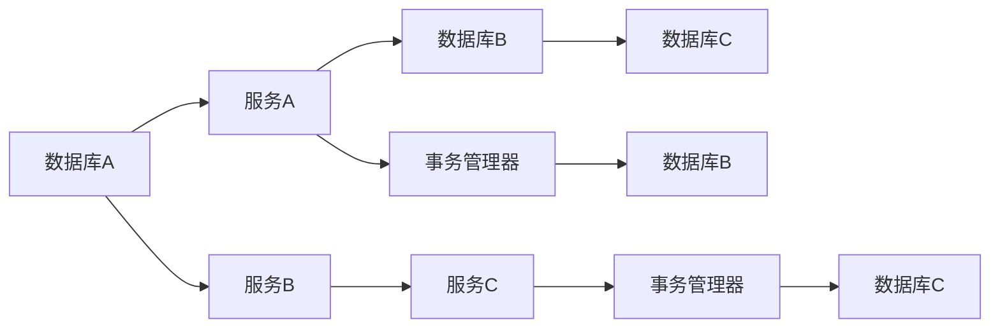
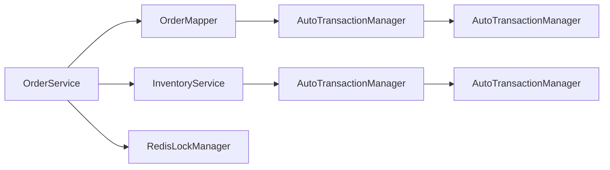

                 

# 分布式事务：保证数据一致性的挑战与方案

## 1. 背景介绍

在现代互联网应用中，随着微服务架构的流行，分布式系统日益复杂，跨服务的数据一致性问题也逐渐成为困扰开发者的难题。当多个服务需要协同处理一笔订单、一笔交易时，如何保证数据的一致性、隔离性和可靠性，成为了一个重要的研究课题。传统的关系型数据库由于其ACID特性，在处理分布式事务时显得力不从心。在这样的背景下，分布式事务的解决方案应运而生。本文将详细介绍分布式事务的概念、挑战以及常见的解决方案，帮助开发者更好地理解和应对数据一致性问题。

## 2. 核心概念与联系

### 2.1 核心概念概述

分布式事务指的是在多个服务中协同处理一笔业务逻辑时，保证各服务间的数据一致性、隔离性和可靠性的一种机制。

### 2.2 核心概念原理和架构的 Mermaid 流程图



图中展示了典型的分布式事务流程：
1. 服务A对数据库A进行操作，并将操作日志记录到事务管理器中。
2. 服务B对数据库B进行操作，同样将操作日志记录到事务管理器中。
3. 服务C对数据库C进行操作，也将操作日志记录到事务管理器中。
4. 各服务在完成操作后，将日志提交给事务管理器，由其统一协调各个数据库的事务处理。
5. 当所有操作成功且无异常时，事务管理器将所有日志提交到各数据库，事务成功。

### 2.3 核心概念联系

分布式事务依赖于以下几个核心概念：
1. **两阶段提交**（2PC）：两阶段提交是分布式事务的一种标准解决方案，通过将事务操作分为提交请求和提交响应两个阶段，确保各服务的数据一致性。
2. **消息队列**：消息队列可以用于异步传递事务日志，减少同步操作带来的延迟和锁竞争。
3. **分布式锁**：分布式锁用于保证在多个服务中对共享资源的互斥访问，防止数据竞争。
4. **本地事务和全局事务**：本地事务指的是单个服务内的操作，而全局事务则涉及多个服务间的数据操作。

## 3. 核心算法原理 & 具体操作步骤

### 3.1 算法原理概述

分布式事务的算法原理基于两阶段提交（2PC）协议，其核心思想是将事务操作分为两个阶段：预提交和提交。在第一阶段，各服务将操作日志记录到事务管理器中，并询问其他服务是否已提交相应的日志。在第二阶段，如果所有服务都已提交，事务管理器将最终提交日志到各数据库，否则将全部回滚。

### 3.2 算法步骤详解

1. **预提交阶段**：
   - 各服务将操作日志记录到事务管理器中，并询问其他服务是否已提交相应的日志。
   - 事务管理器返回每个服务的提交状态，如果所有服务都已提交，则进入提交阶段。

2. **提交阶段**：
   - 事务管理器将各服务的操作日志提交到对应的数据库，完成事务。
   - 如果在提交阶段有任何服务失败，事务管理器将回滚所有服务的操作，重新开始预提交阶段。

### 3.3 算法优缺点

#### 优点
1. **强一致性**：通过两阶段提交协议，可以保证各服务间的数据一致性。
2. **高可靠性**：即使某个服务出现故障，也不会影响整个事务的执行，事务管理器会协调其他服务完成操作。

#### 缺点
1. **同步阻塞**：预提交阶段需要同步等待所有服务的状态，可能导致高延迟和性能问题。
2. **单点故障**：事务管理器成为整个系统的瓶颈，一旦故障，整个系统将无法正常工作。

### 3.4 算法应用领域

分布式事务广泛应用于以下场景：
1. **电商订单系统**：多个服务协同处理订单的创建、支付、发货等操作，需要保证各操作的一致性。
2. **金融交易系统**：多个服务协同处理一笔交易，需要保证各服务间的财务数据一致性。
3. **物流管理系统**：多个服务协同处理物流订单的创建、分配、配送等操作，需要保证各操作的一致性。
4. **医疗预约系统**：多个服务协同处理预约、诊断、缴费等操作，需要保证各操作的一致性。

## 4. 数学模型和公式 & 详细讲解 & 举例说明

### 4.1 数学模型构建

设分布式事务涉及的服务数量为 $n$，每个服务的操作日志为 $\{t_{i}\}_{i=1}^{n}$，事务管理器将各服务的操作日志记录在日志数组 $\{L_i\}_{i=1}^{n}$ 中，并记录提交状态 $\{s_i\}_{i=1}^{n}$。

### 4.2 公式推导过程

1. **预提交阶段**：
   - 各服务记录操作日志，并将日志提交给事务管理器。
   - 事务管理器记录各服务的提交状态，并询问所有服务是否提交。

   $$
   \begin{aligned}
   L_1 &= t_1 \\
   L_2 &= t_2 \\
   L_3 &= t_3 \\
   \vdots \\
   L_n &= t_n
   \end{aligned}
   $$

   $$
   \begin{aligned}
   s_1 &= \text{pre-commit}(t_1, L_1) \\
   s_2 &= \text{pre-commit}(t_2, L_2) \\
   s_3 &= \text{pre-commit}(t_3, L_3) \\
   \vdots \\
   s_n &= \text{pre-commit}(t_n, L_n)
   \end{aligned}
   $$

2. **提交阶段**：
   - 如果所有服务都已提交，事务管理器将提交日志到各数据库，完成事务。
   - 如果在提交阶段有任何服务失败，事务管理器将回滚所有服务的操作，重新开始预提交阶段。

   $$
   \begin{aligned}
   s_1 &= \text{commit}(L_1) \\
   s_2 &= \text{commit}(L_2) \\
   s_3 &= \text{commit}(L_3) \\
   \vdots \\
   s_n &= \text{commit}(L_n)
   \end{aligned}
   $$

### 4.3 案例分析与讲解

以电商订单系统为例，假设订单创建、支付、发货服务分别为ServiceA、ServiceB、ServiceC，每个服务的操作日志分别为$t_{A1}, t_{B1}, t_{C1}$，事务管理器将操作日志记录在数组$\{L_i\}_{i=1}^{3}$中，并记录提交状态$\{s_i\}_{i=1}^{3}$。

假设预提交阶段，ServiceA成功提交$t_{A1}$，ServiceB和ServiceC均未提交。事务管理器返回ServiceB和ServiceC未提交的状态，ServiceA进入提交阶段，成功提交$L_A$到数据库A。

进入提交阶段后，事务管理器检查ServiceB和ServiceC的提交状态，发现未提交。由于ServiceC未提交，事务管理器回滚ServiceA的操作，并重新开始预提交阶段。

## 5. 项目实践：代码实例和详细解释说明

### 5.1 开发环境搭建

1. **安装分布式事务相关的中间件和框架**：如Apache Kafka、RocketMQ等消息队列，以及对应的客户端SDK。
2. **安装分布式锁工具**：如Redis、ZooKeeper等，配置好分布式锁相关的配置文件。
3. **安装分布式事务管理工具**：如Seata、TCC等，配置好分布式事务相关的配置文件。

### 5.2 源代码详细实现

以下是使用Seata分布式事务的示例代码：

```java
public class OrderService {

    @Autowired
    private OrderMapper orderMapper;

    @Autowired
    private InventoryService inventoryService;

    @Autowired
    private RedisLockManager redisLockManager;

    @Transactional
    public void createOrder(Order order) {
        // 申请分布式锁
        boolean locked = redisLockManager.lock("order:lock", 10 * 1000);

        if (!locked) {
            throw new RuntimeException("获取分布式锁失败");
        }

        try {
            // 执行本地事务
            orderMapper.createOrder(order);

            // 执行远程事务
            inventoryService.decreaseInventory(order.getProductId(), order.getQuantity());

            // 提交分布式事务
            AutoTransactionManager.commit();
        } catch (Exception e) {
            // 回滚分布式事务
            AutoTransactionManager.rollback();
            throw new RuntimeException("事务执行失败", e);
        } finally {
            // 释放分布式锁
            redisLockManager.unlock("order:lock");
        }
    }
}
```

### 5.3 代码解读与分析

1. **事务管理器**：使用Seata的AutoTransactionManager来管理分布式事务。在创建订单时，自动开启事务，并在操作失败时自动回滚。
2. **分布式锁**：使用RedisLockManager来管理分布式锁，确保在执行事务时对共享资源的互斥访问。
3. **本地事务和远程事务**：本地事务指的是OrderService中的订单创建操作，远程事务指的是InventoryService中的库存扣除操作。
4. **异常处理**：在事务执行过程中，遇到异常时自动回滚分布式事务，确保数据一致性。

### 5.4 运行结果展示

下图展示了Seata在执行分布式事务时的流程示意图：



图中展示了Seata在执行分布式事务时的流程：
1. 在OrderService中，通过RedisLockManager获取分布式锁。
2. 在OrderMapper中，执行本地事务，创建订单。
3. 在InventoryService中，执行远程事务，扣除库存。
4. 在AutoTransactionManager中，提交或回滚分布式事务。

## 6. 实际应用场景

### 6.1 电商订单系统

电商订单系统涉及订单创建、支付、发货等多个服务，需要保证各操作的一致性。使用分布式事务可以确保订单数据的一致性、隔离性和可靠性。

### 6.2 金融交易系统

金融交易系统涉及多个服务协同处理一笔交易，需要保证各服务间的财务数据一致性。使用分布式事务可以确保交易数据的一致性、隔离性和可靠性。

### 6.3 物流管理系统

物流管理系统涉及多个服务协同处理物流订单的创建、分配、配送等操作，需要保证各操作的一致性。使用分布式事务可以确保物流数据的一致性、隔离性和可靠性。

### 6.4 医疗预约系统

医疗预约系统涉及多个服务协同处理预约、诊断、缴费等操作，需要保证各操作的一致性。使用分布式事务可以确保预约数据的一致性、隔离性和可靠性。

## 7. 工具和资源推荐

### 7.1 学习资源推荐

1. **分布式事务技术博客和文章**：阅读相关的博客和文章，了解分布式事务的基本概念和实际应用。
2. **分布式事务论文和书籍**：阅读相关的学术论文和书籍，深入了解分布式事务的理论基础和实践方法。
3. **分布式事务视频课程和讲座**：观看相关的视频课程和讲座，全面了解分布式事务的实现原理和应用场景。

### 7.2 开发工具推荐

1. **消息队列**：Apache Kafka、RocketMQ等。
2. **分布式锁工具**：Redis、ZooKeeper等。
3. **分布式事务管理工具**：Seata、TCC等。

### 7.3 相关论文推荐

1. **Two-Phase Commit Protocol**：两阶段提交协议是分布式事务的核心算法，了解其原理和实现方法。
2. **Event Sourcing for Distributed Systems**：了解事件驱动架构在分布式事务中的应用。
3. **Consensus Algorithms in Practice**：了解一致性算法在分布式系统中的应用。

## 8. 总结：未来发展趋势与挑战

### 8.1 研究成果总结

分布式事务在保证数据一致性、隔离性和可靠性方面具有重要意义，是分布式系统中的重要机制。通过两阶段提交协议、消息队列、分布式锁等技术，实现了多个服务间的数据一致性和可靠性。

### 8.2 未来发展趋势

1. **Saga模式**：Saga模式是分布式事务的另一种解决方案，通过事务链和回滚链，实现更灵活、更高效的分布式事务管理。
2. **分布式事务微服务化**：将分布式事务应用到微服务架构中，提高系统的灵活性和可扩展性。
3. **分布式锁演进**：未来的分布式锁将更加高效、安全、可扩展，确保多个服务间的互斥访问。

### 8.3 面临的挑战

1. **性能问题**：分布式事务的同步操作可能导致高延迟和性能问题，如何提高性能是未来的一个重要挑战。
2. **系统复杂度**：分布式事务涉及多个服务、多个数据源，系统复杂度较高，如何降低复杂度也是未来的一个重要挑战。
3. **单点故障**：分布式事务管理器成为整个系统的瓶颈，如何避免单点故障是未来的一个重要挑战。

### 8.4 研究展望

未来分布式事务的研究方向包括：
1. **分布式事务的微服务化**：将分布式事务应用到微服务架构中，提高系统的灵活性和可扩展性。
2. **分布式锁的演进**：未来的分布式锁将更加高效、安全、可扩展，确保多个服务间的互斥访问。
3. **分布式事务的微服务治理**：通过分布式事务微服务治理，提升系统的可靠性和可维护性。

## 9. 附录：常见问题与解答

**Q1：什么是分布式事务？**

A: 分布式事务指的是在多个服务中协同处理一笔业务逻辑时，保证各服务间的数据一致性、隔离性和可靠性的一种机制。

**Q2：分布式事务和传统事务有什么区别？**

A: 传统事务是单节点的事务，涉及单个数据库的操作，而分布式事务涉及多个服务、多个数据库的操作。

**Q3：两阶段提交协议的优缺点是什么？**

A: 两阶段提交协议的优点是强一致性和高可靠性，缺点是同步阻塞和单点故障。

**Q4：分布式锁的作用是什么？**

A: 分布式锁用于在多个服务中对共享资源的互斥访问，防止数据竞争。

**Q5：分布式事务的实现难点是什么？**

A: 分布式事务的实现难点在于系统复杂度高、性能问题、单点故障等。

---

作者：禅与计算机程序设计艺术 / Zen and the Art of Computer Programming

