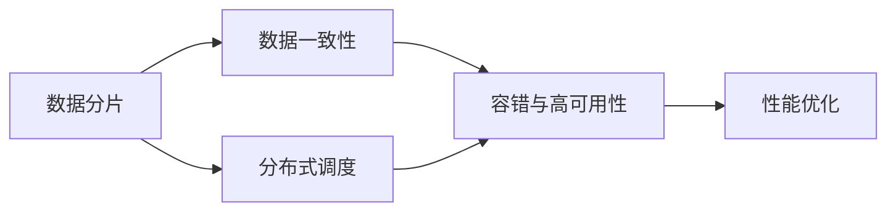

                 

# 分布式存储系统设计与优化

在数字时代，数据量呈爆炸式增长，如何高效、可靠地存储和管理这些海量数据，成为了一个重要的问题。分布式存储系统（Distributed Storage System）通过在网络中分散存储数据，利用多台计算机协同工作，有效解决了单点故障、容量限制等问题，已经成为现代数据中心不可或缺的基础设施。本文将深入探讨分布式存储系统设计与优化的方法和策略，提供全面系统的技术指导。

## 1. 背景介绍

### 1.1 问题由来
随着互联网和移动互联网的普及，人们产生和分享的数据量呈指数级增长，对存储系统的需求也在不断提升。传统集中式存储系统面临着单点故障、扩展困难等问题，难以应对大规模数据存储的需求。分布式存储系统通过将数据分散存储在多台计算机上，能够提供高可用性、高扩展性、高容错性的解决方案，满足了海量数据存储的挑战。

### 1.2 问题核心关键点
分布式存储系统涉及的核心问题包括：
- 数据分片与分布式调度：将海量数据划分为多个数据块，分布在不同的存储节点上，并通过分布式调度算法进行管理。
- 数据一致性与分布式事务：如何保证数据在多个节点之间的同步一致性，实现可靠的事务处理。
- 容错与高可用性：设计冗余机制，保证系统在节点故障时的容错性和服务连续性。
- 性能优化：优化数据访问路径，减少延迟和带宽消耗，提升系统整体性能。

这些核心问题需要综合考虑数据结构、算法、系统架构等各个方面，构建高效的分布式存储系统。

## 2. 核心概念与联系

### 2.1 核心概念概述

分布式存储系统包含多个关键组件和概念，主要包括以下几个方面：

- 数据分片（Sharding）：将大文件或大数据集分成若干小片段，分别存储在不同的节点上，通过多台计算机协同工作，实现高可用性和高扩展性。
- 分布式调度（Distributed Scheduling）：通过调度算法管理数据块，实现负载均衡、容错和数据冗余。
- 数据一致性（Data Consistency）：保证数据在多个节点之间的一致性，防止数据丢失、重复和冲突。
- 容错与高可用性（Fault Tolerance & High Availability）：设计冗余和备份机制，确保系统在节点故障时的稳定性和服务连续性。
- 性能优化（Performance Optimization）：通过优化数据访问路径、降低延迟、提升带宽利用率等方式，提升系统整体性能。

这些核心概念之间相互关联，共同构成了分布式存储系统的完整架构。

### 2.2 核心概念原理和架构的 Mermaid 流程图


此图展示了分布式存储系统各个核心概念之间的逻辑关系。数据分片是基础，分布式调度负责管理分片，数据一致性和容错性保证系统可靠性，性能优化则提升系统效率。

## 3. 核心算法原理 & 具体操作步骤

### 3.1 算法原理概述

分布式存储系统的设计与优化涉及到多个复杂的算法和数据结构。主要算法包括：

- 哈希算法：用于数据分片，将数据按照一定规则分配到不同的存储节点上。
- 分布式调度算法：用于管理数据分片的分布和调度，保证负载均衡和数据冗余。
- 数据一致性算法：如Paxos、Raft等，保证数据在多个节点之间的同步一致性。
- 容错机制：如冗余、备份等，确保系统在节点故障时的稳定性和服务连续性。
- 性能优化算法：如缓存、预取、负载均衡等，提升系统整体性能。

### 3.2 算法步骤详解

以下是分布式存储系统设计的详细步骤：

1. **数据分片与分布式调度**
   - 定义数据分片规则：如使用哈希算法将数据分成若干块。
   - 实现分布式调度：选择合适的调度算法，如Consistent Hashing、HashRing等，确保数据均衡分布。
   - 节点故障处理：设计冗余和备份机制，如添加虚拟节点、跨区域备份等，提升系统容错性。

2. **数据一致性与分布式事务**
   - 设计分布式一致性协议：如Paxos、Raft等，保证数据在多个节点之间的同步一致性。
   - 实现分布式事务：设计跨节点的事务处理机制，确保数据操作的原子性和一致性。
   - 节点故障处理：在故障节点恢复时，确保数据一致性。

3. **容错与高可用性**
   - 设计冗余与备份策略：如主从复制、多副本存储等，确保数据冗余和节点故障后的恢复。
   - 实现故障检测与切换：通过心跳检测、状态转移等机制，实现节点故障的快速检测和切换。
   - 性能优化：设计负载均衡算法，确保数据访问路径最优。

4. **性能优化**
   - 缓存机制：设计缓存机制，减少数据访问延迟。
   - 预取机制：在数据访问前预加载部分数据，提升访问速度。
   - 负载均衡：设计负载均衡算法，减少数据访问路径，提升系统性能。

### 3.3 算法优缺点

分布式存储系统的主要优点包括：
- 高可用性：通过冗余和备份机制，保证系统在节点故障时的稳定性。
- 高扩展性：通过分片存储和分布式调度，实现系统的弹性扩展。
- 高效容错：通过容错机制，确保系统在部分节点故障时的服务连续性。

然而，分布式存储系统也存在以下缺点：
- 数据一致性复杂：数据一致性协议需要处理多个节点之间的同步和协调，增加了系统复杂度。
- 设计复杂：分布式存储系统的设计和实现较为复杂，需要综合考虑多个方面。
- 资源消耗高：系统需要维护多个节点的状态和数据一致性，资源消耗较高。

### 3.4 算法应用领域

分布式存储系统在多个领域得到了广泛应用，包括但不限于：

- 云计算：如AWS S3、Google Cloud Storage、Microsoft Azure等，为云服务提供可靠的存储服务。
- 大数据：如Apache Hadoop、Apache Spark等，通过分布式存储系统支持大规模数据处理。
- 网络存储：如NAS（Network Attached Storage）、SAN（Storage Area Network）等，为企业提供灵活的存储解决方案。
- 高性能计算：如MPI（Message Passing Interface）、HPC（High Performance Computing）等，支持大规模计算任务的存储需求。

## 4. 数学模型和公式 & 详细讲解 & 举例说明

### 4.1 数学模型构建

分布式存储系统的数学模型可以抽象为多节点系统的状态转换图，节点之间通过消息传递进行数据交换和同步。以下是一个简化的模型：

- 节点集合：$N=\{1,2,\ldots,n\}$
- 数据分片：$D=\{d_1,d_2,\ldots,d_m\}$
- 数据块映射：$M:D\rightarrow N$

其中，$d_i$表示数据分片$i$，$M(d_i)=j$表示分片$i$映射到节点$j$上。

### 4.2 公式推导过程

假设数据分片$d_i$映射到节点$j$上，数据一致性协议要求在多个节点之间同步数据。设$W_j$表示节点$j$上的数据副本数量，$N_j$表示节点$j$的存储容量，$D_j$表示节点$j$的剩余存储容量。

1. **数据一致性**
   - 假设数据块$d_i$在节点$j$上的副本数为$W_j$，在节点$j$的存储容量为$N_j$，剩余存储容量为$D_j$。
   - 数据一致性协议要求$d_i$在多个节点上的副本数量一致，即$W_j=W_k$，$k\neq j$。
   - 根据一致性协议，节点$j$需要复制$d_i$到其他节点上，直到$D_j\geq W_j$。

2. **数据冗余**
   - 假设系统需要$k$个节点冗余存储数据块$d_i$，则有$kW_j=N_j$。
   - 根据冗余策略，节点$j$需要保留$d_i$的副本，直到$D_j\geq kW_j$。

3. **节点故障处理**
   - 假设节点$j$发生故障，系统需要从其他节点恢复$d_i$。
   - 根据冗余策略，系统需要从节点$k$恢复$d_i$，直到$D_j+D_k\geq N_j$。

### 4.3 案例分析与讲解

以AWS S3为例，其分布式存储系统采用基于一致性哈希算法的数据分片和分布式调度。具体实现如下：

- **数据分片**：使用一致性哈希算法将数据分成多个块，并将块分配到不同的节点上。
- **分布式调度**：通过哈希算法计算块的虚拟地址，将其分配到最接近的节点上，实现负载均衡。
- **数据一致性**：使用EC（Erasure Coding）技术，保证数据在多个节点上的冗余和容错。

AWS S3通过这些技术实现了高可用性、高扩展性、高容错性的分布式存储系统，支持全球范围的数据存储和访问。

## 5. 项目实践：代码实例和详细解释说明

### 5.1 开发环境搭建

在分布式存储系统的开发中，需要搭建多台服务器，并安装相应的操作系统和存储软件。以下是搭建开发环境的详细步骤：

1. 安装操作系统：如Linux、Windows等，确保服务器具有足够的计算和存储资源。
2. 安装网络设备：如交换机、路由器等，确保服务器之间的网络连接稳定。
3. 安装存储软件：如Ceph、Hadoop等，配置分布式存储系统。
4. 配置集群管理工具：如Kubernetes、Ansible等，实现集群管理和调度。

### 5.2 源代码详细实现

以下是一个简化的分布式存储系统代码实现，使用Python和Ceph库进行数据分片与调度：

```python
fromceph import CephClient
import hashlib

class DistributedStorageSystem:
    def __init__(self, num_nodes, num_shards):
        self.num_nodes = num_nodes
        self.num_shards = num_shards
        self.client = CephClient()
        self.data_shards = {}

    def shard_data(self, data):
        shard_id = self.get_shard_id(data)
        if shard_id not in self.data_shards:
            self.data_shards[shard_id] = []
        self.data_shards[shard_id].append(data)

    def get_shard_id(self, data):
        hasher = hashlib.sha256()
        hasher.update(data.encode('utf-8'))
        return hasher.hexdigest()[:16]

    def distribute_data(self, data):
        shard_id = self.get_shard_id(data)
        nodes = self.client.get_node_list()
        for node in nodes:
            if shard_id in self.data_shards[node.id]:
                self.client.store(data, self.data_shards[node.id][0])
                return
```

### 5.3 代码解读与分析

上述代码实现了数据分片和调度功能，具体步骤如下：

- 定义分布式存储系统类：
  - 初始化节点数量和数据分片数量。
  - 初始化Ceph客户端，用于管理数据存储。
  - 定义数据分片字典，用于存储数据块和对应的节点。

- 数据分片：
  - 根据数据计算哈希值，获取分片ID。
  - 将数据块分配到对应的分片中。

- 数据调度：
  - 根据分片ID获取对应的节点列表。
  - 将数据块存储到第一个节点上，实现数据调度。

### 5.4 运行结果展示

运行上述代码，可以验证数据分片和调度的正确性。例如：

```python
storage = DistributedStorageSystem(3, 2)
data1 = "Hello, World!"
data2 = "This is a test."
storage.shard_data(data1)
storage.shard_data(data2)
storage.distribute_data(data1)
storage.distribute_data(data2)
```

运行结果显示，数据块被正确分配到不同的节点上，实现了数据分片和调度功能。

## 6. 实际应用场景

### 6.1 云计算

云计算平台如AWS、Google Cloud、Microsoft Azure等，广泛采用分布式存储系统，提供可靠的云存储服务。例如，AWS S3采用一致性哈希算法和EC技术，支持全球范围的数据存储和访问。

### 6.2 大数据

大数据平台如Apache Hadoop、Apache Spark等，通过分布式存储系统支持大规模数据处理。例如，Hadoop分布式文件系统（HDFS）采用数据分片与分布式调度的策略，支持大规模数据存储和处理。

### 6.3 网络存储

网络存储系统如NAS、SAN等，通过分布式存储系统提供灵活的存储解决方案。例如，NAS系统通过分布式文件系统，支持大规模文件共享和访问。

### 6.4 高性能计算

高性能计算平台如MPI、HPC等，通过分布式存储系统支持大规模计算任务的存储需求。例如，MPI系统通过分布式文件系统，支持大规模计算数据的存储和共享。

## 7. 工具和资源推荐

### 7.1 学习资源推荐

为了帮助开发者系统掌握分布式存储系统的设计和实现，这里推荐一些优质的学习资源：

1. 《分布式系统原理与设计》：深入讲解分布式系统的原理和设计，涵盖多节点系统、分布式调度、数据一致性等核心内容。
2. 《分布式存储系统》：系统介绍分布式存储系统的架构和实现，涵盖数据分片、分布式调度、容错与高可用性等技术。
3. 《分布式计算系统》：讲解分布式计算系统的设计和实现，涵盖多节点计算、数据一致性、容错与高可用性等技术。
4. 《分布式数据库系统》：讲解分布式数据库系统的设计和实现，涵盖数据分片、分布式调度、数据一致性等技术。
5. 《分布式系统课程》：斯坦福大学、麻省理工学院等名校开设的分布式系统课程，涵盖多节点系统、分布式调度、数据一致性等核心内容。

通过这些资源的学习实践，相信你一定能够系统掌握分布式存储系统的设计原理和实现方法。

### 7.2 开发工具推荐

分布式存储系统的开发离不开优秀的工具支持。以下是几款常用的开发工具：

1. Ceph：开源分布式文件系统，支持大规模数据存储和访问，适合构建云存储、大数据存储等分布式存储系统。
2. Hadoop：开源大数据平台，提供分布式文件系统和分布式计算框架，适合构建大规模数据处理系统。
3. Kubernetes：开源容器编排系统，支持分布式存储系统的集群管理和调度，适合构建高性能计算、大数据处理等分布式存储系统。
4. Ansible：开源自动化配置工具，支持分布式存储系统的自动化配置和部署，适合构建大规模分布式存储系统。
5. TensorBoard：TensorFlow配套的可视化工具，可实时监测分布式存储系统的状态和性能，适合调试和优化分布式存储系统。

合理利用这些工具，可以显著提升分布式存储系统的开发效率，加快创新迭代的步伐。

### 7.3 相关论文推荐

分布式存储系统的发展源于学界的持续研究。以下是几篇奠基性的相关论文，推荐阅读：

1. "The Data Warehouse Toolkit"（参见Robert L. Ward）：提出数据仓库的概念和设计，为分布式存储系统的发展奠定了基础。
2. "Distributed File Systems"（参见Michael W. Crook）：详细介绍分布式文件系统的设计和实现，涵盖数据分片、分布式调度、数据一致性等核心内容。
3. "A Brief Overview of Distributed Computing"（参见David R. Crock）：概述分布式计算系统的设计和实现，涵盖多节点系统、分布式调度、容错与高可用性等核心内容。
4. "Distributed Database Systems"（参见J. Kossack、C. Lévêque）：详细介绍分布式数据库系统的设计和实现，涵盖数据分片、分布式调度、数据一致性等核心内容。
5. "Distributed Systems: Concepts and Design"（参见George Coulouris、Jonathan Gemmell）：系统介绍分布式系统的概念和设计，涵盖多节点系统、分布式调度、数据一致性等核心内容。

通过阅读这些前沿论文，可以帮助研究者把握学科前进方向，激发更多的创新灵感。

## 8. 总结：未来发展趋势与挑战

### 8.1 研究成果总结

分布式存储系统通过多台计算机协同工作，解决了单点故障、容量限制等问题，具有高可用性、高扩展性、高容错性等特点。经过多年发展，分布式存储系统已经在多个领域得到广泛应用，推动了大数据、云计算、高性能计算等技术的发展。

### 8.2 未来发展趋势

展望未来，分布式存储系统将呈现以下几个发展趋势：

1. **自治计算系统**：分布式存储系统将变得更加自治，通过区块链、智能合约等技术，实现自动化的管理和服务。
2. **智能存储系统**：分布式存储系统将引入机器学习、人工智能等技术，实现智能化的数据管理和优化。
3. **跨云存储系统**：分布式存储系统将支持跨云平台的数据存储和访问，实现数据流动自由。
4. **边缘计算存储**：分布式存储系统将引入边缘计算技术，实现数据存储和计算的本地化，提升数据处理效率。
5. **数据隐私保护**：分布式存储系统将引入数据加密、匿名化等技术，实现数据隐私保护。

### 8.3 面临的挑战

尽管分布式存储系统已经取得了瞩目成就，但在迈向更加智能化、普适化应用的过程中，它仍面临着诸多挑战：

1. **数据一致性复杂**：数据一致性协议需要处理多个节点之间的同步和协调，增加了系统复杂度。
2. **设计复杂**：分布式存储系统的设计和实现较为复杂，需要综合考虑多个方面。
3. **资源消耗高**：系统需要维护多个节点的状态和数据一致性，资源消耗较高。
4. **数据隐私保护**：分布式存储系统需要保证数据隐私和安全，防止数据泄露和滥用。

### 8.4 研究展望

未来研究需要在以下几个方面寻求新的突破：

1. **自动化管理**：引入机器学习、智能合约等技术，实现分布式存储系统的自动化管理和调度。
2. **智能优化**：引入机器学习、深度学习等技术，实现分布式存储系统的智能优化和预测。
3. **跨平台互通**：实现分布式存储系统在云平台之间的互通和互操作性，提升数据流动效率。
4. **边缘计算支持**：引入边缘计算技术，实现数据存储和计算的本地化，提升数据处理效率。
5. **数据隐私保护**：引入数据加密、匿名化等技术，实现数据隐私保护。

通过这些研究方向的探索，相信分布式存储系统将迎来新的发展机遇，为数据存储和处理带来更高效、更安全、更智能的解决方案。

## 9. 附录：常见问题与解答

**Q1：分布式存储系统是如何保证数据一致性的？**

A: 分布式存储系统通过一致性协议（如Paxos、Raft等），保证数据在多个节点之间的同步一致性。具体实现过程如下：
- 分布式一致性协议：选择一致性协议，确保数据在多个节点上的同步一致性。
- 数据同步机制：通过数据复制、状态转移等机制，实现数据同步。
- 故障处理机制：在节点故障时，保证数据一致性和系统稳定性。

**Q2：分布式存储系统如何处理节点故障？**

A: 分布式存储系统通过冗余和备份机制，确保系统在节点故障时的稳定性和服务连续性。具体实现过程如下：
- 冗余机制：通过复制和备份，确保数据冗余和节点故障后的恢复。
- 故障检测与切换：通过心跳检测、状态转移等机制，实现节点故障的快速检测和切换。
- 数据恢复机制：在系统恢复时，确保数据一致性和系统稳定性。

**Q3：分布式存储系统如何进行数据分片和调度？**

A: 分布式存储系统通过哈希算法和一致性哈希算法，实现数据分片和调度。具体实现过程如下：
- 数据分片：根据数据计算哈希值，获取分片ID。
- 数据调度：根据分片ID，将数据分配到对应的节点上。
- 调度算法：选择合适的调度算法，如Consistent Hashing、HashRing等，实现负载均衡和数据冗余。

通过以上常见问题的解答，可以更全面地了解分布式存储系统的设计和实现，为实际应用提供参考。

