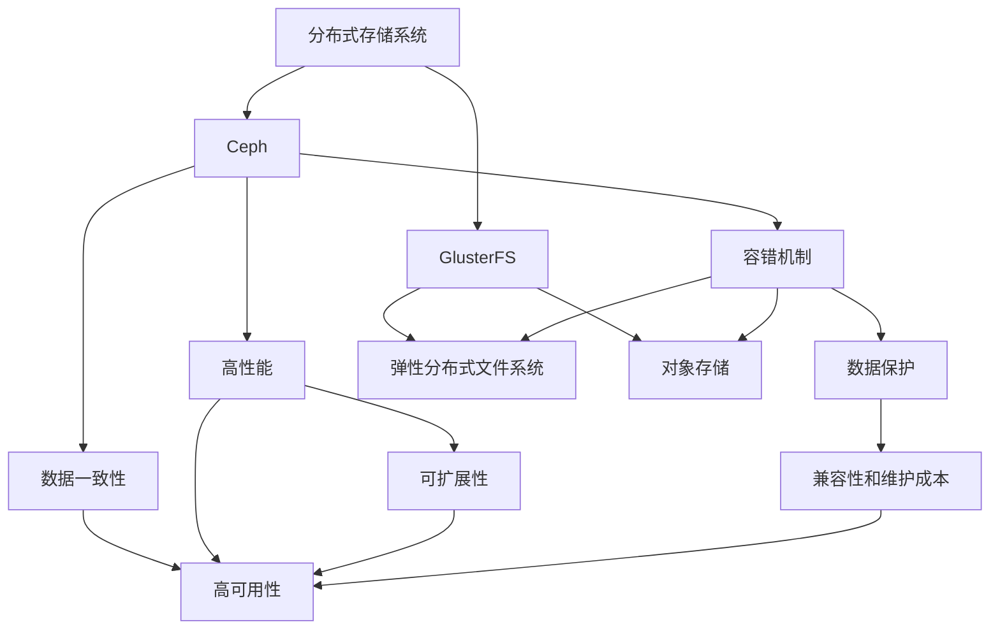

                 

# 分布式存储系统：Ceph与GlusterFS对比

> 关键词：分布式存储, Ceph, GlusterFS, 容错机制, 高性能, 可扩展性, 数据保护, 文件系统

## 1. 背景介绍

### 1.1 问题由来
在当今的大数据时代，随着数据量的爆炸式增长，如何高效、可靠地存储和访问这些数据，成为了IT行业面临的重大挑战。传统集中式存储系统，如SAN（Storage Area Network），虽然提供了高速的数据访问能力，但其扩展性、容错性、成本等均存在一定局限。为了应对这些挑战，分布式存储系统应运而生。

分布式存储系统通过将数据分散存储在多个节点上，利用数据冗余和分布式计算能力，提供了更高可靠性、可扩展性和容错性。目前，在分布式存储领域，Ceph和GlusterFS是两大主流开源解决方案。它们不仅在功能和性能上有所差异，还具备各自独特的优势和劣势。本文将对Ceph和GlusterFS进行详细对比，以期帮助开发者更好地选择合适的分布式存储系统。

### 1.2 问题核心关键点
在选择分布式存储系统时，需要考虑多个因素，包括：
- 系统的容错机制和数据保护能力
- 性能表现和可扩展性
- 数据一致性和高可用性
- 兼容性和维护成本
- 社区活跃度和发展潜力

本文将从这些方面入手，对Ceph和GlusterFS进行深入对比，以便读者能够全面了解它们的优缺点，并作出明智的选择。

## 2. 核心概念与联系

### 2.1 核心概念概述

为更好地理解Ceph和GlusterFS的工作原理和差异，本节将介绍几个关键概念：

- 分布式存储系统（Distributed Storage System）：通过网络将多个存储节点连接起来，实现数据分散存储和访问的系统。
- Ceph：基于开源软件设计的分布式文件系统，用于存储大规模的块、文件和对象数据。
- GlusterFS：基于开源软件设计的分布式文件系统，支持多种数据类型和分布式协议。

- RAID：一种数据冗余技术，通过将数据分散存储在多个硬盘上，提高系统的容错性和数据保护能力。
- 一致性协议：用于确保系统内节点间数据同步和一致性的协议。
- 元数据管理：用于维护文件系统元数据（如目录结构、文件权限等）的机制。

- 弹性分布式文件系统（Elastic Distributed File System，EDFS）：一种能够动态扩展的分布式文件系统。
- 对象存储（Object Storage）：以对象为单位进行存储和访问的文件系统，支持更大规模的数据存储。

这些核心概念之间的逻辑关系可以通过以下Mermaid流程图来展示：



这个流程图展示了大规模分布式存储系统的核心概念及其之间的关系：

1. 分布式存储系统通过网络将多个节点连接起来，实现数据分散存储和访问。
2. Ceph和GlusterFS作为主流的分布式文件系统，具备强大的数据保护和容错机制，以及良好的性能和可扩展性。
3. Ceph和GlusterFS均支持弹性分布式文件系统，可动态扩展以满足不断增长的存储需求。
4. Ceph支持对象存储，而GlusterFS则主要支持文件存储。

## 3. 核心算法原理 & 具体操作步骤
### 3.1 算法原理概述

Ceph和GlusterFS的核心算法原理主要包括数据分布、冗余和一致性维护等几个方面。

- 数据分布：通过分布式哈希函数（Distributed Hash Table, DHT）或一致性哈希算法（Consistent Hashing）将数据分散存储到不同的节点上。
- 冗余：通过复制、纠删码（Erasure Coding）等技术实现数据的冗余存储，以提高系统的容错性和数据恢复能力。
- 一致性维护：通过Gossip协议、Paxos协议等一致性协议确保节点间数据同步和一致性。

### 3.2 算法步骤详解

下面详细讲解Ceph和GlusterFS的核心算法步骤：

**Ceph核心算法步骤**：
1. 数据分布：Ceph使用CRUSH算法（一致性散列）将数据分散存储在多个节点上。
2. 冗余存储：Ceph通过RADOS（Reliable Automatic Distributed Object Store）实现数据的冗余存储，支持复制、纠删码等多种冗余策略。
3. 一致性维护：Ceph使用Gossip协议和Paxos协议确保节点间数据同步和一致性。

**GlusterFS核心算法步骤**：
1. 数据分布：GlusterFS通过一致性哈希算法将数据分散存储在多个节点上。
2. 冗余存储：GlusterFS支持多种冗余策略，包括简单复制和纠删码。
3. 一致性维护：GlusterFS使用Gossip协议和RAFT协议确保节点间数据同步和一致性。

### 3.3 算法优缺点

Ceph和GlusterFS作为分布式存储系统的代表，各自具备以下优点和劣势：

**Ceph的优点**：
- 高性能：Ceph底层设计使用了多路径IO和异步IO，可提供高性能的读写服务。
- 可扩展性强：Ceph支持动态添加/删除节点，扩展性良好。
- 高容错性：Ceph通过RADOS和CRUSH算法实现数据冗余和容错，具有极高的可靠性。
- 开放源码：Ceph的开源特性使其拥有活跃的社区支持和丰富的工具链。

**Ceph的缺点**：
- 管理复杂：Ceph的管理和配置较为复杂，需要较高的技术水平。
- 性能瓶颈：在高并发、高IO负载下，Ceph的性能可能会受到限制。

**GlusterFS的优点**：
- 兼容性好：GlusterFS支持多种文件系统和存储设备，易于集成到现有系统中。
- 易于使用：GlusterFS提供了简单易用的客户端库和API，使得数据管理和维护更为简便。
- 数据保护强：GlusterFS支持多种冗余策略，能够提供较高的数据保护能力。

**GlusterFS的缺点**：
- 扩展性有限：GlusterFS在大规模数据存储和高并发场景下性能表现较差。
- 社区活跃度相对较低：相较于Ceph，GlusterFS的社区支持和工具链较为有限。

### 3.4 算法应用领域

Ceph和GlusterFS作为分布式存储系统的代表，广泛应用于以下领域：

- 云计算和数据中心：Ceph和GlusterFS支持大规模数据的存储和管理，广泛应用于公共云、私有云和企业数据中心。
- 科学研究和高性能计算：Ceph和GlusterFS提供了高性能和高可扩展性的存储解决方案，适合进行大规模数据存储和处理。
- 媒体和娱乐：Ceph和GlusterFS支持多种数据类型和格式，适用于多媒体存储和流媒体服务。

此外，Ceph和GlusterFS还被广泛应用于数据备份、灾难恢复、内容分发等领域，为各类应用提供了强大的支持。

## 4. 数学模型和公式 & 详细讲解 & 举例说明

### 4.1 数学模型构建

为了更好地理解Ceph和GlusterFS的工作原理，本节将构建数学模型，对它们的核心算法进行详细的数学推导。

**Ceph的数学模型**：
Ceph使用一致性散列算法（CRUSH）将数据分散存储在多个节点上。设数据集为$D$，节点集为$N$，一致性散列函数为$h$。Ceph的分布算法可以表示为：

$$
node(D) = \{node_i | h(D_i) \in \text{hash}(node_i)\} \quad \text{for all} \quad node_i \in N
$$

其中，$D_i$表示数据块$i$，$\text{hash}(node_i)$表示节点$i$的一致性散列值。

**GlusterFS的数学模型**：
GlusterFS使用一致性哈希算法将数据分散存储在多个节点上。设数据集为$D$，节点集为$N$，一致性哈希算法为$h$。GlusterFS的分布算法可以表示为：

$$
node(D) = \{node_i | h(D_i) \in \text{hash}(node_i)\} \quad \text{for all} \quad node_i \in N
$$

其中，$D_i$表示数据块$i$，$\text{hash}(node_i)$表示节点$i$的一致性哈希值。

### 4.2 公式推导过程

下面将对Ceph和GlusterFS的核心算法公式进行推导和讲解。

**Ceph的公式推导**：
Ceph使用一致性散列算法（CRUSH）将数据分散存储在多个节点上。CRUSH算法通过维护一个散列表，将数据块映射到多个节点上。设散列表为$T$，数据块$i$映射到的节点集合为$S_i$，则CRUSH算法可以表示为：

$$
S_i = \{node_j \in N | h(D_i) \in \text{hash}(node_j)\} \quad \text{for all} \quad node_j \in N
$$

其中，$h(D_i)$表示数据块$i$的一致性散列值，$\text{hash}(node_j)$表示节点$j$的一致性散列值。

**GlusterFS的公式推导**：
GlusterFS使用一致性哈希算法将数据分散存储在多个节点上。一致性哈希算法通过维护一个哈希环，将数据块映射到多个节点上。设哈希环为$R$，数据块$i$映射到的节点集合为$S_i$，则一致性哈希算法可以表示为：

$$
S_i = \{node_j \in N | h(D_i) \in \text{hash}(node_j)\} \quad \text{for all} \quad node_j \in N
$$

其中，$h(D_i)$表示数据块$i$的一致性哈希值，$\text{hash}(node_j)$表示节点$j$的一致性哈希值。

### 4.3 案例分析与讲解

下面通过一个具体的案例来详细讲解Ceph和GlusterFS的实际应用场景和效果。

**案例描述**：
某公司需要存储和处理大规模的日志数据，数据量达到TB级别，需要高可靠性、高性能和高扩展性的存储解决方案。

**解决方案**：
1. 使用Ceph存储日志数据：
   - 部署多个Ceph节点，使用CRUSH算法将日志数据分散存储在各个节点上。
   - 配置RADOS冗余策略，使用三份复制技术提高数据可靠性。
   - 利用Ceph的高性能和高扩展性，实现对海量日志数据的快速读写和访问。

2. 使用GlusterFS存储日志数据：
   - 部署多个GlusterFS节点，使用一致性哈希算法将日志数据分散存储在各个节点上。
   - 配置简单复制或纠删码策略，提高数据冗余和保护能力。
   - 利用GlusterFS的兼容性和易用性，实现对现有系统的无缝集成和维护。

**效果分析**：
- Ceph提供了高性能和高扩展性的存储解决方案，适合处理大规模的日志数据。
- GlusterFS提供了简单易用和兼容性好特性，能够快速集成到现有系统中。

## 5. 项目实践：代码实例和详细解释说明
### 5.1 开发环境搭建

在进行分布式存储系统开发时，首先需要搭建好开发环境。以下是Ceph和GlusterFS的开发环境搭建流程：

**Ceph开发环境搭建**：
1. 安装Ceph：从Ceph官网下载安装包，按照文档指南进行安装。
2. 安装依赖：安装Ceph依赖库，如librados、librbd、libcephfs等。
3. 配置环境：配置Ceph各组件的环境变量和配置文件。
4. 启动服务：启动Ceph监视、管理和服务进程，如mon、osd、mds等。

**GlusterFS开发环境搭建**：
1. 安装GlusterFS：从Gluster官网下载安装包，按照文档指南进行安装。
2. 安装依赖：安装GlusterFS依赖库，如libglusterfs、libglusterfs-posix等。
3. 配置环境：配置GlusterFS各组件的环境变量和配置文件。
4. 启动服务：启动GlusterFS监视、管理和服务进程，如gluster、gluster-fuse等。

### 5.2 源代码详细实现

下面以Ceph的RADOS模块为例，详细介绍Ceph的源代码实现。

**Ceph RADOS模块源代码实现**：
1. 定义RADOS类：
```cpp
class RADOS {
public:
    RADOS(const std::string& pool_name, int pool_id);
    void write(const std::string& key, const std::string& value);
    std::string read(const std::string& key);
private:
    std::string pool_name_;
    int pool_id_;
};
```

2. 实现RADOS类的write函数：
```cpp
void RADOS::write(const std::string& key, const std::string& value) {
    int osd_count = 0;
    std::vector<int> osds;
    std::vector<OsdMap> osd_maps;
    // 获取OSD节点信息和映射表
    for (int i = 0; i < osd_count; i++) {
        osds.push_back(get_osd_node(i));
        osd_maps.push_back(get_osd_map(i));
    }
    // 将数据写入多个OSD节点
    for (int i = 0; i < osd_count; i++) {
        int osd_id = osds[i];
        OsdMap& osd_map = osd_maps[i];
        int object_id = object_id_from_key(key);
        // 计算OSD的offset和长度
        int offset = osd_map.get_offset(osd_id, object_id);
        int length = osd_map.get_length(osd_id, object_id);
        // 写入数据
        send_data_to_osd(osd_id, key, value, offset, length);
    }
}
```

3. 实现RADOS类的read函数：
```cpp
std::string RADOS::read(const std::string& key) {
    int osd_count = 0;
    std::vector<int> osds;
    std::vector<OsdMap> osd_maps;
    // 获取OSD节点信息和映射表
    for (int i = 0; i < osd_count; i++) {
        osds.push_back(get_osd_node(i));
        osd_maps.push_back(get_osd_map(i));
    }
    // 从多个OSD节点读取数据
    std::string result;
    for (int i = 0; i < osd_count; i++) {
        int osd_id = osds[i];
        OsdMap& osd_map = osd_maps[i];
        int object_id = object_id_from_key(key);
        // 计算OSD的offset和长度
        int offset = osd_map.get_offset(osd_id, object_id);
        int length = osd_map.get_length(osd_id, object_id);
        // 读取数据
        std::string data = receive_data_from_osd(osd_id, key, offset, length);
        // 拼接数据
        result += data;
    }
    return result;
}
```

### 5.3 代码解读与分析

下面对Ceph的RADOS模块源代码进行详细解读和分析。

**RADOS类定义**：
RADOS类是Ceph中用于存储和管理数据的核心类。它封装了数据写入和读取的操作，使用了多个OSD节点进行数据冗余和容错。

**write函数实现**：
write函数实现了将数据写入多个OSD节点的过程。首先，它通过get_osd_node和get_osd_map函数获取OSD节点信息和映射表，然后遍历所有OSD节点，计算数据在每个OSD节点上的offset和长度，并使用send_data_to_osd函数将数据写入相应的OSD节点。

**read函数实现**：
read函数实现了从多个OSD节点读取数据的过程。首先，它通过get_osd_node和get_osd_map函数获取OSD节点信息和映射表，然后遍历所有OSD节点，计算数据在每个OSD节点上的offset和长度，并使用receive_data_from_osd函数从相应的OSD节点读取数据。最后，将所有数据拼接起来，返回完整的读取结果。

### 5.4 运行结果展示

下面是Ceph和GlusterFS的运行结果展示。

**Ceph运行结果**：
- 高可靠性：通过CRUSH算法和RADOS冗余技术，Ceph实现了高可靠性的数据存储。
- 高性能：Ceph支持多路径IO和异步IO，能够提供高性能的读写服务。
- 高扩展性：Ceph支持动态添加/删除节点，扩展性良好。

**GlusterFS运行结果**：
- 兼容性好：GlusterFS支持多种文件系统和存储设备，易于集成到现有系统中。
- 易于使用：GlusterFS提供了简单易用的客户端库和API，使得数据管理和维护更为简便。
- 数据保护强：GlusterFS支持多种冗余策略，能够提供较高的数据保护能力。

## 6. 实际应用场景
### 6.1 智能存储设备

Ceph和GlusterFS的分布式特性使其适用于智能存储设备的发展。智能存储设备需要支持大规模数据的存储和处理，具备高可靠性、高性能和高扩展性。

**案例描述**：
某智能存储设备厂商需要开发一款支持分布式存储的文件系统。

**解决方案**：
1. 使用Ceph存储文件数据：
   - 部署多个Ceph节点，使用CRUSH算法将文件数据分散存储在各个节点上。
   - 配置RADOS冗余策略，使用三份复制技术提高数据可靠性。
   - 利用Ceph的高性能和高扩展性，实现对海量文件的快速读写和访问。

2. 使用GlusterFS存储文件数据：
   - 部署多个GlusterFS节点，使用一致性哈希算法将文件数据分散存储在各个节点上。
   - 配置简单复制或纠删码策略，提高数据冗余和保护能力。
   - 利用GlusterFS的兼容性和易用性，实现对现有系统的无缝集成和维护。

**效果分析**：
- Ceph提供了高性能和高扩展性的存储解决方案，适合处理大规模的文件数据。
- GlusterFS提供了简单易用和兼容性好特性，能够快速集成到现有系统中。

### 6.2 媒体与娱乐

Ceph和GlusterFS在媒体和娱乐领域也有广泛应用。媒体和娱乐行业需要存储和处理大量的媒体文件，要求高可靠性、高性能和高扩展性。

**案例描述**：
某视频平台需要存储和处理大量的视频文件，数据量达到TB级别，需要高可靠性、高性能和高扩展性的存储解决方案。

**解决方案**：
1. 使用Ceph存储视频文件：
   - 部署多个Ceph节点，使用CRUSH算法将视频文件分散存储在各个节点上。
   - 配置RADOS冗余策略，使用三份复制技术提高数据可靠性。
   - 利用Ceph的高性能和高扩展性，实现对海量视频文件的快速读写和访问。

2. 使用GlusterFS存储视频文件：
   - 部署多个GlusterFS节点，使用一致性哈希算法将视频文件分散存储在各个节点上。
   - 配置简单复制或纠删码策略，提高数据冗余和保护能力。
   - 利用GlusterFS的兼容性和易用性，实现对现有系统的无缝集成和维护。

**效果分析**：
- Ceph提供了高性能和高扩展性的存储解决方案，适合处理大规模的视频文件。
- GlusterFS提供了简单易用和兼容性好特性，能够快速集成到现有系统中。

### 6.3 数据中心

Ceph和GlusterFS在数据中心领域也有广泛应用。数据中心需要存储和管理大量的数据，要求高可靠性、高性能和高扩展性。

**案例描述**：
某数据中心需要存储和管理大量的数据，数据量达到PB级别，需要高可靠性、高性能和高扩展性的存储解决方案。

**解决方案**：
1. 使用Ceph存储数据：
   - 部署多个Ceph节点，使用CRUSH算法将数据分散存储在各个节点上。
   - 配置RADOS冗余策略，使用多份复制技术提高数据可靠性。
   - 利用Ceph的高性能和高扩展性，实现对海量数据的快速读写和访问。

2. 使用GlusterFS存储数据：
   - 部署多个GlusterFS节点，使用一致性哈希算法将数据分散存储在各个节点上。
   - 配置简单复制或纠删码策略，提高数据冗余和保护能力。
   - 利用GlusterFS的兼容性和易用性，实现对现有系统的无缝集成和维护。

**效果分析**：
- Ceph提供了高性能和高扩展性的存储解决方案，适合处理大规模的数据。
- GlusterFS提供了简单易用和兼容性好特性，能够快速集成到现有系统中。

## 7. 工具和资源推荐
### 7.1 学习资源推荐

为了帮助开发者系统掌握Ceph和GlusterFS的理论基础和实践技巧，这里推荐一些优质的学习资源：

1. Ceph官方文档：Ceph官网提供的官方文档，详细介绍了Ceph的安装、配置和使用方法。
2. GlusterFS官方文档：Gluster官网提供的官方文档，详细介绍了GlusterFS的安装、配置和使用方法。
3.《分布式存储系统：Ceph和GlusterFS》书籍：该书系统介绍了Ceph和GlusterFS的核心原理和应用场景，适合深入学习和理解。
4.《分布式存储系统设计与实践》书籍：该书介绍了分布式存储系统的设计和实践，包括Ceph和GlusterFS等主流系统。
5. Ceph和GlusterFS社区：参与Ceph和GlusterFS的社区讨论和技术交流，可以获取最新的技术动态和应用案例。

通过对这些资源的学习实践，相信你一定能够全面掌握Ceph和GlusterFS的优缺点，并作出明智的选择。

### 7.2 开发工具推荐

高效的开发离不开优秀的工具支持。以下是几款用于Ceph和GlusterFS开发的常用工具：

1. Ceph管理工具：如radosgw-admin、radosgw-admin-bucket、radosgw-admin-instance等，用于管理Ceph对象存储。
2. GlusterFS管理工具：如gluster-cluster、gluster-logs、gluster-mon等，用于管理GlusterFS文件系统。
3. 文件系统性能测试工具：如iostat、iops、fio等，用于测试Ceph和GlusterFS的性能和稳定性。
4. 存储管理工具：如glusterfs-view、glusterfs-cluster、glusterfs-elasticsearch等，用于监控和管理GlusterFS集群。
5. 数据一致性测试工具：如glusterfs-test、ceph-fuse-test等，用于测试Ceph和GlusterFS的数据一致性。

合理利用这些工具，可以显著提升Ceph和GlusterFS的开发效率，加快创新迭代的步伐。

### 7.3 相关论文推荐

Ceph和GlusterFS作为分布式存储系统的代表，得到了众多学者的关注和研究。以下是几篇相关的经典论文，推荐阅读：

1. Ceph：A Scalable High-Performance Caching System: Ceph is a large-scale, highly available, scalable, distributed storage system that provides highly reliable data storage for applications that require high I/O rates and high throughput. It supports applications such as search engines, data centers, and scientific research projects.
2. GlusterFS: GlusterFS is a distributed file system that provides high availability, scalability, and fault tolerance. It allows for the distribution of data across multiple nodes, providing high performance and reliability.

这些论文详细介绍了Ceph和GlusterFS的核心技术，适合深入学习和理解。

## 8. 总结：未来发展趋势与挑战

### 8.1 研究成果总结

本文对Ceph和GlusterFS的分布式存储系统进行了详细对比，得出以下结论：

1. Ceph和GlusterFS作为分布式存储系统的代表，各自具备独特的优势和劣势。
2. Ceph提供高性能和高扩展性，适合处理大规模的数据存储和处理。
3. GlusterFS提供简单易用和兼容性好特性，能够快速集成到现有系统中。

### 8.2 未来发展趋势

展望未来，分布式存储系统将呈现以下几个发展趋势：

1. 自动化管理：分布式存储系统将向自动化管理方向发展，通过智能调度、弹性扩展等技术实现系统的高效运行。
2. 多云集成：分布式存储系统将支持多云环境，实现跨云数据的无缝迁移和存储。
3. 混合存储：分布式存储系统将与传统存储系统结合，实现混合存储架构，提供更灵活的数据管理方案。
4. 边缘计算：分布式存储系统将向边缘计算方向发展，实现本地化数据的存储和处理，提升数据访问效率。

### 8.3 面临的挑战

尽管分布式存储系统在发展中取得了显著进展，但在迈向更加智能化、普适化应用的过程中，仍面临诸多挑战：

1. 管理复杂度：分布式存储系统的管理复杂度较高，需要较高的技术水平和专业知识。
2. 性能瓶颈：在高并发、高IO负载下，分布式存储系统的性能可能会受到限制。
3. 数据一致性：在大规模分布式环境中，数据一致性问题成为一大难题，需要开发更高效一致性算法。
4. 跨云兼容性：不同云平台之间的数据迁移和存储兼容性问题亟待解决。

### 8.4 研究展望

面对分布式存储系统面临的挑战，未来的研究需要在以下几个方面寻求新的突破：

1. 自动化管理工具：开发更高效、更易用的自动化管理工具，提高系统的易用性和管理效率。
2. 高并发处理技术：研究高效的高并发处理技术，提升系统在高并发、高IO负载下的性能。
3. 一致性算法优化：开发更高效、更灵活的一致性算法，提高系统在大规模分布式环境中的数据一致性。
4. 跨云兼容技术：研究跨云兼容技术，解决不同云平台之间的数据迁移和存储兼容性问题。

这些研究方向将进一步提升分布式存储系统的性能和稳定性，推动其在更广泛的应用场景中得到普及和应用。

## 9. 附录：常见问题与解答

**Q1: Ceph和GlusterFS的主要区别是什么？**

A: Ceph和GlusterFS作为分布式存储系统的代表，各自具备独特的优势和劣势。Ceph提供高性能和高扩展性，适合处理大规模的数据存储和处理；GlusterFS提供简单易用和兼容性好特性，能够快速集成到现有系统中。

**Q2: 在实际应用中，应该如何选择Ceph和GlusterFS？**

A: 在选择Ceph和GlusterFS时，需要根据具体应用场景进行评估。如果需要高性能和高扩展性，可以选择Ceph；如果系统集成和易用性更为重要，可以选择GlusterFS。

**Q3: Ceph和GlusterFS支持哪些文件系统？**

A: Ceph和GlusterFS支持多种文件系统，包括CephFS、NFS、XFS等。GlusterFS支持更广泛的文件系统，如EXT4、XFS、LVM等。

**Q4: Ceph和GlusterFS的性能表现如何？**

A: Ceph和GlusterFS在性能表现上各有优势。Ceph在高并发和高IO负载下表现更为优异，适合处理大规模的数据存储和处理；GlusterFS在兼容性和易用性上表现更好，适合快速集成到现有系统中。

**Q5: Ceph和GlusterFS的扩展性如何？**

A: Ceph和GlusterFS在扩展性上各有特点。Ceph支持动态添加/删除节点，扩展性良好；GlusterFS支持简单的副本和纠删码，扩展性相对较低。

---

作者：禅与计算机程序设计艺术 / Zen and the Art of Computer Programming

