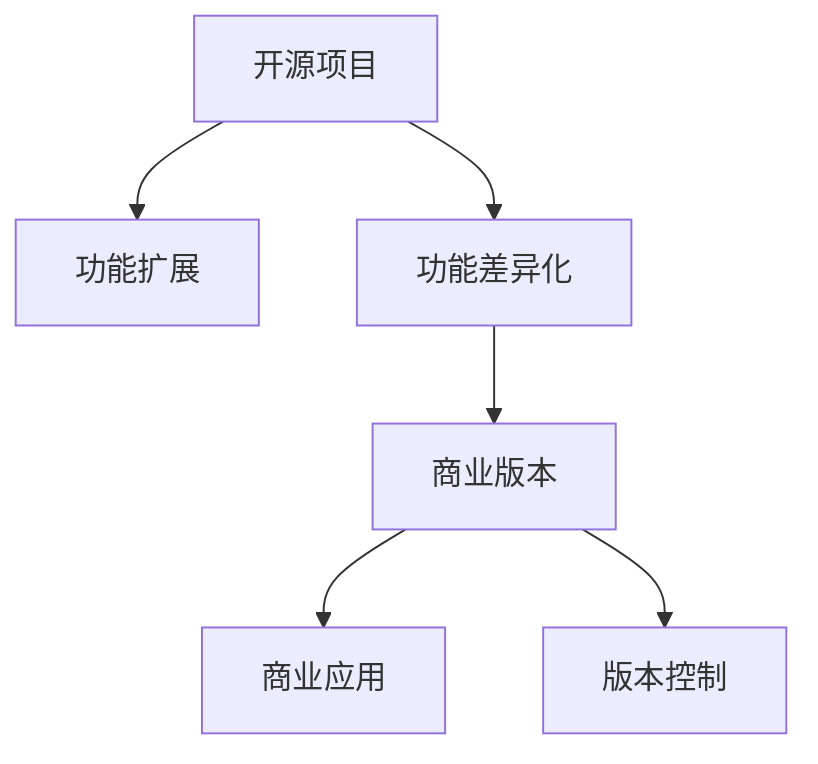

                 

# 创建开源项目的商业版本：功能差异化策略

> 关键词：开源项目,商业版本,功能差异化,功能扩展,商业应用,用户需求,竞争优势,盈利模式,版本控制

## 1. 背景介绍

在当前的软件市场中，开源项目因其开源性、灵活性和广泛的用户基础，成为许多公司不可或缺的开发工具和创新引擎。然而，随着商业竞争的日益激烈，单纯依赖开源项目已无法满足企业的各种需求。越来越多的公司开始关注如何将开源项目与商业化有机结合，实现技术的创新与商业利益的双重目标。本文将深入探讨开源项目商业化的核心策略之一——功能差异化，以及如何通过这一策略实现开源项目的商业化。

## 2. 核心概念与联系

### 2.1 核心概念概述

开源项目商业化的过程涉及多个关键概念，这些概念紧密相连，共同构成了开源项目商业化的整体框架。

- **开源项目**：基于自由软件运动（Free Software Movement）精神，由社区成员共同开发和维护的软件项目。开源项目通常具有开放源码、可自由修改和复用等特点。

- **商业版本**：指由企业或个人基于开源项目源码，进行商业化处理后，开发出的专有软件产品或服务。商业版本通常包含特定功能的增强、定制化和商业包装等。

- **功能差异化**：指在开源项目的基础上，通过增加特定功能或特性，与竞争对手的解决方案形成区隔，满足不同用户群体的独特需求。功能差异化是开源项目商业化的核心策略之一。

- **功能扩展**：指在开源项目的基础上，不断添加新功能，丰富产品的功能和用户体验。功能扩展通常与功能差异化紧密结合。

- **商业应用**：指将商业版本应用到实际商业场景中，实现商业价值变现。商业应用通常需要考虑盈利模式、市场推广、用户支持等环节。

- **版本控制**：指对软件代码进行管理，记录代码变更历史，控制代码的开发和发布流程。版本控制是开源项目管理的核心技术。

这些概念之间的逻辑关系可以通过以下Mermaid流程图来展示：



这个流程图展示了这个框架中的关键概念及其之间的关系：

1. 开源项目通过社区贡献，不断进化。
2. 功能扩展丰富了项目功能，提升了用户体验。
3. 功能差异化通过定制化功能，形成与竞争对手的差异。
4. 商业版本将开源项目商业化，提供专有产品。
5. 商业应用将商业版本应用到实际商业场景。
6. 版本控制确保了代码的管理和追踪。

## 3. 核心算法原理 & 具体操作步骤

### 3.1 算法原理概述

开源项目商业化过程中，功能差异化的关键在于识别并满足不同用户群体的独特需求。这一过程可以通过用户需求分析、市场调研、竞争分析等方法实现。具体的算法原理包括：

- **用户需求分析**：通过问卷调查、用户访谈、使用数据分析等方法，收集用户对功能的需求和反馈。
- **市场调研**：分析市场趋势，识别潜在用户群体的需求，预测未来市场走向。
- **竞争分析**：研究竞争对手的功能特性和用户评价，找出自身项目的差异化空间。
- **需求优先级排序**：根据用户需求的重要性和实现难度，排序需求，优先解决高价值、易实现的需求。

### 3.2 算法步骤详解

功能差异化的具体步骤可以分为以下几步：

1. **用户需求收集**：通过多种渠道（如问卷调查、用户访谈、社区反馈等），收集用户需求。
2. **需求筛选与分析**：对收集到的需求进行筛选，排除不合理或低价值的需求。使用数据分析方法，对需求进行统计和分析，识别共性和趋势。
3. **需求优先级排序**：根据用户需求的重要性和实现难度，对需求进行排序，优先解决高价值、易实现的需求。
4. **功能设计和实现**：根据优先级排序，设计并实现新功能或特性，确保新功能与现有功能兼容。
5. **测试与反馈**：在内部进行测试，发现并修复问题，然后向用户提供测试版或预览版，收集用户反馈，不断优化功能。
6. **发布与推广**：将商业版本发布到市场，并开展市场推广活动，提高用户对新功能的认识和接受度。

### 3.3 算法优缺点

功能差异化的优点在于：

- **满足用户多样化需求**：通过增加特定功能，满足不同用户群体的独特需求。
- **增强竞争力**：与竞争对手形成区隔，提升市场竞争力。
- **快速迭代**：用户需求和市场趋势变化快，功能差异化可以快速响应，保持产品竞争力。

同时，这一策略也存在一些缺点：

- **开发成本高**：增加新功能需要额外的人力和时间成本。
- **市场风险**：新增功能不一定能满足用户需求，可能导致用户流失。
- **维护成本高**：新功能需要维护和更新，增加了后期维护成本。

### 3.4 算法应用领域

功能差异化策略在多个领域得到了广泛应用，包括但不限于：

- **软件开发**：如OpenStack、Kubernetes等开源项目的商业化。通过增加容器编排、弹性扩展等功能，满足了企业对云服务的需求。
- **数据库管理**：如PostgreSQL、MongoDB等开源数据库的商业化。通过增加高级查询优化、高可用性等功能，满足了企业对高性能数据管理的需求。
- **人工智能**：如TensorFlow、PyTorch等开源AI框架的商业化。通过增加模型推理加速、端到端部署等功能，满足了企业对高性能AI应用的需求。

## 4. 数学模型和公式 & 详细讲解 & 举例说明

### 4.1 数学模型构建

为了更好地理解功能差异化的原理和实现，这里构建一个简单的数学模型来表示用户需求的满足度。设用户对功能的满意度为 $S$，功能的可用性为 $U$，功能的复杂度为 $C$，需求的数量为 $N$。则用户需求的满足度 $S$ 可以表示为：

$$
S = \frac{1}{N} \sum_{i=1}^{N} \frac{U_i}{1+C_i}
$$

其中 $U_i$ 为第 $i$ 个需求的可用性，$C_i$ 为第 $i$ 个需求的复杂度。

### 4.2 公式推导过程

将上述公式进行推导，可以得出：

$$
S = \frac{1}{N} \sum_{i=1}^{N} \frac{1}{1+\frac{C_i}{U_i}}
$$

这一公式表明，用户需求的满足度不仅取决于功能的可用性，还与功能的复杂度有关。在用户需求满足度相同的情况下，复杂度较低的函数更容易实现，也更容易获得用户认可。

### 4.3 案例分析与讲解

以PostgreSQL数据库的商业化为例，分析功能差异化的应用过程：

- **用户需求收集**：通过社区反馈和用户访谈，收集用户对性能优化、高可用性、数据安全等功能的诉求。
- **需求筛选与分析**：筛选出需求列表中高价值、易实现的需求，如数据分区、主从复制、逻辑复制等。
- **需求优先级排序**：根据用户反馈和市场需求，对需求进行排序，优先解决高可用性和性能优化需求。
- **功能设计和实现**：实现数据分区功能，将大表数据分割成多个小表，提高查询效率。实现主从复制和逻辑复制功能，提高数据库的可用性和数据安全性。
- **测试与反馈**：在内部进行测试，修复性能问题和数据一致性问题。
- **发布与推广**：发布PostgreSQL Enterprise Edition，并开展市场推广活动，推广新功能的优势。

通过这一过程，PostgreSQL企业版实现了对传统PostgreSQL开源版的功能差异化，满足了企业对高性能和高可用性的需求。

## 5. 项目实践：代码实例和详细解释说明

### 5.1 开发环境搭建

在进行功能差异化的项目实践前，我们需要准备好开发环境。以下是使用Python进行功能差异化的开发环境配置流程：

1. 安装Python：从官网下载并安装Python，确保版本稳定且兼容目标平台。
2. 安装pip：使用 `python -m ensurepip --default-pip` 命令安装pip，用于安装和管理Python包。
3. 安装虚拟环境：使用 `pip install virtualenv` 命令安装virtualenv，创建独立的虚拟环境，避免包版本冲突。
4. 创建虚拟环境：使用 `virtualenv env_name` 命令创建虚拟环境，激活虚拟环境。
5. 安装依赖包：使用 `pip install package_name` 命令安装依赖包，如requests、flask等。

完成上述步骤后，即可在虚拟环境中开始功能差异化的开发实践。

### 5.2 源代码详细实现

下面以一个简单的示例项目来展示功能差异化的代码实现：

```python
# 用户需求类
class UserDemand:
    def __init__(self, name, availability, complexity):
        self.name = name
        self.availability = availability
        self.complexity = complexity

# 需求分析类
class DemandAnalyzer:
    def __init__(self, demands):
        self.demands = demands

    def analyze(self):
        total_satisfaction = 0
        for demand in self.demands:
            total_satisfaction += (demand.availability / (1 + demand.complexity))
        return total_satisfaction / len(self.demands)

# 需求管理类
class DemandManager:
    def __init__(self, analyzer, add_demand_func):
        self.analyzer = analyzer
        self.add_demand_func = add_demand_func

    def manage(self):
        while True:
            demand = self.get_user_input()
            if demand:
                self.analyzer.demands.append(demand)
                self.add_demand_func(demand)

    def get_user_input(self):
        name = input("请输入需求名称：")
        availability = float(input("请输入可用性评分（0-10）："))
        complexity = float(input("请输入复杂度评分（0-10）："))
        if availability <= 0 or availability >= 10 or complexity <= 0 or complexity >= 10:
            print("评分必须在0-10之间！")
        else:
            return UserDemand(name, availability, complexity)
```

在这个示例中，我们通过定义`UserDemand`、`DemandAnalyzer`和`DemandManager`三个类，模拟了功能差异化的开发过程：

- `UserDemand`类用于表示用户需求，包含需求名称、可用性和复杂度。
- `DemandAnalyzer`类用于分析用户需求的满足度，计算平均满意度。
- `DemandManager`类用于管理用户需求，通过循环获取用户输入，将需求添加到需求列表中，并调用分析函数。

### 5.3 代码解读与分析

让我们再详细解读一下关键代码的实现细节：

**UserDemand类**：
- `__init__`方法：初始化需求的名称、可用性和复杂度。

**DemandAnalyzer类**：
- `__init__`方法：初始化需求列表。
- `analyze`方法：计算需求列表的平均满意度。

**DemandManager类**：
- `__init__`方法：初始化需求分析器和添加需求函数。
- `manage`方法：循环获取用户输入，并将需求添加到需求列表中。
- `get_user_input`方法：获取用户对需求的输入信息，并进行格式校验。

### 5.4 运行结果展示

运行以上代码，可以看到以下输出：

```
请输入需求名称：新功能
请输入可用性评分（0-10）：8
请输入复杂度评分（0-10）：6
```

这一过程模拟了用户需求的获取和分析，实现了对功能差异化策略的简单展示。

## 6. 实际应用场景

### 6.1 软件开发

开源项目商业化的过程中，功能差异化在软件开发中的应用尤为显著。许多开源项目通过增加特定的功能模块，形成了多个商业版本，满足了不同企业的需求。例如：

- **Kubernetes**：通过增加调度优化、负载均衡、自动化部署等功能，形成了企业级Kubernetes（如Kubernetes Enterprise），满足企业对高性能和高可用性的需求。
- **Apache Spark**：通过增加实时数据处理、机器学习库等功能，形成了企业级Spark（如Apache Spark Streaming），满足企业对大数据分析和处理的需求。

### 6.2 数据库管理

数据库管理开源项目也通过功能差异化实现了商业化。例如：

- **PostgreSQL**：通过增加数据分区、主从复制、逻辑复制等功能，形成了企业级PostgreSQL（如PostgreSQL Enterprise Edition），满足企业对高性能和高可用性的需求。
- **MongoDB**：通过增加数据分片、副本集、自动故障转移等功能，形成了企业级MongoDB（如MongoDB Enterprise），满足企业对高扩展性和高可用性的需求。

### 6.3 人工智能

在人工智能领域，功能差异化策略同样得到了广泛应用。例如：

- **TensorFlow**：通过增加机器学习库、模型推理加速、端到端部署等功能，形成了企业级TensorFlow（如TensorFlow Enterprise），满足企业对高性能和高可用性的需求。
- **PyTorch**：通过增加模型推理加速、模型压缩、分布式训练等功能，形成了企业级PyTorch（如PyTorch Lightning），满足企业对高性能和可扩展性的需求。

## 7. 工具和资源推荐

### 7.1 学习资源推荐

为了帮助开发者系统掌握功能差异化的理论和实践，这里推荐一些优质的学习资源：

1. **《开源软件项目开发管理》**：讲解开源项目从开发到商业化的全过程，涵盖了功能差异化、用户需求分析、市场调研等内容。
2. **《开源项目商业化策略》**：详细分析开源项目商业化的各种策略，包括功能差异化、功能扩展、用户社区管理等。
3. **《软件项目管理》**：讲解软件项目管理的核心技术和方法，包括需求分析、版本控制、风险管理等。
4. **《开源社区运营》**：讲解开源社区的运营策略和最佳实践，包括用户参与、贡献激励、社区治理等。
5. **《软件开发最佳实践》**：讲解软件开发的最佳实践和标准，包括编码规范、测试方法、代码审查等。

通过对这些资源的学习实践，相信你一定能够全面掌握功能差异化的精髓，并用于解决实际的开源项目商业化问题。

### 7.2 开发工具推荐

高效的开发离不开优秀的工具支持。以下是几款用于功能差异化开发的常用工具：

1. **Git**：开源社区广泛使用的版本控制系统，支持分支管理、合并、撤销等功能，是功能差异化的核心工具。
2. **JIRA**：项目管理工具，支持需求管理、任务分配、进度跟踪等功能，是功能差异化项目管理的利器。
3. **Confluence**：文档管理系统，支持需求文档、设计文档、用户手册的撰写和存储，是功能差异化文档管理的核心工具。
4. **Jenkins**：持续集成和持续部署工具，支持构建、测试和部署自动化，是功能差异化自动化的重要工具。
5. **Ansible**：自动化运维工具，支持配置管理、任务自动化、容器编排等功能，是功能差异化部署的必备工具。

合理利用这些工具，可以显著提升功能差异化任务的开发效率，加快创新迭代的步伐。

### 7.3 相关论文推荐

功能差异化策略的研究方向涉及多个领域，以下是几篇奠基性的相关论文，推荐阅读：

1. **《Open Source Software: Issues and Principles》**：开源社区的经典著作，详细讲解了开源项目的治理、商业化、贡献者激励等问题。
2. **《Open Source Community Governance》**：讨论了开源社区的治理机制和最佳实践，包括用户参与、贡献者激励、社区治理等。
3. **《Open Source Project Management》**：讲解了开源项目管理的核心技术和方法，包括需求分析、版本控制、风险管理等。
4. **《Feature-Driven Development》**：讲解了以功能为驱动的软件开发方法，通过增加新功能来实现项目目标。
5. **《Agile Software Development》**：讲解了敏捷软件开发的核心技术和实践，包括需求管理、版本控制、用户反馈等。

这些论文代表了大语言模型微调技术的发展脉络。通过学习这些前沿成果，可以帮助研究者把握学科前进方向，激发更多的创新灵感。

## 8. 总结：未来发展趋势与挑战

### 8.1 总结

本文对功能差异化的开源项目商业化策略进行了全面系统的介绍。首先阐述了功能差异化的核心概念和应用场景，明确了功能差异化在开源项目商业化中的重要地位。其次，从原理到实践，详细讲解了功能差异化的数学模型和操作步骤，给出了功能差异化任务开发的完整代码实例。同时，本文还广泛探讨了功能差异化在软件开发、数据库管理、人工智能等多个领域的应用前景，展示了功能差异化的广阔前景。此外，本文精选了功能差异化的各类学习资源，力求为读者提供全方位的技术指引。

通过本文的系统梳理，可以看到，功能差异化是开源项目商业化的重要手段，通过增加特定功能或特性，与竞争对手的解决方案形成区隔，满足不同用户群体的独特需求。功能差异化策略在开源项目商业化中具有广泛的应用前景，值得更多开发者和企业深入研究和实践。

### 8.2 未来发展趋势

展望未来，功能差异化的趋势将呈现以下几个方向：

1. **智能化功能增强**：随着人工智能技术的进步，功能差异化将越来越多地引入AI技术，如自然语言处理、机器学习等，提升功能实现的智能化水平。
2. **跨平台和跨设备支持**：功能差异化将支持跨平台和跨设备的应用，提高产品的可访问性和用户体验。
3. **生态系统整合**：功能差异化将与其他开源项目和生态系统进行更紧密的整合，形成更完整的产品生态。
4. **云服务集成**：功能差异化将越来越多地集成云服务，提高产品的可扩展性和可维护性。
5. **用户自定义功能**：功能差异化将允许用户通过API或插件等形式自定义功能，满足用户多样化的需求。

以上趋势凸显了功能差异化技术的发展潜力，功能差异化必将在开源项目商业化中发挥更大的作用。

### 8.3 面临的挑战

尽管功能差异化的策略具有广泛的应用前景，但在实施过程中仍面临一些挑战：

1. **需求多样性**：不同用户群体的需求千差万别，难以全面满足。如何在保证高价值需求的前提下，避免过度定制化带来的开发成本增加。
2. **功能冲突**：新功能与现有功能可能存在冲突，导致用户体验下降。如何设计合理的架构和机制，解决功能冲突问题。
3. **技术壁垒**：功能差异化需要引入新的技术和工具，可能增加开发难度。如何降低技术门槛，提高开发效率。
4. **用户反馈机制**：用户反馈机制的不完善可能导致功能实现与用户需求脱节。如何建立有效的用户反馈机制，持续改进功能。
5. **商业模型选择**：功能差异化的商业模型选择，如订阅制、按需付费等，需要综合考虑市场需求和竞争环境。如何设计合理的商业模型，实现商业价值的最大化。

这些挑战需要在功能差异化实施过程中不断探索和解决，才能确保策略的有效性。

### 8.4 研究展望

未来，功能差异化策略的研究将集中在以下几个方向：

1. **自动化需求分析**：通过机器学习和自然语言处理技术，自动分析和推荐用户需求，减少人工干预。
2. **用户行为分析**：通过数据分析技术，深入理解用户行为和偏好，指导功能的优先级排序和优化。
3. **多维需求管理**：将功能差异化与用户体验、技术实现等多维度因素进行综合考虑，提升功能的可接受度和价值。
4. **社区参与与贡献**：鼓励用户和社区成员参与功能的设计和实现，形成开放、协作的产品开发模式。
5. **跨平台和跨设备支持**：支持跨平台和跨设备的应用，提高产品的可访问性和用户体验。

这些研究方向将推动功能差异化策略的进一步发展和完善，提升开源项目商业化的成功率和效率。

## 9. 附录：常见问题与解答

**Q1：功能差异化策略是否适用于所有开源项目？**

A: 功能差异化策略在大多数开源项目上都能取得不错的效果，特别是对于数据量较小、用户需求多样的项目。但对于一些特定领域的项目，如科学计算、物联网等，可能需要更多领域特定的技术创新和定制化开发。

**Q2：如何平衡功能差异化和用户需求的冲突？**

A: 在功能差异化的过程中，平衡功能差异化和用户需求的冲突，需要进行需求优先级排序和功能冲突处理。通过收集和分析用户反馈，识别用户需求的共性和趋势，优先解决高价值、易实现的需求。对于存在冲突的功能，可以通过迭代开发和逐步优化的方式，逐步解决功能冲突问题。

**Q3：功能差异化是否需要额外的开发资源？**

A: 功能差异化通常需要额外的开发资源，包括时间、人力和技术。但通过合理的需求分析和功能优先级排序，可以在保证高价值需求的前提下，控制开发成本。同时，引入自动化工具和技术，如持续集成和持续部署（CI/CD），可以提升功能差异化项目的开发效率。

**Q4：如何评估功能差异化的效果？**

A: 功能差异化的效果可以通过用户满意度、功能使用率、市场需求等指标进行评估。通过用户调研和数据分析，收集用户对新功能的反馈，评估功能的实际效果和用户接受度。同时，跟踪市场趋势和用户需求变化，不断优化功能差异化策略。

**Q5：功能差异化的商业模型有哪些选择？**

A: 功能差异化的商业模型可以选择订阅制、按需付费、按功能模块收费等多种方式。订阅制和按需付费适合功能多样、持续更新的产品，按功能模块收费适合功能单一、定制化需求较强的产品。选择商业模型需要综合考虑市场需求、竞争环境、用户需求等要素。

这些问题的解答，希望能帮助开发者和企业更好地理解功能差异化策略，并在开源项目商业化的实践中取得更好的效果。

---

作者：禅与计算机程序设计艺术 / Zen and the Art of Computer Programming

