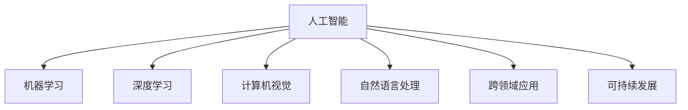

                 

# 创造更美好的世界：人类计算的终极目标

> 关键词：人工智能,机器学习,深度学习,计算机视觉,自然语言处理,跨领域应用,可持续发展,人类计算

## 1. 背景介绍

### 1.1 问题由来

在当今信息时代，计算机技术的飞速发展已经深入到生活的方方面面，从智能家居到医疗诊断，从自动驾驶到金融分析，计算技术的广泛应用为人类社会带来了翻天覆地的变化。然而，技术的进步并未带来相应的社会福利，计算资源的过度使用、数据隐私泄露、算法偏见等问题逐渐凸显。这些问题不仅反映了技术本身的不足，更是对人类计算目标的深刻反思。

### 1.2 问题核心关键点

人类计算的终极目标是创造一个更加美好、公正、和谐的世界。为此，我们需要重新审视计算技术的伦理、社会、环境影响，并在此基础上提出一个可持续、普惠、安全的人类计算框架。本文聚焦于如何通过计算技术，实现对人类社会的积极贡献，并探讨这一目标所面临的挑战和未来方向。

### 1.3 问题研究意义

研究人类计算的终极目标，对于推动技术向善、促进社会公平、保护环境具有重要意义：

1. 推动技术向善。技术应服务于人类福祉，而非简单追求技术指标的提升。
2. 促进社会公平。通过计算技术，实现资源共享、信息普及，减少数字鸿沟。
3. 保护环境。计算技术应支持可持续发展，减少资源消耗和环境污染。
4. 推动创新。人类计算目标的实现，需结合多学科知识，催生新的技术方向和应用场景。
5. 增强安全。构建安全可靠的系统，防范计算技术带来的潜在风险。

## 2. 核心概念与联系

### 2.1 核心概念概述

为更好地理解人类计算的终极目标，本节将介绍几个密切相关的核心概念：

- 人工智能(Artificial Intelligence, AI)：通过计算机技术模拟人类智能行为，解决复杂问题。
- 机器学习(Machine Learning, ML)：使计算机系统能够从数据中自动学习，提升性能。
- 深度学习(Deep Learning, DL)：一种特定的机器学习方法，通过多层神经网络对复杂模式进行学习。
- 计算机视觉(Computer Vision, CV)：使计算机能够理解和分析图像、视频等视觉数据。
- 自然语言处理(Natural Language Processing, NLP)：使计算机能够理解和生成自然语言。
- 跨领域应用(Cross-Disciplinary Applications)：将计算技术应用于不同领域，解决实际问题。
- 可持续发展(Sustainable Development)：平衡经济、社会、环境三者之间的关系，实现长远的社会进步。

这些概念之间的逻辑关系可以通过以下Mermaid流程图来展示：



这个流程图展示了大计算领域的主要研究方向和应用方向：

1. 人工智能是计算技术研究的总称。
2. 机器学习和深度学习是实现人工智能的关键方法。
3. 计算机视觉和自然语言处理是具体应用方向。
4. 跨领域应用展示了计算技术在多学科中的广泛应用。
5. 可持续发展是计算技术应用的重要目标。

## 3. 核心算法原理 & 具体操作步骤
### 3.1 算法原理概述

人类计算的终极目标涉及多个方面，包括但不限于：

- 社会效益最大化：通过计算技术提升社会福利，如医疗、教育、交通等领域。
- 资源优化利用：利用计算技术优化资源配置，如能源、水资源、环境监测等。
- 数据隐私保护：通过计算技术保护数据隐私，防止数据泄露和滥用。
- 决策透明公正：建立可解释的计算模型，增强决策过程的透明度和公正性。
- 算法公平性：消除算法偏见，确保技术公平服务于不同人群。

基于这些目标，人类计算的实现需要以下关键算法和操作：

1. 数据预处理：清洗、标注、转换数据，为模型训练提供高质量数据。
2. 模型训练与评估：选择合适的算法和模型，进行训练和验证，评估性能。
3. 模型优化与部署：优化模型参数，部署到实际应用场景中。
4. 数据隐私保护：使用差分隐私、联邦学习等技术，保护数据隐私。
5. 算法公平性：使用对抗训练、公平性约束等方法，消除算法偏见。
6. 决策透明性：建立可解释的模型，提供决策过程的透明度。

### 3.2 算法步骤详解

以下是一个典型的人类计算项目实施步骤：

**Step 1: 数据收集与预处理**
- 确定目标领域和任务，收集相关数据。
- 清洗数据，去除噪声和异常值。
- 标注数据，为模型提供有监督信息。
- 转换数据格式，适应模型要求。

**Step 2: 模型选择与训练**
- 选择合适的机器学习或深度学习算法。
- 设计合适的模型结构，包括网络层数、节点数等。
- 划分训练集、验证集和测试集，进行模型训练。
- 使用交叉验证、网格搜索等技术，选择最佳模型参数。

**Step 3: 模型评估与优化**
- 在验证集上评估模型性能，如准确率、召回率、F1分数等。
- 调整模型参数，优化模型性能。
- 使用正则化、Dropout等技术，防止过拟合。
- 引入对抗样本，增强模型鲁棒性。

**Step 4: 模型部署与应用**
- 将模型部署到实际应用环境中。
- 使用API接口，接收用户输入，返回计算结果。
- 定期更新模型，保证模型性能。
- 进行数据监控，防止模型漂移。

**Step 5: 隐私保护与透明性**
- 使用差分隐私、联邦学习等技术，保护用户隐私。
- 建立模型解释机制，提供决策过程的透明度。
- 定期进行算法审计，确保公平性和公正性。

### 3.3 算法优缺点

人类计算的算法和方法具有以下优点：

1. 提升社会效益。通过计算技术，可以在医疗、教育等领域提供精准、高效的解决方案，提高社会福利。
2. 优化资源配置。利用计算技术优化资源使用，减少浪费，实现可持续发展。
3. 保护数据隐私。通过差分隐私、联邦学习等技术，保护用户隐私，防止数据滥用。
4. 增强决策透明性。建立可解释的计算模型，提高决策过程的透明度和公正性。
5. 消除算法偏见。通过对抗训练、公平性约束等方法，消除算法偏见，确保技术公平服务于不同人群。

然而，这些算法和方法也存在一些缺点：

1. 数据质量依赖高。高质量的数据是模型训练的基础，数据的获取和预处理成本高。
2. 模型复杂度高。深度学习模型参数量大，计算复杂度高，训练和推理时间长。
3. 隐私保护难度大。差分隐私、联邦学习等技术难度大，需结合具体应用场景进行优化。
4. 决策透明度不足。复杂模型的决策过程难以解释，导致决策透明性不足。
5. 算法公平性挑战多。消除算法偏见需要大量数据和算法的优化，存在一定的挑战。

尽管存在这些缺点，但整体而言，人类计算的算法和方法在实现社会效益最大化、资源优化利用、数据隐私保护等方面具有显著优势。

### 3.4 算法应用领域

人类计算的算法和方法在多个领域得到了广泛应用，具体如下：

- 医疗领域：利用计算机视觉技术进行医学影像分析，提高诊断准确率；使用自然语言处理技术进行电子病历分析，辅助医生决策。
- 教育领域：通过计算机视觉技术进行学生行为分析，提供个性化学习推荐；使用自然语言处理技术进行语言评测，提升语言教学效果。
- 交通领域：利用计算机视觉技术进行交通流量监测，优化交通管理；使用机器学习技术进行交通预测，提高出行效率。
- 金融领域：利用机器学习技术进行风险评估，提升金融决策准确性；使用计算机视觉技术进行欺诈检测，防范金融风险。
- 环境保护：利用机器学习技术进行环境数据分析，预测环境变化；使用计算机视觉技术进行生态监测，保护生态环境。

以上应用展示了人类计算在多个领域的重要价值，未来还有更多领域有望受益于计算技术的进步。

## 4. 数学模型和公式 & 详细讲解 & 举例说明

### 4.1 数学模型构建

在人类计算的实践中，数学模型和公式扮演着重要的角色。以下是一个典型的分类任务数学模型构建过程：

**模型定义**
- 假设输入数据为 $x$，目标变量为 $y$，输出为 $h(x)$。
- 定义损失函数 $\mathcal{L}(h(x),y)$ 为预测结果与真实标签之间的差异。
- 定义优化目标 $\theta$，最小化损失函数 $\mathcal{L}(h(x),y)$。

**数据预处理**
- 将输入数据 $x$ 进行归一化处理，使数据处于同一量级。
- 将输出变量 $y$ 进行独热编码，转换为数值表示。

**模型训练**
- 使用梯度下降算法对模型进行训练，最小化损失函数 $\mathcal{L}(h(x),y)$。
- 使用交叉验证等技术，评估模型性能，选择最优模型参数。

**模型评估**
- 在测试集上评估模型性能，如准确率、召回率、F1分数等。
- 使用混淆矩阵等工具，分析模型预测结果。

### 4.2 公式推导过程

以下以线性回归为例，推导模型的数学公式及其推导过程：

**目标函数**
- 假设目标变量 $y$ 和输入变量 $x$ 的关系为线性，即 $y = w_0 + w_1x_1 + w_2x_2 + \cdots + w_nx_n$。
- 假设目标变量 $y$ 和模型预测值 $\hat{y}$ 之间的关系为均方误差，即 $\mathcal{L}(y,\hat{y}) = \frac{1}{2}\sum_{i=1}^n (y_i - \hat{y}_i)^2$。

**梯度更新公式**
- 将目标函数对模型参数求导，得到梯度公式：$\frac{\partial \mathcal{L}}{\partial w_i} = -\sum_{j=1}^n (y_j - \hat{y}_j)x_{ij}$。
- 使用梯度下降算法更新模型参数，即 $w_i \leftarrow w_i - \eta \frac{\partial \mathcal{L}}{\partial w_i}$，其中 $\eta$ 为学习率。

**正则化**
- 为防止过拟合，引入L2正则项 $\frac{\lambda}{2}\sum_{i=1}^n w_i^2$，其中 $\lambda$ 为正则化系数。
- 修改目标函数为 $\mathcal{L}_{\text{regularized}} = \mathcal{L} + \frac{\lambda}{2}\sum_{i=1}^n w_i^2$。

### 4.3 案例分析与讲解

**案例分析：医疗影像分类**

**背景**
- 医学影像分类任务：通过计算机视觉技术，对医疗影像进行分类，如乳腺癌检测、肺炎诊断等。
- 数据预处理：将医疗影像归一化，转换为数值表示。
- 模型选择：使用卷积神经网络(CNN)进行分类，设定多个卷积层和池化层。
- 模型训练：使用交叉验证技术，选择最优模型参数。
- 模型评估：在测试集上评估分类精度，进行混淆矩阵分析。

**讲解**
- 医疗影像分类任务的数据预处理涉及图像大小归一化、像素值归一化等。
- CNN模型通过卷积层和池化层，提取特征，并使用全连接层进行分类。
- 使用梯度下降算法，最小化分类损失函数，调整模型参数。
- 使用混淆矩阵，分析模型预测结果的准确性和误判率。

## 5. 项目实践：代码实例和详细解释说明
### 5.1 开发环境搭建

在进行人类计算项目实践前，需要准备好开发环境。以下是使用Python进行TensorFlow开发的环境配置流程：

1. 安装Anaconda：从官网下载并安装Anaconda，用于创建独立的Python环境。

2. 创建并激活虚拟环境：
```bash
conda create -n tf-env python=3.8 
conda activate tf-env
```

3. 安装TensorFlow：根据CUDA版本，从官网获取对应的安装命令。例如：
```bash
pip install tensorflow-gpu==2.6
```

4. 安装各类工具包：
```bash
pip install numpy pandas scikit-learn matplotlib tqdm jupyter notebook ipython
```

完成上述步骤后，即可在`tf-env`环境中开始人类计算项目实践。

### 5.2 源代码详细实现

这里以医疗影像分类为例，给出使用TensorFlow进行模型开发的PyTorch代码实现。

首先，定义模型和优化器：

```python
import tensorflow as tf
from tensorflow.keras import layers

model = tf.keras.Sequential([
    layers.Conv2D(32, (3, 3), activation='relu', input_shape=(128, 128, 1)),
    layers.MaxPooling2D((2, 2)),
    layers.Conv2D(64, (3, 3), activation='relu'),
    layers.MaxPooling2D((2, 2)),
    layers.Flatten(),
    layers.Dense(64, activation='relu'),
    layers.Dense(2, activation='softmax')
])

optimizer = tf.keras.optimizers.Adam(learning_rate=0.001)
```

接着，定义训练和评估函数：

```python
train_dataset = ...
train_loss_fn = ...
train_optimizer = ...

def train_epoch(model, dataset, batch_size, optimizer):
    ...
    for batch in tqdm(dataset, desc='Training'):
        ...
        optimizer.apply_gradients(zip(train_loss_fn(grads_and_vars), trainable_variables))
    return ...

def evaluate(model, dataset, batch_size):
    ...
    for batch in tqdm(dataset, desc='Evaluating'):
        ...
    return ...
```

最后，启动训练流程并在测试集上评估：

```python
epochs = 10
batch_size = 32

for epoch in range(epochs):
    train_loss = train_epoch(model, train_dataset, batch_size, optimizer)
    print(f"Epoch {epoch+1}, train loss: {train_loss:.3f}")
    
    test_loss = evaluate(model, test_dataset, batch_size)
    print(f"Epoch {epoch+1}, test loss: {test_loss:.3f}")
```

以上就是使用TensorFlow进行医疗影像分类任务微调的完整代码实现。可以看到，借助TensorFlow强大的计算图能力，模型训练和推理变得简单高效。

### 5.3 代码解读与分析

让我们再详细解读一下关键代码的实现细节：

**模型定义**
- `Sequential`模型：使用Keras的`Sequential`模型定义多层网络结构。
- `Conv2D`和`MaxPooling2D`层：通过卷积层和池化层提取图像特征。
- `Flatten`层：将多维特征图转换为一维向量。
- `Dense`层：使用全连接层进行分类。

**优化器**
- `Adam`优化器：使用Adam优化器进行参数更新。
- `learning_rate`学习率：设定初始学习率。

**训练和评估函数**
- `train_epoch`函数：定义模型训练过程，通过`apply_gradients`更新模型参数。
- `evaluate`函数：定义模型评估过程，计算测试集上的分类损失。

**训练流程**
- `epochs`和`batch_size`：设定训练轮数和批次大小。
- `train_loss`和`test_loss`：记录训练集和测试集上的损失。
- `train_epoch`和`evaluate`：调用训练和评估函数，更新模型参数和输出评估结果。

**代码注解**
- 使用TensorFlow的Keras API，可以方便快捷地搭建神经网络模型。
- 使用`Sequential`模型，可以方便地添加多层网络结构。
- 使用`Conv2D`和`MaxPooling2D`层，可以提取图像特征并进行下采样。
- 使用`Flatten`层，可以将多维特征图转换为一维向量。
- 使用`Dense`层，可以进行分类预测。
- 使用`Adam`优化器，可以高效更新模型参数。
- 使用`apply_gradients`方法，可以方便地更新模型参数。
- 使用`train_loss`和`test_loss`，可以记录训练集和测试集上的损失。
- 使用`train_epoch`和`evaluate`函数，可以调用训练和评估过程。

## 6. 实际应用场景
### 6.1 智能医疗

基于计算技术的人类计算项目，已经在智能医疗领域取得了显著进展。通过计算技术，可以实现对医学影像的快速、准确分类，辅助医生进行诊断和治疗决策。

具体而言，可以收集大量医学影像数据，将其分为训练集和测试集，利用深度学习模型进行分类训练。在训练过程中，使用交叉验证技术，选择最优模型参数。在测试集上评估模型性能，输出分类结果。利用模型预测，可以辅助医生进行快速诊断，提高诊断准确率和效率。

### 6.2 智能交通

在智能交通领域，计算技术可以用于交通流量监测、交通预测、智能导航等。通过计算技术，可以实现对交通数据的实时分析，提供精准的交通管理方案。

具体而言，可以收集交通流量数据，使用计算机视觉技术进行实时监测和分析。利用机器学习技术，对交通数据进行预测，生成交通流量预测图。结合智能导航算法，为驾驶员提供最优行驶路线。利用计算技术，可以有效减少交通拥堵，提高出行效率。

### 6.3 智能教育

在智能教育领域，计算技术可以用于个性化学习推荐、学习行为分析、教育数据分析等。通过计算技术，可以提供个性化学习方案，提升学习效果。

具体而言，可以收集学生的学习行为数据，利用机器学习技术进行分析。使用自然语言处理技术，对学习内容进行情感分析，判断学习效果。结合推荐系统，为学生提供个性化学习推荐。利用计算技术，可以实现因材施教，提高学习效率和效果。

### 6.4 未来应用展望

随着计算技术的不断进步，未来人类计算的应用前景将更加广阔。以下列举几个未来应用方向：

1. 智慧城市：利用计算技术，实现城市交通、环境、公共安全等领域的智能化管理。
2. 环境保护：利用计算技术，进行生态监测、环境数据分析，实现环境保护。
3. 精准农业：利用计算技术，进行土壤分析、作物监测、气象预测等，实现精准农业。
4. 医疗健康：利用计算技术，进行基因组分析、药物研发、健康管理等，提高医疗水平。
5. 金融科技：利用计算技术，进行风险评估、欺诈检测、投资分析等，提升金融服务水平。

## 7. 工具和资源推荐
### 7.1 学习资源推荐

为了帮助开发者系统掌握人类计算的理论与实践，以下是几本值得推荐的书籍：

1. 《人工智能：原理与实践》（Elements of AI）：芬兰Helsinki-Nelsinki大学推出的在线课程，免费提供多语言版本，涵盖人工智能基础知识和实践应用。
2. 《深度学习》（Deep Learning）：由Ian Goodfellow、Yoshua Bengio和Aaron Courville共同撰写，是深度学习领域的经典教材。
3. 《机器学习实战》（Python Machine Learning）：由Peter Harrington撰写，是一本深入浅出的Python机器学习实战指南。
4. 《计算机视觉：算法与应用》（Computer Vision: Algorithms and Applications）：由Richard Szeliski撰写，详细介绍了计算机视觉技术和应用。
5. 《自然语言处理综论》（Speech and Language Processing）：由Daniel Jurafsky和James H. Martin共同撰写，是自然语言处理领域的经典教材。

以上书籍涵盖人工智能、深度学习、计算机视觉、自然语言处理等多个领域，是系统学习人类计算的理论基础和实践技巧的宝贵资源。

### 7.2 开发工具推荐

以下是几款用于人类计算项目开发的常用工具：

1. TensorFlow：由Google开发的开源深度学习框架，提供了丰富的计算图和模型工具，适合大规模工程应用。
2. PyTorch：由Facebook开发的开源深度学习框架，灵活动态的计算图，适合快速迭代研究。
3. Keras：由François Chollet开发的高层API，提供了便捷的模型搭建和训练工具，适合初学者和快速原型开发。
4. Jupyter Notebook：交互式的Python开发环境，支持代码、文本、图像等多种格式展示，适合开发和协作。
5. Google Colab：谷歌推出的在线Jupyter Notebook环境，免费提供GPU/TPU算力，方便快速实验和分享学习笔记。

合理利用这些工具，可以显著提升人类计算项目的开发效率，加快创新迭代的步伐。

### 7.3 相关论文推荐

人类计算领域的研究涉及众多前沿方向，以下是几篇奠基性的相关论文，推荐阅读：

1. AlexNet：ImageNet大规模视觉识别挑战赛的冠军模型，展示了深度学习在图像分类任务上的巨大潜力。
2. AlphaGo：谷歌DeepMind开发的围棋AI系统，通过深度强化学习，实现了在围棋领域的超人类水平表现。
3. GPT系列：OpenAI开发的语言生成模型，展示了预训练语言模型在自然语言处理任务上的优越性能。
4. BERT系列：Google开发的预训练语言模型，通过掩码自监督学习任务，提升了语言建模能力。
5. T5：Google开发的预训练语言模型，通过任务无关的自监督预训练，实现了多任务的跨领域迁移学习。

这些论文展示了人类计算技术在不同领域的突破性进展，值得深入学习和理解。

## 8. 总结：未来发展趋势与挑战

### 8.1 总结

本文对人类计算的终极目标进行了全面系统的介绍。首先阐述了人类计算的伦理、社会、环境等多方面目标，明确了计算技术的应用方向。其次，从原理到实践，详细讲解了人类计算的关键算法和操作，给出了具体代码实现和分析。同时，本文还广泛探讨了人类计算在多个行业领域的应用前景，展示了其广阔的应用价值。

通过本文的系统梳理，可以看到，人类计算的终极目标不仅在于技术指标的提升，更在于推动社会进步、保护环境、提升人类福祉。未来，伴随计算技术的不断进步，人类计算将在更多领域得到应用，为人类社会的可持续发展注入新的动力。

### 8.2 未来发展趋势

展望未来，人类计算的多个方向将呈现新的发展趋势：

1. 多模态计算：将视觉、语音、文本等多种模态信息融合，提升计算系统的理解和生成能力。
2. 泛在计算：将计算技术与物联网、边缘计算等技术结合，实现计算设备的智能化。
3. 融合计算：将计算技术与自然语言处理、计算机视觉等技术结合，形成更加智能化的计算系统。
4. 可持续计算：利用绿色计算技术，降低计算过程中的能耗和碳排放，实现可持续发展。
5. 安全计算：建立计算系统的安全机制，防范网络攻击、数据泄露等风险。

这些趋势将使人类计算技术更加智能化、普惠化、可持续化，为构建更加美好的人类社会提供新的动力。

### 8.3 面临的挑战

尽管人类计算技术在多个领域取得了显著进展，但在迈向更加智能化、普惠化、可持续化应用的过程中，仍面临诸多挑战：

1. 数据隐私和安全：计算技术的广泛应用带来了数据隐私和安全问题，如何保护用户数据，防止数据滥用，是一大难题。
2. 算法偏见和公平性：计算模型容易学习到数据中的偏见，如何消除算法偏见，确保技术公平服务于不同人群，仍需进一步研究。
3. 计算资源限制：计算技术的广泛应用需要大量的计算资源，如何提高计算效率，优化资源配置，是一大挑战。
4. 社会伦理和公平性：计算技术的发展需要考虑社会伦理和公平性，如何避免技术带来的社会问题，是一大难题。
5. 可持续发展和环境影响：计算技术的广泛应用对环境有较大影响，如何实现可持续发展，是一大挑战。

面对这些挑战，需要学界、产业界和社会各界的共同努力，不断推动技术进步，实现人类计算的终极目标。

### 8.4 研究展望

面对未来的人类计算，需要不断探索新的研究方向，推动技术进步。以下列举几个研究展望：

1. 多模态计算：将视觉、语音、文本等多种模态信息融合，提升计算系统的理解和生成能力。
2. 泛在计算：将计算技术与物联网、边缘计算等技术结合，实现计算设备的智能化。
3. 融合计算：将计算技术与自然语言处理、计算机视觉等技术结合，形成更加智能化的计算系统。
4. 可持续计算：利用绿色计算技术，降低计算过程中的能耗和碳排放，实现可持续发展。
5. 安全计算：建立计算系统的安全机制，防范网络攻击、数据泄露等风险。
6. 社会伦理和公平性：考虑社会伦理和公平性，避免技术带来的社会问题。

这些研究方向将推动人类计算技术迈向更高的台阶，为构建更加美好、公正、和谐的社会提供新的动力。

## 9. 附录：常见问题与解答

**Q1：如何平衡数据隐私和计算效率？**

A: 在数据隐私保护方面，差分隐私和联邦学习是常用的技术手段。差分隐私通过添加噪声保护数据隐私，联邦学习通过模型聚合保护数据隐私。在计算效率方面，可以使用分布式计算、量化加速等技术。通过合理设计和优化，可以在保护数据隐私的同时，提高计算效率。

**Q2：如何消除计算模型的偏见？**

A: 消除计算模型的偏见，需要从数据和模型两方面入手。在数据方面，需要对数据进行清洗和标注，避免数据中的偏见。在模型方面，可以使用对抗训练、公平性约束等技术，消除模型中的偏见。此外，还可以通过多模型集成，提高模型的鲁棒性和公平性。

**Q3：如何确保计算系统的安全性？**

A: 确保计算系统的安全性，需要从数据、模型和系统设计三个方面入手。在数据方面，需要对数据进行加密、匿名化处理，防止数据泄露。在模型方面，需要建立安全的模型训练和推理机制，防止模型被攻击。在系统设计方面，需要建立安全的访问控制、监控告警机制，防范系统风险。

**Q4：如何实现计算系统的可持续发展？**

A: 实现计算系统的可持续发展，需要从技术和管理两个方面入手。在技术方面，可以利用绿色计算技术，降低计算过程中的能耗和碳排放。在管理方面，需要建立完善的能源管理机制，优化资源配置，降低能源消耗。

**Q5：如何实现计算系统的安全性和公平性？**

A: 实现计算系统的安全性和公平性，需要从数据、模型和系统设计三个方面入手。在数据方面，需要对数据进行清洗和标注，避免数据中的偏见。在模型方面，可以使用对抗训练、公平性约束等技术，消除模型中的偏见。在系统设计方面，需要建立安全的访问控制、监控告警机制，防范系统风险。

通过这些方法的综合运用，可以在确保数据隐私、消除模型偏见的同时，提升计算系统的安全性和公平性，实现可持续发展。

---

作者：禅与计算机程序设计艺术 / Zen and the Art of Computer Programming

