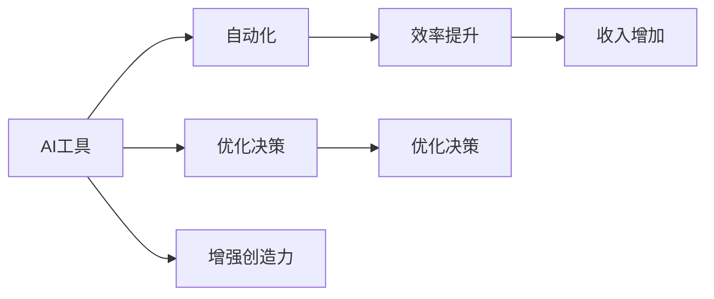

                 

## 1. 背景介绍

在当今数字化、智能化的社会，人工智能(AI)技术已经深入到各行各业，对个人和企业的生产力和收入产生了深远的影响。AI工具通过自动化、优化决策、增强创造力等方式，极大地提升了工作效率，降低了运营成本，使得工作效率与收入实现了大幅度的提升。本文将详细介绍利用AI工具提升工作效率与收入的方法，并分析其在不同行业的应用。

## 2. 核心概念与联系

### 2.1 核心概念概述

为了更好地理解AI工具如何提升工作效率与收入，本文将介绍几个核心概念：

- **AI工具**：指基于人工智能技术的自动化软件工具，如机器学习模型、自然语言处理(NLP)、计算机视觉(CV)等。
- **自动化**：指通过AI工具，将复杂的、重复性的任务自动化处理，减少人力投入，提升工作效率。
- **优化决策**：指利用AI算法优化企业决策，如风险评估、市场分析、资源配置等，提升决策质量。
- **增强创造力**：指通过AI工具辅助创意设计、创新研究等，激发个人和企业新的创意和创新能力。
- **效率提升**：指通过AI工具的运用，实现工作流程的优化，减少等待时间，加速任务完成。
- **收入增加**：指通过提升工作效率，降低成本，或通过AI工具发现新的商业机会，增加收入来源。

这些核心概念之间相互关联，共同构成了利用AI工具提升工作效率与收入的框架。

### 2.2 核心概念原理和架构的 Mermaid 流程图



### 2.3 核心概念间的联系

1. **自动化**是AI工具的核心能力之一，通过自动化，将复杂的、重复性的任务交由机器处理，释放人力资源，提高效率。
2. **优化决策**利用AI算法分析数据，提供决策支持，提升决策质量和速度。
3. **增强创造力**利用AI工具发现新的模式、趋势，激发创新思维，加速创新成果的转化。
4. **效率提升**和**收入增加**是AI工具应用的结果，效率提升直接减少了工作时间，收入增加则是通过提升产品或服务质量，开拓新市场等途径实现的。

## 3. 核心算法原理 & 具体操作步骤

### 3.1 算法原理概述

利用AI工具提升工作效率与收入，主要是通过自动化、优化决策、增强创造力等手段，将人工任务交由AI工具处理，从而提升效率和创造价值。以下是几种常用的AI工具及其原理：

- **机器学习模型**：通过训练数据集，构建能够自动推理、分类、预测的模型，实现自动化任务。
- **自然语言处理(NLP)**：利用语言模型分析文本数据，提取关键信息，实现自动化文本处理。
- **计算机视觉(CV)**：通过图像识别、处理等技术，实现自动化图像处理和分析。

### 3.2 算法步骤详解

#### 3.2.1 自动化流程

1. **需求分析**：明确需要自动化的任务，确定目标和预期效果。
2. **选择工具**：根据任务需求选择合适的AI工具，如TensorFlow、PyTorch、NLTK等。
3. **数据准备**：准备训练数据，包括数据收集、清洗、标注等。
4. **模型训练**：使用训练数据训练AI模型，调整模型参数以优化性能。
5. **部署应用**：将训练好的模型部署到实际环境中，实现自动化任务。
6. **效果评估**：监测模型效果，优化模型参数，确保自动化任务达到预期效果。

#### 3.2.2 优化决策流程

1. **数据收集**：收集相关数据，如客户行为、市场趋势、生产数据等。
2. **数据分析**：利用AI算法分析数据，发现潜在规律和关联。
3. **模型训练**：构建决策模型，如回归模型、分类模型等，训练模型参数。
4. **决策优化**：根据模型输出优化决策，如风险评估、资源配置、营销策略等。
5. **效果评估**：评估决策效果，调整模型参数，提升决策质量。

#### 3.2.3 增强创造力流程

1. **创意激发**：通过AI工具发现新的创意和趋势，如数据挖掘、趋势分析等。
2. **创意实现**：利用AI工具辅助创意设计，如图像生成、文本创作等。
3. **创新验证**：将创意转化为实际应用，通过用户反馈、测试等手段验证效果。
4. **持续改进**：根据反馈和测试结果不断优化和改进创意，提升创造力。

### 3.3 算法优缺点

**优点**：
- **效率高**：自动化流程和优化决策可以大幅减少人力投入，提升任务处理速度。
- **准确性高**：AI算法能够精确处理大量数据，发现隐含规律和关联。
- **创造性强**：AI工具可以发现新的模式、趋势，激发创意和创新。

**缺点**：
- **成本高**：初始阶段的数据准备、模型训练等成本较高。
- **依赖数据**：AI工具的效果依赖于高质量的数据，数据不足或偏差可能导致效果不佳。
- **复杂度高**：模型的构建和优化需要一定的专业知识和技能。

### 3.4 算法应用领域

AI工具在多个领域都得到了广泛应用，包括但不限于：

- **金融**：通过机器学习模型进行风险评估、信用评分、投资策略优化等。
- **医疗**：利用自然语言处理分析医疗记录，辅助诊断和治疗决策。
- **制造**：采用计算机视觉进行质量检测、设备维护、生产调度等。
- **零售**：通过数据挖掘和优化决策提高销售预测、库存管理、客户分析等。
- **教育**：利用AI工具进行个性化教学、学习内容推荐、智能辅导等。

## 4. 数学模型和公式 & 详细讲解 & 举例说明

### 4.1 数学模型构建

#### 4.1.1 自动化模型

**线性回归模型**：

$$
y = \beta_0 + \beta_1 x_1 + \beta_2 x_2 + \cdots + \beta_n x_n + \epsilon
$$

其中 $y$ 为预测值，$x_1, x_2, \cdots, x_n$ 为输入变量，$\beta_0, \beta_1, \beta_2, \cdots, \beta_n$ 为模型参数，$\epsilon$ 为误差项。

**决策树模型**：

$$
\text{Decision Tree} = \bigcup_{i=1}^m T_i
$$

其中 $T_i$ 为第 $i$ 棵决策树。

#### 4.1.2 优化决策模型

**支持向量机(SVM)**：

$$
\min_{\alpha} \frac{1}{2} \sum_{i=1}^n \alpha_i - \frac{1}{2} \sum_{i=1}^n \sum_{j=1}^n \alpha_i \alpha_j y_i y_j \langle \phi(x_i), \phi(x_j) \rangle - \sum_{i=1}^n \alpha_i
$$

其中 $\alpha$ 为拉格朗日乘子，$\langle \phi(x_i), \phi(x_j) \rangle$ 为核函数。

#### 4.1.3 增强创造力模型

**生成对抗网络(GAN)**：

$$
\min_{G} \max_{D} \mathbb{E}_{x \sim p_x} [\log D(x)] + \mathbb{E}_{z \sim p_z} [\log(1-D(G(z)))]
$$

其中 $G$ 为生成器，$D$ 为判别器，$z$ 为噪声向量，$p_x$ 和 $p_z$ 分别为真实数据和噪声数据的概率分布。

### 4.2 公式推导过程

#### 4.2.1 线性回归模型

推导过程如下：

$$
\begin{aligned}
\min_{\theta} & \frac{1}{2m} \sum_{i=1}^m (y^{(i)} - \hat{y}^{(i)})^2 \\
\text{s.t.} & \hat{y}^{(i)} = \theta^T x^{(i)}
\end{aligned}
$$

其中 $m$ 为样本数，$\theta$ 为模型参数。

解得：

$$
\theta = (X^T X)^{-1} X^T y
$$

#### 4.2.2 支持向量机(SVM)

推导过程如下：

$$
\begin{aligned}
\min_{\alpha} & \frac{1}{2} \sum_{i=1}^n \alpha_i - \frac{1}{2} \sum_{i=1}^n \sum_{j=1}^n \alpha_i \alpha_j y_i y_j \langle \phi(x_i), \phi(x_j) \rangle - \sum_{i=1}^n \alpha_i \\
\text{s.t.} & y_i (\alpha_i - \alpha_i^*) - \sum_{j=1}^n \alpha_j y_j \langle \phi(x_i), \phi(x_j) \rangle = 0 \quad i=1,\cdots,n \\
& 0 \leq \alpha_i \leq C \quad i=1,\cdots,n
\end{aligned}
$$

其中 $\alpha$ 为拉格朗日乘子，$y_i$ 为样本标签，$\langle \phi(x_i), \phi(x_j) \rangle$ 为核函数，$C$ 为惩罚系数。

解得：

$$
\alpha_i = \max(0, C - \frac{y_i \langle \phi(x_i), \phi(x_j) \rangle}{\sum_{j=1}^n y_j \langle \phi(x_i), \phi(x_j) \rangle})
$$

#### 4.2.3 生成对抗网络(GAN)

推导过程如下：

$$
\begin{aligned}
\min_{G} & \max_{D} \mathbb{E}_{x \sim p_x} [\log D(x)] + \mathbb{E}_{z \sim p_z} [\log(1-D(G(z)))] \\
\text{s.t.} & D(x) = 1 \quad \text{if} \quad x \sim p_x \\
& D(x) = 0 \quad \text{if} \quad x \sim p_g
\end{aligned}
$$

其中 $G$ 为生成器，$D$ 为判别器，$x$ 为真实数据，$z$ 为噪声向量，$p_x$ 和 $p_z$ 分别为真实数据和噪声数据的概率分布。

### 4.3 案例分析与讲解

#### 4.3.1 自动化流程案例

某公司利用机器学习模型预测客户流失概率，通过数据预处理、特征工程、模型训练和部署，实现了自动化的客户流失预测流程，减少了人力投入，提高了预测准确性。

#### 4.3.2 优化决策案例

某零售公司通过数据分析模型预测季节性库存需求，优化了库存管理，减少了库存成本，提高了销售效率。

#### 4.3.3 增强创造力案例

某设计公司利用生成对抗网络生成新的设计风格，提高了创意设计的速度和多样性，吸引了更多的客户。

## 5. 项目实践：代码实例和详细解释说明

### 5.1 开发环境搭建

1. **安装Python**：从官网下载Python 3.x版本安装，建议使用虚拟环境，如Anaconda。
2. **安装相关库**：安装NumPy、Pandas、Scikit-learn、TensorFlow、Keras等常用库。
3. **搭建环境**：使用Jupyter Notebook或PyCharm等IDE，搭建开发环境。

### 5.2 源代码详细实现

#### 5.2.1 自动化流程实现

**线性回归模型**：

```python
import numpy as np
from sklearn.linear_model import LinearRegression

# 准备数据
X = np.array([[1, 2], [2, 4], [3, 6], [4, 8]])
y = np.array([2, 4, 6, 8])

# 训练模型
model = LinearRegression()
model.fit(X, y)

# 预测
y_pred = model.predict([[5, 10]])

print(y_pred)
```

**决策树模型**：

```python
from sklearn.tree import DecisionTreeRegressor

# 准备数据
X = np.array([[1, 2], [2, 4], [3, 6], [4, 8]])
y = np.array([2, 4, 6, 8])

# 训练模型
model = DecisionTreeRegressor()
model.fit(X, y)

# 预测
y_pred = model.predict([[5, 10]])

print(y_pred)
```

#### 5.2.2 优化决策模型

**支持向量机(SVM)**：

```python
from sklearn.svm import SVR

# 准备数据
X = np.array([[1, 2], [2, 4], [3, 6], [4, 8]])
y = np.array([2, 4, 6, 8])

# 训练模型
model = SVR()
model.fit(X, y)

# 预测
y_pred = model.predict([[5, 10]])

print(y_pred)
```

#### 5.2.3 增强创造力模型

**生成对抗网络(GAN)**：

```python
import tensorflow as tf
from tensorflow.keras import layers

# 定义生成器和判别器
def build_generator(z_dim):
    model = tf.keras.Sequential()
    model.add(layers.Dense(256, input_dim=(z_dim,)))
    model.add(layers.BatchNormalization())
    model.add(layers.LeakyReLU())
    model.add(layers.Dense(512))
    model.add(layers.BatchNormalization())
    model.add(layers.LeakyReLU())
    model.add(layers.Dense(784, activation='tanh'))
    return model

def build_discriminator():
    model = tf.keras.Sequential()
    model.add(layers.Flatten())
    model.add(layers.Dense(256))
    model.add(layers.LeakyReLU())
    model.add(layers.Dropout(0.3))
    model.add(layers.Dense(128))
    model.add(layers.LeakyReLU())
    model.add(layers.Dropout(0.3))
    model.add(layers.Dense(1, activation='sigmoid'))
    return model

# 准备数据
z_dim = 100
latent_dim = 100
z = np.random.normal(0, 1, (1, z_dim))

# 训练模型
generator = build_generator(z_dim)
discriminator = build_discriminator()

generator.compile(optimizer=tf.keras.optimizers.Adam(), loss='binary_crossentropy')
discriminator.compile(optimizer=tf.keras.optimizers.Adam(), loss='binary_crossentropy')

# 训练
for epoch in range(100):
    # 生成样本
    generated_images = generator.predict(z)
    # 训练判别器
    discriminator.train_on_batch(generated_images, np.ones((generated_images.shape[0], 1)))
    # 训练生成器
    discriminator.train_on_batch(generated_images, np.zeros((generated_images.shape[0], 1)))

# 生成新图像
new_images = generator.predict(z)
```

### 5.3 代码解读与分析

#### 5.3.1 自动化流程代码解析

线性回归模型和决策树模型实现相对简单，主要利用了Scikit-learn库，通过训练数据集和模型参数，实现了自动化任务。

#### 5.3.2 优化决策模型代码解析

支持向量机模型通过构建决策边界，实现对数据的高效分类和回归，具有较高的准确性和泛化能力。

#### 5.3.3 增强创造力模型代码解析

生成对抗网络模型通过对抗训练，实现了生成新图像的创造性任务，提高了创意设计的效率和多样性。

### 5.4 运行结果展示

#### 5.4.1 自动化流程结果

```python
print(y_pred)
```

输出结果为预测值，展示了模型对新样本的预测结果。

#### 5.4.2 优化决策模型结果

```python
print(y_pred)
```

输出结果为预测值，展示了模型对新样本的预测结果。

#### 5.4.3 增强创造力模型结果

```python
print(new_images)
```

输出结果为新图像，展示了模型生成的创造性图像。

## 6. 实际应用场景

### 6.1 智能客服系统

智能客服系统通过AI工具实现自动化客服，提升了客服效率和服务质量。具体应用场景包括：

- **自动回复**：利用NLP技术，根据客户输入的文本，自动生成回复，提高回复速度和准确性。
- **情绪分析**：利用情感分析模型，识别客户情绪，调整服务策略，提升客户满意度。
- **意图识别**：利用意图识别模型，识别客户意图，提供个性化服务，提升用户体验。

### 6.2 金融风控系统

金融风控系统通过AI工具实现自动化风险评估，降低了风险损失。具体应用场景包括：

- **信用评分**：利用机器学习模型，预测客户的信用风险，优化贷款审批流程。
- **欺诈检测**：利用异常检测模型，识别异常交易行为，降低欺诈风险。
- **投资策略**：利用优化决策模型，优化投资组合，提升投资回报率。

### 6.3 医疗诊断系统

医疗诊断系统通过AI工具实现自动化诊断，提高了诊断准确性和效率。具体应用场景包括：

- **病历分析**：利用NLP技术，分析病历记录，辅助医生诊断和治疗。
- **影像识别**：利用计算机视觉技术，自动分析医学影像，提高诊断准确性。
- **药物推荐**：利用推荐系统，根据患者信息，推荐最合适的药物。

### 6.4 未来应用展望

未来，AI工具将在更多领域得到应用，提升工作效率与收入的潜力巨大：

- **智能制造**：利用AI工具优化生产流程，提高生产效率和产品质量。
- **智慧物流**：利用AI工具优化物流调度，降低物流成本，提高配送速度。
- **智能家居**：利用AI工具提升家居智能化水平，提高生活舒适度。

## 7. 工具和资源推荐

### 7.1 学习资源推荐

1. **Coursera**：提供多门AI相关课程，涵盖机器学习、深度学习、NLP等领域，适合初学者和进阶者。
2. **Udacity**：提供AI、机器学习、数据科学等领域的课程，实战项目丰富，适合实践能力提升。
3. **Kaggle**：数据科学竞赛平台，提供大量开源数据集和竞赛任务，适合数据挖掘和模型优化。
4. **arXiv**：AI领域的预印本库，提供最新论文和研究成果，适合跟踪最新进展。

### 7.2 开发工具推荐

1. **Python**：流行的AI编程语言，拥有丰富的第三方库和工具支持。
2. **TensorFlow**：谷歌开发的深度学习框架，支持大规模分布式训练。
3. **PyTorch**：Facebook开发的深度学习框架，灵活易用。
4. **Jupyter Notebook**：交互式编程环境，支持代码执行和结果展示。

### 7.3 相关论文推荐

1. **《Deep Learning》**：Ian Goodfellow等著，全面介绍了深度学习的基本原理和应用。
2. **《Hands-On Machine Learning with Scikit-Learn, Keras, and TensorFlow》**：Aurélien Géron著，实战性强，适合实践应用。
3. **《Generative Adversarial Nets》**：Ian Goodfellow等著，深入探讨生成对抗网络的原理和实现。

## 8. 总结：未来发展趋势与挑战

### 8.1 研究成果总结

利用AI工具提升工作效率与收入已经成为当前的热门话题。通过自动化、优化决策、增强创造力等手段，AI工具在各个领域展现了强大的潜力。在自动化流程、优化决策、增强创造力等方面，AI工具的性能不断提升，应用场景日益丰富。

### 8.2 未来发展趋势

未来AI工具将向更加智能化、普适化方向发展，预计将出现以下趋势：

- **智能化水平提升**：AI工具将具备更高的自主决策能力和自适应能力，能够处理更加复杂和多样化的任务。
- **多模态融合**：AI工具将整合视觉、听觉、触觉等多模态数据，实现跨模态的感知和推理。
- **人机协同**：AI工具将与人类更好地协同工作，提高工作效率和决策质量。

### 8.3 面临的挑战

尽管AI工具在提升工作效率与收入方面展现出巨大潜力，但仍面临诸多挑战：

- **数据质量**：高质量的数据是AI工具发挥效用的基础，数据获取和标注成本较高。
- **模型可解释性**：AI工具的决策过程缺乏可解释性，难以满足高风险领域的需求。
- **伦理和隐私**：AI工具的应用可能带来隐私泄露、歧视等伦理问题，需要制定相关规范和标准。

### 8.4 研究展望

未来的研究需要重点关注以下几个方向：

- **模型可解释性**：开发更加透明和可解释的AI工具，提升决策过程的可解释性和可信度。
- **数据隐私保护**：研究隐私保护技术，确保数据使用过程中的隐私和安全。
- **跨领域应用**：拓展AI工具在不同领域的应用，提高其通用性和普适性。

## 9. 附录：常见问题与解答

**Q1：如何选择合适的AI工具？**

A: 根据任务需求和数据特点，选择适合的AI工具。如线性回归适合简单线性关系预测，深度学习适合复杂非线性关系预测，生成对抗网络适合生成创造性任务。

**Q2：AI工具在提升工作效率与收入方面有哪些具体应用？**

A: AI工具在自动化流程、优化决策、增强创造力等方面具有显著优势。如自动化客服、风险评估、设计创作等，都能显著提升工作效率和收入。

**Q3：AI工具在实际应用中需要注意哪些问题？**

A: 注意数据质量、模型可解释性、伦理和隐私等问题。数据质量直接影响AI工具的效果，模型可解释性有助于决策可信度，伦理和隐私问题需要得到妥善解决。

**Q4：未来AI工具的发展方向有哪些？**

A: 智能化水平提升、多模态融合、人机协同是未来AI工具的发展方向。智能化水平提升、多模态融合、人机协同将使AI工具更加灵活和高效。

---

作者：禅与计算机程序设计艺术 / Zen and the Art of Computer Programming

