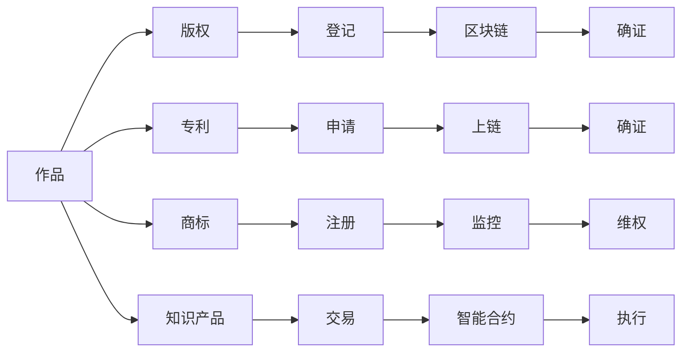

                 

# 利用区块链技术保护知识产权

## 1. 背景介绍

知识产权（Intellectual Property, IP）是创造性劳动成果中重要的法律概念，它涵盖了著作权、专利权、商标权等各类知识财产。在数字经济时代，知识产权的价值愈发凸显，而保护知识产权的重要性亦日益被各国政府和企业所重视。然而，由于互联网技术的开放性和匿名性，现有的知识产权保护机制在应对盗版、侵权等问题时，仍存在诸多挑战。

近年来，随着区块链技术的不断成熟，其去中心化、不可篡改、透明公开的特性为知识产权的保护提供了新的思路和方法。利用区块链技术，可以构建一个更加安全、高效、透明的知识产权保护体系，有效应对网络空间中的知识产权侵权行为，保障创新成果和知识产权主体的权益。

本文将系统介绍区块链技术在知识产权保护中的应用，从原理到实践，详细阐述如何利用区块链技术保护各类知识产权，并展望未来发展趋势及面临的挑战。

## 2. 核心概念与联系

### 2.1 核心概念概述

区块链技术是一种分布式账本技术，通过去中心化、透明公开的方式记录和验证交易数据。每一个区块通过哈希函数链接到前一个区块，形成一个不可篡改的链条，保证了数据的完整性和安全性。

- **区块链（Blockchain）**：由区块（Block）和链（Chain）两部分组成，区块链通过区块按时间顺序串联，确保数据不可篡改和透明公开。
- **智能合约（Smart Contracts）**：利用区块链上的脚本语言，编写自动执行的合约程序，实现无需第三方信任的自动化操作。
- **共识机制（Consensus Mechanism）**：区块链网络中达成共识的算法，包括PoW（工作量证明）、PoS（权益证明）、DPoS（委托权益证明）等，确保网络稳定和安全。
- **加密技术（Encryption）**：利用非对称加密和哈希函数，保证数据传输的安全性和隐私性。

知识产权保护领域中，常见的区块链应用包括：

- **版权保护**：通过区块链记录作品的创作、出版、授权等行为，确保证据的不可篡改和可追溯。
- **专利申请**：将专利申请信息上链，防止重复申请和侵权行为。
- **商标监管**：监控网络上的商标使用情况，防止非法仿冒和侵权。
- **知识产权交易**：利用智能合约进行知识产权的买卖、授权和转让，提高交易透明度和效率。

### 2.2 核心概念原理和架构的 Mermaid 流程图



该图展示了基于区块链技术的知识产权保护流程。创作者将作品、专利申请、商标注册等相关信息上传区块链，通过智能合约实现确证、交易和维权等操作。

## 3. 核心算法原理 & 具体操作步骤

### 3.1 算法原理概述

区块链技术的核心在于其去中心化、不可篡改和透明公开的特性，这些特性能够有效应对知识产权侵权行为。具体来说，区块链技术在知识产权保护中的原理如下：

- **去中心化**：通过分布式网络节点存储和管理数据，避免了中心化机构单点故障的风险。
- **不可篡改**：区块链的共识机制和加密算法保证了数据的不可篡改性，一旦数据上链，便无法被恶意修改。
- **透明公开**：所有交易信息公开透明，可以在网络上追溯和验证，提升了证据的证明力。

利用这些特性，区块链技术在知识产权保护中可以实现以下功能：

1. **版权确证**：记录作品的创作、发布、授权等行为，确保证据的不可篡改和可追溯。
2. **专利确证**：记录专利申请信息，防止重复申请和侵权行为。
3. **商标确证**：监控网络上的商标使用情况，防止非法仿冒和侵权。
4. **知识产品交易**：利用智能合约进行知识产权的买卖、授权和转让，提高交易透明度和效率。

### 3.2 算法步骤详解

1. **版权确证**：
   - 创作者将作品的创作时间、作者信息、发布平台等元数据上传至区块链，形成版权记录。
   - 系统自动生成唯一哈希值，确保数据的不可篡改性。
   - 版权持有者可以通过智能合约管理作品的授权和发布，确保版权的合法性。

2. **专利确证**：
   - 专利申请者将专利申请信息（如发明名称、技术描述、申请日期等）上传至区块链。
   - 系统自动生成唯一哈希值，确保数据的不可篡改性。
   - 系统实时监控专利申请状态，防止重复申请和侵权行为。

3. **商标确证**：
   - 商标持有者将商标信息（如商标标识、注册日期、持有人信息等）上传至区块链。
   - 系统自动生成唯一哈希值，确保数据的不可篡改性。
   - 系统实时监控网络上的商标使用情况，防止非法仿冒和侵权。

4. **知识产品交易**：
   - 买卖双方通过智能合约约定交易条件，并进行交易记录上链。
   - 系统自动验证交易的合法性和真实性，确保交易的透明和可追溯。

### 3.3 算法优缺点

#### 优点：

- **不可篡改性**：区块链的不可篡改特性保证了知识产权数据的真实性和完整性。
- **透明公开**：区块链的透明公开特性提高了证据的证明力和可追溯性。
- **自动化操作**：智能合约可以自动执行交易和维权操作，提高了效率和安全性。
- **去中心化**：去中心化的特性避免了中心化机构的单点故障和信任问题。

#### 缺点：

- **扩展性**：目前区块链的扩展性较低，处理大规模数据时可能遇到性能瓶颈。
- **技术门槛**：区块链技术的应用需要一定的技术背景和开发成本。
- **隐私问题**：公开透明的数据可能带来隐私泄露的风险。
- **法律认可**：虽然区块链技术在技术上具有优势，但各国法律对区块链证据的认可程度不一。

### 3.4 算法应用领域

区块链技术在知识产权保护中的应用领域非常广泛，涵盖了从创作、确证、交易到维权的各个环节。

1. **版权确证**：适用于文学、艺术、音乐等多种形式的作品版权保护。
2. **专利确证**：适用于科技、医药、机械等各领域的技术专利保护。
3. **商标确证**：适用于各类商业品牌和产品的商标保护。
4. **知识产品交易**：适用于版权、专利、商标等多种知识产权的交易。

## 4. 数学模型和公式 & 详细讲解 & 举例说明

### 4.1 数学模型构建

利用区块链技术进行知识产权保护，主要涉及以下几个数学模型：

1. **哈希函数**：用于生成唯一哈希值，确保数据的不可篡改性。
2. **智能合约**：通过编程实现自动化的合约执行，提高交易效率和安全性。
3. **共识机制**：通过算法达成网络节点的共识，保证网络的安全性和稳定性。

### 4.2 公式推导过程

#### 哈希函数（Hash Function）

哈希函数将任意长度的数据转换为固定长度的哈希值，具有单向性、一致性、抗碰撞性等特点。其数学公式如下：

$$
H(x) = \sum_{i=0}^{n} f_i(x)
$$

其中，$x$ 为输入数据，$H(x)$ 为哈希值，$f_i(x)$ 为哈希函数的具体计算方法。

#### 智能合约（Smart Contracts）

智能合约是一段自动执行的代码，其执行步骤如下：

1. 接收输入参数 $(x_1, x_2, ..., x_n)$。
2. 执行预设的逻辑 $F(x_1, x_2, ..., x_n)$。
3. 输出结果 $y$。

数学公式表示为：

$$
y = F(x_1, x_2, ..., x_n)
$$

#### 共识机制（Consensus Mechanism）

共识机制通过算法达成网络节点的共识，常见的算法包括PoW、PoS和DPoS等。以PoW为例，其计算过程如下：

1. 网络节点通过计算哈希函数，生成工作量证明。
2. 节点将证明提交到网络中。
3. 网络选择证明最短的节点作为共识节点。

数学公式表示为：

$$
P_{PoW} = H(x) + \sum_{i=1}^{n} f_i(x)
$$

其中，$P_{PoW}$ 为工作量证明，$H(x)$ 为哈希函数，$f_i(x)$ 为计算函数。

### 4.3 案例分析与讲解

#### 案例一：版权确证

某作家创作了一部小说，通过区块链平台确证版权，具体步骤如下：

1. 作家将小说的标题、作者信息、发布日期等信息上传至区块链。
2. 系统自动生成唯一哈希值，确保证据的不可篡改性。
3. 作家通过智能合约管理小说的授权和发布，确保版权的合法性。

#### 案例二：专利确证

某公司申请了一项专利，通过区块链平台确证专利，具体步骤如下：

1. 公司将专利的名称、技术描述、申请日期等信息上传至区块链。
2. 系统自动生成唯一哈希值，确保证据的不可篡改性。
3. 系统实时监控专利申请状态，防止重复申请和侵权行为。

#### 案例三：商标确证

某品牌公司注册了一个商标，通过区块链平台确证商标，具体步骤如下：

1. 公司将商标的标识、注册日期、持有人信息等信息上传至区块链。
2. 系统自动生成唯一哈希值，确保证据的不可篡改性。
3. 系统实时监控网络上的商标使用情况，防止非法仿冒和侵权。

#### 案例四：知识产品交易

某科技公司将一项专利授权给另一家公司，通过区块链平台进行交易，具体步骤如下：

1. 科技公司将专利授权信息上传至区块链。
2. 授权公司通过智能合约验证交易的合法性。
3. 交易记录上链，确保交易的透明和可追溯。

## 5. 项目实践：代码实例和详细解释说明

### 5.1 开发环境搭建

1. **安装Node.js和npm**：
   ```
   brew install node
   brew install npm
   ```

2. **安装区块链平台（如Hyperledger Fabric）**：
   ```
   npm install -g fabric-cli
   ```

3. **搭建区块链网络**：
   ```
   fabric-ca -p config.json -u https://localhost:7051
   fabric-ca-client -r -p config.json -u https://localhost:7051 -r -sca fabric-ca -m [组织名]
   fabric-network -p config.json -c config.json -l
   ```

### 5.2 源代码详细实现

以下是使用Node.js编写的一个简单的智能合约代码，用于版权确证：

```javascript
const fs = require('fs');
const path = require('path');

// 读取配置文件
const configPath = path.join(__dirname, 'config.json');
const config = JSON.parse(fs.readFileSync(configPath, 'utf8'));

// 创建智能合约
const createContract = (orgName) => {
  const chaincode = path.join(__dirname, 'contract', 'simple版权确证.json');
  const chaincodeId = config.newChaincode;
  const args = [orgName];

  console.log(`Call chaincode function: create(${args})...`);
  return chaincodeFunction('create', args);
};

// 发布智能合约
const publishContract = () => {
  const chaincode = path.join(__dirname, 'contract', 'simple版权确证.json');
  const chaincodeId = config.newChaincode;
  const args = [];

  console.log(`Call chaincode function: init(${args})...`);
  return chaincodeFunction('init', args);
};

// 执行智能合约
const invokeContract = (orgName, functionName, args) => {
  console.log(`Call chaincode function: ${functionName}(${args})...`);
  return chaincodeFunction(functionName, args);
};

// 调用链码
const chaincodeFunction = (functionName, args) => {
  return new Promise((resolve, reject) => {
    client.newTransaction('版权确证', chaincodeId, functionName, args, (error, tx) => {
      if (error) reject(error);
      else resolve(tx);
    });
  });
};

// 测试版权确证
createContract('Alice');
publishContract();
invokeContract('Bob', 'query版权', ['1', 'Alice']);
```

### 5.3 代码解读与分析

1. **智能合约编写**：
   - `createContract`函数：创建版权确证智能合约，组织名为传入的参数。
   - `publishContract`函数：发布智能合约。
   - `invokeContract`函数：执行智能合约。

2. **智能合约调用**：
   - `chaincodeFunction`函数：通过Hyperledger Fabric API调用智能合约函数。

3. **版权确证测试**：
   - `createContract`函数：创建版权确证智能合约，传入组织名。
   - `publishContract`函数：发布智能合约。
   - `invokeContract`函数：执行智能合约，查询版权信息。

### 5.4 运行结果展示

执行上述代码，可以看到区块链上版权确证的智能合约执行过程。

## 6. 实际应用场景

### 6.1 数字出版

数字出版物（如电子书、音乐、视频等）的版权保护是区块链技术的重要应用场景。数字出版物通常以在线形式发布，易于复制和传播。通过区块链平台确证版权，可以防止盗版和侵权行为，保障作者的合法权益。

### 6.2 医药研发

医药领域的知识产权保护尤为重要。新药的研发周期长、成本高，通过区块链平台确证专利，可以有效防止专利侵权和重复申请，保护研发投入的回报。

### 6.3 商业品牌

品牌是企业的无形资产，通过区块链平台确证商标，可以防止非法仿冒和侵权，保护品牌的市场地位和市场份额。

### 6.4 技术专利

技术专利是科技公司的核心竞争力，通过区块链平台确证专利，可以有效防止专利侵权和重复申请，保护技术创新。

## 7. 工具和资源推荐

### 7.1 学习资源推荐

1. **《区块链基础与实战》**：全面介绍了区块链技术的基本概念和应用场景，适合初学者入门。
2. **《智能合约与Dapp开发》**：详细讲解了智能合约的编程方法和实践案例，帮助开发者深入理解智能合约的实现。
3. **Hyperledger Fabric官方文档**：Hyperledger Fabric作为主流的区块链平台之一，其官方文档提供了详细的教程和示例代码。
4. **IBM区块链开发者社区**：IBM提供的区块链开发者社区，提供了丰富的学习资源和技术支持。

### 7.2 开发工具推荐

1. **Node.js和npm**：Node.js是区块链开发的主要语言，npm提供了丰富的Node.js开发包。
2. **Hyperledger Fabric**：Hyperledger Fabric是目前最流行的区块链平台之一，提供了丰富的开发工具和API接口。
3. **Truffle**：Truffle是一个区块链开发框架，提供了智能合约的编译、部署和测试等功能。
4. **Remix IDE**：Remix IDE是一个智能合约开发工具，提供了可视化的开发环境和调试工具。

### 7.3 相关论文推荐

1. **"Blockchain Technologies and Supply Chain Management"**：详细介绍了区块链技术在供应链管理中的应用。
2. **"Intellectual Property Rights and Blockchain"**：探讨了区块链技术在知识产权保护中的应用和优势。
3. **"Smart Contracts for Digital Rights Management"**：研究了智能合约在数字版权管理中的应用。

## 8. 总结：未来发展趋势与挑战

### 8.1 研究成果总结

本文系统介绍了区块链技术在知识产权保护中的应用，包括版权确证、专利确证、商标确证和知识产品交易等。通过去中心化、不可篡改和透明公开的特性，区块链技术有效应对了网络空间中的知识产权侵权行为，保障了创新成果和知识产权主体的权益。

### 8.2 未来发展趋势

1. **技术演进**：随着区块链技术的不断成熟，其应用场景将不断扩展，成为保护知识产权的重要工具。
2. **跨链互操作**：未来的区块链平台将实现跨链互操作，实现不同区块链之间的数据共享和协作。
3. **智能合约普及**：智能合约的普及将使得知识产权交易更加高效、透明。
4. **去中心化身份认证**：通过区块链技术实现去中心化身份认证，进一步提升了知识产权保护的安全性。

### 8.3 面临的挑战

1. **技术门槛**：区块链技术的应用需要一定的技术背景和开发成本，可能成为普及的障碍。
2. **法律认可**：虽然区块链技术在技术上具有优势，但各国法律对区块链证据的认可程度不一。
3. **扩展性**：目前区块链的扩展性较低，处理大规模数据时可能遇到性能瓶颈。
4. **隐私问题**：公开透明的数据可能带来隐私泄露的风险。

### 8.4 研究展望

未来，区块链技术在知识产权保护中的应用将更加广泛和深入，通过技术创新和应用创新，有望实现更加安全、高效、透明的知识产权保护体系。同时，需要从法律、政策等多方面努力，推动区块链技术的普及和应用。

## 9. 附录：常见问题与解答

**Q1: 区块链技术在知识产权保护中的应用场景有哪些？**

A: 区块链技术在知识产权保护中的应用场景包括版权确证、专利确证、商标确证和知识产品交易等。这些应用场景能够有效应对网络空间中的知识产权侵权行为，保障创新成果和知识产权主体的权益。

**Q2: 如何提高区块链平台的扩展性？**

A: 提高区块链平台的扩展性可以通过以下几种方式：
1. 分层设计：将区块链平台分为多个层，分别处理交易和共识等核心功能，提高系统的可扩展性。
2. 分片技术：通过分片技术将大规模数据分散存储，减少网络延迟和带宽占用。
3. 分布式存储：采用分布式存储技术，提高系统的可扩展性和容错性。
4. 共识算法优化：优化共识算法，提高网络节点的共识速度和效率。

**Q3: 如何保护区块链平台的安全性？**

A: 保护区块链平台的安全性可以通过以下几种方式：
1. 加密技术：采用非对称加密和哈希函数，保护数据的隐私和完整性。
2. 共识算法：通过共识算法实现网络节点的共识，避免单点故障和攻击。
3. 去中心化设计：通过去中心化的设计，避免中心化机构单点故障和信任问题。
4. 安全协议：采用安全的协议和标准，防止恶意攻击和漏洞。

**Q4: 区块链技术在知识产权保护中面临哪些挑战？**

A: 区块链技术在知识产权保护中面临的挑战包括：
1. 技术门槛：区块链技术的应用需要一定的技术背景和开发成本，可能成为普及的障碍。
2. 法律认可：虽然区块链技术在技术上具有优势，但各国法律对区块链证据的认可程度不一。
3. 扩展性：目前区块链的扩展性较低，处理大规模数据时可能遇到性能瓶颈。
4. 隐私问题：公开透明的数据可能带来隐私泄露的风险。

**Q5: 区块链技术如何实现去中心化身份认证？**

A: 区块链技术可以通过以下方式实现去中心化身份认证：
1. 数字签名：采用数字签名技术，验证用户身份的真实性。
2. 智能合约：通过智能合约验证用户的身份信息，防止身份仿冒。
3. 区块链账户：在区块链上创建账户，用户通过私钥进行身份验证。
4. 身份证书：通过区块链平台颁发身份证书，验证用户的身份信息。

通过区块链技术，去中心化身份认证能够提高用户身份的安全性和隐私性，保障知识产权主体的权益。

---

作者：禅与计算机程序设计艺术 / Zen and the Art of Computer Programming

