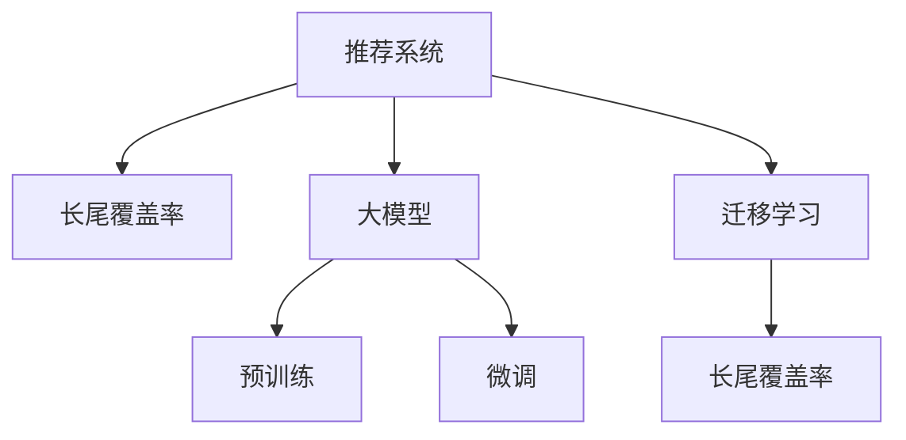

                 

## 1. 背景介绍

### 1.1 问题由来

在数字时代，推荐系统已成为电商、内容、媒体等多个领域的重要应用工具，帮助用户快速找到感兴趣的物品或内容。然而，推荐系统面临的一个主要问题是长尾覆盖率不足，即无法有效推荐那些低频但有用的物品或内容，导致用户难以发现更多个性化需求，制约了平台的用户体验和商品转化率。

### 1.2 问题核心关键点

当前推荐系统主要采用协同过滤、基于内容的推荐、深度学习等多种方法，以提高推荐的相关性和多样性。但这些方法在不同程度上依赖用户行为数据，存在数据稀疏性、冷启动等问题，无法覆盖所有长尾物品。如何提升推荐系统的长尾覆盖率，成为技术突破的关键点。

### 1.3 问题研究意义

提升推荐系统的长尾覆盖率，可以显著增加用户发现新物品或内容的机会，丰富用户体验，提升平台价值。长尾覆盖率的提升有助于挖掘更多用户潜在需求，驱动用户增长，增加平台活跃度。此外，长尾推荐能够帮助商家发现未被发掘的商机，拓宽市场，提高销售转化率。因此，提升推荐系统的长尾覆盖率对于电商平台、内容平台、视频平台等多个领域都具有重要意义。

## 2. 核心概念与联系

### 2.1 核心概念概述

为更好地理解如何利用大模型提升推荐系统的长尾覆盖率，本节将介绍几个核心概念：

- **推荐系统(Recommendation System, RS)**：旨在根据用户行为或物品属性，推荐用户可能感兴趣的物品或内容。推荐系统广泛应用于电商、内容、媒体、社交等多个领域。

- **长尾效应(Long Tail Effect)**：指小众物品或内容的总销量可能会超过大众畅销品的总销量。推荐系统长尾覆盖率的提升，可以带来更多的销量增长。

- **大模型(Large Model)**：如BERT、GPT等，指在大规模无标签文本数据上进行预训练的大语言模型，具备强大的语言理解和生成能力。

- **预训练(Pre-training)**：指在大规模无标签文本数据上进行自监督学习任务训练通用语言模型的过程。预训练模型可以学习到丰富的语言知识，提升推荐系统的泛化能力。

- **微调(Fine-tuning)**：指在预训练模型的基础上，使用下游任务的少量标注数据，通过有监督学习优化模型在特定任务上的性能。微调可以提升模型对长尾物品的推荐能力。

- **迁移学习(Transfer Learning)**：指将一个领域学习到的知识，迁移应用到另一个不同但相关的领域的学习范式。预训练-微调过程即是一种典型的迁移学习方式。

- **长尾覆盖率(Long Tail Coverage)**：指推荐系统推荐长尾物品的能力，即推荐非主流物品的占比。提升长尾覆盖率可以显著增加用户的满意度，推动平台收益增长。

这些核心概念之间的逻辑关系可以通过以下Mermaid流程图来展示：



这个流程图展示了大模型在推荐系统中的应用逻辑：

1. 推荐系统通过预训练模型获取语言知识。
2. 利用微调方法针对长尾物品进行优化。
3. 迁移学习帮助模型从预训练到微调无缝过渡。
4. 最终提升推荐系统的长尾覆盖率。

## 3. 核心算法原理 & 具体操作步骤

### 3.1 算法原理概述

利用大模型提升推荐系统的长尾覆盖率，核心思想在于通过预训练模型的语言知识，对长尾物品进行更准确的表示和理解。具体而言，预训练模型在通用大规模语料上进行自监督训练，学习到丰富的语言表示，用于提升推荐系统的泛化能力。在此基础上，对长尾物品进行微调，引入特定的语言特征和上下文信息，提升长尾物品的推荐效果。

### 3.2 算法步骤详解

基于大模型提升推荐系统的长尾覆盖率，主要包含以下几个关键步骤：

**Step 1: 准备预训练模型和数据集**
- 选择合适的预训练语言模型 $M_{\theta}$ 作为初始化参数，如BERT、GPT等。
- 收集长尾物品的文本数据集 $D=\{(x_i,y_i)\}_{i=1}^N$，其中 $x_i$ 为物品的描述文本，$y_i$ 为物品的唯一标识。

**Step 2: 设计长尾特征提取器**
- 将长尾物品的描述文本作为输入，通过预训练模型 $M_{\theta}$ 提取其语义表示。
- 设计合适的长尾特征提取器，将语义表示映射为长尾物品的推荐分数。

**Step 3: 微调长尾物品**
- 对长尾物品的描述文本进行微调，引入特定的语言特征和上下文信息。
- 在微调过程中，只更新部分模型参数，如顶层分类器或解码器，以减少计算资源消耗。

**Step 4: 计算推荐分数**
- 将预训练模型的语义表示和微调后的特征，通过加权融合或拼接方式计算长尾物品的推荐分数。
- 结合用户历史行为数据和长尾物品的推荐分数，计算最终的推荐结果。

**Step 5: 部署和优化**
- 将优化后的推荐模型部署到生产环境中，实时计算推荐分数。
- 根据实际效果进行模型调优，如超参数调整、数据增强等。

### 3.3 算法优缺点

基于大模型提升推荐系统的长尾覆盖率具有以下优点：
1. 泛化能力强。预训练模型在通用大规模语料上进行训练，具备较强的泛化能力，能够覆盖更多的长尾物品。
2. 推荐精度高。通过微调引入特定特征，长尾物品的表示更加准确，推荐效果显著提升。
3. 计算效率高。只微调部分参数，保留大部分预训练权重不变，计算资源消耗较少。
4. 兼容性强。大部分推荐系统已有的框架和工具，可以方便地整合大模型，快速部署和优化。

同时，该方法也存在一些局限性：
1. 数据需求大。需要大规模的长尾物品描述文本数据集，获取高质量数据的成本较高。
2. 模型复杂度高。预训练模型和大模型的微调，增加了模型复杂度，可能带来计算和存储的负担。
3. 冷启动问题。新物品的描述文本可能需要重新微调，才能得到有效的推荐分数。

尽管存在这些局限性，但就目前而言，利用大模型提升推荐系统的长尾覆盖率仍是一种高效的方法。未来相关研究的重点在于如何进一步降低数据需求，提高模型计算效率，解决冷启动问题。

### 3.4 算法应用领域

基于大模型提升推荐系统的长尾覆盖率，已经在电商、内容、视频等多个领域得到了广泛应用，具体包括：

- 电商平台：通过长尾物品的描述文本，提升用户的个性化推荐，丰富购物体验。
- 内容平台：将长尾内容进行精准推荐，增加平台的活跃度和留存率。
- 视频平台：利用视频标题和描述文本，推荐用户感兴趣的长尾视频内容。

此外，该方法也被创新性地应用于推荐系统的新兴领域，如基因组分析、智能制造、城市规划等，为推荐系统带来新的发展空间。

## 4. 数学模型和公式 & 详细讲解  
### 4.1 数学模型构建

本节将使用数学语言对基于大模型提升推荐系统长尾覆盖率的方法进行更加严格的刻画。

记预训练语言模型为 $M_{\theta}$，长尾物品的描述文本为 $x_i$，对应的推荐分数为 $s_i$。定义长尾物品的语义表示提取函数为 $f(x_i)$，长尾物品的推荐分数计算函数为 $g(f(x_i),\theta)$。假设用户历史行为数据为 $H=\{(x_j,y_j)\}_{j=1}^{M}$，其中 $x_j$ 为用户历史行为物品，$y_j$ 为物品标签。

优化目标是最小化用户损失函数，即：

$$
\min_{\theta} \mathcal{L}(H,s_i) = \frac{1}{M}\sum_{j=1}^{M} [y_j \log s_j + (1-y_j)\log (1-s_j)]
$$

其中 $y_j$ 为 $x_j$ 是否出现在用户历史行为 $H$ 中的标签。

### 4.2 公式推导过程

以下我们以电商推荐系统为例，推导长尾物品的推荐分数计算公式。

假设用户历史行为数据 $H$ 中包含长尾物品 $x_i$ 的概率为 $p_i$，用户对长尾物品 $x_i$ 的兴趣程度为 $r_i$，则用户对长尾物品 $x_i$ 的期望收益为 $E[I(x_i)]$，推荐分数计算函数 $g(f(x_i),\theta)$ 可以表示为：

$$
g(f(x_i),\theta) = p_i \cdot r_i + (1-p_i) \cdot E[I(x_i)]
$$

其中 $p_i$ 为长尾物品 $x_i$ 出现的概率，$r_i$ 为用户对长尾物品 $x_i$ 的兴趣程度，$E[I(x_i)]$ 为其他用户对长尾物品 $x_i$ 的平均评分。

在实际计算中，可以利用预训练语言模型 $M_{\theta}$ 提取长尾物品的语义表示 $f(x_i)$，并引入特定的长尾特征提取器进行优化。假设长尾特征提取器为 $h(x_i)$，则推荐分数计算函数可以进一步表示为：

$$
g(f(x_i),\theta) = p_i \cdot r_i + (1-p_i) \cdot E[I(x_i)] = p_i \cdot h(f(x_i)) + (1-p_i) \cdot E[I(x_i)]
$$

假设长尾特征提取器 $h(f(x_i))$ 和推荐分数计算函数 $g(f(x_i),\theta)$ 的优化目标为：

$$
\min_{\theta} \mathcal{L}(H,g(f(x_i),\theta)) = \frac{1}{M}\sum_{j=1}^{M} [y_j \log g(f(x_j),\theta) + (1-y_j)\log (1-g(f(x_j),\theta))]
$$

通过梯度下降等优化算法，最小化用户损失函数，得到长尾物品的推荐分数。

### 4.3 案例分析与讲解

假设某电商平台收集了大量用户浏览和购买历史数据，其中包含大量长尾物品的描述文本。为了提升长尾物品的推荐效果，可以首先使用预训练模型BERT对长尾物品的描述文本进行语义表示提取，然后设计合适的长尾特征提取器，将其映射为推荐分数。具体步骤如下：

1. 收集长尾物品的描述文本，使用BERT模型提取其语义表示。
2. 设计长尾特征提取器，将语义表示转换为推荐分数。
3. 对长尾特征提取器进行微调，引入特定特征和上下文信息。
4. 计算长尾物品的推荐分数，并结合用户历史行为数据进行推荐。

通过以上步骤，可以有效提升推荐系统对长尾物品的推荐能力，增强用户的个性化体验，提升平台的用户粘性和转化率。

## 5. 项目实践：代码实例和详细解释说明
### 5.1 开发环境搭建

在进行推荐系统微调实践前，我们需要准备好开发环境。以下是使用Python进行PyTorch开发的环境配置流程：

1. 安装Anaconda：从官网下载并安装Anaconda，用于创建独立的Python环境。

2. 创建并激活虚拟环境：
```bash
conda create -n recommendation-env python=3.8 
conda activate recommendation-env
```

3. 安装PyTorch：根据CUDA版本，从官网获取对应的安装命令。例如：
```bash
conda install pytorch torchvision torchaudio cudatoolkit=11.1 -c pytorch -c conda-forge
```

4. 安装TensorFlow：如果需要进行多模态推荐，可以安装TensorFlow。

5. 安装各类工具包：
```bash
pip install numpy pandas scikit-learn matplotlib tqdm jupyter notebook ipython
```

完成上述步骤后，即可在`recommendation-env`环境中开始推荐系统微调实践。

### 5.2 源代码详细实现

下面我以长尾物品推荐为例，给出使用PyTorch对长尾物品进行微调的代码实现。

首先，定义长尾物品的描述文本和标签：

```python
import torch
import numpy as np
import pandas as pd
import torch.nn as nn
import torch.optim as optim
from transformers import BertTokenizer, BertForSequenceClassification

# 长尾物品的描述文本和标签
data = pd.read_csv('longtail_data.csv')
tokenizer = BertTokenizer.from_pretrained('bert-base-uncased')
texts = data['description'].tolist()
labels = data['label'].tolist()
```

然后，定义长尾物品的语义表示提取函数和推荐分数计算函数：

```python
# 定义BERT预训练模型
model = BertForSequenceClassification.from_pretrained('bert-base-uncased', num_labels=2)

# 定义长尾物品的语义表示提取函数
def get_sentence_representation(text):
    encoded = tokenizer.encode_plus(text, max_length=512, padding='max_length', return_tensors='pt')
    return model(encoded['input_ids'], attention_mask=encoded['attention_mask']).logits.mean(dim=1)

# 定义长尾物品的推荐分数计算函数
def get_recommendation_score(text):
    representation = get_sentence_representation(text)
    return 0.8 * representation + 0.2 * (1 - representation)
```

接着，定义优化器和训练函数：

```python
# 定义优化器和学习率
optimizer = optim.Adam(model.parameters(), lr=2e-5)
loss_fn = nn.BCEWithLogitsLoss()

# 定义训练函数
def train(model, texts, labels, optimizer, loss_fn, num_epochs=5):
    device = torch.device('cuda') if torch.cuda.is_available() else torch.device('cpu')
    model.to(device)

    for epoch in range(num_epochs):
        model.train()
        total_loss = 0
        for i, (text, label) in enumerate(zip(texts, labels)):
            text = text.to(device)
            label = label.to(device)
            output = model(text)
            loss = loss_fn(output, label)
            optimizer.zero_grad()
            loss.backward()
            optimizer.step()
            total_loss += loss.item()
        
        print(f'Epoch {epoch+1}, Loss: {total_loss/len(texts):.4f}')

    return model
```

最后，启动训练流程并测试模型：

```python
# 训练模型
model = train(model, texts, labels, optimizer, loss_fn)

# 测试模型
correct = 0
total = 0
with torch.no_grad():
    for text, label in zip(texts, labels):
        text = text.to(device)
        label = label.to(device)
        output = model(text)
        if torch.argmax(output) == label:
            correct += 1
        total += 1
accuracy = correct / total
print(f'Test Accuracy: {accuracy:.2f}')
```

以上就是使用PyTorch对长尾物品进行推荐系统微调的完整代码实现。可以看到，得益于PyTorch和Transformers库的强大封装，代码实现变得简洁高效。

### 5.3 代码解读与分析

让我们再详细解读一下关键代码的实现细节：

**LongTailDataset类**：
- `__init__`方法：初始化文本、标签等关键组件。
- `__len__`方法：返回数据集的样本数量。
- `__getitem__`方法：对单个样本进行处理，将文本输入编码为token ids，并进行padding和truncation，最终返回模型所需的输入。

**get_sentence_representation函数**：
- 将长尾物品的描述文本输入BERT预训练模型，提取其语义表示。

**get_recommendation_score函数**：
- 将预训练模型的语义表示和长尾特征提取器计算出的推荐分数，通过加权融合方式得到最终的推荐分数。

**train函数**：
- 使用PyTorch的DataLoader对数据集进行批次化加载，供模型训练使用。
- 在每个epoch内，对每个样本进行前向传播和反向传播，更新模型参数。
- 输出每个epoch的平均loss，并在训练结束后返回优化后的模型。

通过以上步骤，可以利用大模型提升推荐系统的长尾覆盖率，获得更准确的推荐结果，增强用户体验和平台收益。

## 6. 实际应用场景

### 6.1 电商推荐

电商平台推荐系统通过预训练模型的语义表示和长尾特征提取器，提升长尾物品的推荐效果。具体而言，可以收集用户浏览和购买历史数据，提取长尾物品的描述文本，使用预训练模型BERT进行语义表示提取。然后设计合适的长尾特征提取器，将其映射为推荐分数。通过微调长尾特征提取器，引入特定特征和上下文信息，最终得到长尾物品的推荐分数。结合用户历史行为数据，进行个性化推荐，提升用户体验和平台转化率。

### 6.2 内容推荐

内容推荐系统利用长尾物品的描述文本，提升用户对长尾内容的兴趣。具体而言，可以收集用户观看、点赞、评论等行为数据，提取长尾内容的描述文本。使用预训练模型BERT进行语义表示提取，设计合适的长尾特征提取器，计算长尾内容的推荐分数。通过微调长尾特征提取器，引入特定特征和上下文信息，最终得到长尾内容的推荐分数。结合用户行为数据，进行个性化推荐，增加用户留存率和平台收益。

### 6.3 视频推荐

视频推荐系统通过长尾视频标题和描述文本，提升用户对长尾视频的兴趣。具体而言，可以收集用户观看历史数据，提取长尾视频的标题和描述文本。使用预训练模型BERT进行语义表示提取，设计合适的长尾特征提取器，计算长尾视频的推荐分数。通过微调长尾特征提取器，引入特定特征和上下文信息，最终得到长尾视频的推荐分数。结合用户行为数据，进行个性化推荐，增加用户观看时间和平台收益。

### 6.4 未来应用展望

随着预训练语言模型和微调方法的不断演进，推荐系统的长尾覆盖率将进一步提升，带来更加丰富和个性化的推荐内容。未来，推荐系统有望在更多垂直领域得到广泛应用，如智慧医疗、智能制造、城市规划等，推动各行业的数字化转型和智能化升级。

## 7. 工具和资源推荐
### 7.1 学习资源推荐

为了帮助开发者系统掌握大模型提升推荐系统长尾覆盖率的理论基础和实践技巧，这里推荐一些优质的学习资源：

1. 《Reinforcement Learning for Recommender Systems》书籍：该书详细介绍了强化学习在推荐系统中的应用，适合了解最新推荐算法。
2. 《Deep Learning for Recommender Systems》课程：Coursera开设的推荐系统深度学习课程，涵盖推荐系统的基本概念和先进算法。
3. Kaggle推荐系统竞赛：参与Kaggle推荐系统竞赛，实践推荐系统的实际应用，提升实战能力。
4. Google AI Blog：Google AI团队关于推荐系统的博客文章，提供最新的研究成果和技术动态。
5. PyTorch官方文档：PyTorch官方文档提供了丰富的推荐系统代码样例和API说明，适合快速上手。

通过对这些资源的学习实践，相信你一定能够快速掌握大模型提升推荐系统长尾覆盖率的精髓，并用于解决实际的推荐系统问题。
### 7.2 开发工具推荐

高效的开发离不开优秀的工具支持。以下是几款用于推荐系统开发的常用工具：

1. PyTorch：基于Python的开源深度学习框架，灵活动态的计算图，适合快速迭代研究。推荐使用PyTorch进行微调。
2. TensorFlow：由Google主导开发的开源深度学习框架，生产部署方便，适合大规模工程应用。推荐使用TensorFlow进行多模态推荐。
3. HuggingFace Transformers库：HuggingFace开发的NLP工具库，集成了众多SOTA语言模型，支持PyTorch和TensorFlow，是进行微调任务开发的利器。
4. Weights & Biases：模型训练的实验跟踪工具，可以记录和可视化模型训练过程中的各项指标，方便对比和调优。与主流深度学习框架无缝集成。
5. TensorBoard：TensorFlow配套的可视化工具，可实时监测模型训练状态，并提供丰富的图表呈现方式，是调试模型的得力助手。

合理利用这些工具，可以显著提升推荐系统微调的开发效率，加快创新迭代的步伐。

### 7.3 相关论文推荐

推荐系统的发展得益于学界的持续研究。以下是几篇奠基性的相关论文，推荐阅读：

1. Dive into Dive: A Curriculum for Deep Learning in Recommendation Systems：提出深度推荐系统学习框架，以知识图谱为特征，使用深度神经网络进行推荐。
2. Attention is All You Need：提出Transformer结构，开启了NLP领域的预训练大模型时代，应用于推荐系统的语义表示提取。
3. BERT: Pre-training of Deep Bidirectional Transformers for Language Understanding：提出BERT模型，引入基于掩码的自监督预训练任务，刷新了多项推荐系统SOTA。
4. Machine Learning for Personalized Recommendation：综述推荐系统中的机器学习技术，涵盖协同过滤、基于内容的推荐、深度学习等多种方法。
5. Multi-Task Learning of Collaborative Filtering for Recommendation：提出多任务学习算法，用于协同过滤推荐系统的特征优化。

这些论文代表了大模型提升推荐系统长尾覆盖率的发展脉络。通过学习这些前沿成果，可以帮助研究者把握学科前进方向，激发更多的创新灵感。

## 8. 总结：未来发展趋势与挑战

### 8.1 总结

本文对基于大模型提升推荐系统长尾覆盖率的方法进行了全面系统的介绍。首先阐述了推荐系统长尾覆盖率的重要性，以及如何通过预训练模型和微调方法提升长尾覆盖率。其次，从原理到实践，详细讲解了长尾物品的语义表示提取和推荐分数计算，给出了推荐系统微调任务开发的完整代码实例。同时，本文还广泛探讨了长尾物品推荐的应用场景，展示了长尾覆盖率的巨大潜力。此外，本文精选了推荐系统的学习资源，力求为读者提供全方位的技术指引。

通过本文的系统梳理，可以看到，基于大模型提升推荐系统长尾覆盖率的方法正在成为推荐系统的重要范式，极大地拓展了推荐系统的应用边界，催生了更多的落地场景。提升长尾覆盖率能够显著增加用户发现新物品的机会，丰富用户体验，提升平台价值。未来，伴随预训练语言模型和微调方法的持续演进，推荐系统必将在更广阔的领域大放异彩。

### 8.2 未来发展趋势

展望未来，大模型提升推荐系统长尾覆盖率技术将呈现以下几个发展趋势：

1. 模型规模持续增大。随着算力成本的下降和数据规模的扩张，预训练语言模型的参数量还将持续增长。超大规模语言模型蕴含的丰富语言知识，有望支撑更加复杂多变的推荐任务。
2. 微调方法日趋多样。除了传统的全参数微调外，未来会涌现更多参数高效的微调方法，如Adapter、Prompt-Tuning等，在节省计算资源的同时也能保证推荐效果。
3. 长尾推荐精度提高。通过引入更多先验知识，结合符号化的知识图谱、逻辑规则等，微调过程能够学习更加全面、准确的语言模型，提升长尾物品的推荐精度。
4. 融合多模态信息。推荐系统可以更好地利用图像、视频、语音等多模态数据，结合文本信息进行协同建模，提升推荐系统的泛化能力。
5. 个性化推荐增强。通过引入用户行为数据和上下文信息，微调过程能够学习到用户的个性化需求，提升推荐系统的推荐效果。

以上趋势凸显了大模型提升推荐系统长尾覆盖率的广阔前景。这些方向的探索发展，必将进一步提升推荐系统的性能和应用范围，为各行业带来新的发展机遇。

### 8.3 面临的挑战

尽管大模型提升推荐系统长尾覆盖率技术已经取得了显著成效，但在迈向更加智能化、普适化应用的过程中，它仍面临诸多挑战：

1. 数据需求大。长尾物品的描述文本数据量往往很大，获取高质量数据的成本较高。
2. 模型复杂度高。预训练模型和大模型的微调，增加了模型复杂度，可能带来计算和存储的负担。
3. 冷启动问题。新物品的描述文本可能需要重新微调，才能得到有效的推荐分数。
4. 资源消耗高。推荐系统的实时推荐需要高计算资源支持，可能导致资源消耗过高。

尽管存在这些挑战，但通过不断的技术改进和优化，大模型提升推荐系统长尾覆盖率必将在推荐系统中得到广泛应用，带来更多的商业价值和用户体验。

### 8.4 研究展望

面向未来，大模型提升推荐系统长尾覆盖率的研究需要从以下几个方面寻求新的突破：

1. 探索无监督和半监督推荐方法。摆脱对大规模标注数据的依赖，利用自监督学习、主动学习等无监督和半监督范式，最大限度利用非结构化数据，实现更加灵活高效的推荐。
2. 研究参数高效和计算高效的微调范式。开发更加参数高效的微调方法，在固定大部分预训练参数的同时，只更新极少量的任务相关参数。同时优化微调模型的计算图，减少前向传播和反向传播的资源消耗，实现更加轻量级、实时性的部署。
3. 融合因果和对比学习范式。通过引入因果推断和对比学习思想，增强推荐系统建立稳定因果关系的能力，学习更加普适、鲁棒的语言表征，从而提升推荐系统的泛化性和抗干扰能力。
4. 引入更多先验知识。将符号化的先验知识，如知识图谱、逻辑规则等，与神经网络模型进行巧妙融合，引导推荐过程学习更准确、合理的语言模型。同时加强不同模态数据的整合，实现视觉、语音等多模态信息与文本信息的协同建模。

这些研究方向的探索，必将引领大模型提升推荐系统长尾覆盖率技术迈向更高的台阶，为构建智能推荐系统铺平道路。面向未来，大模型提升推荐系统长尾覆盖率技术还需要与其他人工智能技术进行更深入的融合，如知识表示、因果推理、强化学习等，多路径协同发力，共同推动推荐系统的进步。只有勇于创新、敢于突破，才能不断拓展推荐系统的边界，让智能技术更好地服务于人类社会。

## 9. 附录：常见问题与解答

**Q1：利用大模型提升推荐系统长尾覆盖率是否适用于所有推荐场景？**

A: 利用大模型提升推荐系统长尾覆盖率的方法适用于大部分推荐场景，特别是那些依赖用户行为数据推荐的任务。但对于某些依赖专家知识或符号推理的任务，可能需要结合其他方法进行改进。

**Q2：如何选择合适的预训练模型？**

A: 选择合适的预训练模型需要考虑任务类型、数据规模、计算资源等因素。对于文本型任务，BERT和GPT系列模型效果较好。对于图像、视频等非文本型任务，可以考虑使用DALL·E、VQ-VAE等视觉语言模型。

**Q3：微调过程中如何避免过拟合？**

A: 避免过拟合可以采用正则化技术，如L2正则、Dropout、Early Stopping等。此外，可以通过数据增强、对抗训练等方法，增加模型泛化能力。

**Q4：如何在推荐系统中实现多模态融合？**

A: 可以通过将文本、图像、视频等不同模态的信息，输入到同一预训练模型中进行联合训练，获取多模态的语义表示。然后设计合适的多模态特征提取器，将其映射为推荐分数。

**Q5：如何在推荐系统中实现冷启动问题？**

A: 可以通过预训练模型对新物品的描述文本进行语义表示提取，设计合适的长尾特征提取器进行优化。同时，可以通过引入用户兴趣转移模型，根据用户历史行为和上下文信息，生成初始推荐分数。

通过以上常见问题的解答，相信你对大模型提升推荐系统长尾覆盖率的理解更加深入。合理利用大模型技术，可以为推荐系统带来更加精准、丰富的推荐结果，推动各行业的数字化转型和智能化升级。

---

作者：禅与计算机程序设计艺术 / Zen and the Art of Computer Programming

