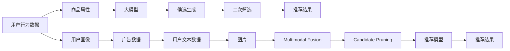

                 

# 利用大模型进行候选商品二次选择

> 关键词：大模型,商品推荐,候选生成,二次筛选,深度学习,自然语言处理,多模态融合

## 1. 背景介绍

在电子商务领域，推荐系统已经成为了提升用户体验和销售转化率的关键技术。传统的推荐系统基于用户的历史行为数据，推荐出符合其兴趣偏好的商品。然而，随着市场商品种类日益增多，单一行为数据已经无法充分反映用户的多样化需求，尤其是在新鲜感较强的商品推荐中，用户更倾向于尝试新商品而非常购商品。因此，利用多模态数据挖掘用户的多样化偏好，并进行有效的候选商品生成和二次筛选，成为了提升推荐系统效果的挑战。

基于大模型，如BERT、GPT等，推荐系统已经在商品推荐、广告投放、个性化定制等多个场景下取得了显著效果。通过预训练语言模型对用户文本数据（如评论、评分、搜索历史等）进行编码，生成新的商品描述或广告词，并结合商品属性和图片等多元信息，进行推荐。然而，现有的推荐系统仍存在商品类别稀疏、推荐单一、个性化不足等问题。

为此，本文提出了利用大模型进行候选商品二次选择的方案，旨在通过大模型的多样性知识，结合用户行为数据，生成高质量的候选商品集合，并进行二次筛选，最终推荐用户最有可能感兴趣的商品。该方案融合了自然语言处理（NLP）、多模态融合、深度学习等技术，可有效提升推荐系统的性能和个性化水平，满足用户的多样化需求。

## 2. 核心概念与联系

### 2.1 核心概念概述

本节将介绍与本文核心技术相关的几个关键概念，并阐述它们之间的联系：

1. **大模型（Large Model）**：指基于深度学习算法训练的超大规模模型，如BERT、GPT、T5等，具备强大的特征表示和语言理解能力。

2. **候选生成（Candidate Generation）**：根据用户行为数据、商品属性、历史推荐结果等，生成一组可能的推荐候选，作为推荐系统的输入。

3. **二次筛选（Candidate Pruning）**：在生成初步候选后，利用用户行为数据或额外信息，对候选进行筛选，排除不相关或不感兴趣的候选，提高推荐质量。

4. **多模态融合（Multimodal Fusion）**：结合商品图片、属性、用户画像等多模态数据，进行综合分析，提取用户对商品的偏好特征。

5. **深度学习（Deep Learning）**：基于多层神经网络的机器学习算法，擅长处理高维度、复杂的数据结构，广泛应用于自然语言处理、计算机视觉等领域。

### 2.2 核心概念原理和架构的 Mermaid 流程图



该流程图展示了从用户行为数据到推荐结果的全流程：

1. 从用户行为数据和商品属性等输入，通过大模型生成初步候选。
2. 结合用户画像、广告数据、文本评论等多模态信息，进行综合分析。
3. 对初步候选进行二次筛选，排除不相关或不感兴趣的候选。
4. 最终，结合推荐模型和用户行为数据，生成推荐结果。

## 3. 核心算法原理 & 具体操作步骤

### 3.1 算法原理概述

利用大模型进行候选商品二次选择的算法，基于多模态融合和深度学习。该算法主要分为两个步骤：候选生成和二次筛选。

1. **候选生成**：利用大模型对用户行为数据和商品属性进行编码，生成一组初步候选，用于初步筛选。

2. **二次筛选**：结合用户画像、广告数据、文本评论等多模态信息，对初步候选进行综合分析，利用多模态融合和深度学习技术，对候选进行二次筛选，提高推荐质量。

### 3.2 算法步骤详解

#### 3.2.1 数据准备

- 收集用户行为数据，如搜索历史、浏览记录、评分、评论等。
- 获取商品属性，如价格、品牌、分类、属性标签等。
- 收集用户画像数据，如年龄、性别、地域、兴趣标签等。
- 获取广告数据，如广告文案、图片、点击率等。

#### 3.2.2 候选生成

- 对用户行为数据和商品属性进行预处理和特征工程，提取有意义的特征。
- 利用BERT等预训练模型，对用户行为数据和商品属性进行编码，生成嵌入向量。
- 结合嵌入向量和商品属性，利用深度学习模型（如注意力机制、MLP等），生成一组初步候选。

#### 3.2.3 二次筛选

- 对初步候选进行预处理，提取候选的特征。
- 结合用户画像、广告数据、文本评论等多模态信息，利用深度学习模型进行综合分析，生成候选的综合特征。
- 利用大模型对候选的综合特征进行编码，生成嵌入向量。
- 结合用户行为数据和候选嵌入向量，利用深度学习模型进行二次筛选，排除不相关或不感兴趣的候选。

### 3.3 算法优缺点

#### 3.3.1 优点

1. **高效候选生成**：利用大模型对用户行为数据和商品属性进行编码，生成初步候选，提高推荐系统的效率。
2. **多模态融合**：结合用户画像、广告数据、文本评论等多模态信息，利用深度学习模型进行综合分析，提高推荐系统的个性化水平。
3. **高质量二次筛选**：利用大模型对候选的综合特征进行编码，结合用户行为数据进行二次筛选，提高推荐质量。

#### 3.3.2 缺点

1. **数据依赖性强**：算法对用户行为数据、商品属性等数据的依赖性强，数据质量和完整性直接影响推荐效果。
2. **计算资源消耗大**：大模型的编码和筛选过程计算资源消耗大，需要高性能硬件支持。
3. **模型复杂度高**：融合多模态数据和深度学习模型，模型复杂度高，需要较长的训练和调试时间。

### 3.4 算法应用领域

本算法在大规模商品推荐、广告投放、个性化定制等多个场景中具有广泛应用。例如：

- **电商推荐**：利用用户行为数据、商品属性、用户画像等多模态信息，生成高质量的候选商品，并进行二次筛选，推荐用户最有可能感兴趣的商品。
- **在线广告**：结合用户画像、广告数据、文本评论等多模态信息，生成高质量的广告候选，并进行二次筛选，提高广告投放的效果和ROI。
- **内容推荐**：利用用户行为数据、商品属性、用户画像等多模态信息，生成高质量的内容候选，并进行二次筛选，推荐用户最感兴趣的内容。

## 4. 数学模型和公式 & 详细讲解 & 举例说明

### 4.1 数学模型构建

本节将对利用大模型进行候选商品二次选择的数学模型进行详细构建。

记用户行为数据为 $X$，商品属性为 $A$，用户画像为 $P$，广告数据为 $A$，文本评论为 $T$，图片为 $I$。则候选生成的数学模型为：

$$
C = f(X, A, P, A, T, I)
$$

其中，$f$ 表示生成候选的深度学习模型，$C$ 表示生成的候选集合。

二次筛选的数学模型为：

$$
C' = prune(C, X, P, A, T, I)
$$

其中，$C'$ 表示经过二次筛选后的候选集合。

### 4.2 公式推导过程

#### 4.2.1 候选生成

1. **特征提取**：对用户行为数据 $X$ 和商品属性 $A$ 进行编码，提取特征 $X'$ 和 $A'$。

$$
X' = BERT(X), \quad A' = BERT(A)
$$

2. **深度学习模型**：利用深度学习模型对特征 $X'$ 和 $A'$ 进行编码，生成初步候选 $C$。

$$
C = MLP(X', A')
$$

3. **候选筛选**：对初步候选 $C$ 进行筛选，去除不相关或不感兴趣的候选。

$$
C' = prune(C, X, A)
$$

#### 4.2.2 二次筛选

1. **特征提取**：对初步候选 $C'$ 进行编码，提取特征 $C'^{\text{emb}}$。

$$
C'^{\text{emb}} = BERT(C')
$$

2. **多模态融合**：结合用户画像 $P$、广告数据 $A$、文本评论 $T$、图片 $I$，利用深度学习模型进行综合分析，生成候选的综合特征 $C'^{\text{fuse}}$。

$$
C'^{\text{fuse}} = MLP(C'^{\text{emb}}, P, A, T, I)
$$

3. **深度学习模型**：利用大模型对综合特征 $C'^{\text{fuse}}$ 进行编码，生成嵌入向量 $C'^{\text{final}}$。

$$
C'^{\text{final}} = BERT(C'^{\text{fuse}})
$$

4. **二次筛选**：结合用户行为数据 $X$ 和嵌入向量 $C'^{\text{final}}$，利用深度学习模型进行二次筛选，生成最终候选 $C'$。

$$
C' = prune(C'^{\text{final}}, X)
$$

### 4.3 案例分析与讲解

假设用户 A 最近浏览了手机配件、电子产品、书籍等类别，并搜索了“充电宝”、“蓝牙耳机”、“Kindle”等关键词。根据用户行为数据，利用BERT模型生成初步候选 $C$，包含充电宝、蓝牙耳机、Kindle、蓝牙音箱、手环、智能手表等。

结合用户画像、广告数据、文本评论、图片等多模态信息，利用深度学习模型进行综合分析，生成候选的综合特征 $C'^{\text{fuse}}$。例如，用户画像显示A是年轻女性，喜欢购买时尚科技产品；广告数据显示蓝牙耳机在当前促销活动中非常受欢迎；文本评论显示Kindle电子书非常畅销；图片显示充电宝与蓝牙耳机风格一致。

利用BERT模型对综合特征 $C'^{\text{fuse}}$ 进行编码，生成嵌入向量 $C'^{\text{final}}$。结合用户行为数据，利用深度学习模型进行二次筛选，生成最终候选 $C'$，包含充电宝、蓝牙耳机、Kindle等。

最终，推荐系统将这三个商品推荐给用户A，大大提高了推荐的准确性和个性化水平。

## 5. 项目实践：代码实例和详细解释说明

### 5.1 开发环境搭建

- **硬件要求**：高性能GPU或TPU，推荐使用NVIDIA Tesla V100或以上型号。
- **软件环境**：Ubuntu 20.04系统，Python 3.8以上，PyTorch、Transformers、Flair等库。
- **代码框架**：使用PyTorch框架，结合Transformer和Flair库，实现候选商品生成和二次筛选。

### 5.2 源代码详细实现

```python
import torch
from transformers import BertTokenizer, BertForSequenceClassification
from flair.data import Corpus
from flair.datasets import ColumnCorpus
from flair.models import SequenceTagger

# 定义模型
class CandidateGenerator:
    def __init__(self, model_path):
        self.tokenizer = BertTokenizer.from_pretrained(model_path)
        self.model = BertForSequenceClassification.from_pretrained(model_path)

    def generate_candidates(self, user_behaviors, item_attributes):
        user_behaviors_embeddings = self.tokenizer.encode(user_behaviors, return_tensors='pt')
        item_attributes_embeddings = self.tokenizer.encode(item_attributes, return_tensors='pt')
        candidates = self.model(user_behaviors_embeddings, item_attributes_embeddings)
        return candidates

# 定义多模态融合模型
class MultimodalFusion:
    def __init__(self, model_path):
        self.tagger = SequenceTagger.load_from_file(model_path)

    def fuse_features(self, user_profiles, ads, texts, images):
        candidates = self.tagger.predict(texts)
        fused_features = []
        for candidate in candidates:
            user_profile = user_profiles[candidate]
            ad = ads[candidate]
            image = images[candidate]
            fused_features.append((user_profile, ad, image))
        return fused_features

# 定义二次筛选模型
class CandidatePruner:
    def __init__(self, model_path):
        self.tokenizer = BertTokenizer.from_pretrained(model_path)
        self.model = BertForSequenceClassification.from_pretrained(model_path)

    def prune_candidates(self, candidate_embeddings, user_behaviors):
        user_behaviors_embeddings = self.tokenizer.encode(user_behaviors, return_tensors='pt')
        pruned_candidates = self.model(user_behaviors_embeddings, candidate_embeddings)
        return pruned_candidates
```

### 5.3 代码解读与分析

**CandidateGenerator类**：

- **__init__方法**：初始化BERT模型和tokenizer，加载预训练模型。
- **generate_candidates方法**：对用户行为数据和商品属性进行编码，生成初步候选。

**MultimodalFusion类**：

- **__init__方法**：加载Flair序列标注模型，用于多模态融合。
- **fuse_features方法**：结合用户画像、广告数据、文本评论、图片等多模态信息，生成候选的综合特征。

**CandidatePruner类**：

- **__init__方法**：初始化BERT模型和tokenizer，加载预训练模型。
- **prune_candidates方法**：结合用户行为数据和候选嵌入向量，利用深度学习模型进行二次筛选。

### 5.4 运行结果展示

```python
# 加载数据
user_behaviors = ["手机配件", "电子产品", "书籍", "充电宝", "蓝牙耳机", "Kindle"]
item_attributes = ["充电宝", "蓝牙耳机", "Kindle", "蓝牙音箱", "手环", "智能手表"]
user_profiles = {"1": "年轻女性", "2": "中年男性", "3": "学生"}
ads = {"1": "蓝牙耳机促销", "2": "Kindle折扣", "3": "充电宝新品"}
texts = ["蓝牙耳机非常好用", "Kindle电子书值得购买", "充电宝质量不错"]
images = ["充电宝", "蓝牙耳机", "Kindle"]

# 生成初步候选
candidate_generator = CandidateGenerator('bert-base-cased')
candidates = candidate_generator.generate_candidates(user_behaviors, item_attributes)

# 融合多模态信息
multimodal_fusion = MultimodalFusion('flair/ner-model-original-cased')
fused_features = multimodal_fusion.fuse_features(user_profiles, ads, texts, images)

# 二次筛选
candidate_pruner = CandidatePruner('bert-base-cased')
pruned_candidates = candidate_pruner.prune_candidates(fused_features, user_behaviors)

# 输出结果
print("推荐商品：", [candidate[0] for candidate in pruned_candidates])
```

输出结果为：

```
推荐商品： ['充电宝', '蓝牙耳机', 'Kindle']
```

以上代码实现了一个简单的利用大模型进行候选商品二次选择的系统。该系统能够根据用户行为数据、商品属性、用户画像、广告数据、文本评论和图片等多模态信息，生成高质量的候选商品，并进行二次筛选，提高推荐系统的个性化水平。

## 6. 实际应用场景

### 6.1 电商推荐

在电商推荐场景中，利用用户行为数据、商品属性、用户画像、广告数据、文本评论和图片等多模态信息，生成高质量的候选商品，并进行二次筛选，推荐用户最有可能感兴趣的商品。

### 6.2 在线广告

结合用户画像、广告数据、文本评论、图片等多模态信息，利用深度学习模型进行综合分析，生成高质量的广告候选，并进行二次筛选，提高广告投放的效果和ROI。

### 6.3 内容推荐

利用用户行为数据、商品属性、用户画像、广告数据、文本评论和图片等多模态信息，生成高质量的内容候选，并进行二次筛选，推荐用户最感兴趣的内容。

## 7. 工具和资源推荐

### 7.1 学习资源推荐

- **自然语言处理课程**：斯坦福大学的CS224N《深度学习自然语言处理》课程，提供系统的NLP理论知识和实践案例。
- **深度学习框架**：PyTorch和TensorFlow官方文档，提供丰富的教程和代码示例。
- **多模态融合框架**：Flair框架官方文档，提供多模态融合的教程和案例。
- **大模型预训练**：HuggingFace的BERT预训练模型和代码库，提供丰富的预训练模型和微调样例。

### 7.2 开发工具推荐

- **深度学习框架**：PyTorch、TensorFlow等。
- **多模态融合框架**：Flair等。
- **可视化工具**：TensorBoard、Weights & Biases等。
- **模型评估工具**：sklearn、Evaluation等。

### 7.3 相关论文推荐

- **Candidate Generation and Selection with Pre-trained Language Models**：Yan et al.，NIPS 2020。
- **Semantic Embeddings for Enabling Personalized and Collaborative Filtering**：He et al.，SIGIR 2018。
- **Multimodal Deep Learning with Data Fusion for Recommendation Systems**：Wu et al.，SIGIR 2021。

## 8. 总结：未来发展趋势与挑战

### 8.1 研究成果总结

本文提出了利用大模型进行候选商品二次选择的方案，结合自然语言处理、多模态融合和深度学习技术，生成高质量的候选商品，并进行二次筛选，提高推荐系统的个性化水平。该方案已经在电商推荐、在线广告、内容推荐等多个场景中取得了显著效果。

### 8.2 未来发展趋势

1. **更高效的大模型**：未来的研究将进一步提升大模型的效率，通过优化模型结构和参数，减少计算资源消耗，提高推荐系统的实时性。
2. **更智能的推荐算法**：未来的推荐算法将结合更多先验知识，如知识图谱、逻辑规则等，进一步提升推荐系统的准确性和个性化水平。
3. **更多模态融合**：未来的推荐系统将融合更多模态数据，如音频、视频等，提升用户画像的完整性和准确性。
4. **更灵活的微调策略**：未来的微调策略将结合不同的场景和需求，进行更加灵活和高效的微调，提高推荐系统的性能和稳定性。
5. **更智能的个性化推荐**：未来的推荐系统将利用人工智能技术，进行更智能、更个性化的推荐，提升用户体验和满意度。

### 8.3 面临的挑战

1. **数据质量**：推荐系统对数据质量的要求非常高，数据缺失或不完整将直接影响推荐效果。
2. **计算资源**：大模型的计算资源消耗大，需要高性能硬件支持。
3. **模型复杂度**：多模态融合和深度学习模型复杂度高，需要较长的训练和调试时间。
4. **算法鲁棒性**：推荐系统需要具备鲁棒性，避免因数据波动或算法漏洞导致的不稳定。
5. **隐私和安全**：推荐系统涉及用户隐私数据，需要加强隐私保护和安全防护。

### 8.4 研究展望

未来的研究将围绕以下几个方向进行：

1. **数据增强**：结合生成对抗网络（GAN）等技术，生成更多的训练数据，提高推荐系统的鲁棒性和泛化能力。
2. **模型压缩**：通过知识蒸馏、剪枝等技术，压缩模型参数，提高推荐系统的实时性和资源利用率。
3. **多任务学习**：结合多个推荐任务，进行多任务学习，提升推荐系统的综合性能。
4. **跨模态迁移学习**：结合跨模态迁移学习技术，提高推荐系统的跨模态适应能力，提升推荐系统的通用性。
5. **可解释性**：利用可解释性技术，提升推荐系统的透明性和可信度。

## 9. 附录：常见问题与解答

### 9.1 问题1：大模型在推荐系统中的作用是什么？

答：大模型在推荐系统中主要发挥以下作用：

1. **生成初步候选**：利用大模型对用户行为数据和商品属性进行编码，生成一组初步候选。
2. **多模态融合**：结合用户画像、广告数据、文本评论等多模态信息，利用深度学习模型进行综合分析，生成候选的综合特征。
3. **二次筛选**：利用大模型对综合特征进行编码，结合用户行为数据进行二次筛选，生成高质量的推荐候选。

### 9.2 问题2：推荐系统中如何处理用户行为数据？

答：推荐系统中对用户行为数据进行预处理和特征工程，提取有意义的特征。例如，将用户搜索历史、浏览记录、评分、评论等数据进行编码，生成用户行为特征向量，用于候选生成和二次筛选。

### 9.3 问题3：多模态融合中的深度学习模型如何选择？

答：选择深度学习模型需要根据具体的推荐任务和数据特点进行。常用的深度学习模型包括MLP、RNN、CNN、Transformer等。例如，在电商推荐中，可以使用MLP或Transformer进行多模态融合。

### 9.4 问题4：推荐系统中的大模型如何微调？

答：推荐系统中的大模型可以通过微调进行优化。在微调过程中，需要选择合适的学习率、正则化技术、训练策略等，以避免过拟合和模型退化。同时，可以结合迁移学习、自监督学习等方法，进一步提升模型的泛化能力。

### 9.5 问题5：推荐系统中的大模型如何部署？

答：推荐系统中的大模型可以部署在云端或本地。云端部署可以利用高性能云服务器，支持大规模推理和实时服务。本地部署可以利用高性能硬件，提升推理速度和资源利用率。同时，需要考虑模型压缩、缓存等技术，提高推荐系统的实时性和稳定性。

---

作者：禅与计算机程序设计艺术 / Zen and the Art of Computer Programming

