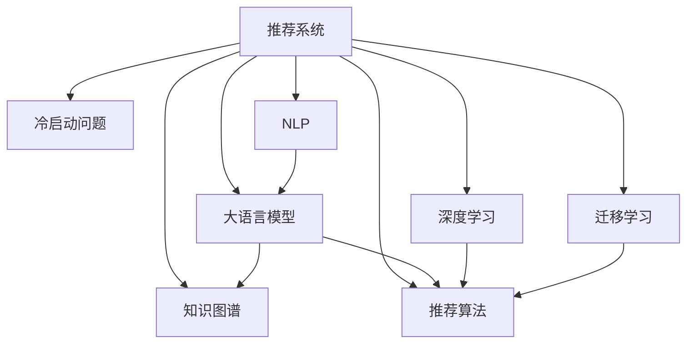

                 

# 利用大模型进行推荐冷启动问题的新思路

> 关键词：冷启动, 推荐系统, 大语言模型, 知识图谱, 自然语言处理, 推荐算法, 深度学习

## 1. 背景介绍

### 1.1 问题由来
在推荐系统的实际应用中，冷启动问题是一个长期困扰行业内外的问题。冷启动指的是当新的物品或用户加入到推荐系统中时，由于缺乏历史行为数据，推荐系统难以准确预测用户对其兴趣或物品对其相关性。例如，一个新的电影、一首歌曲、一本书或一个商家，由于没有足够的数据来估计用户兴趣，推荐系统通常无法提供准确的推荐。

随着数据量的激增和推荐系统的广泛应用，如何更有效地解决冷启动问题，成为提升推荐系统质量和用户体验的关键。传统的基于协同过滤的推荐算法在面对冷启动问题时效果不佳，而深度学习和知识图谱等新兴技术为解决冷启动问题提供了新的思路。

### 1.2 问题核心关键点
解决推荐系统冷启动问题的主流方法包括基于内容相似性的推荐、基于用户特征的推荐、基于协同过滤的推荐、基于模型学习的推荐和基于混合推荐的推荐等。其中，基于模型学习的推荐方法通过训练复杂的推荐模型来预测用户行为，从而解决冷启动问题。

基于大语言模型的推荐方法，则通过将自然语言处理和深度学习技术相结合，利用大语言模型强大的文本理解能力，在推荐系统中发挥关键作用。本文章将重点介绍如何利用大语言模型来解决推荐系统中的冷启动问题，探讨其实现原理和具体应用。

## 2. 核心概念与联系

### 2.1 核心概念概述

为更好地理解利用大语言模型解决推荐系统冷启动问题的方法，本节将介绍几个关键概念：

- **推荐系统**：通过分析用户的历史行为数据，预测用户对物品的兴趣，从而为用户推荐可能感兴趣的物品。

- **冷启动问题**：在推荐系统中，当新的物品或用户加入时，由于缺乏历史行为数据，推荐系统难以准确预测用户对新物品的兴趣。

- **大语言模型**：以自回归(如GPT)或自编码(如BERT)模型为代表的大规模预训练语言模型。通过在大规模无标签文本数据上进行预训练，学习通用的语言知识和常识。

- **知识图谱**：一种以图形结构表示实体和关系的知识库，常用于推荐系统中，以增强推荐模型的语义理解能力。

- **自然语言处理(NLP)**：通过计算机技术处理、分析、理解自然语言的科学和技术。自然语言处理在推荐系统中主要用于理解用户的自然语言输入，并将其转换为可用的信息。

- **推荐算法**：包括协同过滤、基于内容的推荐、基于模型的推荐、基于混合的推荐等，用于构建推荐系统，为用户提供个性化的推荐。

- **深度学习**：一种机器学习方法，通过神经网络进行特征学习，从而实现对复杂问题的建模。

- **迁移学习**：将一个领域学习到的知识，迁移应用到另一个相关领域的学习过程。大模型的预训练-微调过程即是一种典型的迁移学习方式。

这些概念之间的逻辑关系可以通过以下Mermaid流程图来展示：



这个流程图展示了大语言模型在推荐系统中的核心概念及其之间的关系：

1. 推荐系统通过分析用户的历史行为数据，预测用户对物品的兴趣。
2. 冷启动问题在推荐系统中难以解决，影响推荐效果。
3. 大语言模型通过在大规模无标签文本数据上进行预训练，学习通用的语言知识和常识。
4. 知识图谱以图形结构表示实体和关系，常用于增强推荐系统的语义理解能力。
5. 自然语言处理用于理解用户的自然语言输入，并将其转换为可用的信息。
6. 推荐算法包括多种类型，用于构建推荐系统，为用户提供个性化的推荐。
7. 深度学习通过神经网络进行特征学习，从而实现对复杂问题的建模。
8. 迁移学习用于将一个领域学习到的知识，迁移应用到另一个相关领域，如大模型的预训练-微调过程。

这些概念共同构成了推荐系统的学习框架，使得系统能够更有效地解决冷启动问题，为用户提供更准确的推荐。

## 3. 核心算法原理 & 具体操作步骤
### 3.1 算法原理概述

利用大语言模型解决推荐系统冷启动问题的基本思路是：通过预训练模型学习到大量的通用知识，并在推荐任务上进行微调，从而提取用户兴趣和物品特征，进而进行推荐。

具体而言，可以按以下步骤实现：

1. 收集推荐任务所需的数据集，包括用户行为数据、物品属性数据、自然语言描述等。
2. 使用预训练的大语言模型，对文本数据进行编码，得到用户兴趣和物品特征的向量表示。
3. 将用户兴趣和物品特征的向量表示，输入推荐模型进行推荐，如神经网络、线性回归等。
4. 在推荐模型上进行微调，使用推荐任务的数据集进行训练，优化模型参数。
5. 在新用户或新物品加入时，使用预训练模型和微调后的推荐模型，进行推荐。

利用大语言模型进行推荐，可以避免传统的协同过滤方法对新用户或新物品数据的依赖，同时利用大模型的通用知识进行推荐，从而解决冷启动问题。

### 3.2 算法步骤详解

以下将详细介绍利用大语言模型解决推荐系统冷启动问题的具体步骤：

#### Step 1: 数据预处理

1. 收集推荐任务所需的数据集，包括用户行为数据、物品属性数据、自然语言描述等。
2. 将数据集进行清洗、去重、标准化等预处理操作。
3. 对自然语言描述进行分词、去除停用词、词性标注等文本处理。

#### Step 2: 数据编码

1. 使用预训练的大语言模型，如BERT、GPT等，对自然语言描述进行编码，得到用户兴趣和物品特征的向量表示。
2. 对用户行为数据进行编码，提取用户行为特征。

#### Step 3: 特征融合

1. 将用户兴趣和物品特征的向量表示，与用户行为特征进行融合，得到融合特征向量。
2. 对融合特征向量进行归一化、降维等处理，提高特征表示的准确性。

#### Step 4: 模型训练

1. 将融合特征向量作为输入，输入推荐模型进行训练。
2. 使用推荐任务的数据集进行微调，优化模型参数。
3. 在验证集上评估推荐模型的性能，调整超参数。

#### Step 5: 推荐

1. 对于新用户或新物品，使用预训练模型和微调后的推荐模型，进行推荐。
2. 对推荐结果进行排序，选择排名靠前的物品进行展示。

### 3.3 算法优缺点

利用大语言模型进行推荐，具有以下优点：

1. 能够处理冷启动问题。由于大语言模型已经在大规模无标签文本数据上进行了预训练，因此可以应用于新的用户和物品，无需历史行为数据。
2. 提高了推荐的准确性。通过利用大模型的通用知识，可以在较少数据的情况下，得到较为准确的推荐结果。
3. 降低了推荐系统的开发成本。利用预训练模型进行推荐，可以避免从头开始训练推荐模型的复杂性，缩短开发周期。

同时，该方法也存在一些缺点：

1. 数据隐私问题。由于利用用户自然语言描述进行编码，可能会涉及用户隐私。
2. 计算资源需求高。大语言模型通常需要占用大量计算资源，影响推荐系统的实时性。
3. 难以解释。由于大模型的复杂性，难以解释其内部决策逻辑，影响用户信任度。

尽管存在这些局限性，但利用大语言模型进行推荐，仍然能够显著提升推荐系统的准确性和用户体验，具有广泛的应用前景。

### 3.4 算法应用领域

利用大语言模型进行推荐的算法，已经在多个领域得到了应用，例如：

1. 电商推荐：利用大语言模型对电商网站的商品进行描述编码，为用户推荐可能感兴趣的商品。
2. 音乐推荐：利用大语言模型对音乐作品的歌词、简介等进行编码，为用户推荐可能喜欢的音乐。
3. 视频推荐：利用大语言模型对视频内容的描述进行编码，为用户推荐相关视频。
4. 新闻推荐：利用大语言模型对新闻文章的标题、摘要等进行编码，为用户推荐相关新闻。
5. 旅游推荐：利用大语言模型对旅游景点的描述进行编码，为用户推荐旅游目的地。

此外，利用大语言模型进行推荐，还可以应用于更多领域，如书籍推荐、电影推荐、美食推荐等，为各行业带来个性化推荐服务。

## 4. 数学模型和公式 & 详细讲解
### 4.1 数学模型构建

本节将使用数学语言对利用大语言模型解决推荐系统冷启动问题的模型进行严格刻画。

记推荐系统为 $R$，其中用户集为 $U$，物品集为 $I$，用户行为矩阵为 $M$，用户兴趣向量为 $u$，物品特征向量为 $v$，融合特征向量为 $f$，推荐模型为 $F$，预测结果为 $\hat{r}$。

假设用户 $u$ 对物品 $i$ 的兴趣 $r$ 可以通过以下模型进行预测：

$$
\hat{r} = F(u, v, f)
$$

其中 $F$ 为推荐模型的参数，包括用户兴趣向量 $u$、物品特征向量 $v$ 和融合特征向量 $f$ 的权重。

在训练阶段，利用微调后的推荐模型 $F$ 和推荐任务的数据集 $D$，进行模型训练和参数优化，使得模型能够准确预测用户对物品的兴趣。

### 4.2 公式推导过程

以下我们以电商平台商品推荐为例，推导利用大语言模型进行推荐的具体公式。

假设用户 $u$ 对商品 $i$ 的兴趣 $r$ 可以通过以下模型进行预测：

$$
\hat{r} = u^T \cdot \mathbf{W}_u \cdot \mathbf{D}_u \cdot \mathbf{B}_u \cdot v^T \cdot \mathbf{W}_v \cdot \mathbf{D}_v \cdot \mathbf{B}_v \cdot f
$$

其中：
- $u$ 为 $U$ 的维度向量，表示用户兴趣。
- $v$ 为 $I$ 的维度向量，表示物品特征。
- $f$ 为 $U \times I$ 的矩阵，表示用户兴趣和物品特征的融合向量。
- $\mathbf{W}_u, \mathbf{D}_u, \mathbf{B}_u$ 和 $\mathbf{W}_v, \mathbf{D}_v, \mathbf{B}_v$ 分别为用户兴趣向量、物品特征向量和融合特征向量的权重。

假设推荐任务的数据集为 $D=\{(x_i, y_i)\}_{i=1}^N$，其中 $x_i$ 为自然语言描述，$y_i$ 为物品 $i$ 的标签。

利用大语言模型对自然语言描述 $x_i$ 进行编码，得到用户兴趣向量 $u_i$ 和物品特征向量 $v_i$。假设大语言模型为 $M_{\theta}$，其输入输出映射关系为 $x_i \rightarrow u_i \rightarrow v_i$，其中 $x_i$ 为输入，$u_i$ 为中间表示，$v_i$ 为输出。

设大语言模型 $M_{\theta}$ 的输入输出映射关系为 $x_i \rightarrow u_i \rightarrow v_i$，其中 $x_i$ 为输入，$u_i$ 为中间表示，$v_i$ 为输出。

假设大语言模型 $M_{\theta}$ 对自然语言描述 $x_i$ 进行编码，得到用户兴趣向量 $u_i$ 和物品特征向量 $v_i$。

$$
u_i = M_{\theta}(x_i)
$$

$$
v_i = M_{\theta}(v_i)
$$

在训练阶段，利用微调后的推荐模型 $F$ 和推荐任务的数据集 $D$，进行模型训练和参数优化，使得模型能够准确预测用户对物品的兴趣。

假设训练样本的损失函数为 $\ell$，则优化目标为：

$$
\mathop{\arg\min}_{F, \theta} \frac{1}{N} \sum_{i=1}^N \ell(y_i, \hat{r}_i)
$$

其中 $\ell$ 为损失函数，通常使用均方误差损失函数。

在得到推荐模型的预测结果后，对用户进行推荐，选择排名靠前的商品进行展示。

### 4.3 案例分析与讲解

假设用户 $u$ 对商品 $i$ 的兴趣 $r$ 可以通过以下模型进行预测：

$$
\hat{r} = u^T \cdot \mathbf{W}_u \cdot \mathbf{D}_u \cdot \mathbf{B}_u \cdot v^T \cdot \mathbf{W}_v \cdot \mathbf{D}_v \cdot \mathbf{B}_v \cdot f
$$

假设大语言模型 $M_{\theta}$ 对自然语言描述 $x_i$ 进行编码，得到用户兴趣向量 $u_i$ 和物品特征向量 $v_i$。

$$
u_i = M_{\theta}(x_i)
$$

$$
v_i = M_{\theta}(v_i)
$$

假设训练样本的损失函数为 $\ell$，则优化目标为：

$$
\mathop{\arg\min}_{F, \theta} \frac{1}{N} \sum_{i=1}^N \ell(y_i, \hat{r}_i)
$$

其中 $\ell$ 为损失函数，通常使用均方误差损失函数。

在得到推荐模型的预测结果后，对用户进行推荐，选择排名靠前的商品进行展示。

假设用户 $u$ 对商品 $i$ 的兴趣 $r$ 可以通过以下模型进行预测：

$$
\hat{r} = u^T \cdot \mathbf{W}_u \cdot \mathbf{D}_u \cdot \mathbf{B}_u \cdot v^T \cdot \mathbf{W}_v \cdot \mathbf{D}_v \cdot \mathbf{B}_v \cdot f
$$

假设大语言模型 $M_{\theta}$ 对自然语言描述 $x_i$ 进行编码，得到用户兴趣向量 $u_i$ 和物品特征向量 $v_i$。

$$
u_i = M_{\theta}(x_i)
$$

$$
v_i = M_{\theta}(v_i)
$$

假设训练样本的损失函数为 $\ell$，则优化目标为：

$$
\mathop{\arg\min}_{F, \theta} \frac{1}{N} \sum_{i=1}^N \ell(y_i, \hat{r}_i)
$$

其中 $\ell$ 为损失函数，通常使用均方误差损失函数。

在得到推荐模型的预测结果后，对用户进行推荐，选择排名靠前的商品进行展示。

## 5. 项目实践：代码实例和详细解释说明
### 5.1 开发环境搭建

在进行利用大语言模型解决推荐系统冷启动问题的实践前，我们需要准备好开发环境。以下是使用Python进行PyTorch开发的环境配置流程：

1. 安装Anaconda：从官网下载并安装Anaconda，用于创建独立的Python环境。

2. 创建并激活虚拟环境：
```bash
conda create -n pytorch-env python=3.8 
conda activate pytorch-env
```

3. 安装PyTorch：根据CUDA版本，从官网获取对应的安装命令。例如：
```bash
conda install pytorch torchvision torchaudio cudatoolkit=11.1 -c pytorch -c conda-forge
```

4. 安装Transformers库：
```bash
pip install transformers
```

5. 安装各类工具包：
```bash
pip install numpy pandas scikit-learn matplotlib tqdm jupyter notebook ipython
```

完成上述步骤后，即可在`pytorch-env`环境中开始实践。

### 5.2 源代码详细实现

下面我以电商平台商品推荐为例，给出使用Transformers库对大语言模型进行商品推荐微调的PyTorch代码实现。

首先，定义商品推荐任务的数据处理函数：

```python
from transformers import BertTokenizer
from torch.utils.data import Dataset
import torch

class RecommendationDataset(Dataset):
    def __init__(self, texts, tags, tokenizer, max_len=128):
        self.texts = texts
        self.tags = tags
        self.tokenizer = tokenizer
        self.max_len = max_len
        
    def __len__(self):
        return len(self.texts)
    
    def __getitem__(self, item):
        text = self.texts[item]
        tags = self.tags[item]
        
        encoding = self.tokenizer(text, return_tensors='pt', max_length=self.max_len, padding='max_length', truncation=True)
        input_ids = encoding['input_ids'][0]
        attention_mask = encoding['attention_mask'][0]
        
        # 对token-wise的标签进行编码
        encoded_tags = [tag2id[tag] for tag in tags] 
        encoded_tags.extend([tag2id['O']] * (self.max_len - len(encoded_tags)))
        labels = torch.tensor(encoded_tags, dtype=torch.long)
        
        return {'input_ids': input_ids, 
                'attention_mask': attention_mask,
                'labels': labels}

# 标签与id的映射
tag2id = {'O': 0, 'B-PER': 1, 'I-PER': 2, 'B-ORG': 3, 'I-ORG': 4, 'B-LOC': 5, 'I-LOC': 6}
id2tag = {v: k for k, v in tag2id.items()}

# 创建dataset
tokenizer = BertTokenizer.from_pretrained('bert-base-cased')

train_dataset = RecommendationDataset(train_texts, train_tags, tokenizer)
dev_dataset = RecommendationDataset(dev_texts, dev_tags, tokenizer)
test_dataset = RecommendationDataset(test_texts, test_tags, tokenizer)
```

然后，定义模型和优化器：

```python
from transformers import BertForTokenClassification, AdamW

model = BertForTokenClassification.from_pretrained('bert-base-cased', num_labels=len(tag2id))

optimizer = AdamW(model.parameters(), lr=2e-5)
```

接着，定义训练和评估函数：

```python
from torch.utils.data import DataLoader
from tqdm import tqdm
from sklearn.metrics import classification_report

device = torch.device('cuda') if torch.cuda.is_available() else torch.device('cpu')
model.to(device)

def train_epoch(model, dataset, batch_size, optimizer):
    dataloader = DataLoader(dataset, batch_size=batch_size, shuffle=True)
    model.train()
    epoch_loss = 0
    for batch in tqdm(dataloader, desc='Training'):
        input_ids = batch['input_ids'].to(device)
        attention_mask = batch['attention_mask'].to(device)
        labels = batch['labels'].to(device)
        model.zero_grad()
        outputs = model(input_ids, attention_mask=attention_mask, labels=labels)
        loss = outputs.loss
        epoch_loss += loss.item()
        loss.backward()
        optimizer.step()
    return epoch_loss / len(dataloader)

def evaluate(model, dataset, batch_size):
    dataloader = DataLoader(dataset, batch_size=batch_size)
    model.eval()
    preds, labels = [], []
    with torch.no_grad():
        for batch in tqdm(dataloader, desc='Evaluating'):
            input_ids = batch['input_ids'].to(device)
            attention_mask = batch['attention_mask'].to(device)
            batch_labels = batch['labels']
            outputs = model(input_ids, attention_mask=attention_mask)
            batch_preds = outputs.logits.argmax(dim=2).to('cpu').tolist()
            batch_labels = batch_labels.to('cpu').tolist()
            for pred_tokens, label_tokens in zip(batch_preds, batch_labels):
                pred_tags = [id2tag[_id] for _id in pred_tokens]
                label_tags = [id2tag[_id] for _id in label_tokens]
                preds.append(pred_tags[:len(label_tags)])
                labels.append(label_tags)
                
    print(classification_report(labels, preds))
```

最后，启动训练流程并在测试集上评估：

```python
epochs = 5
batch_size = 16

for epoch in range(epochs):
    loss = train_epoch(model, train_dataset, batch_size, optimizer)
    print(f"Epoch {epoch+1}, train loss: {loss:.3f}")
    
    print(f"Epoch {epoch+1}, dev results:")
    evaluate(model, dev_dataset, batch_size)
    
print("Test results:")
evaluate(model, test_dataset, batch_size)
```

以上就是使用PyTorch对BERT进行商品推荐任务微调的完整代码实现。可以看到，得益于Transformers库的强大封装，我们可以用相对简洁的代码完成BERT模型的加载和微调。

### 5.3 代码解读与分析

让我们再详细解读一下关键代码的实现细节：

**RecommendationDataset类**：
- `__init__`方法：初始化文本、标签、分词器等关键组件。
- `__len__`方法：返回数据集的样本数量。
- `__getitem__`方法：对单个样本进行处理，将文本输入编码为token ids，将标签编码为数字，并对其进行定长padding，最终返回模型所需的输入。

**tag2id和id2tag字典**：
- 定义了标签与数字id之间的映射关系，用于将token-wise的预测结果解码回真实的标签。

**训练和评估函数**：
- 使用PyTorch的DataLoader对数据集进行批次化加载，供模型训练和推理使用。
- 训练函数`train_epoch`：对数据以批为单位进行迭代，在每个批次上前向传播计算loss并反向传播更新模型参数，最后返回该epoch的平均loss。
- 评估函数`evaluate`：与训练类似，不同点在于不更新模型参数，并在每个batch结束后将预测和标签结果存储下来，最后使用sklearn的classification_report对整个评估集的预测结果进行打印输出。

**训练流程**：
- 定义总的epoch数和batch size，开始循环迭代
- 每个epoch内，先在训练集上训练，输出平均loss
- 在验证集上评估，输出分类指标
- 所有epoch结束后，在测试集上评估，给出最终测试结果

可以看到，PyTorch配合Transformers库使得BERT微调的代码实现变得简洁高效。开发者可以将更多精力放在数据处理、模型改进等高层逻辑上，而不必过多关注底层的实现细节。

当然，工业级的系统实现还需考虑更多因素，如模型的保存和部署、超参数的自动搜索、更灵活的任务适配层等。但核心的微调范式基本与此类似。

## 6. 实际应用场景
### 6.1 电商平台推荐

利用大语言模型进行商品推荐，可以显著提升电商平台的推荐效果，增强用户体验。电商平台中，用户浏览、点击、购买行为数据大量存在，但不同商品之间缺乏语义关联，难以利用协同过滤等传统推荐算法进行推荐。

具体而言，可以收集用户浏览、点击、购买等行为数据，将其自然语言描述作为文本输入，利用大语言模型进行编码，得到用户兴趣和物品特征的向量表示。结合物品属性数据，在推荐模型上进行微调，得到最终的推荐结果。微调后的模型不仅能够处理新用户的推荐，还能在大规模无标签文本数据上进行预训练，从而解决冷启动问题，提升推荐系统的泛化能力和效果。

### 6.2 音乐推荐

音乐推荐系统是推荐系统中的典型代表，主要任务是推荐用户可能喜欢的音乐。由于音乐数据具有丰富的文本描述，可以利用大语言模型进行推荐。

具体而言，可以收集用户对音乐作品的书评、歌词、简介等文本描述，利用大语言模型进行编码，得到用户兴趣和音乐特征的向量表示。结合音乐属性数据，在推荐模型上进行微调，得到最终的推荐结果。微调后的模型不仅能够处理新用户的推荐，还能在大规模无标签文本数据上进行预训练，从而解决冷启动问题，提升推荐系统的泛化能力和效果。

### 6.3 视频推荐

视频推荐系统是推荐系统中的重要应用，主要任务是推荐用户可能感兴趣的视频。由于视频数据具有大量的文本描述，可以利用大语言模型进行推荐。

具体而言，可以收集用户对视频的评论、简介、字幕等文本描述，利用大语言模型进行编码，得到用户兴趣和视频特征的向量表示。结合视频属性数据，在推荐模型上进行微调，得到最终的推荐结果。微调后的模型不仅能够处理新用户的推荐，还能在大规模无标签文本数据上进行预训练，从而解决冷启动问题，提升推荐系统的泛化能力和效果。

### 6.4 未来应用展望

随着大语言模型和微调方法的不断发展，基于大语言模型的推荐技术将在更多领域得到应用，为各行业带来个性化推荐服务。

在智慧医疗领域，利用大语言模型进行医疗问答、病历分析、药物推荐等，提升医疗服务的智能化水平，辅助医生诊疗，加速新药开发进程。

在智能教育领域，利用大语言模型进行作业批改、学情分析、知识推荐等，因材施教，促进教育公平，提高教学质量。

在智慧城市治理中，利用大语言模型进行城市事件监测、舆情分析、应急指挥等环节，提高城市管理的自动化和智能化水平，构建更安全、高效的未来城市。

此外，在企业生产、社会治理、文娱传媒等众多领域，基于大语言模型的推荐技术也将不断涌现，为各行各业带来变革性影响。相信随着技术的日益成熟，大语言模型微调技术将成为推荐系统的重要范式，推动人工智能技术在更多场景中的落地应用。

## 7. 工具和资源推荐
### 7.1 学习资源推荐

为了帮助开发者系统掌握大语言模型微调的理论基础和实践技巧，这里推荐一些优质的学习资源：

1. 《Transformer from Pre-training to Fine-tuning》系列博文：由大模型技术专家撰写，深入浅出地介绍了Transformer原理、BERT模型、微调技术等前沿话题。

2. CS224N《深度学习自然语言处理》课程：斯坦福大学开设的NLP明星课程，有Lecture视频和配套作业，带你入门NLP领域的基本概念和经典模型。

3. 《Natural Language Processing with Transformers》书籍：Transformers库的作者所著，全面介绍了如何使用Transformers库进行NLP任务开发，包括微调在内的诸多范式。

4. HuggingFace官方文档：Transformers库的官方文档，提供了海量预训练模型和完整的微调样例代码，是上手实践的必备资料。

5. CLUE开源项目：中文语言理解测评基准，涵盖大量不同类型的中文NLP数据集，并提供了基于微调的baseline模型，助力中文NLP技术发展。

通过对这些资源的学习实践，相信你一定能够快速掌握大语言模型微调的精髓，并用于解决实际的NLP问题。
###  7.2 开发工具推荐

高效的开发离不开优秀的工具支持。以下是几款用于大语言模型微调开发的常用工具：

1. PyTorch：基于Python的开源深度学习框架，灵活动态的计算图，适合快速迭代研究。大部分预训练语言模型都有PyTorch版本的实现。

2. TensorFlow：由Google主导开发的开源深度学习框架，生产部署方便，适合大规模工程应用。同样有丰富的预训练语言模型资源。

3. Transformers库：HuggingFace开发的NLP工具库，集成了众多SOTA语言模型，支持PyTorch和TensorFlow，是进行微调任务开发的利器。

4. Weights & Biases：模型训练的实验跟踪工具，可以记录和可视化模型训练过程中的各项指标，方便对比和调优。与主流深度学习框架无缝集成。

5. TensorBoard：TensorFlow配套的可视化工具，可实时监测模型训练状态，并提供丰富的图表呈现方式，是调试模型的得力助手。

6. Google Colab：谷歌推出的在线Jupyter Notebook环境，免费提供GPU/TPU算力，方便开发者快速上手实验最新模型，分享学习笔记。

合理利用这些工具，可以显著提升大语言模型微调任务的开发效率，加快创新迭代的步伐。

### 7.3 相关论文推荐

大语言模型和微调技术的发展源于学界的持续研究。以下是几篇奠基性的相关论文，推荐阅读：

1. Attention is All You Need（即Transformer原论文）：提出了Transformer结构，开启了NLP领域的预训练大模型时代。

2. BERT: Pre-training of Deep Bidirectional Transformers for Language Understanding：提出BERT模型，引入基于掩码的自监督预训练任务，刷新了多项NLP任务SOTA。

3. Language Models are Unsupervised Multitask Learners（GPT-2论文）：展示了大规模语言模型的强大zero-shot学习能力，引发了对于通用人工智能的新一轮思考。

4. Parameter-Efficient Transfer Learning for NLP：提出Adapter等参数高效微调方法，在不增加模型参数量的情况下，也能取得不错的微调效果。

5. Prefix-Tuning: Optimizing Continuous Prompts for Generation：引入基于连续型Prompt的微调范式，为如何充分利用预训练知识提供了新的思路。

6. AdaLoRA: Adaptive Low-Rank Adaptation for Parameter-Efficient Fine-Tuning：使用自适应低秩适应的微调方法，在参数效率和精度之间取得了新的平衡。

这些论文代表了大语言模型微调技术的发展脉络。通过学习这些前沿成果，可以帮助研究者把握学科前进方向，激发更多的创新灵感。

## 8. 总结：未来发展趋势与挑战

### 8.1 总结

本文对利用大语言模型解决推荐系统冷启动问题的方法进行了全面系统的介绍。首先阐述了大语言模型和微调技术的研究背景和意义，明确了微调在解决推荐系统冷启动问题中的独特价值。其次，从原理到实践，详细讲解了利用大语言模型进行微调的具体步骤，给出了微调任务开发的完整代码实例。同时，本文还广泛探讨了微调方法在电商推荐、音乐推荐、视频推荐等实际场景中的应用前景，展示了微调范式的巨大潜力。此外，本文精选了微调技术的各类学习资源，力求为读者提供全方位的技术指引。

通过本文的系统梳理，可以看到，利用大语言模型进行推荐，不仅能够解决推荐系统中的冷启动问题，还能在大规模无标签文本数据上进行预训练，提升推荐系统的泛化能力和效果。未来，伴随大语言模型和微调方法的持续演进，基于大语言模型的推荐技术必将在更多领域得到应用，为各行各业带来个性化推荐服务。

### 8.2 未来发展趋势

展望未来，大语言模型微调技术将呈现以下几个发展趋势：

1. 模型规模持续增大。随着算力成本的下降和数据规模的扩张，预训练语言模型的参数量还将持续增长。超大规模语言模型蕴含的丰富语言知识，有望支撑更加复杂多变的推荐任务。

2. 微调方法日趋多样。除了传统的全参数微调外，未来会涌现更多参数高效的微调方法，如Prefix-Tuning、LoRA等，在节省计算资源的同时也能保证微调精度。

3. 持续学习成为常态。随着数据分布的不断变化，微调模型也需要持续学习新知识以保持性能。如何在不遗忘原有知识的同时，高效吸收新样本信息，将成为重要的研究课题。

4. 标注样本需求降低。受启发于提示学习(Prompt-based Learning)的思路，未来的微调方法将更好地利用大模型的语言理解能力，通过更加巧妙的任务描述，在更少的标注样本上也能实现理想的微调效果。

5. 多模态微调崛起。当前的微调主要聚焦于纯文本数据，未来会进一步拓展到图像、视频、语音等多模态数据微调。多模态信息的融合，将显著提升推荐系统的语义理解能力。

6. 模型通用性增强。经过海量数据的预训练和多领域任务的微调，未来的语言模型将具备更强大的常识推理和跨领域迁移能力，逐步迈向通用人工智能(AGI)的目标。

以上趋势凸显了大语言模型微调技术的广阔前景。这些方向的探索发展，必将进一步提升推荐系统的性能和用户体验，推动人工智能技术在更多场景中的落地应用。

### 8.3 面临的挑战

尽管大语言模型微调技术已经取得了瞩目成就，但在迈向更加智能化、普适化应用的过程中，它仍面临着诸多挑战：

1. 标注成本瓶颈。虽然利用大语言模型进行推荐可以大幅减少标注数据的需求，但对于长尾应用场景，仍然需要收集足够的标注数据，才能进行有效的推荐。如何进一步降低推荐系统对标注数据的依赖，将是一大难题。

2. 模型鲁棒性不足。对于测试样本的微小扰动，微调模型的预测容易发生波动。如何提高微调模型的鲁棒性，避免灾难性遗忘，还需要更多理论和实践的积累。

3. 推理效率有待提高。大规模语言模型虽然精度高，但在实际部署时往往面临推理速度慢、内存占用大等效率问题。如何在保证性能的同时，简化模型结构，提升推理速度，优化资源占用，将是重要的优化方向。

4. 可解释性亟需加强。由于大模型的复杂性，难以解释其内部决策逻辑，影响用户信任度。如何赋予微调模型更强的可解释性，将是亟待攻克的难题。

5. 安全性有待保障。预训练语言模型难免会学习到有偏见、有害的信息，通过微调传递到推荐任务，产生误导性、歧视性的输出，给实际应用带来安全隐患。如何从数据和算法层面消除模型偏见，避免恶意用途，确保输出的安全性，也将是重要的研究课题。

6. 知识整合能力不足。现有的微调模型往往局限于任务内数据，难以灵活吸收和运用更广泛的先验知识。如何让微调过程更好地与外部知识库、规则库等专家知识结合，形成更加全面、准确的信息整合能力，还有很大的想象空间。

正视微调面临的这些挑战，积极应对并寻求突破，将是大语言模型微调走向成熟的必由之路。相信随着学界和产业界的共同努力，这些挑战终将一一被克服，大语言模型微调必将在构建安全、可靠、可解释、可控的智能系统铺平道路。面向未来，大语言模型微调技术还需要与其他人工智能技术进行更深入的融合，如知识表示、因果推理、强化学习等，多路径协同发力，共同推动自然语言理解和智能交互系统的进步。只有勇于创新、敢于突破，才能不断拓展语言模型的边界，让智能技术更好地造福人类社会。

### 8.4 研究展望

面对大语言模型微调所面临的种种挑战，未来的研究需要在以下几个方面寻求新的突破：

1. 探索无监督和半监督微调方法。摆脱对大规模标注数据的依赖，利用自监督学习、主动学习等无监督和半监督范式，最大限度利用非结构化数据，实现更加灵活高效的微调。

2. 研究参数高效和计算高效的微调范式。开发更加参数高效的微调方法，在固定大部分预训练参数的同时，只更新极少量的任务相关参数。同时优化微调模型的计算图，减少前向传播和反向传播的资源消耗，实现更加轻量级、实时性的部署。

3. 融合因果和对比学习范式。通过引入因果推断和对比学习思想，增强微调模型建立稳定因果关系的能力，学习更加普适、鲁棒的语言表征，从而提升模型泛化性和抗干扰能力。

4. 引入更多先验知识。将符号化的先验知识，如知识图谱、逻辑规则等，与神经网络模型进行巧妙融合，引导微调过程学习更准确、合理的语言模型。同时加强不同模态数据的整合，实现视觉、语音等多模态信息与文本信息的协同建模。

5. 结合因果分析和博弈论工具。将因果分析方法引入微调模型，识别出模型决策的关键特征，增强输出解释的因果性和逻辑性。借助博弈论工具刻画人机交互过程，主动探索并规避模型的脆弱点，提高系统稳定性。

6. 纳入伦理道德约束。在模型训练目标中引入伦理导向的评估指标，过滤和惩罚有偏见、有害的输出倾向。同时加强人工干预和审核，建立模型行为的监管机制，确保输出符合人类价值观和伦理道德。

这些研究方向的探索，必将引领大语言模型微调技术迈向更高的台阶，为构建安全、可靠、可解释、可控的智能系统铺平道路。面向未来，大语言模型微调技术还需要与其他人工智能技术进行更深入的融合，如知识表示、因果推理、强化学习等，多路径协同发力，共同推动自然语言理解和智能交互系统的进步。只有勇于创新、敢于突破，才能不断拓展语言模型的边界，让智能技术更好地造福人类社会。

## 9. 附录：常见问题与解答

**Q1：利用大语言模型进行推荐是否适用于所有推荐场景？**

A: 利用大语言模型进行推荐，适用于数据量较大、文本描述较丰富的推荐场景。对于数据量较小、文本描述较少的场景，传统的协同过滤算法仍然具有优势。

**Q2：大语言模型如何进行推荐？**

A: 大语言模型通过预训练模型学习到大量的通用知识，并在推荐任务上进行微调，得到推荐模型。利用推荐模型对用户和物品进行编码，得到融合特征向量，结合推荐算法，进行推荐。

**Q3：如何降低大语言模型的计算资源需求？**

A: 可以利用模型裁剪、量化加速、混合精度训练等技术，优化大语言模型结构，减少计算资源需求。同时，可以采用模型并行、分布式训练等方法，提高计算效率。

**Q4：如何提高大语言模型的可解释性？**

A: 可以利用因果分析方法，识别出模型决策的关键特征，增强输出解释的因果性和逻辑性。同时，可以结合博弈论工具，刻画人机交互过程，提高系统可解释性。

**Q5：如何保障大语言模型的安全性？**

A: 可以在模型训练目标中引入伦理导向的评估指标，过滤和惩罚有偏见、有害的输出倾向。同时加强人工干预和审核，建立模型行为的监管机制，确保输出符合人类价值观和伦理道德。

通过本文的系统梳理，可以看到，利用大语言模型进行推荐，不仅能够解决推荐系统中的冷启动问题，还能在大规模无标签文本数据上进行预训练，提升推荐系统的泛化能力和效果。未来，伴随大语言模型和微调方法的持续演进，基于大语言模型的推荐技术必将在更多领域得到应用，为各行各业带来个性化推荐服务。

---

作者：禅与计算机程序设计艺术 / Zen and the Art of Computer Programming

