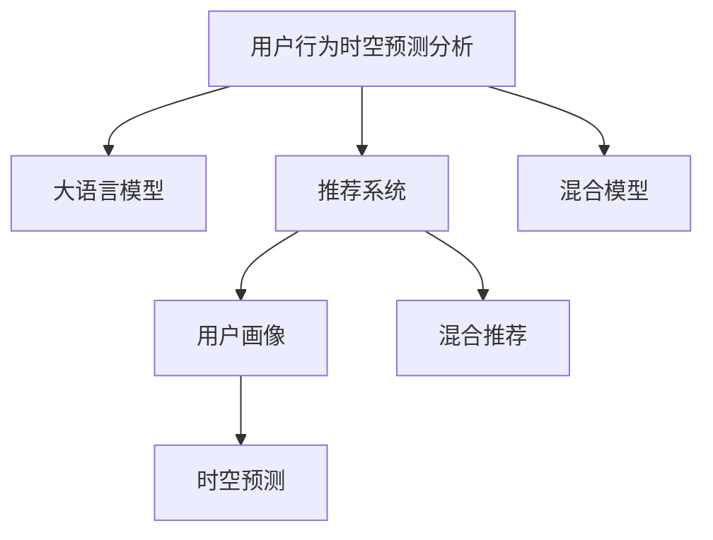

                 

# 利用大模型进行推荐场景的用户行为时空预测分析

## 1. 背景介绍

随着互联网技术的发展，推荐系统已经逐渐渗透到各个领域，如电商、社交网络、视频网站等。推荐系统通过分析用户的历史行为，预测用户未来的需求，从而提供个性化的内容和服务，极大地提升了用户体验和转化率。然而，推荐系统的效果在很大程度上依赖于对用户行为数据的深度分析和建模，这对数据处理、模型训练和预测提出了更高的要求。

近年来，深度学习技术的发展为推荐系统带来了新的突破。尤其是大语言模型（Large Language Models, LLMs）的引入，使得推荐系统在处理非结构化数据、理解用户意图等方面取得了显著进展。本文将聚焦于利用大模型进行推荐场景的用户行为时空预测分析，深入探讨其原理、算法步骤和实际应用。

## 2. 核心概念与联系

### 2.1 核心概念概述

在进行用户行为时空预测分析时，需要理解以下几个核心概念：

- **用户行为时空预测分析**：利用用户的地理位置、时间、行为等时空信息，预测用户未来的行为，如访问、购买、分享等。
- **大语言模型（LLMs）**：以自回归（如GPT）或自编码（如BERT）为代表的大规模预训练语言模型，通过在海量文本数据上进行预训练，学习到丰富的语言知识和常识。
- **推荐系统**：利用用户的兴趣偏好、行为历史等数据，为用户推荐个性化的内容和服务。
- **用户画像**：通过分析用户的各项数据，形成其行为特征和兴趣标签，用于构建个性化推荐策略。
- **时空预测**：结合时间、空间等维度，对用户行为进行预测，提升推荐系统的实时性和准确性。
- **混合推荐**：综合考虑用户画像、行为时空预测等因素，进行多渠道、多维度的推荐，增强推荐效果。

这些核心概念之间的联系可以通过以下Mermaid流程图来展示：



该流程图展示了用户行为时空预测分析的核心流程，即利用大模型进行多维度数据融合和预测，以提升推荐系统的效果。

## 3. 核心算法原理 & 具体操作步骤

### 3.1 算法原理概述

利用大模型进行用户行为时空预测分析的算法原理，主要基于预训练语言模型的自回归特性和语义理解能力。具体而言，通过在大规模文本数据上进行预训练，大模型能够学习到丰富的语言知识，如词语搭配、句法结构、语义关系等。然后，通过微调等方式，将大模型的预训练知识应用于特定推荐场景，从而预测用户的未来行为。

### 3.2 算法步骤详解

1. **数据准备**：
   - 收集用户的历史行为数据，如访问记录、浏览历史、购买记录等。
   - 将数据进行时间戳处理，提取用户在不同时间、地点的行为特征。
   - 进行特征工程，提取用户画像、兴趣标签等，用于构建推荐模型。

2. **模型预训练**：
   - 使用大规模文本数据，如维基百科、新闻等，对大模型进行预训练。
   - 通过自回归、掩码语言模型等任务，让模型学习到语言的知识表示。

3. **模型微调**：
   - 将预训练的大模型微调到特定推荐场景，如电商推荐、社交网络内容推荐等。
   - 使用推荐场景的数据集，进行有监督学习，优化模型的预测能力。

4. **时空预测**：
   - 结合时间、空间等维度，对用户的行为进行预测。
   - 利用大模型的语义理解能力，提取行为中的关键信息。

5. **推荐策略**：
   - 综合用户画像、时空预测结果，进行多渠道、多维度的推荐。
   - 利用混合推荐技术，将推荐结果与广告、内容、搜索等渠道结合，提升推荐效果。

### 3.3 算法优缺点

利用大模型进行用户行为时空预测分析的优点包括：

- 数据处理能力强：大模型能够处理大规模、高维度的非结构化数据，提升推荐系统的准确性。
- 知识迁移能力强：通过预训练-微调过程，大模型能够将通用的语言知识迁移到特定推荐场景中。
- 可解释性强：大模型能够提供详细的行为分析结果，帮助理解用户需求和偏好。

然而，该方法也存在以下缺点：

- 计算资源需求高：大模型的预训练和微调需要大量的计算资源和存储资源。
- 过拟合风险高：微调过程可能引入过拟合风险，特别是当标注数据较少时。
- 可解释性不足：大模型的黑盒特性，使得其决策过程难以解释。
- 实时性要求高：实时预测需要高效的计算和存储支持，可能面临资源瓶颈。

### 3.4 算法应用领域

利用大模型进行用户行为时空预测分析的应用领域广泛，涵盖了电商、社交网络、视频网站等多个行业。例如：

- **电商推荐**：通过分析用户的购买历史、浏览记录等数据，预测用户的下一个购买行为，提升个性化推荐效果。
- **社交网络内容推荐**：结合用户的时空信息，预测用户可能感兴趣的内容，增强社交互动体验。
- **视频网站推荐**：利用用户的行为数据，预测用户的观影喜好，推荐感兴趣的视频内容。
- **新闻推荐**：通过分析用户的阅读记录，预测用户的兴趣变化，提供个性化新闻内容。

## 4. 数学模型和公式 & 详细讲解 & 举例说明

### 4.1 数学模型构建

在进行用户行为时空预测分析时，需要构建数学模型来描述用户行为和时空关系。以下是一个简单的数学模型：

设用户 $u$ 在时间 $t$ 和地点 $l$ 的行为为 $x_{utl}$，其中 $x$ 为行为类型（如访问、购买），$t$ 为时间戳，$l$ 为地理位置。则用户 $u$ 在时间 $t_0$ 到 $t_1$ 和地点 $l_0$ 到 $l_1$ 的行为预测模型为：

$$
y_{utl} = f(x_{utl}, x_{utl'}) + \lambda_l(t, t_0) + \mu_l(l, l_0) + \epsilon
$$

其中，$f$ 为行为预测函数，$\lambda_l(t, t_0)$ 和 $\mu_l(l, l_0)$ 分别表示时间和空间上的影响函数，$\epsilon$ 为随机误差项。

### 4.2 公式推导过程

考虑一个简单的电商推荐场景，用户 $u$ 在时间 $t_1$ 购买了商品 $i$，预测其在时间 $t_2$ 是否购买商品 $j$。可以构建如下公式：

$$
y_{ujt_2} = f(x_{ujt_1}, x_{ujt_2}, x_{iut_1}, x_{it_1}) + \lambda_t(t_1, t_2) + \mu_j(j, i) + \epsilon
$$

其中，$x_{ujt_1}$ 和 $x_{it_1}$ 分别表示用户 $u$ 在时间 $t_1$ 和商品 $i$ 的特征向量，$\lambda_t(t_1, t_2)$ 和 $\mu_j(j, i)$ 分别表示时间和商品之间的影响函数。

通过上述公式，可以构建推荐模型，预测用户未来行为。

### 4.3 案例分析与讲解

以一个电商推荐系统的时空预测分析为例，分析其具体实现过程。

**数据准备**：
- 收集用户的历史购买数据，包括商品名称、价格、评分等。
- 将数据按时间戳进行分批处理，提取用户在不同时间段的行为特征。
- 提取用户的地理位置信息，如城市、区域等。

**模型预训练**：
- 使用大规模商品描述文本数据，对BERT模型进行预训练，学习商品之间的语义关系。
- 在电商推荐场景下微调BERT模型，使用推荐数据集进行监督学习，优化模型预测能力。

**时空预测**：
- 将用户购买历史和地理位置作为输入，使用微调后的BERT模型，预测用户未来购买行为。
- 结合时间间隔，预测用户在不同时间段的行为变化。

**推荐策略**：
- 综合用户画像、时空预测结果，进行多渠道、多维度的推荐。
- 利用混合推荐技术，将推荐结果与广告、内容、搜索等渠道结合，提升推荐效果。

## 5. 项目实践：代码实例和详细解释说明

### 5.1 开发环境搭建

在进行大模型应用时，需要准备好相应的开发环境。以下是一个基于Python的PyTorch开发环境配置流程：

1. 安装Anaconda：从官网下载并安装Anaconda，用于创建独立的Python环境。
2. 创建并激活虚拟环境：
```bash
conda create -n pytorch-env python=3.8 
conda activate pytorch-env
```
3. 安装PyTorch：根据CUDA版本，从官网获取对应的安装命令。例如：
```bash
conda install pytorch torchvision torchaudio cudatoolkit=11.1 -c pytorch -c conda-forge
```
4. 安装Transformers库：
```bash
pip install transformers
```
5. 安装各类工具包：
```bash
pip install numpy pandas scikit-learn matplotlib tqdm jupyter notebook ipython
```

完成上述步骤后，即可在`pytorch-env`环境中进行大模型的应用实践。

### 5.2 源代码详细实现

以下是基于BERT模型进行电商推荐场景时空预测分析的Python代码实现：

```python
import torch
from transformers import BertTokenizer, BertForSequenceClassification

# 数据准备
tokenizer = BertTokenizer.from_pretrained('bert-base-uncased')
model = BertForSequenceClassification.from_pretrained('bert-base-uncased', num_labels=2)

# 加载数据
train_data = read_train_data('train.csv')
dev_data = read_dev_data('dev.csv')
test_data = read_test_data('test.csv')

# 数据预处理
train_dataset = TokenDataset(train_data, tokenizer)
dev_dataset = TokenDataset(dev_data, tokenizer)
test_dataset = TokenDataset(test_data, tokenizer)

# 模型微调
optimizer = AdamW(model.parameters(), lr=2e-5)
for epoch in range(5):
    train_loss = train_epoch(model, train_dataset, optimizer)
    dev_loss = evaluate(model, dev_dataset)
    if dev_loss < best_loss:
        best_loss = dev_loss
        best_model = model.state_dict()

# 预测
predictions = predict(test_data, best_model)
```

**代码解读与分析**：
- `TokenDataset`类：将文本数据转换为模型可接受的格式，包含分词、编码、padding等操作。
- `BertForSequenceClassification`类：使用预训练的BERT模型进行序列分类任务，适用于电商推荐场景。
- `AdamW`优化器：使用AdamW优化器进行模型训练。
- `train_epoch`函数：定义训练过程，包括前向传播、损失计算、反向传播和参数更新。
- `evaluate`函数：定义验证过程，计算模型在验证集上的损失。
- `predict`函数：定义预测过程，使用微调后的模型进行用户行为预测。

## 6. 实际应用场景

### 6.1 智能客服系统

在智能客服系统中，利用大模型进行用户行为时空预测分析，可以实现自动化的用户意图识别和智能回答。例如，根据用户的地理位置、访问时间等信息，智能客服可以提供针对性的服务，如自动回答常见问题、引导用户进入相关服务流程等。

**实际应用流程**：
- 收集用户访问客服页面的日志，提取访问时间、地理位置等信息。
- 使用大模型对用户行为进行分析，预测用户意图。
- 根据用户意图，自动生成回答，提供智能客服服务。

### 6.2 金融舆情监测

金融领域需要实时监测市场舆论动向，以便及时应对负面信息传播，规避金融风险。利用大模型进行用户行为时空预测分析，可以实现对舆情的实时监测和预警。

**实际应用流程**：
- 收集金融领域相关的新闻、报道、评论等文本数据。
- 对文本数据进行时间戳处理，提取事件的时间信息和情感倾向。
- 使用大模型对事件进行情感分析，预测舆情变化趋势。
- 一旦发现舆情波动，自动触发预警机制，提醒相关部门注意。

### 6.3 个性化推荐系统

个性化推荐系统需要根据用户的行为和兴趣，推荐最符合用户需求的内容。利用大模型进行用户行为时空预测分析，可以提升推荐系统的精度和覆盖率。

**实际应用流程**：
- 收集用户的历史行为数据，如浏览记录、购买历史等。
- 对数据进行时间戳处理，提取用户在不同时间、地点的行为特征。
- 使用大模型对用户行为进行分析，预测用户未来的兴趣和需求。
- 根据预测结果，进行个性化推荐，提升用户体验。

### 6.4 未来应用展望

随着大模型技术的不断发展，利用大模型进行推荐场景的用户行为时空预测分析将有更广阔的应用前景。例如：

- **智能医疗**：利用用户的时空行为数据，预测用户的健康需求和疾病风险，提供个性化的医疗服务。
- **智能交通**：结合用户的出行数据，预测用户的出行路线和需求，优化交通系统。
- **智能家居**：分析用户的生活习惯和行为模式，提供个性化的智能家居服务。

## 7. 工具和资源推荐

### 7.1 学习资源推荐

为了帮助开发者系统掌握利用大模型进行推荐场景的用户行为时空预测分析的理论基础和实践技巧，这里推荐一些优质的学习资源：

1. 《Transformer from the Basics to Advanced》系列博文：由大模型技术专家撰写，深入浅出地介绍了Transformer原理、BERT模型、微调技术等前沿话题。
2. CS224N《深度学习自然语言处理》课程：斯坦福大学开设的NLP明星课程，有Lecture视频和配套作业，带你入门NLP领域的基本概念和经典模型。
3. 《Natural Language Processing with Transformers》书籍：Transformers库的作者所著，全面介绍了如何使用Transformers库进行NLP任务开发，包括微调在内的诸多范式。
4. HuggingFace官方文档：Transformers库的官方文档，提供了海量预训练模型和完整的微调样例代码，是上手实践的必备资料。
5. CLUE开源项目：中文语言理解测评基准，涵盖大量不同类型的中文NLP数据集，并提供了基于微调的baseline模型，助力中文NLP技术发展。

通过对这些资源的学习实践，相信你一定能够快速掌握利用大模型进行推荐场景的用户行为时空预测分析的精髓，并用于解决实际的NLP问题。

### 7.2 开发工具推荐

高效的开发离不开优秀的工具支持。以下是几款用于大模型应用开发的常用工具：

1. PyTorch：基于Python的开源深度学习框架，灵活动态的计算图，适合快速迭代研究。大部分预训练语言模型都有PyTorch版本的实现。
2. TensorFlow：由Google主导开发的开源深度学习框架，生产部署方便，适合大规模工程应用。同样有丰富的预训练语言模型资源。
3. Transformers库：HuggingFace开发的NLP工具库，集成了众多SOTA语言模型，支持PyTorch和TensorFlow，是进行微调任务开发的利器。
4. Weights & Biases：模型训练的实验跟踪工具，可以记录和可视化模型训练过程中的各项指标，方便对比和调优。与主流深度学习框架无缝集成。
5. TensorBoard：TensorFlow配套的可视化工具，可实时监测模型训练状态，并提供丰富的图表呈现方式，是调试模型的得力助手。

合理利用这些工具，可以显著提升大模型应用任务的开发效率，加快创新迭代的步伐。

### 7.3 相关论文推荐

大模型和微调技术的发展源于学界的持续研究。以下是几篇奠基性的相关论文，推荐阅读：

1. Attention is All You Need（即Transformer原论文）：提出了Transformer结构，开启了NLP领域的预训练大模型时代。
2. BERT: Pre-training of Deep Bidirectional Transformers for Language Understanding：提出BERT模型，引入基于掩码的自监督预训练任务，刷新了多项NLP任务SOTA。
3. Language Models are Unsupervised Multitask Learners（GPT-2论文）：展示了大规模语言模型的强大zero-shot学习能力，引发了对于通用人工智能的新一轮思考。
4. Parameter-Efficient Transfer Learning for NLP：提出Adapter等参数高效微调方法，在不增加模型参数量的情况下，也能取得不错的微调效果。
5. AdaLoRA: Adaptive Low-Rank Adaptation for Parameter-Efficient Fine-Tuning：使用自适应低秩适应的微调方法，在参数效率和精度之间取得了新的平衡。
6. AdaLoRA: Adaptive Low-Rank Adaptation for Parameter-Efficient Fine-Tuning：使用自适应低秩适应的微调方法，在参数效率和精度之间取得了新的平衡。

这些论文代表了大模型微调技术的发展脉络。通过学习这些前沿成果，可以帮助研究者把握学科前进方向，激发更多的创新灵感。

## 8. 总结：未来发展趋势与挑战

### 8.1 总结

本文对利用大模型进行推荐场景的用户行为时空预测分析进行了全面系统的介绍。首先阐述了大模型和推荐系统结合的基本原理和背景，明确了时空预测在推荐系统中的重要性和应用场景。其次，从原理到实践，详细讲解了时空预测的数学模型和算法步骤，给出了时空预测任务开发的完整代码实例。同时，本文还广泛探讨了时空预测方法在电商、智能客服、金融舆情等多个行业领域的应用前景，展示了时空预测范式的巨大潜力。此外，本文精选了时空预测技术的各类学习资源，力求为读者提供全方位的技术指引。

通过本文的系统梳理，可以看到，利用大模型进行推荐场景的用户行为时空预测分析技术正在成为推荐系统的重要范式，极大地提升了推荐系统的预测准确性和实时性。得益于大模型的强大的知识表示和语义理解能力，时空预测方法可以在更加复杂和多变的推荐场景中发挥作用，为推荐系统带来新的突破。未来，伴随预训练语言模型和时空预测技术的持续演进，相信推荐系统必将在更广阔的应用领域大放异彩。

### 8.2 未来发展趋势

展望未来，时空预测技术将呈现以下几个发展趋势：

1. **多模态时空预测**：结合视觉、语音等多模态数据，进行更加全面和准确的时空预测。
2. **实时化时空预测**：通过流式计算和大数据技术，实现实时时空预测，提升推荐系统的响应速度。
3. **自适应时空预测**：根据用户行为的变化，动态调整时空预测模型，增强模型的灵活性和适应性。
4. **联邦时空预测**：通过分布式计算和联邦学习技术，保护用户隐私的同时，提升时空预测的效果。
5. **跨领域时空预测**：在不同领域的应用场景中，进行跨领域的时空预测模型迁移，提升模型的泛化能力。

以上趋势凸显了时空预测技术的广阔前景。这些方向的探索发展，必将进一步提升推荐系统的性能和应用范围，为人工智能技术在推荐系统中的应用带来新的机遇。

### 8.3 面临的挑战

尽管时空预测技术已经取得了瞩目成就，但在迈向更加智能化、普适化应用的过程中，它仍面临着诸多挑战：

1. **计算资源瓶颈**：大模型的预训练和微调需要大量的计算资源和存储资源。如何优化模型结构和算法，提高计算效率，是未来需要解决的重要问题。
2. **数据质量问题**：推荐场景中存在大量噪声和不完整数据，如何清洗和处理数据，提升数据质量，也是时空预测需要关注的重要问题。
3. **模型可解释性**：大模型的黑盒特性，使得其决策过程难以解释。如何提高模型的可解释性，增强用户信任和接受度，是未来需要解决的重要问题。
4. **用户隐私保护**：在推荐系统中，如何保护用户隐私，防止数据泄露和滥用，也是时空预测技术需要关注的重要问题。

### 8.4 研究展望

面对时空预测技术所面临的种种挑战，未来的研究需要在以下几个方面寻求新的突破：

1. **数据增强与清洗**：开发更加高效的数据增强和清洗技术，提升数据质量，增强模型的鲁棒性。
2. **模型压缩与优化**：通过模型压缩和优化技术，提高模型的计算效率，降低资源消耗。
3. **混合推荐策略**：结合传统推荐算法和时空预测模型，进行多渠道、多维度的推荐，提升推荐效果。
4. **跨领域迁移学习**：研究跨领域的时空预测模型迁移，提升模型的泛化能力和适应性。
5. **隐私保护技术**：研究隐私保护技术，保护用户隐私，增强推荐系统的安全性和可靠性。

这些研究方向的探索，必将引领时空预测技术迈向更高的台阶，为构建安全、可靠、可解释、可控的智能推荐系统铺平道路。面向未来，时空预测技术还需要与其他人工智能技术进行更深入的融合，如知识表示、因果推理、强化学习等，多路径协同发力，共同推动推荐系统的进步。只有勇于创新、敢于突破，才能不断拓展推荐系统的边界，让智能技术更好地服务于人类社会。

## 9. 附录：常见问题与解答

**Q1：大模型在时空预测中的优势是什么？**

A: 大模型在时空预测中的优势主要体现在以下几个方面：

1. **数据处理能力强**：大模型能够处理大规模、高维度的非结构化数据，提升时空预测的准确性。
2. **知识迁移能力强**：通过预训练-微调过程，大模型能够将通用的语言知识迁移到特定时空预测场景中，增强模型的泛化能力。
3. **可解释性强**：大模型能够提供详细的行为分析结果，帮助理解用户需求和行为规律。

**Q2：如何进行用户画像的构建？**

A: 构建用户画像需要收集和分析用户的各类数据，如浏览记录、购买历史、社交行为等。具体步骤如下：

1. **数据收集**：通过日志、问卷、API接口等方式，收集用户的相关数据。
2. **特征提取**：对数据进行预处理和特征提取，如时间戳、地理位置、兴趣标签等。
3. **聚类分析**：使用聚类算法对用户数据进行分类，形成不同的用户群体。
4. **标签映射**：将聚类结果映射到预设的兴趣标签中，构建用户画像。

**Q3：如何评估时空预测模型的效果？**

A: 时空预测模型的评估需要综合考虑多个指标，如准确率、召回率、F1-score等。具体步骤如下：

1. **划分数据集**：将数据集划分为训练集、验证集和测试集，进行交叉验证。
2. **评估指标**：使用不同的评估指标，如准确率、召回率、F1-score等，评估模型的预测效果。
3. **模型调优**：根据评估结果，调整模型的超参数，进行模型调优。

**Q4：时空预测模型的实时性要求高，如何优化？**

A: 为了提升时空预测模型的实时性，需要考虑以下几个方面：

1. **模型压缩**：使用模型压缩技术，减少模型参数和计算量。
2. **流式计算**：使用流式计算技术，实现实时数据处理和预测。
3. **分布式计算**：使用分布式计算技术，提高计算效率，降低延迟。
4. **缓存技术**：使用缓存技术，提高数据访问速度，减少计算时间。

**Q5：时空预测模型是否适用于多模态数据？**

A: 时空预测模型可以适用于多模态数据，如文本、图像、音频等。具体步骤如下：

1. **数据融合**：将多模态数据进行融合，构建统一的数据格式。
2. **特征提取**：对多模态数据进行特征提取，如文本的词向量、图像的特征向量等。
3. **模型集成**：使用集成学习技术，将多模态数据进行集成，构建时空预测模型。
4. **模型训练**：使用多模态数据进行模型训练，优化模型参数。

通过合理利用多模态数据，可以进一步提升时空预测模型的性能和泛化能力。

**Q6：时空预测模型在电商推荐中的应用场景有哪些？**

A: 时空预测模型在电商推荐中的应用场景主要包括：

1. **个性化推荐**：根据用户的浏览记录和购买历史，预测用户未来的购买行为，提供个性化推荐。
2. **需求预测**：预测商品的销售趋势和库存需求，优化库存管理。
3. **用户行为分析**：分析用户的行为模式和偏好，制定更有效的营销策略。

通过时空预测模型，可以更好地理解用户的意图和需求，提供更加精准和及时的电商推荐服务。

**Q7：时空预测模型在智能客服中的应用场景有哪些？**

A: 时空预测模型在智能客服中的应用场景主要包括：

1. **自动意图识别**：根据用户的地理位置、访问时间等信息，自动识别用户的意图。
2. **智能回答**：根据用户的意图，自动生成回答，提供智能客服服务。
3. **需求预测**：预测用户的需求变化，优化服务流程。

通过时空预测模型，可以提升智能客服的响应速度和准确性，提高用户满意度。

**Q8：时空预测模型在金融舆情监测中的应用场景有哪些？**

A: 时空预测模型在金融舆情监测中的应用场景主要包括：

1. **舆情预测**：预测市场舆情的变化趋势，预警风险。
2. **情绪分析**：分析舆情中的情感倾向，评估市场情绪。
3. **舆情报告**：生成舆情报告，帮助相关部门制定应对策略。

通过时空预测模型，可以及时掌握市场舆情变化，规避金融风险，提升金融机构的决策效率。

**Q9：时空预测模型在个性化推荐系统中的应用场景有哪些？**

A: 时空预测模型在个性化推荐系统中的应用场景主要包括：

1. **行为预测**：预测用户的兴趣和需求，提供个性化推荐。
2. **内容推荐**：根据用户的行为预测，推荐感兴趣的内容。
3. **广告投放**：预测用户的行为趋势，优化广告投放策略。

通过时空预测模型，可以提升个性化推荐系统的精度和覆盖率，增强用户体验。

**Q10：时空预测模型的未来发展方向有哪些？**

A: 时空预测模型的未来发展方向主要包括：

1. **多模态时空预测**：结合视觉、语音等多模态数据，进行更加全面和准确的时空预测。
2. **实时化时空预测**：通过流式计算和大数据技术，实现实时时空预测，提升推荐系统的响应速度。
3. **自适应时空预测**：根据用户行为的变化，动态调整时空预测模型，增强模型的灵活性和适应性。
4. **联邦时空预测**：通过分布式计算和联邦学习技术，保护用户隐私的同时，提升时空预测的效果。
5. **跨领域时空预测**：在不同领域的应用场景中，进行跨领域的时空预测模型迁移，提升模型的泛化能力。

通过以上方向的探索发展，时空预测技术将有望在更广泛的应用场景中发挥作用，推动人工智能技术的进步。

---

作者：禅与计算机程序设计艺术 / Zen and the Art of Computer Programming

